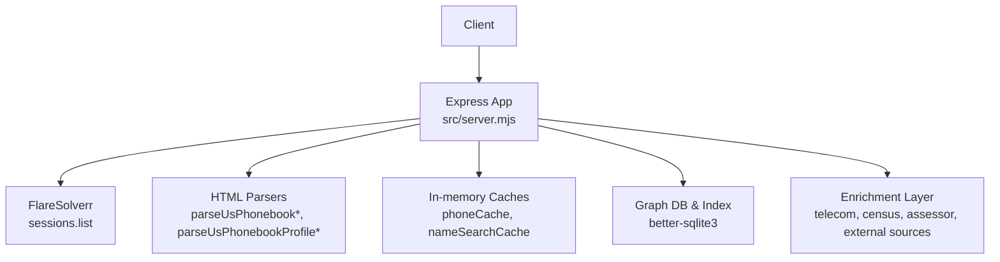
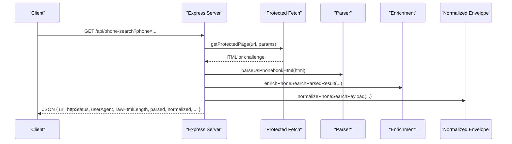
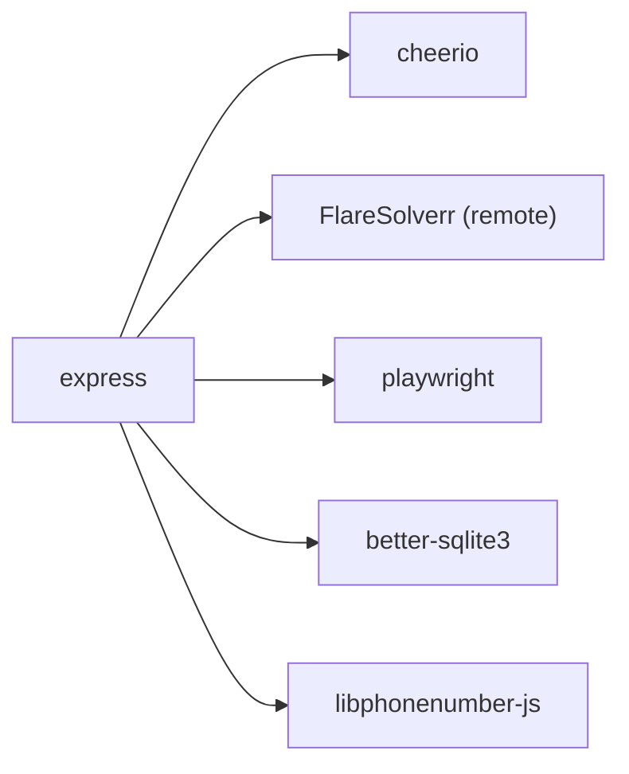

# API Reference

<cite>
**Referenced Files in This Document**
- [server.mjs](file://src/server.mjs)
- [normalizedResult.mjs](file://src/normalizedResult.mjs)
- [README.md](file://README.md)
- [package.json](file://package.json)
- [normalized-result.test.mjs](file://test/normalized-result.test.mjs)
- [fixture-phone-page.html](file://test/fixture-phone-page.html)
</cite>

## Table of Contents
1. [Introduction](#introduction)
2. [Project Structure](#project-structure)
3. [Core Components](#core-components)
4. [Architecture Overview](#architecture-overview)
5. [Detailed Component Analysis](#detailed-component-analysis)
6. [Dependency Analysis](#dependency-analysis)
7. [Performance Considerations](#performance-considerations)
8. [Troubleshooting Guide](#troubleshooting-guide)
9. [Conclusion](#conclusion)
10. [Appendices](#appendices)

## Introduction
This document describes the RESTful API exposed by the USPhoneBook Flare App. It covers public endpoints for health checks, phone and name searches, and profile enrichment. It documents HTTP methods, URL patterns, request/response schemas, authentication, normalized result contract, rate limiting, versioning, backwards compatibility, security, monitoring, and debugging.

## Project Structure
The API is implemented as an Express server with a focus on protected fetching via FlareSolverr and local Playwright fallback. The normalized result contract is produced by a dedicated module and is included alongside legacy payloads for backward compatibility.

**Diagram sources**
- [server.mjs](file://src/server.mjs)
- [normalizedResult.mjs](file://src/normalizedResult.mjs)

**Section sources**
- [server.mjs](file://src/server.mjs)
- [README.md](file://README.md)

## Core Components
- Express server with middleware and routing for public endpoints.
- Protected fetch engine selection: FlareSolverr or Playwright with automatic fallback.
- Normalized result contract for internal and downstream integrations.
- Caching for phone and name search results.
- Graph ingestion and enrichment pipeline.

**Section sources**
- [server.mjs](file://src/server.mjs)
- [normalizedResult.mjs](file://src/normalizedResult.mjs)

## Architecture Overview
The API orchestrates protected page fetching, parsing, enrichment, and normalization. Requests are routed to handlers that validate inputs, apply caching, and return structured payloads. The normalized envelope is generated consistently across phone search, name search, and profile lookup.

**Diagram sources**
- [server.mjs](file://src/server.mjs)
- [normalizedResult.mjs](file://src/normalizedResult.mjs)

## Detailed Component Analysis

### Endpoint: GET /api/health
- Method: GET
- Purpose: Health and diagnostics for the app, including FlareSolverr connectivity, cache stats, graph stats, vector status, and protected-fetch trust metrics.
- Response fields:
  - ok: boolean
  - sqlite: string (database path)
  - cache: object (cache stats)
  - graph: object (graph stats)
  - vector: object (vector store status)
  - flareBase: string (configured base URL)
  - protectedFetchEngine: string
  - protectedFetchCooldownMs: number
  - protectedFetchTrust: object (rolling trust metrics)
  - flareDefaultProxyConfigured: boolean
  - flareSessionReuse: boolean
  - flareSessionId: string|null
  - playwrightProfileDir: string
  - flare: object (FlareSolverr sessions.list result) or error on failure
- Status codes:
  - 200 on success
  - 503 on FlareSolverr connectivity failure

Common use cases:
- Verify app health and FlareSolverr availability.
- Monitor protected-fetch trust health.

Security considerations:
- No authentication required for this endpoint.

**Section sources**
- [server.mjs](file://src/server.mjs)

### Endpoint: GET /api/phone-search
- Method: GET
- URL: /api/phone-search
- Query parameters:
  - phone: required. 10 digits or dashed format (e.g., 207-242-0526).
  - maxTimeout: optional. Milliseconds for protected fetch timeout.
  - engine: optional. "flare", "playwright-local", or "auto".
  - proxy: optional. Proxy URL string for Flare request.
  - disableMedia: optional. "1"|"true"|"yes" to skip media.
  - wait: optional. Seconds to wait after challenge resolution.
  - ingest: optional. "0"|false|"no" to disable graph ingestion.
  - autoFollowProfile: optional. "1"|"true"|"yes" to auto-follow profile.
  - nocache: optional. Bypass cache when present.
- Response fields:
  - Legacy payload fields: url, httpStatus, userAgent, rawHtmlLength, fetchEngine, parsed, phoneMetadata, externalSources, graphIngest, normalized, rawHtml (optional).
  - normalized: object with schemaVersion, source, kind, query, meta, summary, records.
- Status codes:
  - 200 on success
  - 400 on invalid phone
  - 409 on challenge/session requirement
  - 500 on other errors

Common use cases:
- Reverse phone lookup with normalized result envelope.
- Auto-follow profile when a profile path is present.

Security considerations:
- No authentication required.

**Section sources**
- [server.mjs](file://src/server.mjs)
- [normalizedResult.mjs](file://src/normalizedResult.mjs)

### Endpoint: POST /api/phone-search
- Method: POST
- URL: /api/phone-search
- Request body:
  - phone: required. 10 digits or dashed format.
  - maxTimeout: optional.
  - engine: optional.
  - proxy: optional. { url: string }.
  - disableMedia: optional. true.
  - waitInSeconds: optional.
  - ingest: optional. "0"|false|"no" to disable graph ingestion.
  - autoFollowProfile: optional. "1"|"true"|"yes".
  - nocache: optional. Bypass cache when present.
- Response fields:
  - Same as GET /api/phone-search.

Common use cases:
- Bulk or programmatic phone search with JSON body.

Security considerations:
- No authentication required.

**Section sources**
- [server.mjs](file://src/server.mjs)
- [normalizedResult.mjs](file://src/normalizedResult.mjs)

### Endpoint: GET /api/name-search
- Method: GET
- URL: /api/name-search
- Query parameters:
  - name: required. First and last name; at least two words.
  - city: optional. Requires state.
  - state: optional. Two-letter or slug form.
  - maxTimeout: optional.
  - engine: optional.
  - proxy: optional. Proxy URL string.
  - disableMedia: optional. "1"|"true"|"yes".
  - wait: optional.
  - nocache: optional. Bypass cache when present.
- Response fields:
  - Legacy payload fields: url, httpStatus, userAgent, rawHtmlLength, search, parsed, externalNameSources, normalized.
  - normalized: object with schemaVersion, source, kind, query, meta, summary, records.

Common use cases:
- Name search mirroring USPhoneBook’s people-search route rewrite.

Security considerations:
- No authentication required.

**Section sources**
- [server.mjs](file://src/server.mjs)
- [normalizedResult.mjs](file://src/normalizedResult.mjs)

### Endpoint: POST /api/name-search
- Method: POST
- URL: /api/name-search
- Request body:
  - name: required. First and last name.
  - city: optional.
  - state: optional.
  - maxTimeout: optional.
  - engine: optional.
  - proxy: optional. { url: string }.
  - disableMedia: optional. true.
  - waitInSeconds: optional.
  - nocache: optional. Bypass cache when present.
- Response fields:
  - Same as GET /api/name-search.

Common use cases:
- Programmatic name search with JSON body.

Security considerations:
- No authentication required.

**Section sources**
- [server.mjs](file://src/server.mjs)
- [normalizedResult.mjs](file://src/normalizedResult.mjs)

### Endpoint: POST /api/profile
- Method: POST
- URL: /api/profile
- Request body:
  - path: optional. USPhoneBook profile path (e.g., "/john-doe/maine/portland").
  - entries: optional. Array of { path, sourceId, name }.
  - sourceId: optional. Defaults to "usphonebook_profile". Supports "usphonebook_profile", "truepeoplesearch", "fastpeoplesearch".
  - contextPhone: optional. Dashed phone for cross-references.
  - engine: optional.
  - maxTimeout: optional.
  - waitInSeconds: optional.
  - proxy: optional. { url: string }.
  - disableMedia: optional. true.
  - ingest: optional. "0"|false|"no" to disable graph ingestion.
  - includeRawHtml: optional. true to include rawHtml (truncated if large).
  - debug: optional. true to include rawHtml.
- Response fields:
  - Legacy payload fields: url, httpStatus, userAgent, rawHtmlLength, profile, fetchEngine, sourceId, rawHtml (optional).
  - normalized: object with schemaVersion, source, kind, query, meta, summary, records.
  - graphIngest: optional. { newFieldsByEntity, personId, runId } when enabled.

Common use cases:
- Profile enrichment across multiple sources with merging and optional graph ingestion.

Security considerations:
- No authentication required.

**Section sources**
- [server.mjs](file://src/server.mjs)
- [normalizedResult.mjs](file://src/normalizedResult.mjs)

### Normalized Result Contract
All public endpoints include a normalized envelope alongside legacy payloads. The normalized envelope ensures consistent downstream consumption.

Schema:
- schemaVersion: integer
- source: string
- kind: one of "phone_search", "name_search", "profile_lookup"
- query: object
  - phone_search: phoneDashed, phoneDisplay
  - name_search: name, city, state, path
  - profile_lookup: profilePath, contextPhone
- meta: object
  - url, httpStatus, userAgent, rawHtmlLength, cached, cachedAt, graphEligible, recordCount
- summary: object
  - phone_search: primaryDisplayName, relativeCount, hasProfile
  - name_search: totalRecords, totalPages, summaryText
  - profile_lookup: addressCount, phoneCount, relativeCount
- records: array of normalized records with shared fields:
  - recordId, recordType, displayName, profilePath, age, aliases[], emails[], phones[], addresses[], relatives[], sourceFields

Backwards compatibility:
- Existing raw payloads remain intact; normalized is additive.

Validation and tests:
- Tests demonstrate expected shapes and fields for each kind.

**Section sources**
- [normalizedResult.mjs](file://src/normalizedResult.mjs)
- [normalized-result.test.mjs](file://test/normalized-result.test.mjs)

### Authentication
- No authentication is required for public endpoints documented here.

**Section sources**
- [server.mjs](file://src/server.mjs)

### Rate Limiting
- No explicit rate limiting is enforced by the server for the public endpoints documented here.
- Protected fetches are throttled by a configurable cooldown to reduce burstiness.
- External sources and public enrichment endpoints are subject to upstream provider policies.

**Section sources**
- [server.mjs](file://src/server.mjs)
- [README.md](file://README.md)

### Versioning and Backwards Compatibility
- The normalized envelope includes a schemaVersion field to track structural changes.
- Legacy payloads are preserved for backward compatibility.
- The normalized envelope is used by graph rebuild flows and is intended for internal downstream integrations.

**Section sources**
- [normalizedResult.mjs](file://src/normalizedResult.mjs)
- [README.md](file://README.md)

### Security Considerations
- The app relies on FlareSolverr to bypass Cloudflare challenges; ensure FlareSolverr is reachable and configured securely.
- Protected fetch engine can be selected per request; "auto" mode tries Playwright first, then falls back to Flare.
- External sources may present Cloudflare or CAPTCHA challenges; the app surfaces challenge-required conditions.
- Use proxies judiciously and respect upstream policies.

**Section sources**
- [server.mjs](file://src/server.mjs)
- [README.md](file://README.md)

### Monitoring and Debugging
- Health endpoint exposes protected-fetch trust metrics and recent events.
- Live scrape logs can be enabled to observe protected fetch stages and outcomes.
- Debug flags:
  - includeRawHtml or debug to include raw HTML in responses (with truncation for large payloads).
  - SCRAPE_LOGGING and SCRAPE_PROGRESS_INTERVAL_MS for live logging.

**Section sources**
- [server.mjs](file://src/server.mjs)
- [README.md](file://README.md)

## Dependency Analysis
The API depends on:
- Express for routing and middleware.
- FlareSolverr for protected page fetching.
- Cheerio for HTML parsing.
- Playwright for local browser automation fallback.
- better-sqlite3 for graph storage and indexing.
- libphonenumber-js for phone metadata enrichment.

**Diagram sources**
- [package.json](file://package.json)
- [server.mjs](file://src/server.mjs)

**Section sources**
- [package.json](file://package.json)
- [server.mjs](file://src/server.mjs)

## Performance Considerations
- Session reuse: Reusing a Flare session can speed up requests but may increase resource usage; configure via environment variables.
- Media disabling: Setting disableMedia reduces page load overhead.
- Network latency: Proximity to FlareSolverr host affects latency.
- Wait-after: Adding waitSeconds can improve completeness on some pages.
- Caching: Phone and name search results are cached to avoid repeated protected fetches.

**Section sources**
- [README.md](file://README.md)
- [server.mjs](file://src/server.mjs)

## Troubleshooting Guide
Common issues and resolutions:
- FlareSolverr connectivity: Use the probe script to verify FlareSolverr sessions.list.
- Challenge-required responses: The app surfaces challengeRequired with challengeReason; adjust timeouts, proxies, or engines.
- Session-required sources: Some external sources require manual session checks; use source-session endpoints to manage sessions.
- Logging: Enable SCRAPE_LOGGING to observe protected fetch stages and outcomes.

**Section sources**
- [README.md](file://README.md)
- [server.mjs](file://src/server.mjs)

## Conclusion
The USPhoneBook Flare App exposes a robust set of public endpoints for phone and name searches and profile enrichment. Protected fetching is handled via FlareSolverr with Playwright fallback, and a normalized result envelope ensures consistent downstream consumption. The API is designed for reliability, observability, and extensibility while preserving backward compatibility.

## Appendices

### Protocol-Specific Examples
- GET /api/health
  - Request: GET http://127.0.0.1:3040/api/health
  - Response: JSON with health, cache, graph, vector, flare, protectedFetchTrust, and related fields
- GET /api/phone-search?phone=207-242-0526&maxTimeout=240000&engine=auto
  - Response: JSON with legacy payload and normalized envelope
- POST /api/phone-search
  - Request body: { phone: "207-242-0526", maxTimeout: 240000, engine: "auto" }
  - Response: JSON with legacy payload and normalized envelope
- GET /api/name-search?name=John+Doe&city=Portland&state=ME&maxTimeout=240000
  - Response: JSON with legacy payload and normalized envelope
- POST /api/name-search
  - Request body: { name: "John Doe", city: "Portland", state: "ME", maxTimeout: 240000 }
  - Response: JSON with legacy payload and normalized envelope
- POST /api/profile
  - Request body: { path: "/john-doe/maine/portland", contextPhone: "207-242-0526", ingest: true }
  - Response: JSON with legacy payload, normalized envelope, and optional rawHtml

**Section sources**
- [server.mjs](file://src/server.mjs)
- [normalizedResult.mjs](file://src/normalizedResult.mjs)