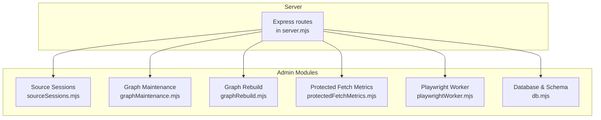
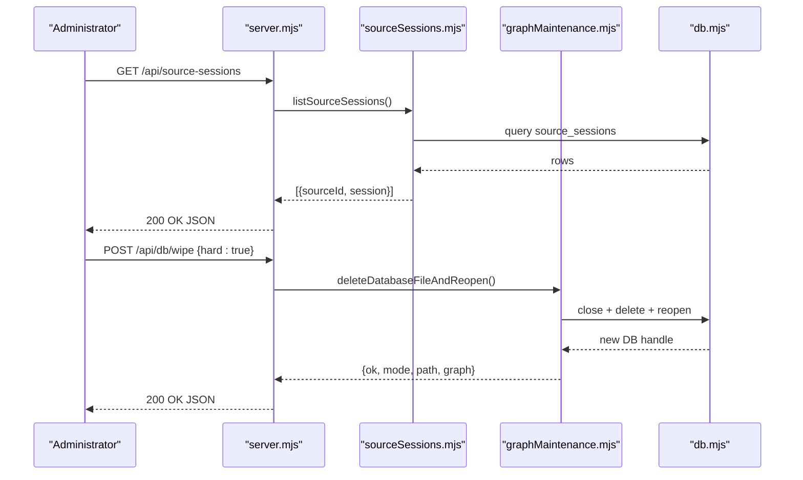
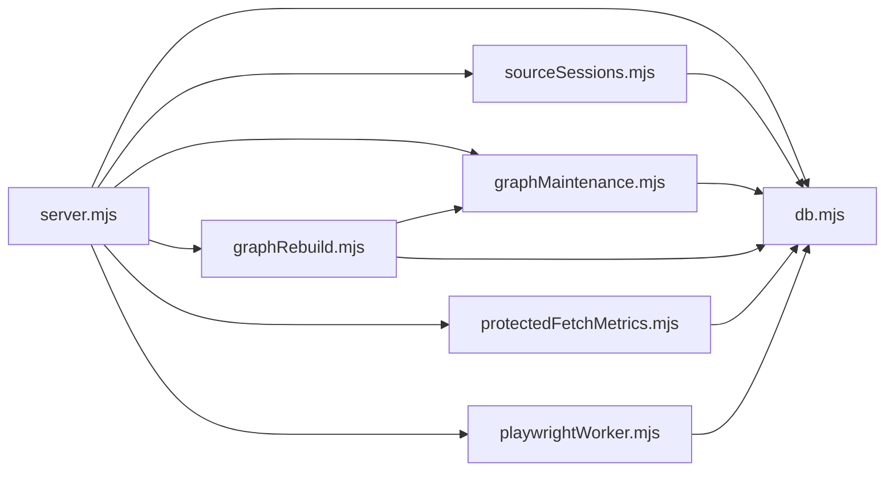

# Administrative Endpoints

<cite>
**Referenced Files in This Document**
- [server.mjs](file://src/server.mjs)
- [sourceSessions.mjs](file://src/sourceSessions.mjs)
- [graphMaintenance.mjs](file://src/graphMaintenance.mjs)
- [graphRebuild.mjs](file://src/graphRebuild.mjs)
- [db.mjs](file://src/db/db.mjs)
- [protectedFetchMetrics.mjs](file://src/protectedFetchMetrics.mjs)
- [playwrightWorker.mjs](file://src/playwrightWorker.mjs)
- [env.mjs](file://src/env.mjs)
</cite>

## Table of Contents
1. [Introduction](#introduction)
2. [Project Structure](#project-structure)
3. [Core Components](#core-components)
4. [Architecture Overview](#architecture-overview)
5. [Detailed Component Analysis](#detailed-component-analysis)
6. [Dependency Analysis](#dependency-analysis)
7. [Performance Considerations](#performance-considerations)
8. [Troubleshooting Guide](#troubleshooting-guide)
9. [Conclusion](#conclusion)

## Introduction
This document describes administrative endpoints for managing source sessions, graph maintenance, and system diagnostics. It covers:
- Source session management endpoints under /api/source-sessions
- Graph maintenance endpoints under /api/graph-data
- System diagnostics and health endpoints
- Operational procedures, monitoring integration patterns, and security considerations

Authentication and privilege requirements are documented per endpoint. The content is derived from the server implementation and supporting modules.

## Project Structure
Administrative endpoints are implemented in the Express server module and delegate to specialized modules for source sessions, graph maintenance, caching, and diagnostics.

**Diagram sources**
- [server.mjs](file://src/server.mjs)
- [sourceSessions.mjs](file://src/sourceSessions.mjs)
- [graphMaintenance.mjs](file://src/graphMaintenance.mjs)
- [graphRebuild.mjs](file://src/graphRebuild.mjs)
- [protectedFetchMetrics.mjs](file://src/protectedFetchMetrics.mjs)
- [playwrightWorker.mjs](file://src/playwrightWorker.mjs)
- [db.mjs](file://src/db/db.mjs)

**Section sources**
- [server.mjs](file://src/server.mjs)
- [env.mjs](file://src/env.mjs)

## Core Components
- Source Session Management: CRUD-like operations to inspect, open, check, clear, pause, and reset source sessions.
- Graph Maintenance: Health checks, stats, rebuild, and pruning operations.
- Diagnostics: Health endpoint, protected fetch metrics, and vector store status.
- Caching: Phone cache operations and enrichment cache utilities.

**Section sources**
- [server.mjs](file://src/server.mjs)
- [sourceSessions.mjs](file://src/sourceSessions.mjs)
- [graphMaintenance.mjs](file://src/graphMaintenance.mjs)
- [protectedFetchMetrics.mjs](file://src/protectedFetchMetrics.mjs)
- [playwrightWorker.mjs](file://src/playwrightWorker.mjs)
- [db.mjs](file://src/db/db.mjs)

## Architecture Overview
Administrative endpoints are RESTful routes mounted on the Express server. They call into domain modules that encapsulate persistence, scraping, and graph operations.

**Diagram sources**
- [server.mjs](file://src/server.mjs)
- [sourceSessions.mjs](file://src/sourceSessions.mjs)
- [graphMaintenance.mjs](file://src/graphMaintenance.mjs)
- [db.mjs](file://src/db/db.mjs)

## Detailed Component Analysis

### Source Session Management (/api/source-sessions)
These endpoints manage the lifecycle of source sessions, including interactive opening, health checking, clearing profiles, pausing, and resetting.

- GET /api/source-sessions
  - Returns a snapshot of all managed source sessions with their current state.
  - Response includes an array of { sourceId, session } entries.
  - Status codes: 200 on success, 500 on internal error.

- POST /api/source-sessions/:sourceId/open
  - Opens an interactive session for the given source using Playwright.
  - Request body may include url to override the default entry URL.
  - Response includes final URL, challenge detection, and updated session state.
  - Status codes: 200 on success, 500 on error.

- POST /api/source-sessions/:sourceId/check
  - Checks the session readiness using either the protected fetch engine or Playwright depending on session mode.
  - Supports autoOpenOnFailure to escalate to interactive mode when needed.
  - Response includes browser metadata, whether interaction was used, and updated session state.
  - Status codes: 200 on success, 500 on error.

- POST /api/source-sessions/:sourceId/clear
  - Clears the Playwright profile directory for the source scope and resets session state.
  - Response includes profile directory path and refreshed session state.
  - Status codes: 200 on success, 500 on error.

- POST /api/source-sessions/:sourceId/pause
  - Pauses or resumes the session; paused sessions are marked inactive.
  - Request body accepts paused: boolean.
  - Response includes the sourceId, paused flag, and updated sessions.
  - Status codes: 200 on success, 500 on error.

Operational notes:
- Interactive session opening uses Playwright persistent contexts keyed by source scope.
- Session state propagation applies updates across members sharing the same session scope.
- Challenge detection distinguishes Cloudflare challenges, CAPTCHA, and access denial.

Security and privileges:
- No built-in authentication or authorization middleware is present in the server module for these endpoints. Treat these as privileged administrative endpoints and apply network-level controls or reverse-proxy protections as appropriate.

**Section sources**
- [server.mjs](file://src/server.mjs)
- [sourceSessions.mjs](file://src/sourceSessions.mjs)
- [playwrightWorker.mjs](file://src/playwrightWorker.mjs)

### Graph Maintenance (/api/graph-data)
These endpoints support graph health, statistics, and maintenance operations.

- GET /api/graph
  - Returns either the full graph or a neighborhood around a center entity, with a configurable depth.
  - Query parameters: center (optional), depth (1–3).
  - Status codes: 200 on success, 500 on error.

- GET /api/graph/stats
  - Returns counts for entities, edges, merge snapshots, and response cache rows.
  - Status codes: 200 on success, 500 on error.

- POST /api/db/wipe
  - Wipes persisted graph data and optionally clears caches.
  - Body: { hard?: boolean }.
  - hard=true deletes the SQLite file and reopens a fresh database; otherwise soft-wipe clears graph tables and response cache.
  - Response includes mode, path, and updated graph stats.
  - Status codes: 200 on success, 500 on error.

- POST /api/graph/rebuild
  - Rebuilds the graph from queue items. Accepts an array of items with kinds "phone", "enrich", or normalized forms.
  - Response includes itemResults with ingestion outcomes per item.
  - Status codes: 200 on success, 500 on error.

- POST /api/graph/merge
  - Incrementally merges items into the existing graph without clearing first.
  - Response mirrors rebuild results for consistency.
  - Status codes: 200 on success, 500 on error.

Operational notes:
- Rebuild and merge operations clear indices and prune isolated nodes afterward.
- Enrichment steps are applied during ingestion for phone and profile items.

**Section sources**
- [server.mjs](file://src/server.mjs)
- [graphMaintenance.mjs](file://src/graphMaintenance.mjs)
- [graphRebuild.mjs](file://src/graphRebuild.mjs)
- [db.mjs](file://src/db/db.mjs)

### System Diagnostics and Monitoring (/api/health, /api/source-audit)
- GET /api/health
  - Aggregates system health: SQLite path, cache stats, graph stats, vector store status, Flare base URL, protected fetch engine, and cooldown settings.
  - Also returns protected fetch metrics and recent events.
  - Status codes: 200 on success, 500 on error.

- GET /api/source-audit
  - Provides an audit snapshot of source session states across the current runtime.
  - Status codes: 200 on success, 500 on error.

Monitoring integration patterns:
- Use /api/health to poll for system status and protected fetch health trends.
- Use /api/source-audit to correlate session statuses across related sources.
- Protected fetch metrics expose trust state, success rates, and recent events for alerting.

**Section sources**
- [server.mjs](file://src/server.mjs)
- [protectedFetchMetrics.mjs](file://src/protectedFetchMetrics.mjs)

## Dependency Analysis
Administrative endpoints depend on modularized subsystems. The server delegates to:
- Source session management for session state and Playwright profile operations
- Graph maintenance for pruning, clearing, and stats
- Protected fetch metrics for trust health and recent events
- Database module for schema initialization and wipe operations

**Diagram sources**
- [server.mjs](file://src/server.mjs)
- [sourceSessions.mjs](file://src/sourceSessions.mjs)
- [graphMaintenance.mjs](file://src/graphMaintenance.mjs)
- [graphRebuild.mjs](file://src/graphRebuild.mjs)
- [protectedFetchMetrics.mjs](file://src/protectedFetchMetrics.mjs)
- [playwrightWorker.mjs](file://src/playwrightWorker.mjs)
- [db.mjs](file://src/db/db.mjs)

**Section sources**
- [server.mjs](file://src/server.mjs)
- [db.mjs](file://src/db/db.mjs)

## Performance Considerations
- Source session checks: Prefer the protected fetch engine for optional-session sources to avoid headless fingerprinting; escalate to interactive mode only when necessary.
- Graph rebuild: Large rebuilds can be expensive; batch items and monitor ingestion results.
- Protected fetch metrics: Recent event buffers are bounded; tune PROTECTED_FETCH_METRICS_MAX via environment to balance memory and insight.
- Cache operations: Phone and enrichment caches are stored in SQLite; ensure adequate disk I/O and consider TTL adjustments for high-throughput scenarios.

[No sources needed since this section provides general guidance]

## Troubleshooting Guide
Common issues and remedies:
- Challenge Required or Timeout on protected fetch
  - Inspect /api/health for trustState and recent events.
  - Adjust engine selection or proxy configuration; reduce cooldown if throttling is suspected.
  - Use /api/source-sessions/:sourceId/check with autoOpenOnFailure to escalate to interactive mode.

- Session Paused or Inactive
  - Use /api/source-sessions/:sourceId/pause to resume.
  - Use /api/source-sessions/:sourceId/clear to reset browser profile and state.

- Graph Integrity Problems
  - Use /api/graph/stats to confirm counts.
  - Run /api/db/wipe (soft or hard) to reset graph state as needed.
  - Use /api/graph/rebuild or /api/graph/merge to restore alignment with queue items.

- Vector Store Issues
  - Confirm vector store status in /api/health; investigate underlying storage or model availability.

Security and audit:
- Administrative endpoints lack built-in authentication. Apply network-level controls, reverse-proxy authentication, or API gateways.
- Audit session state changes via /api/source-audit and protected fetch events via /api/health.

**Section sources**
- [server.mjs](file://src/server.mjs)
- [protectedFetchMetrics.mjs](file://src/protectedFetchMetrics.mjs)
- [playwrightWorker.mjs](file://src/playwrightWorker.mjs)

## Conclusion
The administrative endpoints provide comprehensive control over source sessions, graph maintenance, and system diagnostics. Treat them as privileged operations, integrate with monitoring via /api/health and /api/source-audit, and apply appropriate security controls. Use rebuild and merge endpoints to recover from inconsistencies, and leverage protected fetch metrics to track trust health over time.