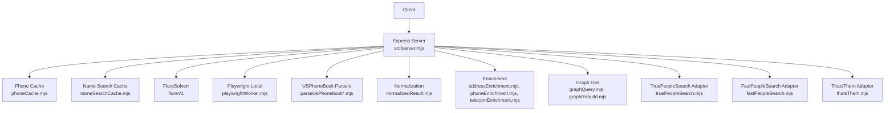
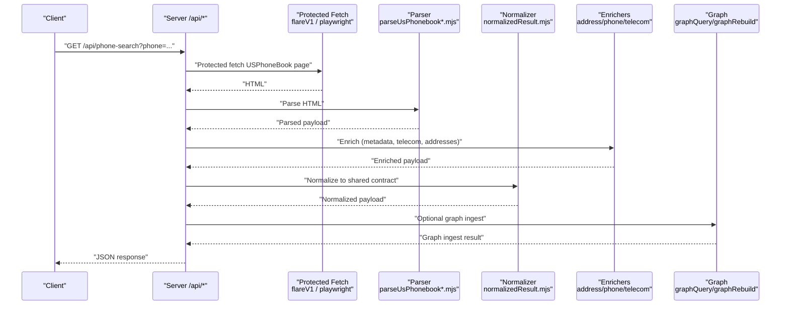
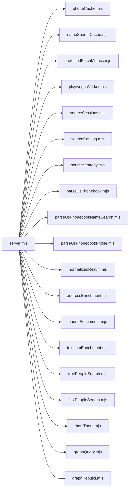

# Core Endpoints

<cite>
**Referenced Files in This Document**
- [README.md](file://README.md)
- [server.mjs](file://src/server.mjs)
- [normalizedResult.mjs](file://src/normalizedResult.mjs)
- [parseUsPhonebook.mjs](file://src/parseUsPhonebook.mjs)
- [parseUsPhonebookNameSearch.mjs](file://src/parseUsPhonebookNameSearch.mjs)
- [parseUsPhonebookProfile.mjs](file://src/parseUsPhonebookProfile.mjs)
- [phoneCache.mjs](file://src/phoneCache.mjs)
- [nameSearchCache.mjs](file://src/nameSearchCache.mjs)
- [entityIngest.mjs](file://src/entityIngest.mjs)
- [graphQuery.mjs](file://src/graphQuery.mjs)
- [graphRebuild.mjs](file://src/graphRebuild.mjs)
- [addressEnrichment.mjs](file://src/addressEnrichment.mjs)
- [phoneEnrichment.mjs](file://src/phoneEnrichment.mjs)
- [telecomEnrichment.mjs](file://src/telecomEnrichment.mjs)
- [truePeopleSearch.mjs](file://src/truePeopleSearch.mjs)
- [fastPeopleSearch.mjs](file://src/fastPeopleSearch.mjs)
- [thatsThem.mjs](file://src/thatsThem.mjs)
- [protectedFetchMetrics.mjs](file://src/protectedFetchMetrics.mjs)
- [playwrightWorker.mjs](file://src/playwrightWorker.mjs)
- [sourceSessions.mjs](file://src/sourceSessions.mjs)
- [sourceCatalog.mjs](file://src/sourceCatalog.mjs)
- [sourceStrategy.mjs](file://src/sourceStrategy.mjs)
</cite>

## Table of Contents
1. [Introduction](#introduction)
2. [Project Structure](#project-structure)
3. [Core Components](#core-components)
4. [Architecture Overview](#architecture-overview)
5. [Detailed Component Analysis](#detailed-component-analysis)
6. [Dependency Analysis](#dependency-analysis)
7. [Performance Considerations](#performance-considerations)
8. [Troubleshooting Guide](#troubleshooting-guide)
9. [Conclusion](#conclusion)

## Introduction
This document describes the core API endpoints exposed by the USPhoneBook Flare App server. It focuses on:
- Health monitoring endpoint
- Reverse phone number lookup
- Name-based person search with location filters
- Profile enrichment endpoint

It covers request/response schemas, parameter validation, error codes, caching, and integration guidance. The server is implemented in Express and orchestrates protected fetching via FlareSolverr or Playwright, parsing, normalization, enrichment, and optional graph ingestion.

## Project Structure
The server exposes REST endpoints under /api. Key behaviors:
- Health and diagnostics endpoints
- Phone and name search endpoints with GET and POST variants
- Protected fetch orchestration with automatic fallback
- Caching for phone and name searches
- Normalized result contracts for internal downstream integrations
- Optional graph rebuild and enrichment pipeline

**Diagram sources**
- [server.mjs:2425-2462](file://src/server.mjs#L2425-L2462)
- [phoneCache.mjs](file://src/phoneCache.mjs)
- [nameSearchCache.mjs](file://src/nameSearchCache.mjs)
- [parseUsPhonebook.mjs](file://src/parseUsPhonebook.mjs)
- [parseUsPhonebookNameSearch.mjs](file://src/parseUsPhonebookNameSearch.mjs)
- [parseUsPhonebookProfile.mjs](file://src/parseUsPhonebookProfile.mjs)
- [normalizedResult.mjs](file://src/normalizedResult.mjs)
- [addressEnrichment.mjs](file://src/addressEnrichment.mjs)
- [phoneEnrichment.mjs](file://src/phoneEnrichment.mjs)
- [telecomEnrichment.mjs](file://src/telecomEnrichment.mjs)
- [graphQuery.mjs](file://src/graphQuery.mjs)
- [graphRebuild.mjs](file://src/graphRebuild.mjs)
- [truePeopleSearch.mjs](file://src/truePeopleSearch.mjs)
- [fastPeopleSearch.mjs](file://src/fastPeopleSearch.mjs)
- [thatsThem.mjs](file://src/thatsThem.mjs)

**Section sources**
- [README.md:66-76](file://README.md#L66-L76)
- [server.mjs:2425-2462](file://src/server.mjs#L2425-L2462)

## Core Components
- Health endpoint: Returns operational status, cache stats, graph stats, vector store status, and protected-fetch trust metrics.
- Phone search: Reverse lookup by phone number with caching, protected fetch, parsing, enrichment, and optional graph ingestion.
- Name search: Person search with name, city, state filters; returns parsed rows and optional external source corroboration.
- Profile enrichment: Merges and enriches person profiles from multiple sources, including address validation, phone metadata, telecom classification, and graph ingestion.

**Section sources**
- [README.md:66-76](file://README.md#L66-L76)
- [server.mjs:2425-2462](file://src/server.mjs#L2425-L2462)
- [server.mjs:3162-3238](file://src/server.mjs#L3162-L3238)
- [server.mjs:3007-3064](file://src/server.mjs#L3007-L3064)
- [server.mjs:2242-2327](file://src/server.mjs#L2242-L2327)

## Architecture Overview
The server composes multiple modules to deliver robust protected scraping and enrichment:
- Protected fetch engine selection with fallback
- Parsing of USPhoneBook pages and external sources
- Normalization into a shared internal contract
- Enrichment layers (telecom, census geocoding, nearby places, assessor integration)
- Optional graph ingestion and rebuild

**Diagram sources**
- [server.mjs:3162-3238](file://src/server.mjs#L3162-L3238)
- [parseUsPhonebook.mjs](file://src/parseUsPhonebook.mjs)
- [normalizedResult.mjs](file://src/normalizedResult.mjs)
- [addressEnrichment.mjs](file://src/addressEnrichment.mjs)
- [phoneEnrichment.mjs](file://src/phoneEnrichment.mjs)
- [telecomEnrichment.mjs](file://src/telecomEnrichment.mjs)
- [graphQuery.mjs](file://src/graphQuery.mjs)
- [graphRebuild.mjs](file://src/graphRebuild.mjs)

## Detailed Component Analysis

### /api/health
Purpose: System health and operational status.

- Method: GET
- Response fields:
  - ok: boolean
  - sqlite: string (database path)
  - cache: object (cache stats)
  - graph: object (graph stats)
  - vector: object (vector store status)
  - flareBase: string (Flare base URL)
  - protectedFetchEngine: string (active engine)
  - protectedFetchCooldownMs: number
  - protectedFetchTrust: object (rolling trust metrics)
  - flareDefaultProxyConfigured: boolean
  - flareSessionReuse: boolean
  - flareSessionId: string|null
  - playwrightProfileDir: string|null
  - flare: object (Flare sessions.list result) — present on success
  - error: string — present on failure

- Typical responses:
  - 200 OK with operational details
  - 503 Service Unavailable with error details

- Notes:
  - Uses FlareSolverr sessions.list to validate connectivity
  - Includes protected-fetch trust health and cache/graph stats

**Section sources**
- [server.mjs:2425-2462](file://src/server.mjs#L2425-L2462)

### /api/phone-search
Purpose: Reverse phone number lookup with caching, protected fetch, parsing, enrichment, and optional graph ingestion.

- Methods:
  - GET /api/phone-search
  - POST /api/phone-search

- Query/body parameters:
  - phone (GET) or body.phone (POST): 10 digits or XXX-XXX-XXXX
  - maxTimeout: number (default from environment)
  - engine: "flare" | "playwright-local" | "auto"
  - proxy: object with url string (Flare proxy)
  - disableMedia: boolean (skip media in protected fetch)
  - waitInSeconds: number (post-solve wait)
  - ingest: boolean (enable graph ingestion)
  - autoFollowProfile: boolean (auto-fetch companion profile)
  - nocache: boolean (bypass cache)
  - Other cache bypass param names supported via environment

- Response fields:
  - url: string (final URL)
  - httpStatus: number|null
  - userAgent: string|null
  - fetchEngine: string
  - rawHtmlLength: number
  - parsed: object (from USPhoneBook)
  - phoneMetadata: object (libphonenumber-js metadata)
  - externalSources: object[] (optional external corroboration)
  - normalized: object (shared normalized contract)
  - graphIngest: object|null (when enabled)
  - cached: boolean (when served from cache)
  - cachedAt: string (ISO timestamp)
  - autoProfile: object|null (when autoFollowProfile=true and profile available)

- Validation rules:
  - GET: phone must match 10 digits or dashed format
  - POST: body.phone required and validated similarly
  - Optional numeric params validated and coerced

- Error codes:
  - 400 Bad Request: invalid phone format or validation errors
  - 502 Bad Gateway: protected fetch challenge required or HTML missing
  - 500 Internal Server Error: unexpected errors

- Caching:
  - Phone search results cached by dashed phone number
  - Cache bypass via nocache or configured bypass params

- Pagination:
  - Not applicable for phone search

- Practical examples:
  - GET: /api/phone-search?phone=207-242-0526&maxTimeout=240000
  - POST: {"phone":"207-242-0526","maxTimeout":240000,"ingest":true}

- Integration guidelines:
  - Prefer POST for structured payloads
  - Use nocache for testing or when expecting fresh results
  - Handle 502 with challengeRequired flag to trigger manual session checks or fallback engines

**Section sources**
- [server.mjs:3162-3238](file://src/server.mjs#L3162-L3238)
- [server.mjs:3240-3307](file://src/server.mjs#L3240-L3307)
- [phoneCache.mjs](file://src/phoneCache.mjs)
- [parseUsPhonebook.mjs](file://src/parseUsPhonebook.mjs)
- [normalizedResult.mjs](file://src/normalizedResult.mjs)
- [entityIngest.mjs](file://src/entityIngest.mjs)
- [graphQuery.mjs](file://src/graphQuery.mjs)
- [graphRebuild.mjs](file://src/graphRebuild.mjs)
- [README.md:66-76](file://README.md#L66-L76)

### /api/name-search
Purpose: Name-based person search with optional city/state filters and external corroboration.

- Methods:
  - GET /api/name-search
  - POST /api/name-search
  - POST /api/name-search/source (retry a specific external source)

- Query/body parameters:
  - GET: name, city, state or stateCode; optional maxTimeout, engine, proxy, disableMedia, wait
  - POST: body with name, city, state or stateCode; optional maxTimeout, engine, proxy, disableMedia, waitInSeconds
  - POST /api/name-search/source: body.sourceId ("truepeoplesearch"|"fastpeoplesearch"), plus normalized name params

- Validation rules:
  - Name required and must include at least first and last name
  - City requires state
  - State can be full name or slug normalized to two-letter abbreviation

- Response fields:
  - url: string (final URL)
  - httpStatus: number|null
  - userAgent: string|null
  - fetchEngine: string
  - rawHtmlLength: number
  - search: object (input context)
  - parsed: object (from USPhoneBook)
  - normalized: object (shared normalized contract)
  - externalNameSources: object[] (optional external corroboration)
  - cached: boolean (when served from cache)
  - cachedAt: string (ISO timestamp)

- External sources:
  - When enabled, concurrently fetches from TruePeopleSearch and FastPeopleSearch
  - Results annotated and cached separately

- Caching:
  - Name search results cached by normalized key segments
  - Cache bypass via nocache or configured bypass params

- Pagination:
  - Not applicable for name search

- Practical examples:
  - GET: /api/name-search?name=John+Doe&city=Portland&state=ME&maxTimeout=240000
  - POST: {"name":"John Doe","city":"Portland","state":"ME","maxTimeout":240000}
  - POST /api/name-search/source: {"sourceId":"truepeoplesearch","name":"John Doe","state":"ME"}

- Integration guidelines:
  - Use POST for structured payloads
  - Respect external source trust outcomes (challengeRequired, sessionRequired)
  - Use externalNameSources for cross-source corroboration

**Section sources**
- [server.mjs:3007-3064](file://src/server.mjs#L3007-L3064)
- [server.mjs:3066-3116](file://src/server.mjs#L3066-L3116)
- [server.mjs:3118-3160](file://src/server.mjs#L3118-L3160)
- [nameSearchCache.mjs](file://src/nameSearchCache.mjs)
- [parseUsPhonebookNameSearch.mjs](file://src/parseUsPhonebookNameSearch.mjs)
- [normalizedResult.mjs](file://src/normalizedResult.mjs)
- [truePeopleSearch.mjs](file://src/truePeopleSearch.mjs)
- [fastPeopleSearch.mjs](file://src/fastPeopleSearch.mjs)
- [README.md:66-76](file://README.md#L66-L76)

### /api/profile
Purpose: Detailed person profile enrichment and merging across sources.

- Endpoint: POST /api/profile
- Request body:
  - entries: array of objects with path and sourceId (and optional name)
    - path: profile path (e.g., "/person/john-doe-123")
    - sourceId: "usphonebook_profile" | "truepeoplesearch" | "fastpeoplesearch" | "thatsthem"
  - Optional overrides: engine, maxTimeout, waitInSeconds, proxy, disableMedia, ingest, mergeUsPhonebookCompanion, contextPhone
  - Other query/body params supported for cache bypass (nocache, etc.)

- Response fields:
  - url: string (final URL)
  - httpStatus: number|null
  - userAgent: string|null
  - fetchEngine: string
  - rawHtmlLength: number
  - profile: object (merged profile)
  - normalized: object (shared normalized contract)
  - graphIngest: object|null (when enabled)
  - sourceId: string (primary source identifier)
  - requestedEntries: array (normalized input)
  - sourceIssues: array (per-source errors and warnings)

- Processing logic:
  - Validates and normalizes entries
  - Fetches each profile via protected fetch
  - Merges profiles across sources (phones, addresses, relatives, associates, emails, aliases)
  - Runs enrichment (address validation, telecom classification)
  - Optional graph ingestion

- Error codes:
  - 400 Bad Request: missing path or validation errors
  - 500 Internal Server Error: profile enrich failed for all sources or unexpected error

- Practical examples:
  - POST: {"entries":[{"path":"/person/john-doe-123","sourceId":"usphonebook_profile"}]}
  - POST: {"entries":[{"path":"/person/jane-smith","sourceId":"truepeoplesearch"}],"ingest":true}

- Integration guidelines:
  - Provide explicit sourceId for USPhonebook when merging companions is not desired
  - Inspect sourceIssues for challengeRequired/sessionRequired flags
  - Use contextPhone to align graph entities when available

**Section sources**
- [server.mjs:2242-2327](file://src/server.mjs#L2242-L2327)
- [parseUsPhonebookProfile.mjs](file://src/parseUsPhonebookProfile.mjs)
- [normalizedResult.mjs](file://src/normalizedResult.mjs)
- [entityIngest.mjs](file://src/entityIngest.mjs)
- [graphQuery.mjs](file://src/graphQuery.mjs)
- [graphRebuild.mjs](file://src/graphRebuild.mjs)
- [addressEnrichment.mjs](file://src/addressEnrichment.mjs)
- [phoneEnrichment.mjs](file://src/phoneEnrichment.mjs)
- [telecomEnrichment.mjs](file://src/telecomEnrichment.mjs)
- [thatsThem.mjs](file://src/thatsThem.mjs)
- [truePeopleSearch.mjs](file://src/truePeopleSearch.mjs)
- [fastPeopleSearch.mjs](file://src/fastPeopleSearch.mjs)

## Dependency Analysis
The server composes several modules to implement protected fetching, parsing, normalization, enrichment, and graph operations.

**Diagram sources**
- [server.mjs](file://src/server.mjs)
- [phoneCache.mjs](file://src/phoneCache.mjs)
- [nameSearchCache.mjs](file://src/nameSearchCache.mjs)
- [protectedFetchMetrics.mjs](file://src/protectedFetchMetrics.mjs)
- [playwrightWorker.mjs](file://src/playwrightWorker.mjs)
- [sourceSessions.mjs](file://src/sourceSessions.mjs)
- [sourceCatalog.mjs](file://src/sourceCatalog.mjs)
- [sourceStrategy.mjs](file://src/sourceStrategy.mjs)
- [parseUsPhonebook.mjs](file://src/parseUsPhonebook.mjs)
- [parseUsPhonebookNameSearch.mjs](file://src/parseUsPhonebookNameSearch.mjs)
- [parseUsPhonebookProfile.mjs](file://src/parseUsPhonebookProfile.mjs)
- [normalizedResult.mjs](file://src/normalizedResult.mjs)
- [addressEnrichment.mjs](file://src/addressEnrichment.mjs)
- [phoneEnrichment.mjs](file://src/phoneEnrichment.mjs)
- [telecomEnrichment.mjs](file://src/telecomEnrichment.mjs)
- [truePeopleSearch.mjs](file://src/truePeopleSearch.mjs)
- [fastPeopleSearch.mjs](file://src/fastPeopleSearch.mjs)
- [thatsThem.mjs](file://src/thatsThem.mjs)
- [graphQuery.mjs](file://src/graphQuery.mjs)
- [graphRebuild.mjs](file://src/graphRebuild.mjs)

**Section sources**
- [server.mjs:1-120](file://src/server.mjs#L1-L120)
- [server.mjs:2329-2344](file://src/server.mjs#L2329-L2344)

## Performance Considerations
- Protected fetch cooldown: A global minimum delay between protected fetches reduces burstiness and improves reliability.
- Engine fallback: When engine=flare, timeouts and 5xx are retried with the fallback engine (playwright-local) to mitigate transient failures.
- Session reuse: Reusing a Flare session can speed up requests but may increase resource usage; enable only when appropriate.
- Media disabling: Setting disableMedia=1 reduces payload sizes and speeds up protected fetches.
- Proxy configuration: Using a stable proxy can improve success rates and reduce challenges.
- Caching: Phone and name search caches avoid repeated protected fetches for identical queries.

[No sources needed since this section provides general guidance]

## Troubleshooting Guide
Common issues and remedies:
- Challenge required (502): Indicates Cloudflare or CAPTCHA challenge. Use engine=auto or switch to playwright-local. Check source sessions and consider interactive session opening.
- Timeout after maxTimeout: Increase FLARE_MAX_TIMEOUT_MS or set FLARE_DISABLE_MEDIA=1. Consider using a residential proxy.
- Session required: Open the source in Settings and complete any required challenge; then check session.
- External source blocked: Some sources (e.g., That’s Them) may require manual intervention or are blocked; inspect sourceIssues and trust metrics.

Operational diagnostics:
- Use GET /api/health to validate Flare connectivity and system status.
- Use GET /api/trust-health to review rolling trust metrics and recent protected-fetch events.

**Section sources**
- [server.mjs:2425-2462](file://src/server.mjs#L2425-L2462)
- [server.mjs:2464-2474](file://src/server.mjs#L2464-L2474)
- [protectedFetchMetrics.mjs](file://src/protectedFetchMetrics.mjs)
- [sourceSessions.mjs](file://src/sourceSessions.mjs)
- [README.md:105-118](file://README.md#L105-L118)

## Conclusion
The core endpoints provide a robust foundation for reverse phone lookup, name-based search, and profile enrichment with integrated caching, protected-fetch orchestration, and normalization. Clients should handle 502 responses with challengeRequired flags, leverage caching and external corroboration, and use POST endpoints for structured payloads. Operational health and trust metrics are available for monitoring and troubleshooting.