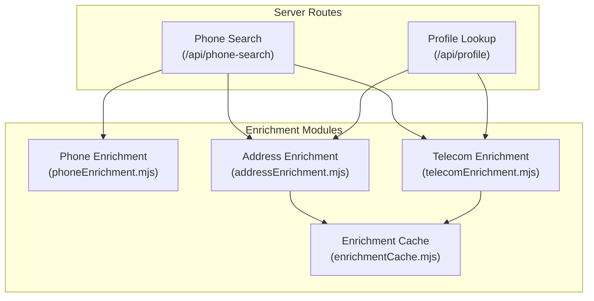
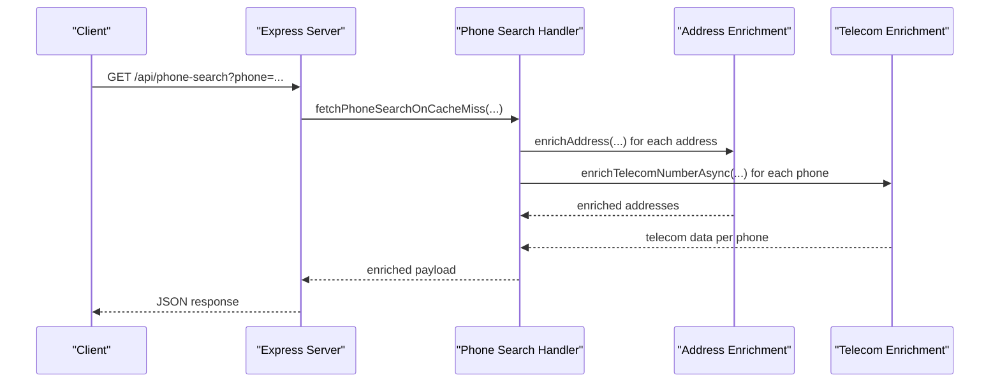
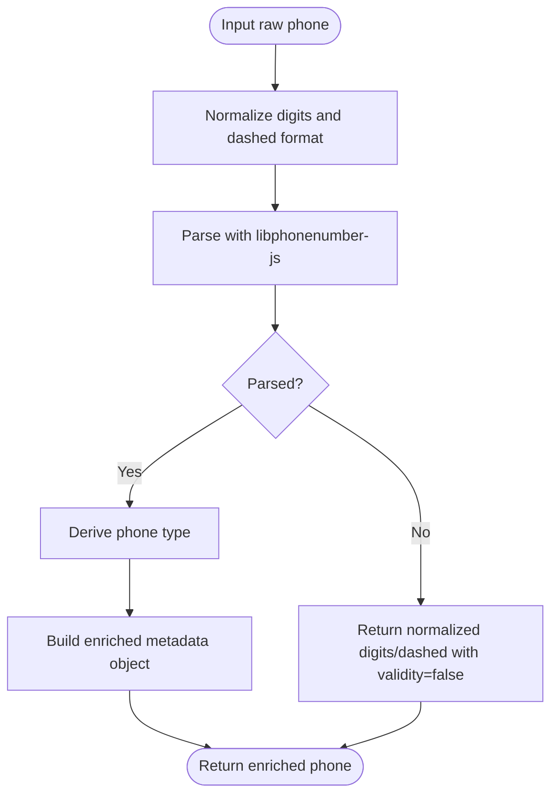
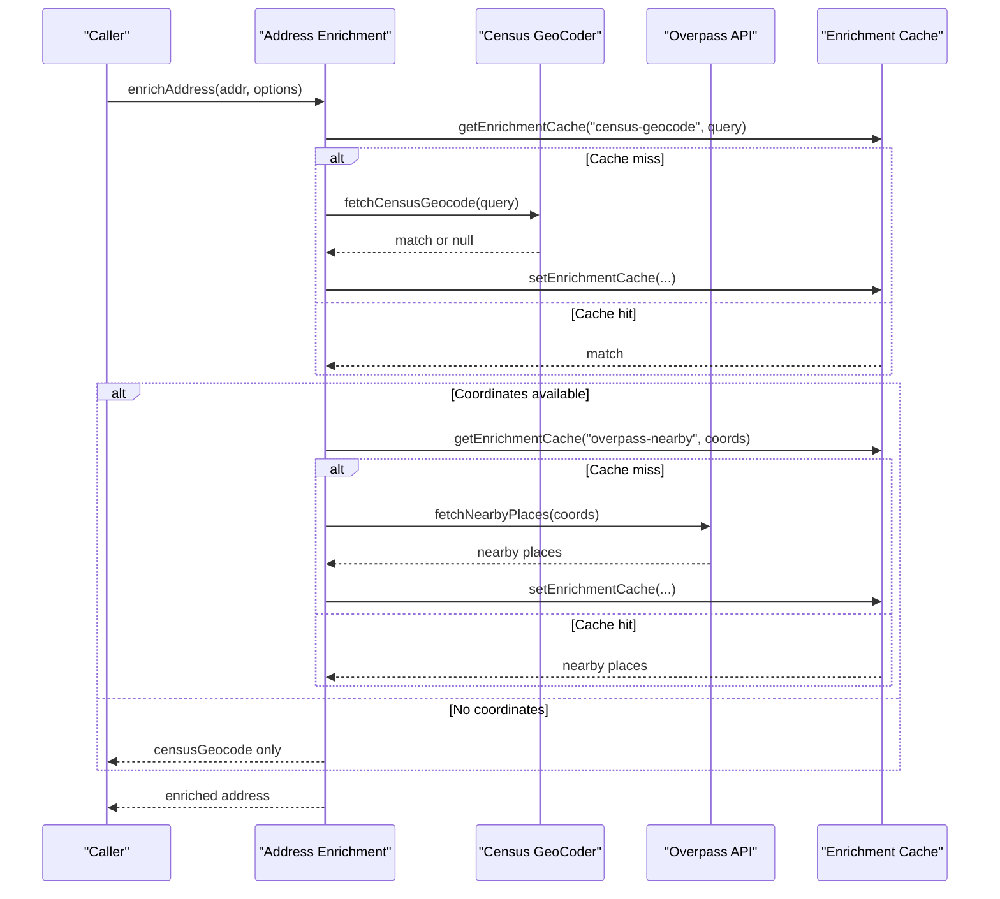
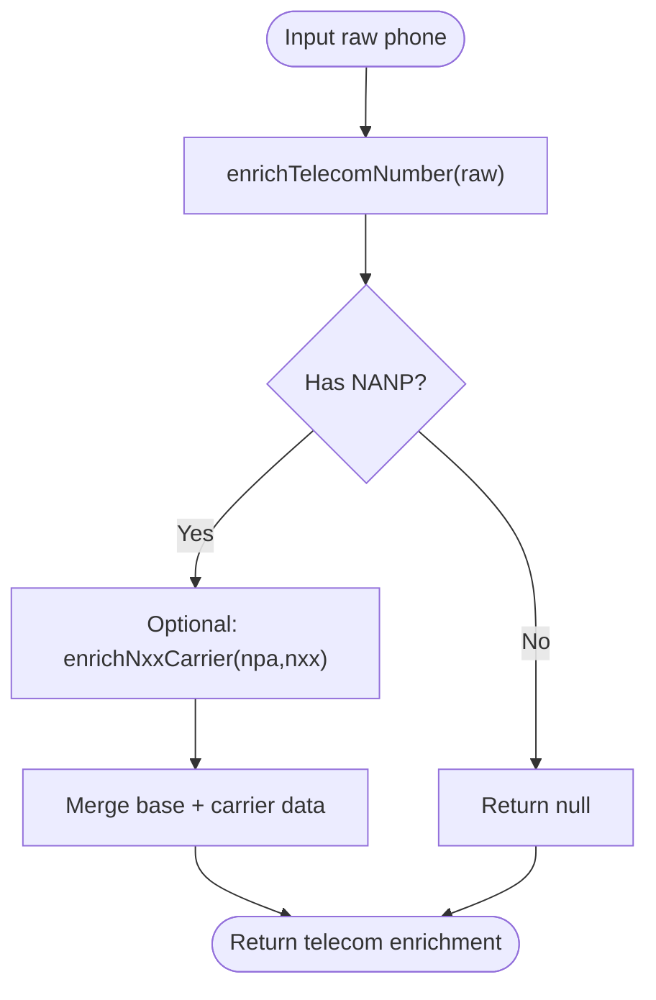
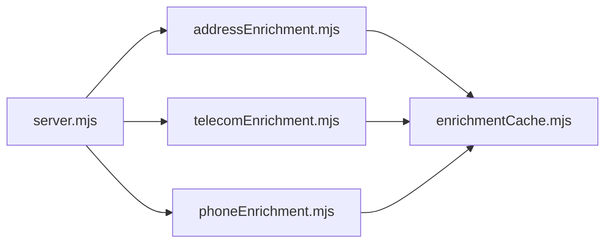

# Enrichment Endpoints

<cite>
**Referenced Files in This Document**
- [server.mjs](file://src/server.mjs)
- [phoneEnrichment.mjs](file://src/phoneEnrichment.mjs)
- [addressEnrichment.mjs](file://src/addressEnrichment.mjs)
- [telecomEnrichment.mjs](file://src/telecomEnrichment.mjs)
- [enrichmentCache.mjs](file://src/enrichmentCache.mjs)
</cite>

## Table of Contents
1. [Introduction](#introduction)
2. [Project Structure](#project-structure)
3. [Core Components](#core-components)
4. [Architecture Overview](#architecture-overview)
5. [Detailed Component Analysis](#detailed-component-analysis)
6. [Dependency Analysis](#dependency-analysis)
7. [Performance Considerations](#performance-considerations)
8. [Troubleshooting Guide](#troubleshooting-guide)
9. [Conclusion](#conclusion)

## Introduction
This document describes the enrichment capabilities exposed through the application's API, focusing on phone number enrichment, address validation and geocoding, and telecom analysis (carrier and line type detection). It explains request parameters, response formats, integration patterns with core search endpoints, and operational considerations such as caching and performance.

## Project Structure
The enrichment features are implemented as reusable modules and integrated into the Express server routes:
- Phone number enrichment: normalization, validation, and metadata extraction
- Address enrichment: geocoding, nearby place discovery, and assessor record integration
- Telecom enrichment: NANP classification and optional carrier/rate-center lookup
- Shared caching: database-backed cache with TTL and in-flight deduplication

**Diagram sources**
- [server.mjs:3161-3307](file://src/server.mjs#L3161-L3307)
- [phoneEnrichment.mjs:1-126](file://src/phoneEnrichment.mjs#L1-L126)
- [addressEnrichment.mjs:1-386](file://src/addressEnrichment.mjs#L1-L386)
- [telecomEnrichment.mjs:1-179](file://src/telecomEnrichment.mjs#L1-L179)
- [enrichmentCache.mjs:1-117](file://src/enrichmentCache.mjs#L1-L117)

**Section sources**
- [server.mjs:3161-3307](file://src/server.mjs#L3161-L3307)
- [phoneEnrichment.mjs:1-126](file://src/phoneEnrichment.mjs#L1-L126)
- [addressEnrichment.mjs:1-386](file://src/addressEnrichment.mjs#L1-L386)
- [telecomEnrichment.mjs:1-179](file://src/telecomEnrichment.mjs#L1-L179)
- [enrichmentCache.mjs:1-117](file://src/enrichmentCache.mjs#L1-L117)

## Core Components
- Phone Enrichment: Normalizes US phone numbers, validates digits, and produces standardized metadata (E164, national, international formats, validity, type).
- Address Enrichment: Geocodes US addresses using Census GeoCoder, discovers nearby points of interest via Overpass API, and optionally enriches with assessor records.
- Telecom Enrichment: Classifies NANP numbers and optionally augments with carrier/rate-center data from LocalCallingGuide.
- Enrichment Cache: Provides database-backed caching with TTL, automatic pruning, and in-flight request deduplication.

**Section sources**
- [phoneEnrichment.mjs:29-96](file://src/phoneEnrichment.mjs#L29-L96)
- [addressEnrichment.mjs:349-385](file://src/addressEnrichment.mjs#L349-L385)
- [telecomEnrichment.mjs:146-178](file://src/telecomEnrichment.mjs#L146-L178)
- [enrichmentCache.mjs:48-116](file://src/enrichmentCache.mjs#L48-L116)

## Architecture Overview
The server integrates enrichment modules into phone and profile workflows. Phone search results are enriched with normalized phone metadata and optional telecom data. Profile lookups enrich addresses and phones with geocoding, nearby places, and telecom details.

**Diagram sources**
- [server.mjs:3161-3307](file://src/server.mjs#L3161-L3307)
- [addressEnrichment.mjs:349-385](file://src/addressEnrichment.mjs#L349-L385)
- [telecomEnrichment.mjs:166-178](file://src/telecomEnrichment.mjs#L166-L178)

## Detailed Component Analysis

### Phone Number Enrichment
- Purpose: Normalize and validate US phone numbers, produce standardized formats and metadata.
- Inputs: Raw phone string (digits, dashes, or mixed).
- Outputs: Normalized digits, dashed format, E164, international/national formats, country info, validity, and type.
- Integration: Used by phone search and profile enrichment to attach phoneMetadata to results.

**Diagram sources**
- [phoneEnrichment.mjs:29-96](file://src/phoneEnrichment.mjs#L29-L96)

**Section sources**
- [phoneEnrichment.mjs:29-96](file://src/phoneEnrichment.mjs#L29-L96)

### Address Validation and Geocoding
- Purpose: Validate and geocode US addresses, discover nearby points of interest, and optionally enrich with assessor records.
- Inputs: Address object with formatted fields; optional callback to fetch HTML for assessor enrichment.
- Outputs: Matched address, coordinates, census geography (state, county, tract, block, congressional district), nearby places summary, and assessor records.
- Integration: Applied during phone search and profile enrichment to augment address fields.

**Diagram sources**
- [addressEnrichment.mjs:349-385](file://src/addressEnrichment.mjs#L349-L385)
- [enrichmentCache.mjs:48-116](file://src/enrichmentCache.mjs#L48-L116)

**Section sources**
- [addressEnrichment.mjs:349-385](file://src/addressEnrichment.mjs#L349-L385)
- [enrichmentCache.mjs:48-116](file://src/enrichmentCache.mjs#L48-L116)

### Telecom Analysis (Carrier and Line Type)
- Purpose: Classify NANP numbers and optionally enrich with carrier/rate-center data.
- Inputs: Raw phone string.
- Outputs: NANP classification (area code, exchange, line number, category), optional carrier data from LocalCallingGuide.
- Integration: Applied to phones during phone search and profile enrichment.

**Diagram sources**
- [telecomEnrichment.mjs:146-178](file://src/telecomEnrichment.mjs#L146-L178)

**Section sources**
- [telecomEnrichment.mjs:146-178](file://src/telecomEnrichment.mjs#L146-L178)

### API Endpoints for Enrichment Integration
While the repository does not define dedicated endpoints named /api/phone-enrichment, /api/address-validation, or /api/telecom-analysis, the server exposes integration points that incorporate the enrichment modules:

- Phone Search Enrichment
  - Endpoint: GET /api/phone-search
  - Parameters:
    - phone: Required. 10 digits or dashed format (e.g., 207-242-0526)
    - Optional: maxTimeout, engine, proxy, disableMedia, ingest, autoFollowProfile, cache bypass query
  - Behavior: Fetches USPhonebook phone search, parses results, enriches with normalized phone metadata and optional telecom data, and optionally follows the profile to enrich addresses and phones.
  - Response: Includes enriched parsed results, normalized payload, and optional graph ingestion metadata.

- Profile Enrichment
  - Endpoint: POST /api/profile
  - Parameters:
    - path or entries: Required. Profile path or list of entries with path/sourceId
    - Optional: contextPhone, sourceId, engine, maxTimeout, proxy, disableMedia, ingest, includeRawHtml
  - Behavior: Fetches profile HTML, parses, enriches addresses and phones, performs telecom enrichment per phone, and optionally merges companion profiles.
  - Response: Includes profile payload, normalized fields, optional raw HTML, and graph ingestion metadata.

- Name Search Enrichment
  - Endpoint: GET /api/name-search
  - Parameters:
    - name: Required. First and last name
    - city/state: Optional. Requires state when city provided
    - Optional: maxTimeout, engine, proxy, disableMedia, cache bypass query
  - Behavior: Normalizes query, fetches results, enriches with external sources, and caches results.
  - Response: Includes normalized payload and external sources.

**Section sources**
- [server.mjs:3161-3307](file://src/server.mjs#L3161-L3307)
- [server.mjs:2952-3005](file://src/server.mjs#L2952-L3005)
- [server.mjs:3006-3160](file://src/server.mjs#L3006-L3160)

## Dependency Analysis
The enrichment modules depend on shared infrastructure and each other as needed by server workflows.

**Diagram sources**
- [server.mjs:29-58](file://src/server.mjs#L29-L58)
- [addressEnrichment.mjs:1-6](file://src/addressEnrichment.mjs#L1-L6)
- [telecomEnrichment.mjs:1-2](file://src/telecomEnrichment.mjs#L1-L2)
- [enrichmentCache.mjs:1-4](file://src/enrichmentCache.mjs#L1-L4)

**Section sources**
- [server.mjs:29-58](file://src/server.mjs#L29-L58)
- [addressEnrichment.mjs:1-6](file://src/addressEnrichment.mjs#L1-L6)
- [telecomEnrichment.mjs:1-2](file://src/telecomEnrichment.mjs#L1-L2)
- [enrichmentCache.mjs:1-4](file://src/enrichmentCache.mjs#L1-L4)

## Performance Considerations
- Caching
  - Enrichment cache uses database storage with TTL and automatic pruning. It also deduplicates concurrent requests for the same key.
  - Address geocoding and nearby places are cached separately under namespaces "census-geocode" and "overpass-nearby".
  - Telecom carrier data is cached with a long TTL (30 days) because NANP assignments change infrequently.
- Rate limiting and throttling
  - Overpass queries are throttled with a minimum interval to avoid flooding the endpoint.
  - HTTP timeouts are configurable for external services.
- Parallelization
  - Profile enrichment fans out telecom enrichment and external source lookups per phone.
  - Name search fans out external name sources in parallel.
- Memory and disk limits
  - Cache eviction enforces a maximum number of entries to prevent unbounded growth.

**Section sources**
- [enrichmentCache.mjs:17-41](file://src/enrichmentCache.mjs#L17-L41)
- [enrichmentCache.mjs:99-116](file://src/enrichmentCache.mjs#L99-L116)
- [addressEnrichment.mjs:20-21](file://src/addressEnrichment.mjs#L20-L21)
- [addressEnrichment.mjs:255-293](file://src/addressEnrichment.mjs#L255-L293)
- [telecomEnrichment.mjs:4-86](file://src/telecomEnrichment.mjs#L4-L86)

## Troubleshooting Guide
- Challenge Required
  - Some external sources may require browser challenges (Cloudflare, CAPTCHA). The server surfaces challenge reasons and allows fallback engines.
- Session Management
  - For sources requiring sessions, ensure sessions are checked and ready before requesting data.
- Network Failures
  - External APIs may fail or return errors. The enrichment modules return null or partial data to allow best-effort operation.
- Cache Issues
  - If stale data appears, use cache bypass parameters or purge cached responses as supported by the server.

**Section sources**
- [server.mjs:526-542](file://src/server.mjs#L526-L542)
- [server.mjs:2548-2605](file://src/server.mjs#L2548-L2605)
- [addressEnrichment.mjs:333-342](file://src/addressEnrichment.mjs#L333-L342)
- [telecomEnrichment.mjs:66-70](file://src/telecomEnrichment.mjs#L66-L70)

## Conclusion
The application integrates phone, address, and telecom enrichment seamlessly into phone search and profile workflows. While dedicated enrichment endpoints are not exposed, the existing search and profile endpoints provide robust enrichment with caching, parallelization, and resilience against external service failures. Developers can leverage these integrations to build applications that combine initial search results with enriched phone metadata, validated addresses, and telecom insights.