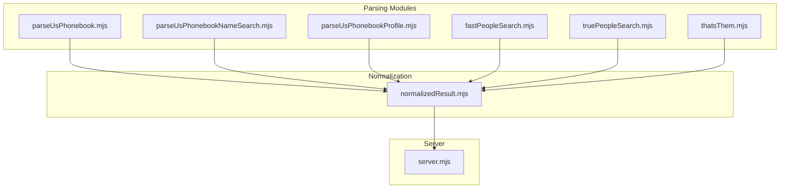
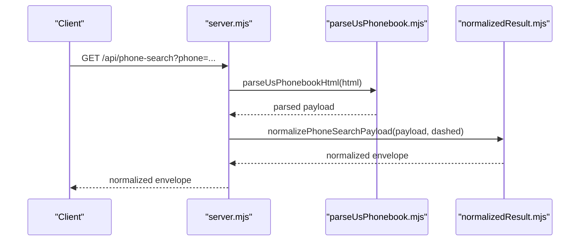
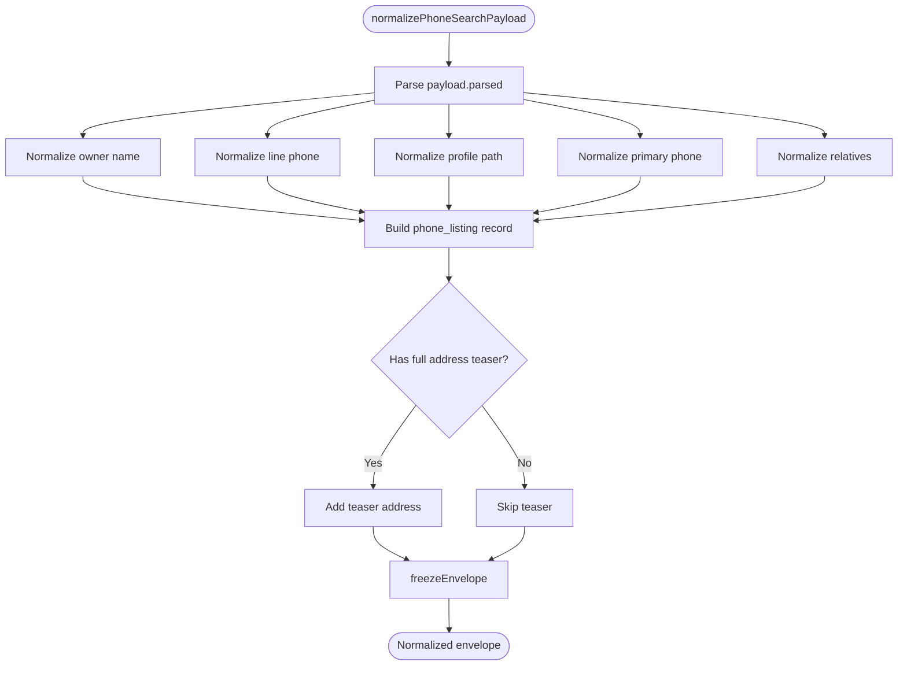
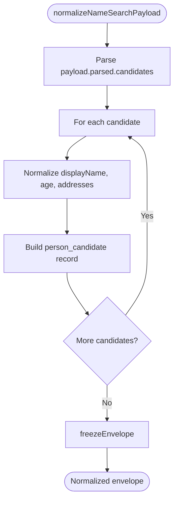
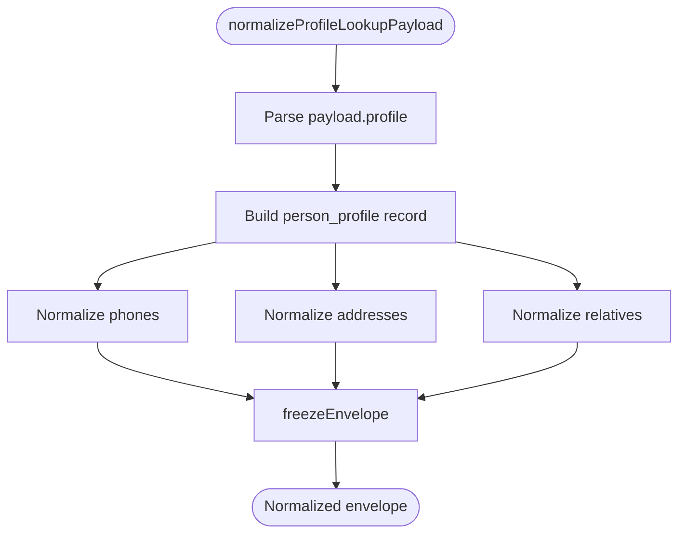
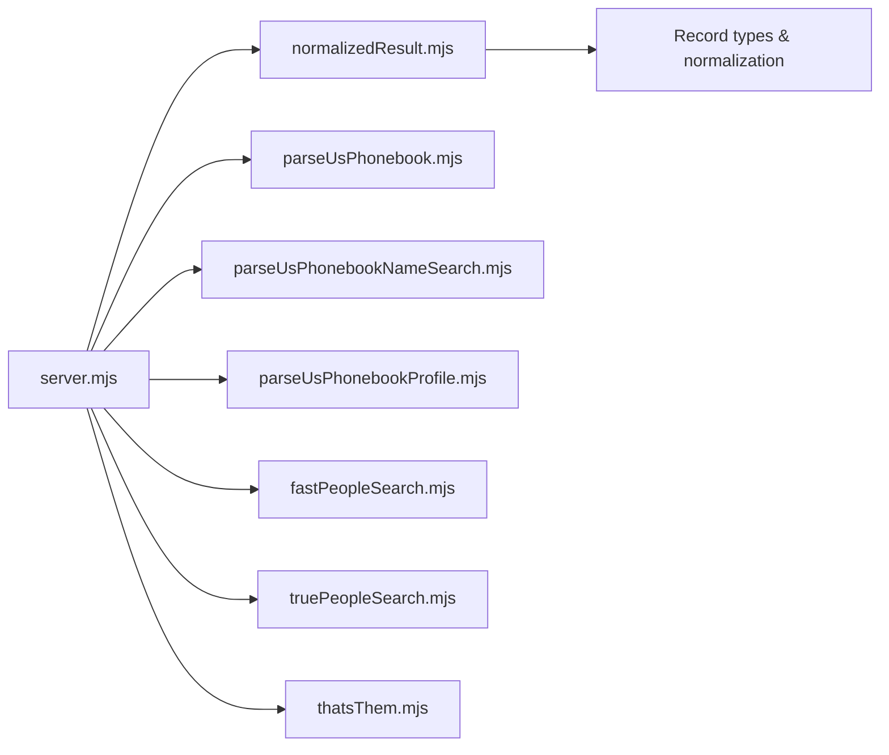

# Response Contracts

<cite>
**Referenced Files in This Document**
- [normalizedResult.mjs](file://src/normalizedResult.mjs)
- [normalized-result.test.mjs](file://test/normalized-result.test.mjs)
- [server.mjs](file://src/server.mjs)
- [parseUsPhonebook.mjs](file://src/parseUsPhonebook.mjs)
- [parseUsPhonebookNameSearch.mjs](file://src/parseUsPhonebookNameSearch.mjs)
- [parseUsPhonebookProfile.mjs](file://src/parseUsPhonebookProfile.mjs)
- [fastPeopleSearch.mjs](file://src/fastPeopleSearch.mjs)
- [truePeopleSearch.mjs](file://src/truePeopleSearch.mjs)
- [thatsThem.mjs](file://src/thatsThem.mjs)
</cite>

## Table of Contents
1. [Introduction](#introduction)
2. [Project Structure](#project-structure)
3. [Core Components](#core-components)
4. [Architecture Overview](#architecture-overview)
5. [Detailed Component Analysis](#detailed-component-analysis)
6. [Dependency Analysis](#dependency-analysis)
7. [Performance Considerations](#performance-considerations)
8. [Troubleshooting Guide](#troubleshooting-guide)
9. [Conclusion](#conclusion)

## Introduction
This document defines the normalized result contract used across all API responses. It specifies the shared envelope schema, field semantics, data types, normalization rules, and consistency guarantees for phone searches, name searches, and profile enrichment. It also documents error handling patterns, version compatibility, and client guidelines for consuming normalized data uniformly across diverse underlying sources.

## Project Structure
The normalized result contract is implemented centrally and consumed by the HTTP server endpoints. Parsing modules produce source-specific payloads, which are then transformed into a unified normalized shape.

**Diagram sources**
- [normalizedResult.mjs:1-506](file://src/normalizedResult.mjs#L1-L506)
- [server.mjs:1-3333](file://src/server.mjs#L1-L3333)
- [parseUsPhonebook.mjs:1-103](file://src/parseUsPhonebook.mjs#L1-L103)
- [parseUsPhonebookNameSearch.mjs:1-109](file://src/parseUsPhonebookNameSearch.mjs#L1-L109)
- [parseUsPhonebookProfile.mjs:1-616](file://src/parseUsPhonebookProfile.mjs#L1-L616)
- [fastPeopleSearch.mjs:1-589](file://src/fastPeopleSearch.mjs#L1-L589)
- [truePeopleSearch.mjs:1-546](file://src/truePeopleSearch.mjs#L1-L546)
- [thatsThem.mjs:1-243](file://src/thatsThem.mjs#L1-L243)

**Section sources**
- [normalizedResult.mjs:1-506](file://src/normalizedResult.mjs#L1-L506)
- [server.mjs:1-3333](file://src/server.mjs#L1-L3333)

## Core Components
The normalized result envelope consists of the following top-level fields:

- schemaVersion: integer constant indicating the envelope version
- source: string identifier of the originating source (e.g., usphonebook, truepeoplesearch, fastpeoplesearch, thatsthem)
- kind: discriminates the response type (phone_search, name_search, profile_lookup)
- query: object containing normalized query parameters
- meta: metadata about the fetch and normalization
- summary: aggregated counts and summaries derived from records
- records: array of normalized records

Each record type has a distinct shape:
- phone_listing: for phone_search results
- person_candidate: for name_search results
- person_profile: for profile_lookup results

Validation and normalization rules:
- Null, empty strings, and empty arrays are pruned from the envelope
- Text fields are trimmed and collapsed whitespace
- Paths are normalized to remove query parameters and trailing slashes
- Arrays are de-duplicated and sanitized

**Section sources**
- [normalizedResult.mjs:1-506](file://src/normalizedResult.mjs#L1-L506)

## Architecture Overview
The server orchestrates fetching, parsing, enrichment, and normalization. Source-specific parsers produce structured payloads, which are passed to normalization functions that enforce a consistent shape.

**Diagram sources**
- [server.mjs:3162-3199](file://src/server.mjs#L3162-L3199)
- [parseUsPhonebook.mjs:1-103](file://src/parseUsPhonebook.mjs#L1-L103)
- [normalizedResult.mjs:167-244](file://src/normalizedResult.mjs#L167-L244)

## Detailed Component Analysis

### Envelope Schema Definition
Top-level envelope fields:
- schemaVersion: integer constant
- source: string
- kind: string discriminator
- query: object
- meta: object
- summary: object
- records: array

Normalization utilities:
- compactObject: removes null, undefined, empty strings, and empty arrays
- cleanText: trims and collapses whitespace
- cleanStringArray: sanitizes arrays of strings
- normalizePath: cleans and normalizes URLs/paths

**Section sources**
- [normalizedResult.mjs:1-34](file://src/normalizedResult.mjs#L1-L34)

### Phone Search Normalization
Purpose: Convert a phone search result into a normalized envelope with a single phone_listing record.

Key behaviors:
- Extracts owner name, profile path, and phone metadata
- Builds teaser address when full address is not available
- Normalizes phone records with e164, type, and flags
- Normalizes relative links with alternateProfilePaths support

**Diagram sources**
- [normalizedResult.mjs:167-244](file://src/normalizedResult.mjs#L167-L244)

**Section sources**
- [normalizedResult.mjs:167-244](file://src/normalizedResult.mjs#L167-L244)
- [normalized-result.test.mjs:10-46](file://test/normalized-result.test.mjs#L10-L46)

### Name Search Normalization
Purpose: Convert a name search result into a normalized envelope with person_candidate records.

Key behaviors:
- Produces one person_candidate per parsed candidate
- Merges current city/state and prior addresses into a unified address list
- Normalizes relative links

**Diagram sources**
- [normalizedResult.mjs:250-331](file://src/normalizedResult.mjs#L250-L331)

**Section sources**
- [normalizedResult.mjs:250-331](file://src/normalizedResult.mjs#L250-L331)
- [normalized-result.test.mjs:48-87](file://test/normalized-result.test.mjs#L48-L87)

### Profile Lookup Normalization
Purpose: Convert a profile result into a normalized envelope with a single person_profile record.

Key behaviors:
- Normalizes phones, addresses, and relatives
- Preserves source-specific fields under sourceFields
- Computes summary counts

**Diagram sources**
- [normalizedResult.mjs:337-381](file://src/normalizedResult.mjs#L337-L381)

**Section sources**
- [normalizedResult.mjs:337-381](file://src/normalizedResult.mjs#L337-L381)
- [normalized-result.test.mjs:89-138](file://test/normalized-result.test.mjs#L89-L138)

### Record Types and Field Definitions

- phone_listing
  - recordId: string; unique identifier
  - recordType: "phone_listing"
  - displayName: string | null
  - profilePath: string | null
  - age: number | null
  - aliases: string[]
  - emails: string[]
  - phones: array of normalized phone objects
  - addresses: array of normalized address objects
  - relatives: array of normalized relative objects
  - sourceFields: object with source-specific fields

- person_candidate
  - recordId: string
  - recordType: "person_candidate"
  - displayName: string
  - profilePath: string | null
  - age: number | null
  - aliases: string[]
  - emails: string[]
  - phones: []
  - addresses: array of address objects (current + prior)
  - relatives: array of normalized relative objects
  - sourceFields: object with source-specific fields

- person_profile
  - recordId: string
  - recordType: "person_profile"
  - displayName: string | null
  - profilePath: string | null
  - age: number | null
  - aliases: string[]
  - emails: string[]
  - phones: array of normalized phone objects
  - addresses: array of normalized address objects
  - relatives: array of normalized relative objects
  - sourceFields: object with source-specific fields

Phone object fields:
- dashed: string | null
- display: string | null
- e164: string | null
- type: string | null
- isCurrent: boolean
- isPrimary: boolean
- country: string | null
- phoneMetadata: object | null

Address object fields:
- label: string | null
- formatted: string | null
- path: string | null
- normalizedKey: string | null
- timeRange: string | null
- recordedRange: string | null
- isCurrent: boolean
- isTeaser: boolean
- periods: array of period objects
- censusGeocode: object | null
- nearbyPlaces: object | null
- assessorRecords: any[]

Relative object fields:
- name: string
- path: string | null
- alternateProfilePaths: string[] (optional)

Period object fields:
- label: string | null
- path: string | null
- timeRange: string | null
- recordedRange: string | null
- isCurrentObserved: boolean

**Section sources**
- [normalizedResult.mjs:88-144](file://src/normalizedResult.mjs#L88-L144)
- [normalizedResult.mjs:337-381](file://src/normalizedResult.mjs#L337-L381)

### Query Object Fields
- phone_search
  - phoneDashed: string | null
  - phoneDisplay: string | null

- name_search
  - name: string | null
  - city: string | null
  - state: string | null
  - path: string | null

- profile_lookup
  - profilePath: string | null
  - contextPhone: string | null

**Section sources**
- [normalizedResult.mjs:223-227](file://src/normalizedResult.mjs#L223-L227)
- [normalizedResult.mjs:308-313](file://src/normalizedResult.mjs#L308-L313)
- [normalizedResult.mjs:360-363](file://src/normalizedResult.mjs#L360-L363)

### Meta Object Fields
- url: string | null
- httpStatus: number | null
- userAgent: string | null
- rawHtmlLength: number | null
- cached: boolean
- cachedAt: string | null
- graphEligible: boolean
- recordCount: number

**Section sources**
- [normalizedResult.mjs:227-236](file://src/normalizedResult.mjs#L227-L236)
- [normalizedResult.mjs:314-323](file://src/normalizedResult.mjs#L314-L323)
- [normalizedResult.mjs:364-373](file://src/normalizedResult.mjs#L364-L373)

### Summary Object Fields
- phone_search
  - primaryDisplayName: string | null
  - relativeCount: number
  - hasProfile: boolean

- name_search
  - totalRecords: number
  - totalPages: number | null
  - summaryText: string | null

- profile_lookup
  - addressCount: number
  - phoneCount: number
  - relativeCount: number

**Section sources**
- [normalizedResult.mjs:237-242](file://src/normalizedResult.mjs#L237-L242)
- [normalizedResult.mjs:324-329](file://src/normalizedResult.mjs#L324-L329)
- [normalizedResult.mjs:374-379](file://src/normalizedResult.mjs#L374-L379)

### Examples of Normalized Responses
Examples are validated by tests that assert specific fields and shapes for each kind.

- Phone search example assertions:
  - kind equals "phone_search"
  - meta.graphEligible equals true
  - query.phoneDashed populated
  - records length 1
  - record displayName, phones e164, addresses teaser flag, relatives path

- Name search example assertions:
  - kind equals "name_search"
  - meta.graphEligible equals false
  - records length 1
  - recordType equals "person_candidate"
  - addresses length 2 (current + prior)
  - relatives present

- Profile lookup example assertions:
  - kind equals "profile_lookup"
  - meta.graphEligible equals true
  - query.contextPhone populated
  - records length 1
  - phones type, addresses periods, sourceFields workplaces

**Section sources**
- [normalized-result.test.mjs:10-46](file://test/normalized-result.test.mjs#L10-L46)
- [normalized-result.test.mjs:48-87](file://test/normalized-result.test.mjs#L48-L87)
- [normalized-result.test.mjs:89-138](file://test/normalized-result.test.mjs#L89-L138)

### Error Handling Patterns
- Protected fetch failures:
  - Challenge required: returned as HTTP 502 with challengeRequired flag and reason
  - Non-HTML responses: returned as HTTP 502 with engine indicator
- Session-required sources:
  - Returned as HTTP 409 with sessionRequired flag
- General errors:
  - Returned as HTTP 500 with error message

**Section sources**
- [server.mjs:1565-1579](file://src/server.mjs#L1565-L1579)
- [server.mjs:2995-3004](file://src/server.mjs#L2995-L3004)

### Version Compatibility Considerations
- schemaVersion is a constant; consumers should treat it as immutable for the current release
- New fields may be added in future versions; existing fields should remain compatible
- Clients should ignore unknown fields and handle missing optional fields gracefully

**Section sources**
- [normalizedResult.mjs](file://src/normalizedResult.mjs#L1)

### Guidelines for Clients
- Always check schemaVersion and kind before processing
- Treat null and empty arrays as absent
- Normalize paths and strings using the same rules as the server
- For phone listings, prefer e164 if present; otherwise use dashed or display
- For addresses, prefer periods for timeline; fall back to isCurrent flags
- For relatives, prefer path; if absent, use name and derive alternatives from alternateProfilePaths
- Respect graphEligible to determine whether downstream graph ingestion is appropriate

**Section sources**
- [normalizedResult.mjs:1-506](file://src/normalizedResult.mjs#L1-L506)

## Dependency Analysis
The server depends on normalization functions and parsers to produce normalized envelopes. External sources are integrated via dedicated parsers and enrichment functions.

**Diagram sources**
- [server.mjs:1-3333](file://src/server.mjs#L1-L3333)
- [normalizedResult.mjs:1-506](file://src/normalizedResult.mjs#L1-L506)
- [parseUsPhonebook.mjs:1-103](file://src/parseUsPhonebook.mjs#L1-L103)
- [parseUsPhonebookNameSearch.mjs:1-109](file://src/parseUsPhonebookNameSearch.mjs#L1-L109)
- [parseUsPhonebookProfile.mjs:1-616](file://src/parseUsPhonebookProfile.mjs#L1-L616)
- [fastPeopleSearch.mjs:1-589](file://src/fastPeopleSearch.mjs#L1-L589)
- [truePeopleSearch.mjs:1-546](file://src/truePeopleSearch.mjs#L1-L546)
- [thatsThem.mjs:1-243](file://src/thatsThem.mjs#L1-L243)

**Section sources**
- [server.mjs:1-3333](file://src/server.mjs#L1-L3333)

## Performance Considerations
- Prefer cached responses when available to reduce network and parsing overhead
- Normalize only necessary fields; avoid deep cloning large objects
- De-duplicate arrays and objects during merging to minimize memory footprint
- Use compactObject to prune unnecessary fields early

## Troubleshooting Guide
Common issues and resolutions:
- Empty or missing records:
  - Verify query parameters and source availability
  - Check meta.recordCount and summary fields for diagnostics
- Address normalization anomalies:
  - Ensure periods are properly constructed; fallback to isCurrent flags
- Relative links:
  - Confirm path normalization and presence of alternateProfilePaths
- External source challenges:
  - Inspect meta.httpStatus and meta.userAgent; handle challengeRequired and sessionRequired responses

**Section sources**
- [normalizedResult.mjs:1-506](file://src/normalizedResult.mjs#L1-L506)
- [server.mjs:1565-1579](file://src/server.mjs#L1565-L1579)
- [server.mjs:2995-3004](file://src/server.mjs#L2995-L3004)

## Conclusion
The normalized result contract provides a consistent, versioned envelope across all API responses. By adhering to the documented schema, clients can reliably consume data from diverse sources while respecting normalization rules, error handling patterns, and version compatibility. The provided examples and guidelines ensure predictable behavior regardless of the underlying source implementation.