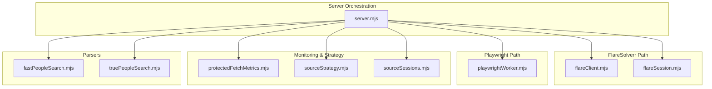
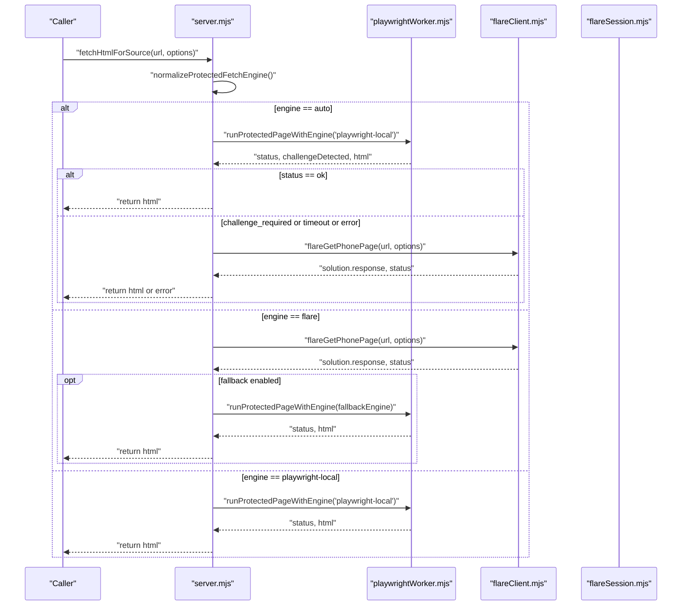
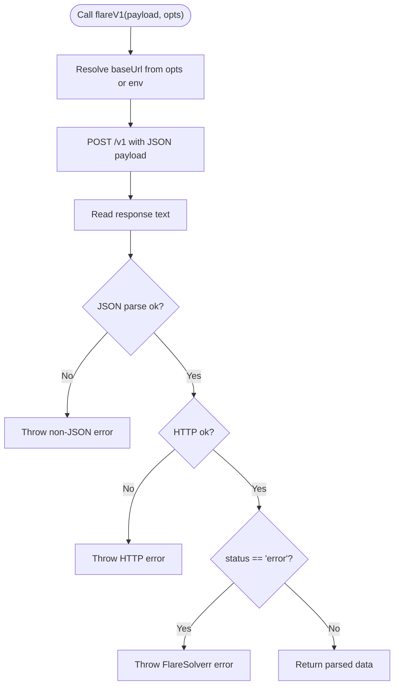
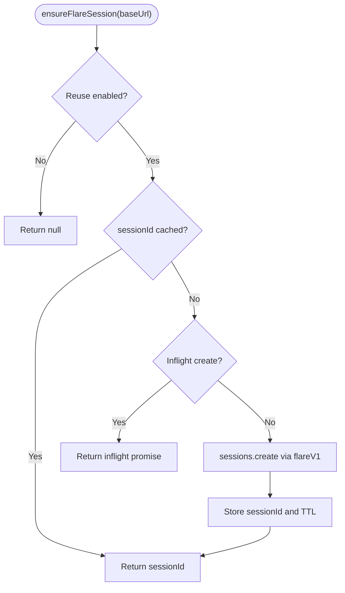
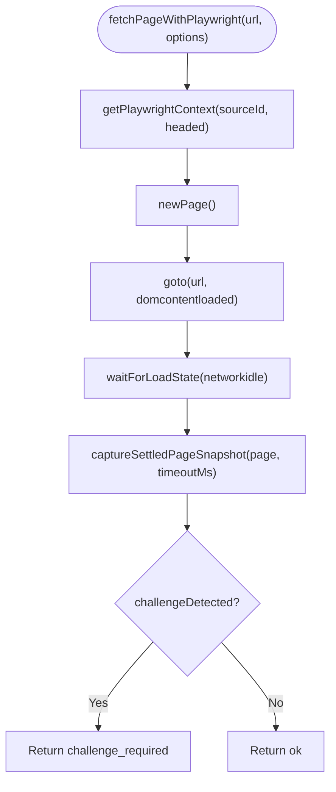
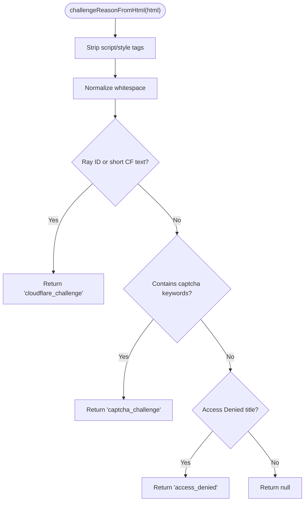
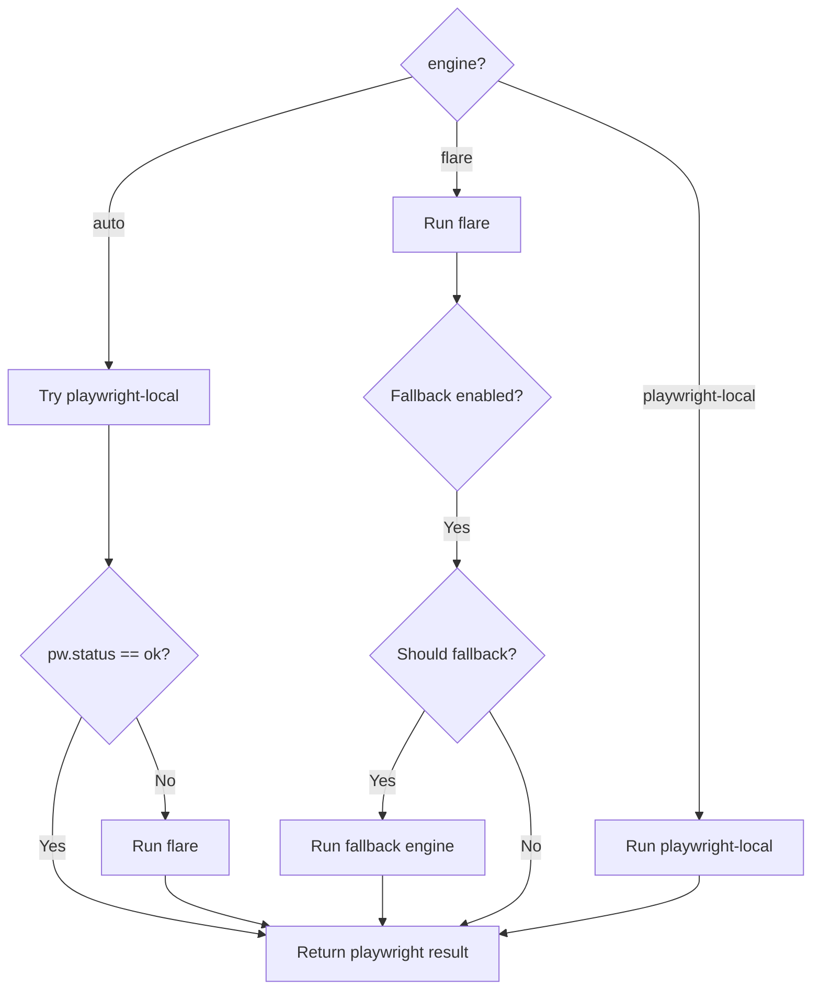
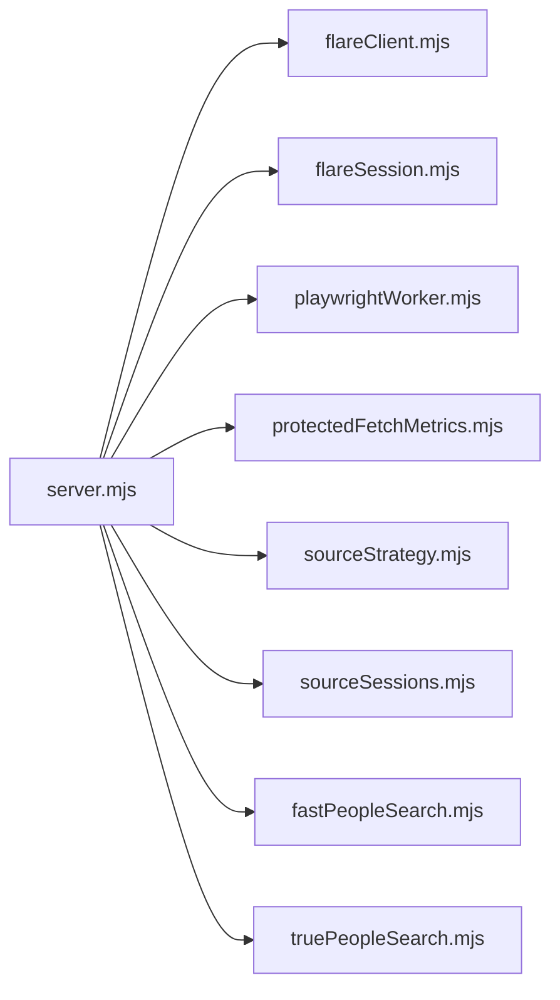

# Anti-Bot Bypass Systems

<cite>
**Referenced Files in This Document**
- [src/server.mjs](file://src/server.mjs)
- [src/flareClient.mjs](file://src/flareClient.mjs)
- [src/flareSession.mjs](file://src/flareSession.mjs)
- [src/playwrightWorker.mjs](file://src/playwrightWorker.mjs)
- [src/protectedFetchMetrics.mjs](file://src/protectedFetchMetrics.mjs)
- [src/fastPeopleSearch.mjs](file://src/fastPeopleSearch.mjs)
- [src/truePeopleSearch.mjs](file://src/truePeopleSearch.mjs)
- [src/sourceStrategy.mjs](file://src/sourceStrategy.mjs)
- [src/sourceSessions.mjs](file://src/sourceSessions.mjs)
- [scripts/probe-flare.mjs](file://scripts/probe-flare.mjs)
- [test/playwright-worker.test.mjs](file://test/playwright-worker.test.mjs)
- [test/source-sessions.test.mjs](file://test/source-sessions.test.mjs)
- [package.json](file://package.json)
</cite>

## Table of Contents
1. [Introduction](#introduction)
2. [Project Structure](#project-structure)
3. [Core Components](#core-components)
4. [Architecture Overview](#architecture-overview)
5. [Detailed Component Analysis](#detailed-component-analysis)
6. [Dependency Analysis](#dependency-analysis)
7. [Performance Considerations](#performance-considerations)
8. [Troubleshooting Guide](#troubleshooting-guide)
9. [Conclusion](#conclusion)
10. [Appendices](#appendices)

## Introduction
This document explains the anti-bot protection bypass systems implemented in the project. It covers the dual-engine architecture that integrates FlareSolverr and Playwright, automatic fallback mechanisms, engine selection algorithms, session management, proxy configuration, challenge detection, and performance monitoring. It also provides configuration guidance, troubleshooting strategies, and examples of engine switching and error recovery.

## Project Structure
The anti-bot bypass system centers around a small set of modules:
- Engine orchestration and fallback logic
- FlareSolverr client and session management
- Playwright worker for complex JavaScript challenges
- Metrics and health monitoring
- Source-specific parsers and trust strategies
- Session state persistence for interactive sources

**Diagram sources**
- [src/server.mjs](file://src/server.mjs)
- [src/flareClient.mjs](file://src/flareClient.mjs)
- [src/flareSession.mjs](file://src/flareSession.mjs)
- [src/playwrightWorker.mjs](file://src/playwrightWorker.mjs)
- [src/protectedFetchMetrics.mjs](file://src/protectedFetchMetrics.mjs)
- [src/sourceStrategy.mjs](file://src/sourceStrategy.mjs)
- [src/sourceSessions.mjs](file://src/sourceSessions.mjs)
- [src/fastPeopleSearch.mjs](file://src/fastPeopleSearch.mjs)
- [src/truePeopleSearch.mjs](file://src/truePeopleSearch.mjs)

**Section sources**
- [src/server.mjs](file://src/server.mjs)
- [src/flareClient.mjs](file://src/flareClient.mjs)
- [src/flareSession.mjs](file://src/flareSession.mjs)
- [src/playwrightWorker.mjs](file://src/playwrightWorker.mjs)
- [src/protectedFetchMetrics.mjs](file://src/protectedFetchMetrics.mjs)
- [src/fastPeopleSearch.mjs](file://src/fastPeopleSearch.mjs)
- [src/truePeopleSearch.mjs](file://src/truePeopleSearch.mjs)
- [src/sourceStrategy.mjs](file://src/sourceStrategy.mjs)
- [src/sourceSessions.mjs](file://src/sourceSessions.mjs)

## Core Components
- FlareSolverr client: Sends requests to the FlareSolverr API, parses responses, and handles non-JSON or error responses.
- FlareSolverr session manager: Optional session reuse with TTL, invalidation detection, and replacement on failure.
- Playwright worker: Persistent Chromium contexts per source, popup management, navigation, and challenge detection.
- Protected fetch orchestrator: Engine selection (auto, flare, playwright-local), fallback logic, and tracing.
- Metrics and health: Event recording, recent history, and trust-state computation.
- Source strategy and sessions: Trust failure classification, outcome statistics, and interactive session state.

**Section sources**
- [src/flareClient.mjs](file://src/flareClient.mjs)
- [src/flareSession.mjs](file://src/flareSession.mjs)
- [src/playwrightWorker.mjs](file://src/playwrightWorker.mjs)
- [src/server.mjs](file://src/server.mjs)
- [src/protectedFetchMetrics.mjs](file://src/protectedFetchMetrics.mjs)
- [src/sourceStrategy.mjs](file://src/sourceStrategy.mjs)
- [src/sourceSessions.mjs](file://src/sourceSessions.mjs)

## Architecture Overview
The system supports three operational modes:
- Flare-only: Uses FlareSolverr for all protected pages.
- Playwright-only: Uses persistent Chromium profiles for complex challenges.
- Auto: Attempts Playwright first; falls back to Flare on challenge/timeout/error.

**Diagram sources**
- [src/server.mjs](file://src/server.mjs)
- [src/playwrightWorker.mjs](file://src/playwrightWorker.mjs)
- [src/flareClient.mjs](file://src/flareClient.mjs)
- [src/flareSession.mjs](file://src/flareSession.mjs)

## Detailed Component Analysis

### FlareSolverr Client Implementation
- Endpoint: POST /v1 with JSON payload.
- Base URL resolution from environment or default.
- Robust error handling for non-JSON responses, HTTP errors, and FlareSolverr status errors.
- Returns parsed JSON on success.

**Diagram sources**
- [src/flareClient.mjs](file://src/flareClient.mjs)

**Section sources**
- [src/flareClient.mjs](file://src/flareClient.mjs)

### FlareSolverr Session Management
- Optional session reuse controlled by environment variable.
- TTL minutes supported when reuse is enabled.
- In-flight creation prevents redundant session creation.
- Failure handling:
  - Invalid session errors trigger replacement.
  - Certain errors prompt dropping the current session before retry.
- Graceful exit destroys the session if configured.

**Diagram sources**
- [src/flareSession.mjs](file://src/flareSession.mjs)

**Section sources**
- [src/flareSession.mjs](file://src/flareSession.mjs)

### Proxy Configuration
- Proxy support is passed through to FlareSolverr via the request payload.
- The server composes the FlareSolverr request with optional proxy configuration.

**Section sources**
- [src/server.mjs](file://src/server.mjs)
- [src/flareClient.mjs](file://src/flareClient.mjs)

### Playwright Worker System
- Persistent Chromium contexts keyed by sourceId with isolated profiles.
- Popup management and dialog dismissal to avoid interruptions.
- Navigation with sanitized URLs and load-state waits.
- Challenge detection:
  - Text-based heuristics for Cloudflare, CAPTCHA, Access Denied, and JS-required pages.
  - Special handling for Fast People Search result pages that may contain stale challenge text.
- Timeout budgeting per URL family to balance responsiveness and stability.
- Interactive mode for manual checkpoints.

**Diagram sources**
- [src/playwrightWorker.mjs](file://src/playwrightWorker.mjs)

**Section sources**
- [src/playwrightWorker.mjs](file://src/playwrightWorker.mjs)

### Challenge Detection and Cloudflare Bypass Techniques
- Heuristics:
  - Short-body indicators for “Checking your browser,” “Attention Required,” and Ray ID footers.
  - CAPTCHA-related keywords.
  - Access Denied titles.
- Special-case handling for Fast People Search result pages that appear as challenges but are actually solved results.
- Playwright settles the page by waiting until challenge text disappears, then re-evaluates content.

**Diagram sources**
- [src/playwrightWorker.mjs](file://src/playwrightWorker.mjs)

**Section sources**
- [src/playwrightWorker.mjs](file://src/playwrightWorker.mjs)
- [src/fastPeopleSearch.mjs](file://src/fastPeopleSearch.mjs)
- [src/truePeopleSearch.mjs](file://src/truePeopleSearch.mjs)

### Engine Selection and Automatic Fallback
- Modes:
  - auto: Try Playwright-local first; if non-ok, fallback to Flare.
  - flare: Use FlareSolverr; optionally fallback to Playwright based on configuration and result.
  - playwright-local: Use Playwright only.
- Fallback conditions:
  - Playwright: challenge_required, timeout, or error.
  - Flare: configurable fallback policy and result interpretation.
- Tracing and metadata preserve the requested engine, fallback origin, and initial status/reason.

**Diagram sources**
- [src/server.mjs](file://src/server.mjs)

**Section sources**
- [src/server.mjs](file://src/server.mjs)

### Source Strategy and Interactive Sessions
- Trust failure classification for blocked results.
- Outcome statistics and scoring for candidate URL patterns (used by some sources).
- Interactive session state persistence with pause/resume and warning tracking.

**Section sources**
- [src/sourceStrategy.mjs](file://src/sourceStrategy.mjs)
- [src/sourceSessions.mjs](file://src/sourceSessions.mjs)
- [test/source-sessions.test.mjs](file://test/source-sessions.test.mjs)

### Performance Monitoring and Metrics
- Event recording with bounded history.
- Health computation:
  - Counts of ok, failed, timed-out, and challenge events.
  - Median duration.
  - Trust state thresholds for healthy/degrading/poor.

**Section sources**
- [src/protectedFetchMetrics.mjs](file://src/protectedFetchMetrics.mjs)

## Dependency Analysis
- server.mjs orchestrates engines, metrics, and sessions.
- playrightWorker.mjs depends on Playwright and manages browser contexts.
- flareClient.mjs and flareSession.mjs depend on environment configuration and external FlareSolverr service.
- Parsers (fastPeopleSearch.mjs, truePeopleSearch.mjs) rely on HTML parsing and challenge detection logic.
- Metrics and strategy modules are shared utilities.

**Diagram sources**
- [src/server.mjs](file://src/server.mjs)
- [src/flareClient.mjs](file://src/flareClient.mjs)
- [src/flareSession.mjs](file://src/flareSession.mjs)
- [src/playwrightWorker.mjs](file://src/playwrightWorker.mjs)
- [src/protectedFetchMetrics.mjs](file://src/protectedFetchMetrics.mjs)
- [src/sourceStrategy.mjs](file://src/sourceStrategy.mjs)
- [src/sourceSessions.mjs](file://src/sourceSessions.mjs)
- [src/fastPeopleSearch.mjs](file://src/fastPeopleSearch.mjs)
- [src/truePeopleSearch.mjs](file://src/truePeopleSearch.mjs)

**Section sources**
- [src/server.mjs](file://src/server.mjs)
- [src/flareClient.mjs](file://src/flareClient.mjs)
- [src/flareSession.mjs](file://src/flareSession.mjs)
- [src/playwrightWorker.mjs](file://src/playwrightWorker.mjs)
- [src/protectedFetchMetrics.mjs](file://src/protectedFetchMetrics.mjs)
- [src/sourceStrategy.mjs](file://src/sourceStrategy.mjs)
- [src/sourceSessions.mjs](file://src/sourceSessions.mjs)
- [src/fastPeopleSearch.mjs](file://src/fastPeopleSearch.mjs)
- [src/truePeopleSearch.mjs](file://src/truePeopleSearch.mjs)

## Performance Considerations
- Timeout budgets:
  - Playwright uses per-URL-family budgets to avoid excessive waits.
  - FlareSolverr timeouts configurable via environment variables.
- Session reuse:
  - Optional FlareSolverr session reuse reduces cold-start overhead but may increase resource pressure; monitor health.
- Media and network:
  - Disabling media can reduce bandwidth and CPU usage for protected fetches.
- Browser profiles:
  - Persistent Chromium profiles improve reuse across requests; ensure adequate disk space and cleanup on demand.

[No sources needed since this section provides general guidance]

## Troubleshooting Guide
- FlareSolverr connectivity:
  - Use the probe script to verify endpoint reachability and response validity.
  - Confirm FLARE_BASE_URL points to a reachable host/port.
- Non-JSON responses:
  - The FlareSolverr client throws descriptive errors when responses are not valid JSON.
- Session invalidation:
  - Invalid session errors trigger automatic replacement; inspect logs for repeated failures indicating misconfiguration.
- Playwright popups and dialogs:
  - The worker automatically closes popup windows and dismisses dialogs to prevent stalls.
- Health and trust state:
  - Monitor recent events and trust state to detect degraded sources or infrastructure issues.
- Interactive sessions:
  - Use the interactive Playwright page to manually complete CAPTCHAs or browser checks.

**Section sources**
- [scripts/probe-flare.mjs](file://scripts/probe-flare.mjs)
- [src/flareClient.mjs](file://src/flareClient.mjs)
- [src/flareSession.mjs](file://src/flareSession.mjs)
- [src/playwrightWorker.mjs](file://src/playwrightWorker.mjs)
- [src/protectedFetchMetrics.mjs](file://src/protectedFetchMetrics.mjs)
- [test/playwright-worker.test.mjs](file://test/playwright-worker.test.mjs)

## Conclusion
The system combines FlareSolverr and Playwright to handle a wide range of anti-bot protections. The auto mode optimizes for speed while ensuring reliability through intelligent fallback. Robust session management, challenge detection, and metrics enable continuous monitoring and recovery. Proper configuration of timeouts, proxies, and session reuse policies balances performance and resilience.

[No sources needed since this section summarizes without analyzing specific files]

## Appendices

### Configuration Options
- Engine selection and fallback:
  - PROTECTED_FETCH_ENGINE: "flare", "playwright-local", or "auto".
  - PROTECTED_FETCH_FALLBACK_ON_FLARE_ERROR: Enable/disable fallback after Flare failures.
  - PROTECTED_FETCH_FALLBACK_ENGINE: Engine to use when falling back from Flare.
- FlareSolverr:
  - FLARE_BASE_URL: Base URL for FlareSolverr.
  - FLARE_PROXY_URL: Optional proxy for FlareSolverr requests.
  - FLARE_REUSE_SESSION: Enable session reuse.
  - FLARE_SESSION_TTL_MINUTES: Session TTL when reuse is enabled.
  - FLARE_MAX_TIMEOUT_MS: Max FlareSolverr timeout.
  - FLARE_WAIT_AFTER_SECONDS: Wait after seconds for FlareSolverr.
- Protected fetch:
  - PROTECTED_FETCH_COOLDOWN_MS: Cooldown between protected fetches.
  - EXTERNAL_SOURCE_TIMEOUT_MS: Default timeout for external source fetches.
  - EXTERNAL_SOURCE_USER_AGENT and EXTERNAL_SOURCE_ACCEPT_LANGUAGE: Headers for external requests.
- Metrics:
  - PROTECTED_FETCH_METRICS_MAX: Maximum number of recorded events.

**Section sources**
- [src/server.mjs](file://src/server.mjs)
- [src/flareSession.mjs](file://src/flareSession.mjs)
- [src/protectedFetchMetrics.mjs](file://src/protectedFetchMetrics.mjs)

### Example Scenarios and Recovery Strategies
- Playwright fails with a challenge:
  - The orchestrator logs the event and falls back to FlareSolverr for the same URL.
- FlareSolverr reports a session error:
  - The system replaces the session and retries the request.
- Frequent timeouts:
  - Consider increasing timeouts, disabling media, or switching to Playwright for problematic sources.
- Interactive checkpoints:
  - Use the interactive Playwright page to complete CAPTCHAs or browser checks, then resume automated fetching.

**Section sources**
- [src/server.mjs](file://src/server.mjs)
- [src/playwrightWorker.mjs](file://src/playwrightWorker.mjs)
- [src/flareSession.mjs](file://src/flareSession.mjs)