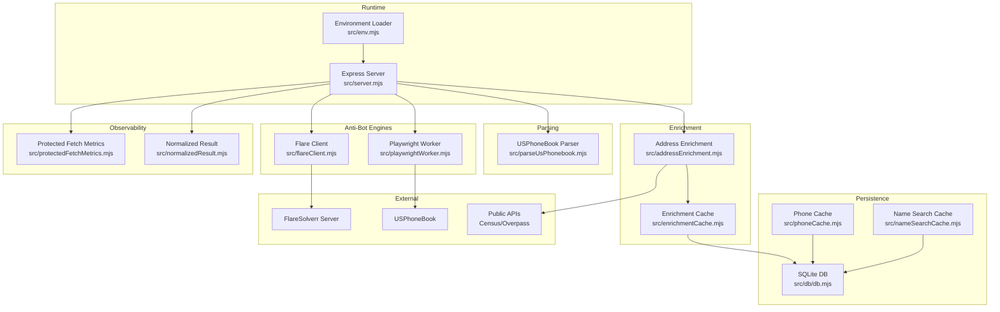
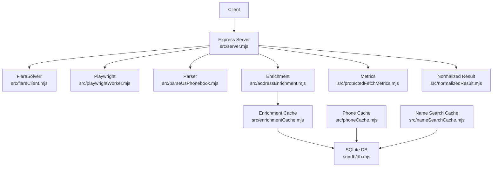
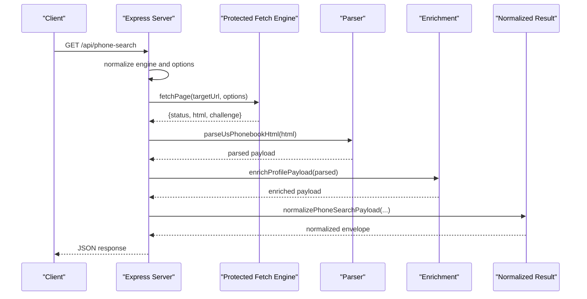
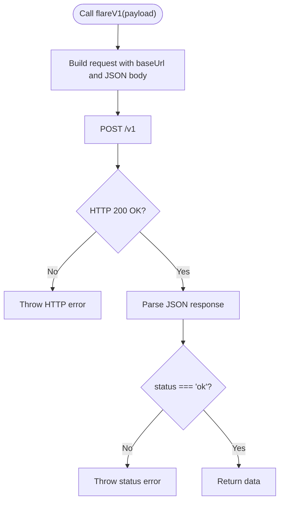
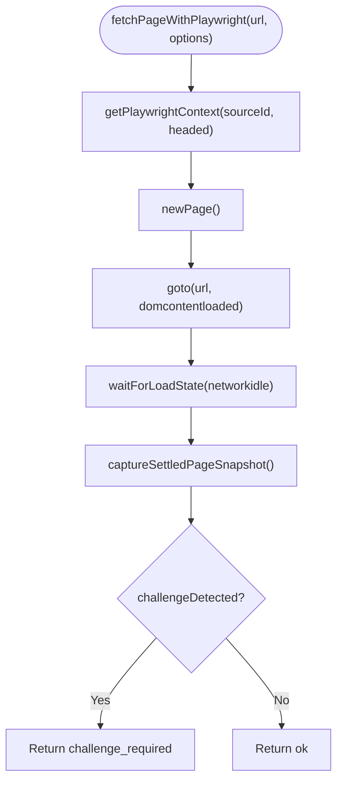
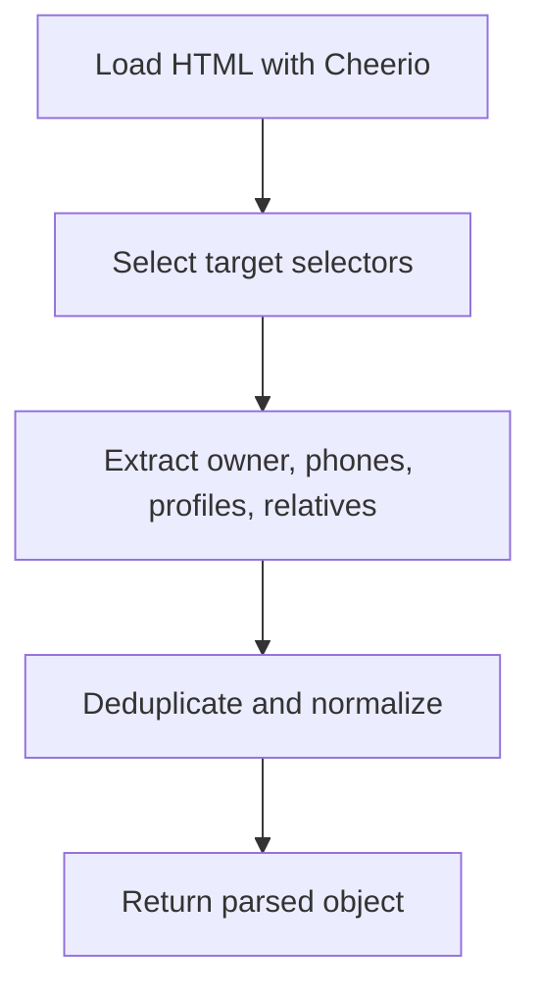
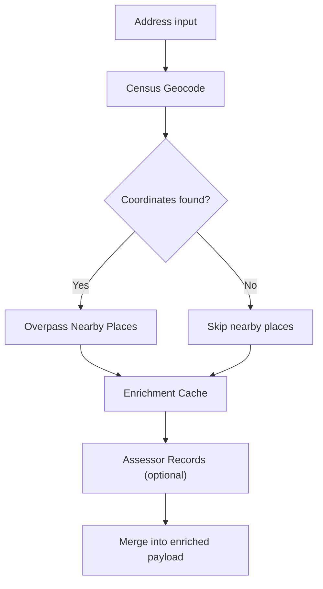
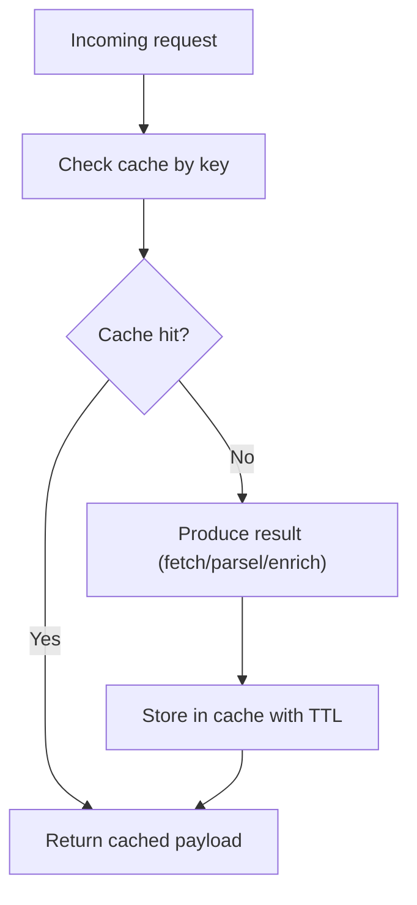
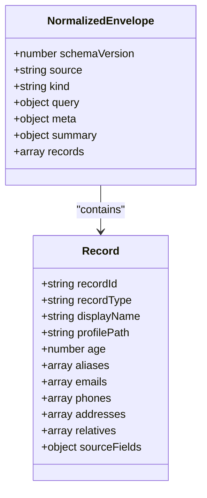
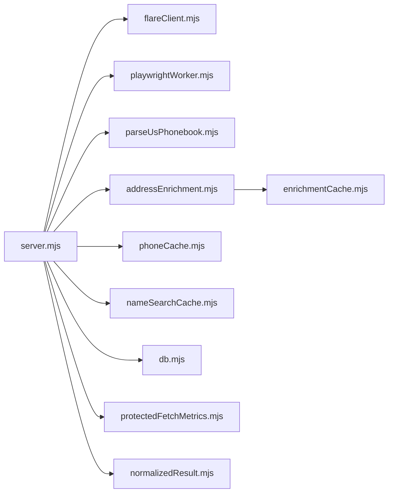

# Architecture Overview

<cite>
**Referenced Files in This Document**
- [README.md](file://README.md)
- [package.json](file://package.json)
- [docker-compose.yml](file://docker-compose.yml)
- [src/env.mjs](file://src/env.mjs)
- [src/server.mjs](file://src/server.mjs)
- [src/flareClient.mjs](file://src/flareClient.mjs)
- [src/playwrightWorker.mjs](file://src/playwrightWorker.mjs)
- [src/parseUsPhonebook.mjs](file://src/parseUsPhonebook.mjs)
- [src/addressEnrichment.mjs](file://src/addressEnrichment.mjs)
- [src/enrichmentCache.mjs](file://src/enrichmentCache.mjs)
- [src/db/db.mjs](file://src/db/db.mjs)
- [src/phoneCache.mjs](file://src/phoneCache.mjs)
- [src/nameSearchCache.mjs](file://src/nameSearchCache.mjs)
- [src/protectedFetchMetrics.mjs](file://src/protectedFetchMetrics.mjs)
- [src/normalizedResult.mjs](file://src/normalizedResult.mjs)
</cite>

## Table of Contents
1. [Introduction](#introduction)
2. [Project Structure](#project-structure)
3. [Core Components](#core-components)
4. [Architecture Overview](#architecture-overview)
5. [Detailed Component Analysis](#detailed-component-analysis)
6. [Dependency Analysis](#dependency-analysis)
7. [Performance Considerations](#performance-considerations)
8. [Troubleshooting Guide](#troubleshooting-guide)
9. [Conclusion](#conclusion)
10. [Appendices](#appendices)

## Introduction
This document describes the architecture of the USPhoneBook Flare App, an Express.js-based web service that retrieves USPhoneBook search pages via a remote FlareSolverr instance to bypass Cloudflare challenges, then parses and enriches the results. The system is designed as a modular microservice stack with clear boundaries between protected fetch, parsing, and enrichment layers. It supports multiple anti-bot engines (FlareSolverr and a local Playwright worker), multi-engine fallback, robust caching, and a normalized internal result contract for downstream integrations. Cross-cutting concerns include health monitoring, trust diagnostics, logging, and performance metrics.

## Project Structure
The project is organized around a Node.js Express server and a set of focused modules implementing specialized responsibilities:
- Server and routing: Express server initialization, route handlers, and orchestration
- Anti-bot engines: FlareSolverr client and local Playwright worker
- Parsing: Cheerio-based parsers for USPhoneBook HTML
- Enrichment: Public-source geocoding, nearby place discovery, assessor integration, and telecom analysis
- Persistence: SQLite-backed caches and graph/entity storage
- Utilities: Environment loading, normalized result shaping, and metrics

**Diagram sources**
- [src/server.mjs](file://src/server.mjs)
- [src/flareClient.mjs](file://src/flareClient.mjs)
- [src/playwrightWorker.mjs](file://src/playwrightWorker.mjs)
- [src/parseUsPhonebook.mjs](file://src/parseUsPhonebook.mjs)
- [src/addressEnrichment.mjs](file://src/addressEnrichment.mjs)
- [src/enrichmentCache.mjs](file://src/enrichmentCache.mjs)
- [src/db/db.mjs](file://src/db/db.mjs)
- [src/phoneCache.mjs](file://src/phoneCache.mjs)
- [src/nameSearchCache.mjs](file://src/nameSearchCache.mjs)
- [src/protectedFetchMetrics.mjs](file://src/protectedFetchMetrics.mjs)
- [src/normalizedResult.mjs](file://src/normalizedResult.mjs)

**Section sources**
- [README.md](file://README.md)
- [package.json](file://package.json)
- [docker-compose.yml](file://docker-compose.yml)

## Core Components
- Express server: Initializes environment, loads routes, orchestrates protected fetch, parsing, enrichment, and normalization, and exposes health and diagnostic endpoints.
- FlareSolverr client: Encapsulates Flare v1 API calls, error handling, and response decoding.
- Playwright worker: Provides a local browser engine with persistent contexts, challenge detection, and interactive session support.
- Parsers: Cheerio-based HTML parsers for phone search, name search, and profile pages.
- Enrichment pipeline: Geocoding, nearby place discovery, assessor integration, and telecom analysis with caching and rate limiting.
- Caching: In-memory and SQLite-backed caches for protected fetch responses and enrichment results.
- Metrics and observability: Protected fetch trust diagnostics, scrape logging, and normalized result envelopes.

**Section sources**
- [src/server.mjs](file://src/server.mjs)
- [src/flareClient.mjs](file://src/flareClient.mjs)
- [src/playwrightWorker.mjs](file://src/playwrightWorker.mjs)
- [src/parseUsPhonebook.mjs](file://src/parseUsPhonebook.mjs)
- [src/addressEnrichment.mjs](file://src/addressEnrichment.mjs)
- [src/enrichmentCache.mjs](file://src/enrichmentCache.mjs)
- [src/phoneCache.mjs](file://src/phoneCache.mjs)
- [src/nameSearchCache.mjs](file://src/nameSearchCache.mjs)
- [src/protectedFetchMetrics.mjs](file://src/protectedFetchMetrics.mjs)
- [src/normalizedResult.mjs](file://src/normalizedResult.mjs)

## Architecture Overview
The system follows a layered architecture:
- Presentation and API: Express routes expose health, search, and graph endpoints.
- Orchestration: Server composes protected fetch, parsing, enrichment, and normalization.
- Anti-bot protection: Dual-path engines (FlareSolverr and Playwright) with automatic fallback.
- Data processing: Parsing and enrichment produce normalized payloads for downstream use.
- Persistence: SQLite stores caches, graph/entity data, and operational state.
- Observability: Trust metrics, scrape logs, and normalized envelopes.

**Diagram sources**
- [src/server.mjs](file://src/server.mjs)
- [src/flareClient.mjs](file://src/flareClient.mjs)
- [src/playwrightWorker.mjs](file://src/playwrightWorker.mjs)
- [src/parseUsPhonebook.mjs](file://src/parseUsPhonebook.mjs)
- [src/addressEnrichment.mjs](file://src/addressEnrichment.mjs)
- [src/enrichmentCache.mjs](file://src/enrichmentCache.mjs)
- [src/phoneCache.mjs](file://src/phoneCache.mjs)
- [src/nameSearchCache.mjs](file://src/nameSearchCache.mjs)
- [src/db/db.mjs](file://src/db/db.mjs)
- [src/protectedFetchMetrics.mjs](file://src/protectedFetchMetrics.mjs)
- [src/normalizedResult.mjs](file://src/normalizedResult.mjs)

## Detailed Component Analysis

### Express Server Orchestration
The server initializes environment variables, sets up caches and graph maintenance, and defines API routes. It coordinates protected fetch selection (Flare or Playwright), applies cooldowns, and records trust metrics. It integrates parsers and enrichment, then produces normalized results.

**Diagram sources**
- [src/server.mjs](file://src/server.mjs)
- [src/parseUsPhonebook.mjs](file://src/parseUsPhonebook.mjs)
- [src/addressEnrichment.mjs](file://src/addressEnrichment.mjs)
- [src/normalizedResult.mjs](file://src/normalizedResult.mjs)

**Section sources**
- [src/server.mjs](file://src/server.mjs)

### FlareSolverr Client
Encapsulates Flare v1 API calls, validates responses, and surfaces errors. It supports optional proxy configuration, session reuse, and wait-after settings.

**Diagram sources**
- [src/flareClient.mjs](file://src/flareClient.mjs)

**Section sources**
- [src/flareClient.mjs](file://src/flareClient.mjs)

### Playwright Worker
Provides a persistent Chromium context per source scope, handles navigation, challenge detection, and interactive sessions. It sanitizes URLs, guards against popups, and captures settled snapshots.

**Diagram sources**
- [src/playwrightWorker.mjs](file://src/playwrightWorker.mjs)

**Section sources**
- [src/playwrightWorker.mjs](file://src/playwrightWorker.mjs)

### Parsing Layer
Cheerio-based parsers extract structured data from USPhoneBook HTML for phone and name searches, and profile pages. They handle relative deduplication and produce normalized candidate lists.

**Diagram sources**
- [src/parseUsPhonebook.mjs](file://src/parseUsPhonebook.mjs)

**Section sources**
- [src/parseUsPhonebook.mjs](file://src/parseUsPhonebook.mjs)

### Enrichment Pipeline
Public-source enrichment includes U.S. Census geocoding, nearby place discovery via Overpass, and assessor record retrieval. Results are cached with TTL and eviction policies.

**Diagram sources**
- [src/addressEnrichment.mjs](file://src/addressEnrichment.mjs)
- [src/enrichmentCache.mjs](file://src/enrichmentCache.mjs)

**Section sources**
- [src/addressEnrichment.mjs](file://src/addressEnrichment.mjs)
- [src/enrichmentCache.mjs](file://src/enrichmentCache.mjs)

### Caching Strategies
- Phone search cache: SQLite-backed LRU with TTL and max entries.
- Name search cache: SQLite-backed with separate key prefix and limits.
- Enrichment cache: SQLite-backed with hash-based keys, TTL, and inflight deduplication.

**Diagram sources**
- [src/phoneCache.mjs](file://src/phoneCache.mjs)
- [src/nameSearchCache.mjs](file://src/nameSearchCache.mjs)
- [src/enrichmentCache.mjs](file://src/enrichmentCache.mjs)
- [src/db/db.mjs](file://src/db/db.mjs)

**Section sources**
- [src/phoneCache.mjs](file://src/phoneCache.mjs)
- [src/nameSearchCache.mjs](file://src/nameSearchCache.mjs)
- [src/enrichmentCache.mjs](file://src/enrichmentCache.mjs)
- [src/db/db.mjs](file://src/db/db.mjs)

### Normalized Internal Result Contract
The system emits a normalized envelope with schema version, source, kind, query context, meta, summary, and records. This enables downstream integrations and graph rebuilds.

**Diagram sources**
- [src/normalizedResult.mjs](file://src/normalizedResult.mjs)

**Section sources**
- [src/normalizedResult.mjs](file://src/normalizedResult.mjs)

## Dependency Analysis
The server module imports and composes multiple subsystems. Dependencies are primarily functional modules with minimal coupling to external frameworks.

**Diagram sources**
- [src/server.mjs](file://src/server.mjs)
- [src/flareClient.mjs](file://src/flareClient.mjs)
- [src/playwrightWorker.mjs](file://src/playwrightWorker.mjs)
- [src/parseUsPhonebook.mjs](file://src/parseUsPhonebook.mjs)
- [src/addressEnrichment.mjs](file://src/addressEnrichment.mjs)
- [src/enrichmentCache.mjs](file://src/enrichmentCache.mjs)
- [src/phoneCache.mjs](file://src/phoneCache.mjs)
- [src/nameSearchCache.mjs](file://src/nameSearchCache.mjs)
- [src/db/db.mjs](file://src/db/db.mjs)
- [src/protectedFetchMetrics.mjs](file://src/protectedFetchMetrics.mjs)
- [src/normalizedResult.mjs](file://src/normalizedResult.mjs)

**Section sources**
- [src/server.mjs](file://src/server.mjs)

## Performance Considerations
- Anti-bot engines: FlareSolverr requires a dedicated container; local Playwright avoids network latency but consumes local resources. Session reuse reduces cold starts but may degrade over time; consider TTL rotation or restarts.
- Concurrency: Protected fetch cooldown mitigates burstiness; adjust PROTECTED_FETCH_COOLDOWN_MS to balance throughput and bot detection risk.
- Caching: Tune PHONE_CACHE_TTL_MS, NAME_SEARCH_CACHE_TTL_MS, and ENRICHMENT_CACHE_MAX to optimize hit rates and memory footprint.
- Public APIs: Respect Overpass minimum intervals and user-agent policies; configure OSINT_CONTACT_EMAIL to identify your instance politely.
- Monitoring: Use SCRAPE_LOGGING and SCRAPE_PROGRESS_INTERVAL_MS to observe long-running steps; rely on trust health metrics for adaptive tuning.

[No sources needed since this section provides general guidance]

## Troubleshooting Guide
- FlareSolverr connectivity: Use the probe script to verify sessions and base URL reachability.
- Timeout and challenge failures: Increase FLARE_MAX_TIMEOUT_MS, disable media, or switch to Playwright fallback.
- Session issues: Enable FLARE_REUSE_SESSION with optional session_ttl_minutes; monitor trust health and rotate sessions as needed.
- Logging: Enable SCRAPE_LOGGING and adjust SCRAPE_PROGRESS_INTERVAL_MS for visibility into protected fetch stages.
- Metrics: Monitor /api/trust-health for challenge rate, success rate, and median duration.

**Section sources**
- [README.md](file://README.md)
- [src/server.mjs](file://src/server.mjs)
- [src/protectedFetchMetrics.mjs](file://src/protectedFetchMetrics.mjs)

## Conclusion
The USPhoneBook Flare App employs a clean, modular architecture separating protected fetch, parsing, and enrichment into cohesive layers. By supporting dual anti-bot engines with automatic fallback, robust caching, and normalized outputs, it balances reliability, performance, and extensibility. Proper configuration of timeouts, proxies, and session management, coupled with observability and caching tuning, ensures resilient operation at scale.

[No sources needed since this section summarizes without analyzing specific files]

## Appendices

### API Surface and Health Endpoints
- GET /api/health: Verifies FlareSolverr connectivity and reports base URL.
- GET /api/trust-health: Rolling diagnostics for protected-fetch trust (challenge rate, success rate, median duration).
- GET /api/phone-search: Returns cached or freshly fetched phone search results; supports nocache bypass.
- POST /api/phone-search: JSON body with engine overrides and proxy settings.
- GET /api/name-search: Mirrors USPhoneBook’s people-search route with caching.
- POST /api/name-search: JSON body with name, city, state, and engine options.

**Section sources**
- [README.md](file://README.md)

### Infrastructure Requirements and Deployment Topology
- FlareSolverr dependency: A remote FlareSolverr server must be reachable; the app expects a base URL and uses the /v1 endpoint.
- Docker option: The provided compose file demonstrates exposing FlareSolverr on port 8191.
- Node runtime: Requires Node.js 18+; Playwright is optional for local engine usage.

**Section sources**
- [README.md](file://README.md)
- [docker-compose.yml](file://docker-compose.yml)
- [package.json](file://package.json)