# Data Flow Architecture

<cite>
**Referenced Files in This Document**
- [server.mjs](file://src/server.mjs)
- [parseUsPhonebook.mjs](file://src/parseUsPhonebook.mjs)
- [parseUsPhonebookNameSearch.mjs](file://src/parseUsPhonebookNameSearch.mjs)
- [parseUsPhonebookProfile.mjs](file://src/parseUsPhonebookProfile.mjs)
- [normalizedResult.mjs](file://src/normalizedResult.mjs)
- [entityIngest.mjs](file://src/entityIngest.mjs)
- [graphRebuild.mjs](file://src/graphRebuild.mjs)
- [graphQuery.mjs](file://src/graphQuery.mjs)
- [db.mjs](file://src/db/db.mjs)
- [phoneCache.mjs](file://src/phoneCache.mjs)
- [nameSearchCache.mjs](file://src/nameSearchCache.mjs)
- [enrichmentCache.mjs](file://src/enrichmentCache.mjs)
- [addressEnrichment.mjs](file://src/addressEnrichment.mjs)
- [phoneEnrichment.mjs](file://src/phoneEnrichment.mjs)
- [addressFormat.mjs](file://src/addressFormat.mjs)
- [personKey.mjs](file://src/personKey.mjs)
- [vectorStore.mjs](file://src/vectorStore.mjs)
- [thatsThem.mjs](file://src/thatsThem.mjs)
- [fastPeopleSearch.mjs](file://src/fastPeopleSearch.mjs)
- [truePeopleSearch.mjs](file://src/truePeopleSearch.mjs)
- [playwrightWorker.mjs](file://src/playwrightWorker.mjs)
- [sourceSessions.mjs](file://src/sourceSessions.mjs)
- [sourceStrategy.mjs](file://src/sourceStrategy.mjs)
- [protectedFetchMetrics.mjs](file://src/protectedFetchMetrics.mjs)
</cite>

## Table of Contents
1. [Introduction](#introduction)
2. [Project Structure](#project-structure)
3. [Core Components](#core-components)
4. [Architecture Overview](#architecture-overview)
5. [Detailed Component Analysis](#detailed-component-analysis)
6. [Dependency Analysis](#dependency-analysis)
7. [Performance Considerations](#performance-considerations)
8. [Troubleshooting Guide](#troubleshooting-guide)
9. [Conclusion](#conclusion)

## Introduction
This document describes the end-to-end data flow architecture of the system, from API requests and protected fetching through parsing, normalization, enrichment, graph construction, persistence, and retrieval. It explains the request-response cycle, intermediate transformations, caching strategies, and the relationships between data stores and access patterns. It also covers entity ingestion, graph building, validation workflows, error propagation, and performance optimizations via caching, batching, and parallelization.

## Project Structure
The system is organized around a modular pipeline:
- HTTP entrypoint and orchestration
- Protected fetching engines (FlareSolverr and Playwright)
- Source-specific parsers for HTML pages
- Normalization into a unified schema
- Enrichment of addresses and phone numbers
- Graph ingestion and persistence
- Query and retrieval of graph data
- Caching layers for responses and enrichment
- Vector indexing for text search

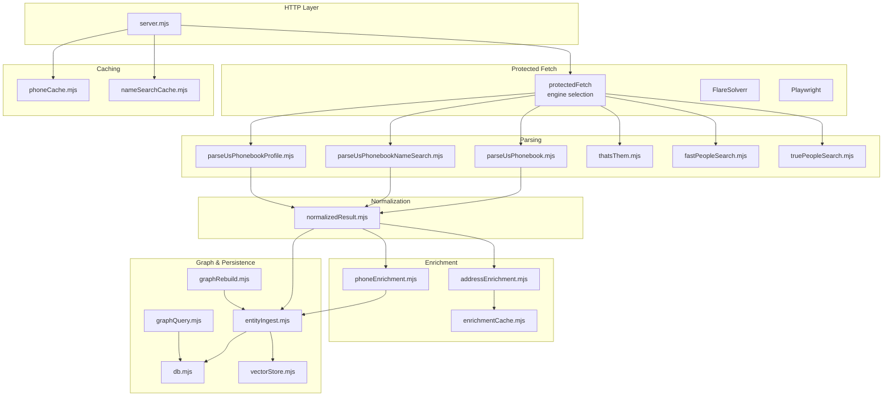

**Diagram sources**
- [server.mjs:1-800](file://src/server.mjs#L1-L800)
- [parseUsPhonebook.mjs:1-103](file://src/parseUsPhonebook.mjs#L1-L103)
- [parseUsPhonebookNameSearch.mjs](file://src/parseUsPhonebookNameSearch.mjs)
- [parseUsPhonebookProfile.mjs](file://src/parseUsPhonebookProfile.mjs)
- [thatsThem.mjs](file://src/thatsThem.mjs)
- [fastPeopleSearch.mjs](file://src/fastPeopleSearch.mjs)
- [truePeopleSearch.mjs](file://src/truePeopleSearch.mjs)
- [normalizedResult.mjs:1-506](file://src/normalizedResult.mjs#L1-L506)
- [addressEnrichment.mjs:1-386](file://src/addressEnrichment.mjs#L1-L386)
- [phoneEnrichment.mjs:1-126](file://src/phoneEnrichment.mjs#L1-L126)
- [enrichmentCache.mjs:1-117](file://src/enrichmentCache.mjs#L1-L117)
- [entityIngest.mjs:1-665](file://src/entityIngest.mjs#L1-L665)
- [graphRebuild.mjs:1-162](file://src/graphRebuild.mjs#L1-L162)
- [graphQuery.mjs:1-225](file://src/graphQuery.mjs#L1-L225)
- [db.mjs:1-185](file://src/db/db.mjs#L1-L185)
- [vectorStore.mjs:1-134](file://src/vectorStore.mjs#L1-L134)
- [phoneCache.mjs:1-161](file://src/phoneCache.mjs#L1-L161)
- [nameSearchCache.mjs:1-79](file://src/nameSearchCache.mjs#L1-L79)

**Section sources**
- [server.mjs:1-800](file://src/server.mjs#L1-L800)
- [db.mjs:21-120](file://src/db/db.mjs#L21-L120)

## Core Components
- HTTP server and request orchestration: routes, protected fetch engine selection, caching, and metrics.
- Protected fetch engines: FlareSolverr and Playwright with fallback and session management.
- Source parsers: HTML-to-structured data extraction for multiple sources.
- Normalization: unified schema and metadata envelope for all results.
- Enrichment: geocoding, nearby places, assessor records, and phone metadata.
- Graph ingestion: entity and edge creation, deduplication, and indexing.
- Persistence: SQLite-backed entities, edges, caches, and snapshots.
- Retrieval: full graph, neighborhood queries, and label search.
- Caching: response cache for phone/name searches and enrichment cache with LRU pruning.
- Vector indexing: optional embedding storage for text search.

**Section sources**
- [server.mjs:1-800](file://src/server.mjs#L1-L800)
- [normalizedResult.mjs:167-381](file://src/normalizedResult.mjs#L167-L381)
- [entityIngest.mjs:470-665](file://src/entityIngest.mjs#L470-L665)
- [db.mjs:25-120](file://src/db/db.mjs#L25-L120)
- [graphQuery.mjs:18-135](file://src/graphQuery.mjs#L18-L135)
- [phoneCache.mjs:44-99](file://src/phoneCache.mjs#L44-L99)
- [nameSearchCache.mjs:27-78](file://src/nameSearchCache.mjs#L27-L78)
- [enrichmentCache.mjs:48-89](file://src/enrichmentCache.mjs#L48-L89)
- [vectorStore.mjs:91-133](file://src/vectorStore.mjs#L91-L133)

## Architecture Overview
The system follows a request-driven pipeline:
1. An HTTP request arrives at the server.
2. The server selects a protected fetch engine (FlareSolverr or Playwright) and retrieves HTML.
3. Source-specific parsers convert HTML into structured payloads.
4. Normalization transforms payloads into a unified schema with metadata.
5. Enrichment augments data (addresses, phones, nearby places).
6. Graph ingestion creates entities and edges; vectors are indexed.
7. Results are returned to the client; caches store intermediate artifacts.

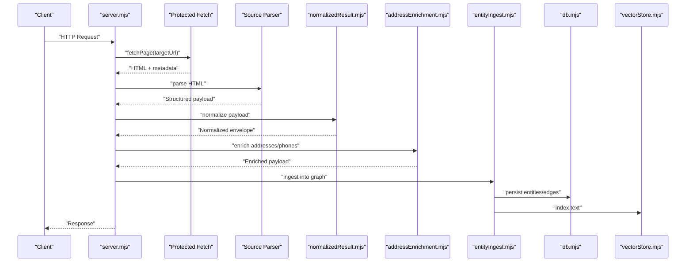

**Diagram sources**
- [server.mjs:791-789](file://src/server.mjs#L791-L789)
- [parseUsPhonebook.mjs:14-103](file://src/parseUsPhonebook.mjs#L14-L103)
- [normalizedResult.mjs:167-381](file://src/normalizedResult.mjs#L167-L381)
- [addressEnrichment.mjs:376-385](file://src/addressEnrichment.mjs#L376-L385)
- [entityIngest.mjs:470-665](file://src/entityIngest.mjs#L470-L665)
- [db.mjs:25-120](file://src/db/db.mjs#L25-L120)
- [vectorStore.mjs:91-111](file://src/vectorStore.mjs#L91-L111)

## Detailed Component Analysis

### HTTP Request Orchestration and Protected Fetch
- Engine selection and fallback: auto, FlareSolverr, or Playwright-local.
- Session management for FlareSolverr with reuse and invalid-session handling.
- Browser session readiness checks and escalation to interactive sessions.
- Metrics recording for trust events and scrape traces.
- Header building and request throttling/cooldown.

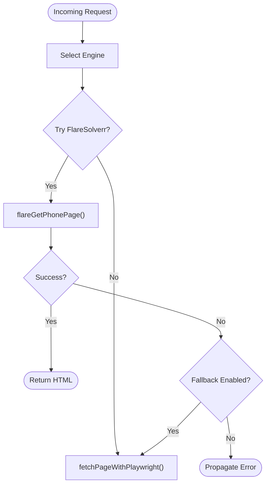

**Diagram sources**
- [server.mjs:791-789](file://src/server.mjs#L791-L789)
- [server.mjs:640-672](file://src/server.mjs#L640-L672)
- [playwrightWorker.mjs](file://src/playwrightWorker.mjs)

**Section sources**
- [server.mjs:791-789](file://src/server.mjs#L791-L789)
- [server.mjs:640-672](file://src/server.mjs#L640-L672)
- [server.mjs:270-299](file://src/server.mjs#L270-L299)
- [server.mjs:329-347](file://src/server.mjs#L329-L347)
- [protectedFetchMetrics.mjs](file://src/protectedFetchMetrics.mjs)

### Parsing Pipeline
- US Phonebook phone/name/profile parsers extract owners, phones, addresses, relatives, and teaser flags.
- External source adapters (ThatS Them, Fast People Search, True People Search) provide additional parsers and URL builders.
- Name search and profile parsers produce candidate lists and detailed profiles.

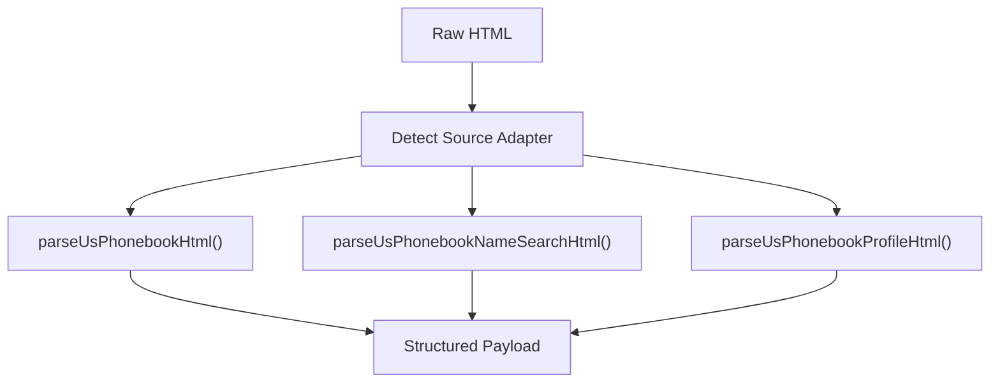

**Diagram sources**
- [parseUsPhonebook.mjs:14-103](file://src/parseUsPhonebook.mjs#L14-L103)
- [parseUsPhonebookNameSearch.mjs](file://src/parseUsPhonebookNameSearch.mjs)
- [parseUsPhonebookProfile.mjs](file://src/parseUsPhonebookProfile.mjs)
- [thatsThem.mjs](file://src/thatsThem.mjs)
- [fastPeopleSearch.mjs](file://src/fastPeopleSearch.mjs)
- [truePeopleSearch.mjs](file://src/truePeopleSearch.mjs)

**Section sources**
- [parseUsPhonebook.mjs:14-103](file://src/parseUsPhonebook.mjs#L14-L103)

### Normalization and Schema Envelope
- Cleans and compacts objects, normalizes text, paths, phones, and addresses.
- Produces a frozen envelope with schema version, kind, query, meta, summary, and records.
- Converts normalized results into graph rebuild items for queue-driven ingestion.

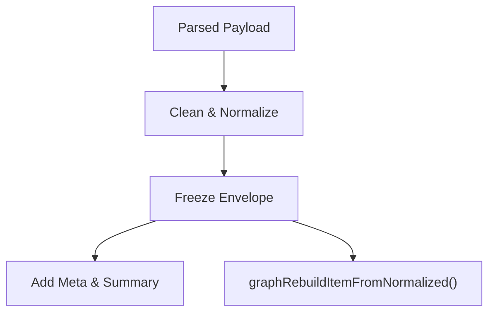

**Diagram sources**
- [normalizedResult.mjs:7-34](file://src/normalizedResult.mjs#L7-L34)
- [normalizedResult.mjs:167-381](file://src/normalizedResult.mjs#L167-L381)
- [normalizedResult.mjs:388-505](file://src/normalizedResult.mjs#L388-L505)

**Section sources**
- [normalizedResult.mjs:167-381](file://src/normalizedResult.mjs#L167-L381)
- [normalizedResult.mjs:388-505](file://src/normalizedResult.mjs#L388-L505)

### Enrichment Workflows
- Address enrichment: geocoding via Census, nearby places via Overpass, and assessor records.
- Phone enrichment: normalization and metadata extraction.
- Enrichment cache: namespace-scoped, TTL-based, with in-flight deduplication and LRU pruning.

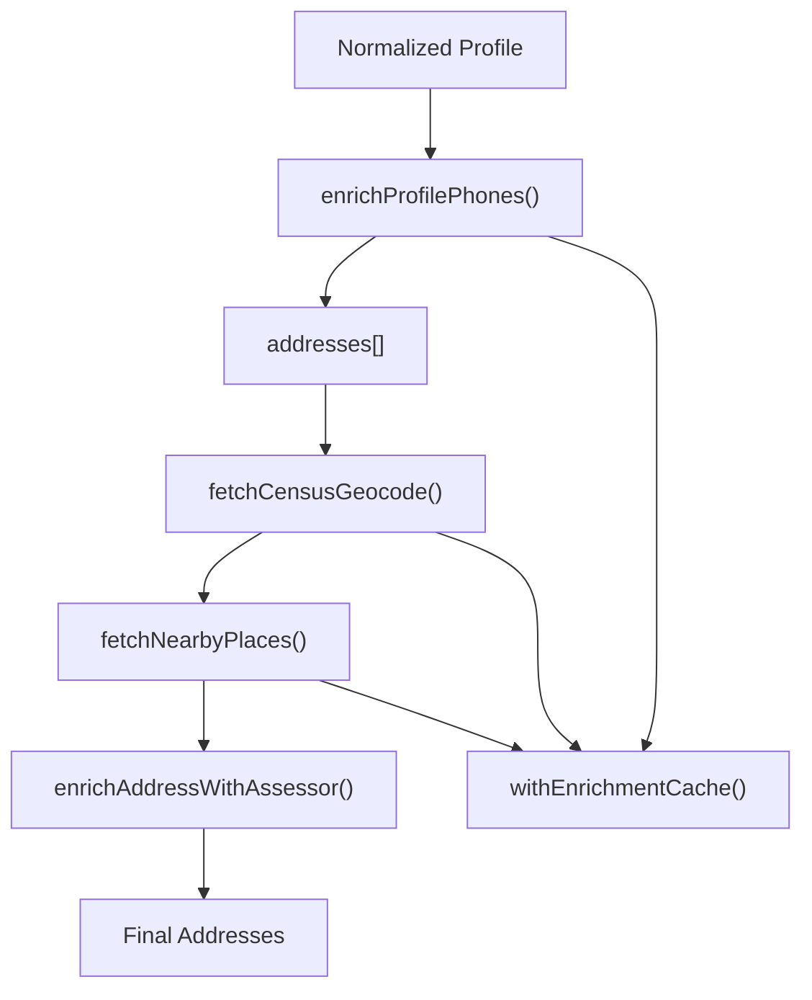

**Diagram sources**
- [addressEnrichment.mjs:376-385](file://src/addressEnrichment.mjs#L376-L385)
- [phoneEnrichment.mjs:114-125](file://src/phoneEnrichment.mjs#L114-L125)
- [enrichmentCache.mjs:99-116](file://src/enrichmentCache.mjs#L99-L116)

**Section sources**
- [addressEnrichment.mjs:255-293](file://src/addressEnrichment.mjs#L255-L293)
- [addressEnrichment.mjs:308-343](file://src/addressEnrichment.mjs#L308-L343)
- [phoneEnrichment.mjs:29-96](file://src/phoneEnrichment.mjs#L29-L96)
- [enrichmentCache.mjs:48-89](file://src/enrichmentCache.mjs#L48-L89)

### Entity Ingestion and Graph Construction
- Upsert entities by dedupe_key, merging data and computing field diffs.
- Build person, phone, address, email entities; create edges (line_assigned, relative, has_phone, has_email, at_address).
- Index entity text for vector search.
- Merge duplicates by name and path keys; prune isolated nodes after rebuild.

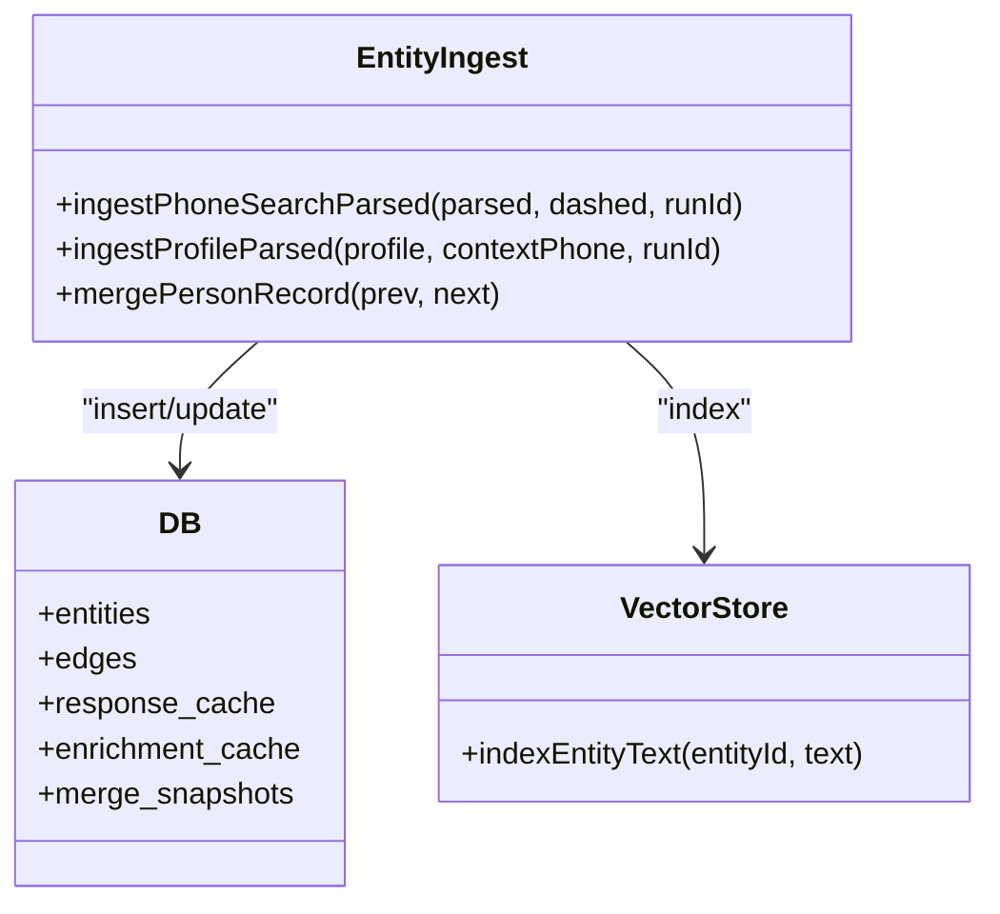

**Diagram sources**
- [entityIngest.mjs:470-665](file://src/entityIngest.mjs#L470-L665)
- [db.mjs:25-120](file://src/db/db.mjs#L25-L120)
- [vectorStore.mjs:91-111](file://src/vectorStore.mjs#L91-L111)

**Section sources**
- [entityIngest.mjs:233-296](file://src/entityIngest.mjs#L233-L296)
- [entityIngest.mjs:310-352](file://src/entityIngest.mjs#L310-L352)
- [entityIngest.mjs:470-552](file://src/entityIngest.mjs#L470-L552)
- [entityIngest.mjs:560-665](file://src/entityIngest.mjs#L560-L665)

### Graph Rebuild and Incremental Merge
- Full rebuild clears and re-ingests from queue items; merges duplicates and prunes isolates.
- Incremental merge adds items without destructive clearing.

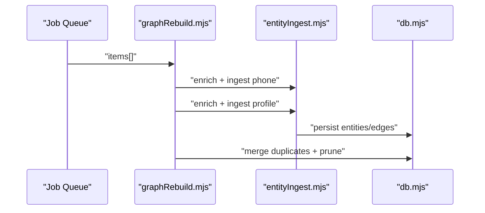

**Diagram sources**
- [graphRebuild.mjs:25-96](file://src/graphRebuild.mjs#L25-L96)
- [graphRebuild.mjs:108-161](file://src/graphRebuild.mjs#L108-L161)
- [entityIngest.mjs:470-665](file://src/entityIngest.mjs#L470-L665)
- [db.mjs:25-120](file://src/db/db.mjs#L25-L120)

**Section sources**
- [graphRebuild.mjs:25-96](file://src/graphRebuild.mjs#L25-L96)
- [graphRebuild.mjs:108-161](file://src/graphRebuild.mjs#L108-L161)

### Retrieval and Query
- Full graph export and neighborhood traversal with label presentation for addresses/emails.
- Label search across entities.
- Unified relatives extraction for a phone number.

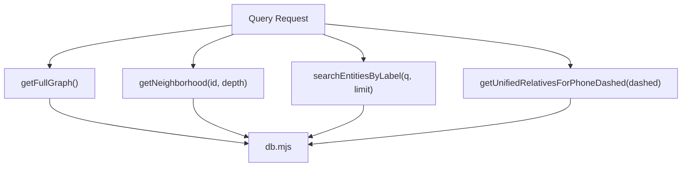

**Diagram sources**
- [graphQuery.mjs:18-135](file://src/graphQuery.mjs#L18-L135)
- [graphQuery.mjs:142-152](file://src/graphQuery.mjs#L142-L152)
- [graphQuery.mjs:173-224](file://src/graphQuery.mjs#L173-L224)
- [db.mjs:25-120](file://src/db/db.mjs#L25-L120)

**Section sources**
- [graphQuery.mjs:18-135](file://src/graphQuery.mjs#L18-L135)
- [graphQuery.mjs:142-152](file://src/graphQuery.mjs#L142-L152)
- [graphQuery.mjs:173-224](file://src/graphQuery.mjs#L173-L224)

### Caching Strategies
- Response cache for phone/name searches: TTL-based pruning and LRU eviction.
- Enrichment cache: namespace-scoped, in-flight deduplication, TTL expiration.
- Name search cache: separate TTL and max entries for name-keyed results.

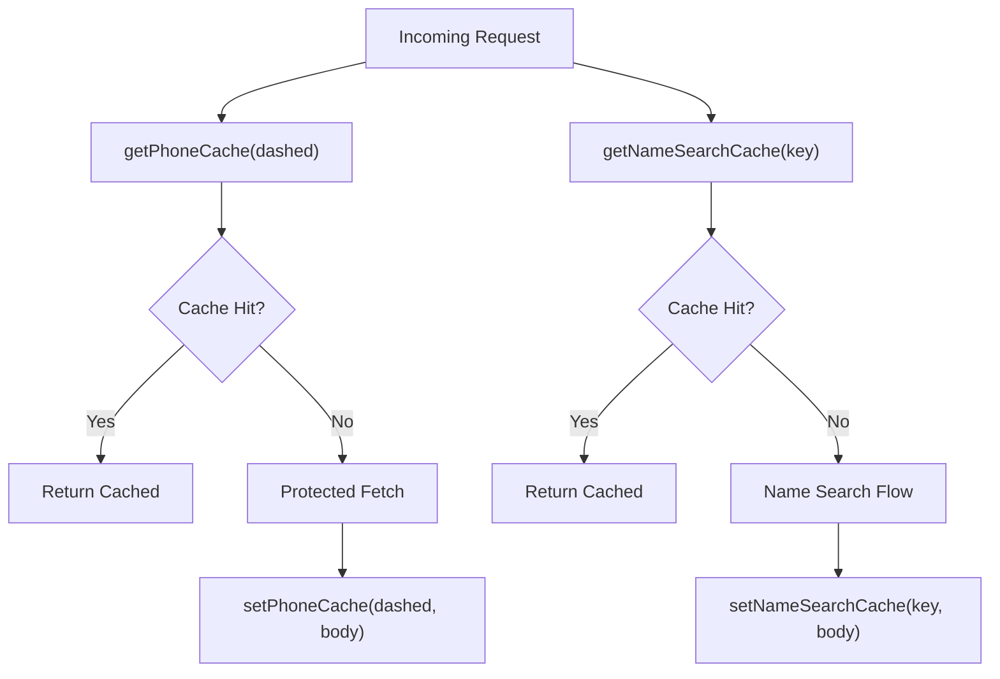

**Diagram sources**
- [phoneCache.mjs:44-99](file://src/phoneCache.mjs#L44-L99)
- [nameSearchCache.mjs:27-78](file://src/nameSearchCache.mjs#L27-L78)
- [enrichmentCache.mjs:99-116](file://src/enrichmentCache.mjs#L99-L116)

**Section sources**
- [phoneCache.mjs:31-99](file://src/phoneCache.mjs#L31-L99)
- [nameSearchCache.mjs:16-78](file://src/nameSearchCache.mjs#L16-L78)
- [enrichmentCache.mjs:18-89](file://src/enrichmentCache.mjs#L18-L89)

### Data Validation and Consistency
- Deduplication keys for persons: prefer name-based keys, fall back to path keys; merge aliases and profile paths.
- Path normalization and slug-based matching for cross-row reconciliation.
- Merge snapshots preserve historical data for audit.
- Vector indexing is best-effort and optional.

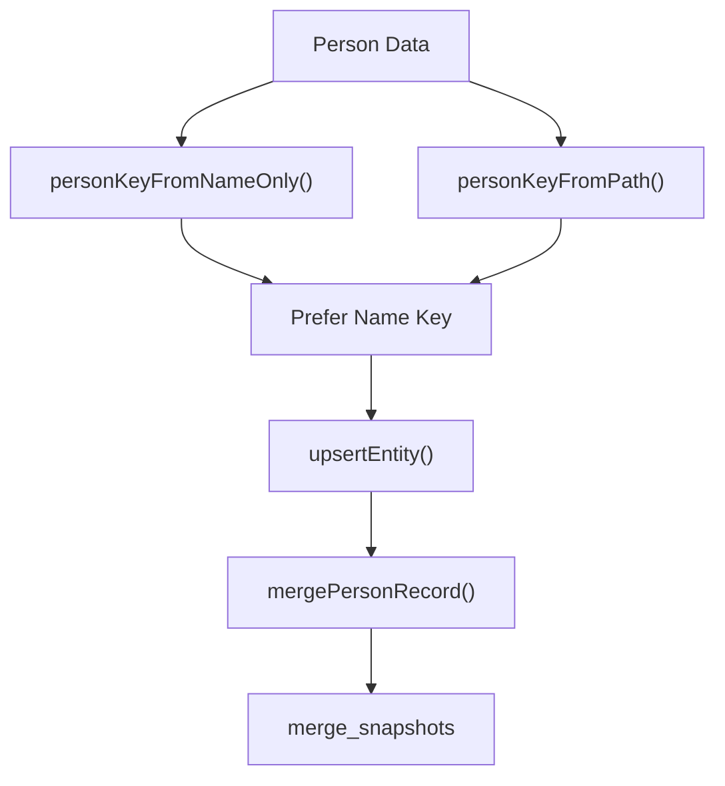

**Diagram sources**
- [personKey.mjs:169-177](file://src/personKey.mjs#L169-L177)
- [personKey.mjs:66-78](file://src/personKey.mjs#L66-L78)
- [entityIngest.mjs:310-352](file://src/entityIngest.mjs#L310-L352)
- [entityIngest.mjs:233-296](file://src/entityIngest.mjs#L233-L296)
- [db.mjs:69-77](file://src/db/db.mjs#L69-L77)

**Section sources**
- [personKey.mjs:169-177](file://src/personKey.mjs#L169-L177)
- [personKey.mjs:66-78](file://src/personKey.mjs#L66-L78)
- [entityIngest.mjs:310-352](file://src/entityIngest.mjs#L310-L352)
- [db.mjs:69-77](file://src/db/db.mjs#L69-L77)

## Dependency Analysis
- Coupling: server orchestrates protected fetch, parsing, normalization, enrichment, and ingestion.
- Cohesion: Each module encapsulates a single responsibility (parsing, normalization, enrichment, persistence).
- External dependencies: SQLite for persistence, libphonenumber-js for phone parsing, ruvector for optional vector storage.
- No circular dependencies observed among core modules.

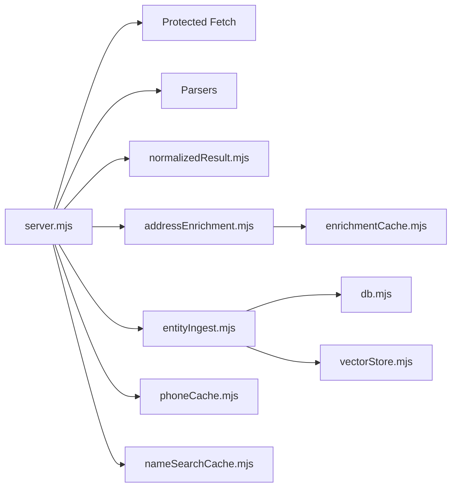

**Diagram sources**
- [server.mjs:1-800](file://src/server.mjs#L1-L800)
- [entityIngest.mjs:1-665](file://src/entityIngest.mjs#L1-L665)
- [db.mjs:1-185](file://src/db/db.mjs#L1-L185)
- [vectorStore.mjs:1-134](file://src/vectorStore.mjs#L1-L134)
- [enrichmentCache.mjs:1-117](file://src/enrichmentCache.mjs#L1-L117)
- [phoneCache.mjs:1-161](file://src/phoneCache.mjs#L1-L161)
- [nameSearchCache.mjs:1-79](file://src/nameSearchCache.mjs#L1-L79)

**Section sources**
- [server.mjs:1-800](file://src/server.mjs#L1-L800)
- [entityIngest.mjs:1-665](file://src/entityIngest.mjs#L1-L665)
- [db.mjs:1-185](file://src/db/db.mjs#L1-L185)

## Performance Considerations
- Caching:
  - Response cache for phone/name searches reduces repeated network calls.
  - Enrichment cache prevents redundant external API calls; in-flight deduplication avoids thundering herds.
- Batching and parallelization:
  - Overpass requests are serialized with a minimum interval to respect rate limits.
  - Promise queues serialize enrichment tasks to avoid overload.
- Deduplication and indexing:
  - Ingestion merges overlapping profile paths and names to minimize graph duplication.
  - Vector indexing is optional and best-effort to avoid blocking on unavailable engines.
- Database tuning:
  - SQLite WAL mode and foreign keys enabled for durability and referential integrity.
  - Indexes on entities and edges optimize query performance.

[No sources needed since this section provides general guidance]

## Troubleshooting Guide
- Protected fetch failures:
  - Engine fallback logic detects timeouts, Cloudflare challenges, and captcha challenges; escalates to Playwright when configured.
  - Session invalidation and replacement for FlareSolverr when session errors occur.
- Source session readiness:
  - Interactive browser sessions are opened when required; warnings and login detection prevent blocked states.
- Enrichment errors:
  - Overpass and Census calls are wrapped with timeouts and error reporting; partial failures are handled gracefully.
- Cache anomalies:
  - TTL pruning and LRU eviction ensure cache health; bypass flags allow manual cache control.

**Section sources**
- [server.mjs:526-538](file://src/server.mjs#L526-L538)
- [server.mjs:540-542](file://src/server.mjs#L540-L542)
- [server.mjs:234-263](file://src/server.mjs#L234-L263)
- [server.mjs:270-299](file://src/server.mjs#L270-L299)
- [addressEnrichment.mjs:255-293](file://src/addressEnrichment.mjs#L255-L293)
- [phoneCache.mjs:31-99](file://src/phoneCache.mjs#L31-L99)
- [enrichmentCache.mjs:18-89](file://src/enrichmentCache.mjs#L18-L89)

## Conclusion
The system implements a robust, layered data flow from protected fetching to graph construction and persistence. It emphasizes normalization, enrichment, caching, and deduplication to ensure correctness and performance. The modular design enables extensibility across sources and retrieval patterns while maintaining strong consistency guarantees through SQLite and careful merge semantics.