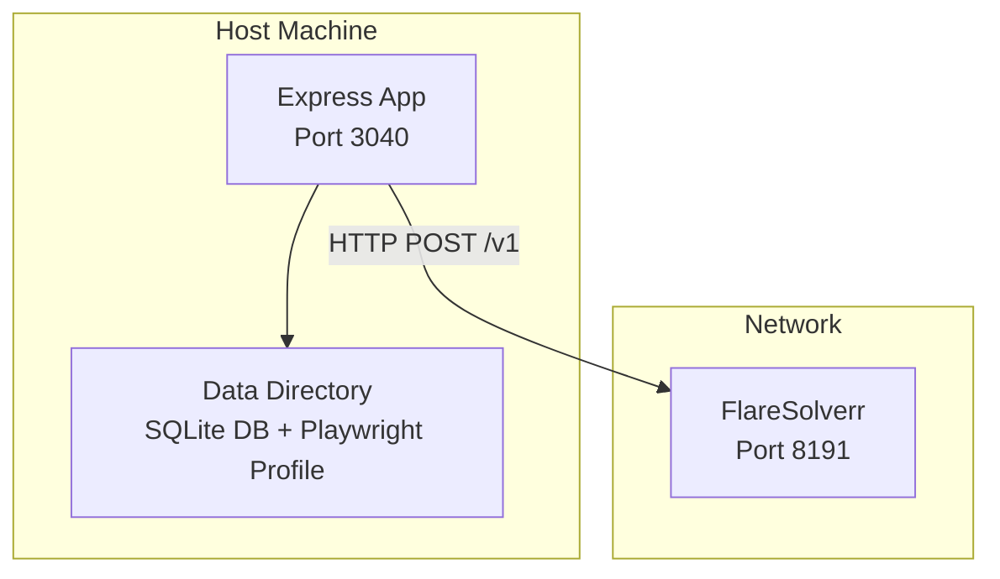
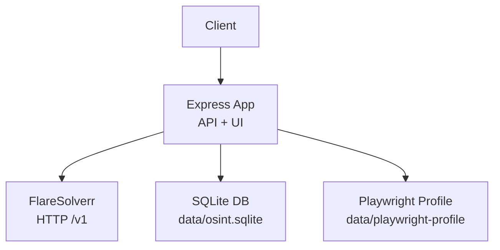
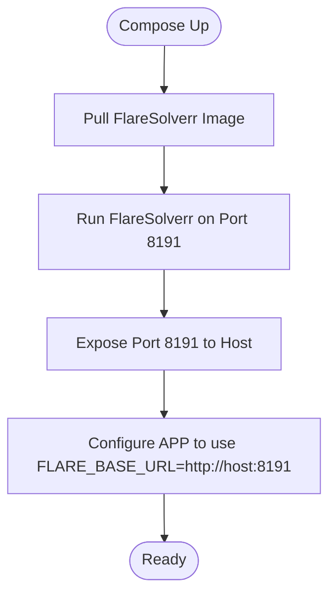
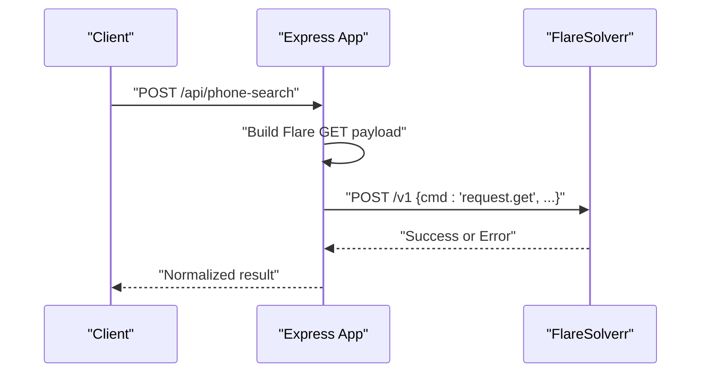
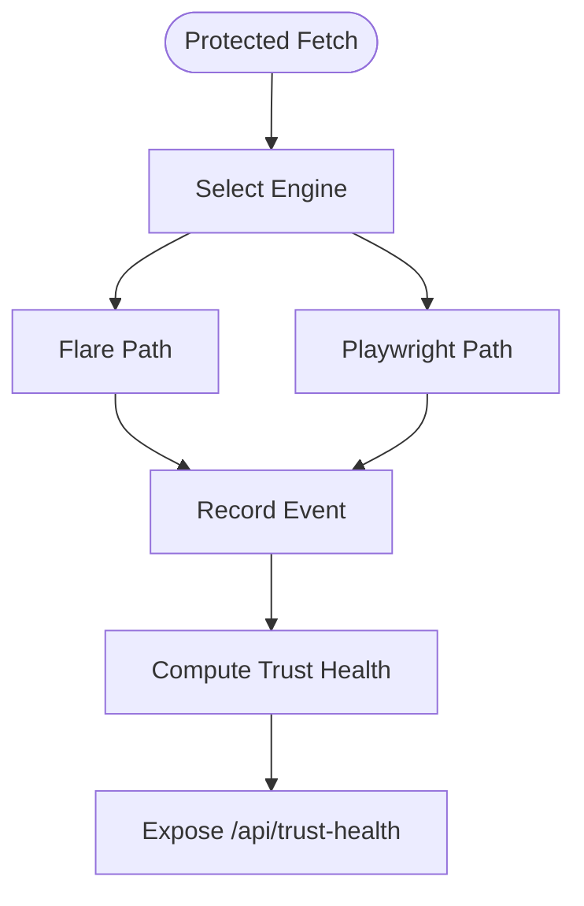
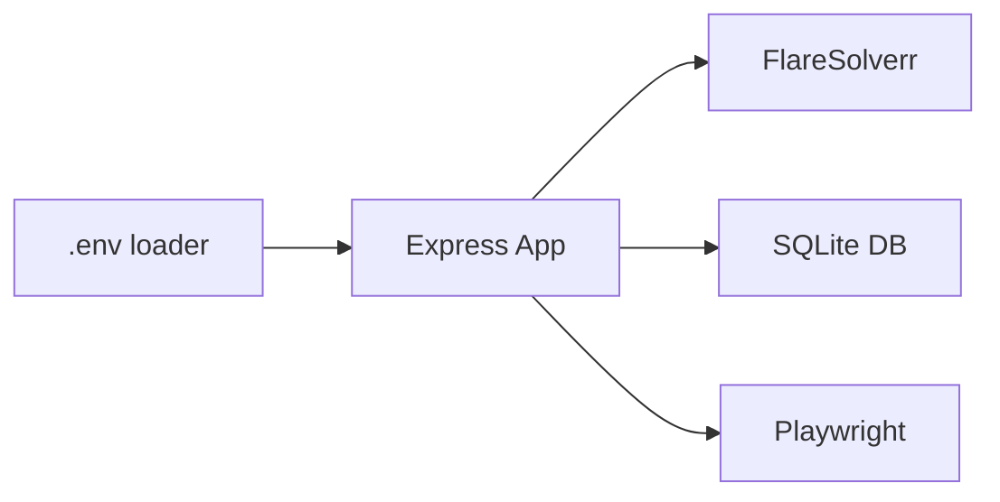

# Deployment Topology

<cite>
**Referenced Files in This Document**
- [docker-compose.yml](file://docker-compose.yml)
- [env.example](file://env.example)
- [README.md](file://README.md)
- [package.json](file://package.json)
- [src/env.mjs](file://src/env.mjs)
- [src/server.mjs](file://src/server.mjs)
- [src/flareClient.mjs](file://src/flareClient.mjs)
- [src/flareSession.mjs](file://src/flareSession.mjs)
- [src/db/db.mjs](file://src/db/db.mjs)
- [src/graphMaintenance.mjs](file://src/graphMaintenance.mjs)
- [src/protectedFetchMetrics.mjs](file://src/protectedFetchMetrics.mjs)
- [src/phoneCache.mjs](file://src/phoneCache.mjs)
- [src/enrichmentCache.mjs](file://src/enrichmentCache.mjs)
- [src/nameSearchCache.mjs](file://src/nameSearchCache.mjs)
- [HANDOFF.md](file://HANDOFF.md)
</cite>

## Table of Contents
1. [Introduction](#introduction)
2. [Project Structure](#project-structure)
3. [Core Components](#core-components)
4. [Architecture Overview](#architecture-overview)
5. [Detailed Component Analysis](#detailed-component-analysis)
6. [Dependency Analysis](#dependency-analysis)
7. [Performance Considerations](#performance-considerations)
8. [Troubleshooting Guide](#troubleshooting-guide)
9. [Conclusion](#conclusion)
10. [Appendices](#appendices)

## Introduction
This document describes the deployment topology and infrastructure requirements for the usphonebook-flare-app. It explains how the Express application integrates with FlareSolverr, how to orchestrate the stack with Docker Compose, and how to configure environment variables, caching, and database storage. It also covers monitoring, logging, health checks, and scaling considerations, along with production deployment scenarios and troubleshooting guidance.

## Project Structure
The deployment spans a single Express application and an external FlareSolverr service. The app loads environment variables from a .env file and persists state in a SQLite database located under a data directory. Optional Playwright local browser support is available for protected fetch fallbacks.

**Diagram sources**
- [src/server.mjs:98-104](file://src/server.mjs#L98-L104)
- [src/flareClient.mjs:9-18](file://src/flareClient.mjs#L9-L18)
- [src/db/db.mjs:15-18](file://src/db/db.mjs#L15-L18)

**Section sources**
- [README.md:5-22](file://README.md#L5-L22)
- [docker-compose.yml:1-7](file://docker-compose.yml#L1-L7)
- [src/env.mjs:1-8](file://src/env.mjs#L1-L8)
- [src/db/db.mjs:15-18](file://src/db/db.mjs#L15-L18)

## Core Components
- Express application: serves the API and UI, orchestrates protected fetches via FlareSolverr or local Playwright, and manages caches and database state.
- FlareSolverr: external service handling Cloudflare challenges; accessed via HTTP POST to /v1.
- SQLite database: stores graph entities, edges, caches, and auxiliary state.
- Optional Playwright local worker: used as a fallback engine for protected fetches.

Key configuration points:
- Environment variables define Flare base URL, protected fetch engine selection, timeouts, proxies, and cache policies.
- The app resolves .env from a configurable path and initializes database and caches on startup.

**Section sources**
- [src/server.mjs:98-116](file://src/server.mjs#L98-L116)
- [src/flareClient.mjs:9-18](file://src/flareClient.mjs#L9-L18)
- [src/db/db.mjs:125-137](file://src/db/db.mjs#L125-L137)
- [src/env.mjs:1-8](file://src/env.mjs#L1-L8)

## Architecture Overview
The system consists of:
- A single Express app listening on APP_PORT (default 3040).
- An external FlareSolverr service reachable at FLARE_BASE_URL (default http://127.0.0.1:8191).
- A SQLite database under a data directory.
- Optional local Playwright browser profile for protected fetch fallbacks.

**Diagram sources**
- [src/server.mjs:98-104](file://src/server.mjs#L98-L104)
- [src/flareClient.mjs:9-18](file://src/flareClient.mjs#L9-L18)
- [src/db/db.mjs:15-18](file://src/db/db.mjs#L15-L18)
- [src/env.mjs:1-8](file://src/env.mjs#L1-L8)

## Detailed Component Analysis

### Container Orchestration with Docker Compose
- FlareSolverr is provided as a Docker service with port 8191 published.
- The Express app runs outside Docker in the current setup; however, the repository demonstrates a containerized FlareSolverr service suitable for orchestration.

**Diagram sources**
- [docker-compose.yml:1-7](file://docker-compose.yml#L1-L7)

**Section sources**
- [docker-compose.yml:1-7](file://docker-compose.yml#L1-L7)
- [README.md:7-18](file://README.md#L7-L18)

### Service Dependencies and Network Configuration
- The Express app depends on FlareSolverr availability at FLARE_BASE_URL.
- Ports:
  - FlareSolverr: 8191/tcp (published)
  - Express app: APP_PORT (default 3040/tcp)
- Network:
  - Ensure FlareSolverr accepts inbound connections from the host running the Express app.
  - When running in Docker networks, use the host’s LAN IP and published port, not container internal IPs.

**Section sources**
- [src/server.mjs:102-104](file://src/server.mjs#L102-L104)
- [README.md:13-18](file://README.md#L13-L18)

### FlareSolverr Integration Requirements
- Base URL: FLARE_BASE_URL must point to the FlareSolverr HTTP base (no trailing slash). The app posts to /v1.
- Session reuse: Optional session reuse can be enabled via FLARE_REUSE_SESSION and session_ttl_minutes; this creates a single session and rotates it periodically.
- Proxying: Optional default outbound proxy for Flare requests via FLARE_PROXY_URL.
- Timeouts: Control max timeout per request with FLARE_MAX_TIMEOUT_MS.
- Media disabling: Disable media loading to reduce overhead with FLARE_DISABLE_MEDIA.

**Diagram sources**
- [src/server.mjs:640-672](file://src/server.mjs#L640-L672)
- [src/flareClient.mjs:9-18](file://src/flareClient.mjs#L9-L18)

**Section sources**
- [src/flareClient.mjs:9-18](file://src/flareClient.mjs#L9-L18)
- [src/flareSession.mjs:25-48](file://src/flareSession.mjs#L25-L48)
- [src/server.mjs:593-633](file://src/server.mjs#L593-L633)

### Environment Variables and Secrets Management
- Primary variables:
  - FLARE_BASE_URL: FlareSolverr base URL.
  - APP_PORT: Application port.
  - PROTECTED_FETCH_ENGINE: Engine choice (flare, playwright-local, auto).
  - PROTECTED_FETCH_FALLBACK_ON_FLARE_ERROR and PROTECTED_FETCH_FALLBACK_ENGINE: Fallback policy.
  - FLARE_MAX_TIMEOUT_MS, FLARE_PROXY_URL, FLARE_WAIT_AFTER_SECONDS, FLARE_DISABLE_MEDIA.
  - Phone/name/enrichment caches: PHONE_CACHE_TTL_MS, PHONE_CACHE_MAX, NAME_SEARCH_CACHE_TTL_MS, NAME_SEARCH_CACHE_MAX, ENRICHMENT_CACHE_MAX.
  - Session reuse: FLARE_REUSE_SESSION, FLARE_SESSION_TTL_MINUTES.
  - DOTENV_PATH: Alternate .env location.
- Secrets:
  - Store sensitive values in environment variables or a secrets manager; avoid committing secrets to source control.
  - Use DOTENV_PATH to point to a mounted secrets file if desired.

**Section sources**
- [env.example:1-106](file://env.example#L1-L106)
- [README.md:32-64](file://README.md#L32-L64)
- [src/env.mjs:1-8](file://src/env.mjs#L1-L8)

### Resource Allocation
- CPU and memory:
  - FlareSolverr benefits from adequate CPU and RAM; monitor container logs for resource pressure.
  - Session reuse reduces per-request overhead but increases memory footprint; enable only when host capacity allows.
- Disk:
  - SQLite database and Playwright profile consume disk space; ensure sufficient free space and retention policies.
- Network:
  - Low-latency connection to FlareSolverr improves performance.
  - Consider outbound proxy configuration for IP stability and reduced blocking.

**Section sources**
- [README.md:132-136](file://README.md#L132-L136)
- [src/flareSession.mjs:8-14](file://src/flareSession.mjs#L8-L14)

### Scaling Considerations
- Horizontal scaling:
  - The app is stateless except for local Playwright profile and SQLite file. Scale the Express app behind a load balancer.
  - Ensure a shared SQLite backend or migrate to a relational database if running multiple replicas.
- Vertical scaling:
  - Increase FLARE_MAX_TIMEOUT_MS and tune cache sizes for higher throughput.
- Session reuse:
  - Enable FLARE_REUSE_SESSION cautiously; monitor for process explosion or degraded performance on constrained hosts.

**Section sources**
- [README.md:132-136](file://README.md#L132-L136)
- [src/flareSession.mjs:8-14](file://src/flareSession.mjs#L8-L14)

### Deployment Options
- Standalone server:
  - Run the Express app locally with Node; keep FlareSolverr external.
- Containerized deployment:
  - Use the provided Docker Compose service for FlareSolverr; deploy the Express app as a separate container or host process.
- Cloud platforms:
  - Deploy the Express app to a container platform (e.g., ECS, EKS, GKE) and run FlareSolverr as a managed workload or sidecar.
  - Ensure network policies allow traffic from the app host to FlareSolverr port 8191.

**Section sources**
- [README.md:5-22](file://README.md#L5-L22)
- [docker-compose.yml:1-7](file://docker-compose.yml#L1-L7)

### Infrastructure Requirements
- Database storage:
  - SQLite file path is resolved from SQLITE_PATH or defaults to data/osint.sqlite. Ensure write permissions and sufficient disk space.
- Cache management:
  - Phone result cache and enrichment cache are persisted in SQLite; tune TTL and max entries via environment variables.
- External service connectivity:
  - Access to FlareSolverr at FLARE_BASE_URL.
  - Optional external sources (Census, Overpass, TruePeopleSearch, That’s Them) require outbound internet access and may benefit from proxies.

**Section sources**
- [src/db/db.mjs:15-18](file://src/db/db.mjs#L15-L18)
- [src/phoneCache.mjs:4-11](file://src/phoneCache.mjs#L4-L11)
- [src/enrichmentCache.mjs:6](file://src/enrichmentCache.mjs#L6)
- [README.md:181-218](file://README.md#L181-L218)

### Monitoring, Logging, and Health Checks
- Logs:
  - Live scrape logs can be enabled/disabled via SCRAPE_LOGGING and SCRAPE_PROGRESS_INTERVAL_MS.
  - Protected fetch events are recorded and summarized for trust health.
- Health endpoints:
  - /api/health: Verifies FlareSolverr accessibility and reports configuration.
  - /api/trust-health: Rolling diagnostics of protected-fetch success rates, challenge rates, and median duration.
- Metrics:
  - Protected fetch metrics track recent events and derive trust state.

**Diagram sources**
- [src/server.mjs:791-799](file://src/server.mjs#L791-L799)
- [src/protectedFetchMetrics.mjs:35-70](file://src/protectedFetchMetrics.mjs#L35-L70)

**Section sources**
- [README.md:119-131](file://README.md#L119-L131)
- [src/protectedFetchMetrics.mjs:1-70](file://src/protectedFetchMetrics.mjs#L1-L70)
- [src/server.mjs:674-789](file://src/server.mjs#L674-L789)

## Dependency Analysis
The Express app depends on:
- FlareSolverr for protected fetches.
- SQLite for persistent caches and graph state.
- Playwright for local fallback engine.
- Environment configuration loaded via dotenv.

**Diagram sources**
- [src/env.mjs:1-8](file://src/env.mjs#L1-L8)
- [src/server.mjs:98-104](file://src/server.mjs#L98-L104)
- [src/db/db.mjs:125-137](file://src/db/db.mjs#L125-L137)

**Section sources**
- [src/env.mjs:1-8](file://src/env.mjs#L1-L8)
- [src/server.mjs:98-104](file://src/server.mjs#L98-L104)
- [src/db/db.mjs:125-137](file://src/db/db.mjs#L125-L137)

## Performance Considerations
- Reduce timeouts and media overhead:
  - Increase FLARE_MAX_TIMEOUT_MS for challenging targets.
  - Set FLARE_DISABLE_MEDIA=1 to skip heavy assets.
- Use proxies judiciously:
  - Configure FLARE_PROXY_URL for stable exit IPs when blocked.
- Cache tuning:
  - Adjust PHONE_CACHE_TTL_MS, PHONE_CACHE_MAX, NAME_SEARCH_CACHE_TTL_MS, NAME_SEARCH_CACHE_MAX, ENRICHMENT_CACHE_MAX to balance freshness and performance.
- Session reuse:
  - Enable FLARE_REUSE_SESSION for speed; monitor for resource exhaustion.

**Section sources**
- [README.md:105-117](file://README.md#L105-L117)
- [README.md:132-136](file://README.md#L132-L136)
- [src/phoneCache.mjs:4-11](file://src/phoneCache.mjs#L4-L11)
- [src/enrichmentCache.mjs:6](file://src/enrichmentCache.mjs#L6)

## Troubleshooting Guide
Common issues and resolutions:
- FlareSolverr unreachable:
  - Verify FLARE_BASE_URL points to a reachable host and port.
  - Use npm run probe:flare to validate connectivity.
- Frequent timeouts or challenge pages:
  - Increase FLARE_MAX_TIMEOUT_MS.
  - Disable media loading (FLARE_DISABLE_MEDIA=1).
  - Configure a reliable outbound proxy (FLARE_PROXY_URL).
- Session instability:
  - Rotate sessions with FLARE_SESSION_TTL_MINUTES or disable reuse (FLARE_REUSE_SESSION=0).
- Health and trust diagnostics:
  - Monitor /api/health and /api/trust-health for trends.
- Local Playwright fallback:
  - Install Chromium and set PROTECTED_FETCH_ENGINE=playwright-local or auto for resilient protected fetches.

**Section sources**
- [README.md:24-31](file://README.md#L24-L31)
- [README.md:105-117](file://README.md#L105-L117)
- [README.md:138-151](file://README.md#L138-L151)
- [src/protectedFetchMetrics.mjs:35-70](file://src/protectedFetchMetrics.mjs#L35-L70)

## Conclusion
The usphonebook-flare-app is designed to run alongside an external FlareSolverr service, with a simple deployment topology and straightforward orchestration. By tuning environment variables, leveraging caches, and monitoring protected-fetch health, operators can achieve reliable and scalable deployments across standalone servers, containers, and cloud platforms.

## Appendices

### Production Deployment Scenarios
- Scenario A: Single-node deployment
  - Run the Express app on the host; run FlareSolverr in Docker Compose with port 8191 published.
  - Configure FLARE_BASE_URL to the host’s LAN IP and published port.
- Scenario B: Containerized stack
  - Deploy both the Express app and FlareSolverr as containers on the same Docker network.
  - Use service discovery to set FLARE_BASE_URL to the FlareSolverr service name and port.
- Scenario C: Cloud-native
  - Deploy the Express app to a container platform; run FlareSolverr as a managed workload.
  - Secure inter-service communication with network policies and private endpoints.

**Section sources**
- [docker-compose.yml:1-7](file://docker-compose.yml#L1-L7)
- [README.md:7-18](file://README.md#L7-L18)

### Environment Variables Reference
- FLARE_BASE_URL: FlareSolverr base URL (no trailing slash).
- APP_PORT: Application port (default 3040).
- PROTECTED_FETCH_ENGINE: Engine selection (flare, playwright-local, auto).
- PROTECTED_FETCH_FALLBACK_ON_FLARE_ERROR: Enable fallback on Flare errors.
- PROTECTED_FETCH_FALLBACK_ENGINE: Fallback engine choice.
- PROTECTED_FETCH_COOLDOWN_MS: Cooldown between protected fetches.
- SCRAPE_LOGGING: Enable live scrape logs.
- SCRAPE_PROGRESS_INTERVAL_MS: Heartbeat interval for long-running steps.
- FLARE_MAX_TIMEOUT_MS: Default max timeout for Flare requests.
- FLARE_PROXY_URL: Default outbound proxy for Flare.
- FLARE_WAIT_AFTER_SECONDS: Wait after challenge solve.
- FLARE_DISABLE_MEDIA: Disable media loading in Flare.
- PHONE_CACHE_TTL_MS, PHONE_CACHE_MAX, PHONE_CACHE_BYPASS: Phone result cache policy.
- NAME_SEARCH_CACHE_TTL_MS, NAME_SEARCH_CACHE_MAX: Name search cache policy.
- ENRICHMENT_CACHE_MAX: Persistent enrichment cache size.
- FLARE_REUSE_SESSION, FLARE_SESSION_TTL_MINUTES: Session reuse and rotation.
- DOTENV_PATH: Alternate .env path.

**Section sources**
- [env.example:1-106](file://env.example#L1-L106)
- [README.md:32-64](file://README.md#L32-L64)