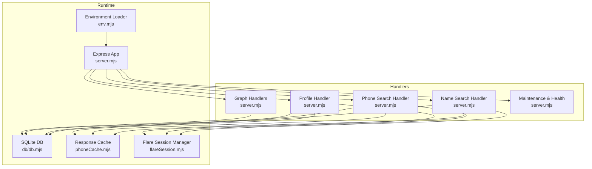
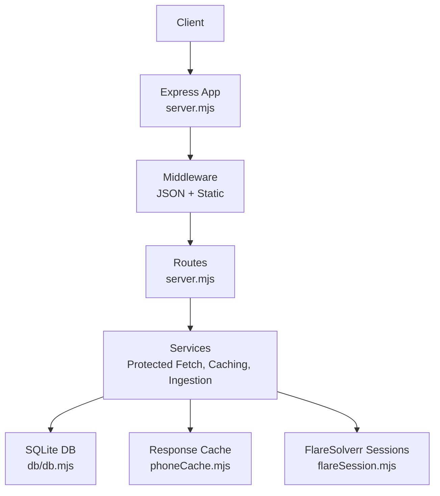
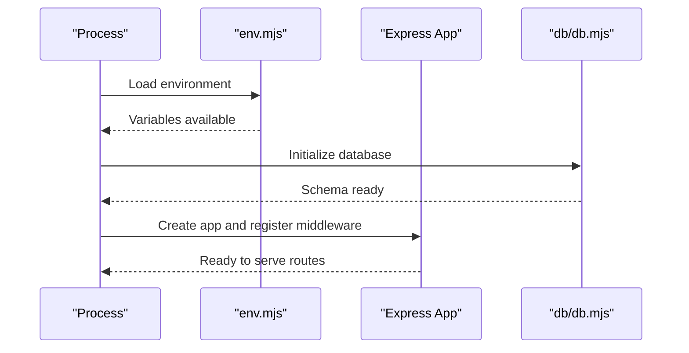
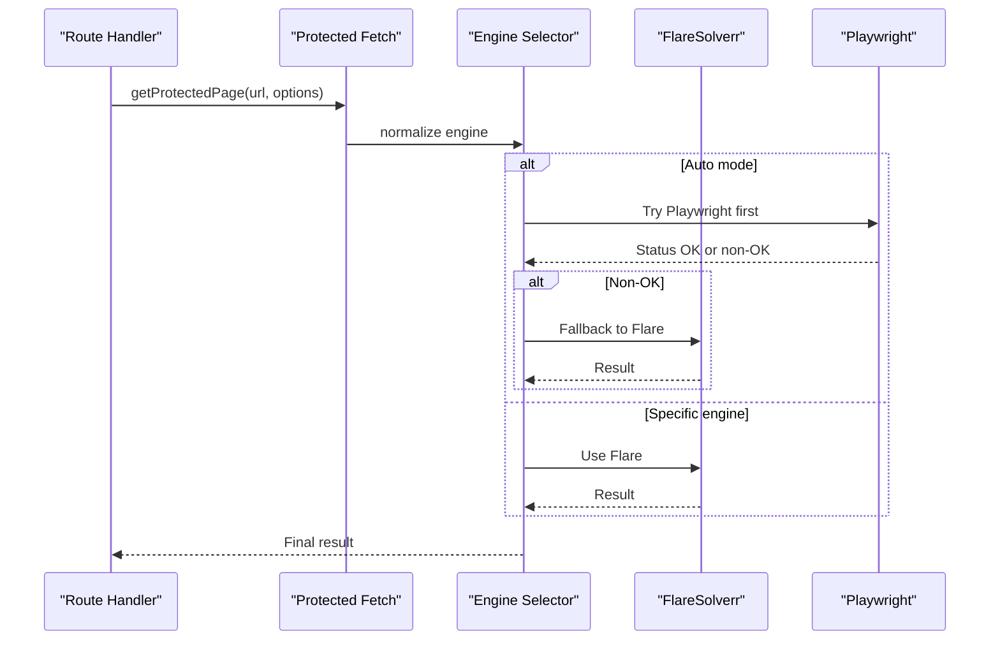
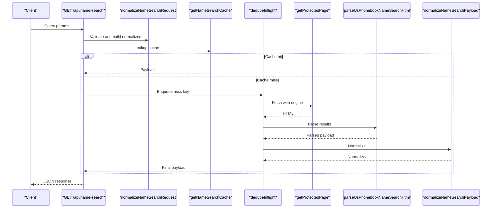
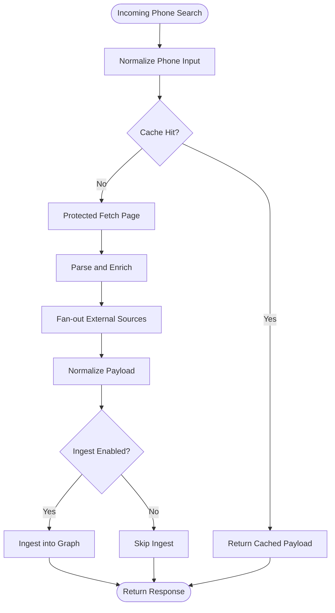
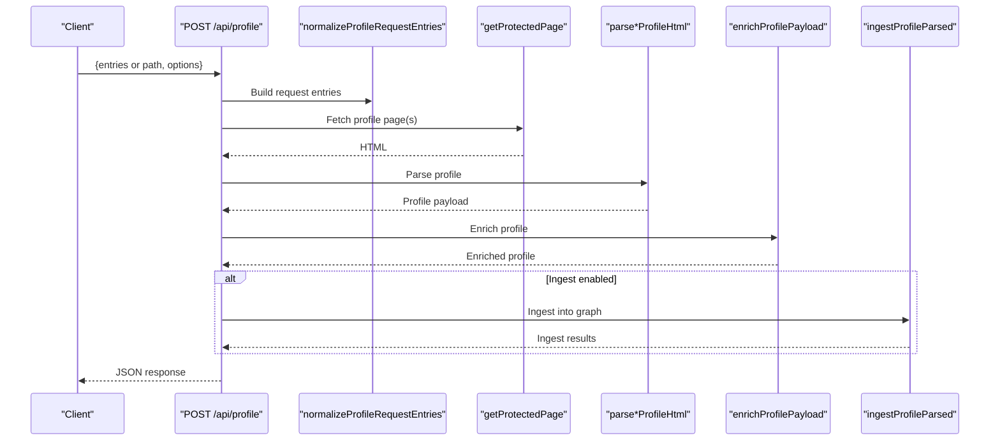
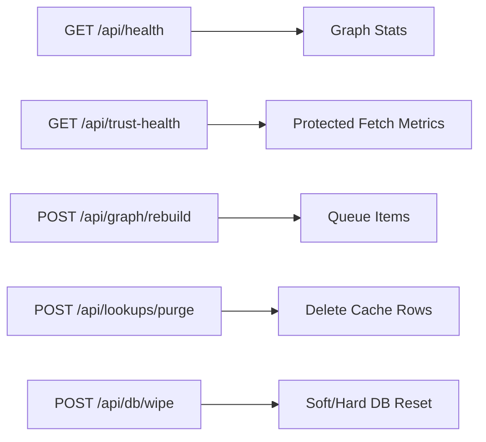
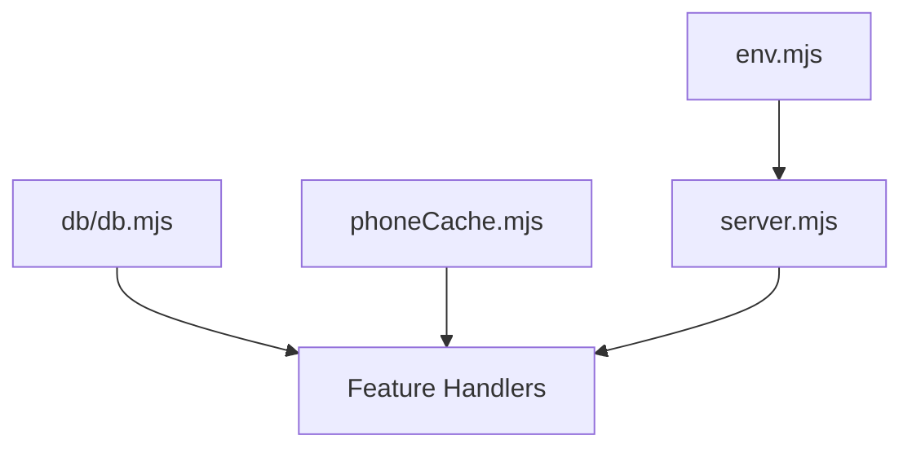
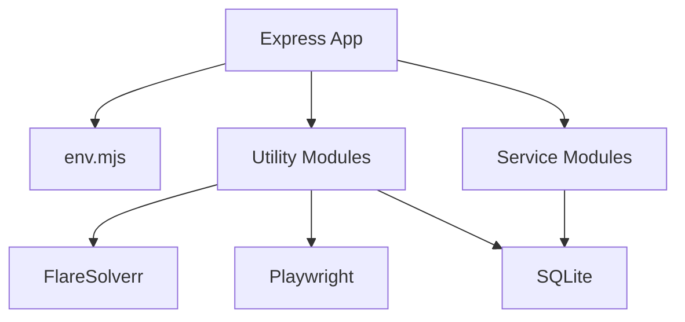

# Server Architecture

<cite>
**Referenced Files in This Document**
- [server.mjs](file://src/server.mjs)
- [env.mjs](file://src/env.mjs)
- [package.json](file://package.json)
- [docker-compose.yml](file://docker-compose.yml)
- [env.example](file://env.example)
- [flareSession.mjs](file://src/flareSession.mjs)
- [phoneCache.mjs](file://src/phoneCache.mjs)
- [db/db.mjs](file://src/db/db.mjs)
- [normalizedResult.mjs](file://src/normalizedResult.mjs)
- [entityIngest.mjs](file://src/entityIngest.mjs)
</cite>

## Table of Contents
1. [Introduction](#introduction)
2. [Project Structure](#project-structure)
3. [Core Components](#core-components)
4. [Architecture Overview](#architecture-overview)
5. [Detailed Component Analysis](#detailed-component-analysis)
6. [Dependency Analysis](#dependency-analysis)
7. [Performance Considerations](#performance-considerations)
8. [Troubleshooting Guide](#troubleshooting-guide)
9. [Conclusion](#conclusion)
10. [Appendices](#appendices)

## Introduction
This document explains the Express.js server architecture that powers the application. It covers the modular design with centralized middleware, organized routing, environment configuration management, and a dependency injection-like pattern achieved through module imports. The request lifecycle is traced from incoming API calls through middleware layers to specialized handlers. Configuration options for ports, timeouts, and feature toggles are documented, along with separation of concerns among API endpoints, utility functions, and service orchestration. Examples of startup sequences, error handling patterns, and graceful shutdown procedures are included, alongside scalability and deployment considerations.

## Project Structure
The server is implemented as a single-file Express application with a modular design. Key characteristics:
- Centralized Express app creation and middleware registration
- Feature-specific handler modules imported and used within the server
- Environment configuration loaded via dotenv
- Database and caching subsystems integrated via dedicated modules
- Routing organized by feature areas (search, profiles, graph, maintenance, trust health)

**Diagram sources**
- [server.mjs](file://src/server.mjs)
- [env.mjs](file://src/env.mjs)
- [db/db.mjs](file://src/db/db.mjs)
- [phoneCache.mjs](file://src/phoneCache.mjs)
- [flareSession.mjs](file://src/flareSession.mjs)

**Section sources**
- [server.mjs](file://src/server.mjs)
- [env.mjs](file://src/env.mjs)
- [package.json](file://package.json)

## Core Components
- Express app and middleware stack
  - JSON body parsing with size limits
  - Static asset serving
- Environment configuration loader
  - Loads .env from a configurable path
- Centralized configuration constants
  - Port, Flare base URL, protected fetch engines, timeouts, caches, and feature flags
- Request lifecycle orchestration
  - Protected fetch engine selection and fallback
  - Deduplication and caching for search requests
  - Normalization and ingestion of parsed results into the graph
- Routing and endpoints
  - Name search, phone search, profile retrieval, graph queries, maintenance, and health checks

**Section sources**
- [server.mjs](file://src/server.mjs)
- [env.mjs](file://src/env.mjs)
- [env.example](file://env.example)

## Architecture Overview
The server follows a layered architecture:
- Presentation layer: Express routes and middleware
- Orchestration layer: Protected fetch coordination, caching, and normalization
- Persistence layer: SQLite-backed entities, edges, caches, and auxiliary tables
- External integrations: FlareSolverr session management and browser-based fetches

**Diagram sources**
- [server.mjs](file://src/server.mjs)
- [db/db.mjs](file://src/db/db.mjs)
- [phoneCache.mjs](file://src/phoneCache.mjs)
- [flareSession.mjs](file://src/flareSession.mjs)

## Detailed Component Analysis

### Express Initialization and Middleware
- The Express app is created and configured with:
  - JSON body parsing with a size limit
  - Static asset serving for the public directory
- Environment variables are loaded early to configure runtime behavior
- The server initializes the database and runs graph maintenance on startup

**Diagram sources**
- [server.mjs](file://src/server.mjs)
- [env.mjs](file://src/env.mjs)
- [db/db.mjs](file://src/db/db.mjs)

**Section sources**
- [server.mjs](file://src/server.mjs)
- [env.mjs](file://src/env.mjs)
- [db/db.mjs](file://src/db/db.mjs)

### Protected Fetch Engine Selection and Fallback
- The protected fetch pipeline selects an engine (Flare, Playwright, or automatic) based on configuration and request options
- Fallback logic handles timeouts, challenge detection, and engine switching
- Session reuse and proxy configuration are applied conditionally

**Diagram sources**
- [server.mjs](file://src/server.mjs)

**Section sources**
- [server.mjs](file://src/server.mjs)

### Request Lifecycle: Name Search
- Normalizes query parameters and validates inputs
- Checks name search cache; if miss, deduplicates concurrent requests
- Performs protected fetch against the source, parses and normalizes results
- Optionally fans out to external people-finder sources
- Stores cache and returns normalized payload

**Diagram sources**
- [server.mjs](file://src/server.mjs)

**Section sources**
- [server.mjs](file://src/server.mjs)

### Request Lifecycle: Phone Search
- Normalizes phone input and enforces format
- Uses cache or performs protected fetch for the phone search page
- Parses and enriches the result, merges external sources, and normalizes
- Optionally ingests into the graph and returns normalized payload

**Diagram sources**
- [server.mjs](file://src/server.mjs)

**Section sources**
- [server.mjs](file://src/server.mjs)

### Request Lifecycle: Profile Retrieval
- Validates and normalizes profile path(s)
- Ensures required source sessions are ready when applicable
- Fetches and parses profile pages from supported sources
- Enriches with telecom data and external sources
- Merges companion profiles and optionally ingests into the graph

**Diagram sources**
- [server.mjs](file://src/server.mjs)

**Section sources**
- [server.mjs](file://src/server.mjs)

### Graph and Maintenance Endpoints
- Provides graph neighborhood queries, stats, and rebuild operations
- Exposes health and trust-health endpoints for monitoring
- Offers administrative endpoints for cache purging and DB wiping

**Diagram sources**
- [server.mjs](file://src/server.mjs)

**Section sources**
- [server.mjs](file://src/server.mjs)

### Dependency Injection Pattern
- The server uses ES module imports to inject dependencies into handlers and services
- Configuration is injected via environment variables loaded by env.mjs
- Database and caching are injected through shared modules (db/db.mjs, phoneCache.mjs)

**Diagram sources**
- [server.mjs](file://src/server.mjs)
- [env.mjs](file://src/env.mjs)
- [db/db.mjs](file://src/db/db.mjs)
- [phoneCache.mjs](file://src/phoneCache.mjs)

**Section sources**
- [server.mjs](file://src/server.mjs)
- [env.mjs](file://src/env.mjs)
- [db/db.mjs](file://src/db/db.mjs)
- [phoneCache.mjs](file://src/phoneCache.mjs)

## Dependency Analysis
- Express app depends on:
  - Environment loader for configuration
  - Utility modules for protected fetching, caching, and normalization
  - Service modules for graph operations and ingestion
- External dependencies:
  - FlareSolverr for protected fetches
  - Playwright for browser-based fetching
  - SQLite for persistence

**Diagram sources**
- [server.mjs](file://src/server.mjs)
- [env.mjs](file://src/env.mjs)
- [db/db.mjs](file://src/db/db.mjs)

**Section sources**
- [server.mjs](file://src/server.mjs)
- [package.json](file://package.json)

## Performance Considerations
- Protected fetch throttling and heartbeat logging help monitor long-running operations
- Response caching reduces repeated external requests for phone and name searches
- Deduplication prevents redundant work during concurrent requests
- Graph ingestion is optional and can be toggled to balance performance and data freshness
- SQLite WAL mode and indexing improve write throughput and query performance

[No sources needed since this section provides general guidance]

## Troubleshooting Guide
- Challenge-required responses
  - When protected fetch returns a challenge, the server responds with a conflict status and includes challenge details
- Session readiness issues
  - Some sources require interactive session checks; ensure sessions are opened and checked before retrying
- Health and trust monitoring
  - Use health endpoints to verify Flare connectivity, cache status, and protected fetch metrics
- Graceful shutdown
  - The session manager supports destroying Flare sessions on exit to prevent resource leaks

**Section sources**
- [server.mjs](file://src/server.mjs)
- [flareSession.mjs](file://src/flareSession.mjs)

## Conclusion
The server architecture demonstrates a clean separation of concerns with centralized configuration, modular handlers, and robust protected-fetch orchestration. The design emphasizes reliability through caching, deduplication, and fallback strategies, while maintaining flexibility via environment-driven feature toggles. The graph ingestion and persistence layers enable scalable enrichment and querying of entity relationships.

[No sources needed since this section summarizes without analyzing specific files]

## Appendices

### Configuration Options
- Port and base URLs
  - APP_PORT: Server port
  - FLARE_BASE_URL: FlareSolverr base URL
- Protected fetch engines and fallback
  - PROTECTED_FETCH_ENGINE: Engine selection (flare, playwright-local, auto)
  - PROTECTED_FETCH_FALLBACK_ON_FLARE_ERROR: Enable fallback on Flare failures
  - PROTECTED_FETCH_FALLBACK_ENGINE: Fallback engine choice
  - PROTECTED_FETCH_COOLDOWN_MS: Cooldown between requests
- Flare behavior
  - FLARE_MAX_TIMEOUT_MS: Default request timeout
  - FLARE_PROXY_URL: Default outbound proxy for Flare
  - FLARE_WAIT_AFTER_SECONDS: Wait after challenge resolution
  - FLARE_DISABLE_MEDIA: Disable media by default
  - FLARE_REUSE_SESSION: Enable session reuse
  - FLARE_SESSION_TTL_MINUTES: Session TTL
- Caching and timeouts
  - PHONE_CACHE_TTL_MS: Phone search cache TTL
  - PHONE_CACHE_MAX: Max cache entries
  - PHONE_CACHE_BYPASS: Query param names to bypass cache
  - ENRICHMENT_CACHE_MAX: External enrichment cache capacity
  - ENRICHMENT_HTTP_TIMEOUT_MS: External enrichment timeout
  - EXTERNAL_SOURCE_TIMEOUT_MS: External source timeout
  - EXTERNAL_SOURCE_CACHE_TTL_MS: External source cache TTL
- External sources
  - ENABLE_EXTERNAL_PEOPLE_SOURCES: Toggle external people-finder sources
  - EXTERNAL_SOURCE_USER_AGENT: User agent header
  - EXTERNAL_SOURCE_ACCEPT_LANGUAGE: Accept-Language header
- Vector and DB
  - SQLITE_PATH: SQLite database path
- Logging and diagnostics
  - SCRAPE_LOGGING: Enable scrape logs
  - SCRAPE_PROGRESS_INTERVAL_MS: Progress heartbeat interval

**Section sources**
- [env.example](file://env.example)
- [server.mjs](file://src/server.mjs)
- [phoneCache.mjs](file://src/phoneCache.mjs)
- [db/db.mjs](file://src/db/db.mjs)

### Startup and Shutdown Procedures
- Startup
  - Load environment variables
  - Initialize database and run graph maintenance
  - Create Express app and register middleware
  - Start listening on configured port
- Shutdown
  - Destroy Flare sessions to release resources
  - Close database connections gracefully

**Section sources**
- [server.mjs](file://src/server.mjs)
- [flareSession.mjs](file://src/flareSession.mjs)
- [db/db.mjs](file://src/db/db.mjs)

### Deployment and Scalability
- Containerization
  - FlareSolverr is provided as a service in docker-compose
- Horizontal scaling
  - Stateless API design allows multiple replicas behind a load balancer
  - Shared database and caching backends required for consistency
- Observability
  - Health and trust-health endpoints support monitoring
  - Logging and heartbeat mechanisms aid in diagnosing long-running operations

**Section sources**
- [docker-compose.yml](file://docker-compose.yml)
- [server.mjs](file://src/server.mjs)