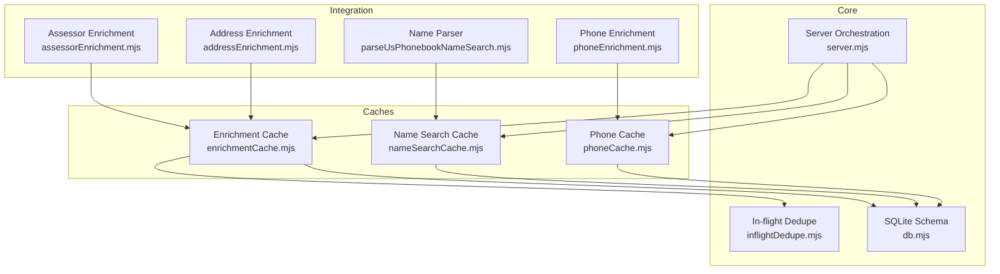
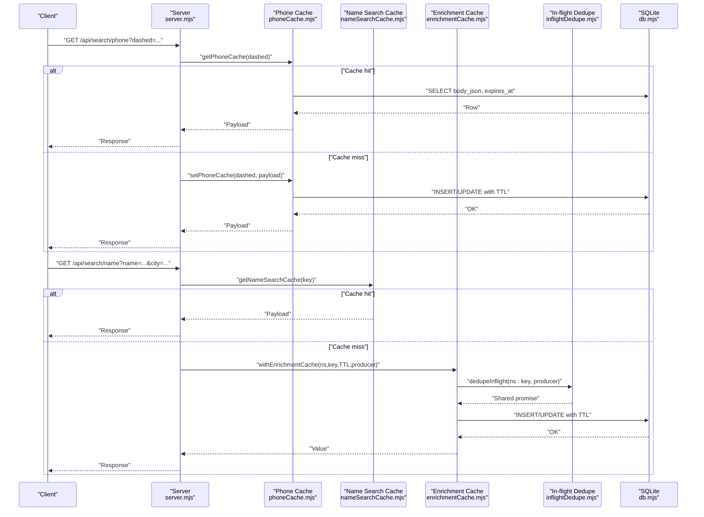
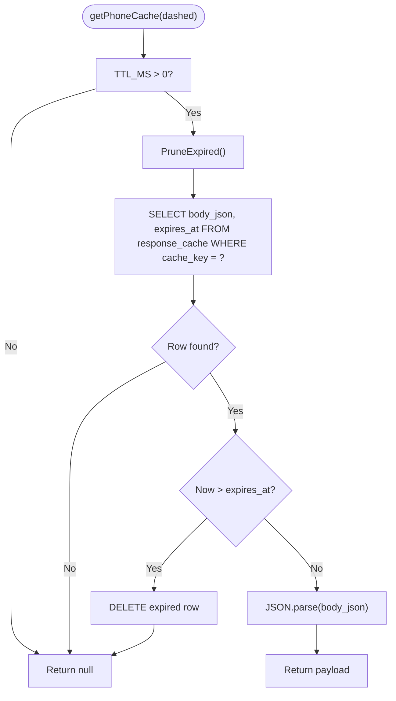
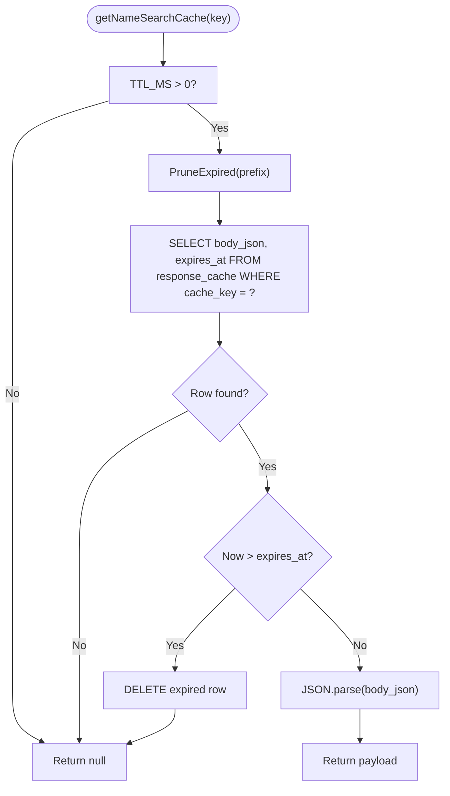
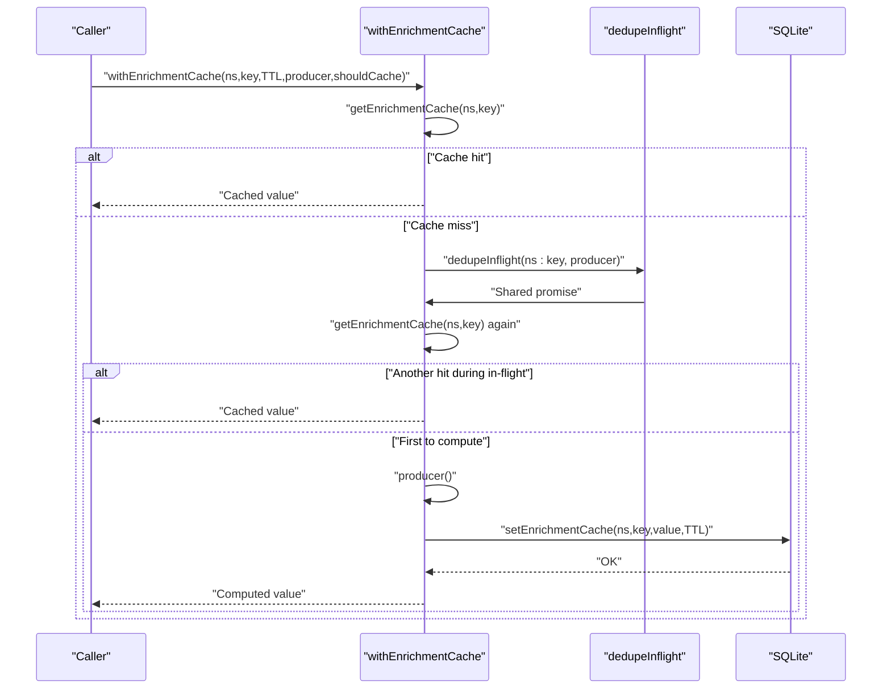
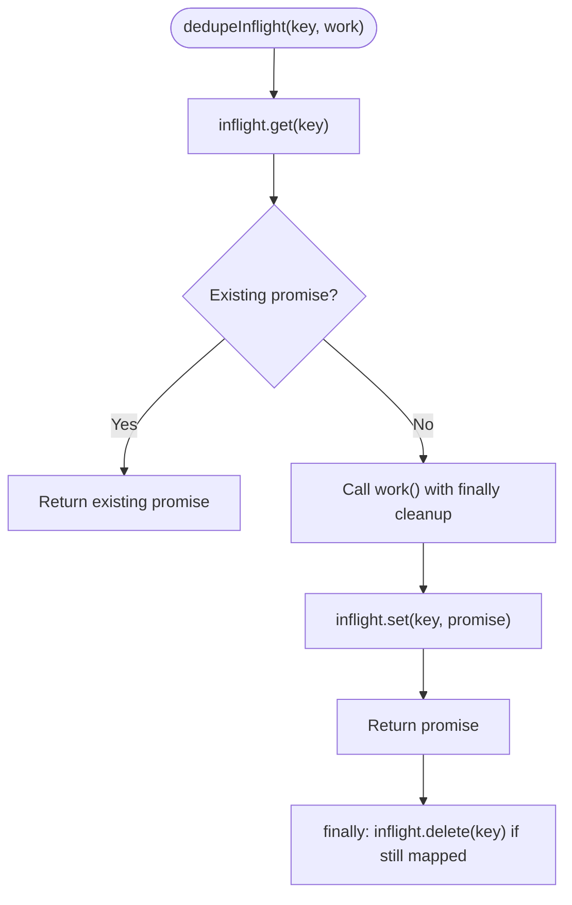
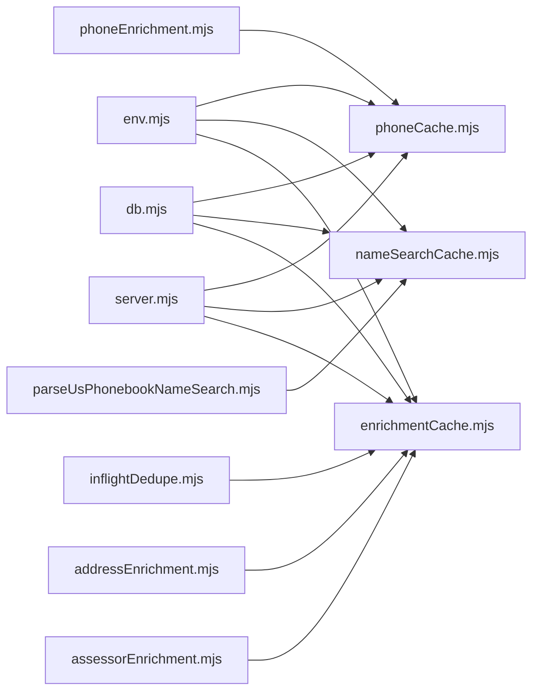

# Cache Management

<cite>
**Referenced Files in This Document**
- [enrichmentCache.mjs](file://src/enrichmentCache.mjs)
- [phoneCache.mjs](file://src/phoneCache.mjs)
- [nameSearchCache.mjs](file://src/nameSearchCache.mjs)
- [inflightDedupe.mjs](file://src/inflightDedupe.mjs)
- [db.mjs](file://src/db/db.mjs)
- [server.mjs](file://src/server.mjs)
- [env.mjs](file://src/env.mjs)
- [addressEnrichment.mjs](file://src/addressEnrichment.mjs)
- [assessorEnrichment.mjs](file://src/assessorEnrichment.mjs)
- [parseUsPhonebookNameSearch.mjs](file://src/parseUsPhonebookNameSearch.mjs)
- [phoneEnrichment.mjs](file://src/phoneEnrichment.mjs)
</cite>

## Table of Contents
1. [Introduction](#introduction)
2. [Project Structure](#project-structure)
3. [Core Components](#core-components)
4. [Architecture Overview](#architecture-overview)
5. [Detailed Component Analysis](#detailed-component-analysis)
6. [Dependency Analysis](#dependency-analysis)
7. [Performance Considerations](#performance-considerations)
8. [Troubleshooting Guide](#troubleshooting-guide)
9. [Conclusion](#conclusion)
10. [Appendices](#appendices)

## Introduction
This document explains the cache management system designed to optimize performance and reduce redundant work across the application. It covers:
- Phone number caching for normalized phone queries
- Name search caching for name/location queries
- Enrichment result caching for external source results
- In-flight request deduplication to avoid concurrent duplicate work
- Cache configuration via environment variables, TTL management, eviction policies, and memory optimization strategies
- Practical examples for configuration, tuning, and troubleshooting
- Cache invalidation strategies and monitoring approaches

The goal is to help both beginners understand the benefits of caching and advanced users dive deep into the implementation details, algorithms, and consistency models used in the system.

## Project Structure
The cache system is implemented across several modules:
- Phone number cache: stores normalized phone search responses
- Name search cache: stores name/location search responses
- Enrichment cache: stores enriched results from external sources
- In-flight dedupe: prevents duplicate concurrent requests for the same key
- Database schema: defines response_cache and enrichment_cache tables
- Server integration: orchestrates cache usage for phone/name/profile flows
- Environment configuration: exposes cache-related environment variables

**Diagram sources**
- [phoneCache.mjs:1-161](file://src/phoneCache.mjs#L1-L161)
- [nameSearchCache.mjs:1-79](file://src/nameSearchCache.mjs#L1-L79)
- [enrichmentCache.mjs:1-117](file://src/enrichmentCache.mjs#L1-L117)
- [inflightDedupe.mjs:1-24](file://src/inflightDedupe.mjs#L1-L24)
- [db.mjs:53-67](file://src/db/db.mjs#L53-L67)
- [server.mjs:17-47](file://src/server.mjs#L17-L47)
- [addressEnrichment.mjs:1-257](file://src/addressEnrichment.mjs#L1-L257)
- [assessorEnrichment.mjs:1-788](file://src/assessorEnrichment.mjs#L1-L788)
- [parseUsPhonebookNameSearch.mjs:1-109](file://src/parseUsPhonebookNameSearch.mjs#L1-L109)
- [phoneEnrichment.mjs:1-126](file://src/phoneEnrichment.mjs#L1-L126)

**Section sources**
- [phoneCache.mjs:1-161](file://src/phoneCache.mjs#L1-L161)
- [nameSearchCache.mjs:1-79](file://src/nameSearchCache.mjs#L1-L79)
- [enrichmentCache.mjs:1-117](file://src/enrichmentCache.mjs#L1-L117)
- [inflightDedupe.mjs:1-24](file://src/inflightDedupe.mjs#L1-L24)
- [db.mjs:53-67](file://src/db/db.mjs#L53-L67)
- [server.mjs:17-47](file://src/server.mjs#L17-L47)

## Core Components
- Phone Cache: Stores normalized phone search responses with TTL and max-entries eviction. Supports bypass flags and statistics.
- Name Search Cache: Stores name/location search responses with TTL and max-entries eviction. Uses a namespaced key prefix.
- Enrichment Cache: Stores arbitrary enrichment results keyed by namespace and raw key, with TTL and max-entries enforcement. Integrates in-flight dedupe to prevent duplicate work.
- In-flight Dedupe: Prevents multiple concurrent executions for the same logical key by sharing a single promise until completion.
- Database Schema: Defines response_cache and enrichment_cache tables with expiration indexes and primary keys.

Key capabilities:
- TTL-based expiration with periodic pruning
- Max-entries LRU-like eviction by creation time
- Namespaced enrichment cache with automatic conflict updates
- Optional cache bypass for targeted queries
- Monitoring endpoints and statistics

**Section sources**
- [phoneCache.mjs:4-112](file://src/phoneCache.mjs#L4-L112)
- [nameSearchCache.mjs:4-78](file://src/nameSearchCache.mjs#L4-L78)
- [enrichmentCache.mjs:6-89](file://src/enrichmentCache.mjs#L6-L89)
- [inflightDedupe.mjs:11-23](file://src/inflightDedupe.mjs#L11-L23)
- [db.mjs:53-67](file://src/db/db.mjs#L53-L67)

## Architecture Overview
The cache system integrates with the server and enrichment layers to minimize repeated network calls and parsing work. The server checks caches before performing expensive operations, while enrichment cache wraps external source calls with TTL and in-flight dedupe.

**Diagram sources**
- [server.mjs:2113-2184](file://src/server.mjs#L2113-L2184)
- [phoneCache.mjs:44-99](file://src/phoneCache.mjs#L44-L99)
- [nameSearchCache.mjs:27-47](file://src/nameSearchCache.mjs#L27-L47)
- [enrichmentCache.mjs:99-116](file://src/enrichmentCache.mjs#L99-L116)
- [inflightDedupe.mjs:11-23](file://src/inflightDedupe.mjs#L11-L23)
- [db.mjs:53-67](file://src/db/db.mjs#L53-L67)

## Detailed Component Analysis

### Phone Number Cache
Purpose:
- Cache normalized phone search responses to avoid repeated scrapes and parsing.

Key behaviors:
- TTL-based expiration with pruning before reads
- Max-entries eviction by oldest creation time
- Optional cache bypass via query flags
- Statistics endpoint exposing cache size, TTL, and capacity

Configuration:
- TTL in milliseconds: PHONE_CACHE_TTL_MS
- Maximum entries: PHONE_CACHE_MAX
- Bypass flags: PHONE_CACHE_BYPASS (comma-separated keys)

Implementation highlights:
- Pruning deletes expired rows based on expires_at
- Enforce max entries by deleting oldest rows beyond capacity
- Uses response_cache table with cache_key as the primary key

**Diagram sources**
- [phoneCache.mjs:44-66](file://src/phoneCache.mjs#L44-L66)

**Section sources**
- [phoneCache.mjs:4-112](file://src/phoneCache.mjs#L4-L112)

### Name Search Cache
Purpose:
- Cache name/location search responses with namespaced keys.

Key behaviors:
- TTL-based expiration with pruning using LIKE prefix
- Max-entries eviction by oldest creation time for the namespace
- Uses a fixed prefix to isolate name search cache entries

Configuration:
- TTL in milliseconds: NAME_SEARCH_CACHE_TTL_MS (defaults to phone cache TTL if unspecified)
- Maximum entries: NAME_SEARCH_CACHE_MAX

Implementation highlights:
- cacheKey(key) prefixes entries with "name-search:"
- Prunes expired rows matching the prefix
- Enforces max entries by oldest creation time

**Diagram sources**
- [nameSearchCache.mjs:27-47](file://src/nameSearchCache.mjs#L27-L47)

**Section sources**
- [nameSearchCache.mjs:4-78](file://src/nameSearchCache.mjs#L4-L78)

### Enrichment Result Cache
Purpose:
- Cache arbitrary enrichment results (e.g., external source parses) with namespaces and TTL.

Key behaviors:
- TTL-based expiration with pruning
- Max-entries enforcement by oldest creation time
- In-flight deduplication to prevent concurrent duplicate work
- Optional filtering via shouldCache predicate

Configuration:
- TTL in milliseconds: configurable per call
- Maximum entries: enforced globally across namespaces

Implementation highlights:
- cacheKey(namespace, rawKey) produces a stable hash-based key
- withEnrichmentCache(namespace, rawKey, ttlMs, producer, shouldCache) coordinates cache hit, in-flight dedupe, and storage
- enforceMaxEntries deletes oldest rows beyond capacity

**Diagram sources**
- [enrichmentCache.mjs:99-116](file://src/enrichmentCache.mjs#L99-L116)
- [inflightDedupe.mjs:11-23](file://src/inflightDedupe.mjs#L11-L23)

**Section sources**
- [enrichmentCache.mjs:6-116](file://src/enrichmentCache.mjs#L6-L116)

### In-flight Request Deduplication
Purpose:
- Prevent multiple concurrent computations for the same logical key by sharing a single promise.

Behavior:
- Maintains an in-memory Map keyed by string
- On subsequent calls with the same key, returns the existing promise
- Cleans up the entry when the promise settles

Consistency model:
- Ensures eventual consistency: later callers receive the same result as the first caller who triggered computation
- Safe for long-running or slow producers

**Diagram sources**
- [inflightDedupe.mjs:11-23](file://src/inflightDedupe.mjs#L11-L23)

**Section sources**
- [inflightDedupe.mjs:1-24](file://src/inflightDedupe.mjs#L1-L24)

### Database Schema and Indexes
Tables:
- response_cache: cache_key (PK), body_json, expires_at, created_at
- enrichment_cache: cache_key (PK), body_json, expires_at, created_at

Indexes:
- response_cache(expires_at)
- enrichment_cache(expires_at)

Notes:
- Both caches use the same response_cache table with different key strategies
- Primary key uniqueness ensures atomic insert/update semantics

**Section sources**
- [db.mjs:53-67](file://src/db/db.mjs#L53-L67)

### Server Integration and Usage Examples
- Phone search flow checks phoneCache before scraping and parsing
- Name search flow checks nameSearchCache and uses enrichment cache for external sources
- External source wrappers use withEnrichmentCache with TTL and shouldCache predicates

Example integrations:
- Address enrichment uses withEnrichmentCache for nearby places and geocoding
- Assessor enrichment uses withEnrichmentCache for property records
- Server routes demonstrate cache usage for external sources

**Section sources**
- [server.mjs:2113-2184](file://src/server.mjs#L2113-L2184)
- [addressEnrichment.mjs:257-313](file://src/addressEnrichment.mjs#L257-L313)
- [assessorEnrichment.mjs:788-788](file://src/assessorEnrichment.mjs#L788-L788)

## Dependency Analysis
- phoneCache.mjs depends on db.mjs for SQLite operations and env.mjs for configuration
- nameSearchCache.mjs depends on db.mjs and env.mjs
- enrichmentCache.mjs depends on db.mjs, inflightDedupe.mjs, and env.mjs
- server.mjs orchestrates cache usage across phone, name, and enrichment flows
- addressEnrichment.mjs and assessorEnrichment.mjs depend on enrichmentCache.mjs
- parseUsPhonebookNameSearch.mjs and phoneEnrichment.mjs integrate with caches

**Diagram sources**
- [env.mjs:1-8](file://src/env.mjs#L1-L8)
- [phoneCache.mjs:1-2](file://src/phoneCache.mjs#L1-L2)
- [nameSearchCache.mjs:1-2](file://src/nameSearchCache.mjs#L1-L2)
- [enrichmentCache.mjs:1-4](file://src/enrichmentCache.mjs#L1-L4)
- [db.mjs:1-6](file://src/db/db.mjs#L1-L6)
- [inflightDedupe.mjs:1-1](file://src/inflightDedupe.mjs#L1-L1)
- [server.mjs:17-47](file://src/server.mjs#L17-L47)
- [addressEnrichment.mjs:1-3](file://src/addressEnrichment.mjs#L1-L3)
- [assessorEnrichment.mjs:1-3](file://src/assessorEnrichment.mjs#L1-L3)
- [parseUsPhonebookNameSearch.mjs:1-2](file://src/parseUsPhonebookNameSearch.mjs#L1-L2)
- [phoneEnrichment.mjs:1-1](file://src/phoneEnrichment.mjs#L1-L1)

**Section sources**
- [env.mjs:1-8](file://src/env.mjs#L1-L8)
- [phoneCache.mjs:1-2](file://src/phoneCache.mjs#L1-L2)
- [nameSearchCache.mjs:1-2](file://src/nameSearchCache.mjs#L1-L2)
- [enrichmentCache.mjs:1-4](file://src/enrichmentCache.mjs#L1-L4)
- [db.mjs:1-6](file://src/db/db.mjs#L1-L6)
- [inflightDedupe.mjs:1-1](file://src/inflightDedupe.mjs#L1-L1)
- [server.mjs:17-47](file://src/server.mjs#L17-L47)
- [addressEnrichment.mjs:1-3](file://src/addressEnrichment.mjs#L1-L3)
- [assessorEnrichment.mjs:1-3](file://src/assessorEnrichment.mjs#L1-L3)
- [parseUsPhonebookNameSearch.mjs:1-2](file://src/parseUsPhonebookNameSearch.mjs#L1-L2)
- [phoneEnrichment.mjs:1-1](file://src/phoneEnrichment.mjs#L1-L1)

## Performance Considerations
- TTL management
  - Use appropriate TTL values to balance freshness and performance. Longer TTL reduces network calls but risks stale data; shorter TTL increases accuracy at the cost of latency.
  - Expiration pruning runs before reads to keep query performance predictable.

- Eviction policies
  - Max-entries eviction is LRU-like by creation time. Tune PHONE_CACHE_MAX and NAME_SEARCH_CACHE_MAX to match workload patterns and memory footprint.
  - For enrichment cache, DEFAULT_MAX_ENTRIES caps growth across namespaces.

- In-flight dedupe
  - Reduces redundant work for concurrent identical requests. Keep keys granular to avoid masking legitimate concurrency.

- Database throughput
  - SQLite writes are serialized; batching or reducing contention helps. Consider WAL mode and appropriate connection pooling if scaling horizontally.

- Monitoring and observability
  - Use cacheStats to monitor enabled state, size, TTL, and max entries.
  - Health endpoint surfaces cache stats alongside other subsystems.

[No sources needed since this section provides general guidance]

## Troubleshooting Guide
Common issues and resolutions:
- Cache appears stale
  - Verify TTL settings and ensure pruneExpired is running before reads.
  - Confirm expires_at is being updated on write.

- Cache not growing beyond configured max
  - Check enforceMaxEntries logic and confirm old rows are deleted.
  - For enrichment cache, ensure DEFAULT_MAX_ENTRIES is sufficient for your workload.

- Duplicate work observed
  - Ensure in-flight dedupe keys are unique and stable for the operation.
  - Verify dedupeInflight cleanup occurs after promise settlement.

- Cache bypass not working
  - Confirm query contains one of the bypass flags and evaluates to truthy.
  - Check isBypassQuery logic for supported flag formats.

- Monitoring and inspection
  - Use cacheStats to verify cache health.
  - Use listRecentCacheRows to inspect recent cache entries for debugging.

Operational controls:
- Wiping caches
  - Soft wipe clears response_cache and graph-related tables without deleting the SQLite file.
  - Hard wipe deletes the SQLite file and WAL, reopening with schema re-application.

**Section sources**
- [phoneCache.mjs:101-131](file://src/phoneCache.mjs#L101-L131)
- [enrichmentCache.mjs:20-41](file://src/enrichmentCache.mjs#L20-L41)
- [server.mjs:2399-2423](file://src/server.mjs#L2399-L2423)

## Conclusion
The cache management system combines TTL-based expiration, max-entries eviction, and in-flight deduplication to deliver significant performance improvements while maintaining correctness. By leveraging environment-driven configuration, structured namespaces, and robust database-backed storage, the system scales across phone searches, name searches, and external enrichment workflows. Proper tuning of TTLs and capacities, combined with monitoring and operational controls, ensures reliable performance under varying workloads.

[No sources needed since this section summarizes without analyzing specific files]

## Appendices

### Cache Configuration Options
- Phone number cache
  - PHONE_CACHE_TTL_MS: cache TTL in milliseconds
  - PHONE_CACHE_MAX: maximum number of entries
  - PHONE_CACHE_BYPASS: comma-separated query keys that bypass cache
- Name search cache
  - NAME_SEARCH_CACHE_TTL_MS: cache TTL in milliseconds (falls back to phone cache TTL if unset)
  - NAME_SEARCH_CACHE_MAX: maximum number of entries
- Enrichment cache
  - DEFAULT_MAX_ENTRIES: global cap for enrichment cache entries
  - TTL passed to withEnrichmentCache per call

**Section sources**
- [phoneCache.mjs:4-11](file://src/phoneCache.mjs#L4-L11)
- [nameSearchCache.mjs:4-6](file://src/nameSearchCache.mjs#L4-L6)
- [enrichmentCache.mjs:6-6](file://src/enrichmentCache.mjs#L6-L6)

### Cache Invalidation Strategies
- Time-based invalidation
  - pruneExpired deletes expired rows before reads
- Size-based invalidation
  - enforceMaxEntries removes oldest rows when exceeding capacity
- Explicit deletion
  - deletePhoneCache removes a specific phone cache row
- Wipe operations
  - Soft: clear response_cache and graph tables
  - Hard: delete SQLite file and WAL, reopen with schema

**Section sources**
- [phoneCache.mjs:31-38](file://src/phoneCache.mjs#L31-L38)
- [enrichmentCache.mjs:20-41](file://src/enrichmentCache.mjs#L20-L41)
- [server.mjs:2399-2423](file://src/server.mjs#L2399-L2423)

### Monitoring Approaches
- cacheStats
  - Returns enabled state, size, TTL, max entries, and backend
- Health endpoint
  - Includes cache stats along with graph and vector store status

**Section sources**
- [phoneCache.mjs:101-112](file://src/phoneCache.mjs#L101-L112)
- [server.mjs:2425-2438](file://src/server.mjs#L2425-L2438)