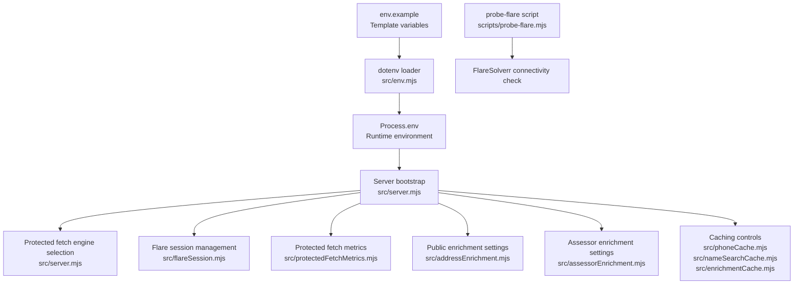
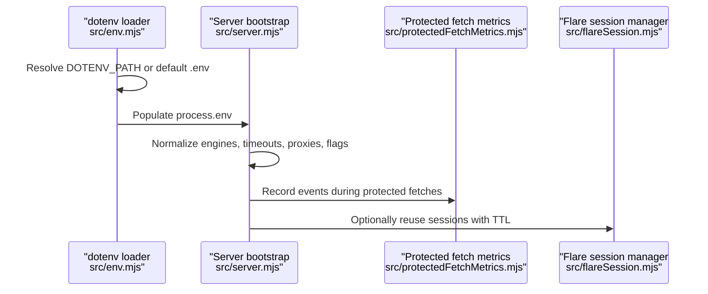
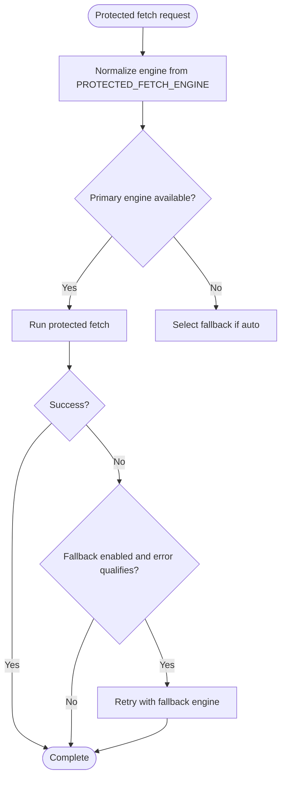
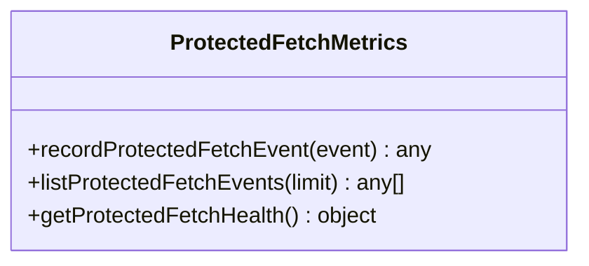
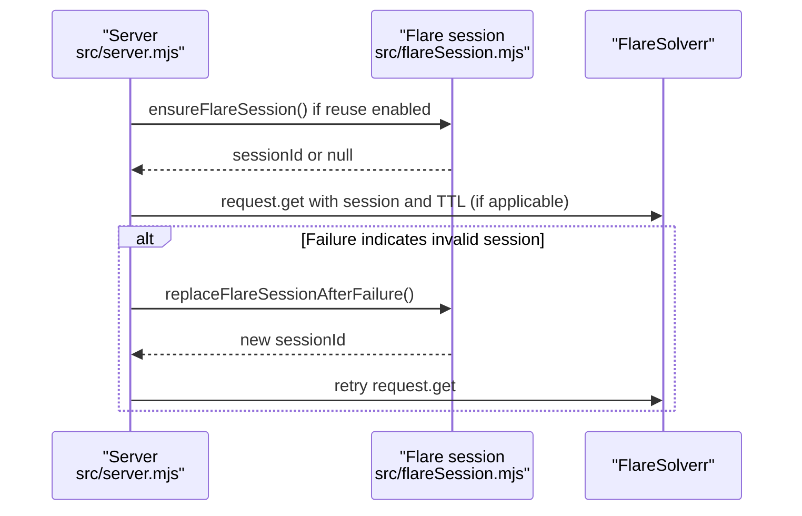
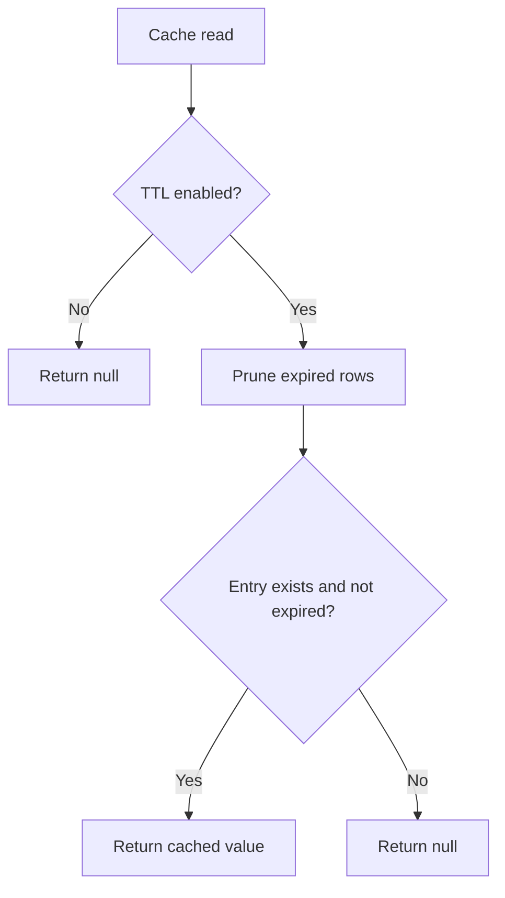
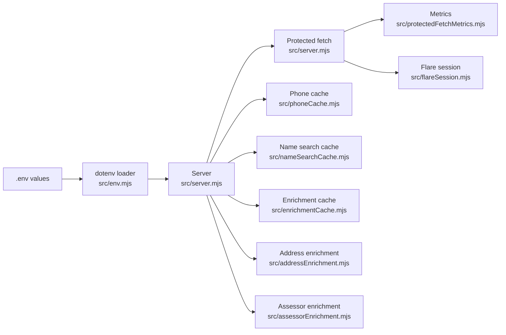

# Configuration and Environment

<cite>
**Referenced Files in This Document**
- [env.example](file://env.example)
- [README.md](file://README.md)
- [docker-compose.yml](file://docker-compose.yml)
- [src/env.mjs](file://src/env.mjs)
- [src/server.mjs](file://src/server.mjs)
- [src/protectedFetchMetrics.mjs](file://src/protectedFetchMetrics.mjs)
- [src/flareSession.mjs](file://src/flareSession.mjs)
- [src/addressEnrichment.mjs](file://src/addressEnrichment.mjs)
- [src/assessorEnrichment.mjs](file://src/assessorEnrichment.mjs)
- [src/enrichmentCache.mjs](file://src/enrichmentCache.mjs)
- [src/phoneCache.mjs](file://src/phoneCache.mjs)
- [src/nameSearchCache.mjs](file://src/nameSearchCache.mjs)
- [scripts/probe-flare.mjs](file://scripts/probe-flare.mjs)
</cite>

## Table of Contents
1. [Introduction](#introduction)
2. [Project Structure](#project-structure)
3. [Core Components](#core-components)
4. [Architecture Overview](#architecture-overview)
5. [Detailed Component Analysis](#detailed-component-analysis)
6. [Dependency Analysis](#dependency-analysis)
7. [Performance Considerations](#performance-considerations)
8. [Troubleshooting Guide](#troubleshooting-guide)
9. [Conclusion](#conclusion)
10. [Appendices](#appendices)

## Introduction
This document explains how configuration and environment management are implemented in the application. It covers environment variable loading, validation and normalization logic, runtime parameter management, and the operational semantics of protected fetch metrics and engine selection. You will learn how to configure FlareSolverr integration, caching behavior, enrichment controls, and performance tuning options. Both conceptual overviews for beginners and technical details for experienced developers are provided, with terminology aligned to the codebase such as "protected fetch metrics" and "engine selection".

## Project Structure
The configuration system centers on:
- A template environment file that defines all supported variables
- A loader that injects environment variables into the process
- Application modules that read and normalize environment variables at startup
- Scripts that probe connectivity to FlareSolverr

**Diagram sources**
- [env.example:1-106](file://env.example#L1-L106)
- [src/env.mjs:1-8](file://src/env.mjs#L1-L8)
- [src/server.mjs:92-126](file://src/server.mjs#L92-L126)
- [src/flareSession.mjs:1-141](file://src/flareSession.mjs#L1-L141)
- [src/protectedFetchMetrics.mjs:1-71](file://src/protectedFetchMetrics.mjs#L1-L71)
- [src/addressEnrichment.mjs:8-18](file://src/addressEnrichment.mjs#L8-L18)
- [src/assessorEnrichment.mjs:7-12](file://src/assessorEnrichment.mjs#L7-L12)
- [src/phoneCache.mjs:4-11](file://src/phoneCache.mjs#L4-L11)
- [src/nameSearchCache.mjs:4-5](file://src/nameSearchCache.mjs#L4-L5)
- [src/enrichmentCache.mjs:6](file://src/enrichmentCache.mjs#L6)
- [scripts/probe-flare.mjs:1-38](file://scripts/probe-flare.mjs#L1-L38)

**Section sources**
- [env.example:1-106](file://env.example#L1-L106)
- [src/env.mjs:1-8](file://src/env.mjs#L1-L8)
- [src/server.mjs:92-126](file://src/server.mjs#L92-L126)
- [scripts/probe-flare.mjs:1-38](file://scripts/probe-flare.mjs#L1-L38)

## Core Components
- Environment variable loading
  - The dotenv loader resolves the .env path from DOTENV_PATH or defaults to the app root .env. It is imported early in the server and probe script to populate process.env before other modules read configuration.
  - Reference: [src/env.mjs:1-8](file://src/env.mjs#L1-L8), [scripts/probe-flare.mjs:1-7](file://scripts/probe-flare.mjs#L1-L7)

- Protected fetch engine selection and fallback
  - Engine choice is normalized from PROTECTED_FETCH_ENGINE with "auto", "flare", and "playwright-local". When enabled, fallback on Flare errors uses PROTECTED_FETCH_FALLBACK_ENGINE and PROTECTED_FETCH_FALLBACK_ON_FLARE_ERROR.
  - Reference: [src/server.mjs:104-113](file://src/server.mjs#L104-L113), [src/server.mjs:389-398](file://src/server.mjs#L389-L398), [src/server.mjs:515-524](file://src/server.mjs#L515-L524)

- Protected fetch metrics
  - Tracks recent events, computes health indicators (success rate, challenge rate, median duration), and limits history size via PROTECTED_FETCH_METRICS_MAX.
  - Reference: [src/protectedFetchMetrics.mjs:1-71](file://src/protectedFetchMetrics.mjs#L1-L71)

- FlareSolverr integration and session management
  - Defaults and overrides for base URL, timeouts, wait-after, media disabling, and proxy are read from environment variables. Session reuse and TTL are controlled by FLARE_REUSE_SESSION and FLARE_SESSION_TTL_MINUTES.
  - Reference: [src/server.mjs:102-119](file://src/server.mjs#L102-L119), [src/flareSession.mjs:8-19](file://src/flareSession.mjs#L8-L19), [src/flareSession.mjs:57-72](file://src/flareSession.mjs#L57-L72)

- Caching controls
  - Phone search cache: TTL, max entries, and bypass keys are configurable.
  - Name search cache: TTL and max entries mirror phone cache defaults when not set.
  - General enrichment cache: global max entries for persistent cache.
  - Reference: [src/phoneCache.mjs:4-11](file://src/phoneCache.mjs#L4-L11), [src/nameSearchCache.mjs:4-5](file://src/nameSearchCache.mjs#L4-L5), [src/enrichmentCache.mjs:6](file://src/enrichmentCache.mjs#L6)

- Public-source enrichment settings
  - Census geocoder and Overpass parameters, HTTP timeouts, user agent, and contact hints are configurable.
  - Reference: [src/addressEnrichment.mjs:8-18](file://src/addressEnrichment.mjs#L8-L18)

- External people-source toggles and timeouts
  - Enable/disable external sources, timeouts, cache TTL, and user agent/accept-language headers.
  - Reference: [src/server.mjs:127-136](file://src/server.mjs#L127-L136)

- Assessor enrichment configuration
  - TTL, timeouts, logging, and configurable sources via JSON or file. Built-in Maine references are included.
  - Reference: [src/assessorEnrichment.mjs:7-12](file://src/assessorEnrichment.mjs#L7-L12), [src/assessorEnrichment.mjs:120-125](file://src/assessorEnrichment.mjs#L120-L125)

**Section sources**
- [src/env.mjs:1-8](file://src/env.mjs#L1-L8)
- [src/server.mjs:102-136](file://src/server.mjs#L102-L136)
- [src/protectedFetchMetrics.mjs:1-71](file://src/protectedFetchMetrics.mjs#L1-L71)
- [src/flareSession.mjs:8-72](file://src/flareSession.mjs#L8-L72)
- [src/phoneCache.mjs:4-11](file://src/phoneCache.mjs#L4-L11)
- [src/nameSearchCache.mjs:4-5](file://src/nameSearchCache.mjs#L4-L5)
- [src/enrichmentCache.mjs:6](file://src/enrichmentCache.mjs#L6)
- [src/addressEnrichment.mjs:8-18](file://src/addressEnrichment.mjs#L8-L18)
- [src/assessorEnrichment.mjs:7-12](file://src/assessorEnrichment.mjs#L7-L12)
- [src/assessorEnrichment.mjs:120-125](file://src/assessorEnrichment.mjs#L120-L125)

## Architecture Overview
The configuration lifecycle:
- Load environment variables from .env or an alternate path
- Normalize and validate configuration at server boot
- Apply configuration across subsystems (protected fetch, caching, enrichment)
- Expose runtime diagnostics and health metrics

**Diagram sources**
- [src/env.mjs:1-8](file://src/env.mjs#L1-L8)
- [src/server.mjs:102-136](file://src/server.mjs#L102-L136)
- [src/protectedFetchMetrics.mjs:9-19](file://src/protectedFetchMetrics.mjs#L9-L19)
- [src/flareSession.mjs:25-48](file://src/flareSession.mjs#L25-L48)

## Detailed Component Analysis

### Environment Variable Loading and Precedence
- Loading mechanism
  - dotenv is configured with DOTENV_PATH if set; otherwise defaults to the app root .env. This ensures predictable loading regardless of working directory.
  - Reference: [src/env.mjs:7](file://src/env.mjs#L7), [scripts/probe-flare.mjs:6](file://scripts/probe-flare.mjs#L6)

- Precedence rules
  - Shell-exported environment variables take precedence over .env values by default (dotenv behavior).
  - Reference: [README.md:64](file://README.md#L64)

- Practical tip
  - Use DOTENV_PATH to point to a mounted secret volume in containers or CI environments.

**Section sources**
- [src/env.mjs:7](file://src/env.mjs#L7)
- [scripts/probe-flare.mjs:6](file://scripts/probe-flare.mjs#L6)
- [README.md:64](file://README.md#L64)

### Protected Fetch Engine Selection and Fallback
- Engine selection
  - PROTECTED_FETCH_ENGINE normalizes to "auto", "flare", or "playwright-local".
  - Reference: [src/server.mjs:104-113](file://src/server.mjs#L104-L113), [src/server.mjs:389-398](file://src/server.mjs#L389-L398)

- Fallback behavior
  - When enabled, Flare failures (timeouts, 5xx, challenge-required) trigger immediate retry with the fallback engine.
  - Reference: [src/server.mjs:515-524](file://src/server.mjs#L515-L524), [src/server.mjs:526-538](file://src/server.mjs#L526-L538)

- Cooldown and logging
  - PROTECTED_FETCH_COOLDOWN_MS reduces burstiness between protected fetches.
  - SCRAPE_LOGGING and SCRAPE_PROGRESS_INTERVAL_MS control verbosity and heartbeat cadence.
  - Reference: [src/server.mjs:105](file://src/server.mjs#L105), [src/server.mjs:120-126](file://src/server.mjs#L120-L126), [src/server.mjs:465-478](file://src/server.mjs#L465-L478)

**Diagram sources**
- [src/server.mjs:104-113](file://src/server.mjs#L104-L113)
- [src/server.mjs:515-538](file://src/server.mjs#L515-L538)
- [src/server.mjs:791-800](file://src/server.mjs#L791-L800)

**Section sources**
- [src/server.mjs:104-113](file://src/server.mjs#L104-L113)
- [src/server.mjs:389-398](file://src/server.mjs#L389-L398)
- [src/server.mjs:515-538](file://src/server.mjs#L515-L538)
- [src/server.mjs:105](file://src/server.mjs#L105)
- [src/server.mjs:120-126](file://src/server.mjs#L120-L126)
- [src/server.mjs:465-478](file://src/server.mjs#L465-L478)

### Protected Fetch Metrics
- Event recording and retention
  - Events are appended with timestamps and trimmed to PROTECTED_FETCH_METRICS_MAX.
  - Reference: [src/protectedFetchMetrics.mjs:1-19](file://src/protectedFetchMetrics.mjs#L1-L19)

- Health computation
  - Recent window statistics include totals, success rate, challenge rate, and median duration.
  - Reference: [src/protectedFetchMetrics.mjs:35-70](file://src/protectedFetchMetrics.mjs#L35-L70)

- Trust state thresholds
  - Heuristic thresholds classify trust state as healthy, degrading, or poor based on recent rates.
  - Reference: [src/protectedFetchMetrics.mjs:47-56](file://src/protectedFetchMetrics.mjs#L47-L56)

**Diagram sources**
- [src/protectedFetchMetrics.mjs:9-70](file://src/protectedFetchMetrics.mjs#L9-L70)

**Section sources**
- [src/protectedFetchMetrics.mjs:1-71](file://src/protectedFetchMetrics.mjs#L1-L71)

### FlareSolverr Settings and Session Management
- Base URL and defaults
  - FLARE_BASE_URL is normalized to remove trailing slashes; defaults are applied when missing.
  - Reference: [src/server.mjs:102](file://src/server.mjs#L102)

- Request-level defaults
  - FLARE_MAX_TIMEOUT_MS, FLARE_WAIT_AFTER_SECONDS, FLARE_DISABLE_MEDIA, and default outbound proxy are applied unless overridden per request.
  - Reference: [src/server.mjs:114-119](file://src/server.mjs#L114-L119), [src/server.mjs:103](file://src/server.mjs#L103)

- Session reuse and TTL
  - FLARE_REUSE_SESSION enables persistent sessions; FLARE_SESSION_TTL_MINUTES rotates sessions after a period.
  - Reference: [src/flareSession.mjs:8-19](file://src/flareSession.mjs#L8-L19), [src/flareSession.mjs:57-72](file://src/flareSession.mjs#L57-L72)

- Proxy resolution
  - Per-request proxy takes precedence; otherwise the default proxy is used if configured.
  - Reference: [src/server.mjs:349-363](file://src/server.mjs#L349-L363)

**Diagram sources**
- [src/server.mjs:640-672](file://src/server.mjs#L640-L672)
- [src/flareSession.mjs:25-72](file://src/flareSession.mjs#L25-L72)

**Section sources**
- [src/server.mjs:102-119](file://src/server.mjs#L102-L119)
- [src/server.mjs:349-363](file://src/server.mjs#L349-L363)
- [src/flareSession.mjs:8-72](file://src/flareSession.mjs#L8-L72)

### Cache Parameters and Controls
- Phone search cache
  - TTL, max entries, and bypass query keys are configurable.
  - Reference: [src/phoneCache.mjs:4-11](file://src/phoneCache.mjs#L4-L11)

- Name search cache
  - TTL and max entries default to phone cache values when not set.
  - Reference: [src/nameSearchCache.mjs:4-5](file://src/nameSearchCache.mjs#L4-L5)

- General enrichment cache
  - Global max entries for persistent cache rows.
  - Reference: [src/enrichmentCache.mjs:6](file://src/enrichmentCache.mjs#L6)

- Cache eviction and pruning
  - Expired rows are pruned; max entries enforced by deleting oldest when exceeding capacity.
  - Reference: [src/phoneCache.mjs:31-38](file://src/phoneCache.mjs#L31-L38), [src/enrichmentCache.mjs:20-41](file://src/enrichmentCache.mjs#L20-L41)

**Diagram sources**
- [src/phoneCache.mjs:44-66](file://src/phoneCache.mjs#L44-L66)
- [src/enrichmentCache.mjs:48-67](file://src/enrichmentCache.mjs#L48-L67)

**Section sources**
- [src/phoneCache.mjs:4-11](file://src/phoneCache.mjs#L4-L11)
- [src/nameSearchCache.mjs:4-5](file://src/nameSearchCache.mjs#L4-L5)
- [src/enrichmentCache.mjs:6](file://src/enrichmentCache.mjs#L6)
- [src/phoneCache.mjs:31-38](file://src/phoneCache.mjs#L31-L38)
- [src/enrichmentCache.mjs:20-41](file://src/enrichmentCache.mjs#L20-L41)

### Enrichment Controls
- Public-source enrichment
  - Census and Overpass parameters, HTTP timeout, user agent, and contact hints.
  - Reference: [src/addressEnrichment.mjs:8-18](file://src/addressEnrichment.mjs#L8-L18)

- External people-source toggles
  - Enable/disable external sources, timeouts, cache TTL, and headers.
  - Reference: [src/server.mjs:127-136](file://src/server.mjs#L127-L136)

- Assessor enrichment
  - TTL, timeouts, logging, and configurable sources via JSON or file; built-in Maine references.
  - Reference: [src/assessorEnrichment.mjs:7-12](file://src/assessorEnrichment.mjs#L7-L12), [src/assessorEnrichment.mjs:120-125](file://src/assessorEnrichment.mjs#L120-L125)

**Section sources**
- [src/addressEnrichment.mjs:8-18](file://src/addressEnrichment.mjs#L8-L18)
- [src/server.mjs:127-136](file://src/server.mjs#L127-L136)
- [src/assessorEnrichment.mjs:7-12](file://src/assessorEnrichment.mjs#L7-L12)
- [src/assessorEnrichment.mjs:120-125](file://src/assessorEnrichment.mjs#L120-L125)

### Validation and Normalization Logic
- Boolean flags
  - Many "on/off" settings accept various truthy/falsy forms; the server normalizes them consistently.
  - Reference: [src/server.mjs:106-108](file://src/server.mjs#L106-L108), [src/server.mjs:120-122](file://src/server.mjs#L120-L122), [src/assessorEnrichment.mjs:10-11](file://src/assessorEnrichment.mjs#L10-L11)

- Numeric bounds
  - TTLs and timeouts are clamped to minimums to prevent unsafe zero/negative values.
  - Reference: [src/addressEnrichment.mjs:7-13](file://src/addressEnrichment.mjs#L7-L13), [src/assessorEnrichment.mjs:6-8](file://src/assessorEnrichment.mjs#L6-L8), [src/enrichmentCache.mjs:6](file://src/enrichmentCache.mjs#L6)

- String normalization
  - Engine names and log levels are trimmed and lowercased for robust matching.
  - Reference: [src/server.mjs:104-113](file://src/server.mjs#L104-L113), [src/assessorEnrichment.mjs:8-12](file://src/assessorEnrichment.mjs#L8-L12)

**Section sources**
- [src/server.mjs:106-113](file://src/server.mjs#L106-L113)
- [src/addressEnrichment.mjs:7-13](file://src/addressEnrichment.mjs#L7-L13)
- [src/assessorEnrichment.mjs:6-12](file://src/assessorEnrichment.mjs#L6-L12)
- [src/enrichmentCache.mjs:6](file://src/enrichmentCache.mjs#L6)

## Dependency Analysis
Configuration dependencies across modules:

**Diagram sources**
- [src/env.mjs:1-8](file://src/env.mjs#L1-L8)
- [src/server.mjs:92-136](file://src/server.mjs#L92-L136)
- [src/protectedFetchMetrics.mjs:1-71](file://src/protectedFetchMetrics.mjs#L1-L71)
- [src/flareSession.mjs:1-141](file://src/flareSession.mjs#L1-L141)
- [src/phoneCache.mjs:1-161](file://src/phoneCache.mjs#L1-L161)
- [src/nameSearchCache.mjs:1-79](file://src/nameSearchCache.mjs#L1-L79)
- [src/enrichmentCache.mjs:1-117](file://src/enrichmentCache.mjs#L1-L117)
- [src/addressEnrichment.mjs:1-386](file://src/addressEnrichment.mjs#L1-L386)
- [src/assessorEnrichment.mjs:1-800](file://src/assessorEnrichment.mjs#L1-L800)

**Section sources**
- [src/server.mjs:92-136](file://src/server.mjs#L92-L136)
- [src/protectedFetchMetrics.mjs:1-71](file://src/protectedFetchMetrics.mjs#L1-L71)
- [src/flareSession.mjs:1-141](file://src/flareSession.mjs#L1-L141)
- [src/phoneCache.mjs:1-161](file://src/phoneCache.mjs#L1-L161)
- [src/nameSearchCache.mjs:1-79](file://src/nameSearchCache.mjs#L1-L79)
- [src/enrichmentCache.mjs:1-117](file://src/enrichmentCache.mjs#L1-L117)
- [src/addressEnrichment.mjs:1-386](file://src/addressEnrichment.mjs#L1-L386)
- [src/assessorEnrichment.mjs:1-800](file://src/assessorEnrichment.mjs#L1-L800)

## Performance Considerations
- Protected fetch throughput
  - Use PROTECTED_FETCH_COOLDOWN_MS to smooth bursts and reduce challenge rates.
  - Reference: [src/server.mjs:105](file://src/server.mjs#L105)

- Session reuse trade-offs
  - Enabling FLARE_REUSE_SESSION improves latency by avoiding cold starts but increases risk of long-lived browser instability. Combine with FLARE_SESSION_TTL_MINUTES to rotate sessions.
  - Reference: [src/flareSession.mjs:8-19](file://src/flareSession.mjs#L8-L19), [src/flareSession.mjs:57-72](file://src/flareSession.mjs#L57-L72)

- Media and timeouts
  - Set FLARE_DISABLE_MEDIA=1 to reduce bandwidth and CPU usage when parsing HTML.
  - Increase FLARE_MAX_TIMEOUT_MS if sites require more time to solve challenges.
  - Reference: [src/server.mjs:114-119](file://src/server.mjs#L114-L119)

- Caching strategy
  - Tune PHONE_CACHE_TTL_MS and PHONE_CACHE_MAX to balance freshness and performance.
  - Reference: [src/phoneCache.mjs:4-11](file://src/phoneCache.mjs#L4-L11)

[No sources needed since this section provides general guidance]

## Troubleshooting Guide
- FlareSolverr connectivity
  - Use the probe script to verify base URL, HTTP status, and session listing.
  - Reference: [scripts/probe-flare.mjs:8-37](file://scripts/probe-flare.mjs#L8-L37), [README.md:24-30](file://README.md#L24-L30)

- Common Flare errors
  - Challenge timeouts and 5xx failures are treated as recoverable when fallback is enabled; inspect protected fetch metrics for trends.
  - Reference: [src/server.mjs:526-538](file://src/server.mjs#L526-L538), [src/protectedFetchMetrics.mjs:35-70](file://src/protectedFetchMetrics.mjs#L35-L70)

- Session issues
  - Invalid session errors trigger automatic replacement; monitor logs and consider rotating sessions more frequently.
  - Reference: [src/flareSession.mjs:101-116](file://src/flareSession.mjs#L101-L116), [src/flareSession.mjs:125-140](file://src/flareSession.mjs#L125-L140)

- Logging and diagnostics
  - Enable SCRAPE_LOGGING and adjust SCRAPE_PROGRESS_INTERVAL_MS for visibility into protected fetch stages.
  - Reference: [src/server.mjs:120-126](file://src/server.mjs#L120-L126), [README.md:119-130](file://README.md#L119-L130)

**Section sources**
- [scripts/probe-flare.mjs:8-37](file://scripts/probe-flare.mjs#L8-L37)
- [README.md:24-30](file://README.md#L24-L30)
- [src/server.mjs:526-538](file://src/server.mjs#L526-L538)
- [src/protectedFetchMetrics.mjs:35-70](file://src/protectedFetchMetrics.mjs#L35-L70)
- [src/flareSession.mjs:101-140](file://src/flareSession.mjs#L101-L140)
- [src/server.mjs:120-126](file://src/server.mjs#L120-L126)
- [README.md:119-130](file://README.md#L119-L130)

## Conclusion
The application centralizes configuration through a clear environment-loading pattern, robust normalization, and explicit defaults. Protected fetch metrics and engine selection enable resilient operation against dynamic challenge conditions. Caching and enrichment settings offer fine-grained control over performance and accuracy. By tuning these options and leveraging the provided diagnostics, operators can achieve reliable, scalable deployments.

[No sources needed since this section summarizes without analyzing specific files]

## Appendices

### Configuration Options Reference
- FlareSolverr
  - FLARE_BASE_URL, FLARE_MAX_TIMEOUT_MS, FLARE_WAIT_AFTER_SECONDS, FLARE_DISABLE_MEDIA, FLARE_PROXY_URL, FLARE_REUSE_SESSION, FLARE_SESSION_TTL_MINUTES
  - Reference: [src/server.mjs:102-119](file://src/server.mjs#L102-L119), [src/flareSession.mjs:8-19](file://src/flareSession.mjs#L8-L19)

- Protected fetch
  - PROTECTED_FETCH_ENGINE, PROTECTED_FETCH_FALLBACK_ON_FLARE_ERROR, PROTECTED_FETCH_FALLBACK_ENGINE, PROTECTED_FETCH_COOLDOWN_MS, SCRAPE_LOGGING, SCRAPE_PROGRESS_INTERVAL_MS, PROTECTED_FETCH_METRICS_MAX
  - Reference: [src/server.mjs:104-113](file://src/server.mjs#L104-L113), [src/server.mjs:120-126](file://src/server.mjs#L120-L126), [src/protectedFetchMetrics.mjs:1](file://src/protectedFetchMetrics.mjs#L1)

- Caching
  - PHONE_CACHE_TTL_MS, PHONE_CACHE_MAX, PHONE_CACHE_BYPASS, NAME_SEARCH_CACHE_TTL_MS, NAME_SEARCH_CACHE_MAX, ENRICHMENT_CACHE_MAX
  - Reference: [src/phoneCache.mjs:4-11](file://src/phoneCache.mjs#L4-L11), [src/nameSearchCache.mjs:4-5](file://src/nameSearchCache.mjs#L4-L5), [src/enrichmentCache.mjs:6](file://src/enrichmentCache.mjs#L6)

- Public-source enrichment
  - ENRICHMENT_HTTP_TIMEOUT_MS, CENSUS_CACHE_TTL_MS, CENSUS_BENCHMARK, CENSUS_VINTAGE, OVERPASS_CACHE_TTL_MS, OVERPASS_RADIUS_METERS, OVERPASS_MAX_PLACES, OVERPASS_MIN_INTERVAL_MS, OVERPASS_ENDPOINT, ENRICHMENT_USER_AGENT, OSINT_CONTACT_EMAIL
  - Reference: [src/addressEnrichment.mjs:8-18](file://src/addressEnrichment.mjs#L8-L18)

- External people sources
  - ENABLE_EXTERNAL_PEOPLE_SOURCES, EXTERNAL_SOURCE_TIMEOUT_MS, EXTERNAL_SOURCE_CACHE_TTL_MS, EXTERNAL_SOURCE_USER_AGENT, EXTERNAL_SOURCE_ACCEPT_LANGUAGE
  - Reference: [src/server.mjs:127-136](file://src/server.mjs#L127-L136)

- Assessor enrichment
  - ASSESSOR_CACHE_TTL_MS, ASSESSOR_TIMEOUT_MS, ASSESSOR_LOGGING, ASSESSOR_LOG_LEVEL, ASSESSOR_SOURCES_JSON, ASSESSOR_SOURCES_FILE
  - Reference: [src/assessorEnrichment.mjs:7-12](file://src/assessorEnrichment.mjs#L7-L12), [src/assessorEnrichment.mjs:120-125](file://src/assessorEnrichment.mjs#L120-L125)

- Runtime and environment
  - APP_PORT, DOTENV_PATH
  - Reference: [src/server.mjs:98](file://src/server.mjs#L98), [src/env.mjs:7](file://src/env.mjs#L7)

**Section sources**
- [src/server.mjs:98-136](file://src/server.mjs#L98-L136)
- [src/flareSession.mjs:8-19](file://src/flareSession.mjs#L8-L19)
- [src/protectedFetchMetrics.mjs:1](file://src/protectedFetchMetrics.mjs#L1)
- [src/phoneCache.mjs:4-11](file://src/phoneCache.mjs#L4-L11)
- [src/nameSearchCache.mjs:4-5](file://src/nameSearchCache.mjs#L4-L5)
- [src/enrichmentCache.mjs:6](file://src/enrichmentCache.mjs#L6)
- [src/addressEnrichment.mjs:8-18](file://src/addressEnrichment.mjs#L8-L18)
- [src/assessorEnrichment.mjs:7-12](file://src/assessorEnrichment.mjs#L7-L12)
- [src/assessorEnrichment.mjs:120-125](file://src/assessorEnrichment.mjs#L120-L125)
- [src/env.mjs:7](file://src/env.mjs#L7)

### Practical Scenarios and Best Practices
- Scenario: High challenge rate on initial deployment
  - Action: Enable fallback engine, increase timeouts, and reduce burstiness with cooldown.
  - References: [src/server.mjs:515-538](file://src/server.mjs#L515-L538), [src/server.mjs:105](file://src/server.mjs#L105), [src/server.mjs:114-119](file://src/server.mjs#L114-L119)

- Scenario: Containerized production with session stability concerns
  - Action: Disable reuse by default; enable rotation via FLARE_SESSION_TTL_MINUTES; monitor metrics.
  - References: [src/flareSession.mjs:8-19](file://src/flareSession.mjs#L8-L19), [src/flareSession.mjs:57-72](file://src/flareSession.mjs#L57-L72), [src/protectedFetchMetrics.mjs:35-70](file://src/protectedFetchMetrics.mjs#L35-L70)

- Scenario: Optimizing cache hit ratio
  - Action: Adjust PHONE_CACHE_TTL_MS and PHONE_CACHE_MAX; use bypass keys judiciously.
  - References: [src/phoneCache.mjs:4-11](file://src/phoneCache.mjs#L4-L11)

- Scenario: Public-source rate limiting and politeness
  - Action: Configure OSINT_CONTACT_EMAIL or ENRICHMENT_USER_AGENT; tune Overpass intervals and TTLs.
  - References: [src/addressEnrichment.mjs:16-18](file://src/addressEnrichment.mjs#L16-L18), [src/addressEnrichment.mjs:10-13](file://src/addressEnrichment.mjs#L10-L13)

**Section sources**
- [src/server.mjs:515-538](file://src/server.mjs#L515-L538)
- [src/server.mjs:105](file://src/server.mjs#L105)
- [src/server.mjs:114-119](file://src/server.mjs#L114-L119)
- [src/flareSession.mjs:8-19](file://src/flareSession.mjs#L8-L19)
- [src/flareSession.mjs:57-72](file://src/flareSession.mjs#L57-L72)
- [src/protectedFetchMetrics.mjs:35-70](file://src/protectedFetchMetrics.mjs#L35-L70)
- [src/phoneCache.mjs:4-11](file://src/phoneCache.mjs#L4-L11)
- [src/addressEnrichment.mjs:16-18](file://src/addressEnrichment.mjs#L16-L18)
- [src/addressEnrichment.mjs:10-13](file://src/addressEnrichment.mjs#L10-L13)