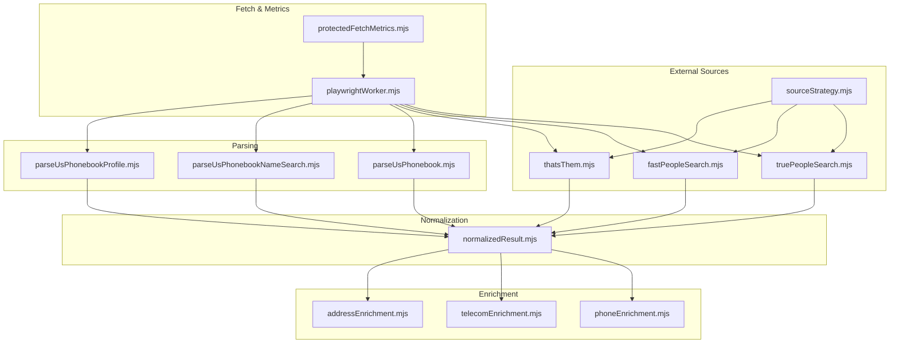
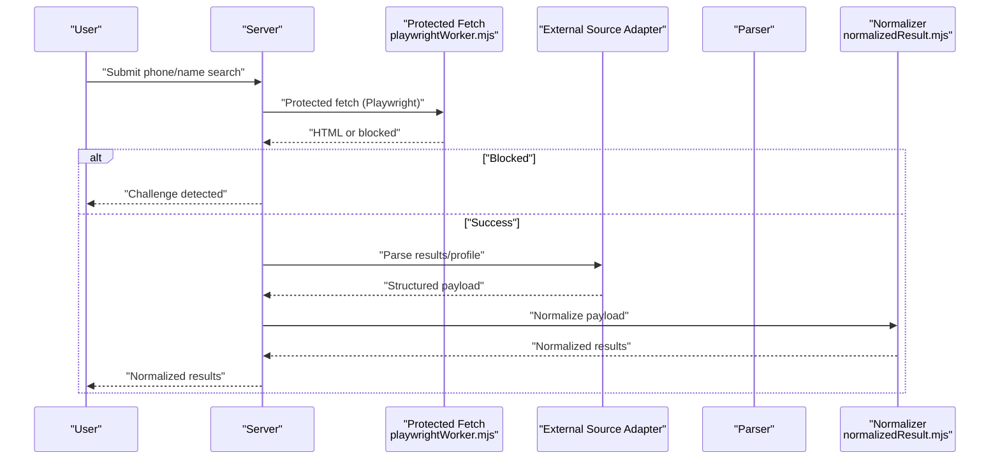
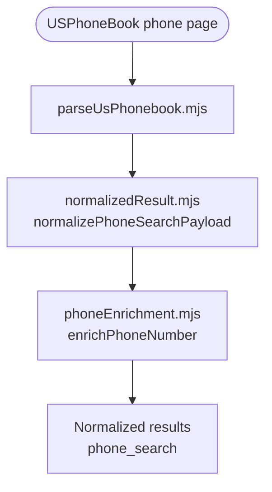
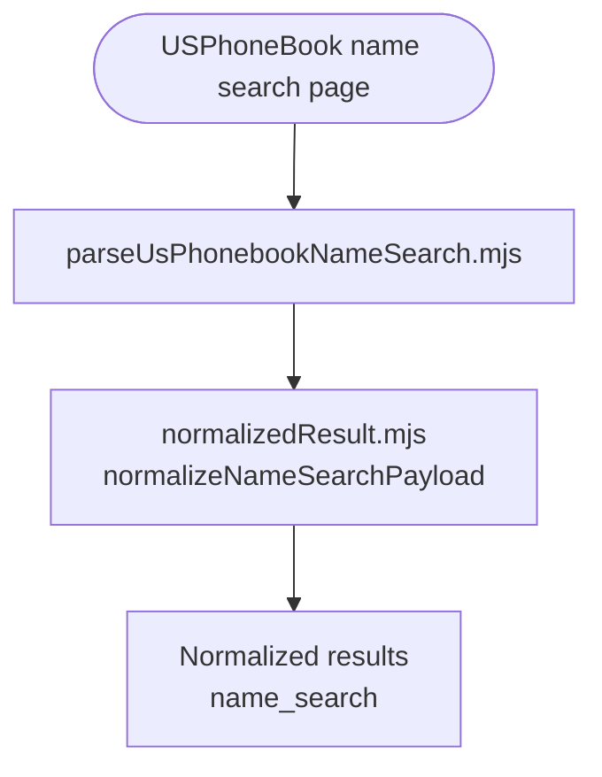
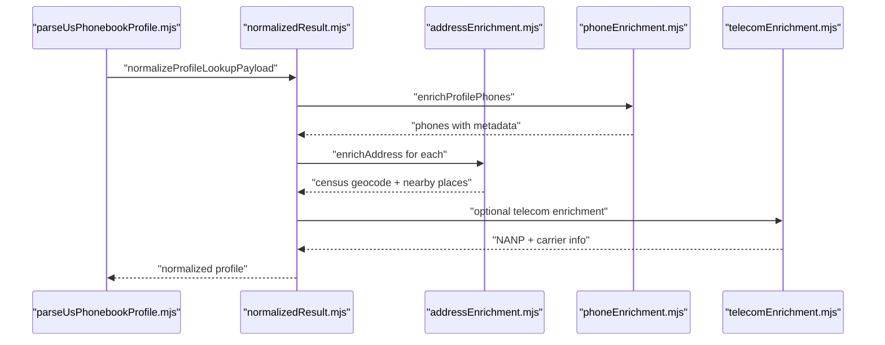
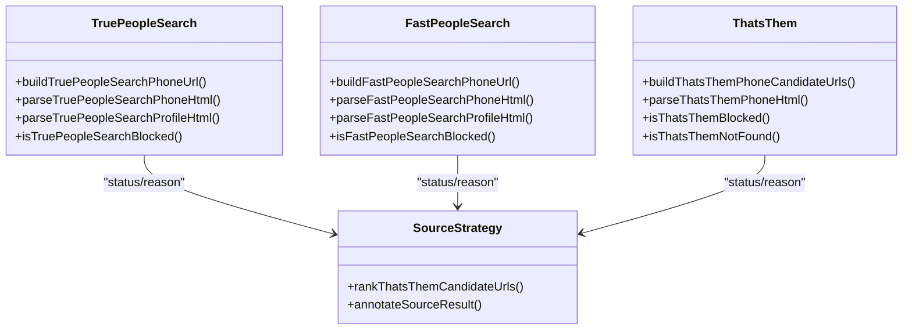
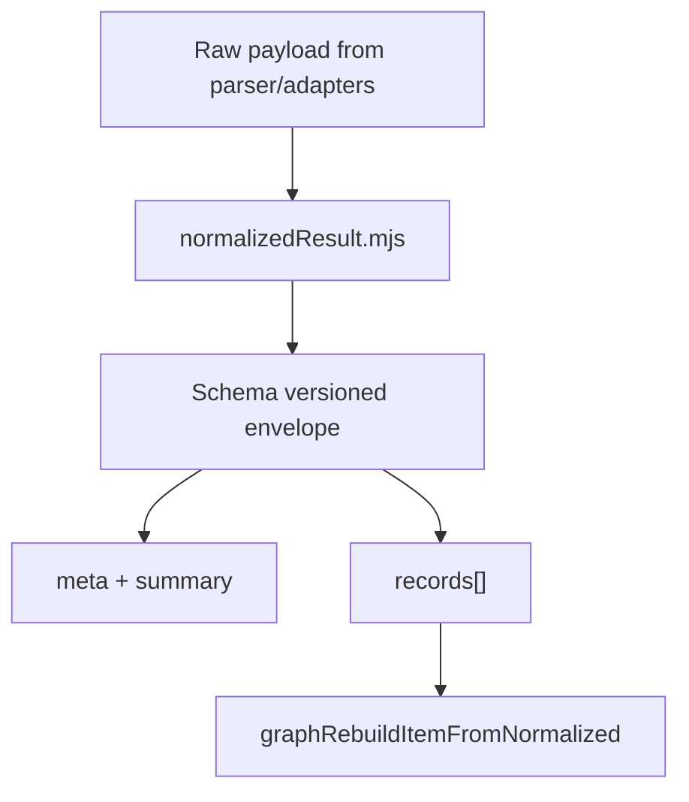
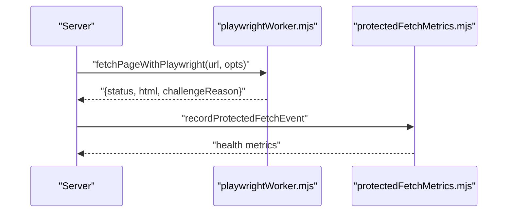
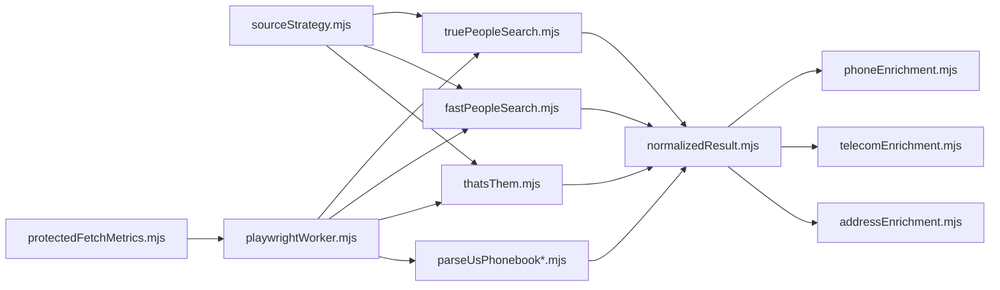

# Core Features

<cite>
**Referenced Files in This Document**
- [parseUsPhonebook.mjs](file://src/parseUsPhonebook.mjs)
- [parseUsPhonebookNameSearch.mjs](file://src/parseUsPhonebookNameSearch.mjs)
- [parseUsPhonebookProfile.mjs](file://src/parseUsPhonebookProfile.mjs)
- [normalizedResult.mjs](file://src/normalizedResult.mjs)
- [phoneEnrichment.mjs](file://src/phoneEnrichment.mjs)
- [telecomEnrichment.mjs](file://src/telecomEnrichment.mjs)
- [addressEnrichment.mjs](file://src/addressEnrichment.mjs)
- [truePeopleSearch.mjs](file://src/truePeopleSearch.mjs)
- [fastPeopleSearch.mjs](file://src/fastPeopleSearch.mjs)
- [thatsThem.mjs](file://src/thatsThem.mjs)
- [sourceStrategy.mjs](file://src/sourceStrategy.mjs)
- [playwrightWorker.mjs](file://src/playwrightWorker.mjs)
- [protectedFetchMetrics.mjs](file://src/protectedFetchMetrics.mjs)
</cite>

## Table of Contents
1. [Introduction](#introduction)
2. [Project Structure](#project-structure)
3. [Core Components](#core-components)
4. [Architecture Overview](#architecture-overview)
5. [Detailed Component Analysis](#detailed-component-analysis)
6. [Dependency Analysis](#dependency-analysis)
7. [Performance Considerations](#performance-considerations)
8. [Troubleshooting Guide](#troubleshooting-guide)
9. [Conclusion](#conclusion)

## Introduction
This document explains the core features of the USPhoneBook Flare App with a focus on:
- Reverse phone number lookup and person profile enrichment
- Multi-source external comparison (TruePeopleSearch, FastPeopleSearch, That’s Them)
- Data normalization into “normalized results”
- Protected fetch mechanisms and telecom/census enrichment

It provides both beginner-friendly conceptual overviews and developer-focused technical details, including parsing algorithms, data transformation, and practical workflows.

## Project Structure
The core functionality is organized around:
- Parsing adapters for USPhoneBook search and profiles
- Enrichment pipelines for phones, addresses, telecom, and census/geographic data
- External source adapters and ranking strategies
- Protected fetch orchestration and metrics

**Diagram sources**
- [parseUsPhonebook.mjs](file://src/parseUsPhonebook.mjs)
- [parseUsPhonebookNameSearch.mjs](file://src/parseUsPhonebookNameSearch.mjs)
- [parseUsPhonebookProfile.mjs](file://src/parseUsPhonebookProfile.mjs)
- [normalizedResult.mjs](file://src/normalizedResult.mjs)
- [phoneEnrichment.mjs](file://src/phoneEnrichment.mjs)
- [telecomEnrichment.mjs](file://src/telecomEnrichment.mjs)
- [addressEnrichment.mjs](file://src/addressEnrichment.mjs)
- [truePeopleSearch.mjs](file://src/truePeopleSearch.mjs)
- [fastPeopleSearch.mjs](file://src/fastPeopleSearch.mjs)
- [thatsThem.mjs](file://src/thatsThem.mjs)
- [sourceStrategy.mjs](file://src/sourceStrategy.mjs)
- [playwrightWorker.mjs](file://src/playwrightWorker.mjs)
- [protectedFetchMetrics.mjs](file://src/protectedFetchMetrics.mjs)

**Section sources**
- [parseUsPhonebook.mjs](file://src/parseUsPhonebook.mjs)
- [parseUsPhonebookNameSearch.mjs](file://src/parseUsPhonebookNameSearch.mjs)
- [parseUsPhonebookProfile.mjs](file://src/parseUsPhonebookProfile.mjs)
- [normalizedResult.mjs](file://src/normalizedResult.mjs)
- [phoneEnrichment.mjs](file://src/phoneEnrichment.mjs)
- [telecomEnrichment.mjs](file://src/telecomEnrichment.mjs)
- [addressEnrichment.mjs](file://src/addressEnrichment.mjs)
- [truePeopleSearch.mjs](file://src/truePeopleSearch.mjs)
- [fastPeopleSearch.mjs](file://src/fastPeopleSearch.mjs)
- [thatsThem.mjs](file://src/thatsThem.mjs)
- [sourceStrategy.mjs](file://src/sourceStrategy.mjs)
- [playwrightWorker.mjs](file://src/playwrightWorker.mjs)
- [protectedFetchMetrics.mjs](file://src/protectedFetchMetrics.mjs)

## Core Components
- Reverse phone number lookup: USPhoneBook HTML parsing produces a structured phone listing with owner, phone metadata, and relative links. The result is normalized into a “normalized results” envelope with a standardized schema.
- Person profile enrichment: USPhoneBook profile parsing extracts addresses, phones, emails, aliases, relatives, and demographic sections. Address enrichment adds census geocoding and nearby places; phone enrichment adds telecom metadata.
- External source comparison: TruePeopleSearch, FastPeopleSearch, and That’s Them adapters parse results and profiles, with strategies to rank and avoid repeated failures.
- Data normalization: A unified normalization layer ensures consistent record shapes, optional fields, and metadata for downstream graph building and UI rendering.
- Protected fetch: Playwright-backed fetch handles anti-bot challenges and records health metrics for trust assessment.

Practical examples:
- Phone search workflow: Enter a phone → USPhoneBook search → parse listing → normalize → enrich phones and addresses → build normalized results → optionally enrich with telecom data.
- Profile enrichment process: Navigate to a profile → parse profile → normalize → enrich phones and addresses → add census/geographic context → produce normalized results.
- Result interpretation: “Normalized results” include schema version, source, kind (phone_search, name_search, profile_lookup), query context, meta, summary, and records array.

**Section sources**
- [parseUsPhonebook.mjs](file://src/parseUsPhonebook.mjs)
- [normalizedResult.mjs](file://src/normalizedResult.mjs)
- [phoneEnrichment.mjs](file://src/phoneEnrichment.mjs)
- [telecomEnrichment.mjs](file://src/telecomEnrichment.mjs)
- [addressEnrichment.mjs](file://src/addressEnrichment.mjs)
- [truePeopleSearch.mjs](file://src/truePeopleSearch.mjs)
- [fastPeopleSearch.mjs](file://src/fastPeopleSearch.mjs)
- [thatsThem.mjs](file://src/thatsThem.mjs)
- [sourceStrategy.mjs](file://src/sourceStrategy.mjs)
- [playwrightWorker.mjs](file://src/playwrightWorker.mjs)
- [protectedFetchMetrics.mjs](file://src/protectedFetchMetrics.mjs)

## Architecture Overview
The system orchestrates parsing, enrichment, and normalization, while external sources are fetched via protected fetch engines and ranked by trust heuristics.

**Diagram sources**
- [playwrightWorker.mjs](file://src/playwrightWorker.mjs)
- [truePeopleSearch.mjs](file://src/truePeopleSearch.mjs)
- [fastPeopleSearch.mjs](file://src/fastPeopleSearch.mjs)
- [thatsThem.mjs](file://src/thatsThem.mjs)
- [parseUsPhonebook.mjs](file://src/parseUsPhonebook.mjs)
- [parseUsPhonebookNameSearch.mjs](file://src/parseUsPhonebookNameSearch.mjs)
- [parseUsPhonebookProfile.mjs](file://src/parseUsPhonebookProfile.mjs)
- [normalizedResult.mjs](file://src/normalizedResult.mjs)

## Detailed Component Analysis

### Reverse Phone Number Lookup
- Parses the USPhoneBook phone listing page to extract owner name, phone number, teaser/full address flag, and relatives.
- Normalizes into a “phone_search” kind with a single record containing phones, addresses (when teaser), and relatives.
- Phone metadata enrichment augments the normalized phone record with e164, type, validity, and telecom classification.

**Diagram sources**
- [parseUsPhonebook.mjs](file://src/parseUsPhonebook.mjs)
- [normalizedResult.mjs](file://src/normalizedResult.mjs)
- [phoneEnrichment.mjs](file://src/phoneEnrichment.mjs)

**Section sources**
- [parseUsPhonebook.mjs](file://src/parseUsPhonebook.mjs)
- [normalizedResult.mjs](file://src/normalizedResult.mjs)
- [phoneEnrichment.mjs](file://src/phoneEnrichment.mjs)

### Person Name Search and Listing Parsing
- Extracts candidate profiles with displayName, age, currentCityState, priorAddresses, and relative links.
- Normalizes into “name_search” kind with multiple candidate records.

**Diagram sources**
- [parseUsPhonebookNameSearch.mjs](file://src/parseUsPhonebookNameSearch.mjs)
- [normalizedResult.mjs](file://src/normalizedResult.mjs)

**Section sources**
- [parseUsPhonebookNameSearch.mjs](file://src/parseUsPhonebookNameSearch.mjs)
- [normalizedResult.mjs](file://src/normalizedResult.mjs)

### Person Profile Parsing and Enrichment
- Extracts addresses (including time ranges and periods), phones, emails, aliases, relatives, marital, education, and workplace history.
- Normalizes into “profile_lookup” kind with enriched phones and addresses.
- Address enrichment adds census geocoding and nearby places; phones are enriched with telecom metadata.

**Diagram sources**
- [parseUsPhonebookProfile.mjs](file://src/parseUsPhonebookProfile.mjs)
- [normalizedResult.mjs](file://src/normalizedResult.mjs)
- [addressEnrichment.mjs](file://src/addressEnrichment.mjs)
- [phoneEnrichment.mjs](file://src/phoneEnrichment.mjs)
- [telecomEnrichment.mjs](file://src/telecomEnrichment.mjs)

**Section sources**
- [parseUsPhonebookProfile.mjs](file://src/parseUsPhonebookProfile.mjs)
- [normalizedResult.mjs](file://src/normalizedResult.mjs)
- [addressEnrichment.mjs](file://src/addressEnrichment.mjs)
- [phoneEnrichment.mjs](file://src/phoneEnrichment.mjs)
- [telecomEnrichment.mjs](file://src/telecomEnrichment.mjs)

### External Source Comparison (TruePeopleSearch, FastPeopleSearch, That’s Them)
- Each adapter parses results and profiles, detects anti-bot challenges, and returns structured payloads.
- Strategies rank That’s Them URL variants by historical outcomes and trust signals.

**Diagram sources**
- [truePeopleSearch.mjs](file://src/truePeopleSearch.mjs)
- [fastPeopleSearch.mjs](file://src/fastPeopleSearch.mjs)
- [thatsThem.mjs](file://src/thatsThem.mjs)
- [sourceStrategy.mjs](file://src/sourceStrategy.mjs)

**Section sources**
- [truePeopleSearch.mjs](file://src/truePeopleSearch.mjs)
- [fastPeopleSearch.mjs](file://src/fastPeopleSearch.mjs)
- [thatsThem.mjs](file://src/thatsThem.mjs)
- [sourceStrategy.mjs](file://src/sourceStrategy.mjs)

### Data Normalization and “Normalized Results”
- Provides three normalization functions for phone_search, name_search, and profile_lookup kinds.
- Ensures compact, typed, and schema-versioned envelopes with meta, summary, and records.
- Supports graph rebuild item extraction from normalized results.

**Diagram sources**
- [normalizedResult.mjs](file://src/normalizedResult.mjs)

**Section sources**
- [normalizedResult.mjs](file://src/normalizedResult.mjs)

### Protected Fetch and Health Monitoring
- Playwright-backed fetch navigates pages, waits for challenges to settle, and captures snapshots.
- Records events with status, duration, and challenge reasons; exposes health metrics for trust state.

**Diagram sources**
- [playwrightWorker.mjs](file://src/playwrightWorker.mjs)
- [protectedFetchMetrics.mjs](file://src/protectedFetchMetrics.mjs)

**Section sources**
- [playwrightWorker.mjs](file://src/playwrightWorker.mjs)
- [protectedFetchMetrics.mjs](file://src/protectedFetchMetrics.mjs)

## Dependency Analysis
- Parsing depends on Cheerio and shared helpers for deduplication and path normalization.
- Normalization composes parsing outputs into a stable schema and supports graph rebuild.
- Enrichment layers depend on each other: phones feed telecom enrichment; addresses feed census and nearby places.
- External adapters are decoupled and integrated via a strategy that annotates trust and ranks candidates.

**Diagram sources**
- [parseUsPhonebook.mjs](file://src/parseUsPhonebook.mjs)
- [parseUsPhonebookNameSearch.mjs](file://src/parseUsPhonebookNameSearch.mjs)
- [parseUsPhonebookProfile.mjs](file://src/parseUsPhonebookProfile.mjs)
- [normalizedResult.mjs](file://src/normalizedResult.mjs)
- [phoneEnrichment.mjs](file://src/phoneEnrichment.mjs)
- [telecomEnrichment.mjs](file://src/telecomEnrichment.mjs)
- [addressEnrichment.mjs](file://src/addressEnrichment.mjs)
- [truePeopleSearch.mjs](file://src/truePeopleSearch.mjs)
- [fastPeopleSearch.mjs](file://src/fastPeopleSearch.mjs)
- [thatsThem.mjs](file://src/thatsThem.mjs)
- [sourceStrategy.mjs](file://src/sourceStrategy.mjs)
- [playwrightWorker.mjs](file://src/playwrightWorker.mjs)
- [protectedFetchMetrics.mjs](file://src/protectedFetchMetrics.mjs)

**Section sources**
- [parseUsPhonebook.mjs](file://src/parseUsPhonebook.mjs)
- [normalizedResult.mjs](file://src/normalizedResult.mjs)
- [phoneEnrichment.mjs](file://src/phoneEnrichment.mjs)
- [telecomEnrichment.mjs](file://src/telecomEnrichment.mjs)
- [addressEnrichment.mjs](file://src/addressEnrichment.mjs)
- [truePeopleSearch.mjs](file://src/truePeopleSearch.mjs)
- [fastPeopleSearch.mjs](file://src/fastPeopleSearch.mjs)
- [thatsThem.mjs](file://src/thatsThem.mjs)
- [sourceStrategy.mjs](file://src/sourceStrategy.mjs)
- [playwrightWorker.mjs](file://src/playwrightWorker.mjs)
- [protectedFetchMetrics.mjs](file://src/protectedFetchMetrics.mjs)

## Performance Considerations
- Parsing algorithms use targeted Cheerio selectors and minimal DOM traversal to reduce overhead.
- Normalization compacts objects and filters empty arrays/objects to keep payloads lean.
- Address enrichment defers expensive calls behind caches and only computes nearby places when census coordinates are available.
- Telecom enrichment caches NXX carrier data to avoid frequent remote lookups.
- Protected fetch enforces timeouts and tracks health to balance throughput and reliability.

[No sources needed since this section provides general guidance]

## Troubleshooting Guide
Common issues and diagnostics:
- Anti-bot challenges: Detected in external adapters and Playwright fetch; health metrics track challenge rates and success rates.
- Blocked sources: Annotated with trustFailure flags; strategies avoid repeated failures for specific patterns.
- Timeout or error statuses: Recorded with durations and reasons; health metrics surface trends.

Actions:
- Inspect protected fetch health metrics to assess trust state and adjust engines.
- Review source strategy outcomes for That’s Them candidate URLs.
- Re-run protected fetch with different engines or increase timeouts.

**Section sources**
- [protectedFetchMetrics.mjs](file://src/protectedFetchMetrics.mjs)
- [sourceStrategy.mjs](file://src/sourceStrategy.mjs)
- [playwrightWorker.mjs](file://src/playwrightWorker.mjs)

## Conclusion
The USPhoneBook Flare App delivers robust reverse phone lookup and person profile enrichment by combining resilient parsing, multi-source external comparison, and strict data normalization. Protected fetch and health monitoring ensure sustainable operation against anti-bot protections, while enrichment layers add telecom and geographic context to produce actionable “normalized results.”

[No sources needed since this section summarizes without analyzing specific files]