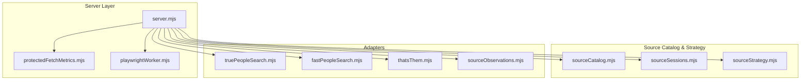
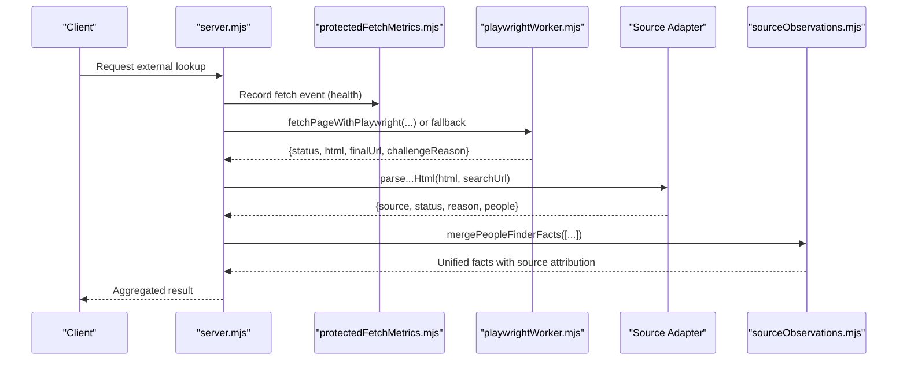
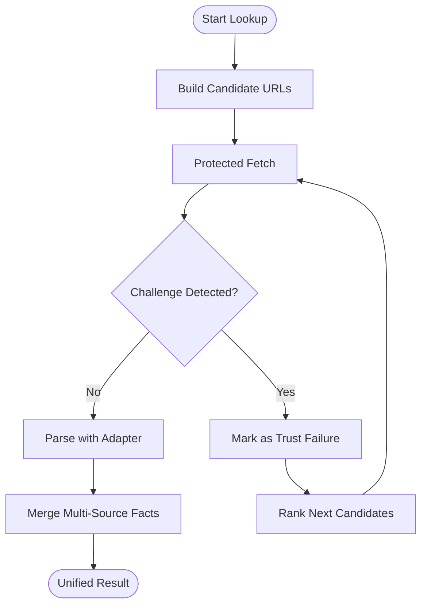
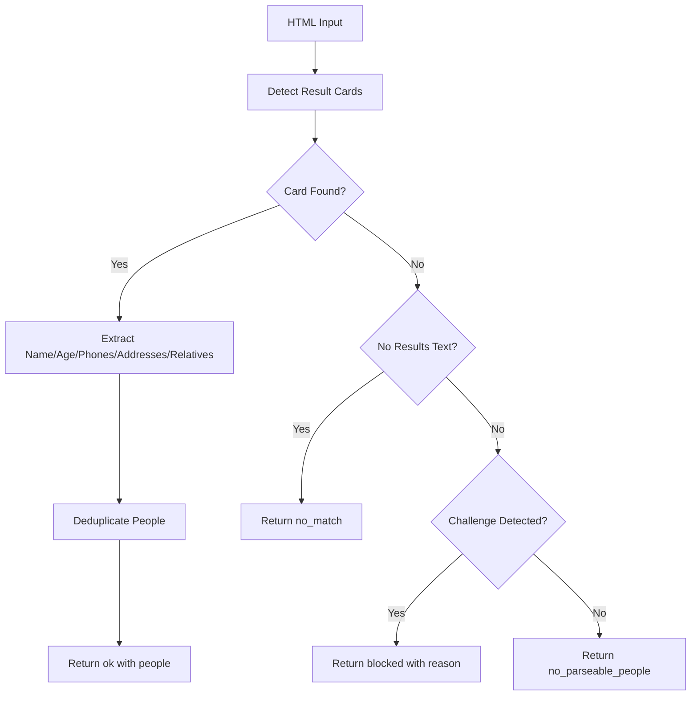
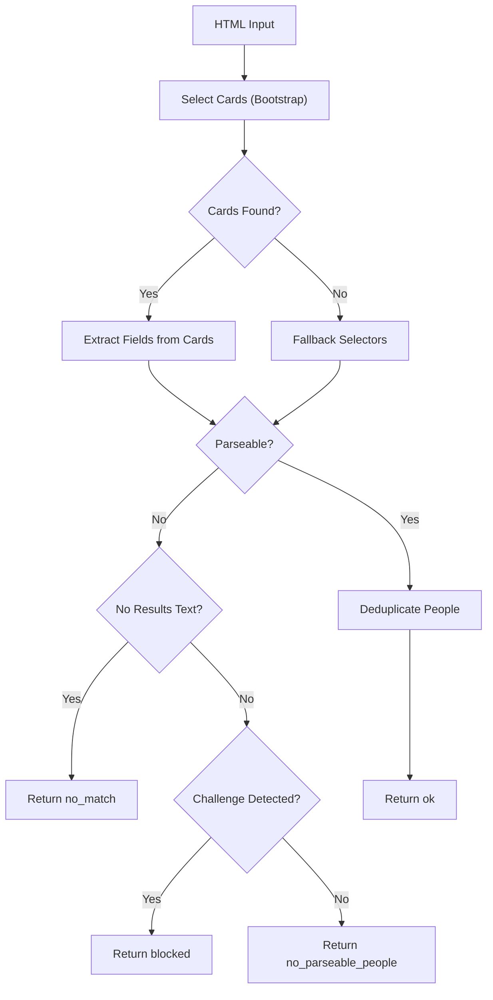
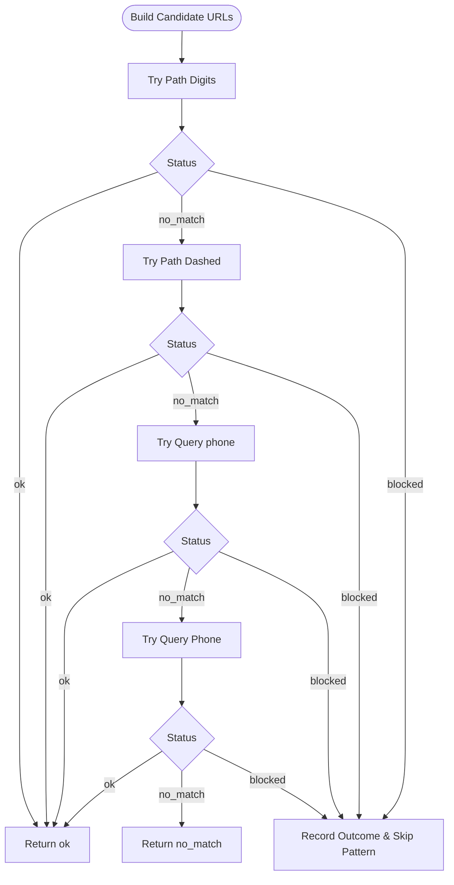
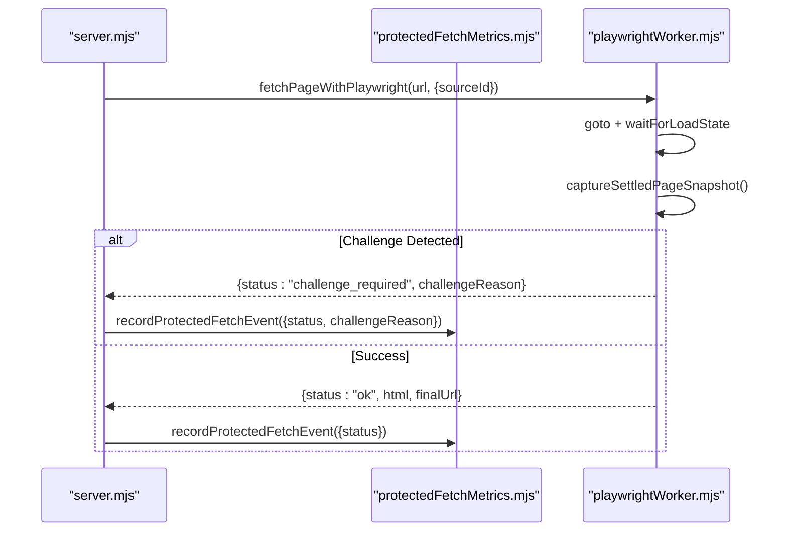
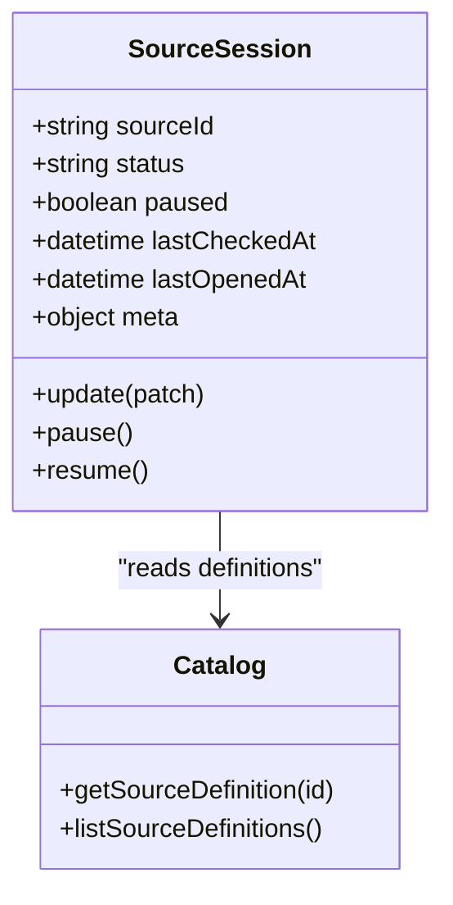
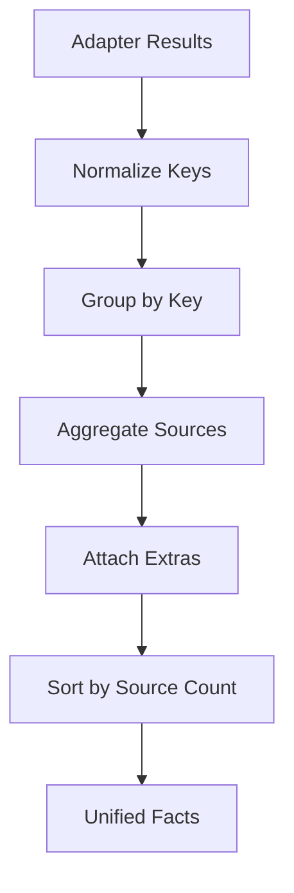
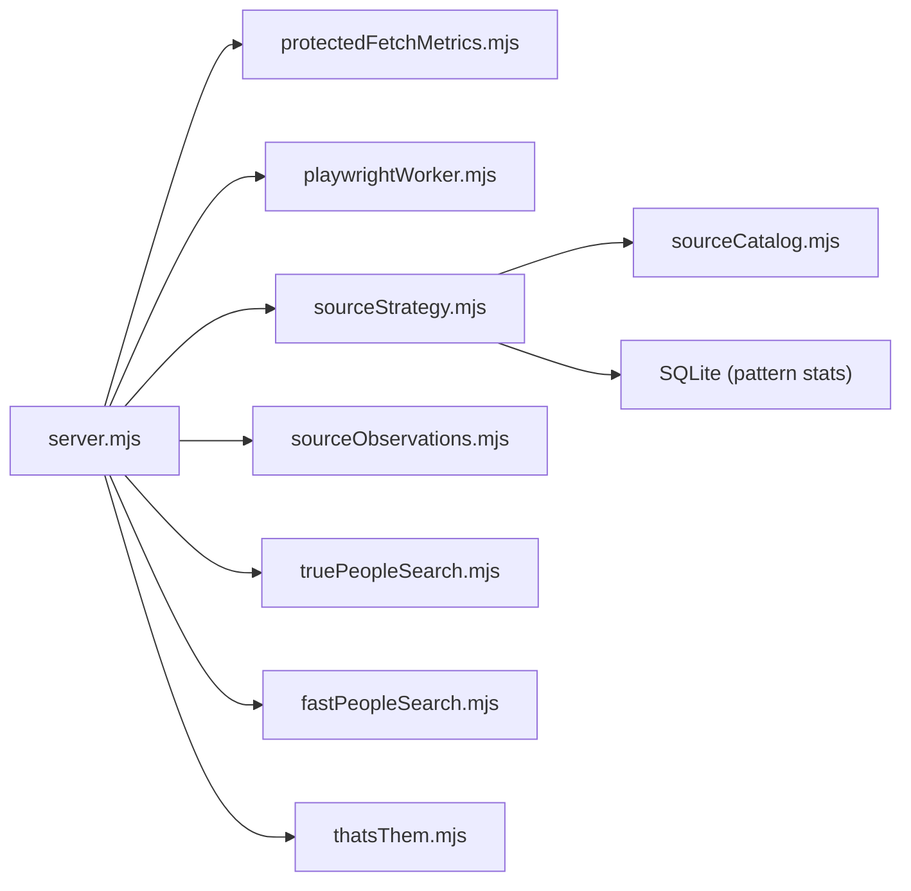

# External Source Integration

<cite>
**Referenced Files in This Document**
- [sourceCatalog.mjs](file://src/sourceCatalog.mjs)
- [sourceSessions.mjs](file://src/sourceSessions.mjs)
- [sourceStrategy.mjs](file://src/sourceStrategy.mjs)
- [truePeopleSearch.mjs](file://src/truePeopleSearch.mjs)
- [fastPeopleSearch.mjs](file://src/fastPeopleSearch.mjs)
- [thatsThem.mjs](file://src/thatsThem.mjs)
- [playwrightWorker.mjs](file://src/playwrightWorker.mjs)
- [protectedFetchMetrics.mjs](file://src/protectedFetchMetrics.mjs)
- [server.mjs](file://src/server.mjs)
- [sourceObservations.mjs](file://src/sourceObservations.mjs)
- [OSINT_STACK_AUDIT.md](file://OSINT_STACK_AUDIT.md)
</cite>

## Table of Contents
1. [Introduction](#introduction)
2. [Project Structure](#project-structure)
3. [Core Components](#core-components)
4. [Architecture Overview](#architecture-overview)
5. [Detailed Component Analysis](#detailed-component-analysis)
6. [Dependency Analysis](#dependency-analysis)
7. [Performance Considerations](#performance-considerations)
8. [Troubleshooting Guide](#troubleshooting-guide)
9. [Conclusion](#conclusion)
10. [Appendices](#appendices)

## Introduction
This document explains how the application integrates multiple external data sources to improve accuracy and reliability through multi-source aggregation and comparison. It covers the source adapter pattern, the TruePeopleSearch, FastPeopleSearch, and That's Them integrations, including their parsing strategies and data extraction methods. It also documents the source catalog configuration, strategy selection algorithms, and fallback mechanisms for handling source failures. Both conceptual overviews for beginners and technical details for experienced developers are included, using terminology consistent with the codebase such as “source sessions” and “protected fetch.”

## Project Structure
The external source integration is implemented across several modules:
- Source catalog and strategy: defines source capabilities, session models, and trust/failure semantics
- Source adapters: parsers for TruePeopleSearch, FastPeopleSearch, and That's Them
- Protected fetch and browser orchestration: resilient fetching with fallback engines
- Observations and merging: synthesis of multi-source results into unified facts
- Server integration: end-to-end orchestration of fetch, parse, and merge

**Diagram sources**
- [server.mjs](file://src/server.mjs)
- [sourceCatalog.mjs](file://src/sourceCatalog.mjs)
- [sourceSessions.mjs](file://src/sourceSessions.mjs)
- [sourceStrategy.mjs](file://src/sourceStrategy.mjs)
- [truePeopleSearch.mjs](file://src/truePeopleSearch.mjs)
- [fastPeopleSearch.mjs](file://src/fastPeopleSearch.mjs)
- [thatsThem.mjs](file://src/thatsThem.mjs)
- [playwrightWorker.mjs](file://src/playwrightWorker.mjs)
- [protectedFetchMetrics.mjs](file://src/protectedFetchMetrics.mjs)
- [sourceObservations.mjs](file://src/sourceObservations.mjs)

**Section sources**
- [OSINT_STACK_AUDIT.md](file://OSINT_STACK_AUDIT.md)
- [sourceCatalog.mjs](file://src/sourceCatalog.mjs)

## Core Components
- Source catalog: enumerates supported sources, their categories, session requirements, and operational characteristics. It also provides audit snapshots and overlap groups to guide multi-source strategy.
- Source sessions: manages per-source session state, including readiness, pause/resume, and UI support flags.
- Strategy and trust: defines failure semantics for blocked/bot-challenged results, annotates outcomes, and ranks candidate URLs for That's Them.
- Adapters: implement parsing for TruePeopleSearch, FastPeopleSearch, and That's Them, including robust detection of challenge pages and structured extraction of identities, addresses, phones, emails, and relatives.
- Protected fetch: orchestrates resilient fetching with fallback engines and records health metrics.
- Merging: synthesizes multi-source results into unified facts with source attribution.

**Section sources**
- [sourceCatalog.mjs](file://src/sourceCatalog.mjs)
- [sourceSessions.mjs](file://src/sourceSessions.mjs)
- [sourceStrategy.mjs](file://src/sourceStrategy.mjs)
- [truePeopleSearch.mjs](file://src/truePeopleSearch.mjs)
- [fastPeopleSearch.mjs](file://src/fastPeopleSearch.mjs)
- [thatsThem.mjs](file://src/thatsThem.mjs)
- [playwrightWorker.mjs](file://src/playwrightWorker.mjs)
- [protectedFetchMetrics.mjs](file://src/protectedFetchMetrics.mjs)
- [sourceObservations.mjs](file://src/sourceObservations.mjs)

## Architecture Overview
The system uses a protected fetch pipeline to retrieve HTML from external sources, then routes the content to the appropriate adapter. Results are annotated for trust and failure, then merged into unified facts. Session-aware sources maintain persistent browser contexts to reduce bot detection and improve reliability.

**Diagram sources**
- [server.mjs](file://src/server.mjs)
- [playwrightWorker.mjs](file://src/playwrightWorker.mjs)
- [protectedFetchMetrics.mjs](file://src/protectedFetchMetrics.mjs)
- [sourceObservations.mjs](file://src/sourceObservations.mjs)
- [truePeopleSearch.mjs](file://src/truePeopleSearch.mjs)
- [fastPeopleSearch.mjs](file://src/fastPeopleSearch.mjs)
- [thatsThem.mjs](file://src/thatsThem.mjs)

## Detailed Component Analysis

### Source Catalog and Strategy
- Source catalog defines each source’s capabilities, session model, and operational notes. It includes:
  - Access mode (HTML, browser, direct HTTP)
  - Session requirements (none, optional, required)
  - Review modes (none, candidate confirmation)
  - Overlap groups and expansion priorities
  - Automation blueprint for future browser workers
- Strategy module:
  - Defines trust failure reasons for blocked/bot-challenged outcomes
  - Annotates results with trustFailure, failureKind, and trustReason
  - Ranks That’s Them candidate URLs by pattern and historical outcomes
  - Persists and loads pattern statistics for adaptive URL selection

**Diagram sources**
- [sourceStrategy.mjs](file://src/sourceStrategy.mjs)
- [sourceCatalog.mjs](file://src/sourceCatalog.mjs)
- [server.mjs](file://src/server.mjs)

**Section sources**
- [sourceCatalog.mjs](file://src/sourceCatalog.mjs)
- [sourceStrategy.mjs](file://src/sourceStrategy.mjs)

### TruePeopleSearch Adapter
- Parsing strategy:
  - Detects result cards and profile detail sections
  - Extracts names, ages, addresses, phones, emails, and relatives
  - Handles multiple card layouts and fallback selectors
  - Deduplicates people by name/phones/addresses
- Challenge detection:
  - Identifies Cloudflare, captcha, and “attention required” pages
  - Treats challenge pages as blocked outcomes with explicit reasons
- Profile parsing:
  - Extracts aliases, current/previous addresses with time ranges, phones with line type, and linked relatives/associates

**Diagram sources**
- [truePeopleSearch.mjs](file://src/truePeopleSearch.mjs)

**Section sources**
- [truePeopleSearch.mjs](file://src/truePeopleSearch.mjs)

### FastPeopleSearch Adapter
- Parsing strategy:
  - Recognizes Bootstrap-style cards and detail links
  - Extracts name, age, addresses (including past addresses), phones, and relatives
  - Uses labeled sections and fallback selectors for robustness
  - Deduplicates people by composite key
- Challenge detection:
  - Identifies Cloudflare, captcha, and “access denied” pages
  - Treats challenge pages as blocked outcomes
- Profile parsing:
  - Extracts aliases, emails, addresses with time ranges, phones with “current” indicators, and linked relatives/associates

**Diagram sources**
- [fastPeopleSearch.mjs](file://src/fastPeopleSearch.mjs)

**Section sources**
- [fastPeopleSearch.mjs](file://src/fastPeopleSearch.mjs)

### That's Them Adapter
- Candidate URL building:
  - Generates multiple URL variants for phone lookups (digits, dashed, query params)
- Parsing strategy:
  - Detects challenge pages (humanity checks, recaptcha, captcha)
  - Treats 404 pages as no_match
  - Extracts names, ages, phones (with line type/service provider), emails, and addresses
  - Deduplicates people by composite key
- Strategy integration:
  - Uses pattern-based ranking and outcome tracking to avoid repeated failing patterns

**Diagram sources**
- [thatsThem.mjs](file://src/thatsThem.mjs)
- [sourceStrategy.mjs](file://src/sourceStrategy.mjs)

**Section sources**
- [thatsThem.mjs](file://src/thatsThem.mjs)
- [sourceStrategy.mjs](file://src/sourceStrategy.mjs)

### Protected Fetch and Browser Orchestration
- Engine selection:
  - Supports “flare”, “playwright-local”, and “direct”
  - Auto-fallback behavior when configured
- Resilience:
  - Waits for challenge settlement and captures settled snapshots
  - Detects Cloudflare, captcha, and access-denied states
- Metrics:
  - Records fetch events with status, duration, and challenge reason
  - Computes health metrics (success rate, challenge rate, median duration)

**Diagram sources**
- [server.mjs](file://src/server.mjs)
- [playwrightWorker.mjs](file://src/playwrightWorker.mjs)
- [protectedFetchMetrics.mjs](file://src/protectedFetchMetrics.mjs)

**Section sources**
- [server.mjs](file://src/server.mjs)
- [playwrightWorker.mjs](file://src/playwrightWorker.mjs)
- [protectedFetchMetrics.mjs](file://src/protectedFetchMetrics.mjs)

### Source Sessions Management
- Tracks per-source readiness and UI support
- Supports pausing/resuming sessions and propagating updates across session-scoped sources
- Provides UI hooks for warming persistent browser contexts

**Diagram sources**
- [sourceSessions.mjs](file://src/sourceSessions.mjs)
- [sourceCatalog.mjs](file://src/sourceCatalog.mjs)

**Section sources**
- [sourceSessions.mjs](file://src/sourceSessions.mjs)
- [sourceCatalog.mjs](file://src/sourceCatalog.mjs)

### Result Synthesis and Quality Assessment
- Merging:
  - Normalizes names, emails, addresses, phones, and relatives
  - Groups items by normalized keys and aggregates source attestations
  - Preserves extras (e.g., age, line type, belongsTo) for richer provenance
- Quality signals:
  - Trust failures are flagged to guide downstream decisions
  - Health metrics inform operator awareness of fetch reliability

**Diagram sources**
- [sourceObservations.mjs](file://src/sourceObservations.mjs)
- [sourceStrategy.mjs](file://src/sourceStrategy.mjs)

**Section sources**
- [sourceObservations.mjs](file://src/sourceObservations.mjs)
- [sourceStrategy.mjs](file://src/sourceStrategy.mjs)

## Dependency Analysis
- server.mjs depends on:
  - protected fetch helpers for resilient retrieval
  - source adapters for parsing
  - strategy utilities for trust and ranking
  - observations for merging
- Adapters depend on:
  - Cheerio for DOM parsing
  - Phone enrichment utilities for normalization
- Strategy depends on:
  - Catalog for session scope and overlap context
  - Database for persistence of That’s Them pattern stats

**Diagram sources**
- [server.mjs](file://src/server.mjs)
- [sourceStrategy.mjs](file://src/sourceStrategy.mjs)
- [sourceCatalog.mjs](file://src/sourceCatalog.mjs)
- [playwrightWorker.mjs](file://src/playwrightWorker.mjs)
- [protectedFetchMetrics.mjs](file://src/protectedFetchMetrics.mjs)
- [sourceObservations.mjs](file://src/sourceObservations.mjs)
- [truePeopleSearch.mjs](file://src/truePeopleSearch.mjs)
- [fastPeopleSearch.mjs](file://src/fastPeopleSearch.mjs)
- [thatsThem.mjs](file://src/thatsThem.mjs)

**Section sources**
- [server.mjs](file://src/server.mjs)
- [sourceStrategy.mjs](file://src/sourceStrategy.mjs)
- [sourceCatalog.mjs](file://src/sourceCatalog.mjs)

## Performance Considerations
- Prefer persistent browser contexts per source family to minimize re-authentication and bot detection
- Use settled snapshot capture to avoid transient challenge pages
- Apply candidate URL ranking to reduce retries on known-failing patterns
- Monitor protected fetch health metrics to adjust timeouts and fallbacks dynamically
- Deduplicate and normalize early to reduce memory and CPU overhead during merging

[No sources needed since this section provides general guidance]

## Troubleshooting Guide
Common issues and remedies:
- Challenge pages:
  - Symptom: blocked status with challengeReason
  - Action: open interactive session for the source, complete challenge, then retry
- No match vs. parseable no match:
  - Symptom: no_match with different reasons
  - Action: inspect reason and adjust search inputs or candidate URLs
- Trust failures:
  - Symptom: source_trust failure marked on results
  - Action: investigate health metrics and consider fallback engines
- Session readiness:
  - Symptom: session_required status
  - Action: warm the browser session in Settings and resume the source

Operational controls:
- Health dashboard: monitor success rate, challenge rate, and median duration
- Session management: pause/resume sources and propagate updates across session scopes
- Pattern stats: review and reset That’s Them pattern statistics if needed

**Section sources**
- [server.mjs](file://src/server.mjs)
- [playwrightWorker.mjs](file://src/playwrightWorker.mjs)
- [protectedFetchMetrics.mjs](file://src/protectedFetchMetrics.mjs)
- [sourceSessions.mjs](file://src/sourceSessions.mjs)
- [sourceStrategy.mjs](file://src/sourceStrategy.mjs)

## Conclusion
The external source integration leverages a robust protected fetch pipeline, source-specific adapters, and a strategy layer to achieve high-quality, multi-source identity synthesis. By modeling session-aware sources, annotating trust failures, and persisting pattern insights, the system improves accuracy while remaining resilient to anti-bot measures and transient failures. Operators can monitor health, manage sessions, and refine strategies iteratively for sustained reliability.

[No sources needed since this section summarizes without analyzing specific files]

## Appendices

### Practical Workflows

- Multi-source phone lookup:
  - Build candidate URLs for TruePeopleSearch, FastPeopleSearch, and That’s Them
  - Protected fetch each URL; annotate results and mark trust failures
  - Rank That’s Them candidates by historical outcomes
  - Parse with respective adapters and merge unified facts
  - Assess quality by source counts and trust signals

- Profile expansion:
  - Start from a verified person card
  - Expand to related profiles and addresses using adapter-specific navigations
  - Maintain session continuity to avoid re-challenges
  - Merge expanded facts and update health metrics

- Fallback strategy:
  - If Flare fails, automatically switch to Playwright-local
  - If Playwright-local fails, return error with challenge reason for operator action
  - Use health metrics to decide whether to retry or escalate

[No sources needed since this section provides general guidance]