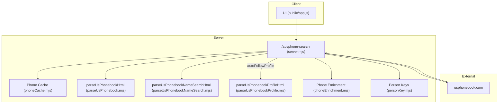
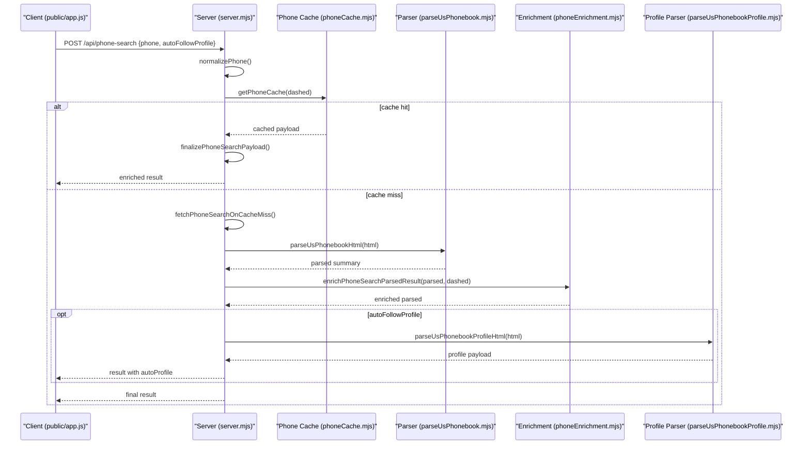
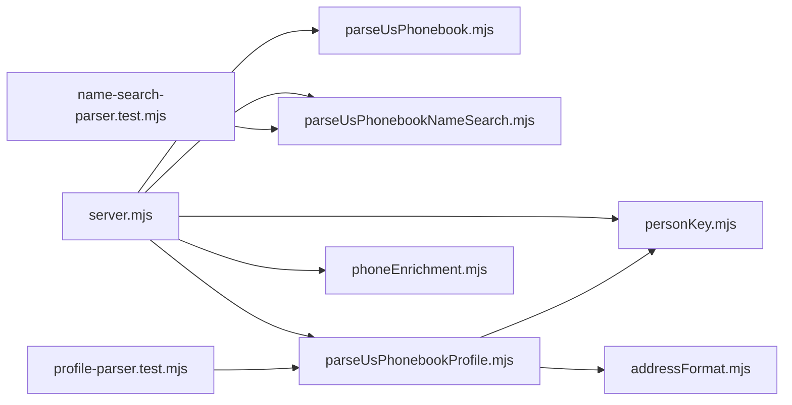

# Phone Search Functionality

<cite>
**Referenced Files in This Document**
- [parseUsPhonebook.mjs](file://src/parseUsPhonebook.mjs)
- [parseUsPhonebookNameSearch.mjs](file://src/parseUsPhonebookNameSearch.mjs)
- [parseUsPhonebookProfile.mjs](file://src/parseUsPhonebookProfile.mjs)
- [phoneEnrichment.mjs](file://src/phoneEnrichment.mjs)
- [personKey.mjs](file://src/personKey.mjs)
- [server.mjs](file://src/server.mjs)
- [phoneCache.mjs](file://src/phoneCache.mjs)
- [addressFormat.mjs](file://src/addressFormat.mjs)
- [profile-parser.test.mjs](file://test/profile-parser.test.mjs)
- [name-search-parser.test.mjs](file://test/name-search-parser.test.mjs)
- [fixture-phone-page.html](file://test/fixture-phone-page.html)
- [app.js](file://public/app.js)
</cite>

## Table of Contents
1. [Introduction](#introduction)
2. [Project Structure](#project-structure)
3. [Core Components](#core-components)
4. [Architecture Overview](#architecture-overview)
5. [Detailed Component Analysis](#detailed-component-analysis)
6. [Dependency Analysis](#dependency-analysis)
7. [Performance Considerations](#performance-considerations)
8. [Troubleshooting Guide](#troubleshooting-guide)
9. [Conclusion](#conclusion)

## Introduction
This document explains the phone search functionality implemented against the USPhoneBook source. It covers the HTML parsing pipeline, the parseUsPhonebookHtml function and its DOM traversal via Cheerio, selector patterns for extracting owners, phone numbers, and profile links, and the end-to-end phone lookup workflow. It also documents the relationship between phone search results and profile enrichment, including how profile paths are extracted and optionally auto-followed to enrich the graph. Edge cases, common parsing scenarios, and error handling strategies are included to help both beginners and experienced developers implement robust parsers.

## Project Structure
The phone search feature spans several modules:
- Parser modules that transform HTML into structured records
- Server orchestration that coordinates fetching, parsing, enriching, and optional auto-follow
- Utilities for phone normalization and deduplication
- Tests and fixtures validating parsing behavior

**Diagram sources**
- [server.mjs:3240-3301](file://src/server.mjs#L3240-L3301)
- [phoneCache.mjs:1-56](file://src/phoneCache.mjs#L1-L56)
- [parseUsPhonebook.mjs:14-102](file://src/parseUsPhonebook.mjs#L14-L102)
- [parseUsPhonebookNameSearch.mjs:49-108](file://src/parseUsPhonebookNameSearch.mjs#L49-L108)
- [parseUsPhonebookProfile.mjs:253-615](file://src/parseUsPhonebookProfile.mjs#L253-L615)
- [phoneEnrichment.mjs:7-96](file://src/phoneEnrichment.mjs#L7-L96)
- [personKey.mjs:11-60](file://src/personKey.mjs#L11-L60)

**Section sources**
- [server.mjs:3240-3301](file://src/server.mjs#L3240-L3301)
- [phoneCache.mjs:1-56](file://src/phoneCache.mjs#L1-L56)

## Core Components
- parseUsPhonebookHtml: Parses a phone search summary page to extract owner, phone number, teaser flag, and relatives.
- parseUsPhonebookNameSearchHtml: Parses a name-based search results page to extract candidates and pagination hints.
- parseUsPhonebookProfileHtml: Parses a person profile page to extract addresses, phones, relatives, emails, work/edu, and marital links; resolves canonical profilePath.
- phoneEnrichment: Normalizes raw phone inputs and enriches parsed phone metadata.
- personKey: Provides profile path normalization and deduplication helpers used across parsers.
- server orchestration: Implements the /api/phone-search endpoint, caching, deduplication, and optional auto-follow of profiles.

**Section sources**
- [parseUsPhonebook.mjs:14-102](file://src/parseUsPhonebook.mjs#L14-L102)
- [parseUsPhonebookNameSearch.mjs:49-108](file://src/parseUsPhonebookNameSearch.mjs#L49-L108)
- [parseUsPhonebookProfile.mjs:253-615](file://src/parseUsPhonebookProfile.mjs#L253-L615)
- [phoneEnrichment.mjs:7-96](file://src/phoneEnrichment.mjs#L7-L96)
- [personKey.mjs:11-60](file://src/personKey.mjs#L11-L60)
- [server.mjs:3240-3301](file://src/server.mjs#L3240-L3301)

## Architecture Overview
The phone search workflow begins at the client, which posts a phone number to /api/phone-search. The server normalizes the phone, checks cache, fetches the upstream page, parses it, enriches metadata, optionally ingests into the graph, and can auto-follow the profile to enrich relationships.

**Diagram sources**
- [server.mjs:3240-3301](file://src/server.mjs#L3240-L3301)
- [phoneCache.mjs:44-56](file://src/phoneCache.mjs#L44-L56)
- [parseUsPhonebook.mjs:14-102](file://src/parseUsPhonebook.mjs#L14-L102)
- [phoneEnrichment.mjs:103-108](file://src/phoneEnrichment.mjs#L103-L108)
- [parseUsPhonebookProfile.mjs:253-615](file://src/parseUsPhonebookProfile.mjs#L253-L615)

## Detailed Component Analysis

### parseUsPhonebookHtml: Phone Summary Parsing
Purpose:
- Extract current owner name, line phone number, profile path, full address teaser flag, and relatives from a phone search summary page.

DOM traversal highlights:
- Loads HTML with Cheerio and scopes to the success wrapper for the people finder.
- Selectors target microdata attributes (e.g., name with givenName/familyName) and contextual headings.
- Derives profilePath from the first anchor linking to a path under the name card or other candidate links.
- Gathers relatives by walking blue links with relatedTo microdata and normalizing duplicates.

Key behaviors:
- Returns null owner and empty relatives when the success wrapper is absent.
- Cleans and trims phone text, removing nested element markup.
- Deduplicates relatives by combining multiple paths per name and normalizing to unique profile paths.

Common scenarios:
- Owner present with name and phone; teaser indicates full address availability.
- No owner shown; parser still returns empty owner and scans for relatives.
- Relative links with alternate paths resolved to a canonical profile path.

Edge cases handled:
- Empty or missing name segments fall back to null display name.
- Relative links may include alternate paths; uniqueProfilePaths ensures deduplication.
- Profile path extraction prefers explicit anchors and falls back to itemid-derived paths.

Concrete examples from tests/fixtures:
- Name search results page demonstrates candidate extraction and pagination hints.
- A minimal phone page fixture shows owner name, phone, teaser, and relative link.

**Section sources**
- [parseUsPhonebook.mjs:14-102](file://src/parseUsPhonebook.mjs#L14-L102)
- [name-search-parser.test.mjs:5-70](file://test/name-search-parser.test.mjs#L5-L70)
- [fixture-phone-page.html:1-29](file://test/fixture-phone-page.html#L1-L29)

### parseUsPhonebookNameSearchHtml: Name-Based Results Parsing
Purpose:
- Parse a name-based search results page to extract query metadata, total records, total pages, and a list of candidates.

Parsing logic:
- Extracts queryName from the header, summary text, and total records from the summary heading.
- Iterates result blocks to build candidate entries with displayName, age, currentCityState, priorAddresses, relatives, and profilePath.
- Uses helper functions to clean text, strip labels, and split CSV-like lists.

Selector patterns:
- Header and summary selectors target search header elements and info descriptions.
- Candidate iteration targets success wrapper blocks and child elements for name, age, addresses, and relative links.

Validation via tests:
- Confirms extraction of queryName, totalRecords, totalPages, and candidate fields including profilePath resolution.

**Section sources**
- [parseUsPhonebookNameSearch.mjs:49-108](file://src/parseUsPhonebookNameSearch.mjs#L49-L108)
- [name-search-parser.test.mjs:5-70](file://test/name-search-parser.test.mjs#L5-L70)

### parseUsPhonebookProfileHtml: Profile Page Parsing and Auto-Follow
Purpose:
- Parse a person profile page into a normalized structure including addresses, phones, relatives, emails, work/education, and marital links.
- Resolve a canonical profilePath from multiple potential sources.

Address parsing:
- Scans “Current Address” and “Previous Addresses” sections, normalizes labels, merges overlapping periods, and marks the most recent as current.
- Builds addressPeriods with time ranges and sorts by recency.

Phone parsing:
- Finds links under “phone-search” paths, normalizes to dashed format, and flags previous vs current.

Relative extraction:
- Walks relative links, filters junk/sponsored links, and deduplicates by name/path using relativeListDedupeKey and uniqueProfilePaths.
- Removes self-references by comparing name and path keys to the subject.

Profile path resolution:
- Attempts canonical URL, hidden URL spans, header URL spans, and fallback anchors, ensuring a proper person detail path.

Auto-follow integration:
- When autoFollowProfile is requested, the server calls fetchProfileData with contextDashed and returns a cleaned profile payload.

Tests demonstrate:
- Deduplication of identical addresses across periods and selection of the most recent current flag.
- Cleaning of empty or malformed workplace fields.

**Section sources**
- [parseUsPhonebookProfile.mjs:253-615](file://src/parseUsPhonebookProfile.mjs#L253-L615)
- [profile-parser.test.mjs:5-78](file://test/profile-parser.test.mjs#L5-L78)
- [addressFormat.mjs:123-154](file://src/addressFormat.mjs#L123-L154)

### Phone Enrichment and Metadata
Purpose:
- Normalize raw phone inputs to digits and dashed format.
- Enrich parsed phone metadata using libphonenumber-js, including validity, type, and formatting.

Workflow:
- normalizeUsPhoneDigits handles 10-digit and 11-digit (with leading 1) inputs.
- enrichPhoneNumber parses and augments with e164, international, national, type, and validity flags.
- enrichPhoneSearchParsedResult attaches phoneMetadata to parsed summaries.
- enrichProfilePhones enriches phones within a profile payload.

**Section sources**
- [phoneEnrichment.mjs:7-96](file://src/phoneEnrichment.mjs#L7-L96)
- [phoneEnrichment.mjs:103-125](file://src/phoneEnrichment.mjs#L103-L125)

### Person Key Utilities
Purpose:
- Normalize profile paths to canonical pathname-only forms.
- Determine whether a path is a person profile (not phone-search or address).
- Build deduplication keys for relatives and unique profile paths.

Key helpers:
- profilePathnameOnly: strips fragments, queries, and converts absolute URLs to pathnames.
- isUsPhonebookPersonProfilePath: validates a two-segment path excluding phone/address namespaces.
- relativeListDedupeKey and uniqueProfilePaths: deduplicate relative rows and resolve canonical paths.

**Section sources**
- [personKey.mjs:11-60](file://src/personKey.mjs#L11-L60)
- [personKey.mjs:130-221](file://src/personKey.mjs#L130-L221)

### Server Orchestration: /api/phone-search
Purpose:
- Accept a phone number, normalize it, and return a structured result with parsing, enrichment, optional graph ingestion, and optional auto-follow.

Key steps:
- Validates input format and constructs the upstream URL.
- Checks cache via getPhoneCache; if present, returns cached result after finalization.
- Otherwise, fetches the upstream page, parses with parseUsPhonebookHtml, enriches metadata, and optionally auto-follows the profile.
- finalizePhoneSearchPayload enriches the parsed payload, merges external sources, and prepares normalized results.

Auto-follow behavior:
- When enabled, fetchProfileData is invoked with contextDashed to enrich relationships and attach autoProfile to the response.

**Section sources**
- [server.mjs:3240-3301](file://src/server.mjs#L3240-L3301)
- [server.mjs:1833-1882](file://src/server.mjs#L1833-L1882)
- [server.mjs:1861-1880](file://src/server.mjs#L1861-L1880)

## Dependency Analysis
Relationships among components:
- server.mjs depends on parseUsPhonebook.mjs for summary parsing, phoneEnrichment.mjs for metadata, personKey.mjs for path normalization, and optionally parseUsPhonebookProfile.mjs for auto-follow.
- parseUsPhonebookProfile.mjs depends on addressFormat.mjs for address presentation and personKey.mjs for deduplication.
- Tests validate parsing correctness and edge cases.

**Diagram sources**
- [server.mjs:3240-3301](file://src/server.mjs#L3240-L3301)
- [parseUsPhonebook.mjs:14-102](file://src/parseUsPhonebook.mjs#L14-L102)
- [parseUsPhonebookNameSearch.mjs:49-108](file://src/parseUsPhonebookNameSearch.mjs#L49-L108)
- [parseUsPhonebookProfile.mjs:253-615](file://src/parseUsPhonebookProfile.mjs#L253-L615)
- [phoneEnrichment.mjs:7-96](file://src/phoneEnrichment.mjs#L7-L96)
- [personKey.mjs:11-60](file://src/personKey.mjs#L11-L60)
- [addressFormat.mjs:123-154](file://src/addressFormat.mjs#L123-L154)
- [name-search-parser.test.mjs:5-70](file://test/name-search-parser.test.mjs#L5-L70)
- [profile-parser.test.mjs:5-78](file://test/profile-parser.test.mjs#L5-L78)

**Section sources**
- [server.mjs:3240-3301](file://src/server.mjs#L3240-L3301)
- [parseUsPhonebook.mjs:14-102](file://src/parseUsPhonebook.mjs#L14-L102)
- [parseUsPhonebookNameSearch.mjs:49-108](file://src/parseUsPhonebookNameSearch.mjs#L49-L108)
- [parseUsPhonebookProfile.mjs:253-615](file://src/parseUsPhonebookProfile.mjs#L253-L615)
- [phoneEnrichment.mjs:7-96](file://src/phoneEnrichment.mjs#L7-L96)
- [personKey.mjs:11-60](file://src/personKey.mjs#L11-L60)
- [addressFormat.mjs:123-154](file://src/addressFormat.mjs#L123-L154)
- [name-search-parser.test.mjs:5-70](file://test/name-search-parser.test.mjs#L5-L70)
- [profile-parser.test.mjs:5-78](file://test/profile-parser.test.mjs#L5-L78)

## Performance Considerations
- Caching: Phone search responses are cached by dashed phone number to avoid repeated upstream requests. Cache TTL and max entries are configurable.
- Deduplication: Duplicate phones, addresses, and relatives are merged to reduce downstream processing overhead.
- Selector efficiency: Cheerio traversals target specific wrappers and microdata attributes to minimize DOM scanning.
- Optional media and timeouts: Fetch options allow disabling media and tuning wait and timeout to balance speed and reliability.

[No sources needed since this section provides general guidance]

## Troubleshooting Guide
Common issues and resolutions:
- Empty or missing owner: The parser returns null owner when the success wrapper is absent; verify upstream page structure and selectors.
- Missing profilePath: Ensure canonical URL, hidden URL spans, or header URL spans are present; fallback anchors are used when explicit paths are missing.
- Junk/sponsored links: isJunkLink filters out sponsored or off-site links; confirm rel attributes and href patterns.
- Relative deduplication: When multiple paths exist for the same relative, uniqueProfilePaths selects canonical paths; verify dedupe keys.
- Auto-follow failures: When auto-follow is enabled, errors are captured and returned in autoProfile; inspect error messages and network conditions.

Validation via tests:
- Address deduplication and period merging are validated in profile-parser.test.mjs.
- Name search summary extraction and candidate parsing are validated in name-search-parser.test.mjs.
- Fixture-phone-page.html provides a minimal representative of a phone summary page.

**Section sources**
- [parseUsPhonebookProfile.mjs:25-44](file://src/parseUsPhonebookProfile.mjs#L25-L44)
- [profile-parser.test.mjs:5-78](file://test/profile-parser.test.mjs#L5-L78)
- [name-search-parser.test.mjs:5-70](file://test/name-search-parser.test.mjs#L5-L70)
- [fixture-phone-page.html:1-29](file://test/fixture-phone-page.html#L1-L29)

## Conclusion
The phone search functionality integrates upstream USPhoneBook pages with robust parsing, deduplication, and enrichment. The parseUsPhonebookHtml function provides reliable extraction of owner, phone, teaser, and relatives, while parseUsPhonebookProfileHtml delivers comprehensive profile enrichment and canonical path resolution. The server orchestrates caching, deduplication, and optional auto-follow to produce a normalized, enriched result ready for graph ingestion and downstream use.