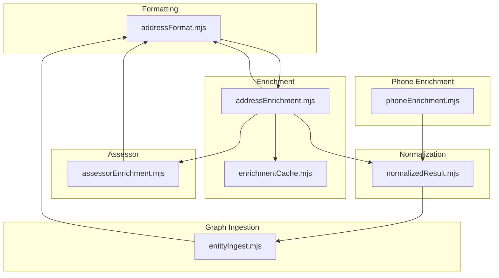
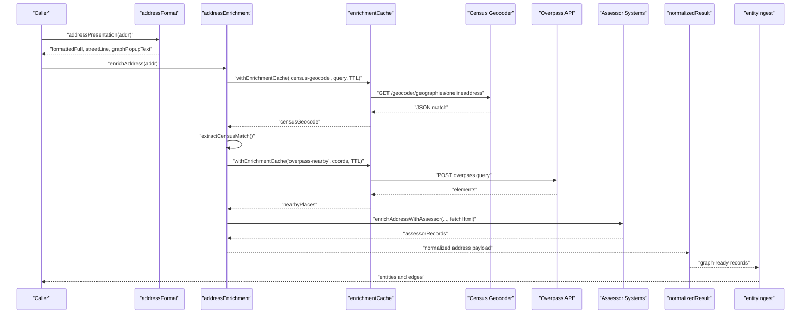
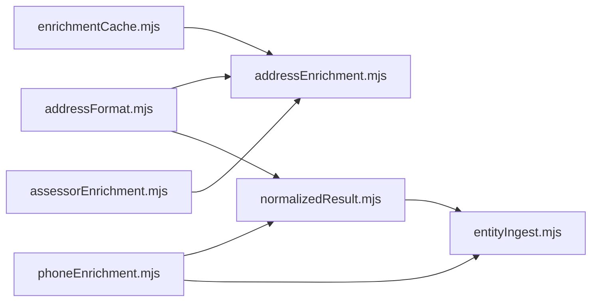

# Address Validation and Geocoding

<cite>
**Referenced Files in This Document**
- [addressFormat.mjs](file://src/addressFormat.mjs)
- [addressEnrichment.mjs](file://src/addressEnrichment.mjs)
- [assessorEnrichment.mjs](file://src/assessorEnrichment.mjs)
- [enrichmentCache.mjs](file://src/enrichmentCache.mjs)
- [normalizedResult.mjs](file://src/normalizedResult.mjs)
- [entityIngest.mjs](file://src/entityIngest.mjs)
- [phoneEnrichment.mjs](file://src/phoneEnrichment.mjs)
- [env.mjs](file://src/env.mjs)
- [enrichment.test.mjs](file://test/enrichment.test.mjs)
</cite>

## Table of Contents
1. [Introduction](#introduction)
2. [Project Structure](#project-structure)
3. [Core Components](#core-components)
4. [Architecture Overview](#architecture-overview)
5. [Detailed Component Analysis](#detailed-component-analysis)
6. [Dependency Analysis](#dependency-analysis)
7. [Performance Considerations](#performance-considerations)
8. [Troubleshooting Guide](#troubleshooting-guide)
9. [Conclusion](#conclusion)
10. [Appendices](#appendices)

## Introduction
This document explains the address validation and geocoding system used to standardize, validate, and enrich U.S. addresses. It covers:
- Address standardization and formatting
- Validation against USPS-like criteria
- Geocoding to latitude/longitude using the U.S. Census Geocoder
- ZIP code verification and formatting
- Nearby place discovery via Overpass API
- Property tax assessor enrichment
- Integration with the graph entity creation pipeline
- Practical examples and error handling guidance

The goal is to help both beginners and experienced developers implement robust address processing workflows.

## Project Structure
The address processing pipeline spans several modules:
- Formatting and presentation of addresses
- Enrichment with geocoding, nearby places, and assessor records
- Caching and rate limiting
- Normalization and graph ingestion

**Diagram sources**
- [addressFormat.mjs:1-155](file://src/addressFormat.mjs#L1-L155)
- [addressEnrichment.mjs:1-386](file://src/addressEnrichment.mjs#L1-L386)
- [enrichmentCache.mjs:1-117](file://src/enrichmentCache.mjs#L1-L117)
- [assessorEnrichment.mjs:1-835](file://src/assessorEnrichment.mjs#L1-L835)
- [normalizedResult.mjs:1-506](file://src/normalizedResult.mjs#L1-L506)
- [entityIngest.mjs:1-665](file://src/entityIngest.mjs#L1-L665)
- [phoneEnrichment.mjs:1-126](file://src/phoneEnrichment.mjs#L1-L126)

**Section sources**
- [addressFormat.mjs:1-155](file://src/addressFormat.mjs#L1-L155)
- [addressEnrichment.mjs:1-386](file://src/addressEnrichment.mjs#L1-L386)
- [enrichmentCache.mjs:1-117](file://src/enrichmentCache.mjs#L1-L117)
- [assessorEnrichment.mjs:1-835](file://src/assessorEnrichment.mjs#L1-L835)
- [normalizedResult.mjs:1-506](file://src/normalizedResult.mjs#L1-L506)
- [entityIngest.mjs:1-665](file://src/entityIngest.mjs#L1-L665)
- [phoneEnrichment.mjs:1-126](file://src/phoneEnrichment.mjs#L1-L126)

## Core Components
- addressFormat: Provides address formatting utilities, ZIP formatting, street extraction, and presentation helpers.
- addressEnrichment: Orchestrates geocoding, nearby place discovery, and integrates with assessor enrichment.
- assessorEnrichment: Queries local assessor systems (including Vision-based platforms) and returns property records.
- enrichmentCache: Provides caching and in-flight request deduplication for enrichment endpoints.
- normalizedResult: Normalizes address records and prepares payloads for graph ingestion.
- entityIngest: Creates graph entities for persons, addresses, phones, and relationships.
- phoneEnrichment: Adds phone metadata to profiles and search results.
- env: Loads environment variables for enrichment endpoints and timeouts.

**Section sources**
- [addressFormat.mjs:1-155](file://src/addressFormat.mjs#L1-L155)
- [addressEnrichment.mjs:1-386](file://src/addressEnrichment.mjs#L1-L386)
- [assessorEnrichment.mjs:1-835](file://src/assessorEnrichment.mjs#L1-L835)
- [enrichmentCache.mjs:1-117](file://src/enrichmentCache.mjs#L1-L117)
- [normalizedResult.mjs:1-506](file://src/normalizedResult.mjs#L1-L506)
- [entityIngest.mjs:1-665](file://src/entityIngest.mjs#L1-L665)
- [phoneEnrichment.mjs:1-126](file://src/phoneEnrichment.mjs#L1-L126)
- [env.mjs:1-8](file://src/env.mjs#L1-L8)

## Architecture Overview
The address enrichment pipeline follows a deterministic flow:
1. Normalize and present address fields consistently.
2. Attempt geocoding via the U.S. Census Geocoder.
3. If geocoded, query nearby places via Overpass API.
4. Optionally enrich with assessor records (local tax records).
5. Normalize the enriched payload for downstream use.
6. Ingest into the graph as entities and relationships.

**Diagram sources**
- [addressEnrichment.mjs:299-370](file://src/addressEnrichment.mjs#L299-L370)
- [addressEnrichment.mjs:308-343](file://src/addressEnrichment.mjs#L308-L343)
- [addressEnrichment.mjs:255-293](file://src/addressEnrichment.mjs#L255-L293)
- [assessorEnrichment.mjs:769-834](file://src/assessorEnrichment.mjs#L769-L834)
- [enrichmentCache.mjs:99-116](file://src/enrichmentCache.mjs#L99-L116)
- [normalizedResult.mjs:337-381](file://src/normalizedResult.mjs#L337-L381)
- [entityIngest.mjs:560-664](file://src/entityIngest.mjs#L560-L664)

## Detailed Component Analysis

### Address Formatting Module (addressFormat)
Responsibilities:
- Fix ZIP+4 spacing (e.g., “12345 6789” → “12345-6789”)
- Extract street line from label or normalized key
- Title-case formatting with state abbreviation normalization
- Produce formattedFull, streetLine, recordedRange, and graphPopupText

Key functions:
- fixZipPlusFourSpacing
- streetLineFromAddressLabel
- streetLineFromNormalizedKey
- addressPresentation

Common usage:
- Used by addressEnrichment to construct queries and display strings.
- Used by entityIngest to label address entities.

Example behaviors:
- Input label: “123 Main St, Apt 4B, Portland, ME 04101”
- Output formattedFull: “123 Main St, Apt 4B, Portland, ME 04101”
- Output streetLine: “123 Main St”

Validation rules:
- ZIP formatting enforced via fixZipPlusFourSpacing.
- Street extraction prefers label-derived head and falls back to normalized key parsing.

**Section sources**
- [addressFormat.mjs:11-155](file://src/addressFormat.mjs#L11-L155)

### Address Enrichment Module (addressEnrichment)
Responsibilities:
- Geocode addresses using the U.S. Census Geocoder
- Summarize nearby places using Overpass API
- Integrate assessor enrichment
- Apply timeouts and rate limits
- Cache results and deduplicate in-flight requests

Key functions:
- looksLikeUsAddress (validation gate)
- extractCensusMatch (standardizes Census response)
- summarizeOverpassElements (distance sorting and deduplication)
- fetchCensusGeocode
- fetchNearbyPlaces
- enrichAddress
- enrichProfilePayload

External integrations:
- Census Geocoder endpoint for onelineaddress
- Overpass API for nearby points-of-interest
- Assessor enrichment via assessorEnrichment

Configuration:
- Environment variables control TTLs, intervals, timeouts, and endpoints.

Example behaviors:
- Input addr.label: “123 Main St, Portland, ME 04101”
- Output censusGeocode: matchedAddress, coordinates, and geography
- Output nearbyPlaces: places sorted by distance within radius

Error handling:
- Graceful fallbacks when geocoding fails or returns empty results.
- Errors captured with error field and logged.

**Section sources**
- [addressEnrichment.mjs:84-87](file://src/addressEnrichment.mjs#L84-L87)
- [addressEnrichment.mjs:111-172](file://src/addressEnrichment.mjs#L111-L172)
- [addressEnrichment.mjs:213-249](file://src/addressEnrichment.mjs#L213-L249)
- [addressEnrichment.mjs:308-343](file://src/addressEnrichment.mjs#L308-L343)
- [addressEnrichment.mjs:255-293](file://src/addressEnrichment.mjs#L255-L293)
- [addressEnrichment.mjs:349-385](file://src/addressEnrichment.mjs#L349-L385)

### Assessor Enrichment Module (assessorEnrichment)
Responsibilities:
- Match addresses to configured assessor systems (state, county, city filters)
- Support generic HTML parsers and Vision platform (ASP.NET forms)
- Confidence checks to ensure returned parcel matches requested address
- Cache and deduplicate assessor record lookups

Key functions:
- configMatchesAddress
- addressTemplateValues
- fillTemplate
- enrichAddressWithAssessor
- parseVisionParcelHtml
- parseGenericAssessorHtml
- requestedAddressConfidence

Examples:
- Generic assessor: fills searchUrlTemplate with {encodedAddress}, {street}, {city}, {state}, {zip}
- Vision platform: posts to Search.aspx, extracts hidden fields, navigates to Parcel page, parses structured data

Validation:
- Confidence checks compare requested street/city to matched addresses.
- Rejects when confidence fails.

**Section sources**
- [assessorEnrichment.mjs:225-248](file://src/assessorEnrichment.mjs#L225-L248)
- [assessorEnrichment.mjs:172-193](file://src/assessorEnrichment.mjs#L172-L193)
- [assessorEnrichment.mjs:200-218](file://src/assessorEnrichment.mjs#L200-L218)
- [assessorEnrichment.mjs:769-834](file://src/assessorEnrichment.mjs#L769-L834)
- [assessorEnrichment.mjs:468-512](file://src/assessorEnrichment.mjs#L468-L512)
- [assessorEnrichment.mjs:723-762](file://src/assessorEnrichment.mjs#L723-L762)
- [assessorEnrichment.mjs:355-373](file://src/assessorEnrichment.mjs#L355-L373)

### Enrichment Cache Module (enrichmentCache)
Responsibilities:
- Hash keys and store cached results with expiration
- Enforce maximum cache size by pruning oldest entries
- Deduplicate in-flight requests for the same key

Key functions:
- withEnrichmentCache
- getEnrichmentCache
- setEnrichmentCache

Configuration:
- MAX entries and TTLs controlled by environment variables.

**Section sources**
- [enrichmentCache.mjs:6-117](file://src/enrichmentCache.mjs#L6-L117)

### Normalized Result Module (normalizedResult)
Responsibilities:
- Normalize address records for downstream consumption
- Prepare payloads for phone and profile enrichment
- Build graph rebuild items

Key functions:
- normalizeAddressRecord
- normalizePhoneSearchPayload
- normalizeProfileLookupPayload
- graphRebuildItemFromNormalized

Address normalization highlights:
- Ensures label/formatted fields, normalizedKey, periods, and enrichment fields are present and cleaned.

**Section sources**
- [normalizedResult.mjs:115-144](file://src/normalizedResult.mjs#L115-L144)
- [normalizedResult.mjs:337-381](file://src/normalizedResult.mjs#L337-L381)
- [normalizedResult.mjs:388-505](file://src/normalizedResult.mjs#L388-L505)

### Entity Ingest Module (entityIngest)
Responsibilities:
- Upsert graph entities for persons, addresses, phones, and emails
- Create edges between entities (e.g., person-at-address, person-has-phone)
- Index entity text for search

Key functions:
- ingestProfileParsed
- ingestPhoneSearchParsed
- upsertEntity
- addEdgeIfMissing

Address ingestion:
- Uses addressPresentation to label address entities.
- Creates “at_address” edges linking person to address.

**Section sources**
- [entityIngest.mjs:560-664](file://src/entityIngest.mjs#L560-L664)
- [entityIngest.mjs:470-552](file://src/entityIngest.mjs#L470-L552)

### Phone Enrichment Module (phoneEnrichment)
Responsibilities:
- Normalize US phone numbers and produce libphonenumber metadata
- Enrich profile phones during normalization

Key functions:
- normalizeUsPhoneDigits
- enrichPhoneNumber
- enrichProfilePhones

**Section sources**
- [phoneEnrichment.mjs:7-126](file://src/phoneEnrichment.mjs#L7-L126)

## Dependency Analysis
High-level dependencies:
- addressEnrichment depends on addressFormat, enrichmentCache, and assessorEnrichment.
- normalizedResult depends on addressFormat for addressPresentation.
- entityIngest depends on addressFormat for address labeling and on normalizedResult for normalized payloads.
- phoneEnrichment is used by normalizedResult and entityIngest.

**Diagram sources**
- [addressEnrichment.mjs:1-7](file://src/addressEnrichment.mjs#L1-L7)
- [normalizedResult.mjs:1-506](file://src/normalizedResult.mjs#L1-L506)
- [entityIngest.mjs:1-665](file://src/entityIngest.mjs#L1-L665)
- [phoneEnrichment.mjs:1-126](file://src/phoneEnrichment.mjs#L1-L126)

**Section sources**
- [addressEnrichment.mjs:1-7](file://src/addressEnrichment.mjs#L1-L7)
- [normalizedResult.mjs:1-506](file://src/normalizedResult.mjs#L1-L506)
- [entityIngest.mjs:1-665](file://src/entityIngest.mjs#L1-L665)
- [phoneEnrichment.mjs:1-126](file://src/phoneEnrichment.mjs#L1-L126)

## Performance Considerations
- Caching: Use withEnrichmentCache to avoid repeated calls to Census and Overpass APIs. Configure TTLs via environment variables.
- Rate limiting: Overpass requests are queued with a minimum interval to respect service limits.
- Deduplication: In-flight requests are deduplicated to prevent redundant network calls.
- Payload size: Normalize and compact address records to reduce memory and storage overhead.
- Timeout tuning: Adjust HTTP timeouts for Census and assessor endpoints to balance reliability and latency.

[No sources needed since this section provides general guidance]

## Troubleshooting Guide
Common issues and resolutions:
- Invalid address format
  - Symptom: Census geocoder returns no match.
  - Resolution: Ensure label or normalizedKey contains state and ZIP. Use addressPresentation to standardize formatting.
  - Reference: [addressEnrichment.mjs:308-343](file://src/addressEnrichment.mjs#L308-L343), [addressFormat.mjs:11-155](file://src/addressFormat.mjs#L11-L155)

- ZIP formatting errors
  - Symptom: ZIP appears as “12345 6789” instead of “12345-6789”.
  - Resolution: Use fixZipPlusFourSpacing to normalize spacing.
  - Reference: [addressFormat.mjs:11-13](file://src/addressFormat.mjs#L11-L13)

- Overpass throttling or rate limits
  - Symptom: Requests delayed or blocked.
  - Resolution: Increase OVERPASS_MIN_INTERVAL_MS and adjust radius/limit.
  - Reference: [addressEnrichment.mjs:255-293](file://src/addressEnrichment.mjs#L255-L293)

- Assessor confidence mismatch
  - Symptom: Status “no_match” despite valid search results.
  - Resolution: Verify requested address normalization and ensure street/city match expectations.
  - Reference: [assessorEnrichment.mjs:355-373](file://src/assessorEnrichment.mjs#L355-L373)

- Cache growth or stale data
  - Symptom: Slow lookups or excessive disk usage.
  - Resolution: Tune ENRICHMENT_CACHE_MAX and TTLs; prune expired entries periodically.
  - Reference: [enrichmentCache.mjs:20-41](file://src/enrichmentCache.mjs#L20-L41), [enrichmentCache.mjs:76-89](file://src/enrichmentCache.mjs#L76-L89)

**Section sources**
- [addressEnrichment.mjs:308-343](file://src/addressEnrichment.mjs#L308-L343)
- [addressFormat.mjs:11-13](file://src/addressFormat.mjs#L11-L13)
- [addressEnrichment.mjs:255-293](file://src/addressEnrichment.mjs#L255-L293)
- [assessorEnrichment.mjs:355-373](file://src/assessorEnrichment.mjs#L355-L373)
- [enrichmentCache.mjs:20-41](file://src/enrichmentCache.mjs#L20-L41)
- [enrichmentCache.mjs:76-89](file://src/enrichmentCache.mjs#L76-L89)

## Conclusion
The address validation and geocoding system provides a robust, extensible pipeline:
- Standardizes and validates addresses
- Geocodes to precise coordinates
- Discovers nearby places
- Enriches with assessor records
- Normalizes and ingests into the graph

By leveraging caching, rate limiting, and confidence checks, the system balances performance and accuracy. Developers can extend it by adding new assessor configurations and integrating additional mapping APIs.

[No sources needed since this section summarizes without analyzing specific files]

## Appendices

### Example Workflows

#### Address Standardization and Presentation
- Input: label or normalizedKey with inconsistent formatting
- Steps:
  - Use addressPresentation to compute formattedFull, streetLine, and graphPopupText
- Output: Consistent, title-cased address string suitable for display and queries

**Section sources**
- [addressFormat.mjs:123-154](file://src/addressFormat.mjs#L123-L154)

#### Geocoding Workflow
- Input: address object with label or normalizedKey
- Steps:
  - addressPresentation to build query
  - looksLikeUsAddress to gate request
  - withEnrichmentCache to fetch from Census Geocoder
  - extractCensusMatch to normalize response
- Output: censusGeocode with matchedAddress, coordinates, and geography

**Section sources**
- [addressEnrichment.mjs:299-343](file://src/addressEnrichment.mjs#L299-L343)
- [addressEnrichment.mjs:111-172](file://src/addressEnrichment.mjs#L111-L172)

#### Nearby Places Discovery
- Input: coordinates from censusGeocode
- Steps:
  - withEnrichmentCache to query Overpass API
  - summarizeOverpassElements to sort and deduplicate
- Output: nearbyPlaces with places, distances, and categories

**Section sources**
- [addressEnrichment.mjs:255-293](file://src/addressEnrichment.mjs#L255-L293)
- [addressEnrichment.mjs:213-249](file://src/addressEnrichment.mjs#L213-L249)

#### Assessor Enrichment
- Input: address with censusGeocode
- Steps:
  - configMatchesAddress to select applicable configs
  - fillTemplate or Vision flow to search and parse
  - requestedAddressConfidence to validate match
- Output: assessorRecords with owner names, parcel IDs, values, and metadata

**Section sources**
- [assessorEnrichment.mjs:225-248](file://src/assessorEnrichment.mjs#L225-L248)
- [assessorEnrichment.mjs:200-218](file://src/assessorEnrichment.mjs#L200-L218)
- [assessorEnrichment.mjs:355-373](file://src/assessorEnrichment.mjs#L355-L373)

#### Profile Enrichment and Graph Creation
- Input: profile payload with addresses
- Steps:
  - enrichProfilePhones to add phone metadata
  - enrichAddress for each address
  - normalizeProfileLookupPayload to standardize
  - ingestProfileParsed to create entities and edges
- Output: graph-ready entities and relationships

**Section sources**
- [addressEnrichment.mjs:376-385](file://src/addressEnrichment.mjs#L376-L385)
- [normalizedResult.mjs:337-381](file://src/normalizedResult.mjs#L337-L381)
- [entityIngest.mjs:560-664](file://src/entityIngest.mjs#L560-L664)

### Validation Rules and Accuracy Notes
- ZIP code verification
  - Enforced via fixZipPlusFourSpacing and presence checks in looksLikeUsAddress.
- State and ZIP presence
  - Required for geocoding eligibility.
- Geocoding accuracy
  - Census Geocoder provides standardized address and coordinates; accuracy depends on input quality.
- Nearby places
  - Distance-based sorting ensures closest features appear first; radius and limit configurable.
- Assessor confidence
  - Rejects mismatches to avoid false positives.

**Section sources**
- [addressFormat.mjs:11-13](file://src/addressFormat.mjs#L11-L13)
- [addressEnrichment.mjs:84-87](file://src/addressEnrichment.mjs#L84-L87)
- [addressEnrichment.mjs:213-249](file://src/addressEnrichment.mjs#L213-L249)
- [assessorEnrichment.mjs:355-373](file://src/assessorEnrichment.mjs#L355-L373)

### Concrete Examples (from tests)
- Census match extraction produces stable fields (matchedAddress, coordinates, geography).
- Overpass summarization sorts by distance and trims to limit.
- Assessor templates fill with encoded address components.
- Vision platform posts to ASP.NET forms and parses structured data.

**Section sources**
- [enrichment.test.mjs:27-59](file://test/enrichment.test.mjs#L27-L59)
- [enrichment.test.mjs:61-76](file://test/enrichment.test.mjs#L61-L76)
- [enrichment.test.mjs:78-133](file://test/enrichment.test.mjs#L78-L133)
- [enrichment.test.mjs:135-236](file://test/enrichment.test.mjs#L135-L236)
- [enrichment.test.mjs:238-322](file://test/enrichment.test.mjs#L238-L322)