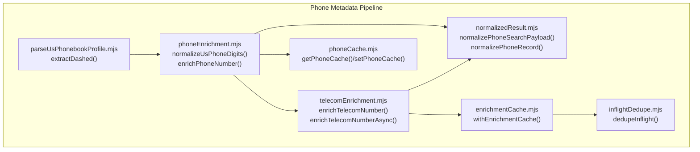
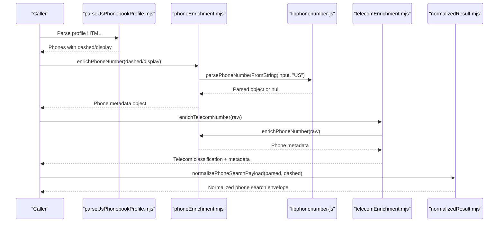
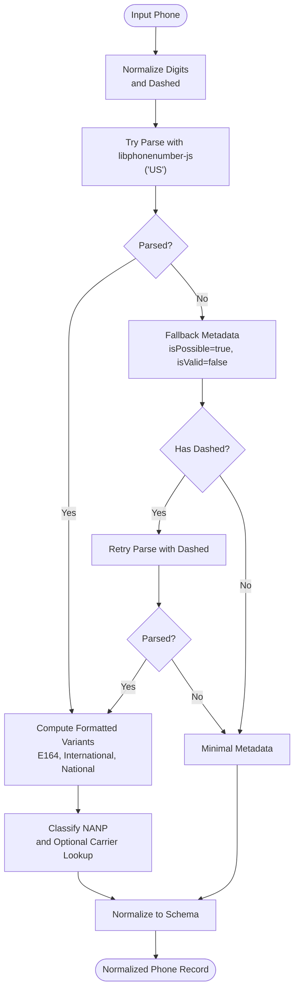
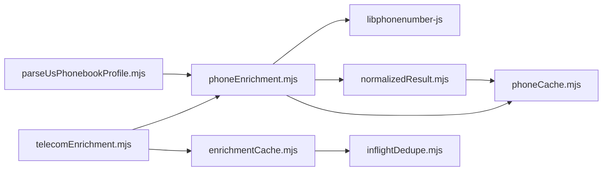

# Phone Metadata Extraction

<cite>
**Referenced Files in This Document**
- [phoneEnrichment.mjs](file://src/phoneEnrichment.mjs)
- [telecomEnrichment.mjs](file://src/telecomEnrichment.mjs)
- [parseUsPhonebookProfile.mjs](file://src/parseUsPhonebookProfile.mjs)
- [normalizedResult.mjs](file://src/normalizedResult.mjs)
- [phoneCache.mjs](file://src/phoneCache.mjs)
- [enrichmentCache.mjs](file://src/enrichmentCache.mjs)
- [inflightDedupe.mjs](file://src/inflightDedupe.mjs)
- [enrichment.test.mjs](file://test/enrichment.test.mjs)
</cite>

## Table of Contents
1. [Introduction](#introduction)
2. [Project Structure](#project-structure)
3. [Core Components](#core-components)
4. [Architecture Overview](#architecture-overview)
5. [Detailed Component Analysis](#detailed-component-analysis)
6. [Dependency Analysis](#dependency-analysis)
7. [Performance Considerations](#performance-considerations)
8. [Troubleshooting Guide](#troubleshooting-guide)
9. [Conclusion](#conclusion)

## Introduction
This document explains the phone metadata extraction module used to normalize, parse, and enrich phone numbers across the US phonebook pipeline. It focuses on:
- Digit extraction and normalization for US phone numbers
- Parsing with libphonenumber-js for validation and formatting
- Enrichment workflows for phone search results and profile enrichment
- Concrete examples of input variations, normalization outputs, and parsed phone object structures
- Integration with caching and deduplication systems
- Common formats, validation rules, and edge cases

## Project Structure
The phone metadata extraction lives primarily in the phoneEnrichment module and integrates with:
- Telecom enrichment for NANP classification and carrier lookup
- Profile parsing for extracting phone numbers from HTML
- Normalization of results into a unified schema
- Caching layers for performance and reliability

**Diagram sources**
- [phoneEnrichment.mjs:1-126](file://src/phoneEnrichment.mjs#L1-L126)
- [telecomEnrichment.mjs:1-179](file://src/telecomEnrichment.mjs#L1-L179)
- [parseUsPhonebookProfile.mjs:46-56](file://src/parseUsPhonebookProfile.mjs#L46-L56)
- [normalizedResult.mjs:88-109](file://src/normalizedResult.mjs#L88-L109)
- [phoneCache.mjs:44-99](file://src/phoneCache.mjs#L44-L99)
- [enrichmentCache.mjs:99-116](file://src/enrichmentCache.mjs#L99-L116)
- [inflightDedupe.mjs:11-23](file://src/inflightDedupe.mjs#L11-L23)

**Section sources**
- [phoneEnrichment.mjs:1-126](file://src/phoneEnrichment.mjs#L1-L126)
- [telecomEnrichment.mjs:1-179](file://src/telecomEnrichment.mjs#L1-L179)
- [parseUsPhonebookProfile.mjs:46-56](file://src/parseUsPhonebookProfile.mjs#L46-L56)
- [normalizedResult.mjs:88-109](file://src/normalizedResult.mjs#L88-L109)
- [phoneCache.mjs:1-161](file://src/phoneCache.mjs#L1-L161)
- [enrichmentCache.mjs:1-117](file://src/enrichmentCache.mjs#L1-L117)
- [inflightDedupe.mjs:1-24](file://src/inflightDedupe.mjs#L1-L24)

## Core Components
- normalizeUsPhoneDigits: Extracts digits and produces a dashed 10-digit format for US numbers; handles 11-digit numbers starting with “1”.
- enrichPhoneNumber: Normalizes input, attempts parsing with libphonenumber-js, and returns a structured metadata object with E164, international, national, and validation flags.
- enrichPhoneSearchParsedResult: Attaches phone metadata to a parsed phone search result.
- enrichProfilePhones: Enriches phone entries in a profile payload with metadata.
- enrichTelecomNumber: Performs synchronous telecom classification (NANP) and integrates phone metadata.
- enrichTelecomNumberAsync: Asynchronous enrichment including carrier/rate-center lookup via Local Calling Guide.
- extractDashed: Extracts a dashed 10-digit format from raw phone text during profile parsing.
- normalizePhoneRecord: Normalizes phone entries into the unified schema for downstream consumers.

**Section sources**
- [phoneEnrichment.mjs:7-96](file://src/phoneEnrichment.mjs#L7-L96)
- [phoneEnrichment.mjs:103-125](file://src/phoneEnrichment.mjs#L103-L125)
- [telecomEnrichment.mjs:146-178](file://src/telecomEnrichment.mjs#L146-L178)
- [parseUsPhonebookProfile.mjs:46-56](file://src/parseUsPhonebookProfile.mjs#L46-L56)
- [normalizedResult.mjs:88-109](file://src/normalizedResult.mjs#L88-L109)

## Architecture Overview
The phone metadata pipeline follows a layered approach:
- Input normalization: Clean and standardize raw phone strings to digits and dashed format.
- Parsing and validation: Use libphonenumber-js to validate and format the number.
- Enrichment: Add telecom classification and optional carrier/rate-center data.
- Schema normalization: Convert enriched data into a stable, normalized structure for downstream use.
- Caching and concurrency: Cache results and deduplicate concurrent requests.

**Diagram sources**
- [parseUsPhonebookProfile.mjs:328-348](file://src/parseUsPhonebookProfile.mjs#L328-L348)
- [phoneEnrichment.mjs:29-96](file://src/phoneEnrichment.mjs#L29-L96)
- [telecomEnrichment.mjs:146-178](file://src/telecomEnrichment.mjs#L146-L178)
- [normalizedResult.mjs:167-244](file://src/normalizedResult.mjs#L167-L244)

## Detailed Component Analysis

### normalizeUsPhoneDigits
Purpose:
- Extract digits from raw input and produce a standardized 10-digit string.
- If input is 11 digits starting with “1”, drop the leading “1”.
- Produce a dashed format for US numbers when applicable.

Behavior:
- Input trimming and digit-only extraction.
- Length checks for 11-digit numbers starting with “1” and 10-digit numbers.
- Returns an object with digits and dashed representation.

Edge cases:
- Null/undefined inputs produce empty digits and dashed null.
- Non-US-like inputs return digits and dashed null.

Example outcomes:
- Input “+1 (207) 242-0526” -> digits “2072420526”, dashed “207-242-0526”
- Input “2072420526” -> digits “2072420526”, dashed “207-242-0526”
- Input “12345678901” -> digits “2345678901”, dashed null (leading “1” dropped)

Validation:
- Validates US-like digit sequences and produces a dashed format suitable for parsing.

**Section sources**
- [phoneEnrichment.mjs:7-23](file://src/phoneEnrichment.mjs#L7-L23)

### enrichPhoneNumber
Purpose:
- Normalize input, attempt parsing with libphonenumber-js, and return a comprehensive metadata object.

Processing logic:
- Trim input; return null for empty input.
- Normalize digits and dashed format.
- Attempt parsing with libphonenumber-js using “US” region.
- If initial parse fails and dashed exists, retry with dashed input.
- If still failing and no dashed, return a minimal metadata object with isPossible=false and isValid=false.
- If parsing succeeds, compute formatted variants (E164, international, national) and derive type.

Metadata fields:
- input, digits, dashed, e164, international, national, country, countryCallingCode, nationalNumber, isPossible, isValid, type.

Validation rules:
- Uses libphonenumber-js to determine validity and possibility.
- Type detection is lowercased; errors in type detection are caught and treated as null.

Examples:
- Input “207-242-0526” -> country “US”, dashed “207-242-0526”, e164 “+12072420526”, isValid true, isPossible true, type “mobile” or “landline”.

Edge cases:
- Non-parseable inputs without dashed -> isPossible true, isValid false, type null.
- Parsing exceptions -> fallback to minimal metadata.

**Section sources**
- [phoneEnrichment.mjs:29-96](file://src/phoneEnrichment.mjs#L29-L96)

### enrichPhoneSearchParsedResult
Purpose:
- Attach phone metadata to a parsed phone search result for downstream normalization.

Behavior:
- Spreads the parsed object and adds lookupPhoneMetadata by enriching the dashed phone.

Integration:
- Used by normalizedResult to attach metadata to phone search envelopes.

**Section sources**
- [phoneEnrichment.mjs:103-108](file://src/phoneEnrichment.mjs#L103-L108)
- [normalizedResult.mjs:167-179](file://src/normalizedResult.mjs#L167-L179)

### enrichProfilePhones
Purpose:
- Enrich phone entries in a profile payload with metadata derived from either existing phoneMetadata or by parsing dashed/display fields.

Behavior:
- Ensures phones is an array; enriches each phone with phoneMetadata.
- Uses dashed or display to derive metadata when missing.

Integration:
- Called by normalizedResult.normalizeProfileLookupPayload to prepare normalized profiles.

**Section sources**
- [phoneEnrichment.mjs:114-125](file://src/phoneEnrichment.mjs#L114-L125)
- [normalizedResult.mjs:348-484](file://src/normalizedResult.mjs#L348-L484)

### extractDashed
Purpose:
- Extract a dashed 10-digit phone format from raw phone text during profile parsing.

Behavior:
- Extract digits, require 10 digits, return dashed format if valid.

Integration:
- Used by parseUsPhonebookProfile to populate phones with dashed and display fields.

**Section sources**
- [parseUsPhonebookProfile.mjs:46-56](file://src/parseUsPhonebookProfile.mjs#L46-L56)

### normalizePhoneRecord
Purpose:
- Normalize individual phone records into the unified schema for downstream consumers.

Behavior:
- Cleans dashed and display fields.
- Pulls e164, type, and country from phoneMetadata.
- Flags isCurrent and isPrimary; preserves lineType or falls back to metadata type.

Integration:
- Used by normalizedResult to produce normalized phone lists.

**Section sources**
- [normalizedResult.mjs:88-109](file://src/normalizedResult.mjs#L88-L109)

### enrichTelecomNumber and enrichTelecomNumberAsync
Purpose:
- Perform telecom classification (NANP) and optional carrier/rate-center enrichment.

Behavior:
- Calls enrichPhoneNumber for metadata.
- Classifies NANP by area code/exchange categories (toll-free, premium, N11 services, etc.).
- enrichTelecomNumberAsync additionally fetches carrier/rate-center data from Local Calling Guide with caching and deduplication.

Integration:
- Used by higher-level flows to augment phone metadata with telecom insights.

**Section sources**
- [telecomEnrichment.mjs:146-178](file://src/telecomEnrichment.mjs#L146-L178)

### Phone Enrichment Workflow
High-level steps:
1. Extract or receive a phone string (raw, dashed, or display).
2. Normalize digits and dashed format.
3. Attempt parsing with libphonenumber-js using region “US”.
4. If parsing fails and dashed exists, retry with dashed.
5. Build metadata object with formatted variants and validation flags.
6. Optionally enrich with telecom classification and carrier data.
7. Normalize into the unified schema for downstream use.

**Diagram sources**
- [phoneEnrichment.mjs:29-96](file://src/phoneEnrichment.mjs#L29-L96)
- [telecomEnrichment.mjs:146-178](file://src/telecomEnrichment.mjs#L146-L178)
- [normalizedResult.mjs:88-109](file://src/normalizedResult.mjs#L88-L109)

## Dependency Analysis
Key dependencies and relationships:
- phoneEnrichment depends on libphonenumber-js for parsing and validation.
- telecomEnrichment depends on phoneEnrichment for metadata and uses enrichmentCache for carrier/rate-center lookups.
- parseUsPhonebookProfile uses extractDashed to prepare phone entries for enrichment.
- normalizedResult consumes phone metadata to build normalized envelopes for phone search and profile lookup.
- phoneCache and enrichmentCache provide persistent caching; inflightDedupe prevents redundant work.

**Diagram sources**
- [phoneEnrichment.mjs:1-126](file://src/phoneEnrichment.mjs#L1-L126)
- [telecomEnrichment.mjs:1-179](file://src/telecomEnrichment.mjs#L1-L179)
- [parseUsPhonebookProfile.mjs:46-56](file://src/parseUsPhonebookProfile.mjs#L46-L56)
- [normalizedResult.mjs:167-244](file://src/normalizedResult.mjs#L167-L244)
- [phoneCache.mjs:44-99](file://src/phoneCache.mjs#L44-L99)
- [enrichmentCache.mjs:99-116](file://src/enrichmentCache.mjs#L99-L116)
- [inflightDedupe.mjs:11-23](file://src/inflightDedupe.mjs#L11-L23)

**Section sources**
- [phoneEnrichment.mjs:1-126](file://src/phoneEnrichment.mjs#L1-L126)
- [telecomEnrichment.mjs:1-179](file://src/telecomEnrichment.mjs#L1-L179)
- [parseUsPhonebookProfile.mjs:46-56](file://src/parseUsPhonebookProfile.mjs#L46-L56)
- [normalizedResult.mjs:167-244](file://src/normalizedResult.mjs#L167-L244)
- [phoneCache.mjs:1-161](file://src/phoneCache.mjs#L1-L161)
- [enrichmentCache.mjs:1-117](file://src/enrichmentCache.mjs#L1-L117)
- [inflightDedupe.mjs:1-24](file://src/inflightDedupe.mjs#L1-L24)

## Performance Considerations
- Caching:
  - phoneCache stores normalized phone metadata keyed by dashed format with TTL and max entries.
  - enrichmentCache stores arbitrary enrichment results with namespace-based keys and TTL.
- Deduplication:
  - inflightDedupe ensures only one concurrent fetch per key, reducing redundant network calls.
- Classification:
  - enrichTelecomNumber performs synchronous classification; enrichTelecomNumberAsync adds asynchronous carrier/rate-center lookup with caching.
- Memory and storage:
  - TTL pruning and max-entry enforcement keep caches bounded.

Best practices:
- Prefer dashed format for caching keys to reduce ambiguity.
- Use enrichTelecomNumberAsync when carrier data is needed; otherwise use enrichTelecomNumber for speed.
- Leverage normalizedResult to minimize downstream transformations.

**Section sources**
- [phoneCache.mjs:44-99](file://src/phoneCache.mjs#L44-L99)
- [enrichmentCache.mjs:99-116](file://src/enrichmentCache.mjs#L99-L116)
- [inflightDedupe.mjs:11-23](file://src/inflightDedupe.mjs#L11-L23)
- [telecomEnrichment.mjs:79-86](file://src/telecomEnrichment.mjs#L79-L86)

## Troubleshooting Guide
Common issues and resolutions:
- Empty or invalid input:
  - normalizeUsPhoneDigits returns digits and dashed null for empty inputs.
  - enrichPhoneNumber returns minimal metadata with isPossible=true and isValid=false when parsing fails and no dashed is present.
- Parsing failures:
  - If initial parse fails, the function retries with dashed format if available.
  - If both fail, it returns a minimal metadata object indicating not valid.
- Type detection errors:
  - enrichPhoneNumber catches exceptions when retrieving type and treats it as null.
- Telecom classification anomalies:
  - NANP special prefixes (e.g., toll-free) and N11 services are categorized accordingly; ensure area code/exchange are valid 10-digit digits.

Validation references:
- Tests demonstrate expected behavior for normalizeUsPhoneDigits and enrichPhoneNumber, including E164 and international formatting.

**Section sources**
- [phoneEnrichment.mjs:29-96](file://src/phoneEnrichment.mjs#L29-L96)
- [enrichment.test.mjs:7-25](file://test/enrichment.test.mjs#L7-L25)

## Conclusion
The phone metadata extraction module provides robust normalization, parsing, and enrichment for US phone numbers. It standardizes inputs, validates and formats numbers using libphonenumber-js, classifies NANP numbers, and integrates seamlessly with caching and deduplication systems. The normalized schema ensures consistent downstream processing for phone search results and profile enrichment.