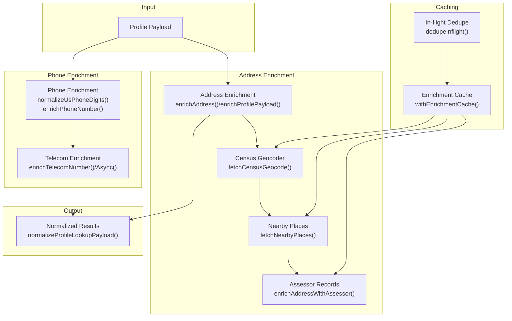
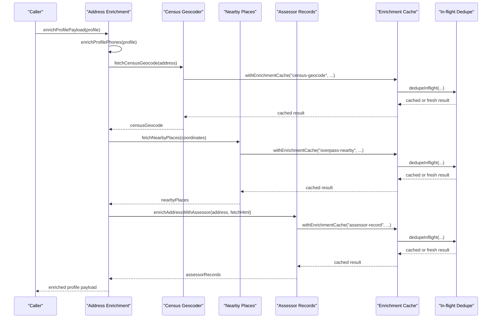
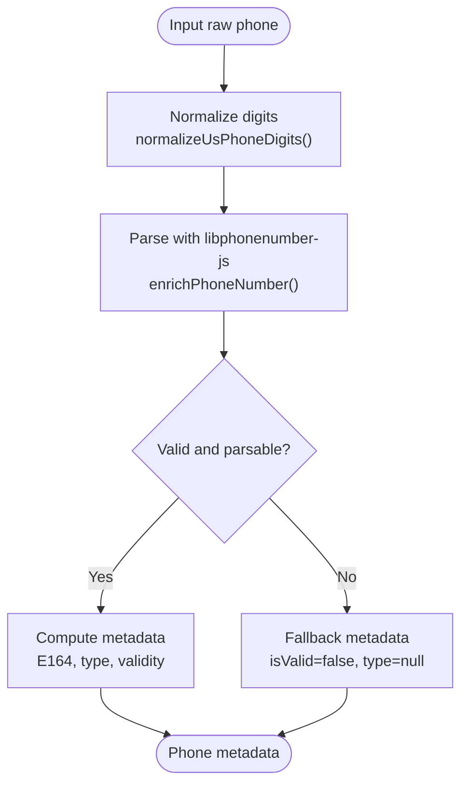
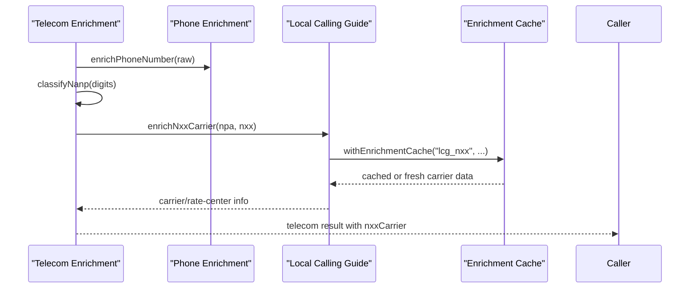
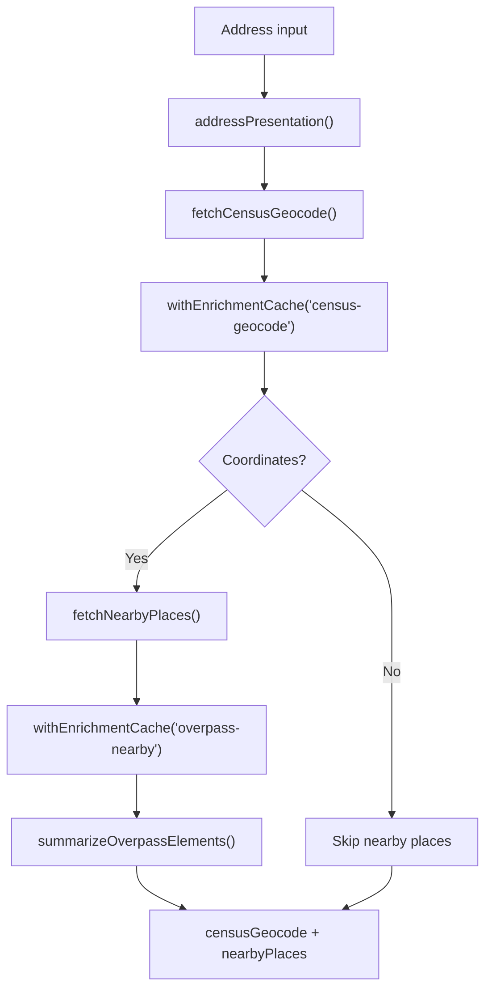
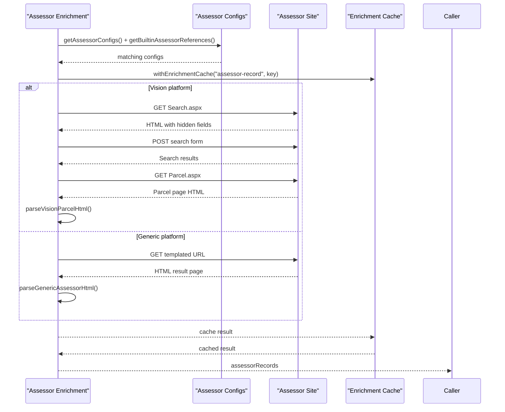
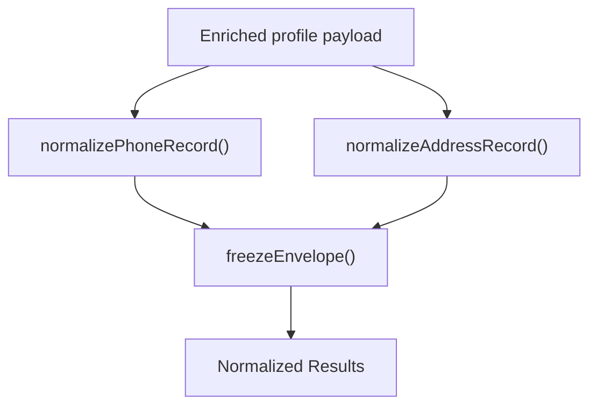
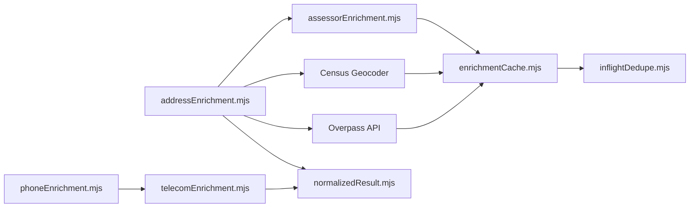

# Profile Enrichment

<cite>
**Referenced Files in This Document**
- [addressEnrichment.mjs](file://src/addressEnrichment.mjs)
- [phoneEnrichment.mjs](file://src/phoneEnrichment.mjs)
- [telecomEnrichment.mjs](file://src/telecomEnrichment.mjs)
- [assessorEnrichment.mjs](file://src/assessorEnrichment.mjs)
- [enrichmentCache.mjs](file://src/enrichmentCache.mjs)
- [inflightDedupe.mjs](file://src/inflightDedupe.mjs)
- [normalizedResult.mjs](file://src/normalizedResult.mjs)
- [addressFormat.mjs](file://src/addressFormat.mjs)
- [db.mjs](file://src/db/db.mjs)
- [sourceCatalog.mjs](file://src/sourceCatalog.mjs)
- [maine-assessor-integration.md](file://docs/maine-assessor-integration.md)
- [osint-enrichment-roadmap.md](file://docs/osint-enrichment-roadmap.md)
- [enrichment.test.mjs](file://test/enrichment.test.mjs)
</cite>

## Table of Contents
1. [Introduction](#introduction)
2. [Project Structure](#project-structure)
3. [Core Components](#core-components)
4. [Architecture Overview](#architecture-overview)
5. [Detailed Component Analysis](#detailed-component-analysis)
6. [Dependency Analysis](#dependency-analysis)
7. [Performance Considerations](#performance-considerations)
8. [Troubleshooting Guide](#troubleshooting-guide)
9. [Conclusion](#conclusion)
10. [Appendices](#appendices)

## Introduction
This document explains the profile enrichment pipeline that transforms raw person records into comprehensive, normalized profiles by combining multi-source data. The pipeline focuses on:
- Phone metadata extraction and normalization
- Address validation and geocoding
- Geospatial context via nearby points of interest
- Telecom analysis for carrier and line-type detection
- Assessor integration for property ownership and tax data

It covers both conceptual overviews for beginners and technical details for developers, including API integrations, caching strategies (“enrichment cache”), and result consolidation into normalized results.

## Project Structure
The enrichment system is modular and layered:
- Phone enrichment normalizes phone numbers and augments them with telecom metadata.
- Address enrichment validates and geocodes addresses, finds nearby places, and integrates assessor records.
- Assessor enrichment discovers and parses property records from configurable sources or built-in references.
- Caching ensures efficient reuse of expensive lookups (“enrichment cache”).
- Normalization consolidates heterogeneous results into a stable schema (“normalized results”).

**Diagram sources**
- [addressEnrichment.mjs:349-385](file://src/addressEnrichment.mjs#L349-L385)
- [phoneEnrichment.mjs:114-126](file://src/phoneEnrichment.mjs#L114-L126)
- [telecomEnrichment.mjs:146-179](file://src/telecomEnrichment.mjs#L146-L179)
- [assessorEnrichment.mjs:769-800](file://src/assessorEnrichment.mjs#L769-L800)
- [enrichmentCache.mjs:99-116](file://src/enrichmentCache.mjs#L99-L116)
- [inflightDedupe.mjs:11-23](file://src/inflightDedupe.mjs#L11-L23)
- [normalizedResult.mjs:337-381](file://src/normalizedResult.mjs#L337-L381)

**Section sources**
- [addressEnrichment.mjs:349-385](file://src/addressEnrichment.mjs#L349-L385)
- [phoneEnrichment.mjs:114-126](file://src/phoneEnrichment.mjs#L114-L126)
- [telecomEnrichment.mjs:146-179](file://src/telecomEnrichment.mjs#L146-L179)
- [assessorEnrichment.mjs:769-800](file://src/assessorEnrichment.mjs#L769-L800)
- [enrichmentCache.mjs:99-116](file://src/enrichmentCache.mjs#L99-L116)
- [inflightDedupe.mjs:11-23](file://src/inflightDedupe.mjs#L11-L23)
- [normalizedResult.mjs:337-381](file://src/normalizedResult.mjs#L337-L381)

## Core Components
- Phone enrichment: Normalizes phone numbers and computes metadata (e.g., E164, type). Telecom enrichment adds carrier/rate-center data for non-special NANP prefixes.
- Address enrichment: Validates and geocodes addresses, derives nearby places, and integrates assessor records.
- Assessor enrichment: Uses configured sources or built-in references to find property records and extract ownership and valuation fields.
- Caching: Centralized “enrichment cache” with in-flight deduplication prevents redundant network calls.
- Normalization: Consolidates and compacts results into a stable schema (“normalized results”) suitable for graph ingestion.

**Section sources**
- [phoneEnrichment.mjs:7-96](file://src/phoneEnrichment.mjs#L7-L96)
- [telecomEnrichment.mjs:146-179](file://src/telecomEnrichment.mjs#L146-L179)
- [addressEnrichment.mjs:349-385](file://src/addressEnrichment.mjs#L349-L385)
- [assessorEnrichment.mjs:769-800](file://src/assessorEnrichment.mjs#L769-L800)
- [enrichmentCache.mjs:99-116](file://src/enrichmentCache.mjs#L99-L116)
- [normalizedResult.mjs:337-381](file://src/normalizedResult.mjs#L337-L381)

## Architecture Overview
The enrichment pipeline orchestrates multiple modules and caches to produce consolidated, normalized results. It respects TTLs, deduplicates concurrent requests, and preserves provenance for traceability.

**Diagram sources**
- [addressEnrichment.mjs:376-385](file://src/addressEnrichment.mjs#L376-L385)
- [addressEnrichment.mjs:308-343](file://src/addressEnrichment.mjs#L308-L343)
- [addressEnrichment.mjs:255-293](file://src/addressEnrichment.mjs#L255-L293)
- [assessorEnrichment.mjs:769-800](file://src/assessorEnrichment.mjs#L769-L800)
- [enrichmentCache.mjs:99-116](file://src/enrichmentCache.mjs#L99-L116)
- [inflightDedupe.mjs:11-23](file://src/inflightDedupe.mjs#L11-L23)

## Detailed Component Analysis

### Phone Metadata Extraction and Normalization
- Purpose: Normalize raw phone inputs and compute standardized metadata (e.g., E164, national format, validity).
- Implementation highlights:
  - Digit normalization and dashed formatting for US numbers.
  - Parsing with libphonenumber-js and fallbacks for dashed variants.
  - Type inference and flags for validity/possibility.
- Usage: Applied to profile phones during enrichment and also used by telecom enrichment to derive NANP categories.

**Diagram sources**
- [phoneEnrichment.mjs:7-96](file://src/phoneEnrichment.mjs#L7-L96)

**Section sources**
- [phoneEnrichment.mjs:7-96](file://src/phoneEnrichment.mjs#L7-L96)

### Telecom Analysis for Carrier and Line Type Detection
- Purpose: Determine NANP categories (geographic, toll-free, premium, N11 services) and augment with carrier/rate-center data when applicable.
- Implementation highlights:
  - NANP classification from normalized digits.
  - Optional carrier lookup via Local Calling Guide for non-special prefixes.
  - Asynchronous enrichment with caching for NXX lookups.

**Diagram sources**
- [telecomEnrichment.mjs:146-179](file://src/telecomEnrichment.mjs#L146-L179)
- [telecomEnrichment.mjs:79-86](file://src/telecomEnrichment.mjs#L79-L86)
- [enrichmentCache.mjs:99-116](file://src/enrichmentCache.mjs#L99-L116)

**Section sources**
- [telecomEnrichment.mjs:146-179](file://src/telecomEnrichment.mjs#L146-L179)
- [telecomEnrichment.mjs:79-86](file://src/telecomEnrichment.mjs#L79-L86)
- [enrichmentCache.mjs:99-116](file://src/enrichmentCache.mjs#L99-L116)

### Address Validation, Geocoding, and Nearby Places
- Purpose: Convert addresses into validated coordinates and derive nearby POIs for contextual insights.
- Implementation highlights:
  - Census Geocoder integration with benchmark/vintage selection and TTL-based caching.
  - Overpass API queries with rate limiting and central queuing; summarized results with distance sorting.
  - Address presentation utilities for consistent formatting.

**Diagram sources**
- [addressEnrichment.mjs:308-343](file://src/addressEnrichment.mjs#L308-L343)
- [addressEnrichment.mjs:255-293](file://src/addressEnrichment.mjs#L255-L293)
- [addressEnrichment.mjs:213-249](file://src/addressEnrichment.mjs#L213-L249)
- [addressFormat.mjs:123-154](file://src/addressFormat.mjs#L123-L154)
- [enrichmentCache.mjs:99-116](file://src/enrichmentCache.mjs#L99-L116)

**Section sources**
- [addressEnrichment.mjs:308-343](file://src/addressEnrichment.mjs#L308-L343)
- [addressEnrichment.mjs:255-293](file://src/addressEnrichment.mjs#L255-L293)
- [addressEnrichment.mjs:213-249](file://src/addressEnrichment.mjs#L213-L249)
- [addressFormat.mjs:123-154](file://src/addressFormat.mjs#L123-L154)
- [enrichmentCache.mjs:99-116](file://src/enrichmentCache.mjs#L99-L116)

### Assessor Integration for Property Ownership Data
- Purpose: Retrieve property ownership and valuation data for US addresses, especially in jurisdictions with online assessors.
- Implementation highlights:
  - Configurable assessor sources with state/county/city matching and templated URLs.
  - Built-in references for Maine counties and state resources.
  - Generic HTML extraction and Vision platform support (form submission, hidden fields, table parsing).
  - Address confidence checks to avoid mismatches.
  - Caching keyed by address and platform to reduce repeated fetches.

**Diagram sources**
- [assessorEnrichment.mjs:120-166](file://src/assessorEnrichment.mjs#L120-L166)
- [assessorEnrichment.mjs:67-115](file://src/assessorEnrichment.mjs#L67-L115)
- [assessorEnrichment.mjs:588-685](file://src/assessorEnrichment.mjs#L588-L685)
- [assessorEnrichment.mjs:723-762](file://src/assessorEnrichment.mjs#L723-L762)
- [assessorEnrichment.mjs:769-800](file://src/assessorEnrichment.mjs#L769-L800)
- [enrichmentCache.mjs:99-116](file://src/enrichmentCache.mjs#L99-L116)

**Section sources**
- [assessorEnrichment.mjs:120-166](file://src/assessorEnrichment.mjs#L120-L166)
- [assessorEnrichment.mjs:67-115](file://src/assessorEnrichment.mjs#L67-L115)
- [assessorEnrichment.mjs:588-685](file://src/assessorEnrichment.mjs#L588-L685)
- [assessorEnrichment.mjs:723-762](file://src/assessorEnrichment.mjs#L723-L762)
- [assessorEnrichment.mjs:769-800](file://src/assessorEnrichment.mjs#L769-L800)
- [maine-assessor-integration.md:1-155](file://docs/maine-assessor-integration.md#L1-L155)

### Result Consolidation into Normalized Results
- Purpose: Produce a stable, compact schema (“normalized results”) suitable for graph ingestion and downstream analysis.
- Implementation highlights:
  - Compaction of null/empty fields and arrays.
  - Normalization of phones, addresses, and relative references.
  - Freezing envelope with schema version and metadata.

**Diagram sources**
- [normalizedResult.mjs:88-144](file://src/normalizedResult.mjs#L88-L144)
- [normalizedResult.mjs:150-160](file://src/normalizedResult.mjs#L150-L160)
- [normalizedResult.mjs:337-381](file://src/normalizedResult.mjs#L337-L381)

**Section sources**
- [normalizedResult.mjs:88-144](file://src/normalizedResult.mjs#L88-L144)
- [normalizedResult.mjs:150-160](file://src/normalizedResult.mjs#L150-L160)
- [normalizedResult.mjs:337-381](file://src/normalizedResult.mjs#L337-L381)

## Dependency Analysis
- Coupling:
  - Address enrichment depends on phone enrichment for phone metadata and on assessor enrichment for property ownership.
  - Telecom enrichment depends on phone enrichment for normalized digits and NANP classification.
  - Assessor enrichment depends on address presentation and caching.
- Cohesion:
  - Each module encapsulates a single responsibility: phone normalization, telecom classification, geocoding, nearby places, assessor parsing, and normalization.
- External dependencies:
  - Census Geocoder, Overpass API, assessor websites, and browser automation helpers (via fetchHtml).
- Caching and deduplication:
  - Centralized “enrichment cache” with in-flight deduplication minimizes redundant network calls.

**Diagram sources**
- [addressEnrichment.mjs:349-385](file://src/addressEnrichment.mjs#L349-L385)
- [phoneEnrichment.mjs:114-126](file://src/phoneEnrichment.mjs#L114-L126)
- [telecomEnrichment.mjs:146-179](file://src/telecomEnrichment.mjs#L146-L179)
- [assessorEnrichment.mjs:769-800](file://src/assessorEnrichment.mjs#L769-L800)
- [enrichmentCache.mjs:99-116](file://src/enrichmentCache.mjs#L99-L116)
- [inflightDedupe.mjs:11-23](file://src/inflightDedupe.mjs#L11-L23)
- [normalizedResult.mjs:337-381](file://src/normalizedResult.mjs#L337-L381)

**Section sources**
- [addressEnrichment.mjs:349-385](file://src/addressEnrichment.mjs#L349-L385)
- [phoneEnrichment.mjs:114-126](file://src/phoneEnrichment.mjs#L114-L126)
- [telecomEnrichment.mjs:146-179](file://src/telecomEnrichment.mjs#L146-L179)
- [assessorEnrichment.mjs:769-800](file://src/assessorEnrichment.mjs#L769-L800)
- [enrichmentCache.mjs:99-116](file://src/enrichmentCache.mjs#L99-L116)
- [inflightDedupe.mjs:11-23](file://src/inflightDedupe.mjs#L11-L23)
- [normalizedResult.mjs:337-381](file://src/normalizedResult.mjs#L337-L381)

## Performance Considerations
- Caching:
  - Use “enrichment cache” with TTLs to avoid repeated network calls for Census geocoding, Overpass queries, and assessor records.
  - Configure TTLs via environment variables for each module to balance freshness and cost.
- Rate limiting:
  - Overpass queries are queued with a minimum interval to respect service policies.
- Deduplication:
  - In-flight deduplication ensures only one concurrent request per cache key.
- Network timeouts:
  - HTTP timeouts are configurable per module to prevent stalls.
- Storage:
  - SQLite-backed cache tables keep cache metadata and bodies compact and indexed.

[No sources needed since this section provides general guidance]

## Troubleshooting Guide
- Overpass nearby places failing:
  - Verify Overpass endpoint and radius settings; check for rate-limiting and ensure minimum interval is respected.
- Census geocoder returning null:
  - Confirm address formatting and that it matches US patterns; check benchmark/vintage parameters.
- Assessor records not found:
  - Validate assessor configs for state/county/city filters; ensure templates render stable URLs.
  - For Vision platforms, confirm hidden form fields and search result confidence thresholds.
- Cache misses vs. hits:
  - Inspect cache keys and TTLs; use in-flight dedupe logs to detect concurrent requests.
- Normalization anomalies:
  - Review compactObject behavior and ensure arrays/objects are properly filtered.

**Section sources**
- [addressEnrichment.mjs:255-293](file://src/addressEnrichment.mjs#L255-L293)
- [addressEnrichment.mjs:308-343](file://src/addressEnrichment.mjs#L308-L343)
- [assessorEnrichment.mjs:588-685](file://src/assessorEnrichment.mjs#L588-L685)
- [enrichmentCache.mjs:99-116](file://src/enrichmentCache.mjs#L99-L116)
- [normalizedResult.mjs:7-34](file://src/normalizedResult.mjs#L7-L34)

## Conclusion
The profile enrichment pipeline combines phone normalization, telecom classification, address geocoding, nearby place discovery, and assessor integration into a cohesive, cache-aware system. By leveraging “enrichment cache,” in-flight deduplication, and a stable normalization schema, it produces robust, normalized results suitable for graph construction and further analysis. The modular design allows incremental enhancements, such as expanding assessor coverage, adding more telecom data, and integrating additional public registries.

[No sources needed since this section summarizes without analyzing specific files]

## Appendices

### Practical Examples and Workflows
- Reverse phone to profile:
  - Enrich phones, then enrich addresses; combine with telecom metadata; normalize into a profile envelope.
- Address-centric investigation:
  - Geocode address, discover nearby places, and append assessor records; normalize for graph ingestion.
- Cross-referencing:
  - Compare telecom classifications against assessor ownership to identify potential discrepancies or confirm matches.

[No sources needed since this section provides general guidance]

### Environment Variables and Configuration
- Census geocoding and Overpass:
  - TTLs, radius, and intervals are configurable via environment variables.
- Assessor integration:
  - Configure sources via JSON file or environment variable; use placeholders for templated URLs.
- Telecom caching:
  - NXX carrier data is cached for extended TTLs due to infrequent changes.

**Section sources**
- [addressEnrichment.mjs:8-18](file://src/addressEnrichment.mjs#L8-L18)
- [assessorEnrichment.mjs:7-13](file://src/assessorEnrichment.mjs#L7-L13)
- [telecomEnrichment.mjs:4-4](file://src/telecomEnrichment.mjs#L4-L4)

### Related Documentation
- Maine assessor integration guidelines and staged rollout recommendations.
- OSINT enrichment roadmap emphasizing server-side ingestion, provenance, and multi-source enrichment.

**Section sources**
- [maine-assessor-integration.md:1-155](file://docs/maine-assessor-integration.md#L1-L155)
- [osint-enrichment-roadmap.md:1-202](file://docs/osint-enrichment-roadmap.md#L1-L202)