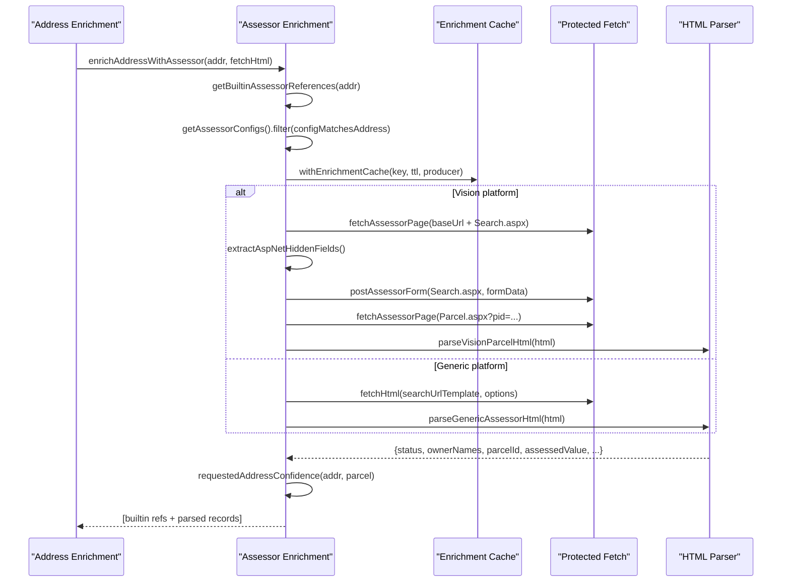
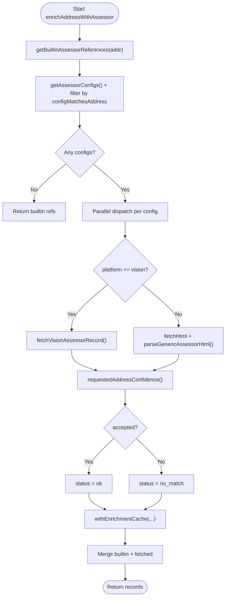
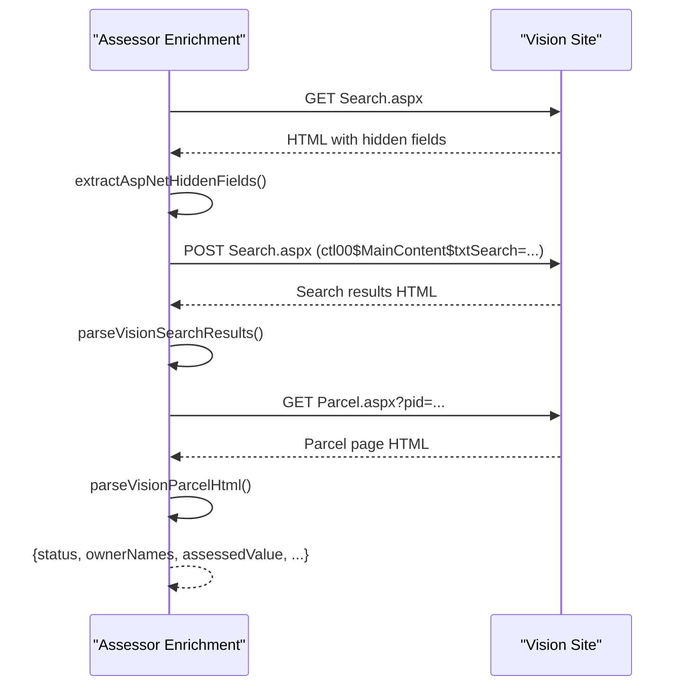
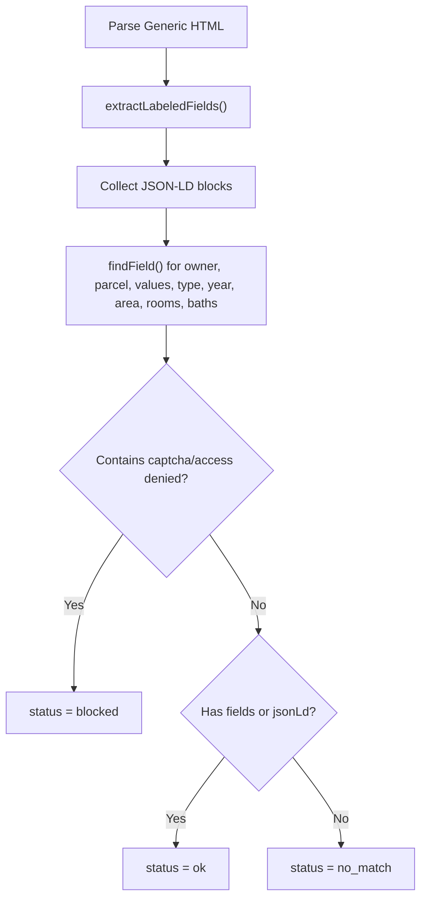
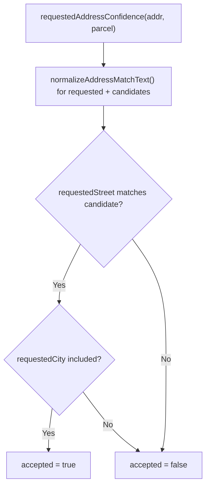
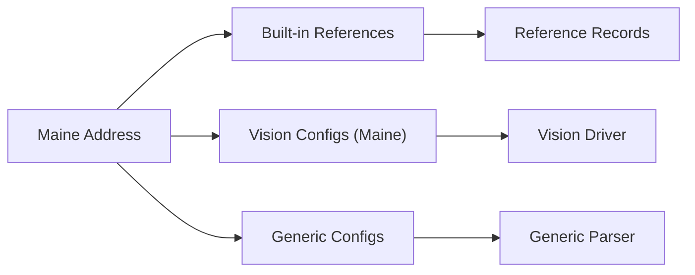
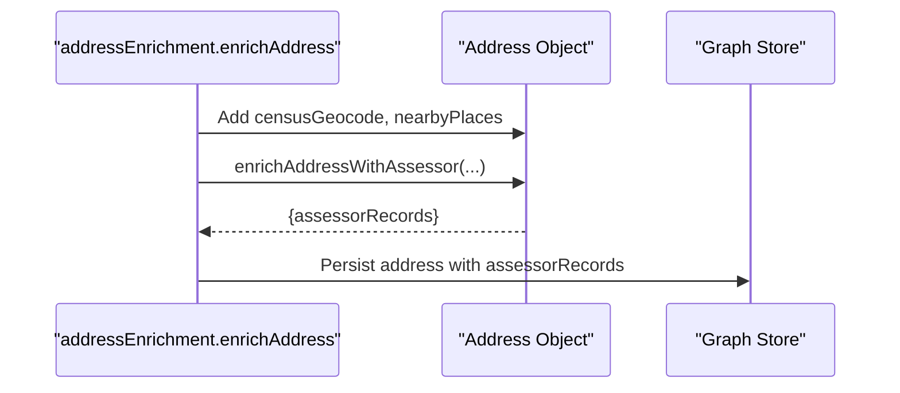
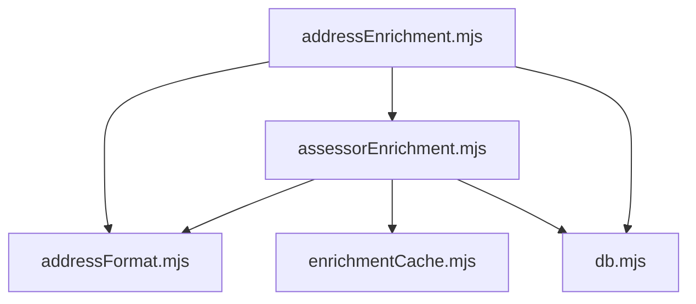

# Property Assessor Integration

<cite>
**Referenced Files in This Document**
- [assessorEnrichment.mjs](file://src/assessorEnrichment.mjs)
- [addressEnrichment.mjs](file://src/addressEnrichment.mjs)
- [addressFormat.mjs](file://src/addressFormat.mjs)
- [enrichmentCache.mjs](file://src/enrichmentCache.mjs)
- [sourceCatalog.mjs](file://src/sourceCatalog.mjs)
- [graphQuery.mjs](file://src/graphQuery.mjs)
- [db.mjs](file://src/db/db.mjs)
- [maine-assessor-integration.md](file://docs/maine-assessor-integration.md)
- [assessor-sources.example.json](file://docs/assessor-sources.example.json)
- [assessor-sources.maine.vision.json](file://docs/assessor-sources.maine.vision.json)
- [enrichment.test.mjs](file://test/enrichment.test.mjs)
- [app.js](file://public/app.js)
</cite>

## Table of Contents
1. [Introduction](#introduction)
2. [Project Structure](#project-structure)
3. [Core Components](#core-components)
4. [Architecture Overview](#architecture-overview)
5. [Detailed Component Analysis](#detailed-component-analysis)
6. [Dependency Analysis](#dependency-analysis)
7. [Performance Considerations](#performance-considerations)
8. [Troubleshooting Guide](#troubleshooting-guide)
9. [Conclusion](#conclusion)
10. [Appendices](#appendices)

## Introduction
This document explains the property assessor integration system that enriches person profiles with property ownership verification, tax assessment data, and geographic property information. It covers the assessor data enrichment pipeline, the implementation of the assessorEnrichment module, Maine-specific integration patterns, and property data validation processes. It also describes how assessor data integrates with address enrichment and enhances person profiling, along with documented limitations, accuracy considerations, and regional variations.

## Project Structure
The assessor integration spans several modules:
- Address enrichment orchestrator that triggers assessor enrichment
- Assessor enrichment module that discovers sources, fetches data, and validates results
- Generic HTML parsers and specialized Vision platform handlers
- Address formatting utilities
- Enrichment caching and persistence
- Source catalog and UI integration

```mermaid
graph TB
subgraph "Address Enrichment"
AE["addressEnrichment.mjs"]
AF["addressFormat.mjs"]
end
subgraph "Assessor Enrichment"
AE1["assessorEnrichment.mjs"]
EC["enrichmentCache.mjs"]
end
subgraph "Persistence"
DB["db.mjs"]
end
subgraph "UI"
UI["public/app.js"]
end
AE --> AF
AE --> AE1
AE1 --> EC
EC --> DB
AE --> UI
AE1 --> UI
```

**Diagram sources**
- [addressEnrichment.mjs:349-385](file://src/addressEnrichment.mjs#L349-L385)
- [assessorEnrichment.mjs:769-835](file://src/assessorEnrichment.mjs#L769-L835)
- [enrichmentCache.mjs:48-116](file://src/enrichmentCache.mjs#L48-L116)
- [db.mjs:61-67](file://src/db/db.mjs#L61-L67)
- [app.js:1278-1298](file://public/app.js#L1278-L1298)

**Section sources**
- [addressEnrichment.mjs:349-385](file://src/addressEnrichment.mjs#L349-L385)
- [assessorEnrichment.mjs:769-835](file://src/assessorEnrichment.mjs#L769-L835)
- [enrichmentCache.mjs:48-116](file://src/enrichmentCache.mjs#L48-L116)
- [db.mjs:61-67](file://src/db/db.mjs#L61-L67)
- [app.js:1278-1298](file://public/app.js#L1278-L1298)

## Core Components
- Assessor configuration loader: reads environment and file-based configurations, filters by address geography, and normalizes templates
- Generic assessor parser: extracts owner, parcel ID, assessed/market values, property type, and building characteristics from arbitrary HTML
- Vision platform driver: performs search form submission with hidden field extraction and parses Vision parcel pages
- Address confidence matcher: validates that the returned parcel address matches the requested address
- Enrichment cache: memoizes results with TTL and in-flight deduplication
- Built-in Maine references: provides official state and county resources for jurisdictions without structured records

**Section sources**
- [assessorEnrichment.mjs:120-166](file://src/assessorEnrichment.mjs#L120-L166)
- [assessorEnrichment.mjs:723-762](file://src/assessorEnrichment.mjs#L723-L762)
- [assessorEnrichment.mjs:588-685](file://src/assessorEnrichment.mjs#L588-L685)
- [assessorEnrichment.mjs:355-373](file://src/assessorEnrichment.mjs#L355-L373)
- [enrichmentCache.mjs:48-116](file://src/enrichmentCache.mjs#L48-L116)
- [assessorEnrichment.mjs:67-115](file://src/assessorEnrichment.mjs#L67-L115)

## Architecture Overview
The enrichment pipeline:
1. Address enrichment resolves census geocoding and nearby places
2. Assessor enrichment selects applicable configs and either:
   - Uses the Vision platform driver for municipal sites with ASP.NET forms
   - Uses generic HTML parsing for direct, query-parameterized URLs
3. Results are validated against the requested address and cached
4. UI displays status badges and resource links



**Diagram sources**
- [addressEnrichment.mjs:349-385](file://src/addressEnrichment.mjs#L349-L385)
- [assessorEnrichment.mjs:769-835](file://src/assessorEnrichment.mjs#L769-L835)
- [assessorEnrichment.mjs:588-685](file://src/assessorEnrichment.mjs#L588-L685)
- [assessorEnrichment.mjs:723-762](file://src/assessorEnrichment.mjs#L723-L762)
- [enrichmentCache.mjs:99-116](file://src/enrichmentCache.mjs#L99-L116)

## Detailed Component Analysis

### Assessor Enrichment Module
Responsibilities:
- Load and filter assessor configs by state/county/city
- Build cache keys and reuse cached results
- Dispatch to Vision driver or generic parser
- Validate address confidence and report status

Key behaviors:
- Template substitution for search URLs
- Address normalization and slug generation
- Logging with trace IDs and summarized URLs
- Blocked-page detection and structured-data gating



**Diagram sources**
- [assessorEnrichment.mjs:769-835](file://src/assessorEnrichment.mjs#L769-L835)
- [assessorEnrichment.mjs:588-685](file://src/assessorEnrichment.mjs#L588-L685)
- [assessorEnrichment.mjs:723-762](file://src/assessorEnrichment.mjs#L723-L762)
- [assessorEnrichment.mjs:355-373](file://src/assessorEnrichment.mjs#L355-L373)
- [enrichmentCache.mjs:99-116](file://src/enrichmentCache.mjs#L99-L116)

**Section sources**
- [assessorEnrichment.mjs:120-166](file://src/assessorEnrichment.mjs#L120-L166)
- [assessorEnrichment.mjs:225-248](file://src/assessorEnrichment.mjs#L225-L248)
- [assessorEnrichment.mjs:200-218](file://src/assessorEnrichment.mjs#L200-L218)
- [assessorEnrichment.mjs:355-373](file://src/assessorEnrichment.mjs#L355-L373)
- [assessorEnrichment.mjs:588-685](file://src/assessorEnrichment.mjs#L588-L685)
- [assessorEnrichment.mjs:723-762](file://src/assessorEnrichment.mjs#L723-L762)
- [assessorEnrichment.mjs:769-835](file://src/assessorEnrichment.mjs#L769-L835)

### Vision Platform Driver
The Vision driver automates municipal ASP.NET search portals:
- Fetches the search page to extract hidden ViewState and EventValidation fields
- Submits a POST with the search text and required fields
- Parses the search results to find a confident match
- Fetches the parcel page and parses owner, parcel ID, assessed/market values, property type, and building stats



**Diagram sources**
- [assessorEnrichment.mjs:588-685](file://src/assessorEnrichment.mjs#L588-L685)
- [assessorEnrichment.mjs:381-408](file://src/assessorEnrichment.mjs#L381-L408)
- [assessorEnrichment.mjs:468-512](file://src/assessorEnrichment.mjs#L468-L512)

**Section sources**
- [assessorEnrichment.mjs:588-685](file://src/assessorEnrichment.mjs#L588-L685)
- [assessorEnrichment.mjs:381-408](file://src/assessorEnrichment.mjs#L381-L408)
- [assessorEnrichment.mjs:468-512](file://src/assessorEnrichment.mjs#L468-L512)

### Generic Assessor Parser
For non-Vision sites, the generic parser:
- Extracts labeled fields from tables and definition lists
- Supports JSON-LD blocks
- Detects blocked pages and absence of structured data
- Returns standardized fields: owner, parcel ID, assessed/market values, property type, year built, area, bedrooms, bathrooms



**Diagram sources**
- [assessorEnrichment.mjs:723-762](file://src/assessorEnrichment.mjs#L723-L762)

**Section sources**
- [assessorEnrichment.mjs:691-715](file://src/assessorEnrichment.mjs#L691-L715)
- [assessorEnrichment.mjs:723-762](file://src/assessorEnrichment.mjs#L723-L762)

### Address Confidence Matching
The system compares the requested address with the parsed parcel address to ensure confidence:
- Normalizes street and city text
- Checks exact/prefix matches
- Accepts only when both street and city match expectations



**Diagram sources**
- [assessorEnrichment.mjs:355-373](file://src/assessorEnrichment.mjs#L355-L373)

**Section sources**
- [assessorEnrichment.mjs:262-277](file://src/assessorEnrichment.mjs#L262-L277)
- [assessorEnrichment.mjs:355-373](file://src/assessorEnrichment.mjs#L355-L373)

### Maine-Specific Integration Patterns
- Built-in references: For Maine addresses, the system returns official state and county resources when no structured parcel data is available
- Vision configs: A curated list of Maine municipalities using the Vision platform
- Configuration workflow: Use environment or file-based configs with state/counties/cities/towns filters and URL templates



**Diagram sources**
- [assessorEnrichment.mjs:67-115](file://src/assessorEnrichment.mjs#L67-L115)
- [assessor-sources.maine.vision.json:1-290](file://docs/assessor-sources.maine.vision.json#L1-L290)
- [maine-assessor-integration.md:55-100](file://docs/maine-assessor-integration.md#L55-L100)

**Section sources**
- [assessorEnrichment.mjs:67-115](file://src/assessorEnrichment.mjs#L67-L115)
- [assessor-sources.maine.vision.json:1-290](file://docs/assessor-sources.maine.vision.json#L1-L290)
- [maine-assessor-integration.md:55-100](file://docs/maine-assessor-integration.md#L55-L100)

### Integration with Address Enrichment and Person Profiling
- Address enrichment adds census geocoding and nearby places, then triggers assessor enrichment
- Assessor records are attached to the address object and persisted in the graph
- The UI displays assessor status badges and resource links



**Diagram sources**
- [addressEnrichment.mjs:349-385](file://src/addressEnrichment.mjs#L349-L385)
- [graphQuery.mjs:18-63](file://src/graphQuery.mjs#L18-L63)

**Section sources**
- [addressEnrichment.mjs:349-385](file://src/addressEnrichment.mjs#L349-L385)
- [graphQuery.mjs:18-63](file://src/graphQuery.mjs#L18-L63)
- [app.js:1278-1298](file://public/app.js#L1278-L1298)

## Dependency Analysis
- Coupling: addressEnrichment depends on assessorEnrichment and addressFormat; assessorEnrichment depends on cheerio, enrichmentCache, and addressFormat
- External dependencies: HTTP fetch, Cheerio HTML parsing, Better-SQLite3 for caching
- Potential circular dependencies: None apparent; modules are layered (address -> assessor -> cache)



**Diagram sources**
- [addressEnrichment.mjs:1-20](file://src/addressEnrichment.mjs#L1-L20)
- [assessorEnrichment.mjs:1-10](file://src/assessorEnrichment.mjs#L1-L10)
- [enrichmentCache.mjs:1-6](file://src/enrichmentCache.mjs#L1-L6)
- [db.mjs:1-10](file://src/db/db.mjs#L1-L10)

**Section sources**
- [addressEnrichment.mjs:1-20](file://src/addressEnrichment.mjs#L1-L20)
- [assessorEnrichment.mjs:1-10](file://src/assessorEnrichment.mjs#L1-L10)
- [enrichmentCache.mjs:1-6](file://src/enrichmentCache.mjs#L1-L6)
- [db.mjs:1-10](file://src/db/db.mjs#L1-L10)

## Performance Considerations
- Caching: Enrichment cache TTLs prevent repeated fetches; in-flight deduplication avoids concurrent work
- Rate limiting: Overpass and similar services enforce minimum intervals; consider similar discipline for assessor fetches
- Timeout tuning: Configurable timeouts per assessor source to avoid long stalls
- Selective fetching: Only fetch when address geography matches configured filters

[No sources needed since this section provides general guidance]

## Troubleshooting Guide
Common issues and resolutions:
- No structured data found: The generic parser reports no_match; verify the page includes owner, parcel ID, or assessed value text
- Blocked pages: Captcha or access denied detected; switch to a browser-backed fetch or adjust headers
- Address mismatch: Confidence check fails; ensure the requested address normalization aligns with the site’s address presentation
- Vision form submissions: Missing hidden fields or CSRF tokens; confirm the search page is fetched before POST
- Maine jurisdiction not integrated: Use built-in references or add a config entry with proper state/counties/cities/towns filters

Concrete examples from tests:
- Generic template-based enrichment with expected URL construction and parsed fields
- Vision platform search and parcel parsing with hidden field extraction and match validation
- Rejection of Vision parcels when address confidence fails

**Section sources**
- [enrichment.test.mjs:78-133](file://test/enrichment.test.mjs#L78-L133)
- [enrichment.test.mjs:135-236](file://test/enrichment.test.mjs#L135-L236)
- [enrichment.test.mjs:238-322](file://test/enrichment.test.mjs#L238-L322)
- [assessorEnrichment.mjs:723-762](file://src/assessorEnrichment.mjs#L723-L762)
- [assessorEnrichment.mjs:588-685](file://src/assessorEnrichment.mjs#L588-L685)

## Conclusion
The property assessor integration provides robust, configurable enrichment for property ownership and tax assessment data. It supports both generic and Vision-driven platforms, validates results against the requested address, and integrates seamlessly with address and person profiling. Maine-specific patterns leverage built-in references and a curated Vision catalog, while the broader framework accommodates diverse regional systems through flexible configuration and logging.

[No sources needed since this section summarizes without analyzing specific files]

## Appendices

### Example: Property Search Results
- Generic template-based search yields owner, parcel ID, and assessed value
- Vision search yields owner, parcel ID, assessed/market values, property type, and building stats

**Section sources**
- [enrichment.test.mjs:78-133](file://test/enrichment.test.mjs#L78-L133)
- [enrichment.test.mjs:135-236](file://test/enrichment.test.mjs#L135-L236)

### Example: Ownership Verification
- Confidence matching ensures the returned parcel address aligns with the requested address
- Rejection occurs when address confidence is not met

**Section sources**
- [assessorEnrichment.mjs:355-373](file://src/assessorEnrichment.mjs#L355-L373)
- [enrichment.test.mjs:238-322](file://test/enrichment.test.mjs#L238-L322)

### Example: Geographic Property Information
- Building characteristics (year built, square footage, bedrooms, bathrooms)
- Property type and assessed/market values

**Section sources**
- [assessorEnrichment.mjs:468-512](file://src/assessorEnrichment.mjs#L468-L512)
- [assessorEnrichment.mjs:723-762](file://src/assessorEnrichment.mjs#L723-L762)

### Assessor Data Source Limitations and Accuracy
- Relies on public, unauthenticated, and stable HTML pages
- Some sites require browser automation or complex workflows
- Accuracy depends on the assessor site’s data quality and normalization

**Section sources**
- [maine-assessor-integration.md:31-53](file://docs/maine-assessor-integration.md#L31-L53)
- [maine-assessor-integration.md:104-114](file://docs/maine-assessor-integration.md#L104-L114)

### Regional Variations in Assessor Systems
- Maine: Municipalities often use Vision; county resources serve as references
- Other states: Use generic configs with state/counties/cities/towns filters and URL templates

**Section sources**
- [assessor-sources.maine.vision.json:1-290](file://docs/assessor-sources.maine.vision.json#L1-L290)
- [maine-assessor-integration.md:55-100](file://docs/maine-assessor-integration.md#L55-L100)