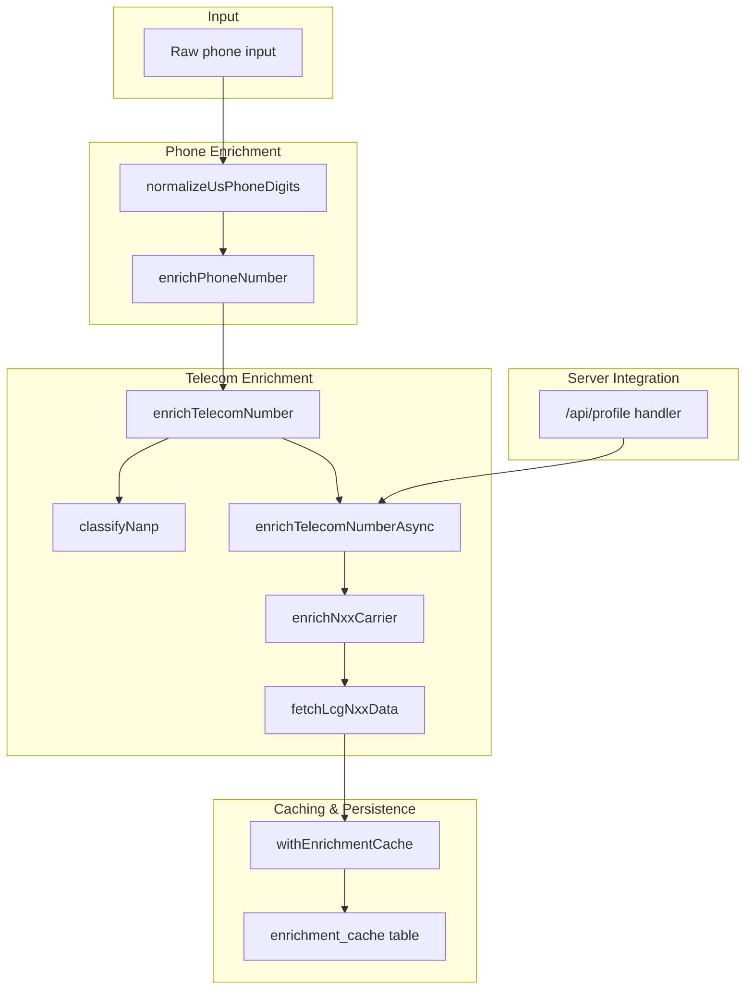
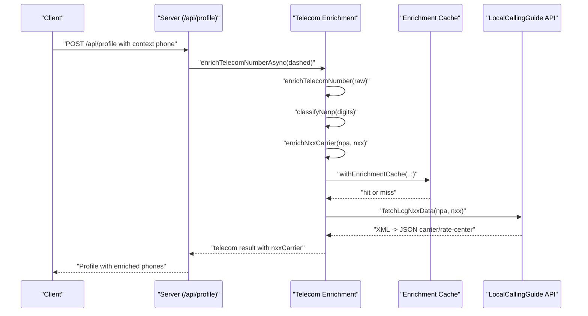
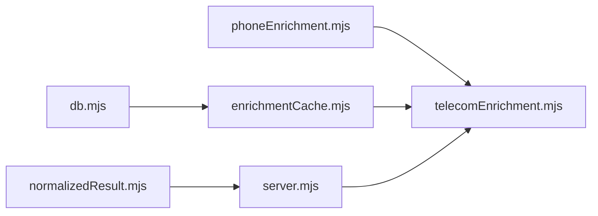

# Telecom Analysis

<cite>
**Referenced Files in This Document**
- [telecomEnrichment.mjs](file://src/telecomEnrichment.mjs)
- [phoneEnrichment.mjs](file://src/phoneEnrichment.mjs)
- [enrichmentCache.mjs](file://src/enrichmentCache.mjs)
- [db.mjs](file://src/db/db.mjs)
- [server.mjs](file://src/server.mjs)
- [normalizedResult.mjs](file://src/normalizedResult.mjs)
- [source-adapters.test.mjs](file://test/source-adapters.test.mjs)
</cite>

## Table of Contents
1. [Introduction](#introduction)
2. [Project Structure](#project-structure)
3. [Core Components](#core-components)
4. [Architecture Overview](#architecture-overview)
5. [Detailed Component Analysis](#detailed-component-analysis)
6. [Dependency Analysis](#dependency-analysis)
7. [Performance Considerations](#performance-considerations)
8. [Troubleshooting Guide](#troubleshooting-guide)
9. [Conclusion](#conclusion)

## Introduction
This document explains the telecom analysis module that powers carrier detection, line type classification, and telecom data enrichment for US phone numbers. It covers:
- Carrier lookup via a third-party XML API and caching
- NANP (North American Numbering Plan) classification (including special-use prefixes)
- Integration with phone enrichment to enhance profile accuracy
- Practical examples of phone number analysis, carrier identification, and line type classification
- Operational limits, update cadence, and troubleshooting guidance

The goal is to make the telecom enrichment pipeline understandable for beginners while providing deep technical insights for developers implementing or extending the workflow.

## Project Structure
The telecom enrichment pipeline spans several modules:
- Phone normalization and basic phone metadata extraction
- Telecom enrichment (NANP classification and carrier lookup)
- Enrichment caching and persistence
- Server-side orchestration and profile enrichment
- Normalization of enriched phone records for downstream consumers

**Diagram sources**
- [telecomEnrichment.mjs:146-178](file://src/telecomEnrichment.mjs#L146-L178)
- [phoneEnrichment.mjs:7-96](file://src/phoneEnrichment.mjs#L7-L96)
- [enrichmentCache.mjs:99-116](file://src/enrichmentCache.mjs#L99-L116)
- [db.mjs:61-67](file://src/db/db.mjs#L61-L67)
- [server.mjs:2816-2834](file://src/server.mjs#L2816-L2834)

**Section sources**
- [telecomEnrichment.mjs:1-179](file://src/telecomEnrichment.mjs#L1-L179)
- [phoneEnrichment.mjs:1-126](file://src/phoneEnrichment.mjs#L1-L126)
- [enrichmentCache.mjs:1-117](file://src/enrichmentCache.mjs#L1-L117)
- [db.mjs:21-120](file://src/db/db.mjs#L21-L120)
- [server.mjs:2816-2834](file://src/server.mjs#L2816-L2834)

## Core Components
- Phone normalization and metadata extraction: Converts various phone formats into standardized digits and dashed notation, and parses metadata (e.g., validity, type) using a robust library.
- Telecom NANP classification: Identifies area/exchange combinations and classifies numbers into categories such as geographic, toll-free, premium-rate, and N11 services.
- Carrier lookup and rate-center enrichment: Queries a public XML API for carrier and rate-center metadata, caches results, and attaches them to the telecom enrichment output.
- Server integration: Orchestrates per-phone enrichment during profile fetches and merges telecom data with existing phone metadata.

**Section sources**
- [phoneEnrichment.mjs:7-96](file://src/phoneEnrichment.mjs#L7-L96)
- [telecomEnrichment.mjs:118-159](file://src/telecomEnrichment.mjs#L118-L159)
- [telecomEnrichment.mjs:166-178](file://src/telecomEnrichment.mjs#L166-L178)
- [server.mjs:2816-2834](file://src/server.mjs#L2816-L2834)

## Architecture Overview
The telecom enrichment flow is designed to be resilient and efficient:
- Basic phone metadata is derived synchronously from the phone input.
- NANP classification is performed immediately after normalization.
- Optional carrier and rate-center data are fetched asynchronously and cached to reduce repeated network calls.
- The server attaches telecom data to each phone record and merges it with existing phone metadata.

**Diagram sources**
- [server.mjs:2816-2834](file://src/server.mjs#L2816-L2834)
- [telecomEnrichment.mjs:166-178](file://src/telecomEnrichment.mjs#L166-L178)
- [telecomEnrichment.mjs:79-86](file://src/telecomEnrichment.mjs#L79-L86)
- [telecomEnrichment.mjs:13-71](file://src/telecomEnrichment.mjs#L13-L71)
- [enrichmentCache.mjs:99-116](file://src/enrichmentCache.mjs#L99-L116)

## Detailed Component Analysis

### Phone Enrichment
Purpose:
- Normalize raw input into digits and dashed notation.
- Parse and return standardized phone metadata (validation, type, E164, national format).

Key behaviors:
- Handles 10-digit and 11-digit inputs (with leading 1).
- Uses a parsing library to derive metadata and types.
- Provides fallbacks when parsing fails.

Integration:
- Used by telecom enrichment to obtain normalized digits and metadata before classification.

**Section sources**
- [phoneEnrichment.mjs:7-96](file://src/phoneEnrichment.mjs#L7-L96)

### Telecom Enrichment (NANP Classification)
Purpose:
- Classify NANP numbers into categories (geographic, toll-free, premium-rate, N11 services).
- Detect easily recognizable exchanges/line numbers.

Rules:
- Toll-free prefixes are mapped to a dedicated category.
- N11 prefixes (e.g., 911, 411) map to service categories.
- Geographic numbers default to “geographic” unless special-use applies.
- Special-use numbers exclude carrier lookup to avoid misclassification.

Output fields:
- Numbering plan identifier
- Area code, central office code, line number
- Category and human-readable label
- Flags for special use and easily recognizable patterns

**Section sources**
- [telecomEnrichment.mjs:88-112](file://src/telecomEnrichment.mjs#L88-L112)
- [telecomEnrichment.mjs:118-138](file://src/telecomEnrichment.mjs#L118-L138)
- [telecomEnrichment.mjs:146-159](file://src/telecomEnrichment.mjs#L146-L159)

### Carrier Lookup and Rate-Center Enrichment
Purpose:
- Retrieve carrier and rate-center metadata for a NANP NXX (exchange).
- Cache results to minimize network load and improve latency.

Implementation:
- Fetches XML from a public API endpoint and parses required fields.
- Validates presence of identifying fields before accepting the result.
- Wraps the fetch in a cache with a long TTL because NANP assignments change infrequently.
- Deduplicates concurrent requests for the same key.

Output fields:
- Source identifier
- Area code, exchange
- Company/OCC identifiers and type
- Rate center, region, LATA
- Switch and ILEC identifiers
- Rate-center latitude/longitude

**Section sources**
- [telecomEnrichment.mjs:13-71](file://src/telecomEnrichment.mjs#L13-L71)
- [telecomEnrichment.mjs:79-86](file://src/telecomEnrichment.mjs#L79-L86)
- [enrichmentCache.mjs:99-116](file://src/enrichmentCache.mjs#L99-L116)

### Server Integration and Profile Enhancement
Purpose:
- Enrich each phone in a profile with telecom data.
- Merge telecom metadata with existing phone metadata when available.
- Provide telecom data to external source integrations.

Behavior:
- Iterates over profile phones and calls the async telecom enrichment.
- Attaches telecom data to the phone record and backfills phone metadata if missing.
- Ensures non-fatal failures do not block the rest of the pipeline.

**Section sources**
- [server.mjs:2816-2834](file://src/server.mjs#L2816-L2834)
- [server.mjs:2861-2898](file://src/server.mjs#L2861-L2898)

### Data Normalization for Phones
Purpose:
- Normalize phone records for consistent downstream consumption.
- Prefer explicit line type from telecom enrichment if present; otherwise fall back to parsed phone type.

Behavior:
- Extracts dashed display, E164, and type.
- Resolves line type precedence from telecom metadata or parsed phone metadata.

**Section sources**
- [normalizedResult.mjs:92-108](file://src/normalizedResult.mjs#L92-L108)

## Dependency Analysis
The telecom enrichment module depends on:
- Phone enrichment for normalization and metadata
- Enrichment cache for persistence and concurrency control
- Database for cache storage and pruning
- Server for orchestrating enrichment during profile fetches

**Diagram sources**
- [telecomEnrichment.mjs:1-2](file://src/telecomEnrichment.mjs#L1-L2)
- [enrichmentCache.mjs:1-4](file://src/enrichmentCache.mjs#L1-L4)
- [db.mjs:61-67](file://src/db/db.mjs#L61-L67)
- [server.mjs:2816-2834](file://src/server.mjs#L2816-L2834)
- [normalizedResult.mjs:92-108](file://src/normalizedResult.mjs#L92-L108)

**Section sources**
- [telecomEnrichment.mjs:1-2](file://src/telecomEnrichment.mjs#L1-L2)
- [enrichmentCache.mjs:1-4](file://src/enrichmentCache.mjs#L1-L4)
- [db.mjs:61-67](file://src/db/db.mjs#L61-L67)
- [server.mjs:2816-2834](file://src/server.mjs#L2816-L2834)
- [normalizedResult.mjs:92-108](file://src/normalizedResult.mjs#L92-L108)

## Performance Considerations
- Long-lived cache for carrier data: A 30-day TTL is used because NANP assignments change rarely, reducing network calls and latency.
- Request deduplication: Concurrent requests for the same NXX are deduplicated to prevent thundering herds.
- Asynchronous enrichment: Carrier lookup is offloaded to an async step to avoid blocking profile rendering.
- Database pruning: Expired cache entries are pruned on access to keep the cache size manageable.
- Max cache entries: Enforces a cap on cache size by evicting oldest entries when threshold is exceeded.

Recommendations:
- Monitor cache hit rates and adjust TTL if carrier assignment churn increases.
- Consider staggering TTLs per dataset if some regions update faster than others.
- Add circuit breaker logic around the carrier API to degrade gracefully under failure.

**Section sources**
- [telecomEnrichment.mjs](file://src/telecomEnrichment.mjs#L4)
- [enrichmentCache.mjs:20-41](file://src/enrichmentCache.mjs#L20-L41)
- [enrichmentCache.mjs:28-41](file://src/enrichmentCache.mjs#L28-L41)
- [enrichmentCache.mjs:99-116](file://src/enrichmentCache.mjs#L99-L116)

## Troubleshooting Guide
Common issues and resolutions:
- No carrier data returned:
  - Network errors or invalid XML responses are treated as null results.
  - Verify the NXX is valid and not a special-use prefix (carrier lookup is skipped for special-use).
- Unexpected null telecom result:
  - Ensure the input is normalized to a 10-digit NANP number.
  - Confirm the area/exchange combination exists in the carrier database.
- Cache not updating:
  - The cache uses a long TTL; clear or prune expired entries if stale data is suspected.
- API failures:
  - The carrier API call is wrapped in a timeout and exception handling; confirm upstream availability and retry later.

Operational checks:
- Validate NANP classification for special-use prefixes and N11 services.
- Inspect cache entries in the enrichment cache table.
- Review server logs for per-phone enrichment attempts and outcomes.

**Section sources**
- [telecomEnrichment.mjs:13-71](file://src/telecomEnrichment.mjs#L13-L71)
- [telecomEnrichment.mjs:79-86](file://src/telecomEnrichment.mjs#L79-L86)
- [enrichmentCache.mjs:48-67](file://src/enrichmentCache.mjs#L48-L67)
- [db.mjs:61-67](file://src/db/db.mjs#L61-L67)

## Conclusion
The telecom analysis module provides a robust, cache-backed pipeline for enriching US phone numbers with NANP classification and carrier/rate-center metadata. It integrates seamlessly with phone enrichment and server-side profile processing, enhancing profile accuracy and enabling downstream consumers to make informed decisions about line types and ownership signals. By leveraging long-lived caching, request deduplication, and graceful error handling, the system balances performance and reliability.