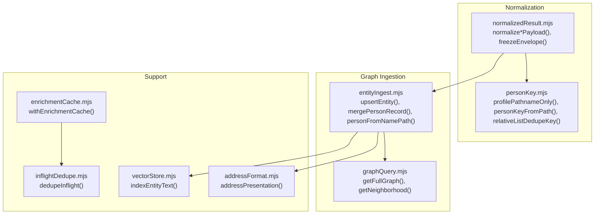
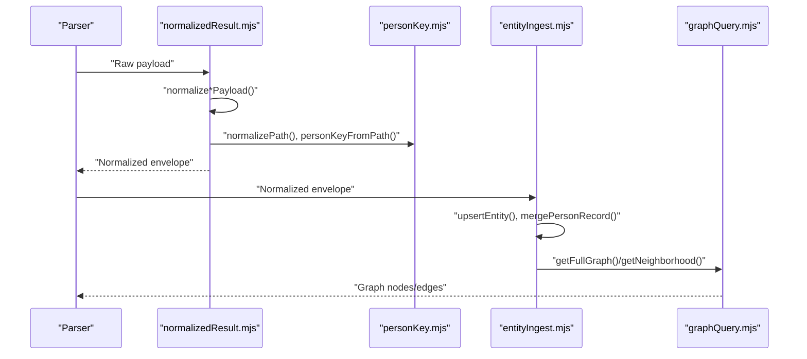
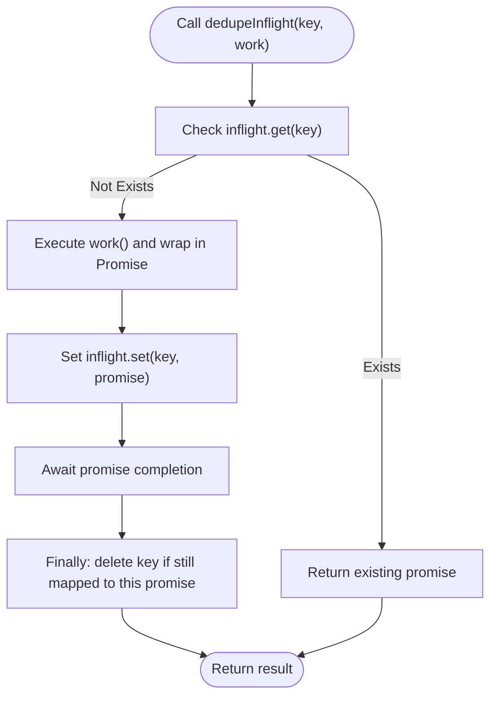
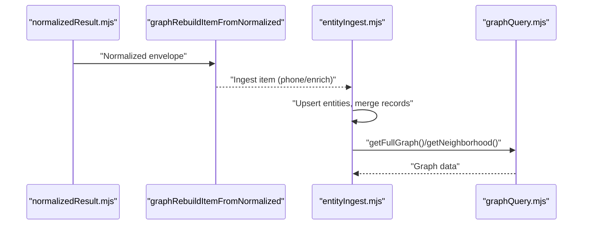
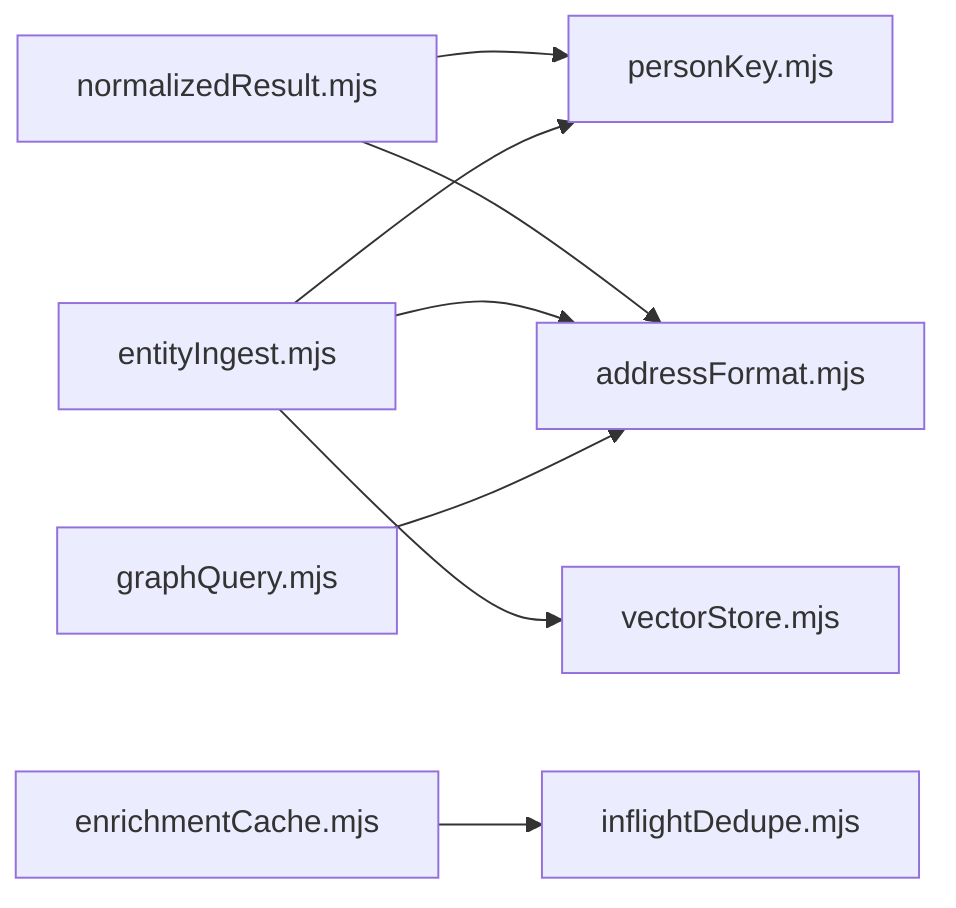

# Result Normalization

<cite>
**Referenced Files in This Document**
- [normalizedResult.mjs](file://src/normalizedResult.mjs)
- [personKey.mjs](file://src/personKey.mjs)
- [inflightDedupe.mjs](file://src/inflightDedupe.mjs)
- [entityIngest.mjs](file://src/entityIngest.mjs)
- [graphQuery.mjs](file://src/graphQuery.mjs)
- [enrichmentCache.mjs](file://src/enrichmentCache.mjs)
- [addressFormat.mjs](file://src/addressFormat.mjs)
- [vectorStore.mjs](file://src/vectorStore.mjs)
- [normalized-result.test.mjs](file://test/normalized-result.test.mjs)
</cite>

## Table of Contents
1. [Introduction](#introduction)
2. [Project Structure](#project-structure)
3. [Core Components](#core-components)
4. [Architecture Overview](#architecture-overview)
5. [Detailed Component Analysis](#detailed-component-analysis)
6. [Dependency Analysis](#dependency-analysis)
7. [Performance Considerations](#performance-considerations)
8. [Troubleshooting Guide](#troubleshooting-guide)
9. [Conclusion](#conclusion)

## Introduction
This document explains the result normalization subsystem that transforms raw search and profile data into a standardized, deduplicated, and graph-ready format. It covers:
- Normalized result contracts and schema versioning
- Data standardization processes for phones, addresses, and relative lists
- Entity key generation for deduplication across profiles and names
- Relative list deduplication strategies and profile path normalization
- Validation rules and field normalization across sources
- Consistency guarantees and integration with graph building and caching
- Practical examples from the test suite

## Project Structure
Normalization sits at the intersection of parsing, standardization, and graph ingestion:
- Raw payloads from parsers are passed to normalization functions that produce a shared envelope with records and metadata.
- Person key utilities normalize and deduplicate profile paths and names.
- Graph ingestion consumes normalized records to upsert entities and create edges.
- Caching and concurrency helpers prevent duplicate processing.

**Diagram sources**
- [normalizedResult.mjs:167-244](file://src/normalizedResult.mjs#L167-L244)
- [personKey.mjs:11-78](file://src/personKey.mjs#L11-L78)
- [entityIngest.mjs:233-296](file://src/entityIngest.mjs#L233-L296)
- [graphQuery.mjs:18-63](file://src/graphQuery.mjs#L18-L63)
- [addressFormat.mjs:123-154](file://src/addressFormat.mjs#L123-L154)
- [vectorStore.mjs:91-111](file://src/vectorStore.mjs#L91-L111)
- [inflightDedupe.mjs:11-23](file://src/inflightDedupe.mjs#L11-L23)
- [enrichmentCache.mjs:99-116](file://src/enrichmentCache.mjs#L99-L116)

**Section sources**
- [normalizedResult.mjs:1-506](file://src/normalizedResult.mjs#L1-L506)
- [personKey.mjs:1-258](file://src/personKey.mjs#L1-L258)
- [entityIngest.mjs:1-665](file://src/entityIngest.mjs#L1-L665)
- [graphQuery.mjs:1-225](file://src/graphQuery.mjs#L1-L225)
- [addressFormat.mjs:1-155](file://src/addressFormat.mjs#L1-L155)
- [vectorStore.mjs:1-134](file://src/vectorStore.mjs#L1-L134)
- [inflightDedupe.mjs:1-24](file://src/inflightDedupe.mjs#L1-L24)
- [enrichmentCache.mjs:1-117](file://src/enrichmentCache.mjs#L1-L117)

## Core Components
- Normalized result envelope: A schema-versioned container holding kind, query, meta, summary, and records arrays. See [freezeEnvelope:150-160](file://src/normalizedResult.mjs#L150-L160).
- Phone search normalization: Builds a phone_search envelope with a single person candidate record, phones, addresses teaser, and relatives. See [normalizePhoneSearchPayload:167-244](file://src/normalizedResult.mjs#L167-L244).
- Name search normalization: Produces person_candidate records with addresses and relatives. See [normalizeNameSearchPayload:250-331](file://src/normalizedResult.mjs#L250-L331).
- Profile lookup normalization: Produces person_profile records with phones, addresses, and relatives. See [normalizeProfileLookupPayload:337-381](file://src/normalizedResult.mjs#L337-L381).
- Graph rebuild conversion: Converts normalized envelopes back into ingest items for graph rebuilding. See [graphRebuildItemFromNormalized:388-505](file://src/normalizedResult.mjs#L388-L505).

Validation and normalization helpers:
- Text cleaning and compaction: [compactObject:7-34](file://src/normalizedResult.mjs#L7-L34), [cleanText:40-43](file://src/normalizedResult.mjs#L40-L43), [cleanStringArray:49-54](file://src/normalizedResult.mjs#L49-L54).
- Path normalization: [normalizePath:60-66](file://src/normalizedResult.mjs#L60-L66).
- Relative normalization: [normalizeRelative:72-86](file://src/normalizedResult.mjs#L72-L86).
- Phone/address normalization: [normalizePhoneRecord:92-109](file://src/normalizedResult.mjs#L92-L109), [normalizeAddressRecord:115-144](file://src/normalizedResult.mjs#L115-L144).

**Section sources**
- [normalizedResult.mjs:1-506](file://src/normalizedResult.mjs#L1-L506)

## Architecture Overview
Normalization is a pipeline that:
1. Receives raw payloads from parsers.
2. Applies field-level normalization and validation.
3. Produces a normalized envelope with a stable schema version.
4. Provides conversion to graph rebuild items for downstream processing.

**Diagram sources**
- [normalizedResult.mjs:167-244](file://src/normalizedResult.mjs#L167-L244)
- [personKey.mjs:11-78](file://src/personKey.mjs#L11-L78)
- [entityIngest.mjs:233-296](file://src/entityIngest.mjs#L233-L296)
- [graphQuery.mjs:18-63](file://src/graphQuery.mjs#L18-L63)

## Detailed Component Analysis

### Normalized Result Contracts and Schema Versioning
- Schema version: A constant enforces a single normalized schema version across the system. See [NORMALIZED_SCHEMA_VERSION](file://src/normalizedResult.mjs#L1).
- Envelope structure: The envelope includes schemaVersion, source, kind, query, meta, summary, and records. See [freezeEnvelope:150-160](file://src/normalizedResult.mjs#L150-L160).
- Kind-specific normalization:
  - Phone search: [normalizePhoneSearchPayload:167-244](file://src/normalizedResult.mjs#L167-L244)
  - Name search: [normalizeNameSearchPayload:250-331](file://src/normalizedResult.mjs#L250-L331)
  - Profile lookup: [normalizeProfileLookupPayload:337-381](file://src/normalizedResult.mjs#L337-L381)

Consistency guarantees:
- Null/empty pruning via [compactObject:7-34](file://src/normalizedResult.mjs#L7-L34).
- Canonical path normalization via [normalizePath:60-66](file://src/normalizedResult.mjs#L60-L66).
- Metadata flags like graphEligible and recordCount computed consistently.

**Section sources**
- [normalizedResult.mjs:1-506](file://src/normalizedResult.mjs#L1-L506)

### Data Standardization Processes
- Text normalization: Whitespace collapsing and trimming via [cleanText:40-43](file://src/normalizedResult.mjs#L40-L43).
- Arrays: Cleaning and filtering empty entries via [cleanStringArray:49-54](file://src/normalizedResult.mjs#L49-L54).
- Paths: Removing query params and trailing slashes via [normalizePath:60-66](file://src/normalizedResult.mjs#L60-L66).
- Phones: Ensuring dashed/display consistency and optional metadata via [normalizePhoneRecord:92-109](file://src/normalizedResult.mjs#L92-L109).
- Addresses: Normalizing labels/formatted text, periods, and geocoding via [normalizeAddressRecord:115-144](file://src/normalizedResult.mjs#L115-L144).
- Relatives: Normalizing names and paths, including alternateProfilePaths via [normalizeRelative:72-86](file://src/normalizedResult.mjs#L72-L86).

Validation rules:
- Non-null, non-empty strings are preserved; nulls, empty arrays, and empty objects are dropped.
- Paths are normalized to a canonical form to prevent duplication across equivalent URLs.

**Section sources**
- [normalizedResult.mjs:1-506](file://src/normalizedResult.mjs#L1-L506)

### Entity Key Generation for Deduplication
Person key utilities enable robust deduplication across profiles and names:
- Profile path normalization: [profilePathnameOnly:11-38](file://src/personKey.mjs#L11-L38) ensures paths are reduced to a canonical pathname.
- Person key from path: [personKeyFromPath:66-78](file://src/personKey.mjs#L66-L78) decodes and lowercases the path for stable comparison.
- Person slug keys: [peopleProfileSlugKey:86-103](file://src/personKey.mjs#L86-L103) and [peopleProfileSlugKeyLoose:111-121](file://src/personKey.mjs#L111-L121) extract and normalize slug segments for strict and punctuation-agnostic matching.
- Relative list deduplication: [relativeListDedupeKey:130-145](file://src/personKey.mjs#L130-L145) prefers slug keys, falls back to path keys, then name-only keys.
- Name normalization for dedupe: [normalizePersonNameForDedupe:152-163](file://src/personKey.mjs#L152-L163) applies Unicode normalization and whitespace cleanup.
- Name-only key: [personKeyFromNameOnly:169-177](file://src/personKey.mjs#L169-L177) produces a lowercase, cleaned key for name-only fallbacks.
- Unique names and paths: [uniqueNames:184-200](file://src/personKey.mjs#L184-L200) and [uniqueProfilePaths:206-221](file://src/personKey.mjs#L206-L221) deduplicate arrays.

Integration with graph ingestion:
- Person dedupe key preference: [personDedupeKeyPreferName:385-393](file://src/entityIngest.mjs#L385-L393) prefers name-derived keys when available, otherwise path keys.
- Upsert and merging: [upsertEntity:233-296](file://src/entityIngest.mjs#L233-L296) and [mergePersonRecord:310-352](file://src/entityIngest.mjs#L310-L352) combine data and maintain uniqueness.
- Path overlap detection: [findExistingPersonInDbByPathOverlap:154-182](file://src/entityIngest.mjs#L154-L182) scans existing entities using personPathKeySetsForMatch.

**Section sources**
- [personKey.mjs:1-258](file://src/personKey.mjs#L1-L258)
- [entityIngest.mjs:1-665](file://src/entityIngest.mjs#L1-L665)

### Relative List Deduplication Strategies and Profile Path Normalization
- Normalize relative entries: [normalizeRelative:72-86](file://src/normalizedResult.mjs#L72-L86) cleans names and paths, and normalizes alternateProfilePaths.
- Dedupe keys for relatives: [relativeListDedupeKey:130-145](file://src/personKey.mjs#L130-L145) ensures that two href variants for the same profile collapse to one.
- Unique profile paths: [uniqueProfilePaths:206-221](file://src/personKey.mjs#L206-L221) deduplicates across profilePath and alternateProfilePaths.
- Person resolution from name/path: [personFromNamePath:404-438](file://src/entityIngest.mjs#L404-L438) creates person entities preferring name-first keys and merges profile paths.

Practical example from tests:
- Phone search normalization validates phones, addresses teaser, and relatives. See [normalized-result.test.mjs:10-46](file://test/normalized-result.test.mjs#L10-L46).
- Name search normalization validates candidate records and addresses. See [normalized-result.test.mjs:48-87](file://test/normalized-result.test.mjs#L48-L87).
- Profile lookup normalization validates phones, addresses, and relatives. See [normalized-result.test.mjs:89-138](file://test/normalized-result.test.mjs#L89-L138).

**Section sources**
- [normalizedResult.mjs:72-86](file://src/normalizedResult.mjs#L72-L86)
- [personKey.mjs:130-145](file://src/personKey.mjs#L130-L145)
- [personKey.mjs:206-221](file://src/personKey.mjs#L206-L221)
- [entityIngest.mjs:404-438](file://src/entityIngest.mjs#L404-L438)
- [normalized-result.test.mjs:10-138](file://test/normalized-result.test.mjs#L10-L138)

### Inflight Deduplication Mechanism
- Purpose: Prevents duplicate processing during concurrent requests by sharing a single promise per key.
- Implementation: [dedupeInflight:11-23](file://src/inflightDedupe.mjs#L11-L23) stores a promise keyed by a string and returns it for subsequent callers.
- Usage in enrichment cache: [withEnrichmentCache:99-116](file://src/enrichmentCache.mjs#L99-L116) wraps producers with inflight deduplication to avoid redundant enrichment work.

**Diagram sources**
- [inflightDedupe.mjs:11-23](file://src/inflightDedupe.mjs#L11-L23)
- [enrichmentCache.mjs:99-116](file://src/enrichmentCache.mjs#L99-L116)

**Section sources**
- [inflightDedupe.mjs:1-24](file://src/inflightDedupe.mjs#L1-L24)
- [enrichmentCache.mjs:99-116](file://src/enrichmentCache.mjs#L99-L116)

### Field Normalization Across Different Sources
- Phone normalization: Ensures dashed and display consistency, optional metadata preservation. See [normalizePhoneRecord:92-109](file://src/normalizedResult.mjs#L92-L109).
- Address normalization: Handles labels, formatted text, periods, and geocoding fields. See [normalizeAddressRecord:115-144](file://src/normalizedResult.mjs#L115-L144).
- Presentation formatting: Address presentation utilities convert normalized keys and labels into human-friendly formats. See [addressPresentation:123-154](file://src/addressFormat.mjs#L123-L154).

**Section sources**
- [normalizedResult.mjs:92-144](file://src/normalizedResult.mjs#L92-L144)
- [addressFormat.mjs:123-154](file://src/addressFormat.mjs#L123-L154)

### Relationships with Graph Building and Cache Management
- Graph rebuild conversion: [graphRebuildItemFromNormalized:388-505](file://src/normalizedResult.mjs#L388-L505) converts normalized envelopes into either phone or enrich items for graph rebuilding.
- Graph ingestion: [upsertEntity:233-296](file://src/entityIngest.mjs#L233-L296) and [mergePersonRecord:310-352](file://src/entityIngest.mjs#L310-L352) manage entity creation and merging.
- Graph queries: [getFullGraph:18-63](file://src/graphQuery.mjs#L18-L63) and [getNeighborhood:70-135](file://src/graphQuery.mjs#L70-L135) expose normalized data for visualization.
- Vector indexing: [indexEntityText:91-111](file://src/vectorStore.mjs#L91-L111) indexes entity text for search-like capabilities.
- Cache integration: [withEnrichmentCache:99-116](file://src/enrichmentCache.mjs#L99-L116) uses inflight deduplication to avoid duplicate enrichment.

**Diagram sources**
- [normalizedResult.mjs:388-505](file://src/normalizedResult.mjs#L388-L505)
- [entityIngest.mjs:233-296](file://src/entityIngest.mjs#L233-L296)
- [graphQuery.mjs:18-63](file://src/graphQuery.mjs#L18-L63)

**Section sources**
- [normalizedResult.mjs:388-505](file://src/normalizedResult.mjs#L388-L505)
- [entityIngest.mjs:233-296](file://src/entityIngest.mjs#L233-L296)
- [graphQuery.mjs:18-63](file://src/graphQuery.mjs#L18-L63)
- [vectorStore.mjs:91-111](file://src/vectorStore.mjs#L91-L111)
- [enrichmentCache.mjs:99-116](file://src/enrichmentCache.mjs#L99-L116)

## Dependency Analysis
- normalizedResult.mjs depends on:
  - personKey.mjs for path normalization and dedupe keys.
  - addressFormat.mjs indirectly via address normalization and presentation.
- entityIngest.mjs depends on:
  - personKey.mjs for deduplication and path key sets.
  - addressFormat.mjs for address presentation.
  - vectorStore.mjs for indexing.
- graphQuery.mjs depends on:
  - addressFormat.mjs for address presentation.
- enrichmentCache.mjs depends on:
  - inflightDedupe.mjs for concurrency control.

**Diagram sources**
- [normalizedResult.mjs:167-244](file://src/normalizedResult.mjs#L167-L244)
- [personKey.mjs:11-78](file://src/personKey.mjs#L11-L78)
- [entityIngest.mjs:233-296](file://src/entityIngest.mjs#L233-L296)
- [graphQuery.mjs:18-63](file://src/graphQuery.mjs#L18-L63)
- [enrichmentCache.mjs:99-116](file://src/enrichmentCache.mjs#L99-L116)
- [inflightDedupe.mjs:11-23](file://src/inflightDedupe.mjs#L11-L23)

**Section sources**
- [normalizedResult.mjs:167-244](file://src/normalizedResult.mjs#L167-L244)
- [personKey.mjs:11-78](file://src/personKey.mjs#L11-L78)
- [entityIngest.mjs:233-296](file://src/entityIngest.mjs#L233-L296)
- [graphQuery.mjs:18-63](file://src/graphQuery.mjs#L18-L63)
- [enrichmentCache.mjs:99-116](file://src/enrichmentCache.mjs#L99-L116)
- [inflightDedupe.mjs:11-23](file://src/inflightDedupe.mjs#L11-L23)

## Performance Considerations
- Deduplication cost: Person path and slug key sets enable fast in-memory matching; fallback database scans are bounded and only used when necessary.
- Inflight deduplication reduces redundant work for expensive enrichment operations.
- Address presentation is computed lazily and only when rendering graph nodes.
- Vector indexing is optional and offloaded to an optional vector engine.

## Troubleshooting Guide
Common issues and resolutions:
- Empty or missing records: Verify that normalized payloads include required fields (e.g., profilePath or displayName). See [normalizePhoneSearchPayload:167-244](file://src/normalizedResult.mjs#L167-L244) and [normalizeProfileLookupPayload:337-381](file://src/normalizedResult.mjs#L337-L381).
- Duplicate entities: Confirm that personKeyFromPath and uniqueProfilePaths are applied consistently. Review [personKeyFromPath:66-78](file://src/personKey.mjs#L66-L78) and [uniqueProfilePaths:206-221](file://src/personKey.mjs#L206-L221).
- Relative duplicates: Ensure relativeListDedupeKey is used when constructing relative entries. See [relativeListDedupeKey:130-145](file://src/personKey.mjs#L130-L145).
- Concurrency spikes: Use [dedupeInflight:11-23](file://src/inflightDedupe.mjs#L11-L23) around expensive operations to avoid duplicate processing.
- Graph inconsistencies: Run maintenance tasks to merge duplicate person entities by name and prune isolated nodes. See [mergeDuplicatePersonEntitiesByName:90-177](file://src/graphMaintenance.mjs#L90-L177) and [pruneIsolatedEntityNodes:62-80](file://src/graphMaintenance.mjs#L62-L80).

**Section sources**
- [normalizedResult.mjs:167-244](file://src/normalizedResult.mjs#L167-L244)
- [personKey.mjs:66-78](file://src/personKey.mjs#L66-L78)
- [personKey.mjs:130-145](file://src/personKey.mjs#L130-L145)
- [personKey.mjs:206-221](file://src/personKey.mjs#L206-L221)
- [inflightDedupe.mjs:11-23](file://src/inflightDedupe.mjs#L11-L23)
- [graphMaintenance.mjs:90-177](file://src/graphMaintenance.mjs#L90-L177)
- [graphMaintenance.mjs:62-80](file://src/graphMaintenance.mjs#L62-L80)

## Conclusion
The normalization subsystem provides a robust, schema-versioned contract for transforming raw search and profile data into a consistent, deduplicated, and graph-ready format. By combining strong path normalization, name-based deduplication, and careful metadata handling, it ensures reliable graph construction and efficient caching. The inflight deduplication mechanism further protects against duplicate processing under concurrency, while tests validate correctness across phone, name, and profile scenarios.