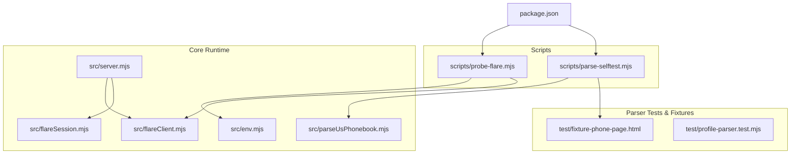
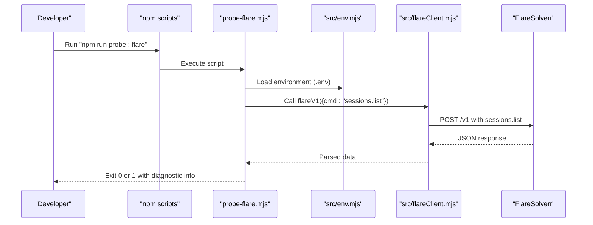
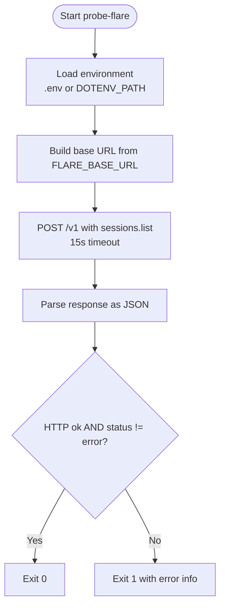
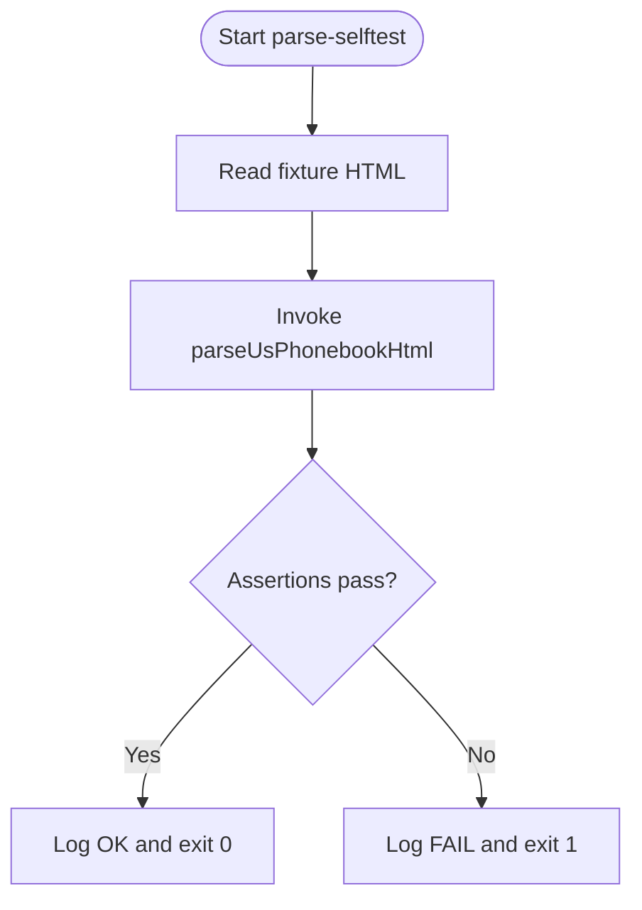
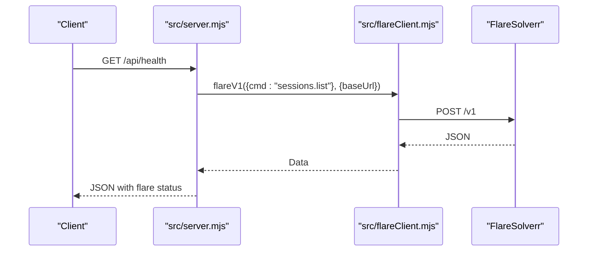
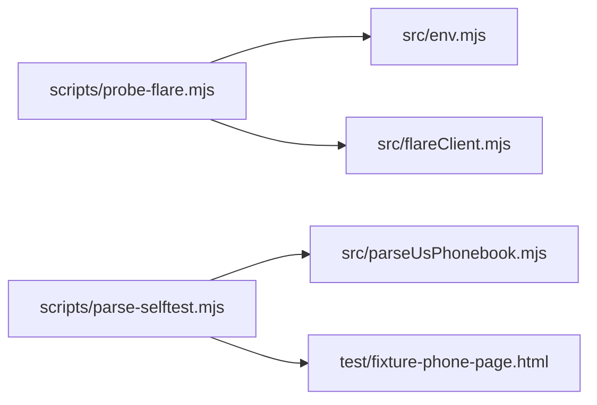

# Development Tools

<cite>
**Referenced Files in This Document**
- [scripts/probe-flare.mjs](file://scripts/probe-flare.mjs)
- [scripts/parse-selftest.mjs](file://scripts/parse-selftest.mjs)
- [package.json](file://package.json)
- [README.md](file://README.md)
- [src/env.mjs](file://src/env.mjs)
- [src/flareClient.mjs](file://src/flareClient.mjs)
- [src/flareSession.mjs](file://src/flareSession.mjs)
- [src/server.mjs](file://src/server.mjs)
- [src/parseUsPhonebook.mjs](file://src/parseUsPhonebook.mjs)
- [test/fixture-phone-page.html](file://test/fixture-phone-page.html)
- [test/profile-parser.test.mjs](file://test/profile-parser.test.mjs)
</cite>

## Table of Contents
1. [Introduction](#introduction)
2. [Project Structure](#project-structure)
3. [Core Components](#core-components)
4. [Architecture Overview](#architecture-overview)
5. [Detailed Component Analysis](#detailed-component-analysis)
6. [Dependency Analysis](#dependency-analysis)
7. [Performance Considerations](#performance-considerations)
8. [Troubleshooting Guide](#troubleshooting-guide)
9. [Conclusion](#conclusion)
10. [Appendices](#appendices)

## Introduction
This document explains the development tools designed to streamline local verification and debugging during development. It focuses on:
- probe-flare: a quick connectivity and capability checker for FlareSolverr
- parse-selftest: an offline parser validator that exercises HTML parsing without network or Flare

It provides both conceptual overviews for newcomers and technical details for experienced developers, including configuration, integration with the dev workflow, debugging techniques, and performance profiling tips. The terminology aligns with the codebase, including the tool names probe-flare and parse-selftest.

## Project Structure
The development tools are implemented as standalone scripts under scripts/, integrated into the project via npm scripts, and complemented by parser tests and fixtures.

**Diagram sources**
- [scripts/probe-flare.mjs:1-38](file://scripts/probe-flare.mjs#L1-L38)
- [scripts/parse-selftest.mjs:1-18](file://scripts/parse-selftest.mjs#L1-L18)
- [package.json:7-12](file://package.json#L7-L12)
- [src/env.mjs:1-8](file://src/env.mjs#L1-L8)
- [src/flareClient.mjs:1-35](file://src/flareClient.mjs#L1-L35)
- [src/flareSession.mjs:1-141](file://src/flareSession.mjs#L1-L141)
- [src/server.mjs:2425-2462](file://src/server.mjs#L2425-L2462)
- [src/parseUsPhonebook.mjs:1-103](file://src/parseUsPhonebook.mjs#L1-L103)
- [test/fixture-phone-page.html:1-29](file://test/fixture-phone-page.html#L1-L29)
- [test/profile-parser.test.mjs:1-78](file://test/profile-parser.test.mjs#L1-L78)

**Section sources**
- [package.json:7-12](file://package.json#L7-L12)
- [README.md:24-31](file://README.md#L24-L31)
- [README.md:155-159](file://README.md#L155-L159)

## Core Components
- probe-flare
  - Purpose: Verify FlareSolverr availability and responsiveness by sending a sessions.list command to the Flare base URL.
  - Behavior: Loads environment variables, constructs the Flare base URL, performs a POST to /v1 with a sessions.list command, parses the response, and exits with success or failure based on HTTP status and response content.
  - Configuration: Uses FLARE_BASE_URL (with a default fallback) and respects DOTENV_PATH if needed.
  - Integration: Mirrors the server’s health check logic and can be run independently to validate connectivity prior to starting the server.

- parse-selftest
  - Purpose: Validate the HTML parser against a known fixture without requiring network or Flare.
  - Behavior: Reads a static HTML fixture, invokes the parser, and asserts key fields to ensure correctness.
  - Integration: Provides a fast, offline way to verify parsing logic during development and CI.

**Section sources**
- [scripts/probe-flare.mjs:1-38](file://scripts/probe-flare.mjs#L1-L38)
- [scripts/parse-selftest.mjs:1-18](file://scripts/parse-selftest.mjs#L1-L18)
- [src/env.mjs:1-8](file://src/env.mjs#L1-L8)
- [src/flareClient.mjs:9-34](file://src/flareClient.mjs#L9-L34)
- [src/server.mjs:2425-2462](file://src/server.mjs#L2425-L2462)
- [src/parseUsPhonebook.mjs:14-102](file://src/parseUsPhonebook.mjs#L14-L102)
- [test/fixture-phone-page.html:1-29](file://test/fixture-phone-page.html#L1-L29)

## Architecture Overview
The development tools operate outside the main runtime but share configuration and error-handling patterns with the server.

**Diagram sources**
- [package.json:8](file://package.json#L8)
- [scripts/probe-flare.mjs:6](file://scripts/probe-flare.mjs#L6)
- [src/env.mjs:7](file://src/env.mjs#L7)
- [src/flareClient.mjs:9-34](file://src/flareClient.mjs#L9-L34)

## Detailed Component Analysis

### probe-flare
- Execution model
  - Loads environment variables from .env (or via DOTENV_PATH).
  - Constructs base URL from FLARE_BASE_URL with a trailing-slash removal.
  - Sends a POST request to /v1 with sessions.list payload and a 15-second timeout.
  - Parses the response; if non-JSON, wraps raw text; if JSON indicates error, marks failure.
  - Prints diagnostic info and exits with 0 on success, 1 on failure.

- Configuration options
  - FLARE_BASE_URL: FlareSolverr base URL (no path; API is at …/v1).
  - DOTENV_PATH: Absolute path to .env if the working directory is not the app root.

- Integration with development workflow
  - Run before starting the server to confirm Flare is reachable and responsive.
  - Useful when changing network topology, Docker networking, or proxy settings.

- Debugging techniques
  - If the tool fails, inspect the printed HTTP status and response content.
  - Pay attention to Docker internal IP vs. host LAN IP guidance; ensure port 8191 is published and reachable.

**Diagram sources**
- [scripts/probe-flare.mjs:6-37](file://scripts/probe-flare.mjs#L6-L37)

**Section sources**
- [scripts/probe-flare.mjs:1-38](file://scripts/probe-flare.mjs#L1-L38)
- [README.md:24-31](file://README.md#L24-L31)
- [README.md:20-22](file://README.md#L20-L22)

### parse-selftest
- Execution model
  - Reads a static HTML fixture from test/.
  - Invokes the parser to produce structured output.
  - Asserts expected fields (e.g., current owner name and relative presence).
  - Exits with success or failure accordingly.

- Offline validation
  - No network or Flare required.
  - Ideal for rapid feedback during parser development and refactoring.

- Extending functionality
  - Add more fixtures and assertions to cover additional parsing scenarios.
  - Integrate with the broader test suite via npm run test:parse.

**Diagram sources**
- [scripts/parse-selftest.mjs:7-17](file://scripts/parse-selftest.mjs#L7-L17)
- [src/parseUsPhonebook.mjs:14-102](file://src/parseUsPhonebook.mjs#L14-L102)
- [test/fixture-phone-page.html:1-29](file://test/fixture-phone-page.html#L1-L29)

**Section sources**
- [scripts/parse-selftest.mjs:1-18](file://scripts/parse-selftest.mjs#L1-L18)
- [src/parseUsPhonebook.mjs:14-102](file://src/parseUsPhonebook.mjs#L14-L102)
- [test/fixture-phone-page.html:1-29](file://test/fixture-phone-page.html#L1-L29)
- [README.md:155-159](file://README.md#L155-L159)

### Server-side Flare integration (for context)
- Health endpoint
  - The server exposes /api/health which calls sessions.list via flareV1 and returns a comprehensive status snapshot.
- Session management
  - The server can reuse Flare sessions and handles invalid-session errors gracefully.

**Diagram sources**
- [src/server.mjs:2425-2462](file://src/server.mjs#L2425-L2462)
- [src/flareClient.mjs:9-34](file://src/flareClient.mjs#L9-L34)

**Section sources**
- [src/server.mjs:2425-2462](file://src/server.mjs#L2425-L2462)
- [src/flareSession.mjs:25-72](file://src/flareSession.mjs#L25-L72)

## Dependency Analysis
- probe-flare depends on:
  - dotenv for environment loading
  - src/env.mjs for .env resolution
  - src/flareClient.mjs for the Flare API call pattern
- parse-selftest depends on:
  - src/parseUsPhonebook.mjs for parsing
  - test/fixture-phone-page.html for input

**Diagram sources**
- [scripts/probe-flare.mjs:1-6](file://scripts/probe-flare.mjs#L1-L6)
- [src/env.mjs:1-8](file://src/env.mjs#L1-L8)
- [src/flareClient.mjs:1-2](file://src/flareClient.mjs#L1-L2)
- [scripts/parse-selftest.mjs:1-4](file://scripts/parse-selftest.mjs#L1-L4)
- [src/parseUsPhonebook.mjs:1-1](file://src/parseUsPhonebook.mjs#L1-L1)
- [test/fixture-phone-page.html:1-1](file://test/fixture-phone-page.html#L1-L1)

**Section sources**
- [package.json:7-12](file://package.json#L7-L12)
- [scripts/probe-flare.mjs:1-6](file://scripts/probe-flare.mjs#L1-L6)
- [scripts/parse-selftest.mjs:1-4](file://scripts/parse-selftest.mjs#L1-L4)

## Performance Considerations
- probe-flare
  - Uses a short timeout to fail fast on network issues.
  - Avoids unnecessary Flare session reuse to minimize overhead.
- parse-selftest
  - Runs entirely offline; performance is bound by parser complexity and fixture size.
- Server-side
  - Session reuse can improve throughput but may increase memory/CPU usage; monitor and tune FLARE_REUSE_SESSION and FLARE_SESSION_TTL_MINUTES.

[No sources needed since this section provides general guidance]

## Troubleshooting Guide
- probe-flare fails with a timeout or connection error
  - Verify FLARE_BASE_URL points to a reachable host and published port (commonly 8191).
  - If using Docker, ensure the container’s port is published and the host IP is used, not an internal Docker bridge IP.
  - Confirm firewall/NAT rules allow inbound connections to the Flare host.
- probe-flare reports HTTP ok but response status is error
  - Inspect the printed JSON body for details; adjust FlareSolverr configuration or timeouts.
- parse-selftest fails
  - Review the assertion messages and compare parsed output to expectations.
  - Update the fixture or parser logic as needed; re-run to confirm fixes.
- Server health endpoint shows Flare errors
  - Use the same connectivity checks as probe-flare.
  - Consider enabling fallback engines (PROTECTED_FETCH_ENGINE=auto) and tuning timeouts and proxies.

**Section sources**
- [scripts/probe-flare.mjs:19-26](file://scripts/probe-flare.mjs#L19-L26)
- [README.md:105-118](file://README.md#L105-L118)
- [README.md:18-19](file://README.md#L18-L19)

## Conclusion
probe-flare and parse-selftest provide essential developer safety nets: one validates Flare connectivity and readiness, and the other ensures parsing logic remains correct without network dependencies. Together with the server’s health and trust endpoints, they form a robust development and debugging toolkit.

[No sources needed since this section summarizes without analyzing specific files]

## Appendices

### Tool usage and configuration
- probe-flare
  - Run: npm run probe:flare
  - Environment: FLARE_BASE_URL, DOTENV_PATH
- parse-selftest
  - Run: npm run test:parse
  - Inputs: test/fixture-phone-page.html
  - Outputs: parsed JSON on success; failure messages on assertion mismatch

**Section sources**
- [package.json:8-10](file://package.json#L8-L10)
- [README.md:24-31](file://README.md#L24-L31)
- [README.md:155-159](file://README.md#L155-L159)

### Best practices for development and debugging
- Use probe-flare before starting the server to catch Flare misconfiguration early.
- Keep parse-selftest updated alongside parser changes; treat it as a regression guard.
- Leverage server-side logging and trust metrics for ongoing diagnostics during development.
- Tune FlareSolverr settings (timeouts, media disabling, proxies) iteratively and validate with probe-flare.

[No sources needed since this section provides general guidance]