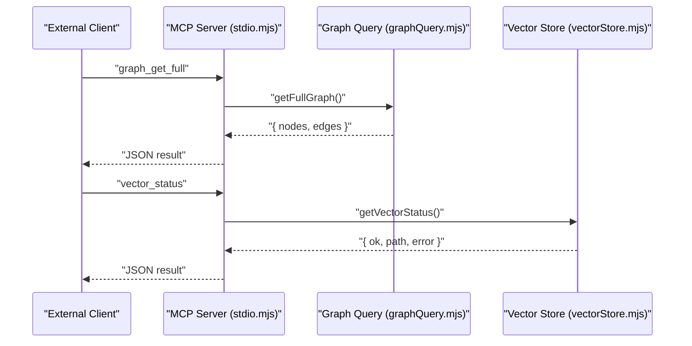
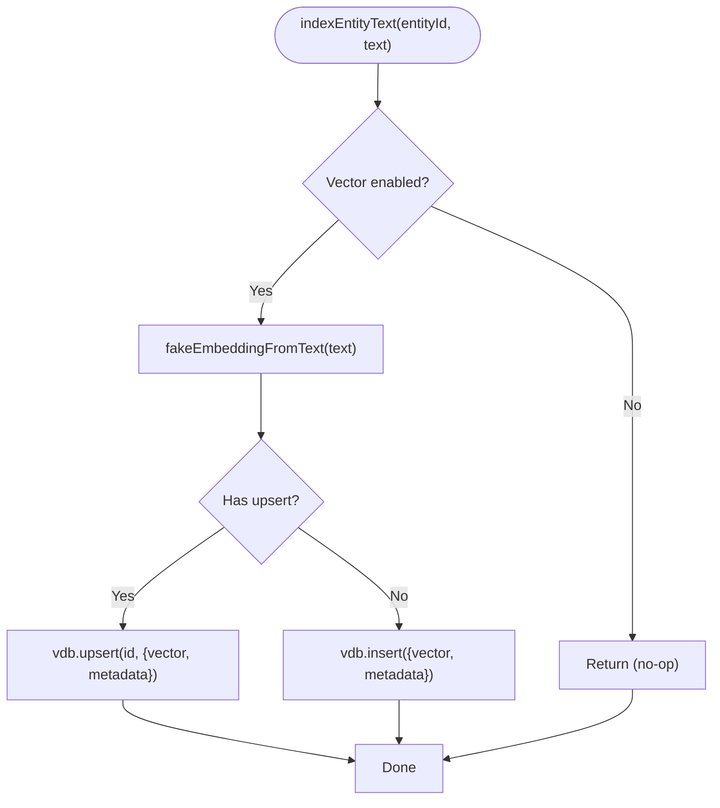
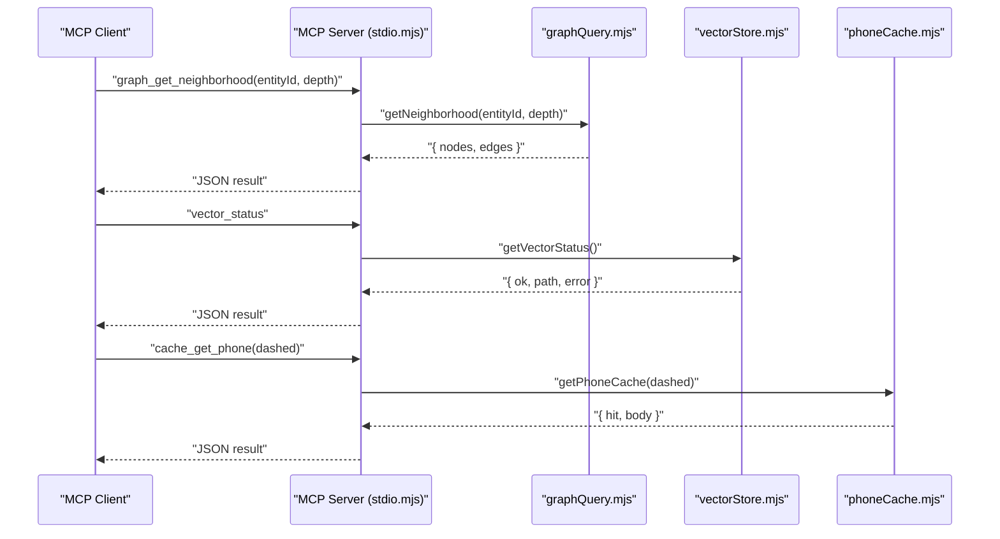
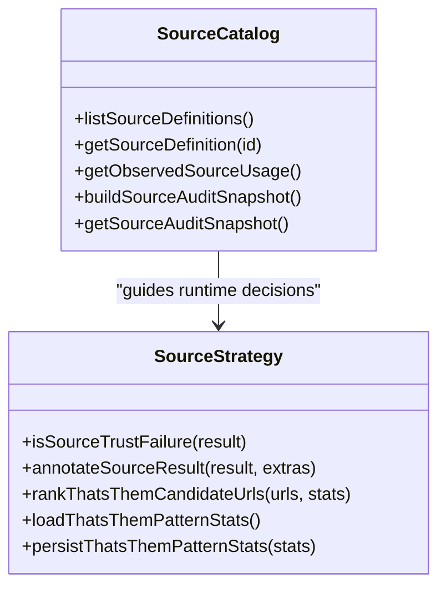
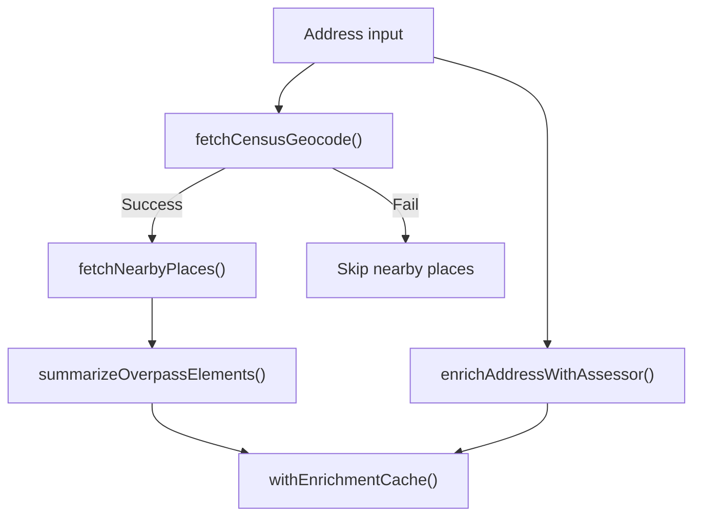
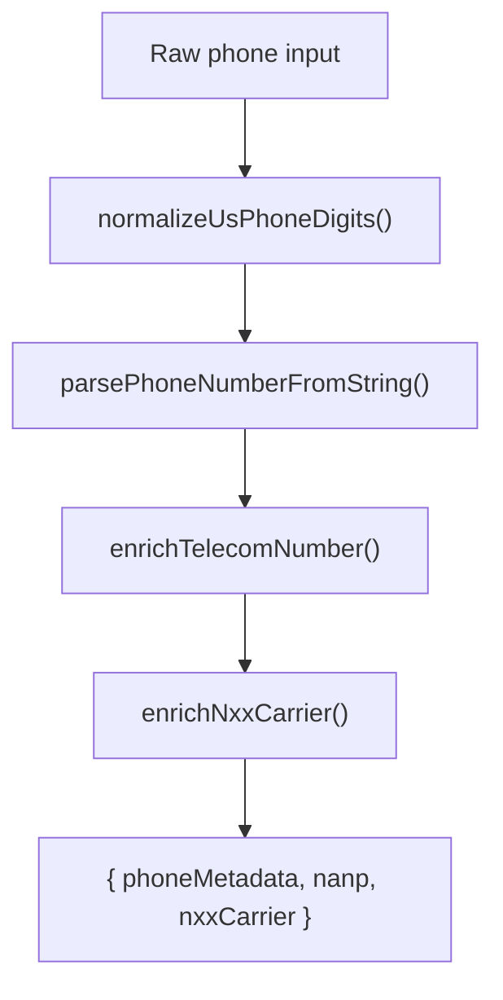
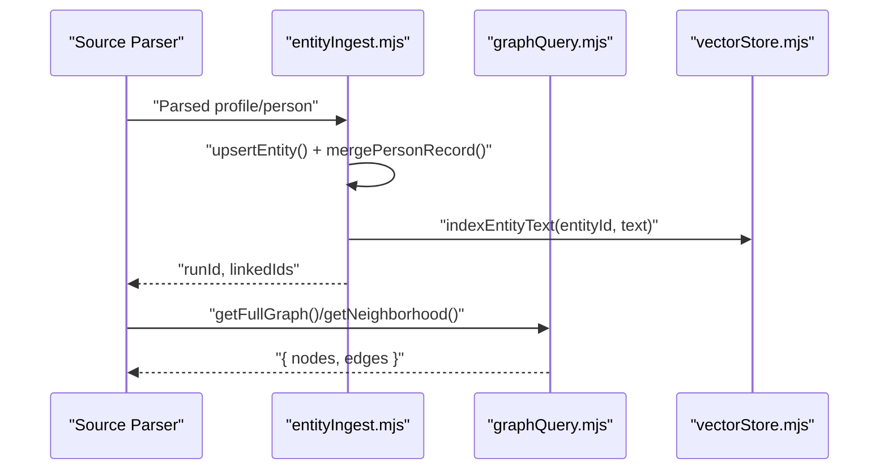
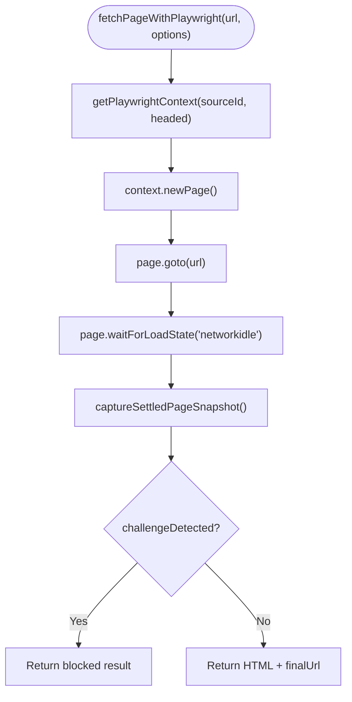
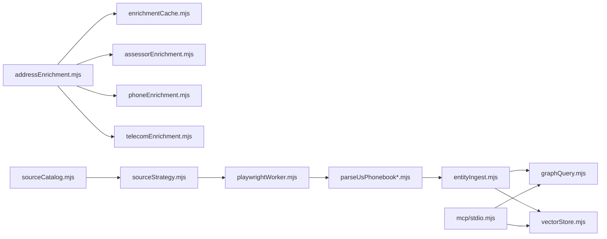

# Extension Points and Customization

<cite>
**Referenced Files in This Document**
- [vectorStore.mjs](file://src/vectorStore.mjs)
- [stdio.mjs](file://src/mcp/stdio.mjs)
- [sourceCatalog.mjs](file://src/sourceCatalog.mjs)
- [sourceStrategy.mjs](file://src/sourceStrategy.mjs)
- [addressEnrichment.mjs](file://src/addressEnrichment.mjs)
- [assessorEnrichment.mjs](file://src/assessorEnrichment.mjs)
- [phoneEnrichment.mjs](file://src/phoneEnrichment.mjs)
- [telecomEnrichment.mjs](file://src/telecomEnrichment.mjs)
- [enrichmentCache.mjs](file://src/enrichmentCache.mjs)
- [graphQuery.mjs](file://src/graphQuery.mjs)
- [entityIngest.mjs](file://src/entityIngest.mjs)
- [sourceSessions.mjs](file://src/sourceSessions.mjs)
- [parseUsPhonebook.mjs](file://src/parseUsPhonebook.mjs)
- [parseUsPhonebookNameSearch.mjs](file://src/parseUsPhonebookNameSearch.mjs)
- [parseUsPhonebookProfile.mjs](file://src/parseUsPhonebookProfile.mjs)
- [playwrightWorker.mjs](file://src/playwrightWorker.mjs)
</cite>

## Table of Contents
1. [Introduction](#introduction)
2. [Project Structure](#project-structure)
3. [Core Components](#core-components)
4. [Architecture Overview](#architecture-overview)
5. [Detailed Component Analysis](#detailed-component-analysis)
6. [Dependency Analysis](#dependency-analysis)
7. [Performance Considerations](#performance-considerations)
8. [Troubleshooting Guide](#troubleshooting-guide)
9. [Conclusion](#conclusion)
10. [Appendices](#appendices)

## Introduction
This document explains how to extend and customize the OSINT data collection and graph construction pipeline. It focuses on:
- Vector store integration for entity indexing and similarity search
- MCP protocol support for exposing graph and enrichment capabilities to external clients
- Extensible source adapter architecture for adding new external sources
- Configurable enrichment modules and graph maintenance hooks
- Practical examples and best practices for compatibility and performance

The goal is to help both beginners and experienced developers integrate new sources, enrichments, and graph capabilities while preserving reliability and performance.

## Project Structure
The system is organized around modular capabilities:
- Data ingestion and graph building
- Enrichment pipelines for addresses, phones, telecom, and assessor records
- Source catalogs and strategies for acquisition orchestration
- Vector store and MCP protocol server for advanced integrations
- Browser automation worker for JS-heavy sources

```mermaid
graph TB
subgraph "Ingestion"
E["entityIngest.mjs"]
GQ["graphQuery.mjs"]
end
subgraph "Enrichment"
AE["addressEnrichment.mjs"]
PE["phoneEnrichment.mjs"]
TE["telecomEnrichment.mjs"]
AS["assessorEnrichment.mjs"]
EC["enrichmentCache.mjs"]
end
subgraph "Sources"
SC["sourceCatalog.mjs"]
SS["sourceStrategy.mjs"]
PS["playwrightWorker.mjs"]
P1["parseUsPhonebook.mjs"]
P2["parseUsPhonebookNameSearch.mjs"]
P3["parseUsPhonebookProfile.mjs"]
end
subgraph "Integration"
VS["vectorStore.mjs"]
MCP["mcp/stdio.mjs"]
SES["sourceSessions.mjs"]
end
SC --> SS
SS --> PS
PS --> P1
PS --> P2
PS --> P3
P1 --> E
P2 --> E
P3 --> E
E --> GQ
AE --> EC
AS --> EC
PE --> EC
TE --> EC
VS --> E
MCP --> GQ
MCP --> VS
MCP --> SES
```

**Diagram sources**
- [entityIngest.mjs:1-665](file://src/entityIngest.mjs#L1-L665)
- [graphQuery.mjs:1-225](file://src/graphQuery.mjs#L1-L225)
- [addressEnrichment.mjs:1-386](file://src/addressEnrichment.mjs#L1-L386)
- [phoneEnrichment.mjs:1-126](file://src/phoneEnrichment.mjs#L1-L126)
- [telecomEnrichment.mjs:1-179](file://src/telecomEnrichment.mjs#L1-L179)
- [assessorEnrichment.mjs:1-835](file://src/assessorEnrichment.mjs#L1-L835)
- [enrichmentCache.mjs:1-117](file://src/enrichmentCache.mjs#L1-L117)
- [sourceCatalog.mjs:1-722](file://src/sourceCatalog.mjs#L1-L722)
- [sourceStrategy.mjs:1-208](file://src/sourceStrategy.mjs#L1-L208)
- [playwrightWorker.mjs:1-409](file://src/playwrightWorker.mjs#L1-L409)
- [parseUsPhonebook.mjs:1-103](file://src/parseUsPhonebook.mjs#L1-L103)
- [parseUsPhonebookNameSearch.mjs:1-109](file://src/parseUsPhonebookNameSearch.mjs#L1-L109)
- [parseUsPhonebookProfile.mjs:1-616](file://src/parseUsPhonebookProfile.mjs#L1-L616)
- [vectorStore.mjs:1-134](file://src/vectorStore.mjs#L1-L134)
- [stdio.mjs:1-107](file://src/mcp/stdio.mjs#L1-L107)
- [sourceSessions.mjs:1-172](file://src/sourceSessions.mjs#L1-L172)

**Section sources**
- [sourceCatalog.mjs:1-722](file://src/sourceCatalog.mjs#L1-L722)
- [entityIngest.mjs:1-665](file://src/entityIngest.mjs#L1-L665)
- [graphQuery.mjs:1-225](file://src/graphQuery.mjs#L1-L225)
- [vectorStore.mjs:1-134](file://src/vectorStore.mjs#L1-L134)
- [stdio.mjs:1-107](file://src/mcp/stdio.mjs#L1-L107)

## Core Components
- Vector store integration: optional embedding engine with deterministic hashing and upsert/search APIs
- MCP protocol server: exposes graph queries, entity search, cache stats, and vector status
- Source catalog and strategy: declarative definitions and runtime strategies for acquisition
- Enrichment modules: address geocoding, nearby places, assessor records, phone normalization, telecom classification
- Graph query and ingestion: entity creation, deduplication, edge linking, and vector indexing
- Browser automation worker: persistent Chromium contexts with challenge detection and guardrails

**Section sources**
- [vectorStore.mjs:1-134](file://src/vectorStore.mjs#L1-L134)
- [stdio.mjs:1-107](file://src/mcp/stdio.mjs#L1-L107)
- [sourceCatalog.mjs:1-722](file://src/sourceCatalog.mjs#L1-L722)
- [sourceStrategy.mjs:1-208](file://src/sourceStrategy.mjs#L1-L208)
- [addressEnrichment.mjs:1-386](file://src/addressEnrichment.mjs#L1-L386)
- [assessorEnrichment.mjs:1-835](file://src/assessorEnrichment.mjs#L1-L835)
- [phoneEnrichment.mjs:1-126](file://src/phoneEnrichment.mjs#L1-L126)
- [telecomEnrichment.mjs:1-179](file://src/telecomEnrichment.mjs#L1-L179)
- [enrichmentCache.mjs:1-117](file://src/enrichmentCache.mjs#L1-L117)
- [graphQuery.mjs:1-225](file://src/graphQuery.mjs#L1-L225)
- [entityIngest.mjs:1-665](file://src/entityIngest.mjs#L1-L665)
- [playwrightWorker.mjs:1-409](file://src/playwrightWorker.mjs#L1-L409)

## Architecture Overview
The system separates concerns into ingestion, enrichment, and integration layers:
- Ingestion builds the entity graph and indexes entities for vector search
- Enrichment augments data with external APIs and parsers
- Integration exposes capabilities externally via MCP and optional vector store

**Diagram sources**
- [stdio.mjs:1-107](file://src/mcp/stdio.mjs#L1-L107)
- [graphQuery.mjs:1-225](file://src/graphQuery.mjs#L1-L225)
- [vectorStore.mjs:73-84](file://src/vectorStore.mjs#L73-L84)

## Detailed Component Analysis

### Vector Store Integration
The vector store module provides:
- Optional initialization of an embedding database (ruvector) with cosine distance
- Deterministic 128-d embeddings derived from text hashes
- Indexing of entity text and similarity search by text
- Status reporting and graceful fallback when disabled

**Diagram sources**
- [vectorStore.mjs:91-111](file://src/vectorStore.mjs#L91-L111)

Practical customization:
- Enable vector store by setting the environment flag and configure storage path
- Extend embedding generation for real embeddings when ruvector is available
- Add new indexing strategies for different entity types

Compatibility and performance tips:
- Keep text sizes reasonable; metadata truncation prevents oversized payloads
- Use deterministic hashing to avoid recomputation overhead
- Monitor initialization errors and handle gracefully

**Section sources**
- [vectorStore.mjs:1-134](file://src/vectorStore.mjs#L1-L134)

### MCP Protocol Support
The MCP server exposes tools for:
- Retrieving the full graph
- Neighborhood exploration around an entity
- Entity label search
- Fetching a single entity by id
- Vector store status
- Phone cache read and stats
- Cache statistics

**Diagram sources**
- [stdio.mjs:1-107](file://src/mcp/stdio.mjs#L1-L107)
- [graphQuery.mjs:69-135](file://src/graphQuery.mjs#L69-L135)
- [vectorStore.mjs:73-84](file://src/vectorStore.mjs#L73-L84)

Customization examples:
- Add new tools for specialized queries or enrichment lookups
- Integrate additional caches or metrics endpoints
- Expose vector search results for semantic retrieval

**Section sources**
- [stdio.mjs:1-107](file://src/mcp/stdio.mjs#L1-L107)

### Extensible Source Adapter Architecture
The source catalog defines:
- Declarative source configurations with categories, access modes, and automation blueprints
- Observed usage tracking and audit snapshots
- Overlap groups and roadmap priorities

**Diagram sources**
- [sourceCatalog.mjs:524-722](file://src/sourceCatalog.mjs#L524-L722)
- [sourceStrategy.mjs:27-208](file://src/sourceStrategy.mjs#L27-L208)

Adding a new external source:
- Define a new source entry in the catalog with appropriate access mode and automation blueprint
- Implement a parser module similar to existing usphonebook parsers
- Wire the parser into ingestion and enrichment flows
- Configure session management and UI support if interactive sessions are needed

**Section sources**
- [sourceCatalog.mjs:1-722](file://src/sourceCatalog.mjs#L1-L722)
- [sourceStrategy.mjs:1-208](file://src/sourceStrategy.mjs#L1-L208)
- [parseUsPhonebook.mjs:1-103](file://src/parseUsPhonebook.mjs#L1-L103)
- [parseUsPhonebookNameSearch.mjs:1-109](file://src/parseUsPhonebookNameSearch.mjs#L1-L109)
- [parseUsPhonebookProfile.mjs:1-616](file://src/parseUsPhonebookProfile.mjs#L1-L616)

### Enrichment Modules
Address enrichment:
- Geocoding via U.S. Census API
- Nearby places via OpenStreetMap Overpass with rate-limiting and caching
- Assessor records with built-in Maine references and configurable external sources

**Diagram sources**
- [addressEnrichment.mjs:308-386](file://src/addressEnrichment.mjs#L308-L386)
- [assessorEnrichment.mjs:769-835](file://src/assessorEnrichment.mjs#L769-L835)
- [enrichmentCache.mjs:99-117](file://src/enrichmentCache.mjs#L99-L117)

Phone and telecom enrichment:
- Normalize and parse phone numbers
- Classify NANP line types and enrich with carrier data via LocalCallingGuide

**Diagram sources**
- [phoneEnrichment.mjs:1-126](file://src/phoneEnrichment.mjs#L1-L126)
- [telecomEnrichment.mjs:146-179](file://src/telecomEnrichment.mjs#L146-L179)

Extending enrichments:
- Add new enrichment producers with TTL-aware caching
- Integrate external APIs behind rate-limits and timeouts
- Emit structured metadata for provenance and explainability

**Section sources**
- [addressEnrichment.mjs:1-386](file://src/addressEnrichment.mjs#L1-L386)
- [assessorEnrichment.mjs:1-835](file://src/assessorEnrichment.mjs#L1-L835)
- [phoneEnrichment.mjs:1-126](file://src/phoneEnrichment.mjs#L1-L126)
- [telecomEnrichment.mjs:1-179](file://src/telecomEnrichment.mjs#L1-L179)
- [enrichmentCache.mjs:1-117](file://src/enrichmentCache.mjs#L1-L117)

### Graph Capabilities and Maintenance
Graph query and ingestion:
- Build nodes and edges from parsed sources
- Deduplicate persons by name/path heuristics
- Index entities for vector search during ingestion
- Provide neighborhood and full graph views

**Diagram sources**
- [entityIngest.mjs:470-665](file://src/entityIngest.mjs#L470-L665)
- [graphQuery.mjs:18-135](file://src/graphQuery.mjs#L18-L135)
- [vectorStore.mjs:91-111](file://src/vectorStore.mjs#L91-L111)

Extending graph capabilities:
- Add new edge kinds and metadata for richer relationships
- Implement custom deduplication rules for specialized entity types
- Extend vector indexing to new node types

**Section sources**
- [entityIngest.mjs:1-665](file://src/entityIngest.mjs#L1-L665)
- [graphQuery.mjs:1-225](file://src/graphQuery.mjs#L1-L225)
- [vectorStore.mjs:1-134](file://src/vectorStore.mjs#L1-L134)

### Browser Automation Worker
The worker provides:
- Persistent Chromium contexts per source family
- Challenge detection and settlement waits
- Guardrails against popups and dialogs
- Interactive page support for analyst workflows

**Diagram sources**
- [playwrightWorker.mjs:321-362](file://src/playwrightWorker.mjs#L321-L362)

Customization:
- Tune timeouts and viewport settings per source
- Add source-specific profile directories and storage-state checkpoints
- Extend challenge detection heuristics for new sites

**Section sources**
- [playwrightWorker.mjs:1-409](file://src/playwrightWorker.mjs#L1-L409)

## Dependency Analysis
Key dependencies and coupling:
- Ingestion depends on parsers and enrichment caches
- Enrichment modules depend on caching and external APIs
- MCP server depends on graph and vector store modules
- Source catalog and strategy coordinate acquisition orchestration
- Browser worker is decoupled and invoked by parsers

**Diagram sources**
- [parseUsPhonebook.mjs:1-103](file://src/parseUsPhonebook.mjs#L1-L103)
- [parseUsPhonebookNameSearch.mjs:1-109](file://src/parseUsPhonebookNameSearch.mjs#L1-L109)
- [parseUsPhonebookProfile.mjs:1-616](file://src/parseUsPhonebookProfile.mjs#L1-L616)
- [entityIngest.mjs:1-665](file://src/entityIngest.mjs#L1-L665)
- [graphQuery.mjs:1-225](file://src/graphQuery.mjs#L1-L225)
- [vectorStore.mjs:1-134](file://src/vectorStore.mjs#L1-L134)
- [addressEnrichment.mjs:1-386](file://src/addressEnrichment.mjs#L1-L386)
- [assessorEnrichment.mjs:1-835](file://src/assessorEnrichment.mjs#L1-L835)
- [phoneEnrichment.mjs:1-126](file://src/phoneEnrichment.mjs#L1-L126)
- [telecomEnrichment.mjs:1-179](file://src/telecomEnrichment.mjs#L1-L179)
- [enrichmentCache.mjs:1-117](file://src/enrichmentCache.mjs#L1-L117)
- [stdio.mjs:1-107](file://src/mcp/stdio.mjs#L1-L107)
- [sourceCatalog.mjs:1-722](file://src/sourceCatalog.mjs#L1-L722)
- [sourceStrategy.mjs:1-208](file://src/sourceStrategy.mjs#L1-L208)
- [playwrightWorker.mjs:1-409](file://src/playwrightWorker.mjs#L1-L409)

**Section sources**
- [sourceCatalog.mjs:1-722](file://src/sourceCatalog.mjs#L1-L722)
- [sourceStrategy.mjs:1-208](file://src/sourceStrategy.mjs#L1-L208)
- [entityIngest.mjs:1-665](file://src/entityIngest.mjs#L1-L665)
- [graphQuery.mjs:1-225](file://src/graphQuery.mjs#L1-L225)
- [vectorStore.mjs:1-134](file://src/vectorStore.mjs#L1-L134)
- [stdio.mjs:1-107](file://src/mcp/stdio.mjs#L1-L107)
- [addressEnrichment.mjs:1-386](file://src/addressEnrichment.mjs#L1-L386)
- [assessorEnrichment.mjs:1-835](file://src/assessorEnrichment.mjs#L1-L835)
- [phoneEnrichment.mjs:1-126](file://src/phoneEnrichment.mjs#L1-L126)
- [telecomEnrichment.mjs:1-179](file://src/telecomEnrichment.mjs#L1-L179)
- [enrichmentCache.mjs:1-117](file://src/enrichmentCache.mjs#L1-L117)
- [playwrightWorker.mjs:1-409](file://src/playwrightWorker.mjs#L1-L409)

## Performance Considerations
- Rate-limit external APIs and queue requests to avoid throttling
- Use caching with TTL to reduce redundant network calls
- Apply backpressure and concurrency controls in browser workflows
- Prefer deterministic hashing for embeddings to minimize compute
- Keep vector indexing minimal and targeted to high-value text fields
- Monitor MCP tool latency and cache hit rates

[No sources needed since this section provides general guidance]

## Troubleshooting Guide
Common issues and resolutions:
- Vector store disabled: verify environment flag and storage path; check initialization errors
- MCP tool failures: validate tool parameters and ensure modules are imported
- Browser challenges: adjust settle waits and enable challenge detection; clear profiles if stale
- Enrichment timeouts: increase timeouts and enforce max retries; monitor cache saturation
- Session states: use session manager to pause/resume sources and track warnings

**Section sources**
- [vectorStore.mjs:73-84](file://src/vectorStore.mjs#L73-L84)
- [stdio.mjs:1-107](file://src/mcp/stdio.mjs#L1-L107)
- [playwrightWorker.mjs:150-207](file://src/playwrightWorker.mjs#L150-L207)
- [enrichmentCache.mjs:19-41](file://src/enrichmentCache.mjs#L19-L41)
- [sourceSessions.mjs:1-172](file://src/sourceSessions.mjs#L1-L172)

## Conclusion
The system offers robust extension points:
- Vector store enables semantic search and similarity-based discovery
- MCP protocol opens the graph and enrichment capabilities to external tools
- Source catalog and strategy provide a declarative framework for adding new sources
- Enrichment modules are modular and cache-aware
- Graph ingestion and querying are designed for scalability and maintainability

Adopt the provided patterns to add new sources, enrichments, and integrations while preserving performance and compatibility.

[No sources needed since this section summarizes without analyzing specific files]

## Appendices

### Practical Examples

- Adding a new external source
  - Define a new entry in the source catalog with automation blueprint
  - Implement a parser module similar to existing usphonebook parsers
  - Integrate with ingestion and vector indexing
  - Configure session management and UI support

- Developing an enrichment module
  - Wrap external API calls with TTL-aware caching
  - Emit structured metadata for provenance
  - Handle timeouts and retry logic gracefully

- Extending graph capabilities
  - Add new edge kinds and metadata
  - Implement custom deduplication rules
  - Extend vector indexing to new node types

[No sources needed since this section provides general guidance]