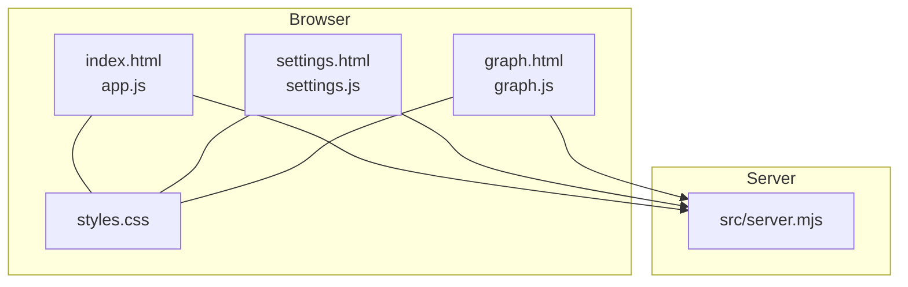
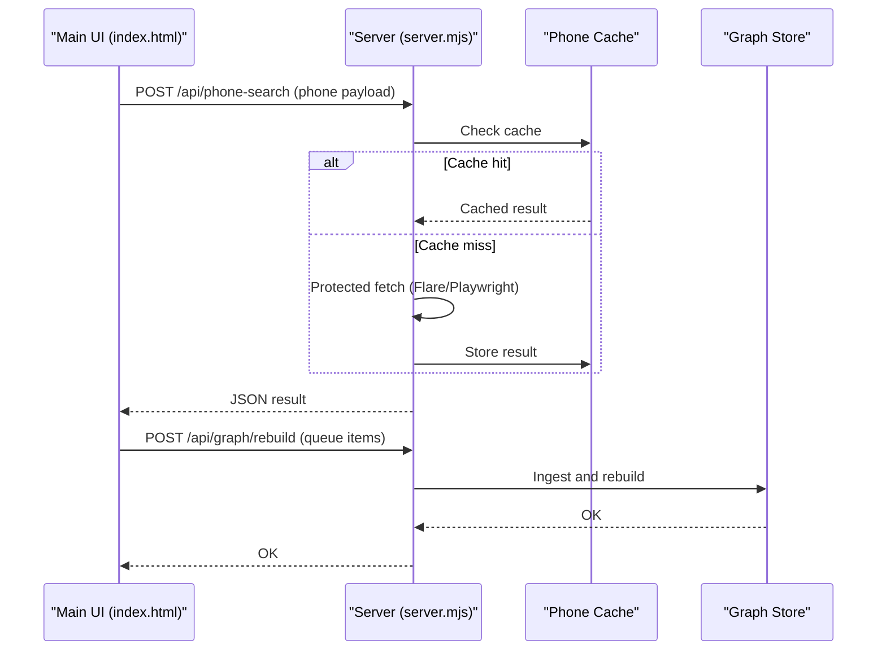
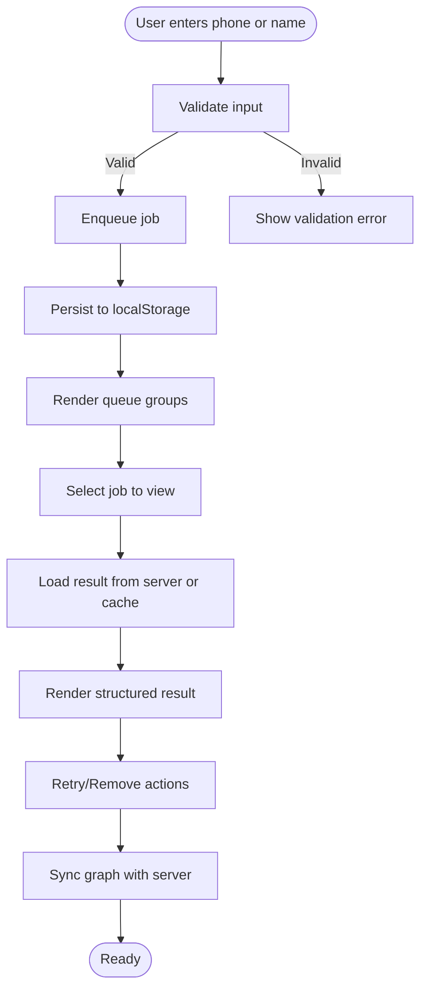
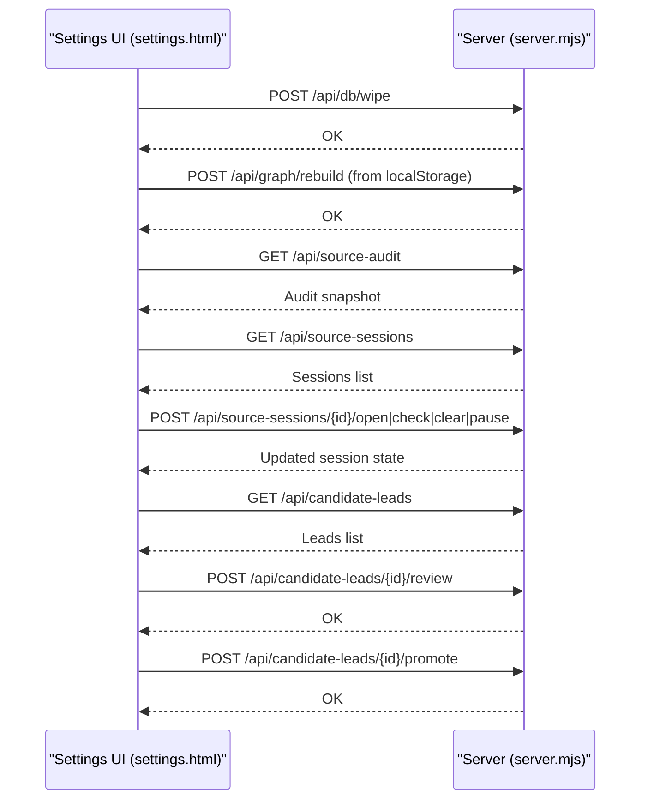
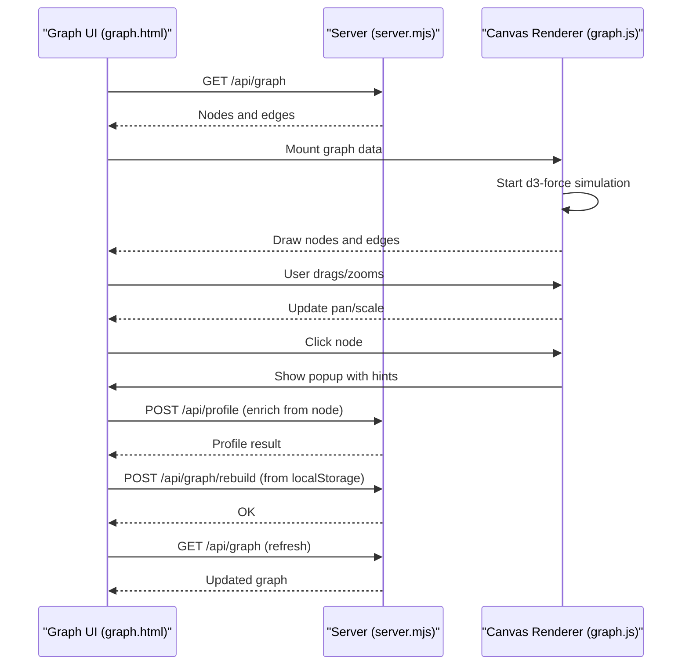
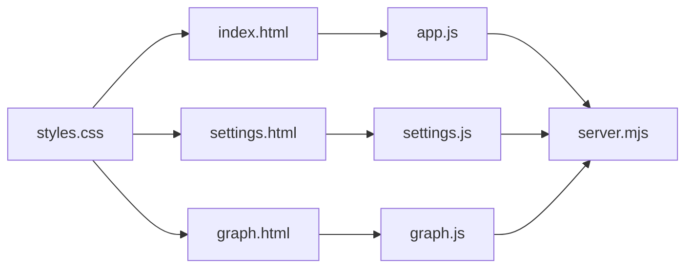

# Frontend Interface

<cite>
**Referenced Files in This Document**
- [index.html](file://public/index.html)
- [app.js](file://public/app.js)
- [settings.html](file://public/settings.html)
- [settings.js](file://public/settings.js)
- [graph.html](file://public/graph.html)
- [graph.js](file://public/graph.js)
- [styles.css](file://public/styles.css)
- [server.mjs](file://src/server.mjs)
- [README.md](file://README.md)
</cite>

## Table of Contents
1. [Introduction](#introduction)
2. [Project Structure](#project-structure)
3. [Core Components](#core-components)
4. [Architecture Overview](#architecture-overview)
5. [Detailed Component Analysis](#detailed-component-analysis)
6. [Dependency Analysis](#dependency-analysis)
7. [Performance Considerations](#performance-considerations)
8. [Troubleshooting Guide](#troubleshooting-guide)
9. [Conclusion](#conclusion)
10. [Appendices](#appendices)

## Introduction
This document describes the frontend interface for the USPhoneBook lookup application, focusing on user interaction and visualization components. It covers the main phone search interface, settings management, graph visualization, and responsive design. The documentation explains the component architecture, user interaction patterns, and data binding strategies, and provides both conceptual overviews for beginners and technical details for experienced developers. It also documents client-server communication, state management, browser compatibility, and accessibility considerations.

## Project Structure
The frontend consists of three primary pages:
- Main lookup interface: index.html with app.js for queue management, job execution, and result rendering
- Settings management: settings.html with settings.js for database maintenance, source sessions, and candidate lead review
- Graph visualization: graph.html with graph.js for d3-force layout, pan/zoom, and node interaction

The shared presentation layer is styled via styles.css, which defines a dark theme, responsive grid layout, and component-specific styles for cards, buttons, badges, and queues.

**Diagram sources**
- [index.html:1-222](file://public/index.html#L1-L222)
- [app.js:1-120](file://public/app.js#L1-L120)
- [settings.html:1-84](file://public/settings.html#L1-L84)
- [settings.js:1-50](file://public/settings.js#L1-L50)
- [graph.html:1-72](file://public/graph.html#L1-L72)
- [graph.js:1-20](file://public/graph.js#L1-L20)
- [styles.css:1-40](file://public/styles.css#L1-L40)
- [server.mjs:1-120](file://src/server.mjs#L1-L120)

**Section sources**
- [index.html:1-222](file://public/index.html#L1-L222)
- [settings.html:1-84](file://public/settings.html#L1-L84)
- [graph.html:1-72](file://public/graph.html#L1-L72)
- [styles.css:1-120](file://public/styles.css#L1-L120)
- [server.mjs:1-120](file://src/server.mjs#L1-L120)

## Core Components
- Main lookup interface (index.html + app.js)
  - Phone number search form and name search form
  - Job queue with grouped Lines, Names, and People
  - Result panel with structured display and external sources
  - Toast notifications and retry/remove controls
  - Local queue persistence and auto-retries
- Settings management (settings.html + settings.js)
  - Database reset and rebuild from queue
  - Source audit and session management
  - Candidate lead review and promotion
- Graph visualization (graph.html + graph.js)
  - d3-force layout with pan/zoom and node popup
  - Node enrichment from graph context
  - View reset and refresh controls

**Section sources**
- [index.html:38-217](file://public/index.html#L38-L217)
- [app.js:45-120](file://public/app.js#L45-L120)
- [settings.html:29-79](file://public/settings.html#L29-L79)
- [settings.js:53-95](file://public/settings.js#L53-L95)
- [graph.html:32-68](file://public/graph.html#L32-L68)
- [graph.js:96-177](file://public/graph.js#L96-L177)

## Architecture Overview
The frontend communicates with the server through RESTful endpoints exposed by the Express server. The main flows are:
- Lookup submission: POST /api/phone-search and POST /api/name-search
- Result retrieval: GET /api/phone-search and GET /api/name-search
- Graph synchronization: POST /api/graph/rebuild and GET /api/graph
- Session management: GET /api/source-sessions and POST /api/source-sessions/{sourceId}/{action}
- Database maintenance: POST /api/db/wipe and POST /api/graph/rebuild
- Candidate leads: GET /api/candidate-leads and POST /api/candidate-leads/{id}/{action}

**Diagram sources**
- [app.js:500-517](file://public/app.js#L500-L517)
- [server.mjs:674-789](file://src/server.mjs#L674-L789)

**Section sources**
- [app.js:500-517](file://public/app.js#L500-L517)
- [server.mjs:674-789](file://src/server.mjs#L674-L789)

## Detailed Component Analysis

### Main Phone Search Interface
The main interface provides two primary search modes:
- Phone number search: E.164-style input with numeric inputmode and submit button
- Name search: First and last name with optional city and state dropdown

The interface organizes results and queue state in three columns:
- Query column: search forms and instructions
- Result column: structured display of the selected job
- Queue column: grouped job list with status badges and actions

**Diagram sources**
- [index.html:52-155](file://public/index.html#L52-L155)
- [app.js:936-974](file://public/app.js#L936-L974)

Key implementation patterns:
- Input normalization for phone numbers and name searches
- Grouped queue rendering with Lines, Names, and People sections
- Status badges and retry/remove controls
- Auto-retries for transient network errors
- Local queue persistence with migration support

**Section sources**
- [index.html:52-155](file://public/index.html#L52-L155)
- [app.js:236-284](file://public/app.js#L236-L284)
- [app.js:1091-1160](file://public/app.js#L1091-L1160)
- [app.js:936-974](file://public/app.js#L936-L974)

### Settings Management
The settings page provides:
- Database reset and rebuild from browser queue
- Source audit and session management
- Candidate lead review and promotion

**Diagram sources**
- [settings.html:38-41](file://public/settings.html#L38-L41)
- [settings.js:71-86](file://public/settings.js#L71-L86)
- [settings.js:288-342](file://public/settings.js#L288-L342)
- [settings.js:344-451](file://public/settings.js#L344-L451)

**Section sources**
- [settings.html:38-79](file://public/settings.html#L38-L79)
- [settings.js:71-86](file://public/settings.js#L71-L86)
- [settings.js:288-342](file://public/settings.js#L288-L342)
- [settings.js:344-451](file://public/settings.js#L344-L451)

### Graph Visualization
The graph visualization uses d3-force for dynamic layout with pan/zoom and node interaction:
- Canvas-based rendering with node labels and colored circles
- Popup dialog with relationship hints and open actions
- Enrich from graph context (POST /api/profile with entries)
- Rebuild and refresh controls synchronized with queue state

**Diagram sources**
- [graph.html:42-62](file://public/graph.html#L42-L62)
- [graph.js:1289-1296](file://public/graph.js#L1289-L1296)
- [graph.js:1298-1346](file://public/graph.js#L1298-L1346)
- [graph.js:1084-1110](file://public/graph.js#L1084-L1110)

**Section sources**
- [graph.html:42-68](file://public/graph.html#L42-L68)
- [graph.js:1289-1346](file://public/graph.js#L1289-L1346)
- [graph.js:1084-1110](file://public/graph.js#L1084-L1110)

### Responsive Design and Accessibility
Responsive design is implemented using CSS Grid and media queries:
- Two-column layout on desktop (query + result) with a single column on mobile
- Flexible input layouts and button arrangements
- Accessible labels and ARIA attributes for icons and interactive elements

Accessibility features:
- Semantic HTML structure with header, main, and section elements
- Proper labeling of form inputs and buttons
- Focus management and keyboard navigation support
- Reduced motion preferences respected via CSS variables

**Section sources**
- [styles.css:99-114](file://public/styles.css#L99-L114)
- [styles.css:312-320](file://public/styles.css#L312-L320)
- [index.html:16-36](file://public/index.html#L16-L36)

## Dependency Analysis
The frontend components depend on:
- Shared styles (styles.css) for consistent theming and layout
- Server endpoints for all data operations
- Local storage for client-side state persistence
- Third-party libraries for graph rendering (d3.js)

**Diagram sources**
- [styles.css:1-40](file://public/styles.css#L1-L40)
- [index.html:13-14](file://public/index.html#L13-L14)
- [settings.html:13-14](file://public/settings.html#L13-L14)
- [graph.html:13-14](file://public/graph.html#L13-L14)
- [app.js:1-20](file://public/app.js#L1-L20)
- [settings.js:1-10](file://public/settings.js#L1-L10)
- [graph.js:1-15](file://public/graph.js#L1-L15)
- [server.mjs:1-20](file://src/server.mjs#L1-L20)

**Section sources**
- [styles.css:1-40](file://public/styles.css#L1-L40)
- [app.js:1-20](file://public/app.js#L1-L20)
- [settings.js:1-10](file://public/settings.js#L1-L10)
- [graph.js:1-15](file://public/graph.js#L1-L15)
- [server.mjs:1-20](file://src/server.mjs#L1-L20)

## Performance Considerations
- Local queue persistence reduces server round-trips for repeated lookups
- Auto-retries for transient network errors improve resilience
- Canvas-based graph rendering provides smooth pan/zoom interactions
- d3-force simulation stops when idle to conserve CPU
- External source enrichment is optional and can be disabled

## Troubleshooting Guide
Common UI issues and resolutions:
- Network errors: The UI shows toast notifications and retry buttons for failed jobs
- Session required: The UI prompts users to open a verification browser and check sessions
- Graph rebuild failures: The UI displays error messages and suggests rebuilding from queue
- Local storage quota exceeded: The UI truncates persisted queue to fit within limits

Accessibility and compatibility:
- The UI uses semantic HTML and ARIA attributes for assistive technologies
- CSS variables enable easy theme customization
- Media queries ensure responsive behavior across devices

**Section sources**
- [app.js:463-485](file://public/app.js#L463-L485)
- [app.js:532-550](file://public/app.js#L532-L550)
- [app.js:1361-1373](file://public/app.js#L1361-L1373)
- [graph.js:1353-1355](file://public/graph.js#L1353-L1355)

## Conclusion
The frontend interface provides a cohesive, responsive experience for phone and name search, integrated graph visualization, and comprehensive settings management. It balances user-friendly interaction with robust client-server communication, local state persistence, and accessibility considerations. The modular architecture enables clear separation of concerns across the main lookup, settings, and graph components.

## Appendices

### API Reference Summary
- Phone search: POST /api/phone-search with JSON payload; GET /api/phone-search for cached results
- Name search: POST /api/name-search with JSON payload; GET /api/name-search for cached results
- Graph: GET /api/graph for current graph; POST /api/graph/rebuild to synchronize from queue
- Sessions: GET /api/source-sessions; POST /api/source-sessions/{id}/open|check|clear|pause
- Database: POST /api/db/wipe to reset SQLite file
- Candidate leads: GET /api/candidate-leads; POST /api/candidate-leads/{id}/review|promote

**Section sources**
- [README.md:66-76](file://README.md#L66-L76)
- [app.js:500-517](file://public/app.js#L500-L517)
- [settings.js:71-86](file://public/settings.js#L71-L86)
- [graph.js:1289-1296](file://public/graph.js#L1289-L1296)