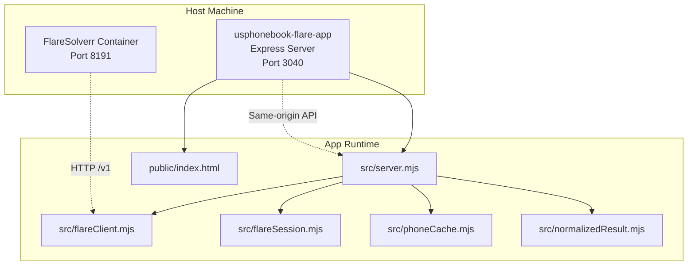
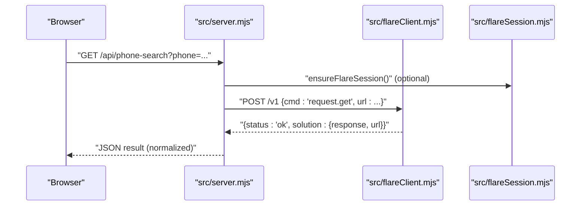
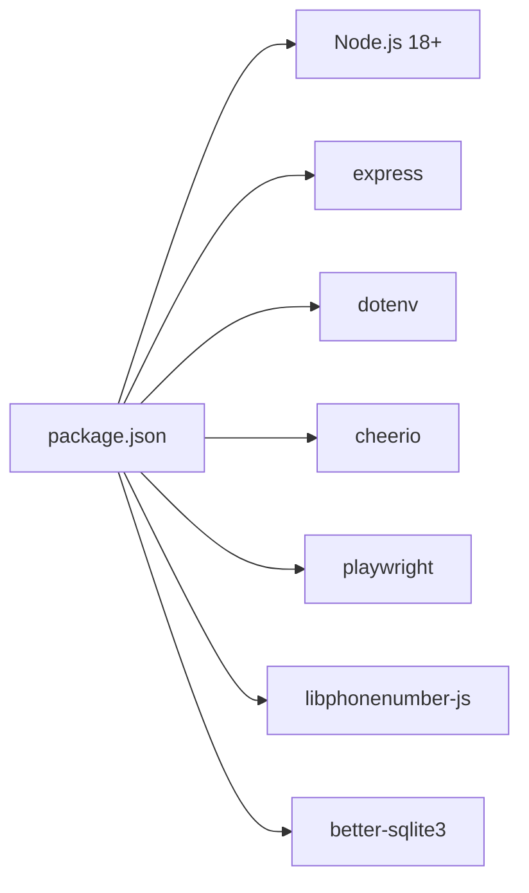

# Getting Started

<cite>
**Referenced Files in This Document**
- [README.md](file://README.md)
- [package.json](file://package.json)
- [env.example](file://env.example)
- [docker-compose.yml](file://docker-compose.yml)
- [src/env.mjs](file://src/env.mjs)
- [src/server.mjs](file://src/server.mjs)
- [src/flareClient.mjs](file://src/flareClient.mjs)
- [src/flareSession.mjs](file://src/flareSession.mjs)
- [src/phoneCache.mjs](file://src/phoneCache.mjs)
- [src/normalizedResult.mjs](file://src/normalizedResult.mjs)
- [scripts/probe-flare.mjs](file://scripts/probe-flare.mjs)
- [scripts/parse-selftest.mjs](file://scripts/parse-selftest.mjs)
- [public/index.html](file://public/index.html)
- [docs/osint-enrichment-roadmap.md](file://docs/osint-enrichment-roadmap.md)
- [docs/maine-assessor-integration.md](file://docs/maine-assessor-integration.md)
</cite>

## Table of Contents
1. [Introduction](#introduction)
2. [Project Structure](#project-structure)
3. [Core Components](#core-components)
4. [Architecture Overview](#architecture-overview)
5. [Detailed Component Analysis](#detailed-component-analysis)
6. [Dependency Analysis](#dependency-analysis)
7. [Performance Considerations](#performance-considerations)
8. [Troubleshooting Guide](#troubleshooting-guide)
9. [Conclusion](#conclusion)
10. [Appendices](#appendices)

## Introduction
This guide helps you install and run the USPhoneBook Flare App for the first time. The app fetches USPhoneBook search pages via a remote FlareSolverr instance (to bypass Cloudflare), then parses the results. It provides a local web UI and a set of /api endpoints that run on the same origin to simplify browser access.

Key prerequisite highlights:
- You must run FlareSolverr separately (e.g., in Docker) and expose port 8191.
- The app reads configuration from a .env file and starts an Express server on port 3040 by default.
- Node.js version 18+ is required.

## Project Structure
High-level layout relevant to setup and usage:
- Application server and API: src/server.mjs
- Environment loading: src/env.mjs
- FlareSolverr client and session management: src/flareClient.mjs, src/flareSession.mjs
- Phone search caching: src/phoneCache.mjs
- Normalized result schema: src/normalizedResult.mjs
- Static UI: public/index.html and related assets
- Configuration templates: env.example
- Docker orchestration for FlareSolverr: docker-compose.yml
- Scripts for health checks and tests: scripts/probe-flare.mjs, scripts/parse-selftest.mjs
- Documentation: README.md, docs/osint-enrichment-roadmap.md, docs/maine-assessor-integration.md

**Diagram sources**
- [docker-compose.yml:1-7](file://docker-compose.yml#L1-L7)
- [src/server.mjs:1-120](file://src/server.mjs#L1-L120)
- [src/flareClient.mjs:1-35](file://src/flareClient.mjs#L1-L35)
- [src/flareSession.mjs:1-141](file://src/flareSession.mjs#L1-L141)
- [src/phoneCache.mjs:1-161](file://src/phoneCache.mjs#L1-L161)
- [src/normalizedResult.mjs:1-160](file://src/normalizedResult.mjs#L1-L160)
- [public/index.html:1-222](file://public/index.html#L1-L222)

**Section sources**
- [README.md:1-120](file://README.md#L1-L120)
- [package.json:1-28](file://package.json#L1-L28)
- [docker-compose.yml:1-7](file://docker-compose.yml#L1-L7)
- [src/server.mjs:1-120](file://src/server.mjs#L1-L120)

## Core Components
- Environment configuration loader: Loads .env and exposes variables to the app.
- FlareSolverr client: Sends /v1 requests to the remote Flare instance.
- Session management: Optional reuse of a Flare session to speed up repeated requests.
- Phone search cache: In-memory SQLite-backed cache for repeat lookups.
- Normalized result builder: Produces a unified envelope for phone/name/profile results.
- Web UI: Provides a simple interface to enqueue phone/name searches and inspect results.

**Section sources**
- [src/env.mjs:1-8](file://src/env.mjs#L1-L8)
- [src/flareClient.mjs:1-35](file://src/flareClient.mjs#L1-L35)
- [src/flareSession.mjs:1-141](file://src/flareSession.mjs#L1-L141)
- [src/phoneCache.mjs:1-161](file://src/phoneCache.mjs#L1-L161)
- [src/normalizedResult.mjs:1-160](file://src/normalizedResult.mjs#L1-L160)
- [public/index.html:1-222](file://public/index.html#L1-L222)

## Architecture Overview
The app runs as a local Express server that:
- Validates environment variables from .env
- Optionally reuses a FlareSolverr session
- Fetches protected pages via FlareSolverr
- Parses HTML with cheerio
- Returns normalized results and maintains a local cache

**Diagram sources**
- [src/server.mjs:640-760](file://src/server.mjs#L640-L760)
- [src/flareClient.mjs:9-34](file://src/flareClient.mjs#L9-L34)
- [src/flareSession.mjs:25-72](file://src/flareSession.mjs#L25-L72)

## Detailed Component Analysis

### Initial Setup and First Run
Follow these steps to get the app running:

1) Install prerequisites
- Node.js: Version 18+ is required.
- Docker: Used to run FlareSolverr in a container.

2) Clone and prepare the repository
- Copy env.example to .env in the project root.
- Set FLARE_BASE_URL to point to your FlareSolverr instance (e.g., http://127.0.0.1:8191).
- Optionally configure APP_PORT if you need a different port.

3) Start FlareSolverr
- Use the provided docker-compose.yml to run FlareSolverr with port 8191 published.
- Ensure the container is reachable from the host machine.

4) Verify Flare connectivity
- Run the probe script to confirm Flare is reachable and responding.
- Fix FLARE_BASE_URL if the probe fails.

5) Install dependencies and start the app
- Install Node dependencies.
- Start the Express server.
- Access the UI at http://localhost:3040 (or your configured APP_PORT).

6) Perform your first phone lookup
- Enter a phone number in the UI and click Enqueue.
- Review the normalized results in the UI and/or via the /api endpoints.

**Section sources**
- [README.md:5-65](file://README.md#L5-L65)
- [env.example:1-106](file://env.example#L1-L106)
- [docker-compose.yml:1-7](file://docker-compose.yml#L1-L7)
- [scripts/probe-flare.mjs:1-38](file://scripts/probe-flare.mjs#L1-L38)
- [package.json:7-13](file://package.json#L7-L13)
- [src/server.mjs:98-104](file://src/server.mjs#L98-L104)
- [public/index.html:52-74](file://public/index.html#L52-L74)

### Environment Variables (.env)
Essential variables:
- FLARE_BASE_URL: Base URL for FlareSolverr without a trailing slash. Defaults to http://127.0.0.1:8191.
- APP_PORT: Port the Express server listens on (default 3040).
- Optional tuning: timeouts, media disabling, proxies, session reuse, and cache controls.

See the full list and defaults in env.example.

**Section sources**
- [env.example:1-106](file://env.example#L1-L106)
- [src/env.mjs:1-8](file://src/env.mjs#L1-L8)
- [src/server.mjs:98-126](file://src/server.mjs#L98-L126)

### FlareSolverr Connectivity and Health
- The app calls /v1 on your Flare instance to list sessions during health checks.
- The probe script performs a POST to /v1 with sessions.list and expects HTTP 200 with a non-error status.
- If the probe fails, adjust FLARE_BASE_URL to a reachable address (especially when using Docker internal IPs).

**Section sources**
- [scripts/probe-flare.mjs:1-38](file://scripts/probe-flare.mjs#L1-L38)
- [src/flareClient.mjs:9-34](file://src/flareClient.mjs#L9-L34)
- [README.md:24-31](file://README.md#L24-L31)

### Basic Usage Patterns
- Phone search:
  - GET /api/phone-search?phone=207-242-0526
  - POST /api/phone-search with JSON body containing phone and optional parameters
  - Repeat the same phone quickly returns cached results (cached: true) unless bypassed
- Name search:
  - GET /api/name-search?name=John+Doe&city=Portland&state=ME
  - POST /api/name-search with JSON body
- Engine selection:
  - Per-request parameter engine=flare|playwright-local|auto
  - Default engine is controlled by PROTECTED_FETCH_ENGINE

Results include a normalized envelope with schemaVersion, source, kind, query, meta, summary, and records.

**Section sources**
- [README.md:66-103](file://README.md#L66-L103)
- [src/server.mjs:791-800](file://src/server.mjs#L791-L800)
- [src/normalizedResult.mjs:167-244](file://src/normalizedResult.mjs#L167-L244)

### Security and Legal Considerations
- Use the app in compliance with USPhoneBook’s terms of service and applicable laws.
- Respect robots.txt and rate limits; avoid aggressive scraping.
- Consider privacy and data protection regulations when handling personal information.
- Keep engines and timeouts reasonable to minimize detection risk.

**Section sources**
- [README.md:103-103](file://README.md#L103-L103)

## Dependency Analysis
The app relies on:
- Node.js runtime (18+)
- Express for the HTTP server
- dotenv for environment loading
- cheerio for HTML parsing
- playwright for optional local protected-page fetching
- libphonenumber-js for phone metadata enrichment
- better-sqlite3 for local caching persistence

**Diagram sources**
- [package.json:14-26](file://package.json#L14-L26)

**Section sources**
- [package.json:1-28](file://package.json#L1-L28)

## Performance Considerations
- Session reuse: Enable FLARE_REUSE_SESSION to reuse a single Flare session across requests, reducing cold-start overhead. Use FLARE_SESSION_TTL_MINUTES to rotate sessions periodically.
- Media and timeouts: Disable media (FLARE_DISABLE_MEDIA=1) and tune FLARE_MAX_TIMEOUT_MS to improve reliability and speed.
- Cooldown: PROTECTED_FETCH_COOLDOWN_MS reduces burstiness between protected fetches.
- Caching: Phone cache reduces repeated Flare calls for identical numbers.

**Section sources**
- [README.md:132-137](file://README.md#L132-L137)
- [env.example:74-76](file://env.example#L74-L76)
- [src/phoneCache.mjs:4-11](file://src/phoneCache.mjs#L4-L11)
- [src/server.mjs:106-108](file://src/server.mjs#L106-L108)

## Troubleshooting Guide

Common issues and resolutions:
- FlareSolverr unreachable
  - Confirm FLARE_BASE_URL points to a reachable host:port.
  - Use the probe script to validate connectivity.
  - If using Docker, ensure port 8191 is published and accessible from the host.
- Firewall or Docker networking
  - Ensure the host firewall permits inbound TCP 8191 from the app host.
  - Avoid using Docker internal IPs (e.g., 172.19.x.x) for FLARE_BASE_URL when the app runs on the host.
- Challenge failures or timeouts
  - Increase FLARE_MAX_TIMEOUT_MS.
  - Disable media (FLARE_DISABLE_MEDIA=1).
  - Configure FLARE_PROXY_URL for outbound proxying.
  - Consider using PROTECTED_FETCH_ENGINE=auto to fallback to local Playwright when challenges occur.
- Local Playwright worker
  - Install Chromium via Playwright and set PROTECTED_FETCH_ENGINE=playwright-local or auto.

Verification commands:
- npm run probe:flare
- npm run test:parse
- npm run test:enrich

**Section sources**
- [README.md:105-131](file://README.md#L105-L131)
- [scripts/probe-flare.mjs:1-38](file://scripts/probe-flare.mjs#L1-L38)
- [README.md:155-159](file://README.md#L155-L159)
- [README.md:187-252](file://README.md#L187-L252)

## Conclusion
You are now ready to install the USPhoneBook Flare App, configure FlareSolverr, and perform your first phone lookups. Start with the probe script to validate Flare connectivity, then use the UI or /api endpoints to search. Adjust environment variables for performance and reliability, and consult the troubleshooting section for common issues.

## Appendices

### Step-by-Step First-Time Setup
1) Prepare .env
- Copy env.example to .env
- Set FLARE_BASE_URL to your FlareSolverr host and port
- Optionally set APP_PORT

2) Start FlareSolverr
- docker-compose up -d

3) Verify Flare
- npm run probe:flare

4) Install and run the app
- npm install
- npm start

5) Open the UI
- Visit http://localhost:3040
- Enter a phone number and click Enqueue

6) Review results
- Observe normalized results and cached responses

**Section sources**
- [env.example:1-106](file://env.example#L1-L106)
- [docker-compose.yml:1-7](file://docker-compose.yml#L1-L7)
- [scripts/probe-flare.mjs:1-38](file://scripts/probe-flare.mjs#L1-L38)
- [package.json:7-13](file://package.json#L7-L13)
- [public/index.html:52-74](file://public/index.html#L52-L74)

### Practical Examples
- Phone search via GET:
  - GET /api/phone-search?phone=207-242-0526&maxTimeout=240000&disableMedia=1
- Phone search via POST:
  - POST /api/phone-search with JSON body containing phone and optional proxy/url fields
- Name search via GET:
  - GET /api/name-search?name=John+Doe&city=Portland&state=ME&maxTimeout=240000&disableMedia=1
- Name search via POST:
  - POST /api/name-search with JSON body

Interpretation:
- Results include a normalized envelope with schemaVersion, source, kind, query, meta, summary, and records.
- meta contains URL, HTTP status, cache flags, and record counts.
- cached: true indicates the result came from the app cache.

**Section sources**
- [README.md:66-103](file://README.md#L66-L103)
- [src/normalizedResult.mjs:167-244](file://src/normalizedResult.mjs#L167-L244)

### Additional Configuration Notes
- Engine selection: engine=flare|playwright-local|auto
- Proxying: FLARE_PROXY_URL for default outbound proxy; per-request proxy.url supported
- Logging: SCRAPE_LOGGING and SCRAPE_PROGRESS_INTERVAL_MS control verbosity
- Public-source enrichment: Optional settings for Census, Overpass, and external people sources

**Section sources**
- [README.md:187-252](file://README.md#L187-L252)
- [env.example:36-76](file://env.example#L36-L76)

### OSINT Guidance and Enrichment Roadmap
- The OSINT Enrichment Roadmap outlines recommended improvements for ingestion, provenance, and enrichment layers.
- Maine Assessor Integration provides guidance for adding assessor sources and evaluating municipal sites.

**Section sources**
- [docs/osint-enrichment-roadmap.md:1-202](file://docs/osint-enrichment-roadmap.md#L1-L202)
- [docs/maine-assessor-integration.md:1-155](file://docs/maine-assessor-integration.md#L1-L155)