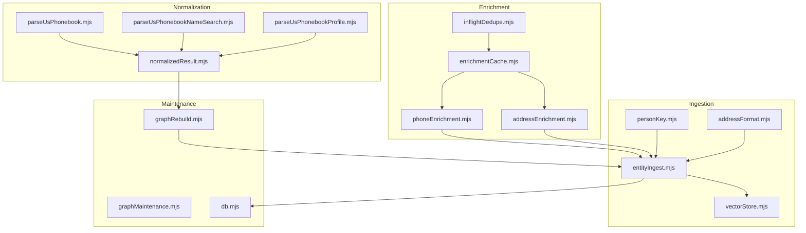
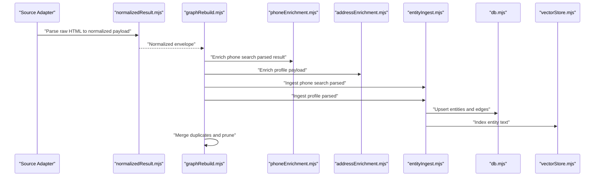
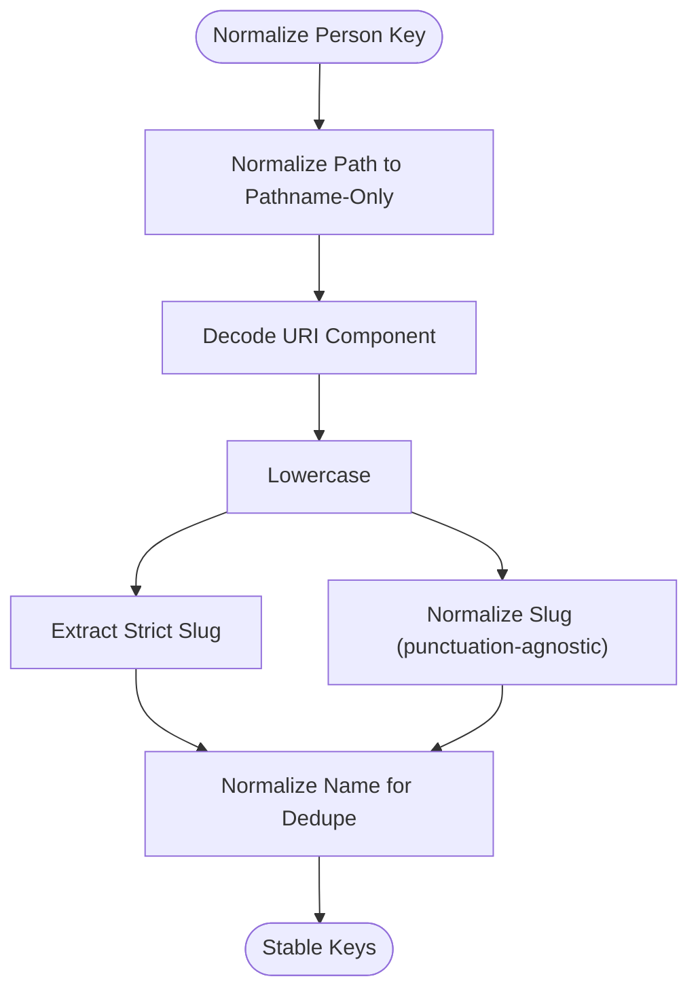
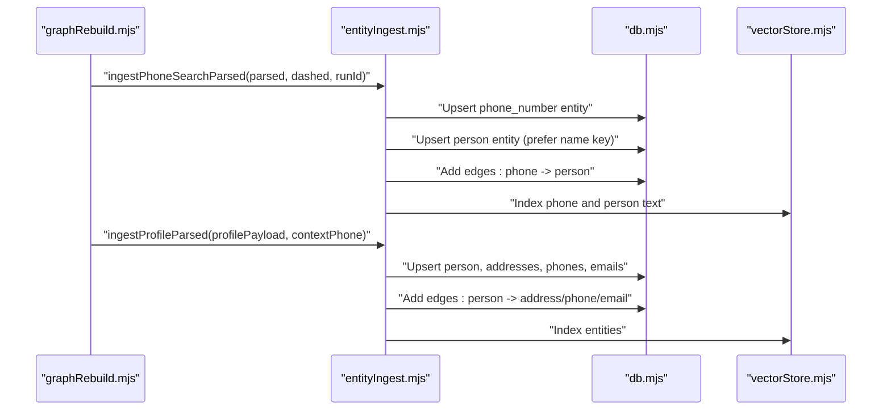
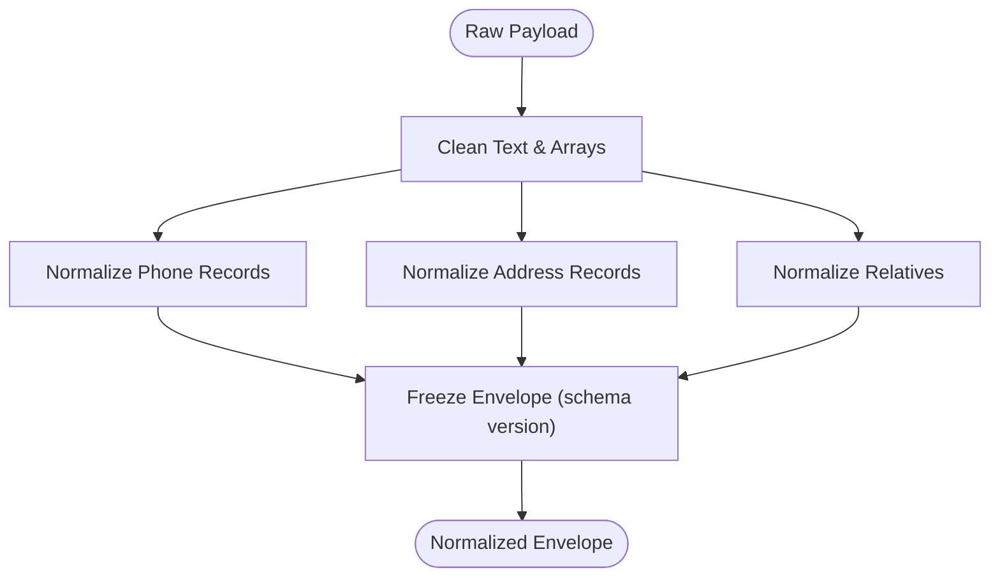
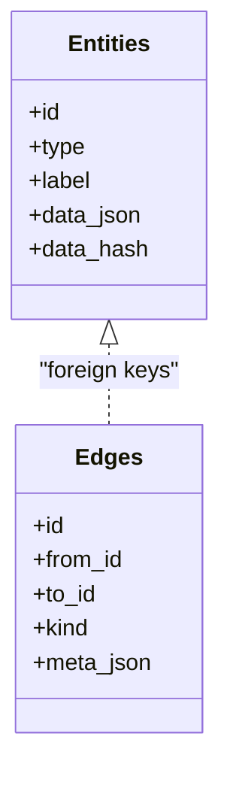
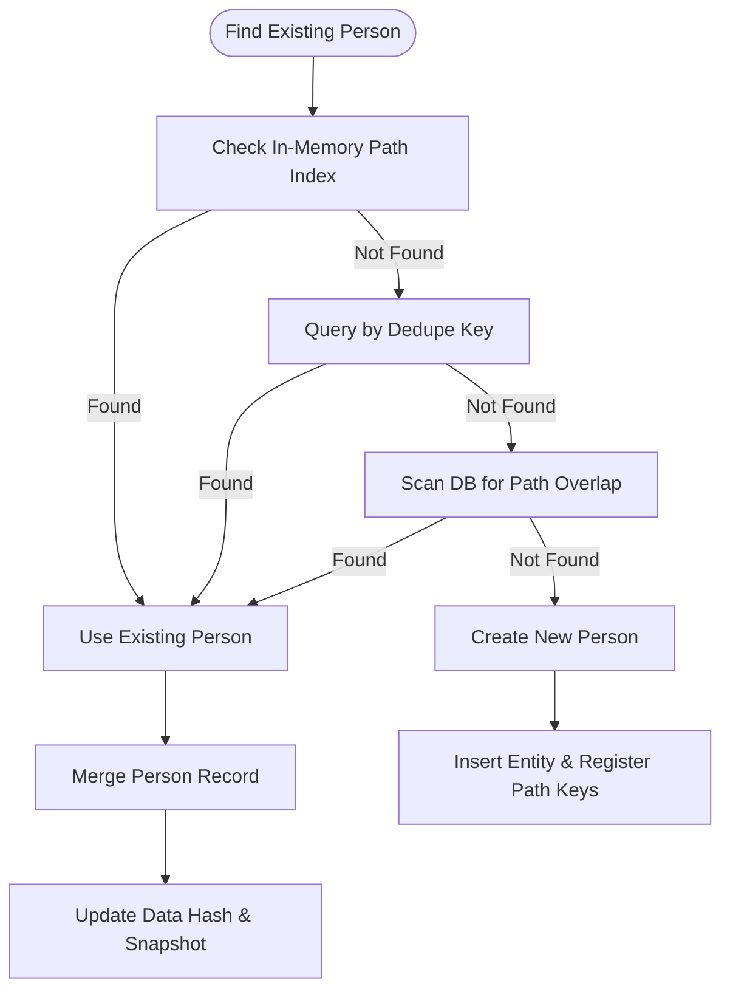
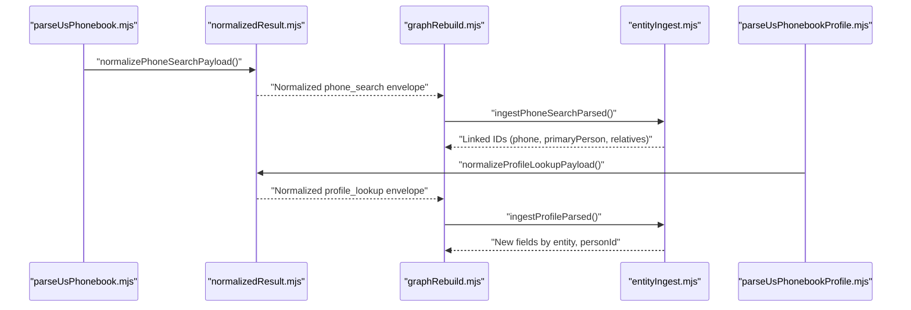
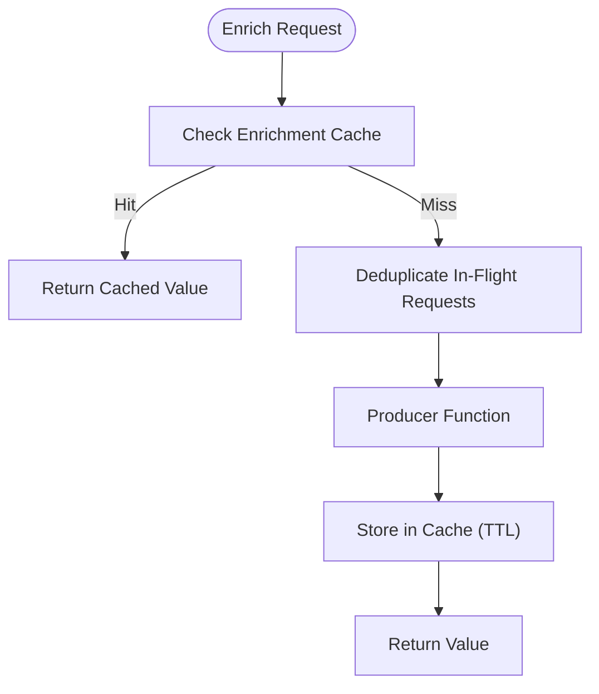
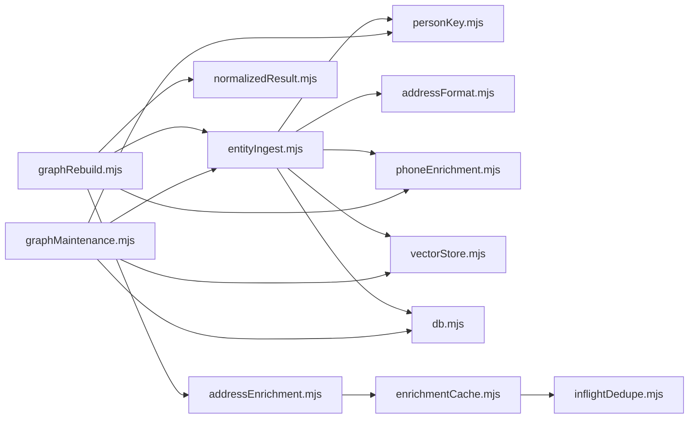

# Graph Construction

<cite>
**Referenced Files in This Document**
- [entityIngest.mjs](file://src/entityIngest.mjs)
- [personKey.mjs](file://src/personKey.mjs)
- [normalizedResult.mjs](file://src/normalizedResult.mjs)
- [graphRebuild.mjs](file://src/graphRebuild.mjs)
- [addressFormat.mjs](file://src/addressFormat.mjs)
- [phoneEnrichment.mjs](file://src/phoneEnrichment.mjs)
- [addressEnrichment.mjs](file://src/addressEnrichment.mjs)
- [vectorStore.mjs](file://src/vectorStore.mjs)
- [graphMaintenance.mjs](file://src/graphMaintenance.mjs)
- [db.mjs](file://src/db/db.mjs)
- [enrichmentCache.mjs](file://src/enrichmentCache.mjs)
- [inflightDedupe.mjs](file://src/inflightDedupe.mjs)
- [parseUsPhonebook.mjs](file://src/parseUsPhonebook.mjs)
- [parseUsPhonebookNameSearch.mjs](file://src/parseUsPhonebookNameSearch.mjs)
- [parseUsPhonebookProfile.mjs](file://src/parseUsPhonebookProfile.mjs)
</cite>

## Table of Contents
1. [Introduction](#introduction)
2. [Project Structure](#project-structure)
3. [Core Components](#core-components)
4. [Architecture Overview](#architecture-overview)
5. [Detailed Component Analysis](#detailed-component-analysis)
6. [Dependency Analysis](#dependency-analysis)
7. [Performance Considerations](#performance-considerations)
8. [Troubleshooting Guide](#troubleshooting-guide)
9. [Conclusion](#conclusion)

## Introduction
This document explains the graph construction subsystem responsible for transforming normalized search results and profiles into a relational graph of entities and edges. It covers:
- Entity ingestion pipeline that normalizes raw data from multiple sources
- Person key generation and deduplication strategies
- Entity creation and relationship establishment across people, phones, addresses, and emails
- Practical examples of transforming raw search results into graph-ready structures
- Deduplication, conflict resolution, and data quality checks
- Performance considerations for bulk ingestion and memory management

## Project Structure
The graph construction subsystem is centered around ingestion, normalization, enrichment, and maintenance utilities. The following diagram maps the primary modules involved in building the graph.

**Diagram sources**
- [parseUsPhonebook.mjs:1-103](file://src/parseUsPhonebook.mjs#L1-L103)
- [parseUsPhonebookNameSearch.mjs:1-109](file://src/parseUsPhonebookNameSearch.mjs#L1-L109)
- [parseUsPhonebookProfile.mjs:1-616](file://src/parseUsPhonebookProfile.mjs#L1-L616)
- [normalizedResult.mjs:1-506](file://src/normalizedResult.mjs#L1-L506)
- [graphRebuild.mjs:1-162](file://src/graphRebuild.mjs#L1-L162)
- [entityIngest.mjs:1-665](file://src/entityIngest.mjs#L1-L665)
- [personKey.mjs:1-258](file://src/personKey.mjs#L1-L258)
- [addressFormat.mjs:1-155](file://src/addressFormat.mjs#L1-L155)
- [phoneEnrichment.mjs:1-126](file://src/phoneEnrichment.mjs#L1-L126)
- [addressEnrichment.mjs:1-386](file://src/addressEnrichment.mjs#L1-L386)
- [enrichmentCache.mjs:1-117](file://src/enrichmentCache.mjs#L1-L117)
- [inflightDedupe.mjs:1-24](file://src/inflightDedupe.mjs#L1-L24)
- [vectorStore.mjs:1-134](file://src/vectorStore.mjs#L1-L134)
- [graphMaintenance.mjs:1-396](file://src/graphMaintenance.mjs#L1-L396)
- [db.mjs:1-185](file://src/db/db.mjs#L1-L185)

**Section sources**
- [graphRebuild.mjs:1-162](file://src/graphRebuild.mjs#L1-L162)
- [entityIngest.mjs:1-665](file://src/entityIngest.mjs#L1-L665)
- [normalizedResult.mjs:1-506](file://src/normalizedResult.mjs#L1-L506)
- [db.mjs:21-120](file://src/db/db.mjs#L21-L120)

## Core Components
- Person key generation and deduplication: Canonical path and slug-based keys, name normalization, and unique path handling.
- Entity ingestion: Upsert logic with merge snapshots, path indexing, and edge creation.
- Data normalization: Cleaning, compacting, and structuring phone, address, and profile records.
- Enrichment: Phone metadata, address geocoding, nearby places, and caching.
- Graph maintenance: Duplicate person merging, edge deduplication, and pruning.

**Section sources**
- [personKey.mjs:1-258](file://src/personKey.mjs#L1-L258)
- [entityIngest.mjs:1-665](file://src/entityIngest.mjs#L1-L665)
- [normalizedResult.mjs:1-506](file://src/normalizedResult.mjs#L1-L506)
- [addressEnrichment.mjs:1-386](file://src/addressEnrichment.mjs#L1-L386)
- [graphMaintenance.mjs:1-396](file://src/graphMaintenance.mjs#L1-L396)

## Architecture Overview
The ingestion pipeline follows a normalized → enriched → ingested → maintained workflow. The rebuild orchestrator coordinates conversion from normalized payloads to graph items, applies enrichment, and then ingests entities and edges into the database while maintaining graph integrity.

**Diagram sources**
- [normalizedResult.mjs:387-505](file://src/normalizedResult.mjs#L387-L505)
- [graphRebuild.mjs:25-96](file://src/graphRebuild.mjs#L25-L96)
- [phoneEnrichment.mjs:103-108](file://src/phoneEnrichment.mjs#L103-L108)
- [addressEnrichment.mjs:376-385](file://src/addressEnrichment.mjs#L376-L385)
- [entityIngest.mjs:470-552](file://src/entityIngest.mjs#L470-L552)
- [db.mjs:21-120](file://src/db/db.mjs#L21-L120)
- [vectorStore.mjs:91-111](file://src/vectorStore.mjs#L91-L111)

## Detailed Component Analysis

### Person Key Generation System
The person key system ensures stable deduplication across sources and profile variations:
- Path normalization: Extracts canonical pathname-only forms and decodes URI components.
- Slug extraction: Strict and loose slug keys derived from the path segment under /people/.
- Name normalization: Unicode normalization, punctuation handling, and lowercase conversion.
- Unique collections: Ensures unique profile paths and names to avoid duplication.

**Diagram sources**
- [personKey.mjs:11-121](file://src/personKey.mjs#L11-L121)
- [personKey.mjs:152-177](file://src/personKey.mjs#L152-L177)
- [personKey.mjs:206-221](file://src/personKey.mjs#L206-L221)

**Section sources**
- [personKey.mjs:1-258](file://src/personKey.mjs#L1-L258)

### Entity Ingest Pipeline
The ingestion pipeline handles:
- Upserting entities with deduplication keys and data hashing
- Merging person records with alias and path consolidation
- Creating edges between entities (e.g., phone assigned to person, person-to-address, person-to-phone, person-to-email)
- Indexing entity text for vector search
- Maintaining merge snapshots for auditability

**Diagram sources**
- [graphRebuild.mjs:36-91](file://src/graphRebuild.mjs#L36-L91)
- [entityIngest.mjs:470-552](file://src/entityIngest.mjs#L470-L552)
- [entityIngest.mjs:560-664](file://src/entityIngest.mjs#L560-L664)
- [vectorStore.mjs:91-111](file://src/vectorStore.mjs#L91-L111)

**Section sources**
- [entityIngest.mjs:233-296](file://src/entityIngest.mjs#L233-L296)
- [entityIngest.mjs:310-352](file://src/entityIngest.mjs#L310-L352)
- [entityIngest.mjs:354-367](file://src/entityIngest.mjs#L354-L367)
- [entityIngest.mjs:404-438](file://src/entityIngest.mjs#L404-L438)
- [entityIngest.mjs:470-552](file://src/entityIngest.mjs#L470-L552)
- [entityIngest.mjs:560-664](file://src/entityIngest.mjs#L560-L664)

### Data Normalization Processes
Normalization cleans and structures raw payloads:
- Phone records: dashed formatting, display fallback, metadata inclusion, and flags.
- Address records: label/formatted normalization, time ranges, periods, and geocoding keys.
- Relative persons: dedupe keys and alternate profile paths.
- Profile envelopes: schema versioning, query metadata, and summary statistics.

**Diagram sources**
- [normalizedResult.mjs:7-34](file://src/normalizedResult.mjs#L7-L34)
- [normalizedResult.mjs:88-144](file://src/normalizedResult.mjs#L88-L144)
- [normalizedResult.mjs:167-244](file://src/normalizedResult.mjs#L167-L244)
- [normalizedResult.mjs:250-331](file://src/normalizedResult.mjs#L250-L331)
- [normalizedResult.mjs:337-381](file://src/normalizedResult.mjs#L337-L381)

**Section sources**
- [normalizedResult.mjs:1-506](file://src/normalizedResult.mjs#L1-L506)

### Relationship Establishment
Relationships are established via directed edges with metadata:
- Phone assigned to person
- Person at address (with current flag)
- Person has phone (with current flag)
- Person has email
- Person relative to another person

**Diagram sources**
- [db.mjs:25-51](file://src/db/db.mjs#L25-L51)
- [entityIngest.mjs:354-367](file://src/entityIngest.mjs#L354-L367)
- [entityIngest.mjs:515-516](file://src/entityIngest.mjs#L515-L516)
- [entityIngest.mjs:607-624](file://src/entityIngest.mjs#L607-L624)
- [entityIngest.mjs:645-646](file://src/entityIngest.mjs#L645-L646)
- [entityIngest.mjs:660-661](file://src/entityIngest.mjs#L660-L661)

**Section sources**
- [entityIngest.mjs:354-367](file://src/entityIngest.mjs#L354-L367)
- [entityIngest.mjs:515-516](file://src/entityIngest.mjs#L515-L516)
- [entityIngest.mjs:607-624](file://src/entityIngest.mjs#L607-L624)
- [entityIngest.mjs:645-646](file://src/entityIngest.mjs#L645-L646)
- [entityIngest.mjs:660-661](file://src/entityIngest.mjs#L660-L661)

### Deduplication Strategies and Conflict Resolution
- In-memory path indexing: Maps profile paths to entity IDs for fast lookup and first-writer-wins semantics.
- Cross-row matching: Overlap detection across path, strict slug, and loose slug sets.
- Person record merging: Consolidates aliases, profile paths, and displays; prefers non-empty fields.
- Duplicate person merging: After ingestion, merges rows sharing normalized names and resolves edges.
- Edge deduplication: Removes parallel edges by group-by and minimum rowid selection.

**Diagram sources**
- [entityIngest.mjs:88-145](file://src/entityIngest.mjs#L88-L145)
- [entityIngest.mjs:233-296](file://src/entityIngest.mjs#L233-L296)
- [entityIngest.mjs:310-352](file://src/entityIngest.mjs#L310-L352)
- [graphMaintenance.mjs:90-177](file://src/graphMaintenance.mjs#L90-L177)
- [graphMaintenance.mjs:354-365](file://src/graphMaintenance.mjs#L354-L365)

**Section sources**
- [entityIngest.mjs:88-182](file://src/entityIngest.mjs#L88-L182)
- [entityIngest.mjs:233-296](file://src/entityIngest.mjs#L233-L296)
- [entityIngest.mjs:310-352](file://src/entityIngest.mjs#L310-L352)
- [graphMaintenance.mjs:90-177](file://src/graphMaintenance.mjs#L90-L177)
- [graphMaintenance.mjs:354-365](file://src/graphMaintenance.mjs#L354-L365)

### Practical Examples: From Raw Search Results to Graph-Ready Structures
- Phone search result: Parse HTML to normalized payload, enrich phone metadata, and ingest into graph with a primary person and relatives.
- Profile lookup: Parse profile HTML, normalize addresses and phones, enrich with geocoding and nearby places, and create person-entity plus edges.

**Diagram sources**
- [parseUsPhonebook.mjs:14-102](file://src/parseUsPhonebook.mjs#L14-L102)
- [normalizedResult.mjs:167-244](file://src/normalizedResult.mjs#L167-L244)
- [graphRebuild.mjs:36-64](file://src/graphRebuild.mjs#L36-L64)
- [entityIngest.mjs:470-552](file://src/entityIngest.mjs#L470-L552)
- [parseUsPhonebookProfile.mjs:253-616](file://src/parseUsPhonebookProfile.mjs#L253-L616)
- [normalizedResult.mjs:337-381](file://src/normalizedResult.mjs#L337-L381)
- [graphRebuild.mjs:78-91](file://src/graphRebuild.mjs#L78-L91)
- [entityIngest.mjs:560-664](file://src/entityIngest.mjs#L560-L664)

**Section sources**
- [parseUsPhonebook.mjs:14-102](file://src/parseUsPhonebook.mjs#L14-L102)
- [normalizedResult.mjs:167-244](file://src/normalizedResult.mjs#L167-L244)
- [graphRebuild.mjs:36-64](file://src/graphRebuild.mjs#L36-L64)
- [entityIngest.mjs:470-552](file://src/entityIngest.mjs#L470-L552)
- [parseUsPhonebookProfile.mjs:253-616](file://src/parseUsPhonebookProfile.mjs#L253-L616)
- [normalizedResult.mjs:337-381](file://src/normalizedResult.mjs#L337-L381)
- [graphRebuild.mjs:78-91](file://src/graphRebuild.mjs#L78-L91)
- [entityIngest.mjs:560-664](file://src/entityIngest.mjs#L560-L664)

### Enrichment and Caching
- Phone enrichment: Parses and normalizes phone numbers, producing standardized metadata.
- Address enrichment: Geocoding via Census, nearby places via Overpass, and optional assessor records.
- Enrichment cache: TTL-based caching with inflight de-duplication to avoid redundant network calls.

**Diagram sources**
- [phoneEnrichment.mjs:29-96](file://src/phoneEnrichment.mjs#L29-L96)
- [addressEnrichment.mjs:349-385](file://src/addressEnrichment.mjs#L349-L385)
- [enrichmentCache.mjs:99-116](file://src/enrichmentCache.mjs#L99-L116)
- [inflightDedupe.mjs:11-23](file://src/inflightDedupe.mjs#L11-L23)

**Section sources**
- [phoneEnrichment.mjs:1-126](file://src/phoneEnrichment.mjs#L1-L126)
- [addressEnrichment.mjs:1-386](file://src/addressEnrichment.mjs#L1-L386)
- [enrichmentCache.mjs:1-117](file://src/enrichmentCache.mjs#L1-L117)
- [inflightDedupe.mjs:1-24](file://src/inflightDedupe.mjs#L1-L24)

## Dependency Analysis
The ingestion and maintenance modules depend on shared utilities for keys, presentation, and persistence.

**Diagram sources**
- [entityIngest.mjs:1-15](file://src/entityIngest.mjs#L1-L15)
- [graphRebuild.mjs:1-13](file://src/graphRebuild.mjs#L1-L13)
- [graphMaintenance.mjs:1-5](file://src/graphMaintenance.mjs#L1-L5)
- [enrichmentCache.mjs:1-4](file://src/enrichmentCache.mjs#L1-L4)
- [inflightDedupe.mjs:1-24](file://src/inflightDedupe.mjs#L1-L24)

**Section sources**
- [entityIngest.mjs:1-15](file://src/entityIngest.mjs#L1-L15)
- [graphRebuild.mjs:1-13](file://src/graphRebuild.mjs#L1-L13)
- [graphMaintenance.mjs:1-5](file://src/graphMaintenance.mjs#L1-L5)
- [enrichmentCache.mjs:1-4](file://src/enrichmentCache.mjs#L1-L4)
- [inflightDedupe.mjs:1-24](file://src/inflightDedupe.mjs#L1-L24)

## Performance Considerations
- Bulk ingestion: Use non-destructive merge for incremental updates; destructive rebuild for full refreshes.
- Memory management: Clear in-memory path indices before rebuild; rely on database transactions for batch writes.
- Deduplication overhead: Prefer in-memory path index for O(1) lookups; fall back to DB scans only when necessary.
- Enrichment caching: TTL-based cache with inflight de-duplication reduces repeated network calls.
- Vector indexing: Optional; enable only when RUVECTOR_ENABLE=1 to avoid unnecessary overhead.
- Database tuning: WAL mode and foreign keys enabled; maintain indexes on entities and edges.

[No sources needed since this section provides general guidance]

## Troubleshooting Guide
- Duplicates persist after ingestion:
  - Verify person name deduplication and slug normalization.
  - Run duplicate person merging and edge deduplication steps.
- Missing edges:
  - Confirm that entities were upserted with correct dedupe keys and that edges are created with proper kinds and metadata.
- Stale enrichment data:
  - Check enrichment cache TTL and prune expired entries.
  - Inspect inflight de-duplication behavior to avoid race conditions.
- Large memory usage during rebuild:
  - Clear path indices before rebuild and avoid storing unnecessary intermediate structures.

**Section sources**
- [graphMaintenance.mjs:90-177](file://src/graphMaintenance.mjs#L90-L177)
- [graphMaintenance.mjs:354-365](file://src/graphMaintenance.mjs#L354-L365)
- [enrichmentCache.mjs:19-41](file://src/enrichmentCache.mjs#L19-L41)
- [inflightDedupe.mjs:11-23](file://src/inflightDedupe.mjs#L11-L23)
- [entityIngest.mjs:233-296](file://src/entityIngest.mjs#L233-L296)

## Conclusion
The graph construction subsystem integrates robust normalization, enrichment, and ingestion logic with strong deduplication and maintenance routines. By leveraging stable person keys, in-memory path indexing, and careful edge creation, it reliably transforms diverse raw sources into a coherent, deduplicated graph suitable for downstream analytics and visualization.