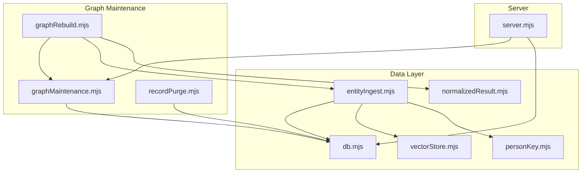
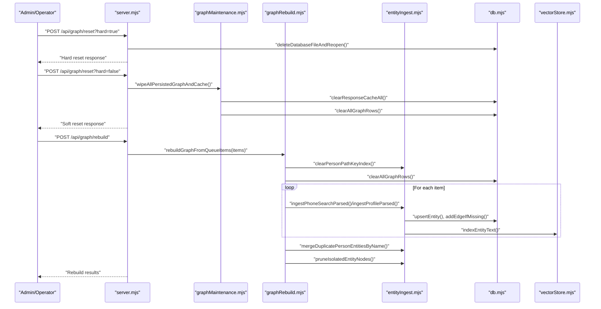
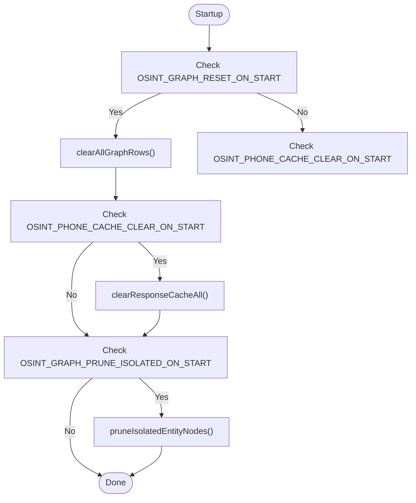
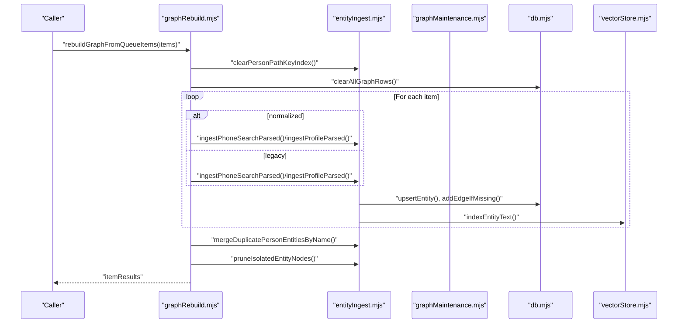
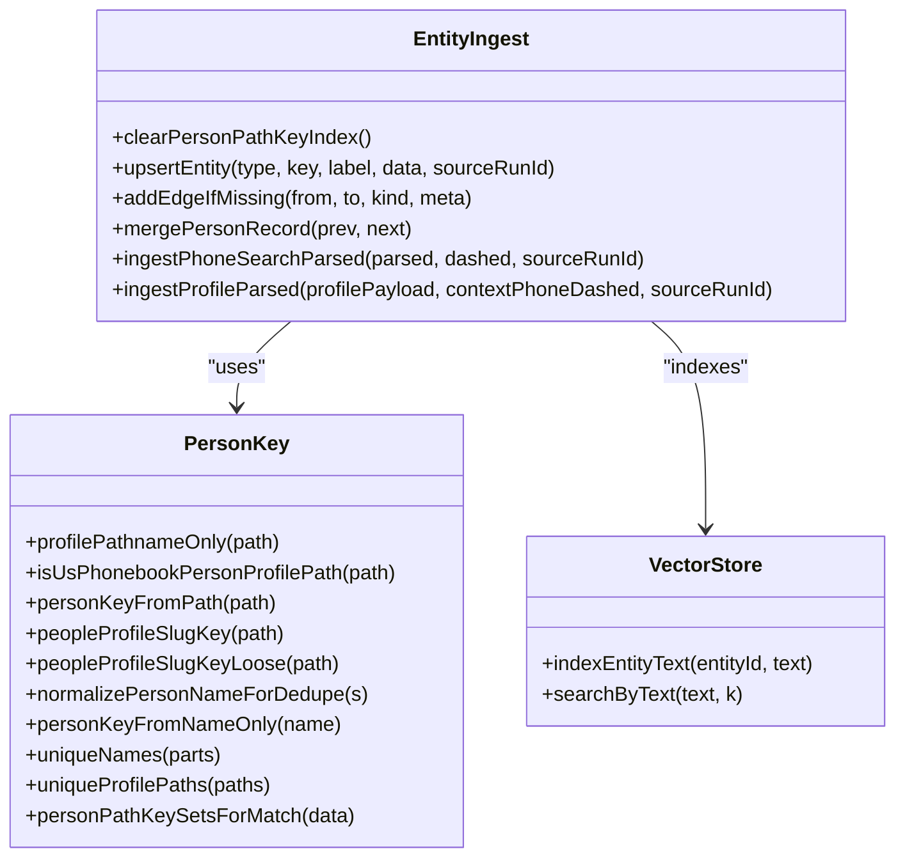
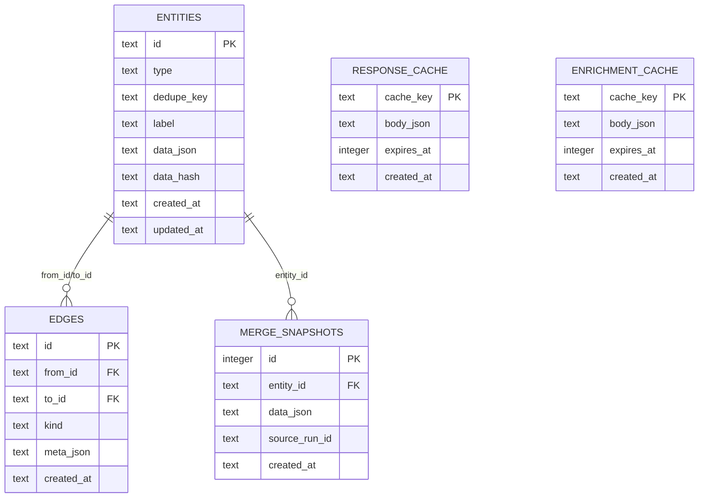
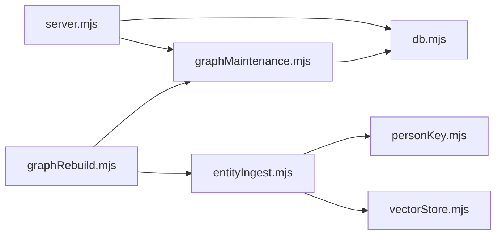

# Graph Maintenance

<cite>
**Referenced Files in This Document**
- [graphMaintenance.mjs](file://src/graphMaintenance.mjs)
- [graphRebuild.mjs](file://src/graphRebuild.mjs)
- [db.mjs](file://src/db/db.mjs)
- [entityIngest.mjs](file://src/entityIngest.mjs)
- [personKey.mjs](file://src/personKey.mjs)
- [vectorStore.mjs](file://src/vectorStore.mjs)
- [normalizedResult.mjs](file://src/normalizedResult.mjs)
- [recordPurge.mjs](file://src/recordPurge.mjs)
- [server.mjs](file://src/server.mjs)
</cite>

## Table of Contents
1. [Introduction](#introduction)
2. [Project Structure](#project-structure)
3. [Core Components](#core-components)
4. [Architecture Overview](#architecture-overview)
5. [Detailed Component Analysis](#detailed-component-analysis)
6. [Dependency Analysis](#dependency-analysis)
7. [Performance Considerations](#performance-considerations)
8. [Troubleshooting Guide](#troubleshooting-guide)
9. [Conclusion](#conclusion)
10. [Appendices](#appendices)

## Introduction
This document describes the graph maintenance subsystem responsible for graph rebuilding, cleanup operations, and performance optimization. It explains how the system reconstructs the entire graph from scratch when integrity issues are detected, cleans up orphaned entities, resolves broken relationships, and optimizes graph structure. It also documents automated maintenance routines, manual intervention procedures, monitoring systems for graph health, backup and restore procedures, emergency repair scenarios, performance impact, downtime considerations, and best practices for scheduled maintenance.

## Project Structure
The graph maintenance subsystem is implemented across several modules:
- Maintenance orchestration and cleanup: graphMaintenance.mjs
- Graph rebuild pipeline: graphRebuild.mjs
- Database schema and lifecycle: db.mjs
- Entity ingestion and deduplication: entityIngest.mjs
- Person key normalization and merging: personKey.mjs
- Vector indexing integration: vectorStore.mjs
- Normalized result conversion for rebuild: normalizedResult.mjs
- Targeted record deletion: recordPurge.mjs
- Health checks and maintenance endpoints: server.mjs

**Diagram sources**
- [graphMaintenance.mjs:1-396](file://src/graphMaintenance.mjs#L1-L396)
- [graphRebuild.mjs:1-162](file://src/graphRebuild.mjs#L1-L162)
- [db.mjs:1-185](file://src/db/db.mjs#L1-L185)
- [entityIngest.mjs:1-665](file://src/entityIngest.mjs#L1-L665)
- [personKey.mjs:1-258](file://src/personKey.mjs#L1-L258)
- [vectorStore.mjs:1-134](file://src/vectorStore.mjs#L1-L134)
- [normalizedResult.mjs:1-506](file://src/normalizedResult.mjs#L1-L506)
- [recordPurge.mjs:1-26](file://src/recordPurge.mjs#L1-L26)
- [server.mjs:1-200](file://src/server.mjs#L1-L200)

**Section sources**
- [graphMaintenance.mjs:1-396](file://src/graphMaintenance.mjs#L1-L396)
- [graphRebuild.mjs:1-162](file://src/graphRebuild.mjs#L1-L162)
- [db.mjs:1-185](file://src/db/db.mjs#L1-L185)
- [entityIngest.mjs:1-665](file://src/entityIngest.mjs#L1-L665)
- [personKey.mjs:1-258](file://src/personKey.mjs#L1-L258)
- [vectorStore.mjs:1-134](file://src/vectorStore.mjs#L1-L134)
- [normalizedResult.mjs:1-506](file://src/normalizedResult.mjs#L1-L506)
- [recordPurge.mjs:1-26](file://src/recordPurge.mjs#L1-L26)
- [server.mjs:1-200](file://src/server.mjs#L1-L200)

## Core Components
- Graph statistics and cleanup:
  - getGraphDataStats: reports counts for entities, edges, merge snapshots, and response cache.
  - clearAllGraphRows: removes all graph rows (merge history, edges, entities).
  - wipeAllPersistedGraphAndCache: clears response cache and graph tables; does not delete the database file.
  - clearResponseCacheAll: clears the persistent phone HTML cache.
- Cleanup operations:
  - pruneIsolatedEntityNodes: deletes entities with no incident edges, repeating until no rows removed.
  - mergeDuplicatePersonEntitiesByName: merges person entities sharing normalized display names, rewiring edges and removing duplicates.
- Startup maintenance:
  - runGraphStartupMaintenance: controlled by environment flags to reset graph, clear caches, or prune isolated nodes on startup.
- Graph rebuild:
  - rebuildGraphFromQueueItems: destructive rebuild from queue items; clears indexes, clears graph, ingests items, then deduplicates and prunes.
  - mergeGraphItems: non-destructive incremental merge of items into existing graph.
- Targeted deletion:
  - deleteGraphPhoneNode: deletes a phone_number node and associated edges by dashed phone number.

**Section sources**
- [graphMaintenance.mjs:16-56](file://src/graphMaintenance.mjs#L16-L56)
- [graphMaintenance.mjs:62-80](file://src/graphMaintenance.mjs#L62-L80)
- [graphMaintenance.mjs:90-177](file://src/graphMaintenance.mjs#L90-L177)
- [graphMaintenance.mjs:371-395](file://src/graphMaintenance.mjs#L371-L395)
- [graphRebuild.mjs:25-96](file://src/graphRebuild.mjs#L25-L96)
- [graphRebuild.mjs:108-161](file://src/graphRebuild.mjs#L108-L161)
- [recordPurge.mjs:11-25](file://src/recordPurge.mjs#L11-L25)

## Architecture Overview
The maintenance subsystem integrates with the ingestion pipeline and database layer. Rebuilds and merges leverage entity ingestion logic to create or update entities and edges, while cleanup operations prune orphaned nodes and remove duplicates. Vector indexing is invoked during ingestion to keep text indices aligned with graph updates.

**Diagram sources**
- [server.mjs:2400-2423](file://src/server.mjs#L2400-L2423)
- [graphMaintenance.mjs:44-48](file://src/graphMaintenance.mjs#L44-L48)
- [graphRebuild.mjs:25-96](file://src/graphRebuild.mjs#L25-L96)
- [entityIngest.mjs:470-552](file://src/entityIngest.mjs#L470-L552)
- [entityIngest.mjs:560-664](file://src/entityIngest.mjs#L560-L664)
- [vectorStore.mjs:91-111](file://src/vectorStore.mjs#L91-L111)
- [db.mjs:162-176](file://src/db/db.mjs#L162-L176)

## Detailed Component Analysis

### Graph Maintenance Orchestration
- Purpose: Provide maintenance primitives and startup routines to keep the graph healthy.
- Key functions:
  - getGraphDataStats: lightweight stats for monitoring.
  - clearAllGraphRows: transactional deletion of graph tables.
  - wipeAllPersistedGraphAndCache: clears response cache and graph tables.
  - clearResponseCacheAll: clears persistent phone HTML cache.
  - pruneIsolatedEntityNodes: iterative deletion of orphaned nodes.
  - mergeDuplicatePersonEntitiesByName: name-based deduplication with edge rewire and duplicate edge removal.
  - runGraphStartupMaintenance: controlled startup maintenance via environment flags.

**Diagram sources**
- [graphMaintenance.mjs:371-395](file://src/graphMaintenance.mjs#L371-L395)

**Section sources**
- [graphMaintenance.mjs:16-56](file://src/graphMaintenance.mjs#L16-L56)
- [graphMaintenance.mjs:62-80](file://src/graphMaintenance.mjs#L62-L80)
- [graphMaintenance.mjs:90-177](file://src/graphMaintenance.mjs#L90-L177)
- [graphMaintenance.mjs:371-395](file://src/graphMaintenance.mjs#L371-L395)

### Graph Rebuild Pipeline
- Purpose: Reconstruct the graph from scratch using normalized queue items.
- Key functions:
  - rebuildGraphFromQueueItems: destructive rebuild; clears indexes, clears graph, ingests items, then deduplicates and prunes.
  - mergeGraphItems: non-destructive incremental merge into existing graph.

**Diagram sources**
- [graphRebuild.mjs:25-96](file://src/graphRebuild.mjs#L25-L96)
- [entityIngest.mjs:470-552](file://src/entityIngest.mjs#L470-L552)
- [entityIngest.mjs:560-664](file://src/entityIngest.mjs#L560-L664)
- [graphMaintenance.mjs:90-177](file://src/graphMaintenance.mjs#L90-L177)

**Section sources**
- [graphRebuild.mjs:25-96](file://src/graphRebuild.mjs#L25-L96)
- [graphRebuild.mjs:108-161](file://src/graphRebuild.mjs#L108-L161)

### Entity Ingestion and Deduplication
- Purpose: Upsert entities, create edges, and manage person deduplication using path keys, slug keys, and name normalization.
- Key functions:
  - clearPersonPathKeyIndex: resets in-memory path/slug indexes before rebuild.
  - upsertEntity: inserts or updates entities, tracks merge snapshots, computes hashes.
  - addEdgeIfMissing: creates edges only if not present.
  - mergePersonRecord: merges person data preserving unique aliases and profile paths.
  - personDedupeKeyPreferName: prefers name-based keys when available.
  - personKeyFromPath, peopleProfileSlugKey, peopleProfileSlugKeyLoose: normalization and deduplication keys.
  - normalizePersonNameForDedupe: Unicode and spacing normalization for deduplication.

**Diagram sources**
- [entityIngest.mjs:39-664](file://src/entityIngest.mjs#L39-L664)
- [personKey.mjs:11-257](file://src/personKey.mjs#L11-L257)
- [vectorStore.mjs:91-133](file://src/vectorStore.mjs#L91-L133)

**Section sources**
- [entityIngest.mjs:39-664](file://src/entityIngest.mjs#L39-L664)
- [personKey.mjs:11-257](file://src/personKey.mjs#L11-L257)
- [vectorStore.mjs:91-133](file://src/vectorStore.mjs#L91-L133)

### Database Schema and Lifecycle
- Purpose: Define graph tables, indexes, and provide database lifecycle operations.
- Key elements:
  - entities, edges, response_cache, enrichment_cache, merge_snapshots, source_sessions, candidate_leads, thatsthem_pattern_stats.
  - getDb: initializes schema and returns connection.
  - deleteDatabaseFileAndReopen: deletes SQLite file and WAL sidecars, then reopens fresh database.

**Diagram sources**
- [db.mjs:21-120](file://src/db/db.mjs#L21-L120)

**Section sources**
- [db.mjs:21-120](file://src/db/db.mjs#L21-L120)
- [db.mjs:162-176](file://src/db/db.mjs#L162-L176)

### Targeted Deletion
- Purpose: Remove a specific phone node and associated edges without affecting other entities.
- Key function:
  - deleteGraphPhoneNode: validates dashed phone number, finds entity by dedupe key, deletes entity, returns result.

**Section sources**
- [recordPurge.mjs:11-25](file://src/recordPurge.mjs#L11-L25)

## Dependency Analysis
- Coupling:
  - graphMaintenance.mjs depends on db.mjs for SQL operations and entityIngest.mjs for deduplication helpers.
  - graphRebuild.mjs depends on graphMaintenance.mjs for cleanup and entityIngest.mjs for ingestion.
  - entityIngest.mjs depends on personKey.mjs for deduplication keys and vectorStore.mjs for indexing.
  - server.mjs orchestrates maintenance endpoints and invokes graphMaintenance.mjs and db.mjs.
- Cohesion:
  - Each module encapsulates a cohesive responsibility: maintenance, rebuild, ingestion, schema, and server endpoints.
- External dependencies:
  - better-sqlite3 for database operations.
  - ruvector for optional vector indexing.

**Diagram sources**
- [server.mjs:1-200](file://src/server.mjs#L1-L200)
- [graphMaintenance.mjs:1-396](file://src/graphMaintenance.mjs#L1-L396)
- [graphRebuild.mjs:1-162](file://src/graphRebuild.mjs#L1-L162)
- [entityIngest.mjs:1-665](file://src/entityIngest.mjs#L1-L665)
- [personKey.mjs:1-258](file://src/personKey.mjs#L1-L258)
- [vectorStore.mjs:1-134](file://src/vectorStore.mjs#L1-L134)
- [db.mjs:1-185](file://src/db/db.mjs#L1-L185)

**Section sources**
- [server.mjs:1-200](file://src/server.mjs#L1-L200)
- [graphMaintenance.mjs:1-396](file://src/graphMaintenance.mjs#L1-L396)
- [graphRebuild.mjs:1-162](file://src/graphRebuild.mjs#L1-L162)
- [entityIngest.mjs:1-665](file://src/entityIngest.mjs#L1-L664)
- [personKey.mjs:1-258](file://src/personKey.mjs#L1-L258)
- [vectorStore.mjs:1-134](file://src/vectorStore.mjs#L1-L134)
- [db.mjs:1-185](file://src/db/db.mjs#L1-L185)

## Performance Considerations
- Cleanup loops:
  - pruneIsolatedEntityNodes iterates up to a fixed bound to remove orphaned nodes; repeated deletions continue until no rows removed.
  - mergeDuplicatePersonEntitiesByName uses a union-find approach to group duplicates and processes groups in a transaction-safe manner.
- Indexing:
  - Vector indexing is invoked during ingestion; disabling vectorization reduces overhead.
- Transaction boundaries:
  - clearAllGraphRows wraps deletions in a transaction to minimize write amplification.
- Startup maintenance:
  - runGraphStartupMaintenance avoids unnecessary work by checking environment flags before performing operations.
- Recommendations:
  - Schedule rebuilds and maintenance during off-peak hours.
  - Monitor graph stats and prune isolated nodes periodically.
  - Consider disabling vector indexing in constrained environments.

[No sources needed since this section provides general guidance]

## Troubleshooting Guide
Common issues and resolutions:
- Graph integrity problems:
  - Symptoms: orphaned nodes, duplicate person entries, broken edges.
  - Actions: run pruneIsolatedEntityNodes and mergeDuplicatePersonEntitiesByName; verify with getGraphDataStats.
- Cache inconsistencies:
  - Symptoms: stale phone HTML responses.
  - Actions: clear response cache via wipeAllPersistedGraphAndCache or clearResponseCacheAll.
- Hard reset required:
  - Symptoms: corrupted database state.
  - Actions: use the server endpoint to perform a hard reset that deletes the SQLite file and WAL sidecars, then reopens a fresh database.
- Emergency repair:
  - Steps: soft reset (wipe graph and cache), then rebuild from queue items, then prune and deduplicate.

Operational endpoints:
- GET /api/graph/stats: retrieve current graph statistics.
- POST /api/graph/reset?hard=true: hard reset (deletes database file and WAL).
- POST /api/graph/reset?hard=false: soft reset (clears cache and graph rows).
- POST /api/graph/rebuild: rebuild graph from queue items.

**Section sources**
- [graphMaintenance.mjs:16-56](file://src/graphMaintenance.mjs#L16-L56)
- [graphMaintenance.mjs:44-56](file://src/graphMaintenance.mjs#L44-L56)
- [graphMaintenance.mjs:62-80](file://src/graphMaintenance.mjs#L62-L80)
- [graphMaintenance.mjs:90-177](file://src/graphMaintenance.mjs#L90-L177)
- [server.mjs:2400-2423](file://src/server.mjs#L2400-L2423)
- [server.mjs:2489-2495](file://src/server.mjs#L2489-L2495)

## Conclusion
The graph maintenance subsystem provides robust mechanisms to keep the graph healthy: targeted cleanup, deduplication, and rebuild capabilities. By combining automated startup maintenance with manual endpoints, operators can maintain data integrity, optimize structure, and recover from corruption efficiently. Monitoring via health and stats endpoints ensures visibility into graph state and performance.

[No sources needed since this section summarizes without analyzing specific files]

## Appendices

### Practical Maintenance Workflows
- Scheduled maintenance:
  - Off-peak: run pruneIsolatedEntityNodes and mergeDuplicatePersonEntitiesByName; monitor with getGraphDataStats.
  - Monthly: soft reset (wipe cache and graph) to clear stale data.
- Integrity checks:
  - After major updates: rebuild from queue items to reconcile data; then prune and deduplicate.
- Emergency repair:
  - If corruption suspected: hard reset via server endpoint, then rebuild from queue items.

[No sources needed since this section provides general guidance]

### Backup and Restore Procedures
- Backup:
  - Back up the SQLite database file and WAL sidecars before performing destructive operations.
- Restore:
  - Stop the service, replace the database file with the backup copy, then restart the service.

[No sources needed since this section provides general guidance]

### Environment Flags for Automated Maintenance
- OSINT_GRAPH_RESET_ON_START: reset graph on startup.
- OSINT_PHONE_CACHE_CLEAR_ON_START: clear response cache on startup.
- OSINT_GRAPH_PRUNE_ISOLATED_ON_START: prune isolated nodes on startup.

**Section sources**
- [graphMaintenance.mjs:371-395](file://src/graphMaintenance.mjs#L371-L395)