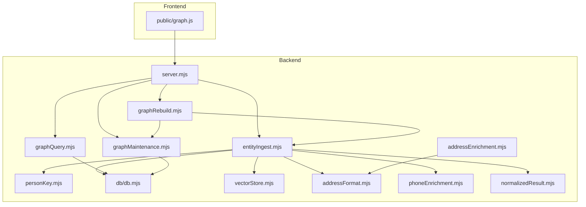
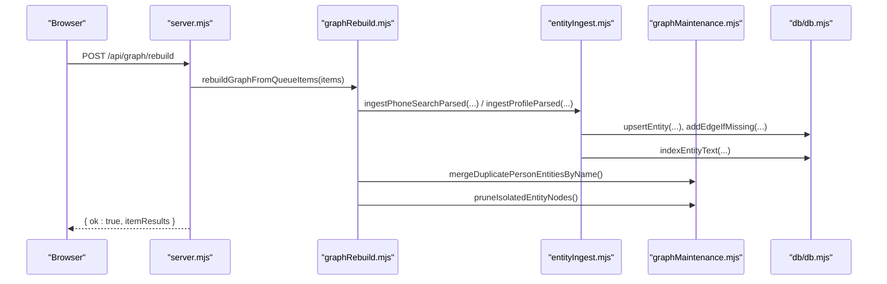
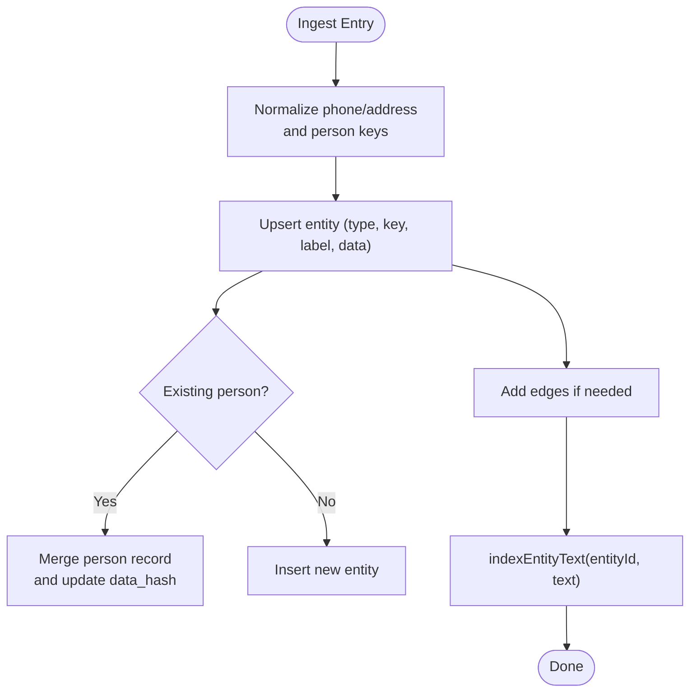
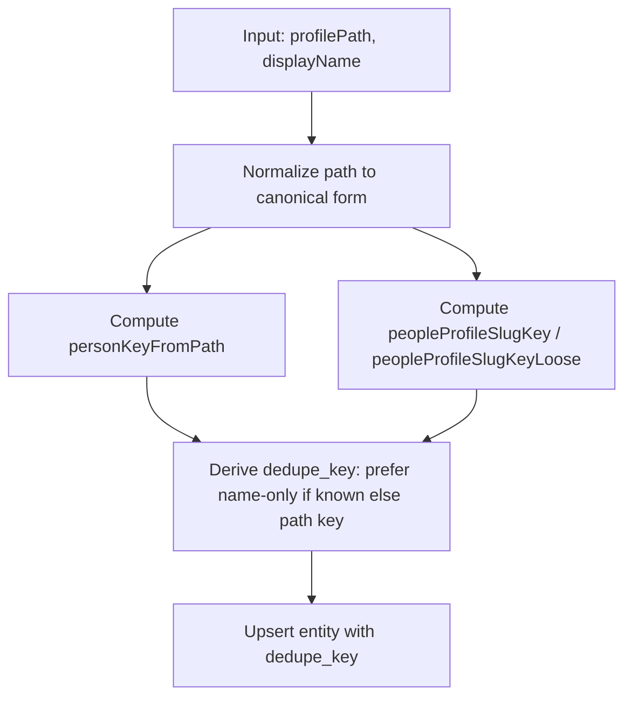
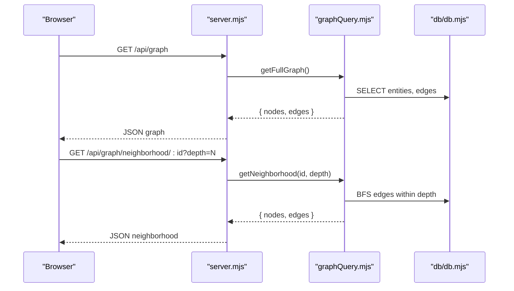
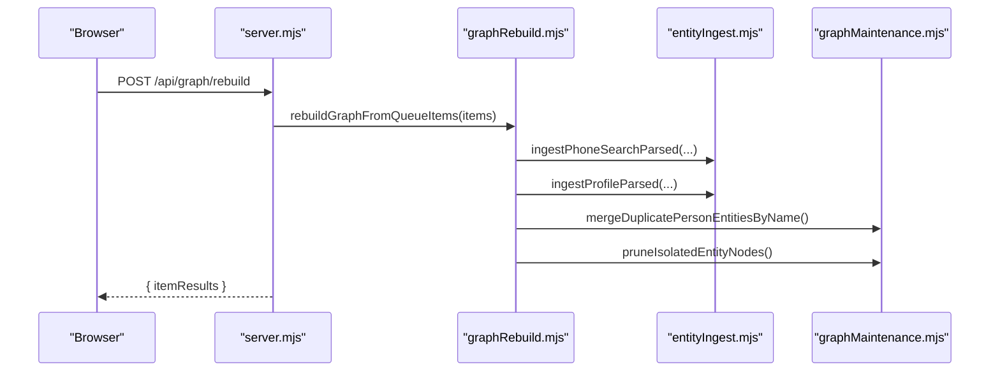
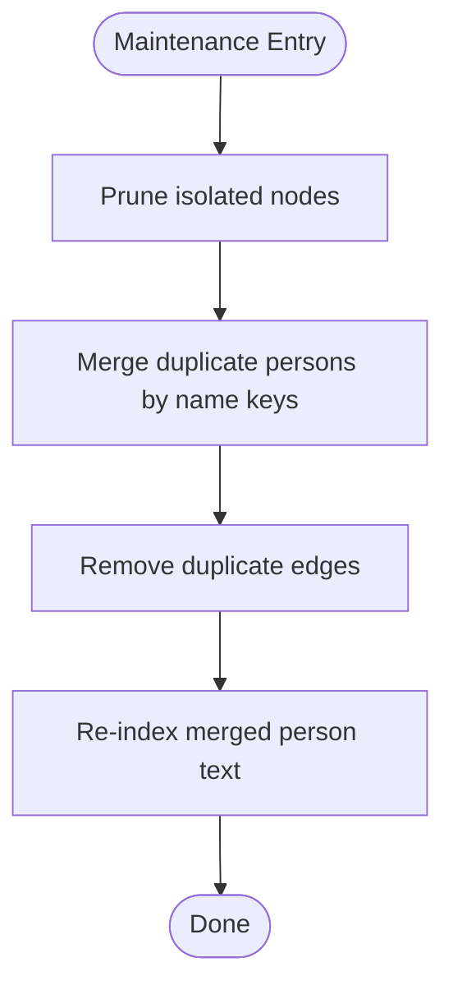
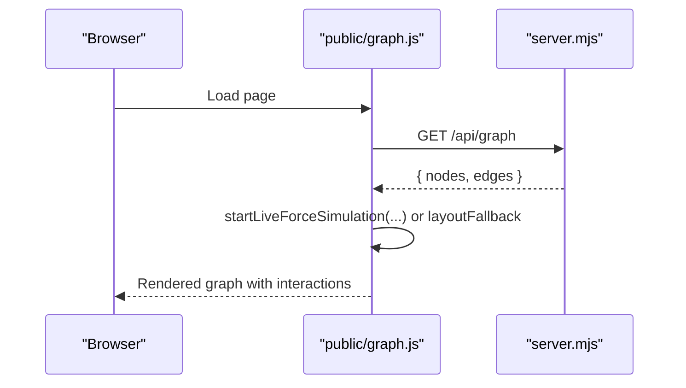
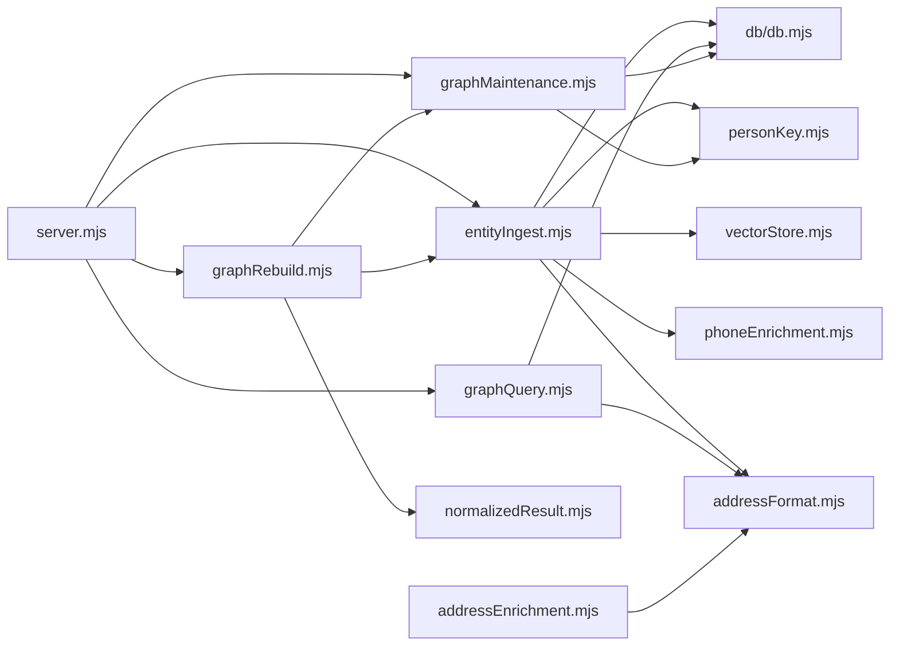

# Graph Management System

<cite>
**Referenced Files in This Document**
- [entityIngest.mjs](file://src/entityIngest.mjs)
- [personKey.mjs](file://src/personKey.mjs)
- [graphQuery.mjs](file://src/graphQuery.mjs)
- [graphRebuild.mjs](file://src/graphRebuild.mjs)
- [graphMaintenance.mjs](file://src/graphMaintenance.mjs)
- [db.mjs](file://src/db/db.mjs)
- [vectorStore.mjs](file://src/vectorStore.mjs)
- [addressFormat.mjs](file://src/addressFormat.mjs)
- [phoneEnrichment.mjs](file://src/phoneEnrichment.mjs)
- [normalizedResult.mjs](file://src/normalizedResult.mjs)
- [addressEnrichment.mjs](file://src/addressEnrichment.mjs)
- [graph.js](file://public/graph.js)
- [server.mjs](file://src/server.mjs)
</cite>

## Table of Contents
1. [Introduction](#introduction)
2. [Project Structure](#project-structure)
3. [Core Components](#core-components)
4. [Architecture Overview](#architecture-overview)
5. [Detailed Component Analysis](#detailed-component-analysis)
6. [Dependency Analysis](#dependency-analysis)
7. [Performance Considerations](#performance-considerations)
8. [Troubleshooting Guide](#troubleshooting-guide)
9. [Conclusion](#conclusion)
10. [Appendices](#appendices)

## Introduction
This document explains the graph management system that models entity relationships among people, phones, addresses, and emails. It covers dynamic graph construction via entity ingest, person key normalization, neighborhood exploration, the graph query interface, rebuild and maintenance operations, and visualization. The system is built around a SQLite graph with entities and edges, optional vector indexing, and a web-based force-directed visualization.

## Project Structure
The graph system spans backend modules for ingestion, querying, rebuilding, and maintenance, plus a frontend visualization powered by d3. The backend persists graph state in SQLite and optionally indexes text for search.

**Diagram sources**
- [server.mjs:1-120](file://src/server.mjs#L1-L120)
- [entityIngest.mjs:1-120](file://src/entityIngest.mjs#L1-L120)
- [graphQuery.mjs:1-63](file://src/graphQuery.mjs#L1-L63)
- [graphRebuild.mjs:1-96](file://src/graphRebuild.mjs#L1-L96)
- [graphMaintenance.mjs:1-60](file://src/graphMaintenance.mjs#L1-L60)
- [personKey.mjs:1-80](file://src/personKey.mjs#L1-L80)
- [db.mjs:21-77](file://src/db/db.mjs#L21-L77)
- [vectorStore.mjs:1-68](file://src/vectorStore.mjs#L1-L68)
- [addressFormat.mjs:123-155](file://src/addressFormat.mjs#L123-L155)
- [phoneEnrichment.mjs:103-108](file://src/phoneEnrichment.mjs#L103-L108)
- [normalizedResult.mjs:388-505](file://src/normalizedResult.mjs#L388-L505)
- [addressEnrichment.mjs:349-385](file://src/addressEnrichment.mjs#L349-L385)
- [graph.js:1289-1389](file://public/graph.js#L1289-L1389)

**Section sources**
- [server.mjs:1-120](file://src/server.mjs#L1-L120)
- [db.mjs:21-120](file://src/db/db.mjs#L21-L120)

## Core Components
- Entity ingest: Upserts entities, merges person records, creates edges, and indexes text for search.
- Person key normalization: Derives stable keys from profile paths and names to deduplicate people.
- Graph query: Loads full graph, neighborhood views, and specialized relationship queries.
- Rebuild pipeline: Full or incremental ingestion from normalized results, followed by maintenance.
- Maintenance: Deduplication, pruning, and startup tasks.
- Persistence: SQLite schema for entities, edges, caches, and merge snapshots.
- Visualization: Force-directed rendering with pan/zoom and popup interactions.

**Section sources**
- [entityIngest.mjs:233-552](file://src/entityIngest.mjs#L233-L552)
- [personKey.mjs:66-121](file://src/personKey.mjs#L66-L121)
- [graphQuery.mjs:18-135](file://src/graphQuery.mjs#L18-L135)
- [graphRebuild.mjs:25-96](file://src/graphRebuild.mjs#L25-L96)
- [graphMaintenance.mjs:90-177](file://src/graphMaintenance.mjs#L90-L177)
- [db.mjs:21-77](file://src/db/db.mjs#L21-L77)
- [graph.js:1289-1389](file://public/graph.js#L1289-L1389)

## Architecture Overview
The system ingests normalized results, normalizes person keys, upserts entities, creates edges, and optionally indexes text. Queries traverse the graph to render neighborhoods and relationships. Maintenance consolidates duplicates and removes orphaned nodes. The frontend consumes a REST-like API to render a dynamic graph.

**Diagram sources**
- [server.mjs:1-120](file://src/server.mjs#L1-L120)
- [graphRebuild.mjs:25-96](file://src/graphRebuild.mjs#L25-L96)
- [entityIngest.mjs:233-552](file://src/entityIngest.mjs#L233-L552)
- [graphMaintenance.mjs:90-177](file://src/graphMaintenance.mjs#L90-L177)
- [db.mjs:21-77](file://src/db/db.mjs#L21-L77)

## Detailed Component Analysis

### Dynamic Graph Construction and Entity Ingest
Dynamic construction centers on upserting entities and creating edges. Person records are merged when duplicates are detected using person keys derived from profile paths and names. Phone and address entities are normalized and enriched before insertion. Text indexing is performed to support future search.

Key behaviors:
- Person deduplication via name/path keys and merging of fields.
- Edge creation for relationships (e.g., relative, line_assigned, has_phone, at_address).
- Indexing of entity text for vector search.

**Diagram sources**
- [entityIngest.mjs:233-552](file://src/entityIngest.mjs#L233-L552)
- [vectorStore.mjs:91-111](file://src/vectorStore.mjs#L91-L111)

**Section sources**
- [entityIngest.mjs:233-552](file://src/entityIngest.mjs#L233-L552)
- [phoneEnrichment.mjs:103-108](file://src/phoneEnrichment.mjs#L103-L108)
- [addressFormat.mjs:123-155](file://src/addressFormat.mjs#L123-L155)
- [vectorStore.mjs:91-111](file://src/vectorStore.mjs#L91-L111)

### Person Key Normalization and Deduplication
Person keys are derived from profile paths and names to ensure stable identity across variant URLs and minor textual differences. The system maintains multiple key forms (strict path, slug, loose slug) and uses them to detect and merge duplicates.

**Diagram sources**
- [personKey.mjs:66-121](file://src/personKey.mjs#L66-L121)
- [entityIngest.mjs:385-393](file://src/entityIngest.mjs#L385-L393)

**Section sources**
- [personKey.mjs:66-121](file://src/personKey.mjs#L66-L121)
- [entityIngest.mjs:385-393](file://src/entityIngest.mjs#L385-L393)

### Neighborhood Exploration and Graph Queries
The query layer supports:
- Full graph export for visualization.
- Neighborhood traversal up to a specified depth.
- Label-based search across entities.
- Specialized queries for relatives linked to a phone.

**Diagram sources**
- [graphQuery.mjs:18-135](file://src/graphQuery.mjs#L18-L135)
- [server.mjs:1-120](file://src/server.mjs#L1-L120)

**Section sources**
- [graphQuery.mjs:18-135](file://src/graphQuery.mjs#L18-L135)

### Graph Rebuild and Incremental Merge
Rebuild processes a queue of normalized items, enriching and ingesting them, then performs maintenance to consolidate duplicates and prune isolated nodes. Incremental merge follows the same steps without clearing the graph first.

**Diagram sources**
- [graphRebuild.mjs:25-96](file://src/graphRebuild.mjs#L25-L96)
- [entityIngest.mjs:470-552](file://src/entityIngest.mjs#L470-L552)
- [graphMaintenance.mjs:90-177](file://src/graphMaintenance.mjs#L90-L177)

**Section sources**
- [graphRebuild.mjs:25-96](file://src/graphRebuild.mjs#L25-L96)
- [graphRebuild.mjs:108-161](file://src/graphRebuild.mjs#L108-L161)

### Maintenance Operations
Maintenance includes:
- Removing isolated nodes (no incident edges).
- Merging duplicate person entities by name keys and canonical precedence.
- Cleaning caches and resetting the graph when configured.

**Diagram sources**
- [graphMaintenance.mjs:62-80](file://src/graphMaintenance.mjs#L62-L80)
- [graphMaintenance.mjs:90-177](file://src/graphMaintenance.mjs#L90-L177)

**Section sources**
- [graphMaintenance.mjs:62-80](file://src/graphMaintenance.mjs#L62-L80)
- [graphMaintenance.mjs:90-177](file://src/graphMaintenance.mjs#L90-L177)

### Visualization and Interaction
The frontend renders a force-directed graph with pan/zoom, node selection, and contextual popups. It loads graph data from the backend and applies a d3 simulation when available, falling back to a static layout otherwise.

**Diagram sources**
- [graph.js:1289-1389](file://public/graph.js#L1289-L1389)
- [server.mjs:1-120](file://src/server.mjs#L1-L120)

**Section sources**
- [graph.js:1289-1389](file://public/graph.js#L1289-L1389)

## Dependency Analysis
The system exhibits clear separation of concerns:
- Backend orchestration in server.mjs wires ingestion, querying, rebuilding, and maintenance.
- entityIngest.mjs depends on personKey.mjs, addressFormat.mjs, phoneEnrichment.mjs, and vectorStore.mjs.
- graphQuery.mjs depends on db.mjs and addressFormat.mjs.
- graphRebuild.mjs orchestrates normalizedResult conversions and calls entityIngest and graphMaintenance.
- graphMaintenance.mjs depends on personKey.mjs and db.mjs.

**Diagram sources**
- [server.mjs:1-120](file://src/server.mjs#L1-L120)
- [entityIngest.mjs:1-16](file://src/entityIngest.mjs#L1-L16)
- [graphQuery.mjs:1-4](file://src/graphQuery.mjs#L1-L4)
- [graphRebuild.mjs:1-14](file://src/graphRebuild.mjs#L1-L14)
- [graphMaintenance.mjs:1-6](file://src/graphMaintenance.mjs#L1-L6)
- [normalizedResult.mjs:388-505](file://src/normalizedResult.mjs#L388-L505)
- [addressEnrichment.mjs:349-385](file://src/addressEnrichment.mjs#L349-L385)

**Section sources**
- [server.mjs:1-120](file://src/server.mjs#L1-L120)
- [entityIngest.mjs:1-16](file://src/entityIngest.mjs#L1-L16)
- [graphQuery.mjs:1-4](file://src/graphQuery.mjs#L1-L4)
- [graphRebuild.mjs:1-14](file://src/graphRebuild.mjs#L1-L14)
- [graphMaintenance.mjs:1-6](file://src/graphMaintenance.mjs#L1-L6)
- [normalizedResult.mjs:388-505](file://src/normalizedResult.mjs#L388-L505)
- [addressEnrichment.mjs:349-385](file://src/addressEnrichment.mjs#L349-L385)

## Performance Considerations
- Indexing: SQLite indices on entities (dedupe_key, type, label) and edges (from_id, to_id, kind) are defined in the schema. These support efficient lookups during ingest and queries.
- Deduplication cost: Person merge uses union-find-like comparisons across entities; for large graphs, consider batching and limiting pairwise checks.
- Neighborhood traversal: Depth-limited BFS scales with edges incident to frontier nodes; limit depth in UI and queries for responsiveness.
- Vector indexing: Optional vector store uses deterministic hashing when a vector engine is not enabled; enable RUVECTOR_ENABLE for production-scale semantic search.
- I/O: SQLite writes occur per upsert and edge insert; batch operations and transactions improve throughput. The maintenance routines wrap work in transactions where applicable.

[No sources needed since this section provides general guidance]

## Troubleshooting Guide
Common issues and remedies:
- Duplicate person nodes: Run maintenance to merge duplicate persons by name keys and prune isolated nodes.
- Missing relationships: Verify edge creation logic for relationships (relative, line_assigned, has_phone, at_address).
- Empty or stale graph: Trigger rebuild from normalized queue items; ensure normalizedResult conversion is applied before ingest.
- Vector indexing not working: Confirm RUVECTOR_ENABLE is set and the vector DB path is writable.

**Section sources**
- [graphMaintenance.mjs:90-177](file://src/graphMaintenance.mjs#L90-L177)
- [entityIngest.mjs:354-367](file://src/entityIngest.mjs#L354-L367)
- [graphRebuild.mjs:25-96](file://src/graphRebuild.mjs#L25-L96)
- [vectorStore.mjs:73-84](file://src/vectorStore.mjs#L73-L84)

## Conclusion
The graph management system provides robust dynamic construction, deduplication, and exploration of person-phone-address-email relationships. Its modular design enables incremental updates, maintenance, and scalable visualization. By leveraging SQLite indices, careful key normalization, and optional vector indexing, it supports both interactive exploration and future semantic search capabilities.

## Appendices

### Graph Schema and Indexing Strategies
- Entities: id, type, dedupe_key, label, data_json, data_hash, timestamps; indexed on dedupe_key, type, label.
- Edges: id, from_id, to_id, kind, meta_json, timestamps; indexed on from_id, to_id, kind.
- Merge snapshots: audit trail of entity data changes.
- Response cache and enrichment cache: separate tables for caching.

**Section sources**
- [db.mjs:21-77](file://src/db/db.mjs#L21-L77)

### Practical Workflows
- Build a graph from queue items:
  - Convert normalized results to ingest items.
  - Ingest phone search and profile items.
  - Merge duplicates and prune isolated nodes.
- Explore neighborhood:
  - Request neighborhood by entity ID with desired depth.
- Visualize:
  - Load graph data and render with d3; pan/zoom supported.

**Section sources**
- [normalizedResult.mjs:388-505](file://src/normalizedResult.mjs#L388-L505)
- [graphRebuild.mjs:25-96](file://src/graphRebuild.mjs#L25-L96)
- [graphQuery.mjs:70-135](file://src/graphQuery.mjs#L70-L135)
- [graph.js:1289-1389](file://public/graph.js#L1289-L1389)