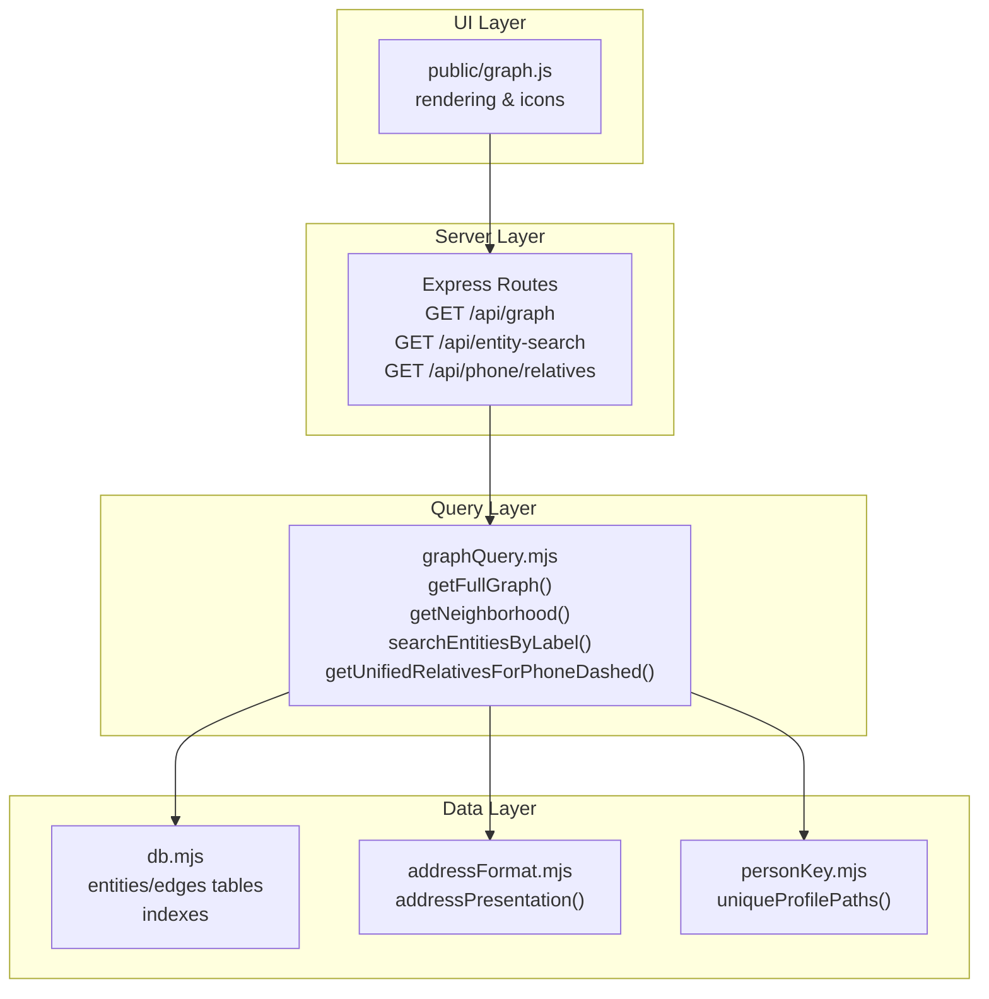
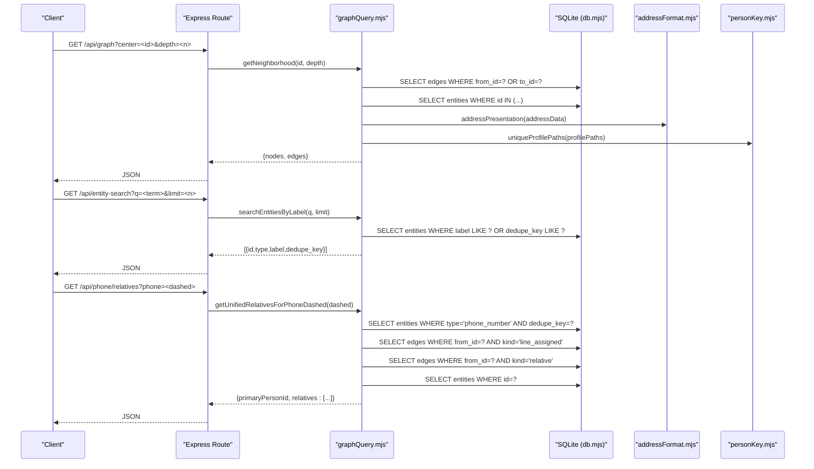
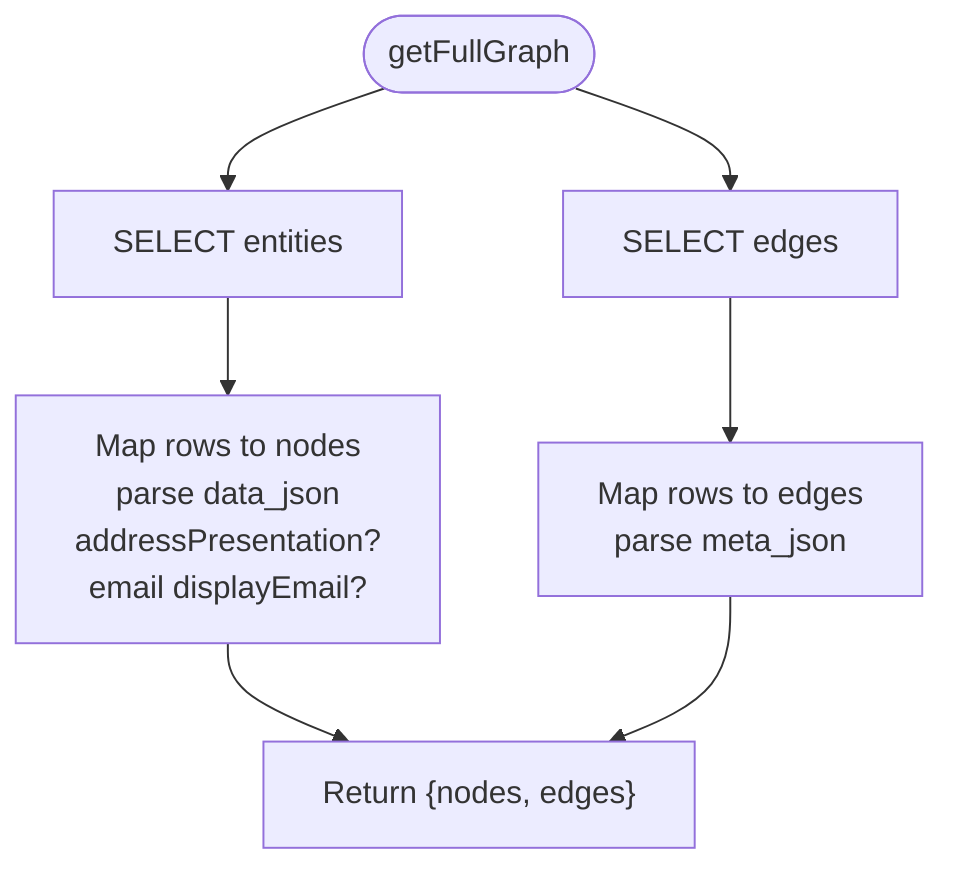
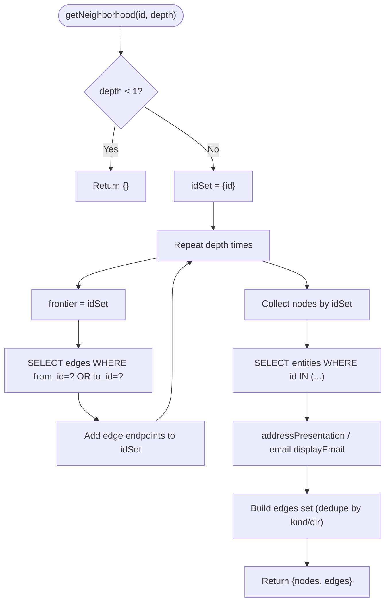
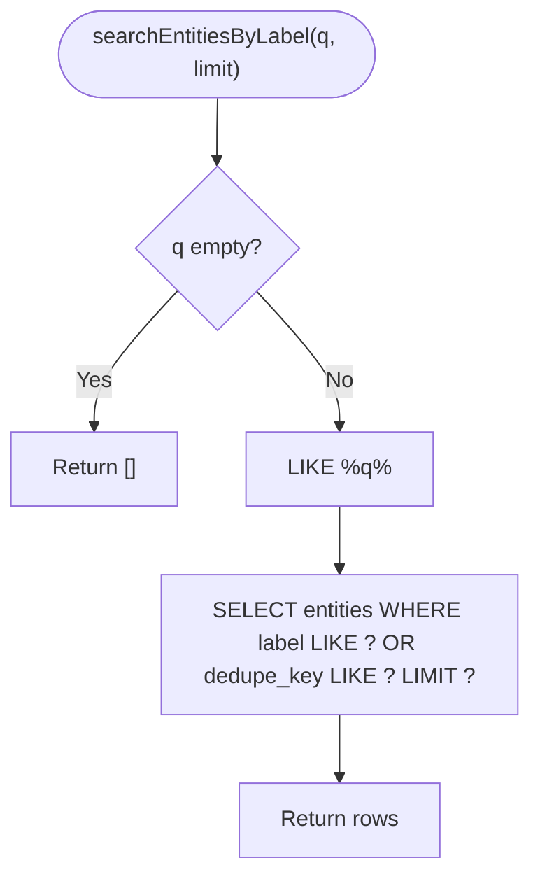
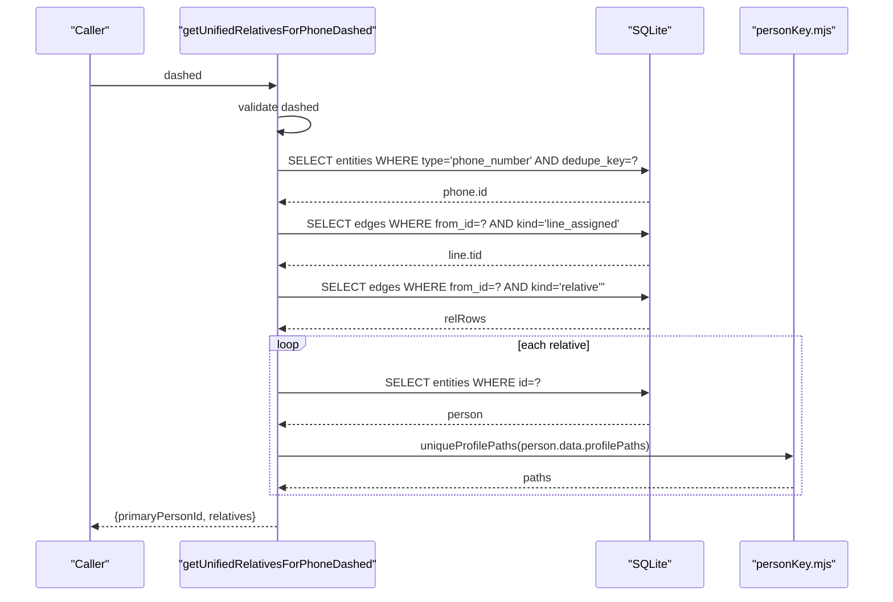
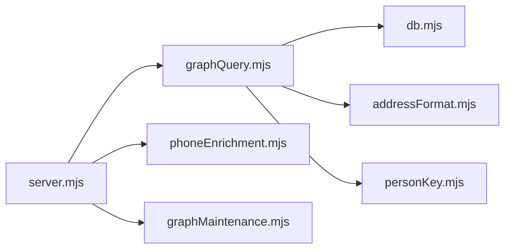

# Graph Querying

<cite>
**Referenced Files in This Document**
- [graphQuery.mjs](file://src/graphQuery.mjs)
- [server.mjs](file://src/server.mjs)
- [db.mjs](file://src/db/db.mjs)
- [addressFormat.mjs](file://src/addressFormat.mjs)
- [personKey.mjs](file://src/personKey.mjs)
- [graphMaintenance.mjs](file://src/graphMaintenance.mjs)
- [phoneEnrichment.mjs](file://src/phoneEnrichment.mjs)
- [graph.js](file://public/graph.js)
</cite>

## Table of Contents
1. [Introduction](#introduction)
2. [Project Structure](#project-structure)
3. [Core Components](#core-components)
4. [Architecture Overview](#architecture-overview)
5. [Detailed Component Analysis](#detailed-component-analysis)
6. [Dependency Analysis](#dependency-analysis)
7. [Performance Considerations](#performance-considerations)
8. [Troubleshooting Guide](#troubleshooting-guide)
9. [Conclusion](#conclusion)

## Introduction
This document explains the graph querying subsystem responsible for neighborhood exploration and entity relationship discovery. It covers:
- Retrieving complete graph data
- Exploring local neighborhoods around specific entities
- Finding entities by label or identifier
- Specialized family relationship discovery for phone numbers
- Practical traversal patterns, filtering, and data presentation
- Node and edge data structures, icon mapping, and address/email transformations
- Performance optimization, indexing strategies, and memory management
- Common query patterns and troubleshooting techniques

## Project Structure
The graph querying logic is implemented in a dedicated module and exposed via HTTP endpoints. Supporting modules provide data transformation and database schema/indexing.

**Diagram sources**
- [server.mjs:2476-2487](file://src/server.mjs#L2476-L2487)
- [server.mjs:2700-2706](file://src/server.mjs#L2700-L2706)
- [server.mjs:2346-2362](file://src/server.mjs#L2346-L2362)
- [graphQuery.mjs:18-63](file://src/graphQuery.mjs#L18-L63)
- [graphQuery.mjs:70-135](file://src/graphQuery.mjs#L70-L135)
- [graphQuery.mjs:142-152](file://src/graphQuery.mjs#L142-L152)
- [graphQuery.mjs:173-224](file://src/graphQuery.mjs#L173-L224)
- [db.mjs:25-52](file://src/db/db.mjs#L25-L52)
- [addressFormat.mjs:123-154](file://src/addressFormat.mjs#L123-L154)
- [personKey.mjs:206-221](file://src/personKey.mjs#L206-L221)
- [graph.js:118-126](file://public/graph.js#L118-L126)

**Section sources**
- [server.mjs:2476-2487](file://src/server.mjs#L2476-L2487)
- [server.mjs:2700-2706](file://src/server.mjs#L2700-L2706)
- [server.mjs:2346-2362](file://src/server.mjs#L2346-L2362)
- [graphQuery.mjs:18-224](file://src/graphQuery.mjs#L18-L224)
- [db.mjs:25-52](file://src/db/db.mjs#L25-L52)
- [addressFormat.mjs:123-154](file://src/addressFormat.mjs#L123-L154)
- [personKey.mjs:206-221](file://src/personKey.mjs#L206-L221)
- [graph.js:118-126](file://public/graph.js#L118-L126)

## Core Components
- getFullGraph(): Loads all entities and edges, transforms address and email data, and returns a normalized node/edge structure.
- getNeighborhood(entityId, depth): Expands outward from a center node up to a given depth, collecting nodes and edges while avoiding duplicates.
- searchEntitiesByLabel(q, limit): Performs a label/dedupe_key search with a LIKE pattern and limits results.
- getUnifiedRelativesForPhoneDashed(dashed): Given a US phone number in dashed format, finds the primary person and related persons with profile paths.

These functions are exported by the graph query module and consumed by server routes.

**Section sources**
- [graphQuery.mjs:18-63](file://src/graphQuery.mjs#L18-L63)
- [graphQuery.mjs:70-135](file://src/graphQuery.mjs#L70-L135)
- [graphQuery.mjs:142-152](file://src/graphQuery.mjs#L142-L152)
- [graphQuery.mjs:173-224](file://src/graphQuery.mjs#L173-L224)

## Architecture Overview
The system exposes HTTP endpoints that delegate to the graph query module. The module reads from SQLite tables and applies transformations for display.

**Diagram sources**
- [server.mjs:2476-2487](file://src/server.mjs#L2476-L2487)
- [server.mjs:2700-2706](file://src/server.mjs#L2700-L2706)
- [server.mjs:2346-2362](file://src/server.mjs#L2346-L2362)
- [graphQuery.mjs:70-135](file://src/graphQuery.mjs#L70-L135)
- [graphQuery.mjs:142-152](file://src/graphQuery.mjs#L142-L152)
- [graphQuery.mjs:173-224](file://src/graphQuery.mjs#L173-L224)
- [db.mjs:25-52](file://src/db/db.mjs#L25-L52)
- [addressFormat.mjs:123-154](file://src/addressFormat.mjs#L123-L154)
- [personKey.mjs:206-221](file://src/personKey.mjs#L206-L221)

## Detailed Component Analysis

### getFullGraph
Purpose: Retrieve the entire graph as nodes and edges.

Processing logic:
- Load all entities and parse data_json; transform address data via addressPresentation; add displayEmail for emails.
- Load all edges and parse meta_json; dedupe edges by kind and direction.
- Return normalized { nodes, edges }.

Data transformations:
- Address: Adds streetLine, formattedFull, recordedRange, graphPopupText.
- Email: Adds displayEmail derived from address field.

**Diagram sources**
- [graphQuery.mjs:18-63](file://src/graphQuery.mjs#L18-L63)
- [addressFormat.mjs:123-154](file://src/addressFormat.mjs#L123-L154)

**Section sources**
- [graphQuery.mjs:18-63](file://src/graphQuery.mjs#L18-L63)
- [addressFormat.mjs:123-154](file://src/addressFormat.mjs#L123-L154)

### getNeighborhood
Purpose: Explore local connections around a central entity up to a specified depth.

Processing logic:
- Initialize idSet with the center entity.
- Iteratively expand frontier by querying edges where from_id or to_id equals current frontier members.
- Collect unique node IDs and fetch entity details.
- Transform address/email data per entity.
- Build edges set avoiding duplicates by kind and direction.

Depth control:
- Enforces depth ≥ 1; returns empty graph otherwise.

**Diagram sources**
- [graphQuery.mjs:70-135](file://src/graphQuery.mjs#L70-L135)

**Section sources**
- [graphQuery.mjs:70-135](file://src/graphQuery.mjs#L70-L135)

### searchEntitiesByLabel
Purpose: Find entities by label or dedupe_key using a LIKE pattern.

Behavior:
- Trims and validates input; builds a LIKE pattern with percent wildcards.
- Limits results by the provided limit.

**Diagram sources**
- [graphQuery.mjs:142-152](file://src/graphQuery.mjs#L142-L152)

**Section sources**
- [graphQuery.mjs:142-152](file://src/graphQuery.mjs#L142-L152)

### getUnifiedRelativesForPhoneDashed
Purpose: Discover family relationships connected to a phone number.

Steps:
- Validate dashed format (###-###-####).
- Find phone entity by dedupe_key.
- Resolve line_assigned edge to primary person.
- Enumerate relative edges from primary person to related persons.
- For each related person, extract displayName or label; collect unique profile paths via uniqueProfilePaths; sort by name.

**Diagram sources**
- [graphQuery.mjs:173-224](file://src/graphQuery.mjs#L173-L224)
- [personKey.mjs:206-221](file://src/personKey.mjs#L206-L221)

**Section sources**
- [graphQuery.mjs:173-224](file://src/graphQuery.mjs#L173-L224)
- [personKey.mjs:206-221](file://src/personKey.mjs#L206-L221)

### Node and Edge Data Structures
Nodes:
- id: Entity identifier
- type: Entity type (person, phone_number, address, email, org, enrichment)
- title: Label or dedupe_key fallback
- sub: dedupe_key
- icon: Mapped from type
- data: Parsed JSON; transformed for address and email

Edges:
- id: Edge identifier (sequential for full graph; original for neighborhood)
- from: Source entity id
- to: Target entity id
- label: kind
- meta: Parsed JSON metadata

Icon mapping:
- person → person
- phone_number → phone
- address → map
- email → mail
- org → work
- enrichment → info
- default → dot

Presentation transformations:
- Address: Adds streetLine, formattedFull, recordedRange, graphPopupText
- Email: Adds displayEmail from address field

**Section sources**
- [graphQuery.mjs:5-13](file://src/graphQuery.mjs#L5-L13)
- [graphQuery.mjs:18-63](file://src/graphQuery.mjs#L18-L63)
- [graphQuery.mjs:90-134](file://src/graphQuery.mjs#L90-L134)
- [addressFormat.mjs:123-154](file://src/addressFormat.mjs#L123-L154)

### Practical Traversal Patterns and Filtering
- Neighborhood expansion: Use getNeighborhood with depth 1–3 for interactive exploration.
- Label search: Use searchEntitiesByLabel for quick entity discovery by name or identifier.
- Relationship filtering: Combine label search with neighborhood queries to refine focus.
- Phone-centric discovery: Use getUnifiedRelativesForPhoneDashed to pivot from a phone to related persons.

UI integration:
- The frontend maps icons and colors to node types and renders the graph accordingly.

**Section sources**
- [server.mjs:2476-2487](file://src/server.mjs#L2476-L2487)
- [server.mjs:2700-2706](file://src/server.mjs#L2700-L2706)
- [server.mjs:2346-2362](file://src/server.mjs#L2346-L2362)
- [graph.js:118-126](file://public/graph.js#L118-L126)

## Dependency Analysis
- graphQuery.mjs depends on:
  - db.mjs for SQLite access and schema/indexes
  - addressFormat.mjs for address display formatting
  - personKey.mjs for deduplication and profile path normalization
- server.mjs exposes routes that call graphQuery functions and integrates with other subsystems (phone enrichment, vector store, etc.).

**Diagram sources**
- [server.mjs:31-36](file://src/server.mjs#L31-L36)
- [graphQuery.mjs:1-3](file://src/graphQuery.mjs#L1-L3)
- [db.mjs:25-52](file://src/db/db.mjs#L25-L52)
- [addressFormat.mjs:123-154](file://src/addressFormat.mjs#L123-L154)
- [personKey.mjs:206-221](file://src/personKey.mjs#L206-L221)
- [phoneEnrichment.mjs:1-126](file://src/phoneEnrichment.mjs#L1-L126)
- [graphMaintenance.mjs:1-24](file://src/graphMaintenance.mjs#L1-L24)

**Section sources**
- [server.mjs:31-36](file://src/server.mjs#L31-L36)
- [graphQuery.mjs:1-3](file://src/graphQuery.mjs#L1-L3)
- [db.mjs:25-52](file://src/db/db.mjs#L25-L52)
- [addressFormat.mjs:123-154](file://src/addressFormat.mjs#L123-L154)
- [personKey.mjs:206-221](file://src/personKey.mjs#L206-L221)
- [phoneEnrichment.mjs:1-126](file://src/phoneEnrichment.mjs#L1-L126)
- [graphMaintenance.mjs:1-24](file://src/graphMaintenance.mjs#L1-L24)

## Performance Considerations
Indexing and schema:
- Entities: dedupe_key (unique), type, label
- Edges: from_id, to_id, kind
- These indexes support label search, neighbor expansion, and relationship filtering efficiently.

Memory management:
- getNeighborhood collects nodes and edges in arrays; for large graphs, cap depth and limit results.
- getFullGraph loads all entities and edges; prefer neighborhood queries for interactive UI.

Optimization tips:
- Limit depth in getNeighborhood to reduce query volume.
- Use searchEntitiesByLabel to pre-filter before expanding neighbors.
- Leverage indexes for LIKE queries on label/dedupe_key; consider exact match keys for frequent lookups.
- Periodic maintenance: prune isolated nodes and merge duplicate person entities to keep the graph lean.

**Section sources**
- [db.mjs:25-52](file://src/db/db.mjs#L25-L52)
- [graphQuery.mjs:70-135](file://src/graphQuery.mjs#L70-L135)
- [graphQuery.mjs:142-152](file://src/graphQuery.mjs#L142-L152)
- [graphMaintenance.mjs:62-80](file://src/graphMaintenance.mjs#L62-L80)
- [graphMaintenance.mjs:90-177](file://src/graphMaintenance.mjs#L90-L177)

## Troubleshooting Guide
Common issues and resolutions:
- Empty or partial neighborhoods:
  - Verify the center entity ID exists.
  - Increase depth cautiously; ensure edges exist for the requested kinds.
- Unexpected missing edges:
  - Confirm edge kinds and directions; dedupe logic prevents duplicates.
- Label search returns no results:
  - Ensure input is trimmed and not empty.
  - Check that label/dedupe_key contains the searched term.
- Phone-relative query returns no results:
  - Validate dashed format and that the phone exists with a line_assigned edge to a person.
  - Confirm relative edges exist from the primary person.
- Large graph rendering lag:
  - Reduce depth in neighborhood queries.
  - Use label search to narrow scope before expansion.
- Data anomalies:
  - Run maintenance tasks to prune isolated nodes and merge duplicate person entities.

Operational endpoints:
- Health and stats: GET /api/graph/stats
- Wipe/reset: POST /api/db/wipe (soft/hard modes)

**Section sources**
- [server.mjs:2489-2494](file://src/server.mjs#L2489-L2494)
- [server.mjs:2399-2423](file://src/server.mjs#L2399-L2423)
- [graphQuery.mjs:70-135](file://src/graphQuery.mjs#L70-L135)
- [graphQuery.mjs:142-152](file://src/graphQuery.mjs#L142-L152)
- [graphQuery.mjs:173-224](file://src/graphQuery.mjs#L173-L224)
- [graphMaintenance.mjs:62-80](file://src/graphMaintenance.mjs#L62-L80)
- [graphMaintenance.mjs:90-177](file://src/graphMaintenance.mjs#L90-L177)

## Conclusion
The graph querying subsystem provides efficient neighborhood exploration, label-based discovery, and phone-centric relationship mapping. By leveraging SQLite indexes, transforming data for display, and offering controlled traversal depths, it supports responsive UI interactions. Apply the recommended patterns and maintenance routines to sustain performance on large graphs.