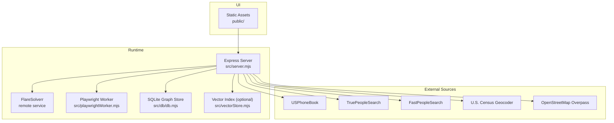
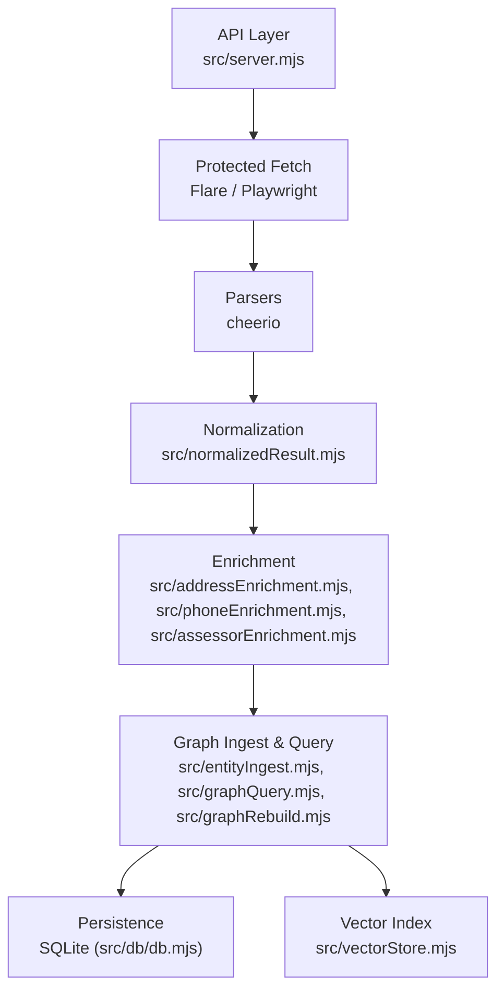
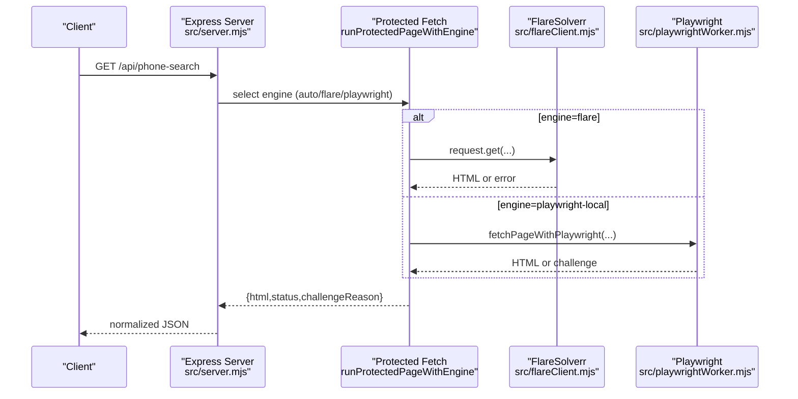
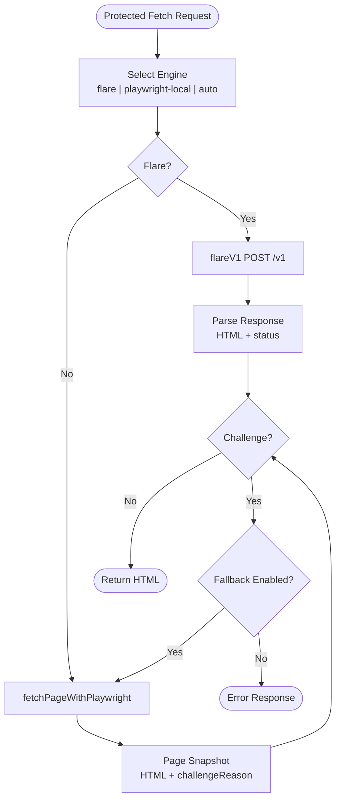
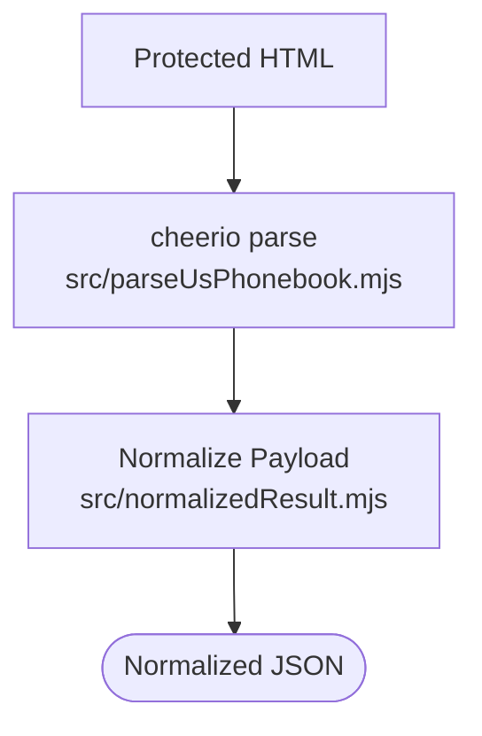
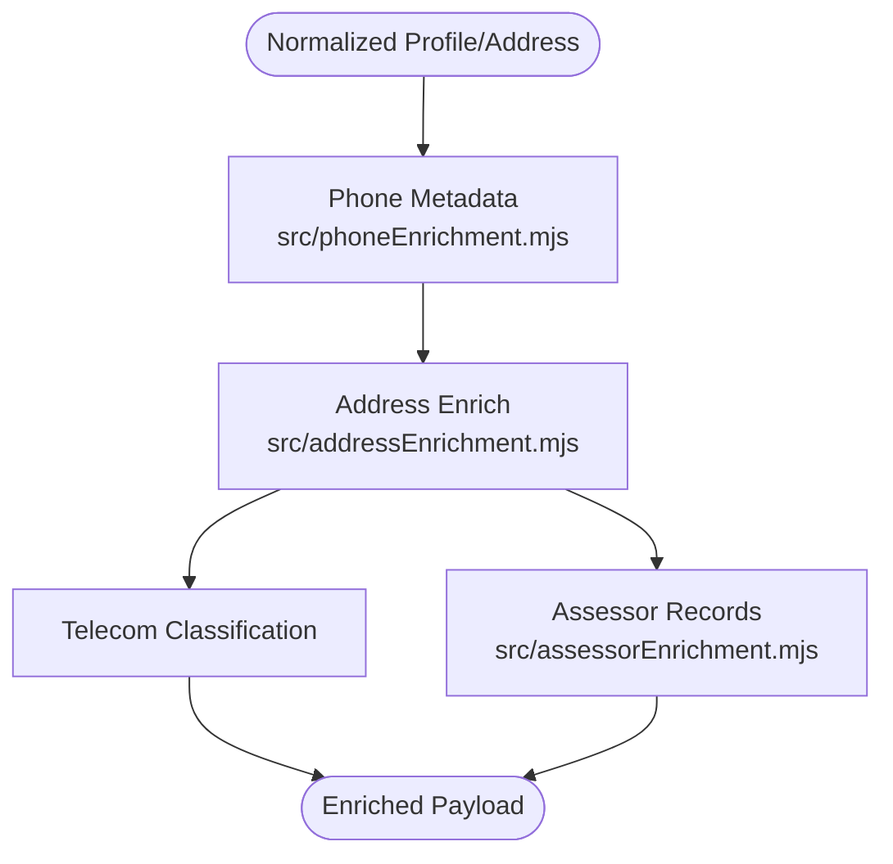
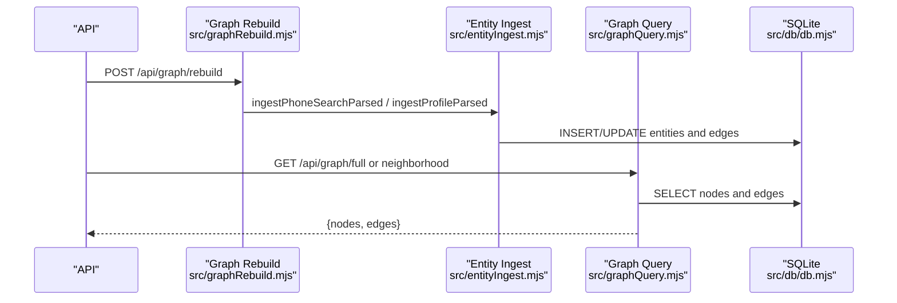
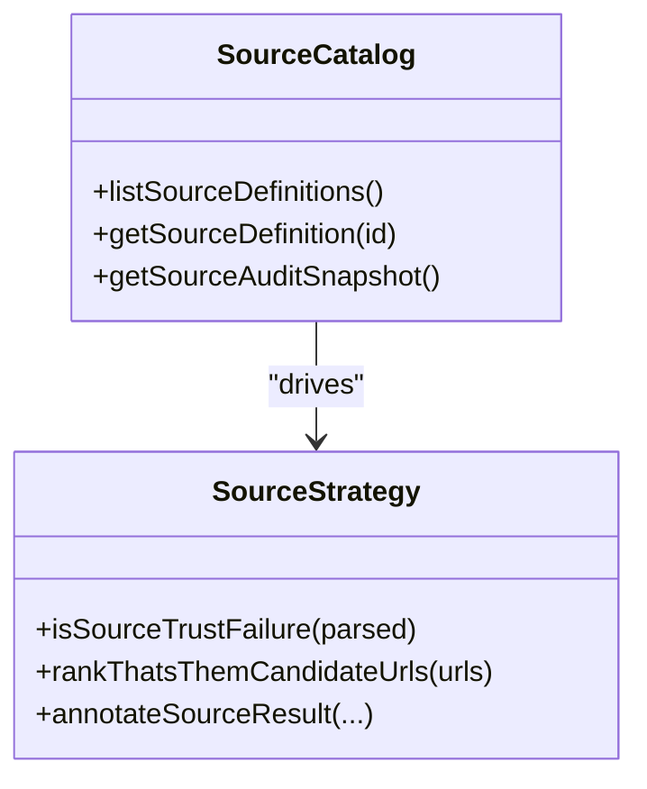
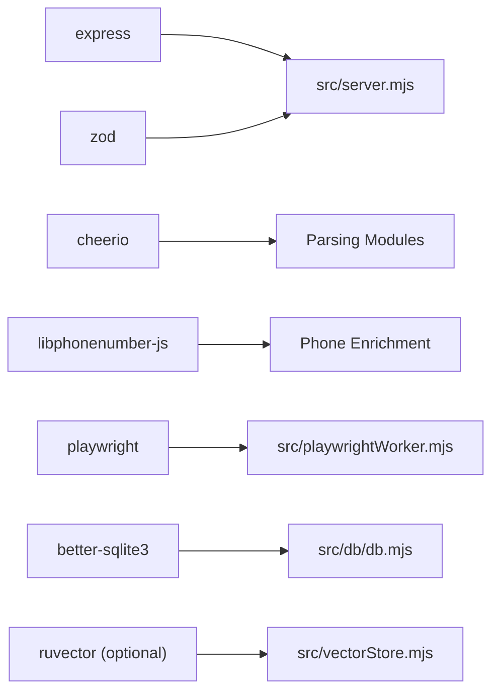

# Architecture Overview

<cite>
**Referenced Files in This Document**
- [README.md](file://README.md)
- [package.json](file://package.json)
- [docker-compose.yml](file://docker-compose.yml)
- [src/server.mjs](file://src/server.mjs)
- [src/flareClient.mjs](file://src/flareClient.mjs)
- [src/playwrightWorker.mjs](file://src/playwrightWorker.mjs)
- [src/db/db.mjs](file://src/db/db.mjs)
- [src/addressEnrichment.mjs](file://src/addressEnrichment.mjs)
- [src/graphQuery.mjs](file://src/graphQuery.mjs)
- [src/entityIngest.mjs](file://src/entityIngest.mjs)
- [src/sourceCatalog.mjs](file://src/sourceCatalog.mjs)
- [src/normalizedResult.mjs](file://src/normalizedResult.mjs)
- [src/vectorStore.mjs](file://src/vectorStore.mjs)
- [src/graphRebuild.mjs](file://src/graphRebuild.mjs)
- [src/phoneEnrichment.mjs](file://src/phoneEnrichment.mjs)
- [src/assessorEnrichment.mjs](file://src/assessorEnrichment.mjs)
- [src/parseUsPhonebook.mjs](file://src/parseUsPhonebook.mjs)
</cite>

## Table of Contents
1. [Introduction](#introduction)
2. [Project Structure](#project-structure)
3. [Core Components](#core-components)
4. [Architecture Overview](#architecture-overview)
5. [Detailed Component Analysis](#detailed-component-analysis)
6. [Dependency Analysis](#dependency-analysis)
7. [Performance Considerations](#performance-considerations)
8. [Troubleshooting Guide](#troubleshooting-guide)
9. [Conclusion](#conclusion)
10. [Appendices](#appendices)

## Introduction
This document describes the USPhoneBook Flare App architecture: an Express.js backend orchestrating protected fetch operations against USPhoneBook and other people-finder sources, with a hybrid engine supporting both FlareSolverr and a local Playwright worker. The system integrates a modular pipeline for parsing, enrichment, and graph construction, backed by a SQLite graph store and optional vector indexing. It emphasizes separation of concerns across protected fetch orchestration, source adapters, data enrichment, and graph management, while providing operational controls for reliability, caching, and scalability.

## Project Structure
The repository follows a feature-layered organization under src/, with clear modules for server orchestration, anti-bot protection, parsing, enrichment, graph management, and persistence. Static assets and UI are served from public/.

**Diagram sources**
- [src/server.mjs](file://src/server.mjs)
- [src/playwrightWorker.mjs](file://src/playwrightWorker.mjs)
- [src/db/db.mjs](file://src/db/db.mjs)
- [src/vectorStore.mjs](file://src/vectorStore.mjs)
- [docker-compose.yml](file://docker-compose.yml)

**Section sources**
- [README.md](file://README.md)
- [package.json](file://package.json)
- [docker-compose.yml](file://docker-compose.yml)

## Core Components
- Express server: HTTP API endpoints, protected fetch orchestration, caching, and integration with parsing and enrichment.
- Protected fetch engines:
  - FlareSolverr client: remote browser challenge solver invoked via HTTP.
  - Playwright worker: local persistent Chromium context with guardrails and challenge detection.
- Parsing and normalization: cheerio-based parsers for USPhoneBook and external sources; normalized result envelopes.
- Enrichment pipeline: phone metadata, address geocoding, nearby places, telecom analysis, and assessor records.
- Graph management: ingestion, merging, pruning, and querying; optional vector indexing.
- Persistence: SQLite for entities, edges, caches, and merge snapshots; optional vector DB.

**Section sources**
- [src/server.mjs](file://src/server.mjs)
- [src/flareClient.mjs](file://src/flareClient.mjs)
- [src/playwrightWorker.mjs](file://src/playwrightWorker.mjs)
- [src/db/db.mjs](file://src/db/db.mjs)
- [src/addressEnrichment.mjs](file://src/addressEnrichment.mjs)
- [src/graphQuery.mjs](file://src/graphQuery.mjs)
- [src/entityIngest.mjs](file://src/entityIngest.mjs)
- [src/normalizedResult.mjs](file://src/normalizedResult.mjs)
- [src/vectorStore.mjs](file://src/vectorStore.mjs)
- [src/graphRebuild.mjs](file://src/graphRebuild.mjs)
- [src/phoneEnrichment.mjs](file://src/phoneEnrichment.mjs)
- [src/assessorEnrichment.mjs](file://src/assessorEnrichment.mjs)
- [src/parseUsPhonebook.mjs](file://src/parseUsPhonebook.mjs)

## Architecture Overview
The system is a microservice-style composition:
- Server orchestration exposes REST endpoints and manages protected fetch selection and fallback.
- Anti-bot protection layer provides two engines: FlareSolverr (remote) and Playwright (local).
- Web scraping modules parse HTML into normalized payloads.
- Data enrichment pipeline augments results with phone metadata, geocoding, nearby places, telecom classification, and assessor records.
- Graph management ingests normalized results into a relational graph model and supports querying and rebuilds.
- Persistence is centralized in SQLite with optional vector indexing.

**Diagram sources**
- [src/server.mjs](file://src/server.mjs)
- [src/flareClient.mjs](file://src/flareClient.mjs)
- [src/playwrightWorker.mjs](file://src/playwrightWorker.mjs)
- [src/parseUsPhonebook.mjs](file://src/parseUsPhonebook.mjs)
- [src/normalizedResult.mjs](file://src/normalizedResult.mjs)
- [src/addressEnrichment.mjs](file://src/addressEnrichment.mjs)
- [src/phoneEnrichment.mjs](file://src/phoneEnrichment.mjs)
- [src/assessorEnrichment.mjs](file://src/assessorEnrichment.mjs)
- [src/entityIngest.mjs](file://src/entityIngest.mjs)
- [src/graphQuery.mjs](file://src/graphQuery.mjs)
- [src/graphRebuild.mjs](file://src/graphRebuild.mjs)
- [src/db/db.mjs](file://src/db/db.mjs)
- [src/vectorStore.mjs](file://src/vectorStore.mjs)

## Detailed Component Analysis

### Server Orchestration and Protected Fetch Engine
The server coordinates protected fetches, engine selection, and fallback logic. It supports:
- Engine selection: explicit per-request or configured default (flare, playwright-local, auto).
- Fallback: automatic switch from Flare to Playwright on challenge or timeout.
- Session management: optional Flare session reuse with TTL rotation and invalid-session handling.
- Rate control: cooldown between protected fetches.
- Observability: scrape traces, heartbeat logging, and trust metrics.

**Diagram sources**
- [src/server.mjs](file://src/server.mjs)
- [src/flareClient.mjs](file://src/flareClient.mjs)
- [src/playwrightWorker.mjs](file://src/playwrightWorker.mjs)

**Section sources**
- [src/server.mjs](file://src/server.mjs)
- [src/flareClient.mjs](file://src/flareClient.mjs)
- [src/playwrightWorker.mjs](file://src/playwrightWorker.mjs)

### Anti-Bot Protection Layer
- FlareSolverr integration: HTTP client wrapper that validates responses and surfaces errors.
- Playwright worker: persistent Chromium context with guards against popups/dialogs, challenge detection heuristics, and optional interactive sessions.

**Diagram sources**
- [src/server.mjs](file://src/server.mjs)
- [src/flareClient.mjs](file://src/flareClient.mjs)
- [src/playwrightWorker.mjs](file://src/playwrightWorker.mjs)

**Section sources**
- [src/flareClient.mjs](file://src/flareClient.mjs)
- [src/playwrightWorker.mjs](file://src/playwrightWorker.mjs)

### Parsing and Normalization
- USPhoneBook HTML parsing with cheerio extracts owners, phones, profiles, and relatives.
- Normalized result envelopes unify payloads for phone search, name search, and profile lookup, carrying metadata and summary counts.

**Diagram sources**
- [src/parseUsPhonebook.mjs](file://src/parseUsPhonebook.mjs)
- [src/normalizedResult.mjs](file://src/normalizedResult.mjs)

**Section sources**
- [src/parseUsPhonebook.mjs](file://src/parseUsPhonebook.mjs)
- [src/normalizedResult.mjs](file://src/normalizedResult.mjs)

### Enrichment Pipeline
- Phone metadata: libphonenumber-js classification and formatting.
- Address enrichment: U.S. Census geocoder, Overpass nearby places, and assessor records.
- Telecom analysis: NANP classification and line-type inference.
- Assessor enrichment: Vision platform driver and generic HTML extraction with caching and confidence matching.

**Diagram sources**
- [src/phoneEnrichment.mjs](file://src/phoneEnrichment.mjs)
- [src/addressEnrichment.mjs](file://src/addressEnrichment.mjs)
- [src/assessorEnrichment.mjs](file://src/assessorEnrichment.mjs)

**Section sources**
- [src/phoneEnrichment.mjs](file://src/phoneEnrichment.mjs)
- [src/addressEnrichment.mjs](file://src/addressEnrichment.mjs)
- [src/assessorEnrichment.mjs](file://src/assessorEnrichment.mjs)

### Graph Management
- Ingestion: upsert entities and edges; merge person records; index text for vector search.
- Query: full graph and neighborhood views; label search; relative discovery for phone.
- Rebuild: full or incremental graph rebuild from normalized items.

**Diagram sources**
- [src/graphRebuild.mjs](file://src/graphRebuild.mjs)
- [src/entityIngest.mjs](file://src/entityIngest.mjs)
- [src/graphQuery.mjs](file://src/graphQuery.mjs)
- [src/db/db.mjs](file://src/db/db.mjs)

**Section sources**
- [src/graphRebuild.mjs](file://src/graphRebuild.mjs)
- [src/entityIngest.mjs](file://src/entityIngest.mjs)
- [src/graphQuery.mjs](file://src/graphQuery.mjs)
- [src/db/db.mjs](file://src/db/db.mjs)

### Source Catalog and Strategy
- Source catalog defines capabilities, session modes, and automation blueprints for each source.
- Strategy utilities classify trust failures, rank candidate URLs, and manage source sessions.

**Diagram sources**
- [src/sourceCatalog.mjs](file://src/sourceCatalog.mjs)

**Section sources**
- [src/sourceCatalog.mjs](file://src/sourceCatalog.mjs)

## Dependency Analysis
Technology stack and runtime dependencies:
- Express for HTTP routing and middleware.
- Cheerio for HTML parsing.
- libphonenumber-js for phone normalization.
- Playwright for local browser automation.
- better-sqlite3 for graph persistence.
- zod for validation (referenced in package.json).
- ruvector for optional vector indexing.

**Diagram sources**
- [package.json](file://package.json)
- [src/server.mjs](file://src/server.mjs)
- [src/playwrightWorker.mjs](file://src/playwrightWorker.mjs)
- [src/db/db.mjs](file://src/db/db.mjs)
- [src/vectorStore.mjs](file://src/vectorStore.mjs)

**Section sources**
- [package.json](file://package.json)

## Performance Considerations
- Engine choice: FlareSolverr offloads browser challenges but adds network latency; Playwright worker reduces latency and improves control but requires local resources.
- Session reuse: enable Flare session reuse to warm a single browser; monitor for slowdowns and use TTL rotation.
- Rate limiting: configure cooldown between protected fetches to reduce burstiness.
- Caching: phone/name search caches and enrichment caches minimize repeated work; tune TTLs and sizes per workload.
- Vector indexing: optional; enable RUVECTOR_ENABLE and tune RUVECTOR_PATH for embedding storage.

[No sources needed since this section provides general guidance]

## Troubleshooting Guide
Common issues and remedies:
- FlareSolverr connectivity: verify FLARE_BASE_URL and port exposure; use probe script to validate.
- Challenge failures: increase timeouts, disable media, or switch to Playwright fallback; inspect trust metrics.
- Session problems: drop or rotate Flare sessions on invalid errors; ensure proper proxy configuration.
- Logging: enable scrape logs and adjust heartbeat intervals for visibility.

**Section sources**
- [README.md](file://README.md)
- [src/server.mjs](file://src/server.mjs)

## Conclusion
The USPhoneBook Flare App combines Express orchestration with a hybrid anti-bot engine to reliably fetch and parse protected pages. Its modular design separates concerns across protected fetch, parsing, enrichment, and graph management, while SQLite and optional vector indexing provide scalable persistence and search. Operational controls and observability support robust deployments, and the architecture is extensible for future browser worker pools and driver registries.

[No sources needed since this section summarizes without analyzing specific files]

## Appendices

### API and Configuration Highlights
- Health and diagnostics endpoints for Flare and protected-fetch trust.
- Environment variables controlling engine selection, timeouts, caching, and enrichment behavior.
- Docker Compose for FlareSolverr service binding.

**Section sources**
- [README.md](file://README.md)
- [docker-compose.yml](file://docker-compose.yml)