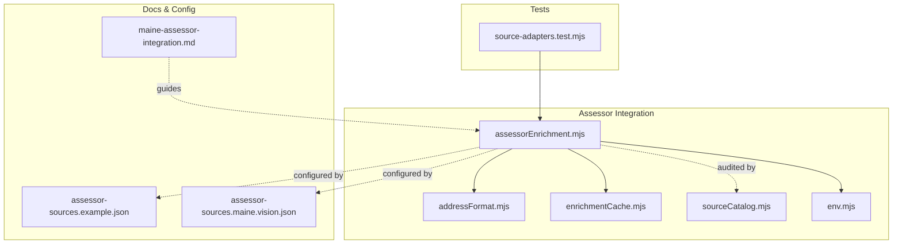
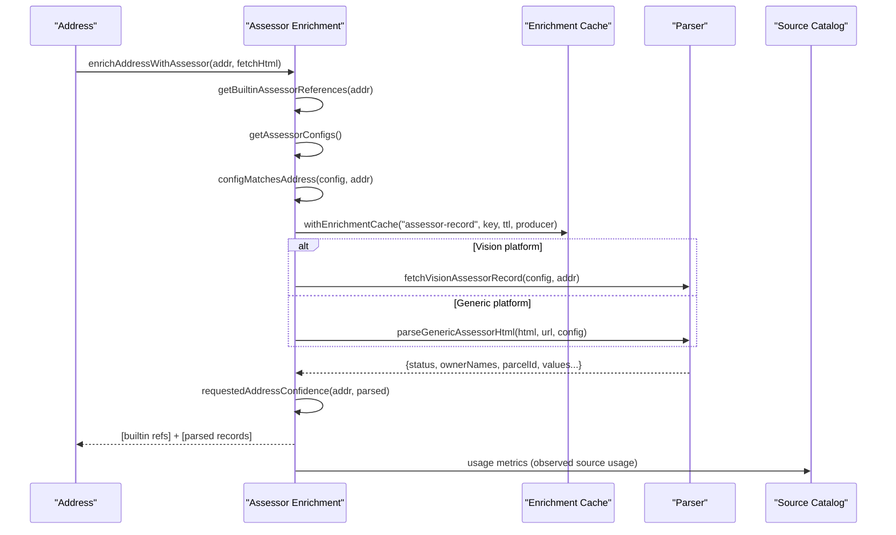
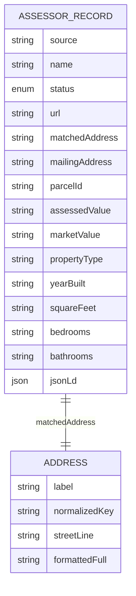
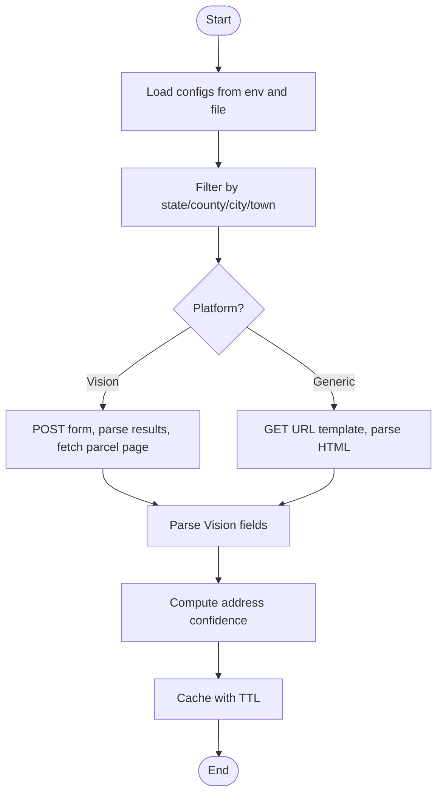
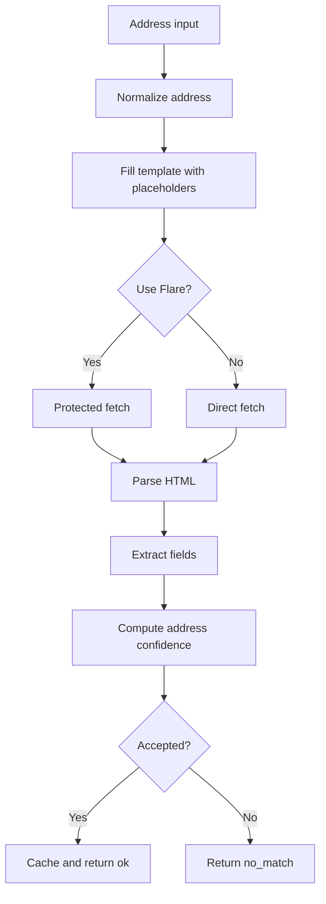
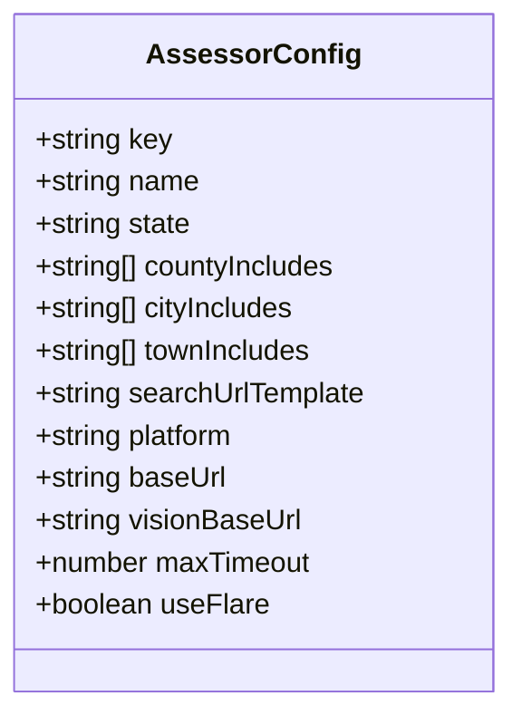
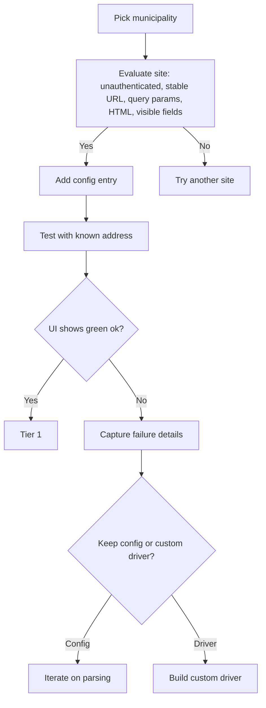
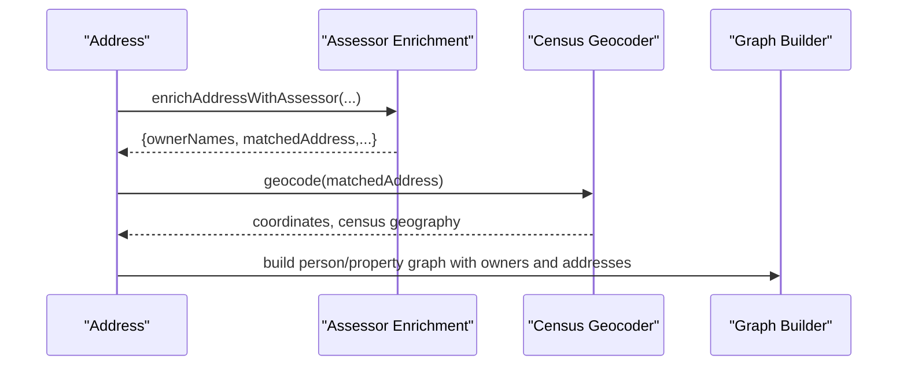
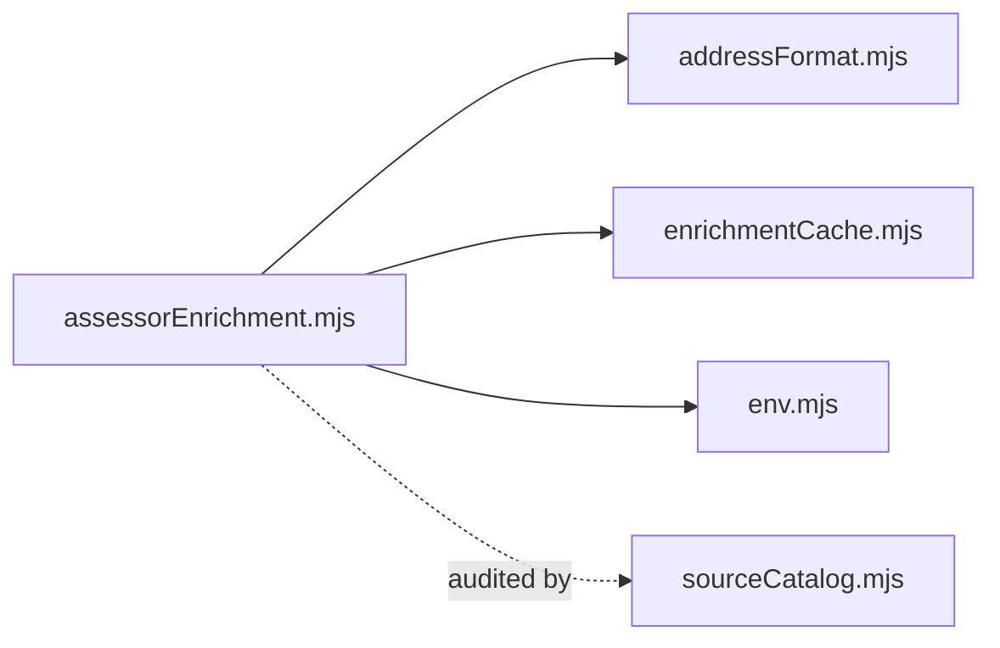

# Assessor Integration

<cite>
**Referenced Files in This Document**
- [assessorEnrichment.mjs](file://src/assessorEnrichment.mjs)
- [addressFormat.mjs](file://src/addressFormat.mjs)
- [enrichmentCache.mjs](file://src/enrichmentCache.mjs)
- [sourceCatalog.mjs](file://src/sourceCatalog.mjs)
- [env.mjs](file://src/env.mjs)
- [README.md](file://README.md)
- [maine-assessor-integration.md](file://docs/maine-assessor-integration.md)
- [assessor-sources.example.json](file://docs/assessor-sources.example.json)
- [assessor-sources.maine.vision.json](file://docs/assessor-sources.maine.vision.json)
- [source-adapters.test.mjs](file://test/source-adapters.test.mjs)
- [server.mjs](file://src/server.mjs)
</cite>

## Table of Contents
1. [Introduction](#introduction)
2. [Project Structure](#project-structure)
3. [Core Components](#core-components)
4. [Architecture Overview](#architecture-overview)
5. [Detailed Component Analysis](#detailed-component-analysis)
6. [Dependency Analysis](#dependency-analysis)
7. [Performance Considerations](#performance-considerations)
8. [Troubleshooting Guide](#troubleshooting-guide)
9. [Conclusion](#conclusion)
10. [Appendices](#appendices)

## Introduction
This document explains the assessor integration system with a focus on property record enrichment. It presents the Maine assessor integration as a case study for government data sources, documents the assessor data model, describes the integration architecture, outlines the data transformation pipeline, and details the configuration system for managing multiple assessor sources. It also addresses data validation, privacy, and legal compliance for public records access, and provides examples of property-to-person linkage and geographic enrichment workflows.

## Project Structure
The assessor integration spans several modules:
- Assessor enrichment logic and parsers
- Address formatting utilities
- Enrichment caching
- Source catalog and audit
- Environment configuration
- Documentation and example configurations
- Tests validating parsers and references

**Diagram sources**
- [assessorEnrichment.mjs:1-835](file://src/assessorEnrichment.mjs#L1-L835)
- [addressFormat.mjs:1-155](file://src/addressFormat.mjs#L1-L155)
- [enrichmentCache.mjs:1-117](file://src/enrichmentCache.mjs#L1-L117)
- [sourceCatalog.mjs:1-722](file://src/sourceCatalog.mjs#L1-L722)
- [env.mjs:1-8](file://src/env.mjs#L1-L8)
- [maine-assessor-integration.md:1-155](file://docs/maine-assessor-integration.md#L1-L155)
- [assessor-sources.example.json:1-12](file://docs/assessor-sources.example.json#L1-L12)
- [assessor-sources.maine.vision.json:1-290](file://docs/assessor-sources.maine.vision.json#L1-L290)
- [source-adapters.test.mjs:1-538](file://test/source-adapters.test.mjs#L1-L538)

**Section sources**
- [assessorEnrichment.mjs:1-835](file://src/assessorEnrichment.mjs#L1-L835)
- [addressFormat.mjs:1-155](file://src/addressFormat.mjs#L1-L155)
- [enrichmentCache.mjs:1-117](file://src/enrichmentCache.mjs#L1-L117)
- [sourceCatalog.mjs:1-722](file://src/sourceCatalog.mjs#L1-L722)
- [env.mjs:1-8](file://src/env.mjs#L1-L8)
- [maine-assessor-integration.md:1-155](file://docs/maine-assessor-integration.md#L1-L155)
- [assessor-sources.example.json:1-12](file://docs/assessor-sources.example.json#L1-L12)
- [assessor-sources.maine.vision.json:1-290](file://docs/assessor-sources.maine.vision.json#L1-L290)
- [source-adapters.test.mjs:1-538](file://test/source-adapters.test.mjs#L1-L538)

## Core Components
- Assessor enrichment orchestrator: selects matching assessor configs, fetches pages, parses results, and merges built-in references.
- Generic HTML parser: extracts common fields (owner, parcel ID, assessed/market value, mailing address, property type, year built, area, bedrooms, bathrooms).
- Vision platform driver: handles ASP.NET forms, hidden fields, and structured table parsing for Vision-based systems.
- Address formatting utilities: normalize and present addresses consistently for template filling and matching.
- Enrichment cache: persists and deduplicates assessor records with TTL and eviction policies.
- Source catalog: defines the “assessor_records” source family, its capabilities, and usage metrics.

**Section sources**
- [assessorEnrichment.mjs:769-835](file://src/assessorEnrichment.mjs#L769-L835)
- [assessorEnrichment.mjs:723-762](file://src/assessorEnrichment.mjs#L723-L762)
- [assessorEnrichment.mjs:588-685](file://src/assessorEnrichment.mjs#L588-L685)
- [addressFormat.mjs:123-154](file://src/addressFormat.mjs#L123-L154)
- [enrichmentCache.mjs:48-117](file://src/enrichmentCache.mjs#L48-L117)
- [sourceCatalog.mjs:294-330](file://src/sourceCatalog.mjs#L294-L330)

## Architecture Overview
The system integrates assessor data through a configuration-driven approach. For each address, it:
- Loads built-in references for Maine counties.
- Loads configured assessor sources from environment or file.
- Filters configs by state/county/city/town.
- Fetches pages using either direct fetch or protected fetch (Flare/Playwright).
- Parses HTML using generic or platform-specific parsers.
- Validates address confidence and caches results.

**Diagram sources**
- [assessorEnrichment.mjs:769-835](file://src/assessorEnrichment.mjs#L769-L835)
- [assessorEnrichment.mjs:723-762](file://src/assessorEnrichment.mjs#L723-L762)
- [assessorEnrichment.mjs:588-685](file://src/assessorEnrichment.mjs#L588-L685)
- [enrichmentCache.mjs:99-117](file://src/enrichmentCache.mjs#L99-L117)
- [sourceCatalog.mjs:637-668](file://src/sourceCatalog.mjs#L637-L668)

## Detailed Component Analysis

### Assessor Data Model
The normalized assessor record includes:
- Source identification and status
- URL and matched address
- Owner names
- Parcel identifiers (e.g., APN, PID, MBLU)
- Tax and valuation fields (assessed value, market value)
- Property characteristics (year built, square footage, bedrooms, bathrooms, property type)
- Structured data extraction (generic fields and JSON-LD)

Validation and confidence:
- Address confidence computed by comparing requested street and city against matched/mailing addresses.
- Status values: ok, no_match, blocked, reference.

**Diagram sources**
- [assessorEnrichment.mjs:495-511](file://src/assessorEnrichment.mjs#L495-L511)
- [assessorEnrichment.mjs:745-761](file://src/assessorEnrichment.mjs#L745-L761)

**Section sources**
- [assessorEnrichment.mjs:495-511](file://src/assessorEnrichment.mjs#L495-L511)
- [assessorEnrichment.mjs:745-761](file://src/assessorEnrichment.mjs#L745-L761)
- [source-adapters.test.mjs:497-521](file://test/source-adapters.test.mjs#L497-L521)

### Integration Architecture
- Configuration sources: environment JSON and external file.
- Matching: state, countyIncludes, cityIncludes/townIncludes.
- Templates: placeholders for address parts and metadata.
- Engines: direct fetch or protected fetch (Flare/Playwright) depending on site requirements.
- Parsing: generic HTML extraction and Vision-specific form submission and table parsing.

**Diagram sources**
- [assessorEnrichment.mjs:120-125](file://src/assessorEnrichment.mjs#L120-L125)
- [assessorEnrichment.mjs:225-248](file://src/assessorEnrichment.mjs#L225-L248)
- [assessorEnrichment.mjs:588-685](file://src/assessorEnrichment.mjs#L588-L685)
- [assessorEnrichment.mjs:769-835](file://src/assessorEnrichment.mjs#L769-L835)

**Section sources**
- [assessorEnrichment.mjs:120-125](file://src/assessorEnrichment.mjs#L120-L125)
- [assessorEnrichment.mjs:225-248](file://src/assessorEnrichment.mjs#L225-L248)
- [assessorEnrichment.mjs:588-685](file://src/assessorEnrichment.mjs#L588-L685)
- [assessorEnrichment.mjs:769-835](file://src/assessorEnrichment.mjs#L769-L835)

### Data Transformation Pipeline
- Address normalization and presentation.
- Template substitution for search URLs.
- Fetch via direct or protected engine.
- Generic or Vision parsing.
- Confidence validation and status assignment.
- Caching and merging with built-in references.

**Diagram sources**
- [addressFormat.mjs:172-193](file://src/addressFormat.mjs#L172-L193)
- [assessorEnrichment.mjs:200-218](file://src/assessorEnrichment.mjs#L200-L218)
- [assessorEnrichment.mjs:769-835](file://src/assessorEnrichment.mjs#L769-L835)
- [assessorEnrichment.mjs:355-373](file://src/assessorEnrichment.mjs#L355-L373)

**Section sources**
- [addressFormat.mjs:172-193](file://src/addressFormat.mjs#L172-L193)
- [assessorEnrichment.mjs:200-218](file://src/assessorEnrichment.mjs#L200-L218)
- [assessorEnrichment.mjs:355-373](file://src/assessorEnrichment.mjs#L355-L373)
- [assessorEnrichment.mjs:769-835](file://src/assessorEnrichment.mjs#L769-L835)

### Configuration System
- Environment variables:
  - ASSESSOR_SOURCES_JSON: inline JSON array of configs.
  - ASSESSOR_SOURCES_FILE: path to a JSON file containing the same array.
  - ASSESSOR_CACHE_TTL_MS, ASSESSOR_TIMEOUT_MS, ASSESSOR_LOG_LEVEL, ASSESSOR_LOGGING.
- Config fields:
  - key, name, state, countyIncludes, cityIncludes/townIncludes, searchUrlTemplate, platform, baseUrl/visionBaseUrl, maxTimeout, useFlare.
- Example configurations:
  - Generic template example.
  - Maine Vision family.

**Diagram sources**
- [assessor-sources.example.json:1-12](file://docs/assessor-sources.example.json#L1-L12)
- [assessor-sources.maine.vision.json:1-290](file://docs/assessor-sources.maine.vision.json#L1-L290)

**Section sources**
- [maine-assessor-integration.md:55-103](file://docs/maine-assessor-integration.md#L55-L103)
- [assessor-sources.example.json:1-12](file://docs/assessor-sources.example.json#L1-L12)
- [assessor-sources.maine.vision.json:1-290](file://docs/assessor-sources.maine.vision.json#L1-L290)

### Maine Assessor Integration Case Study
- Fully integrated means: geocoding success, predictable search URL, reachable via direct or protected fetch, and HTML with structured fields.
- Recommended rollout order: focus on simple public search pages first, then static HTML with inconsistent layouts, then GIS-heavy or JS-heavy systems.
- Built-in references for Maine counties point to county directories and state/municipal pages.

**Diagram sources**
- [maine-assessor-integration.md:16-30](file://docs/maine-assessor-integration.md#L16-L30)
- [maine-assessor-integration.md:104-114](file://docs/maine-assessor-integration.md#L104-L114)
- [maine-assessor-integration.md:116-129](file://docs/maine-assessor-integration.md#L116-L129)
- [maine-assessor-integration.md:130-141](file://docs/maine-assessor-integration.md#L130-L141)

**Section sources**
- [maine-assessor-integration.md:1-155](file://docs/maine-assessor-integration.md#L1-L155)

### Property-to-Person Linkage and Geographic Enrichment
- Property-to-person linkage: owner names extracted from assessor records can be linked to person profiles via downstream enrichment and graph building.
- Geographic enrichment: address confidence and matched address fields enable alignment with geocoding and nearby-place context.

**Diagram sources**
- [assessorEnrichment.mjs:355-373](file://src/assessorEnrichment.mjs#L355-L373)
- [README.md:161-170](file://README.md#L161-L170)

**Section sources**
- [assessorEnrichment.mjs:355-373](file://src/assessorEnrichment.mjs#L355-L373)
- [README.md:161-170](file://README.md#L161-L170)

## Dependency Analysis
- Assessor enrichment depends on:
  - Address formatting for template values and presentation.
  - Enrichment cache for persistence and deduplication.
  - Environment configuration for timeouts, logging, and source definitions.
  - Source catalog for usage metrics and source family definitions.

**Diagram sources**
- [assessorEnrichment.mjs:1-18](file://src/assessorEnrichment.mjs#L1-L18)
- [addressFormat.mjs:1-155](file://src/addressFormat.mjs#L1-L155)
- [enrichmentCache.mjs:1-117](file://src/enrichmentCache.mjs#L1-L117)
- [sourceCatalog.mjs:1-722](file://src/sourceCatalog.mjs#L1-L722)

**Section sources**
- [assessorEnrichment.mjs:1-18](file://src/assessorEnrichment.mjs#L1-L18)
- [sourceCatalog.mjs:637-668](file://src/sourceCatalog.mjs#L637-L668)

## Performance Considerations
- Caching: TTL-based cache for assessor records with pruning and eviction to limit database growth.
- Deduplication: in-flight deduplication prevents concurrent duplicate fetches.
- Timeouts: configurable per-source and global timeouts for protected fetches.
- Logging: configurable verbosity to balance observability and noise.

[No sources needed since this section provides general guidance]

## Troubleshooting Guide
Common issues and remedies:
- Address not geocoding: ensure address normalization and presentation are correct.
- No confident match: verify address confidence computation and adjust matching logic.
- Blocked pages: detect blocked states and surface reasons; consider using protected fetch engines.
- Configuration mismatches: validate state/county/city filters and URL templates.
- Logging: use ASSESSOR_LOG_LEVEL to switch between signal and verbose traces.

**Section sources**
- [assessorEnrichment.mjs:325-346](file://src/assessorEnrichment.mjs#L325-L346)
- [assessorEnrichment.mjs:743-744](file://src/assessorEnrichment.mjs#L743-L744)
- [maine-assessor-integration.md:130-141](file://docs/maine-assessor-integration.md#L130-L141)

## Conclusion
The assessor integration system provides a robust, configuration-driven approach to property record enrichment. By combining generic HTML parsing with platform-specific drivers (e.g., Vision), it supports diverse assessor websites while maintaining consistent data models and validation. The system’s caching, logging, and audit capabilities enable scalable and observable enrichment across multiple jurisdictions, with Maine serving as a practical case study for government data integration.

## Appendices

### Privacy and Legal Compliance Notes
- Public records access: the system treats assessor data as public records and aligns with applicable laws and terms of service.
- Data minimization: only structured fields are extracted and cached.
- Auditability: logs and cache entries provide traceability for compliance reviews.

**Section sources**
- [README.md:103-103](file://README.md#L103-L103)
- [README.md:215-221](file://README.md#L215-L221)