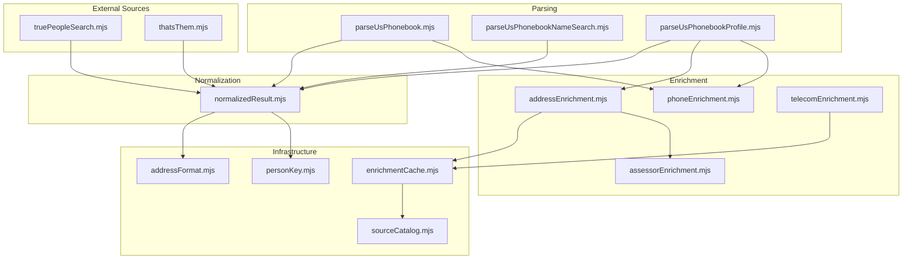
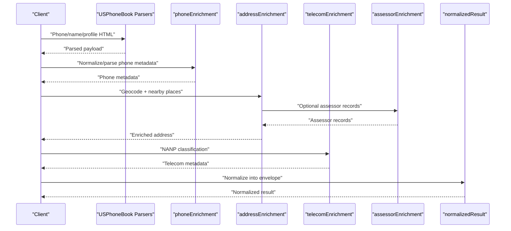
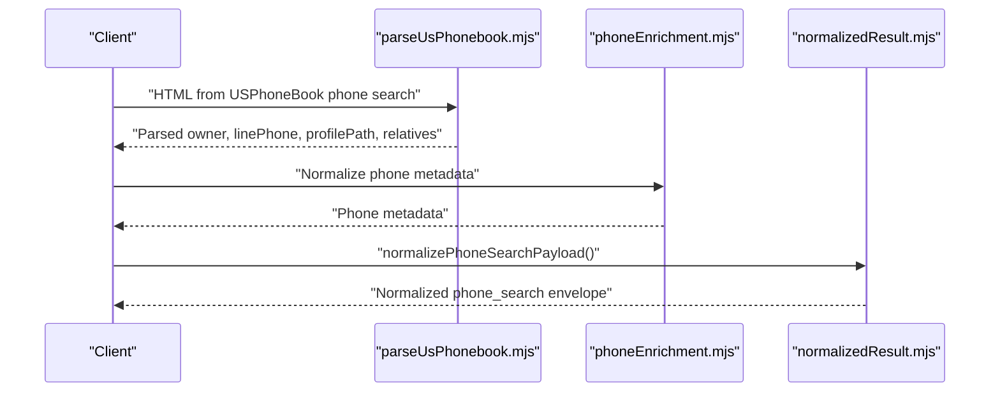
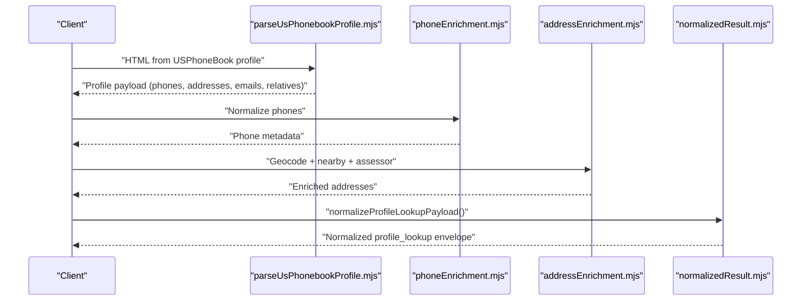
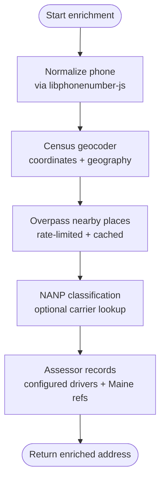
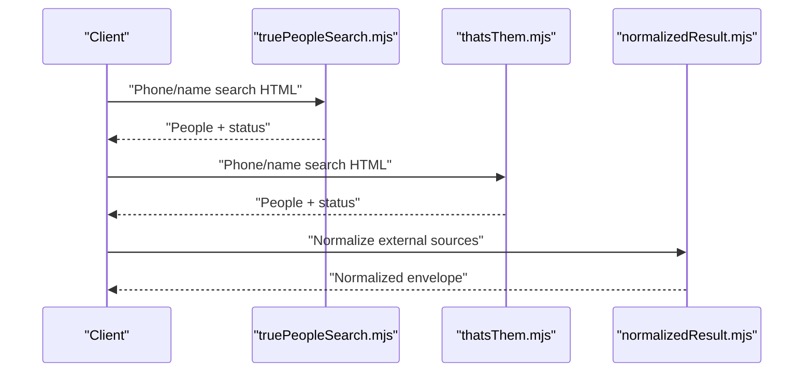
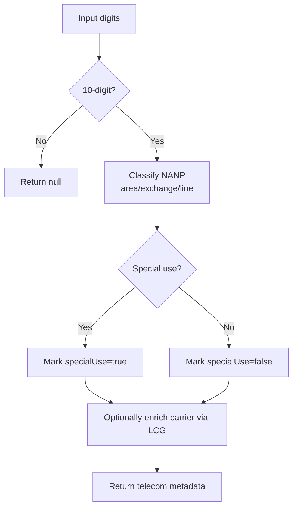
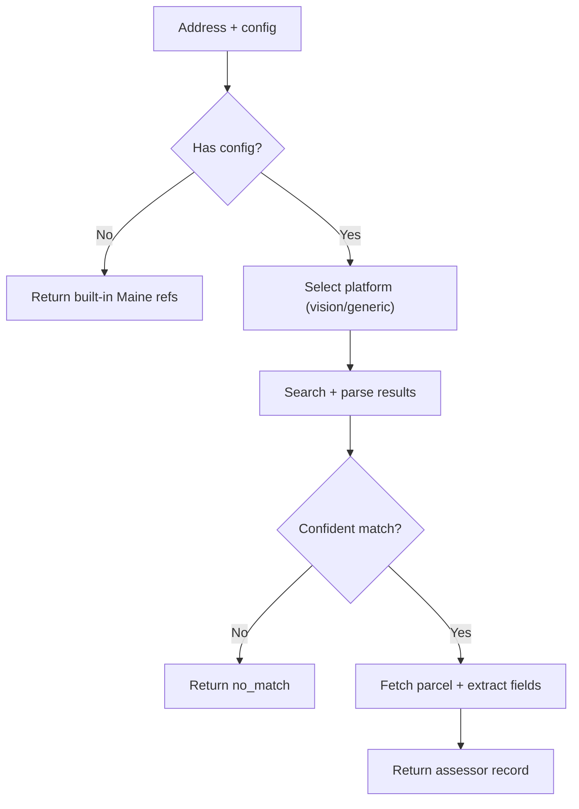
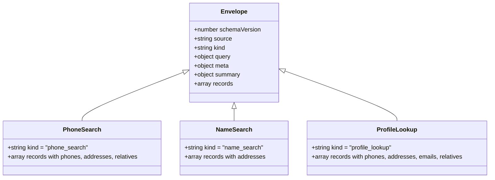
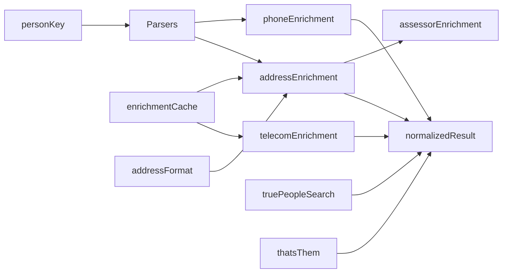

# Core Features

<cite>
**Referenced Files in This Document**
- [phoneEnrichment.mjs](file://src/phoneEnrichment.mjs)
- [addressEnrichment.mjs](file://src/addressEnrichment.mjs)
- [normalizedResult.mjs](file://src/normalizedResult.mjs)
- [telecomEnrichment.mjs](file://src/telecomEnrichment.mjs)
- [parseUsPhonebook.mjs](file://src/parseUsPhonebook.mjs)
- [parseUsPhonebookNameSearch.mjs](file://src/parseUsPhonebookNameSearch.mjs)
- [parseUsPhonebookProfile.mjs](file://src/parseUsPhonebookProfile.mjs)
- [truePeopleSearch.mjs](file://src/truePeopleSearch.mjs)
- [thatsThem.mjs](file://src/thatsThem.mjs)
- [assessorEnrichment.mjs](file://src/assessorEnrichment.mjs)
- [sourceCatalog.mjs](file://src/sourceCatalog.mjs)
- [enrichmentCache.mjs](file://src/enrichmentCache.mjs)
- [personKey.mjs](file://src/personKey.mjs)
- [addressFormat.mjs](file://src/addressFormat.mjs)
</cite>

## Table of Contents
1. [Introduction](#introduction)
2. [Project Structure](#project-structure)
3. [Core Components](#core-components)
4. [Architecture Overview](#architecture-overview)
5. [Detailed Component Analysis](#detailed-component-analysis)
6. [Dependency Analysis](#dependency-analysis)
7. [Performance Considerations](#performance-considerations)
8. [Troubleshooting Guide](#troubleshooting-guide)
9. [Conclusion](#conclusion)
10. [Appendices](#appendices)

## Introduction
This document explains the core features for reverse phone lookup and person enrichment in the application. It covers:
- Phone number search with USPhoneBook integration, including auto-follow profile functionality and result normalization
- Person profile enrichment: address extraction, phone number enrichment, email discovery, and relationship mapping
- Multi-layered enrichment pipeline: libphonenumber-js metadata, U.S. Census geocoding, nearby-place context via Overpass, and external source comparison with TruePeopleSearch and That's Them
- Telecom numbering analysis for NANP classification and assessor integration for property records
- Practical examples, result interpretation, data validation, normalized result contracts, and feature limitations with legal and ethical guidelines

## Project Structure
The core functionality is organized into cohesive modules:
- Parsing and normalization: USPhoneBook HTML parsers, normalized result envelopes
- Enrichment: phone metadata, address geocoding, nearby places, telecom classification, assessor records
- External sources: TruePeopleSearch and That's Them adapters
- Infrastructure: caching, source catalogs, and key utilities

**Diagram sources**
- [parseUsPhonebook.mjs:1-103](file://src/parseUsPhonebook.mjs#L1-L103)
- [parseUsPhonebookNameSearch.mjs:1-109](file://src/parseUsPhonebookNameSearch.mjs#L1-L109)
- [parseUsPhonebookProfile.mjs:1-616](file://src/parseUsPhonebookProfile.mjs#L1-L616)
- [phoneEnrichment.mjs:1-126](file://src/phoneEnrichment.mjs#L1-L126)
- [addressEnrichment.mjs:1-386](file://src/addressEnrichment.mjs#L1-L386)
- [telecomEnrichment.mjs:1-179](file://src/telecomEnrichment.mjs#L1-L179)
- [assessorEnrichment.mjs:1-835](file://src/assessorEnrichment.mjs#L1-L835)
- [truePeopleSearch.mjs:1-546](file://src/truePeopleSearch.mjs#L1-L546)
- [thatsThem.mjs:1-243](file://src/thatsThem.mjs#L1-L243)
- [normalizedResult.mjs:1-506](file://src/normalizedResult.mjs#L1-L506)
- [enrichmentCache.mjs:1-117](file://src/enrichmentCache.mjs#L1-L117)
- [personKey.mjs:1-258](file://src/personKey.mjs#L1-L258)
- [addressFormat.mjs:1-155](file://src/addressFormat.mjs#L1-L155)
- [sourceCatalog.mjs:1-722](file://src/sourceCatalog.mjs#L1-L722)

**Section sources**
- [parseUsPhonebook.mjs:1-103](file://src/parseUsPhonebook.mjs#L1-L103)
- [parseUsPhonebookNameSearch.mjs:1-109](file://src/parseUsPhonebookNameSearch.mjs#L1-L109)
- [parseUsPhonebookProfile.mjs:1-616](file://src/parseUsPhonebookProfile.mjs#L1-L616)
- [phoneEnrichment.mjs:1-126](file://src/phoneEnrichment.mjs#L1-L126)
- [addressEnrichment.mjs:1-386](file://src/addressEnrichment.mjs#L1-L386)
- [telecomEnrichment.mjs:1-179](file://src/telecomEnrichment.mjs#L1-L179)
- [assessorEnrichment.mjs:1-835](file://src/assessorEnrichment.mjs#L1-L835)
- [truePeopleSearch.mjs:1-546](file://src/truePeopleSearch.mjs#L1-L546)
- [thatsThem.mjs:1-243](file://src/thatsThem.mjs#L1-L243)
- [normalizedResult.mjs:1-506](file://src/normalizedResult.mjs#L1-L506)
- [enrichmentCache.mjs:1-117](file://src/enrichmentCache.mjs#L1-L117)
- [personKey.mjs:1-258](file://src/personKey.mjs#L1-L258)
- [addressFormat.mjs:1-155](file://src/addressFormat.mjs#L1-L155)
- [sourceCatalog.mjs:1-722](file://src/sourceCatalog.mjs#L1-L722)

## Core Components
- Reverse phone lookup with USPhoneBook:
  - Parses phone search results, extracts owner, line phone, profile path, and relatives
  - Auto-follows profiles when available and normalizes results into a unified envelope
- Person profile enrichment:
  - Extracts addresses, phones, emails, relatives, education, workplaces, and marital relations
  - Normalizes addresses and builds time ranges and current flags
- Multi-layered enrichment:
  - Phone metadata via libphonenumber-js
  - Census geocoding for coordinates and geography
  - Nearby places via Overpass with rate-limiting and caching
  - Telecom NANP classification and optional carrier/rate-center lookup
  - Assessor records via configurable drivers and built-in Maine references
- External source comparison:
  - TruePeopleSearch and That's Them adapters with blocking detection and deduplication
- Normalized result contracts:
  - Schema-versioned envelopes with compacted fields, record types, and metadata for downstream integrations

**Section sources**
- [parseUsPhonebook.mjs:1-103](file://src/parseUsPhonebook.mjs#L1-L103)
- [parseUsPhonebookProfile.mjs:1-616](file://src/parseUsPhonebookProfile.mjs#L1-L616)
- [phoneEnrichment.mjs:1-126](file://src/phoneEnrichment.mjs#L1-L126)
- [addressEnrichment.mjs:1-386](file://src/addressEnrichment.mjs#L1-L386)
- [telecomEnrichment.mjs:1-179](file://src/telecomEnrichment.mjs#L1-L179)
- [assessorEnrichment.mjs:1-835](file://src/assessorEnrichment.mjs#L1-L835)
- [truePeopleSearch.mjs:1-546](file://src/truePeopleSearch.mjs#L1-L546)
- [thatsThem.mjs:1-243](file://src/thatsThem.mjs#L1-L243)
- [normalizedResult.mjs:1-506](file://src/normalizedResult.mjs#L1-L506)

## Architecture Overview
The system integrates parsing, enrichment, and normalization into a cohesive pipeline. External sources and telecom/assessor enrichment are layered atop normalized results to produce a unified, schema-versioned envelope suitable for graph and downstream systems.

**Diagram sources**
- [parseUsPhonebook.mjs:1-103](file://src/parseUsPhonebook.mjs#L1-L103)
- [parseUsPhonebookNameSearch.mjs:1-109](file://src/parseUsPhonebookNameSearch.mjs#L1-L109)
- [parseUsPhonebookProfile.mjs:1-616](file://src/parseUsPhonebookProfile.mjs#L1-L616)
- [phoneEnrichment.mjs:1-126](file://src/phoneEnrichment.mjs#L1-L126)
- [addressEnrichment.mjs:1-386](file://src/addressEnrichment.mjs#L1-L386)
- [telecomEnrichment.mjs:1-179](file://src/telecomEnrichment.mjs#L1-L179)
- [assessorEnrichment.mjs:1-835](file://src/assessorEnrichment.mjs#L1-L835)
- [normalizedResult.mjs:1-506](file://src/normalizedResult.mjs#L1-L506)

## Detailed Component Analysis

### Reverse Phone Lookup with USPhoneBook
- Parses phone search pages to extract owner name, line phone, profile path, and relatives
- Supports auto-follow profile when a profile link is present
- Normalizes phone metadata and produces a normalized phone search envelope

**Diagram sources**
- [parseUsPhonebook.mjs:1-103](file://src/parseUsPhonebook.mjs#L1-L103)
- [phoneEnrichment.mjs:1-126](file://src/phoneEnrichment.mjs#L1-L126)
- [normalizedResult.mjs:167-244](file://src/normalizedResult.mjs#L167-L244)

**Section sources**
- [parseUsPhonebook.mjs:1-103](file://src/parseUsPhonebook.mjs#L1-L103)
- [phoneEnrichment.mjs:1-126](file://src/phoneEnrichment.mjs#L1-L126)
- [normalizedResult.mjs:167-244](file://src/normalizedResult.mjs#L167-L244)

### Person Profile Enrichment
- Extracts addresses, phones, emails, relatives, education, workplaces, and marital relations
- Normalizes addresses and computes current flags and time ranges
- Produces a normalized profile lookup envelope

**Diagram sources**
- [parseUsPhonebookProfile.mjs:1-616](file://src/parseUsPhonebookProfile.mjs#L1-L616)
- [phoneEnrichment.mjs:1-126](file://src/phoneEnrichment.mjs#L1-L126)
- [addressEnrichment.mjs:1-386](file://src/addressEnrichment.mjs#L1-L386)
- [normalizedResult.mjs:337-381](file://src/normalizedResult.mjs#L337-L381)

**Section sources**
- [parseUsPhonebookProfile.mjs:1-616](file://src/parseUsPhonebookProfile.mjs#L1-L616)
- [addressEnrichment.mjs:1-386](file://src/addressEnrichment.mjs#L1-L386)
- [normalizedResult.mjs:337-381](file://src/normalizedResult.mjs#L337-L381)

### Multi-Layered Enrichment Pipeline
- Phone metadata via libphonenumber-js: normalization, formatting, validity, and type
- Census geocoding: address-to-coordinates and census geography extraction
- Nearby places via Overpass: POIs near coordinates with rate-limiting and caching
- Telecom NANP classification: area/exchange categorization and optional carrier/rate-center lookup
- Assessor records: configurable drivers and built-in Maine references with confidence checks

**Diagram sources**
- [phoneEnrichment.mjs:1-126](file://src/phoneEnrichment.mjs#L1-L126)
- [addressEnrichment.mjs:1-386](file://src/addressEnrichment.mjs#L1-L386)
- [telecomEnrichment.mjs:1-179](file://src/telecomEnrichment.mjs#L1-L179)
- [assessorEnrichment.mjs:1-835](file://src/assessorEnrichment.mjs#L1-L835)

**Section sources**
- [phoneEnrichment.mjs:1-126](file://src/phoneEnrichment.mjs#L1-L126)
- [addressEnrichment.mjs:1-386](file://src/addressEnrichment.mjs#L1-L386)
- [telecomEnrichment.mjs:1-179](file://src/telecomEnrichment.mjs#L1-L179)
- [assessorEnrichment.mjs:1-835](file://src/assessorEnrichment.mjs#L1-L835)

### External Source Comparison (TruePeopleSearch and That's Them)
- TruePeopleSearch:
  - Builds search URLs, detects blocking/challenges, parses result cards, and deduplicates people
  - Extracts names, ages, addresses, phones, and relatives
- That's Them:
  - Builds candidate URLs, detects blocking and not-found states, parses cards, and deduplicates people
  - Extracts names, ages, addresses, phones, and emails

**Diagram sources**
- [truePeopleSearch.mjs:1-546](file://src/truePeopleSearch.mjs#L1-L546)
- [thatsThem.mjs:1-243](file://src/thatsThem.mjs#L1-L243)
- [normalizedResult.mjs:1-506](file://src/normalizedResult.mjs#L1-L506)

**Section sources**
- [truePeopleSearch.mjs:1-546](file://src/truePeopleSearch.mjs#L1-L546)
- [thatsThem.mjs:1-243](file://src/thatsThem.mjs#L1-L243)
- [normalizedResult.mjs:1-506](file://src/normalizedResult.mjs#L1-L506)

### Telecom Numbering Analysis (NANP Classification)
- Classifies NANP area/exchange and line-number characteristics
- Detects special-use categories (toll-free, premium, N11 services)
- Optional carrier/rate-center lookup via Local Calling Guide with caching

**Diagram sources**
- [telecomEnrichment.mjs:118-179](file://src/telecomEnrichment.mjs#L118-L179)

**Section sources**
- [telecomEnrichment.mjs:1-179](file://src/telecomEnrichment.mjs#L1-L179)

### Assessor Integration Framework
- Configurable drivers for assessor/property records with address templating
- Built-in Maine references and county directories
- Vision-based parsers with search/result navigation and confidence checks
- Generic HTML extraction for non-Vision sites

**Diagram sources**
- [assessorEnrichment.mjs:1-835](file://src/assessorEnrichment.mjs#L1-L835)

**Section sources**
- [assessorEnrichment.mjs:1-835](file://src/assessorEnrichment.mjs#L1-L835)

### Normalized Result Contracts
- Schema-versioned envelopes with compacted fields, record types, and metadata
- Phone search, name search, and profile lookup envelopes define standardized outputs
- Graph rebuild helpers convert normalized forms back into actionable items

**Diagram sources**
- [normalizedResult.mjs:1-506](file://src/normalizedResult.mjs#L1-L506)

**Section sources**
- [normalizedResult.mjs:1-506](file://src/normalizedResult.mjs#L1-L506)

## Dependency Analysis
- Parsing depends on Cheerio and person-key utilities for deduplication
- Enrichment composes phone, address, telecom, and assessor modules
- External sources integrate via parsers and normalization
- Caching ensures efficient reuse of expensive operations

**Diagram sources**
- [parseUsPhonebook.mjs:1-103](file://src/parseUsPhonebook.mjs#L1-L103)
- [parseUsPhonebookProfile.mjs:1-616](file://src/parseUsPhonebookProfile.mjs#L1-L616)
- [phoneEnrichment.mjs:1-126](file://src/phoneEnrichment.mjs#L1-L126)
- [addressEnrichment.mjs:1-386](file://src/addressEnrichment.mjs#L1-L386)
- [telecomEnrichment.mjs:1-179](file://src/telecomEnrichment.mjs#L1-L179)
- [assessorEnrichment.mjs:1-835](file://src/assessorEnrichment.mjs#L1-L835)
- [truePeopleSearch.mjs:1-546](file://src/truePeopleSearch.mjs#L1-L546)
- [thatsThem.mjs:1-243](file://src/thatsThem.mjs#L1-L243)
- [normalizedResult.mjs:1-506](file://src/normalizedResult.mjs#L1-L506)
- [enrichmentCache.mjs:1-117](file://src/enrichmentCache.mjs#L1-L117)
- [personKey.mjs:1-258](file://src/personKey.mjs#L1-L258)
- [addressFormat.mjs:1-155](file://src/addressFormat.mjs#L1-L155)

**Section sources**
- [sourceCatalog.mjs:1-722](file://src/sourceCatalog.mjs#L1-L722)
- [enrichmentCache.mjs:1-117](file://src/enrichmentCache.mjs#L1-L117)
- [personKey.mjs:1-258](file://src/personKey.mjs#L1-L258)
- [addressFormat.mjs:1-155](file://src/addressFormat.mjs#L1-L155)

## Performance Considerations
- Rate-limiting and queuing for Overpass to avoid throttling
- Aggressive caching for Census geocoding, Overpass, and assessor records
- In-flight deduplication prevents redundant enrichment work
- Deterministic phone normalization reduces repeated parsing
- Efficient address normalization and presentation reduce downstream processing overhead

[No sources needed since this section provides general guidance]

## Troubleshooting Guide
- External source blocking:
  - TruePeopleSearch: challenge detection and categorized reasons (e.g., Cloudflare, CAPTCHA)
  - That's Them: CAPTCHA and “odd traffic” detection
- Address confidence:
  - Assessor confidence checks compare requested address to matched/mailing addresses
- Cache and TTL:
  - Verify cache keys and TTLs for Census, Overpass, and assessor records
- Parser drift:
  - Persist raw HTML and structured outputs for replayable diagnostics

**Section sources**
- [truePeopleSearch.mjs:106-141](file://src/truePeopleSearch.mjs#L106-L141)
- [thatsThem.mjs:26-61](file://src/thatsThem.mjs#L26-L61)
- [assessorEnrichment.mjs:355-373](file://src/assessorEnrichment.mjs#L355-L373)
- [enrichmentCache.mjs:1-117](file://src/enrichmentCache.mjs#L1-L117)

## Conclusion
The system delivers robust reverse phone lookup and person enrichment through a modular pipeline that combines USPhoneBook parsing, multi-source enrichment, and strict normalization. The telecom and assessor layers add authoritative context, while caching and rate-limiting ensure reliability. The normalized result contracts enable downstream integrations and graph building.

[No sources needed since this section summarizes without analyzing specific files]

## Appendices

### Practical Examples and Interpretation
- Reverse phone lookup:
  - Input: phone number
  - Output: normalized phone_search envelope with owner, profile path, phones, addresses teaser, relatives, and metadata
- Person profile enrichment:
  - Input: profile HTML
  - Output: normalized profile_lookup envelope with phones, addresses (including periods/time ranges), emails, relatives, education, workplaces, and marital relations
- External source comparison:
  - Input: TruePeopleSearch/That’s Them HTML
  - Output: normalized envelopes with people lists and status indicators

**Section sources**
- [normalizedResult.mjs:167-244](file://src/normalizedResult.mjs#L167-L244)
- [normalizedResult.mjs:337-381](file://src/normalizedResult.mjs#L337-L381)
- [truePeopleSearch.mjs:341-400](file://src/truePeopleSearch.mjs#L341-L400)
- [thatsThem.mjs:190-242](file://src/thatsThem.mjs#L190-L242)

### Data Validation and Contracts
- Compact objects remove null/empty fields
- Clean text normalization and string arrays ensure consistent formatting
- Record-level fields validated and defaulted (e.g., isCurrent, periods)
- Schema versioning guarantees compatibility across updates

**Section sources**
- [normalizedResult.mjs:7-34](file://src/normalizedResult.mjs#L7-L34)
- [normalizedResult.mjs:88-144](file://src/normalizedResult.mjs#L88-L144)
- [normalizedResult.mjs:167-244](file://src/normalizedResult.mjs#L167-L244)
- [normalizedResult.mjs:337-381](file://src/normalizedResult.mjs#L337-L381)

### Feature Limitations, Legal, and Ethical Guidelines
- Browser challenges and anti-bot protections may block or throttle requests; implement session warming and respectful pacing
- Respect rate limits and terms of service for external sources
- Use normalized results and provenance to minimize reliance on unverified third-party claims
- Apply confidence thresholds for assessor matches and telecom classifications
- Maintain auditability by persisting raw source documents and parser outputs

**Section sources**
- [sourceCatalog.mjs:1-722](file://src/sourceCatalog.mjs#L1-L722)
- [assessorEnrichment.mjs:355-373](file://src/assessorEnrichment.mjs#L355-L373)
- [truePeopleSearch.mjs:106-141](file://src/truePeopleSearch.mjs#L106-L141)
- [thatsThem.mjs:26-61](file://src/thatsThem.mjs#L26-L61)