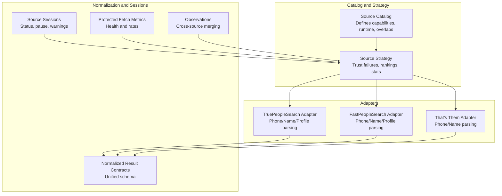
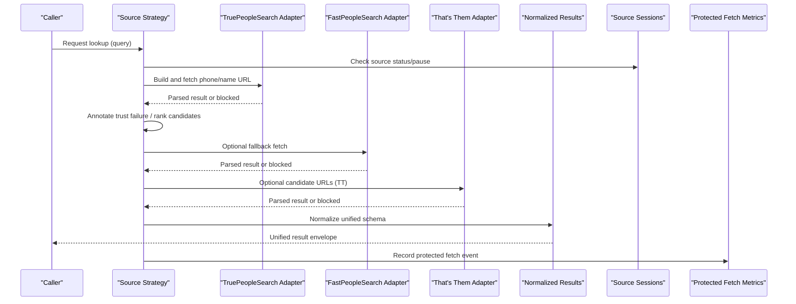
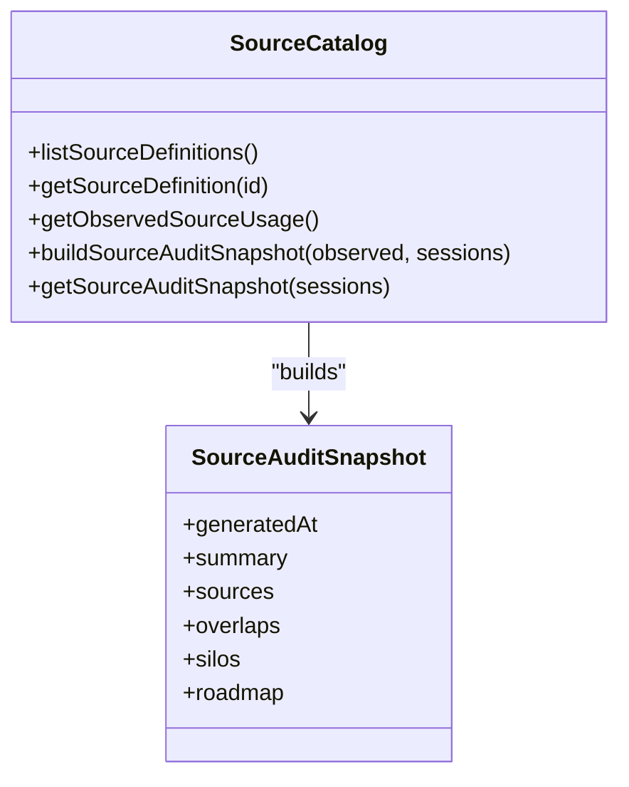
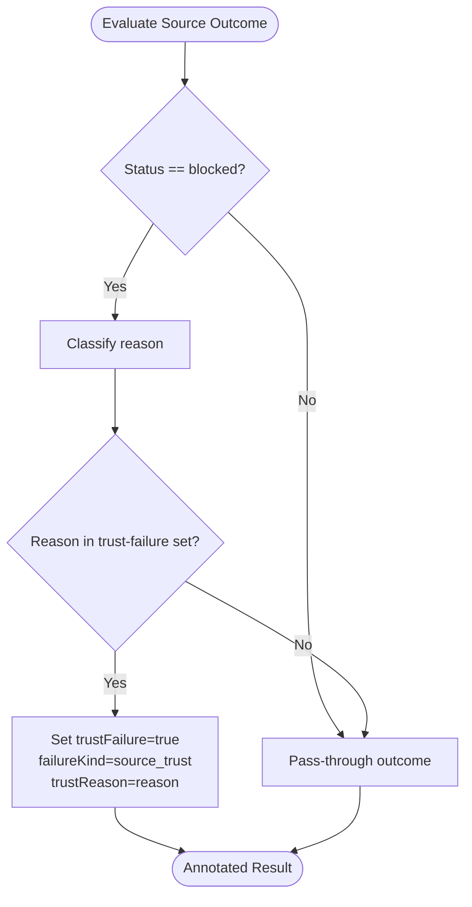
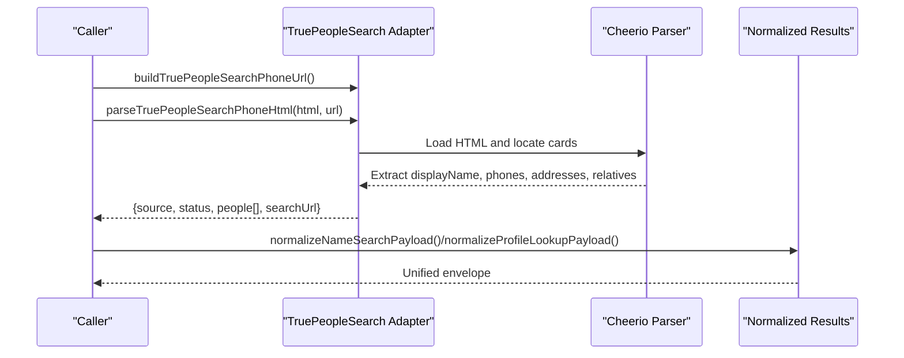
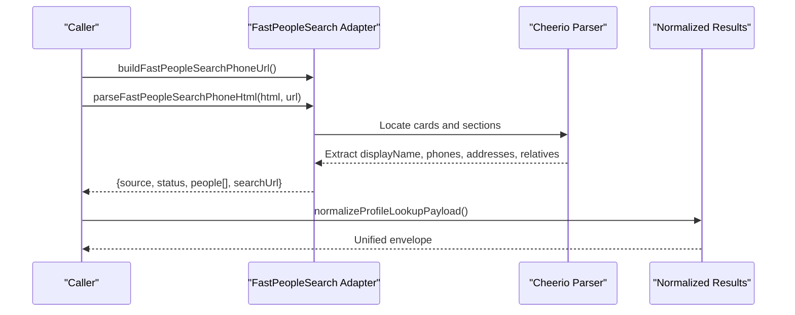
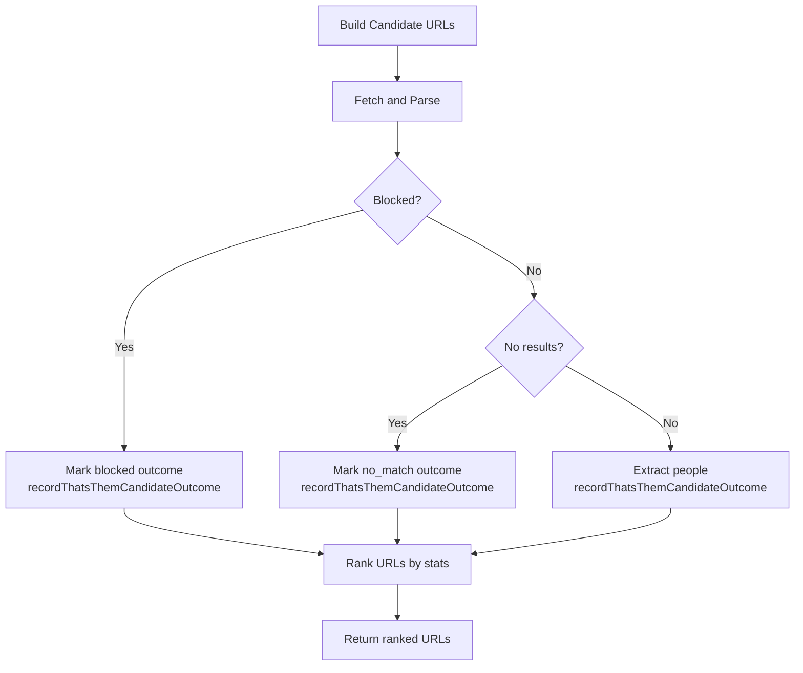
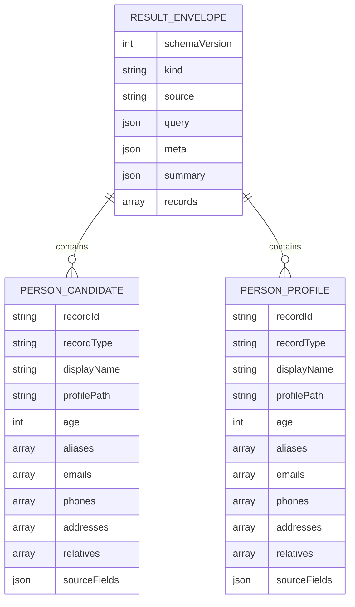
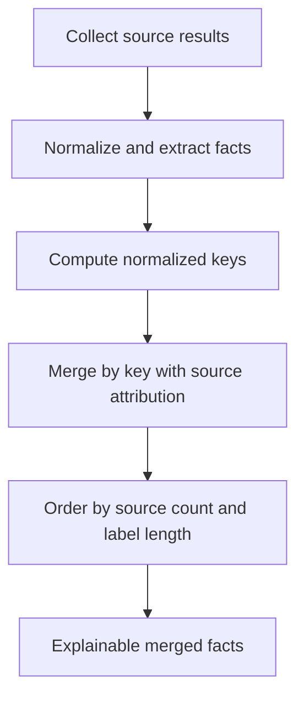
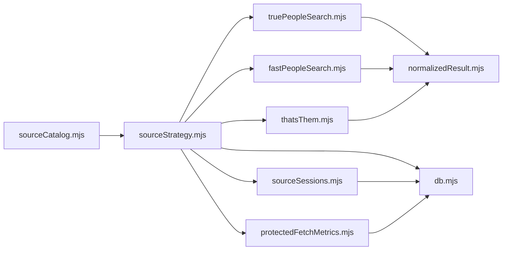

# External Source Integrations

<cite>
**Referenced Files in This Document**
- [sourceCatalog.mjs](file://src/sourceCatalog.mjs)
- [sourceStrategy.mjs](file://src/sourceStrategy.mjs)
- [truePeopleSearch.mjs](file://src/truePeopleSearch.mjs)
- [fastPeopleSearch.mjs](file://src/fastPeopleSearch.mjs)
- [thatsThem.mjs](file://src/thatsThem.mjs)
- [normalizedResult.mjs](file://src/normailzedResult.mjs)
- [sourceSessions.mjs](file://src/sourceSessions.mjs)
- [sourceObservations.mjs](file://src/sourceObservations.mjs)
- [protectedFetchMetrics.mjs](file://src/protectedFetchMetrics.mjs)
- [db.mjs](file://src/db/db.mjs)
- [source-adapters.test.mjs](file://test/source-adapters.test.mjs)
- [source-catalog.test.mjs](file://test/source-catalog.test.mjs)
- [source-sessions.test.mjs](file://test/source-sessions.test.mjs)
</cite>

## Table of Contents
1. [Introduction](#introduction)
2. [Project Structure](#project-structure)
3. [Core Components](#core-components)
4. [Architecture Overview](#architecture-overview)
5. [Detailed Component Analysis](#detailed-component-analysis)
6. [Dependency Analysis](#dependency-analysis)
7. [Performance Considerations](#performance-considerations)
8. [Troubleshooting Guide](#troubleshooting-guide)
9. [Conclusion](#conclusion)
10. [Appendices](#appendices)

## Introduction
This document explains how the application integrates with external people-finder sources, focusing on TruePeopleSearch, Fast People Search, and That's Them. It covers the source catalog that defines capabilities and availability, the strategy pattern that selects optimal sources, normalized result contracts ensuring consistent data representation, source-specific parsing logic, rate-limiting considerations, fallback mechanisms, reliability monitoring, health checks, and automatic failover strategies. It also demonstrates cross-source data comparison and conflict resolution.

## Project Structure
The external source integrations are implemented as modular adapters backed by a shared catalog and strategy layer. The catalog defines source capabilities, runtime characteristics, and operational guidance. The strategy layer evaluates outcomes and adapts selection heuristics. Each adapter encapsulates source-specific parsing and blocking detection. Observations and metrics provide cross-source merging and health insights.

**Diagram sources**
- [sourceCatalog.mjs](file://src/sourceCatalog.mjs)
- [sourceStrategy.mjs](file://src/sourceStrategy.mjs)
- [truePeopleSearch.mjs](file://src/truePeopleSearch.mjs)
- [fastPeopleSearch.mjs](file://src/fastPeopleSearch.mjs)
- [thatsThem.mjs](file://src/thatsThem.mjs)
- [normalizedResult.mjs](file://src/normailzedResult.mjs)
- [sourceSessions.mjs](file://src/sourceSessions.mjs)
- [sourceObservations.mjs](file://src/sourceObservations.mjs)
- [protectedFetchMetrics.mjs](file://src/protectedFetchMetrics.mjs)

**Section sources**
- [sourceCatalog.mjs](file://src/sourceCatalog.mjs)
- [sourceStrategy.mjs](file://src/sourceStrategy.mjs)

## Core Components
- Source Catalog: Defines each source’s status, access model, runtime, session requirements, data domains, overlaps, and automation blueprint. Provides audit snapshots and observed usage.
- Source Strategy: Detects trust failures, annotates results, ranks That's Them candidate URLs by historical outcomes, and persists pattern statistics.
- Adapters: Source-specific parsers for phone/name search and profile pages, with blocking detection and normalization.
- Normalized Results: Enforces a unified schema for phone search, name search, and profile lookup results.
- Sessions and Health: Tracks session status, warnings, and pauses; computes protected fetch health metrics.
- Observations: Merges facts across sources by normalized keys to support comparison and conflict resolution.

**Section sources**
- [sourceCatalog.mjs](file://src/sourceCatalog.mjs)
- [sourceStrategy.mjs](file://src/sourceStrategy.mjs)
- [truePeopleSearch.mjs](file://src/truePeopleSearch.mjs)
- [fastPeopleSearch.mjs](file://src/fastPeopleSearch.mjs)
- [thatsThem.mjs](file://src/thatsThem.mjs)
- [normalizedResult.mjs](file://src/normailzedResult.mjs)
- [sourceSessions.mjs](file://src/sourceSessions.mjs)
- [sourceObservations.mjs](file://src/sourceObservations.mjs)
- [protectedFetchMetrics.mjs](file://src/protectedFetchMetrics.mjs)

## Architecture Overview
The system composes a catalog-driven strategy with source adapters. The strategy interprets adapter outcomes, applies trust failure logic, and uses historical stats to rank candidates. Normalized results unify heterogeneous outputs. Sessions and metrics inform health-aware routing and automatic failover.

**Diagram sources**
- [sourceStrategy.mjs](file://src/sourceStrategy.mjs)
- [truePeopleSearch.mjs](file://src/truePeopleSearch.mjs)
- [fastPeopleSearch.mjs](file://src/fastPeopleSearch.mjs)
- [thatsThem.mjs](file://src/thatsThem.mjs)
- [normalizedResult.mjs](file://src/normailzedResult.mjs)
- [sourceSessions.mjs](file://src/sourceSessions.mjs)
- [protectedFetchMetrics.mjs](file://src/protectedFetchMetrics.mjs)

## Detailed Component Analysis

### Source Catalog Management
The catalog centralizes source definitions, including:
- Status and category
- Access model (browser challenge HTML vs direct HTTP)
- Runtime characteristics (FlareSolverr-backed vs persistent Playwright)
- Session requirements and interactive session support
- Data domains covered (person, address, phone, relative)
- Overlap groups with other sources
- Automation blueprint (frameworks, session strategy, navigation, extraction)

It also provides:
- Observed usage derived from entities and caches
- Audit snapshots combining definitions, observed usage, and live session states
- Roadmap and silo findings for future improvements

**Diagram sources**
- [sourceCatalog.mjs](file://src/sourceCatalog.mjs)

**Section sources**
- [sourceCatalog.mjs](file://src/sourceCatalog.mjs)
- [db.mjs](file://src/db/db.mjs)

### Strategy Pattern and Trust Failure Detection
The strategy layer:
- Identifies trust failures from blocked outcomes with specific reasons (e.g., attention_required, cloudflare, recaptcha)
- Annotates results with trustFailure flag and failureKind
- Ranks That's Them candidate URLs using historical pattern stats
- Persists and loads pattern stats to a SQLite table

**Diagram sources**
- [sourceStrategy.mjs](file://src/sourceStrategy.mjs)

**Section sources**
- [sourceStrategy.mjs](file://src/sourceStrategy.mjs)
- [db.mjs](file://src/db/db.mjs)

### TruePeopleSearch Integration
Capabilities:
- Phone and name search result pages
- Profile pages with aliases, addresses, phones, emails, relatives, associates
- Blocking detection for Cloudflare and anti-bot challenges
- URL builders for phone and name searches

Parsing highlights:
- Card-based extraction with robust signal detection
- Deduplication across cards and fields
- Extraction of addresses, phones, emails, relatives, and associates
- Profile parsing with current/previous addresses and phone line types

**Diagram sources**
- [truePeopleSearch.mjs](file://src/truePeopleSearch.mjs)
- [normalizedResult.mjs](file://src/normailzedResult.mjs)

**Section sources**
- [truePeopleSearch.mjs](file://src/truePeopleSearch.mjs)
- [normalizedResult.mjs](file://src/normailzedResult.mjs)

### Fast People Search Integration
Capabilities:
- Phone and name search result pages
- Profile pages with aliases, addresses, phones, relatives, associates
- Blocking detection for Cloudflare and anti-bot challenges
- URL builders for phone and name searches

Parsing highlights:
- Bootstrap-style cards with labeled sections
- Extraction of past/current addresses and relatives
- Profile parsing with time ranges and isCurrent flags

**Diagram sources**
- [fastPeopleSearch.mjs](file://src/fastPeopleSearch.mjs)
- [normalizedResult.mjs](file://src/normailzedResult.mjs)

**Section sources**
- [fastPeopleSearch.mjs](file://src/fastPeopleSearch.mjs)
- [normalizedResult.mjs](file://src/normailzedResult.mjs)

### That's Them Integration
Capabilities:
- Phone and name search result pages
- Candidate URL ladder with multiple patterns
- Blocking detection for humanity checks and CAPTCHA
- URL builders for phone search variants

Parsing highlights:
- Contact-card style extraction
- Deduplication across containers
- Ranking and skipping of candidate patterns based on historical outcomes

**Diagram sources**
- [thatsThem.mjs](file://src/thatsThem.mjs)
- [sourceStrategy.mjs](file://src/sourceStrategy.mjs)

**Section sources**
- [thatsThem.mjs](file://src/thatsThem.mjs)
- [sourceStrategy.mjs](file://src/sourceStrategy.mjs)
- [db.mjs](file://src/db/db.mjs)

### Normalized Result Contracts
The normalized schema ensures consistent representation across sources:
- Envelope fields: schemaVersion, kind, source, query, meta, summary, records
- Person candidate and profile record fields: displayName, profilePath, age, aliases, emails, phones, addresses, relatives
- Phone normalization: dashed, display, e164, type, isCurrent, isPrimary, phoneMetadata
- Address normalization: label/formatted, path, normalizedKey, timeRange, recordedRange, isCurrent, isTeaser, periods, censusGeocode, nearbyPlaces, assessorRecords

**Diagram sources**
- [normalizedResult.mjs](file://src/normailzedResult.mjs)

**Section sources**
- [normalizedResult.mjs](file://src/normailzedResult.mjs)

### Cross-Source Data Comparison and Conflict Resolution
The observations module merges facts across sources:
- Names, phones, addresses, emails, and relatives are normalized and merged by key
- Sources are tracked per fact to enable explainability
- Sorting by source count prioritizes facts with broader coverage

**Diagram sources**
- [sourceObservations.mjs](file://src/sourceObservations.mjs)

**Section sources**
- [sourceObservations.mjs](file://src/sourceObservations.mjs)

## Dependency Analysis
The following diagram shows key dependencies among modules involved in external source integrations.

**Diagram sources**
- [sourceCatalog.mjs](file://src/sourceCatalog.mjs)
- [sourceStrategy.mjs](file://src/sourceStrategy.mjs)
- [truePeopleSearch.mjs](file://src/truePeopleSearch.mjs)
- [fastPeopleSearch.mjs](file://src/fastPeopleSearch.mjs)
- [thatsThem.mjs](file://src/thatsThem.mjs)
- [normalizedResult.mjs](file://src/normailzedResult.mjs)
- [sourceSessions.mjs](file://src/sourceSessions.mjs)
- [protectedFetchMetrics.mjs](file://src/protectedFetchMetrics.mjs)
- [db.mjs](file://src/db/db.mjs)

**Section sources**
- [sourceCatalog.mjs](file://src/sourceCatalog.mjs)
- [sourceStrategy.mjs](file://src/sourceStrategy.mjs)
- [truePeopleSearch.mjs](file://src/truePeopleSearch.mjs)
- [fastPeopleSearch.mjs](file://src/fastPeopleSearch.mjs)
- [thatsThem.mjs](file://src/thatsThem.mjs)
- [normalizedResult.mjs](file://src/normailzedResult.mjs)
- [sourceSessions.mjs](file://src/sourceSessions.mjs)
- [protectedFetchMetrics.mjs](file://src/protectedFetchMetrics.mjs)
- [db.mjs](file://src/db/db.mjs)

## Performance Considerations
- Prefer persistent browser sessions for sources requiring anti-bot bypass (TruePeopleSearch, Fast People Search) to reduce repeated challenges.
- Use targeted URL patterns and candidate ranking (That's Them) to minimize retries and timeouts.
- Normalize and deduplicate results early to reduce downstream processing overhead.
- Cache normalized results and leverage observed usage to avoid redundant lookups.
- Monitor protected fetch health to detect degradation and adjust concurrency or pause problematic sources.

[No sources needed since this section provides general guidance]

## Troubleshooting Guide
Common issues and remedies:
- Blocked by anti-bot challenges: Check session status and ensure analyst-initiated warm-up for persistent sessions. Review last warning and detail to diagnose CAPTCHA or Cloudflare states.
- No match vs parseable no-match: Distinguish between “not found” and “blocked”; blocked outcomes should trigger retry or fallback.
- Session pausing: Paused sessions are marked inactive; restore prior status after resolution.
- Protected fetch health: Use health metrics to detect high challenge rates or low success rates and adjust routing.

**Section sources**
- [sourceSessions.mjs](file://src/sourceSessions.mjs)
- [protectedFetchMetrics.mjs](file://src/protectedFetchMetrics.mjs)
- [sourceStrategy.mjs](file://src/sourceStrategy.mjs)
- [truePeopleSearch.mjs](file://src/truePeopleSearch.mjs)
- [fastPeopleSearch.mjs](file://src/fastPeopleSearch.mjs)
- [thatsThem.mjs](file://src/thatsThem.mjs)

## Conclusion
The integration strategy leverages a catalog-driven approach with robust source adapters, normalized results, and health-aware routing. By detecting trust failures, ranking candidates, persisting historical stats, and merging facts across sources, the system achieves reliable, explainable, and resilient external data sourcing.

[No sources needed since this section summarizes without analyzing specific files]

## Appendices

### API and Behavior References
- Source catalog and audit snapshot construction
  - [sourceCatalog.mjs](file://src/sourceCatalog.mjs)
- Strategy trust failure detection and annotation
  - [sourceStrategy.mjs](file://src/sourceStrategy.mjs)
- TruePeopleSearch parsing and blocking detection
  - [truePeopleSearch.mjs](file://src/truePeopleSearch.mjs)
- Fast People Search parsing and blocking detection
  - [fastPeopleSearch.mjs](file://src/fastPeopleSearch.mjs)
- That's Them parsing, blocking detection, and candidate ranking
  - [thatsThem.mjs](file://src/thatsThem.mjs)
- Normalized result envelopes and record schemas
  - [normalizedResult.mjs](file://src/normailzedResult.mjs)
- Source sessions lifecycle and status management
  - [sourceSessions.mjs](file://src/sourceSessions.mjs)
- Cross-source observations and merging
  - [sourceObservations.mjs](file://src/sourceObservations.mjs)
- Protected fetch metrics and health computation
  - [protectedFetchMetrics.mjs](file://src/protectedFetchMetrics.mjs)
- Database schema for sessions and stats persistence
  - [db.mjs](file://src/db/db.mjs)

### Test Evidence
- Verified behaviors for adapters, strategy, catalog, and sessions
  - [source-adapters.test.mjs](file://test/source-adapters.test.mjs)
  - [source-catalog.test.mjs](file://test/source-catalog.test.mjs)
  - [source-sessions.test.mjs](file://test/source-sessions.test.mjs)