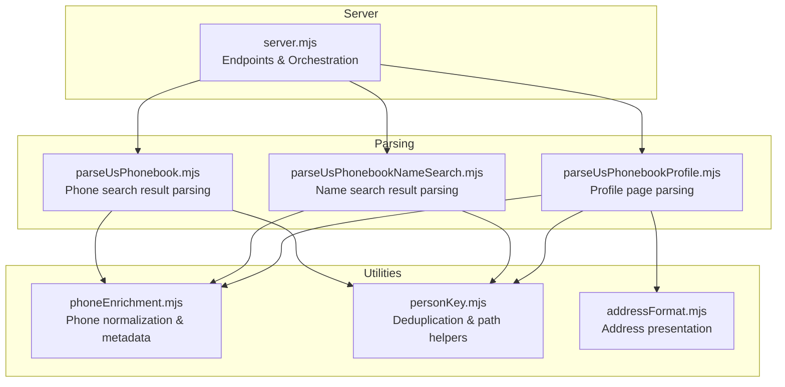
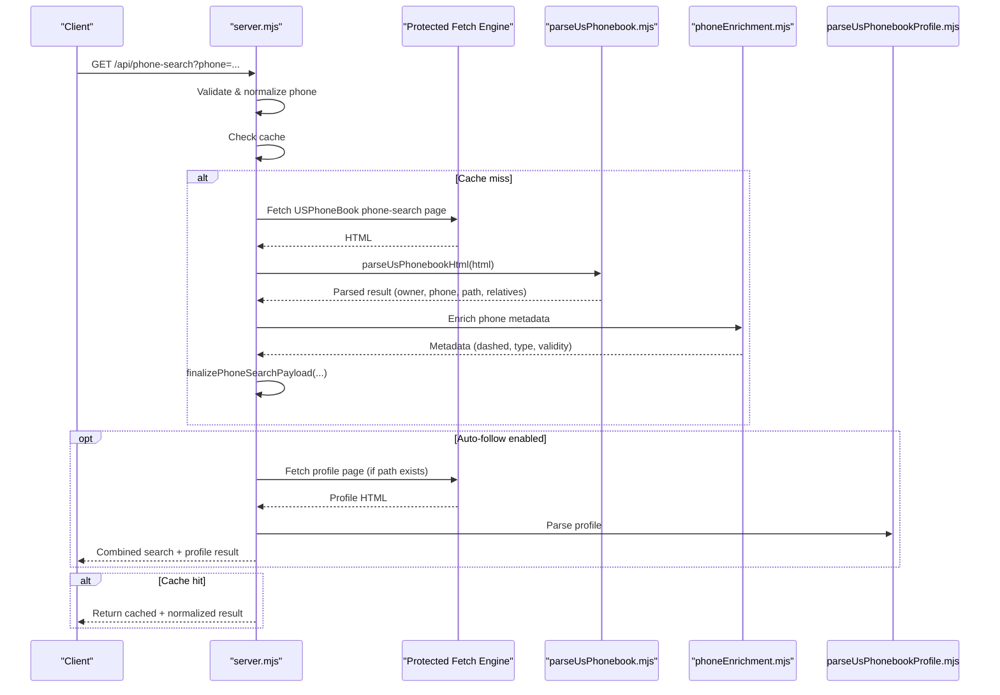
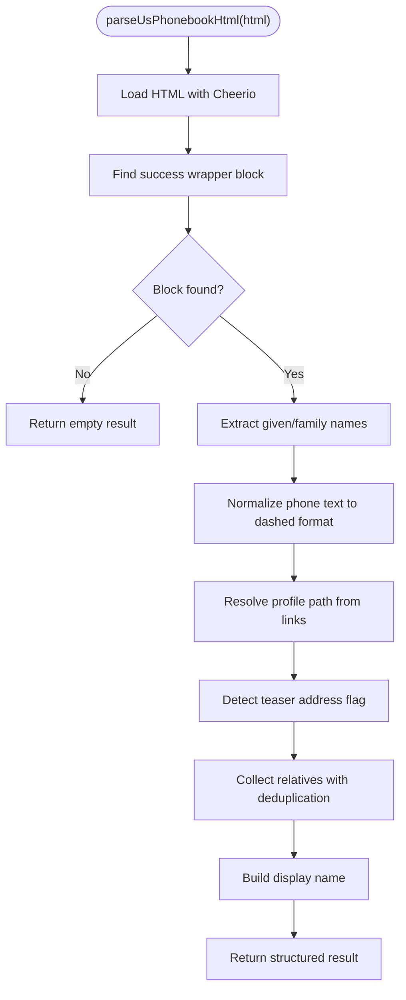
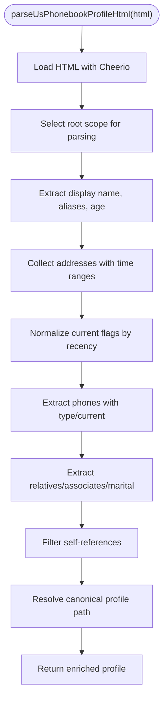
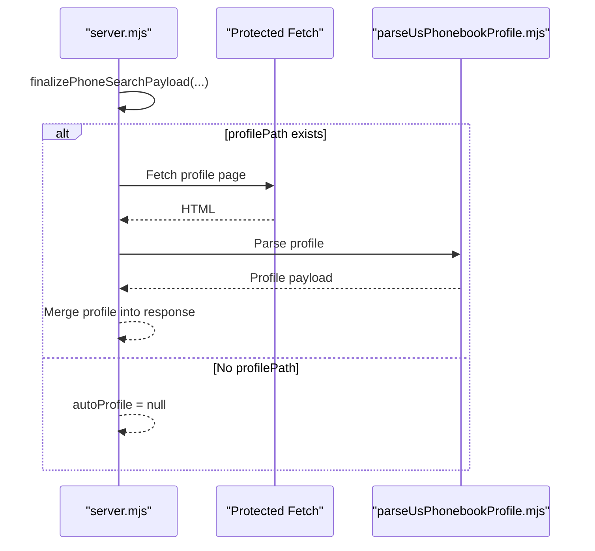
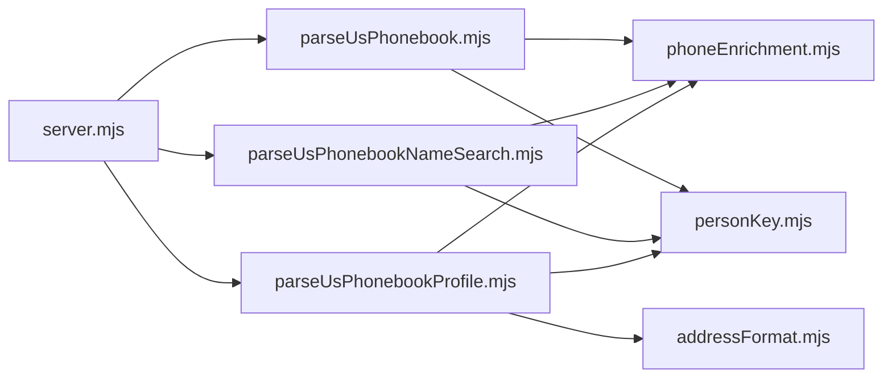

# Phone Number Search

<cite>
**Referenced Files in This Document**
- [server.mjs](file://src/server.mjs)
- [parseUsPhonebook.mjs](file://src/parseUsPhonebook.mjs)
- [parseUsPhonebookNameSearch.mjs](file://src/parseUsPhonebookNameSearch.mjs)
- [parseUsPhonebookProfile.mjs](file://src/parseUsPhonebookProfile.mjs)
- [phoneEnrichment.mjs](file://src/phoneEnrichment.mjs)
- [personKey.mjs](file://src/personKey.mjs)
- [addressFormat.mjs](file://src/addressFormat.mjs)
- [fixture-phone-page.html](file://test/fixture-phone-page.html)
</cite>

## Table of Contents
1. [Introduction](#introduction)
2. [Project Structure](#project-structure)
3. [Core Components](#core-components)
4. [Architecture Overview](#architecture-overview)
5. [Detailed Component Analysis](#detailed-component-analysis)
6. [Dependency Analysis](#dependency-analysis)
7. [Performance Considerations](#performance-considerations)
8. [Troubleshooting Guide](#troubleshooting-guide)
9. [Conclusion](#conclusion)

## Introduction
This document explains the phone number search functionality, focusing on the USPhoneBook integration and HTML parsing logic using Cheerio. It covers how search results are extracted, normalized, and enriched, including current owner detection, phone number normalization, relative person extraction, and the auto-follow profile mechanism. It also documents deduplication logic, profile path resolution, teaser address behavior, and practical guidance for common scenarios and troubleshooting.

## Project Structure
The phone number search pipeline is implemented as a server-side API that orchestrates fetching, parsing, enrichment, and optional ingestion of results. Key modules include:
- Server endpoints and orchestration
- USPhoneBook-specific parsers for search results and profiles
- Phone normalization utilities
- Person and profile path deduplication helpers
- Address presentation utilities

**Diagram sources**
- [server.mjs:3162-3307](file://src/server.mjs#L3162-L3307)
- [parseUsPhonebook.mjs:14-102](file://src/parseUsPhonebook.mjs#L14-L102)
- [parseUsPhonebookNameSearch.mjs:49-108](file://src/parseUsPhonebookNameSearch.mjs#L49-L108)
- [parseUsPhonebookProfile.mjs:253-615](file://src/parseUsPhonebookProfile.mjs#L253-L615)
- [phoneEnrichment.mjs:7-126](file://src/phoneEnrichment.mjs#L7-L126)
- [personKey.mjs:11-258](file://src/personKey.mjs#L11-L258)
- [addressFormat.mjs:123-155](file://src/addressFormat.mjs#L123-L155)

**Section sources**
- [server.mjs:3162-3307](file://src/server.mjs#L3162-L3307)
- [parseUsPhonebook.mjs:14-102](file://src/parseUsPhonebook.mjs#L14-L102)
- [parseUsPhonebookNameSearch.mjs:49-108](file://src/parseUsPhonebookNameSearch.mjs#L49-L108)
- [parseUsPhonebookProfile.mjs:253-615](file://src/parseUsPhonebookProfile.mjs#L253-L615)
- [phoneEnrichment.mjs:7-126](file://src/phoneEnrichment.mjs#L7-L126)
- [personKey.mjs:11-258](file://src/personKey.mjs#L11-L258)
- [addressFormat.mjs:123-155](file://src/addressFormat.mjs#L123-L155)

## Core Components
- Phone search endpoint: Validates input, resolves cache, fetches via protected fetch, parses, enriches, and optionally auto-follows a profile.
- USPhoneBook search result parser: Extracts current owner, normalized phone, profile path, teaser address flag, and relatives with deduplication.
- Name search result parser: Extracts query metadata and candidate rows with display names, ages, locations, prior addresses, and relative links.
- Profile parser: Extracts detailed owner info, aliases, addresses with recency scoring, phones with type, relatives, associates, emails, and marital links; resolves canonical profile path.
- Phone normalization: Converts various US phone formats to standardized dashed notation and metadata.
- Deduplication and path helpers: Normalize and deduplicate relative entries and profile paths; resolve canonical profile paths.

**Section sources**
- [server.mjs:3162-3307](file://src/server.mjs#L3162-L3307)
- [parseUsPhonebook.mjs:14-102](file://src/parseUsPhonebook.mjs#L14-L102)
- [parseUsPhonebookNameSearch.mjs:49-108](file://src/parseUsPhonebookNameSearch.mjs#L49-L108)
- [parseUsPhonebookProfile.mjs:253-615](file://src/parseUsPhonebookProfile.mjs#L253-L615)
- [phoneEnrichment.mjs:7-126](file://src/phoneEnrichment.mjs#L7-L126)
- [personKey.mjs:11-258](file://src/personKey.mjs#L11-L258)

## Architecture Overview
The phone number search flow integrates with protected fetch engines (Flare or Playwright) to retrieve USPhoneBook pages, then parses and normalizes the data. Optional external sources enrich the results. An auto-follow mechanism can fetch the detailed profile when available.

**Diagram sources**
- [server.mjs:3162-3307](file://src/server.mjs#L3162-L3307)
- [parseUsPhonebook.mjs:14-102](file://src/parseUsPhonebook.mjs#L14-L102)
- [phoneEnrichment.mjs:7-126](file://src/phoneEnrichment.mjs#L7-L126)
- [parseUsPhonebookProfile.mjs:253-615](file://src/parseUsPhonebookProfile.mjs#L253-L615)

## Detailed Component Analysis

### USPhoneBook Phone Search Parser
Responsibilities:
- Detect presence of a “current owner” block.
- Extract given/family names and construct a display name.
- Normalize the phone number text into a dashed format.
- Resolve a profile path from clickable links, preferring direct profile links.
- Detect teaser address availability.
- Extract relatives with deduplication across alternate paths.

Key behaviors:
- Uses Cheerio selectors targeting the success wrapper and specific class names.
- Normalizes phone text by removing extra whitespace and extracting digits.
- Resolves profile path from anchor elements, stripping hash fragments and query strings.
- Builds a relative map keyed by a deduplication key combining name and path, merging alternate paths when duplicates are detected.

**Diagram sources**
- [parseUsPhonebook.mjs:14-102](file://src/parseUsPhonebook.mjs#L14-L102)

**Section sources**
- [parseUsPhonebook.mjs:14-102](file://src/parseUsPhonebook.mjs#L14-L102)
- [personKey.mjs:130-145](file://src/personKey.mjs#L130-L145)

### Name Search Parser
Responsibilities:
- Extract query name, total records, total pages, and summary text.
- Iterate result blocks to collect candidates with:
  - Display name (with age stripped from heading)
  - Current city/state
  - Prior addresses (from structured lines or CSV-like segments)
  - Relative links with cleaned names and normalized paths
  - Explicit profile path or itemid-derived path

Edge cases handled:
- Age parsing from heading text.
- Prior address extraction from either structured lines or comma-separated text.
- Relative link normalization to canonical paths.

**Section sources**
- [parseUsPhonebookNameSearch.mjs:49-108](file://src/parseUsPhonebookNameSearch.mjs#L49-L108)
- [personKey.mjs:11-38](file://src/personKey.mjs#L11-L38)

### Profile Parser
Responsibilities:
- Extract display name, aliases, age.
- Build address records with time ranges and current flags, then normalize current flags based on recency.
- Extract phones with type classification and current flag.
- Extract relatives, associates, emails, and marital links with deduplication and filtering of self-references.
- Resolve canonical profile path from canonical link, hidden URL spans, or header spans, with strict checks to avoid non-profile links.

Address normalization logic:
- Computes recency scores from time ranges.
- Chooses preferred address based on current flag and recency.
- Merges periods for the same address.

Profile path resolution:
- Attempts canonical URL, then hidden spans, header spans, and fallback anchors.
- Validates path shape to ensure it is a person profile (not phone or address).

**Diagram sources**
- [parseUsPhonebookProfile.mjs:253-615](file://src/parseUsPhonebookProfile.mjs#L253-L615)
- [addressFormat.mjs:123-155](file://src/addressFormat.mjs#L123-L155)

**Section sources**
- [parseUsPhonebookProfile.mjs:253-615](file://src/parseUsPhonebookProfile.mjs#L253-L615)
- [addressFormat.mjs:123-155](file://src/addressFormat.mjs#L123-L155)

### Phone Number Normalization
- Converts raw input to digits-only and dashed format.
- Provides metadata (e164, international, type) using libphonenumber-js.
- Used to normalize search input and enrich parsed results.

**Section sources**
- [phoneEnrichment.mjs:7-126](file://src/phoneEnrichment.mjs#L7-L126)

### Relationship Deduplication and Profile Path Resolution
- Relative deduplication key considers:
  - Strict path key (after decoding and normalizing)
  - Loose slug key derived from path segments
  - Name fallback
- Unique profile paths are computed to merge alternate forms of the same profile.
- Canonical profile path resolution ensures stable identity across sources and formats.

**Section sources**
- [personKey.mjs:130-221](file://src/personKey.mjs#L130-L221)

### Teaser Address Behavior
- The teaser address flag indicates whether a “Full address available” link exists in the search result.
- This flag helps indicate when additional address details may be available in the detailed profile.

**Section sources**
- [parseUsPhonebook.mjs:56-56](file://src/parseUsPhonebook.mjs#L56-L56)

### Auto-Follow Profile Mechanism
- When enabled, the server attempts to fetch the detailed profile page using the resolved profile path.
- The profile fetch uses the same protected fetch engine and parsing pipeline.
- The resulting profile data is merged into the response without exposing raw HTML.

**Diagram sources**
- [server.mjs:1861-1881](file://src/server.mjs#L1861-L1881)
- [parseUsPhonebookProfile.mjs:253-615](file://src/parseUsPhonebookProfile.mjs#L253-L615)

**Section sources**
- [server.mjs:1861-1881](file://src/server.mjs#L1861-L1881)
- [parseUsPhonebookProfile.mjs:253-615](file://src/parseUsPhonebookProfile.mjs#L253-L615)

## Dependency Analysis
- The server orchestrates protected fetch, parsing, enrichment, and optional ingestion.
- Parsers depend on Cheerio for DOM traversal and on utility modules for normalization and deduplication.
- The profile parser additionally depends on address presentation utilities for consistent address formatting.

**Diagram sources**
- [server.mjs:3162-3307](file://src/server.mjs#L3162-L3307)
- [parseUsPhonebook.mjs:14-102](file://src/parseUsPhonebook.mjs#L14-L102)
- [parseUsPhonebookNameSearch.mjs:49-108](file://src/parseUsPhonebookNameSearch.mjs#L49-L108)
- [parseUsPhonebookProfile.mjs:253-615](file://src/parseUsPhonebookProfile.mjs#L253-L615)
- [phoneEnrichment.mjs:7-126](file://src/phoneEnrichment.mjs#L7-L126)
- [personKey.mjs:11-258](file://src/personKey.mjs#L11-L258)
- [addressFormat.mjs:123-155](file://src/addressFormat.mjs#L123-L155)

**Section sources**
- [server.mjs:3162-3307](file://src/server.mjs#L3162-L3307)
- [parseUsPhonebook.mjs:14-102](file://src/parseUsPhonebook.mjs#L14-L102)
- [parseUsPhonebookNameSearch.mjs:49-108](file://src/parseUsPhonebookNameSearch.mjs#L49-L108)
- [parseUsPhonebookProfile.mjs:253-615](file://src/parseUsPhonebookProfile.mjs#L253-L615)
- [phoneEnrichment.mjs:7-126](file://src/phoneEnrichment.mjs#L7-L126)
- [personKey.mjs:11-258](file://src/personKey.mjs#L11-L258)
- [addressFormat.mjs:123-155](file://src/addressFormat.mjs#L123-L155)

## Performance Considerations
- Protected fetch engines (Flare or Playwright) are used to handle anti-bot challenges; timeouts and wait-after settings can be tuned per request.
- Caching is supported for phone and name searches to reduce repeated network calls.
- Deduplication and merging of results minimize redundant processing and storage.
- Address recency scoring and normalization ensure the most relevant address is selected efficiently.

[No sources needed since this section provides general guidance]

## Troubleshooting Guide
Common issues and resolutions:
- Challenge required: The protected fetch engine reports a challenge (Cloudflare, CAPTCHA, etc.). Use the interactive session endpoints to complete the challenge and update the session state.
- Session required: Some sources require an established browser session; open the source in Settings and check the session.
- Blocked by anti-bot: External sources may return challenge pages; retry with a different engine or session.
- No match/no parseable people: The page may lack expected markers or contain minimal content; verify the query and consider external sources.
- Not found pages: Some sources return not-found responses for certain candidates; the system tries alternative URLs and records outcomes.

Practical steps:
- Verify phone format (10 digits or dashed).
- Enable auto-follow only when a profile path is present.
- Use cache bypass to force fresh fetches during testing.
- Inspect health and trust metrics endpoints for engine status.

**Section sources**
- [server.mjs:540-559](file://src/server.mjs#L540-L559)
- [server.mjs:1009-1090](file://src/server.mjs#L1009-L1090)
- [server.mjs:1096-1177](file://src/server.mjs#L1096-L1177)
- [server.mjs:1183-1310](file://src/server.mjs#L1183-L1310)
- [server.mjs:3162-3307](file://src/server.mjs#L3162-L3307)

## Conclusion
The phone number search functionality integrates robust parsing, normalization, and deduplication to deliver reliable owner and relative information from USPhoneBook. The system supports auto-following detailed profiles, handles teaser addresses, and provides mechanisms to deal with partial matches and missing data. With caching and protected fetch engines, it balances performance and reliability across varying website conditions.