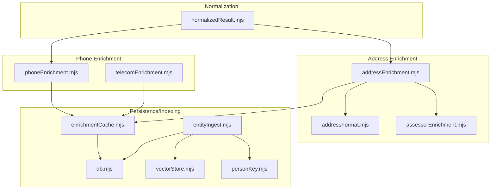
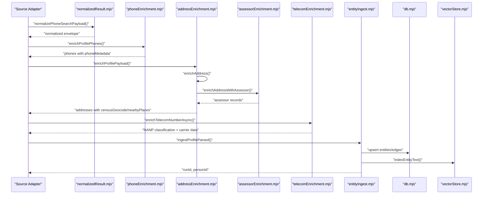
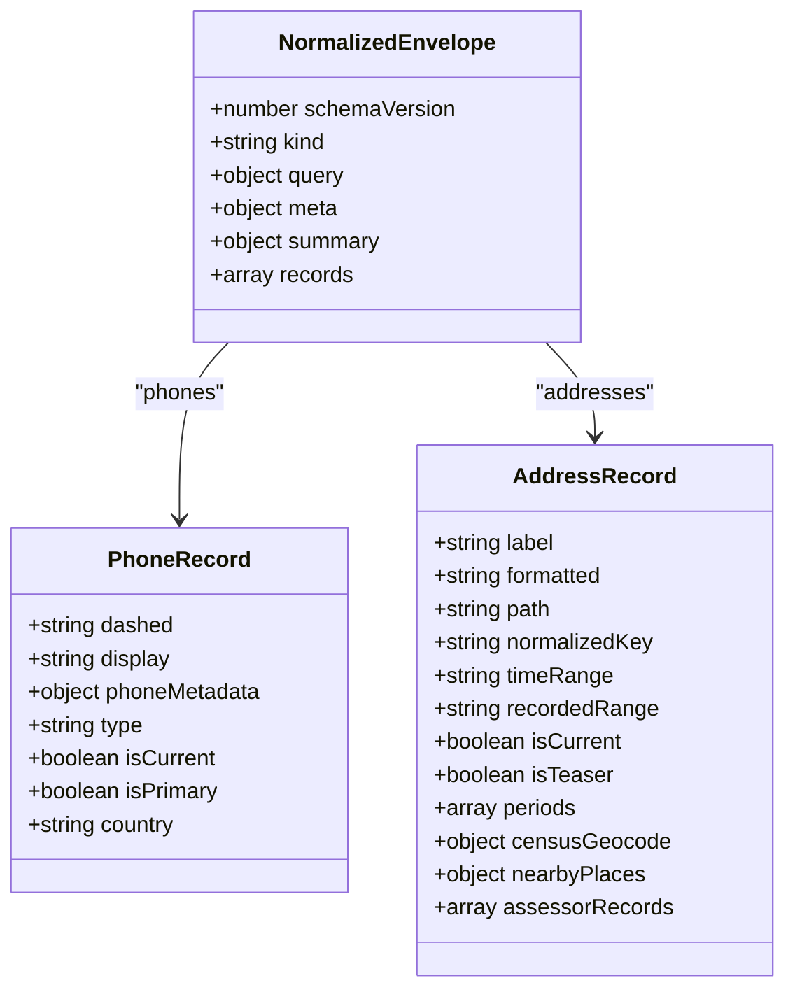
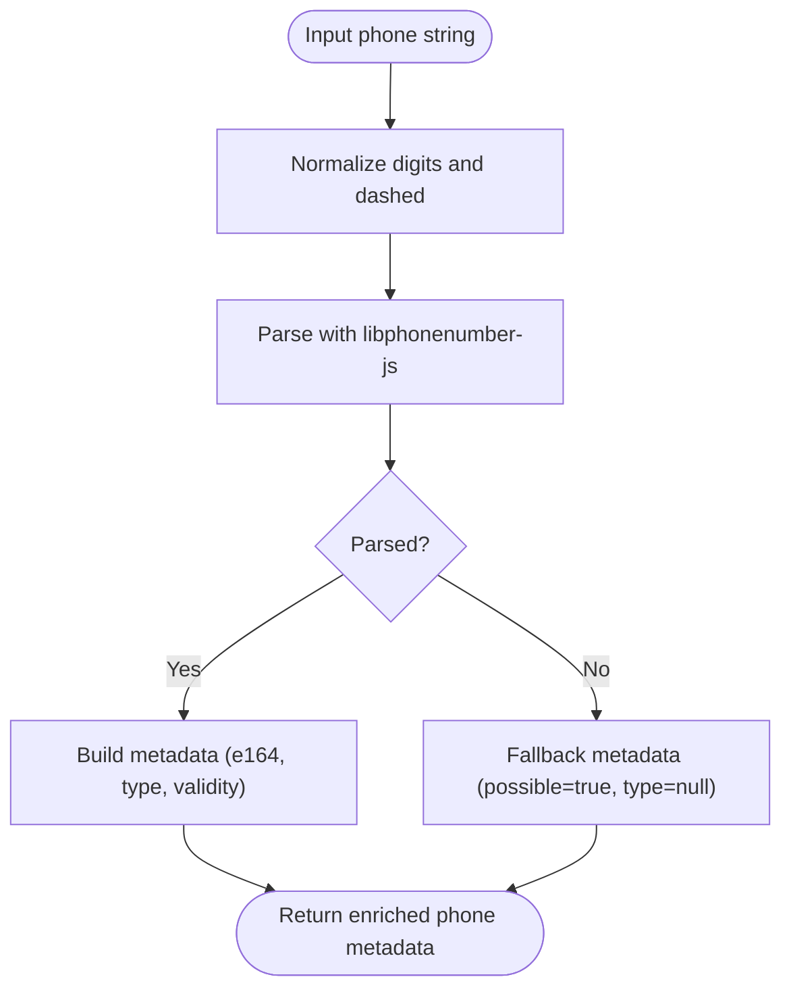
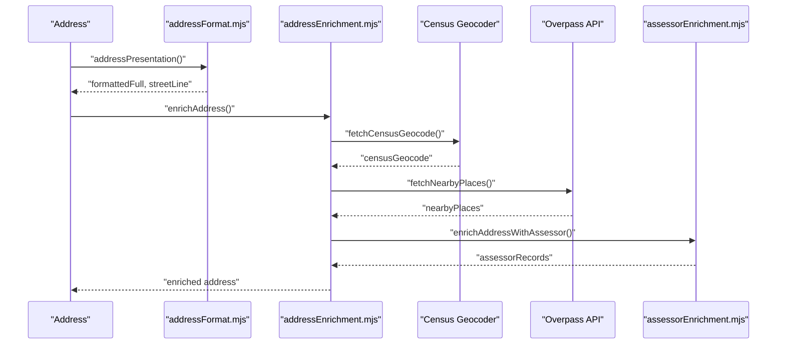
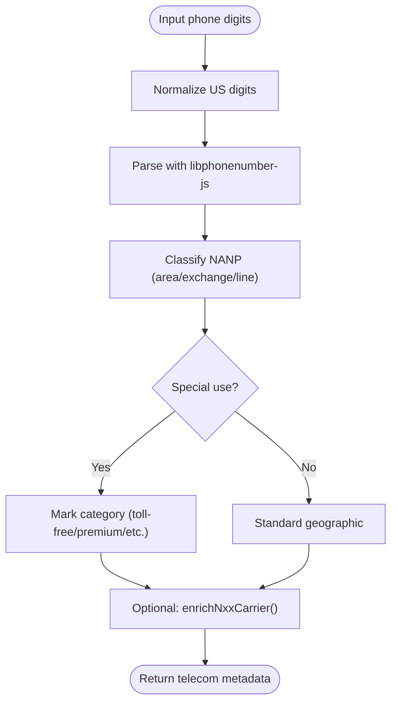
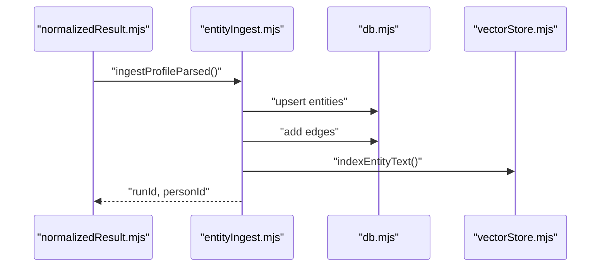
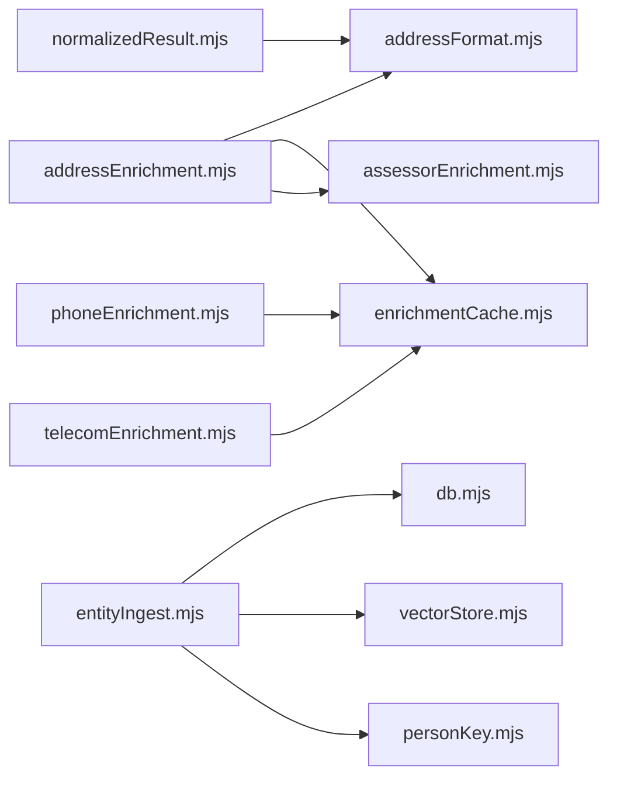

# Profile Enrichment

<cite>
**Referenced Files in This Document**
- [normalizedResult.mjs](file://src/normalizedResult.mjs)
- [addressEnrichment.mjs](file://src/addressEnrichment.mjs)
- [addressFormat.mjs](file://src/addressFormat.mjs)
- [assessorEnrichment.mjs](file://src/assessorEnrichment.mjs)
- [phoneEnrichment.mjs](file://src/phoneEnrichment.mjs)
- [telecomEnrichment.mjs](file://src/telecomEnrichment.mjs)
- [enrichmentCache.mjs](file://src/enrichmentCache.mjs)
- [entityIngest.mjs](file://src/entityIngest.mjs)
- [personKey.mjs](file://src/personKey.mjs)
- [vectorStore.mjs](file://src/vectorStore.mjs)
- [db.mjs](file://src/db/db.mjs)
- [enrichment.test.mjs](file://test/enrichment.test.mjs)
- [normalized-result.test.mjs](file://test/normalized-result.test.mjs)
</cite>

## Table of Contents
1. [Introduction](#introduction)
2. [Project Structure](#project-structure)
3. [Core Components](#core-components)
4. [Architecture Overview](#architecture-overview)
5. [Detailed Component Analysis](#detailed-component-analysis)
6. [Dependency Analysis](#dependency-analysis)
7. [Performance Considerations](#performance-considerations)
8. [Troubleshooting Guide](#troubleshooting-guide)
9. [Conclusion](#conclusion)
10. [Appendices](#appendices)

## Introduction
This document describes the person profile enrichment system that transforms raw source data into a normalized, enriched graph-ready representation. The pipeline performs multi-layered enrichment across phone metadata, address validation and geocoding, and telecom numbering analysis for NANP classification. It standardizes outputs into a unified normalized result contract, integrates with a persistent graph store, and provides robust caching, deduplication, and quality assurance mechanisms.

## Project Structure
The enrichment system is organized around focused modules:
- Normalization: Converts diverse source payloads into a shared envelope.
- Phone enrichment: Parses and enriches phone numbers using libphonenumber-js.
- Address enrichment: Geocodes addresses via the US Census Geocoder, augments with nearby place discovery, and enriches with property records.
- Telecom enrichment: Classifies NANP numbers and enriches with carrier/rate-center data.
- Persistence and indexing: Stores normalized results and entities, maintains caches, and indexes text for search.
- Tests: Validate normalization contracts and enrichment behaviors.

**Diagram sources**
- [normalizedResult.mjs:167-244](file://src/normalizedResult.mjs#L167-L244)
- [phoneEnrichment.mjs:29-96](file://src/phoneEnrichment.mjs#L29-L96)
- [telecomEnrichment.mjs:146-179](file://src/telecomEnrichment.mjs#L146-L179)
- [addressEnrichment.mjs:349-386](file://src/addressEnrichment.mjs#L349-L386)
- [addressFormat.mjs:123-154](file://src/addressFormat.mjs#L123-L154)
- [assessorEnrichment.mjs:769-835](file://src/assessorEnrichment.mjs#L769-L835)
- [enrichmentCache.mjs:99-116](file://src/enrichmentCache.mjs#L99-L116)
- [db.mjs:21-120](file://src/db/db.mjs#L21-L120)
- [vectorStore.mjs:91-133](file://src/vectorStore.mjs#L91-L133)
- [entityIngest.mjs:560-664](file://src/entityIngest.mjs#L560-L664)
- [personKey.mjs:66-121](file://src/personKey.mjs#L66-L121)

**Section sources**
- [normalizedResult.mjs:167-244](file://src/normalizedResult.mjs#L167-L244)
- [addressEnrichment.mjs:349-386](file://src/addressEnrichment.mjs#L349-L386)
- [phoneEnrichment.mjs:29-96](file://src/phoneEnrichment.mjs#L29-L96)
- [telecomEnrichment.mjs:146-179](file://src/telecomEnrichment.mjs#L146-L179)
- [enrichmentCache.mjs:99-116](file://src/enrichmentCache.mjs#L99-L116)
- [db.mjs:21-120](file://src/db/db.mjs#L21-L120)
- [vectorStore.mjs:91-133](file://src/vectorStore.mjs#L91-L133)
- [entityIngest.mjs:560-664](file://src/entityIngest.mjs#L560-L664)
- [personKey.mjs:66-121](file://src/personKey.mjs#L66-L121)

## Core Components
- Normalized result envelope: Provides a schema-versioned, compact, and standardized shape for all enriched records.
- Phone metadata extraction: Parses and validates US phone numbers, producing E164, national, and type metadata.
- Address enrichment: Geocodes US addresses, discovers nearby places, and enriches with property records.
- Telecom numbering analysis: Classifies NANP numbers and enriches with carrier/rate-center data.
- Persistence and indexing: Caches enrichment results, persists entities and edges, and indexes text for search.
- Quality assurance: Tests validate normalization contracts and enrichment behaviors.

**Section sources**
- [normalizedResult.mjs:167-244](file://src/normalizedResult.mjs#L167-L244)
- [phoneEnrichment.mjs:29-96](file://src/phoneEnrichment.mjs#L29-L96)
- [addressEnrichment.mjs:349-386](file://src/addressEnrichment.mjs#L349-L386)
- [telecomEnrichment.mjs:146-179](file://src/telecomEnrichment.mjs#L146-L179)
- [enrichmentCache.mjs:99-116](file://src/enrichmentCache.mjs#L99-L116)
- [entityIngest.mjs:560-664](file://src/entityIngest.mjs#L560-L664)
- [enrichment.test.mjs:1-323](file://test/enrichment.test.mjs#L1-L323)
- [normalized-result.test.mjs:1-184](file://test/normalized-result.test.mjs#L1-L184)

## Architecture Overview
The enrichment pipeline follows a layered approach:
- Input normalization produces a shared envelope with kind, query, meta, summary, and records.
- Phone enrichment adds phoneMetadata to phone records.
- Address enrichment enriches each address with census geocoding, nearby places, and assessor records.
- Telecom enrichment classifies NANP numbers and enriches with carrier/rate-center data.
- Entity ingestion persists normalized records as entities and edges, and indexes text for search.

**Diagram sources**
- [normalizedResult.mjs:167-244](file://src/normalizedResult.mjs#L167-L244)
- [phoneEnrichment.mjs:114-125](file://src/phoneEnrichment.mjs#L114-L125)
- [addressEnrichment.mjs:376-385](file://src/addressEnrichment.mjs#L376-L385)
- [assessorEnrichment.mjs:769-835](file://src/assessorEnrichment.mjs#L769-L835)
- [telecomEnrichment.mjs:166-179](file://src/telecomEnrichment.mjs#L166-L179)
- [entityIngest.mjs:560-664](file://src/entityIngest.mjs#L560-L664)
- [db.mjs:21-120](file://src/db/db.mjs#L21-L120)
- [vectorStore.mjs:91-133](file://src/vectorStore.mjs#L91-L133)

## Detailed Component Analysis

### Normalized Result Contracts
The system defines a schema-versioned envelope that standardizes outputs across sources. It includes:
- Envelope fields: schemaVersion, kind, query, meta, summary, records.
- Record types: phone_listing, person_candidate, person_profile.
- Phone and address normalization helpers produce compact, typed objects.
- Graph rebuild conversion utilities transform normalized payloads into ingest/run items.

**Diagram sources**
- [normalizedResult.mjs:150-160](file://src/normalizedResult.mjs#L150-L160)
- [normalizedResult.mjs:92-109](file://src/normalizedResult.mjs#L92-L109)
- [normalizedResult.mjs:115-144](file://src/normalizedResult.mjs#L115-L144)

**Section sources**
- [normalizedResult.mjs:150-160](file://src/normalizedResult.mjs#L150-L160)
- [normalizedResult.mjs:92-109](file://src/normalizedResult.mjs#L92-L109)
- [normalizedResult.mjs:115-144](file://src/normalizedResult.mjs#L115-L144)
- [normalizedResult.mjs:167-244](file://src/normalizedResult.mjs#L167-L244)
- [normalizedResult.mjs:250-331](file://src/normalizedResult.mjs#L250-L331)
- [normalizedResult.mjs:337-381](file://src/normalizedResult.mjs#L337-L381)
- [normalizedResult.mjs:388-505](file://src/normalizedResult.mjs#L388-L505)

### Phone Metadata Extraction via libphonenumber-js
Phone enrichment parses US phone numbers and produces metadata:
- Normalization: Extracts 10-digit digits and dashed format.
- Parsing: Uses libphonenumber-js to derive E164, international, national, type, validity, and more.
- Search result enrichment: Attaches lookup metadata to parsed results.

**Diagram sources**
- [phoneEnrichment.mjs:7-23](file://src/phoneEnrichment.mjs#L7-L23)
- [phoneEnrichment.mjs:29-96](file://src/phoneEnrichment.mjs#L29-L96)

**Section sources**
- [phoneEnrichment.mjs:7-23](file://src/phoneEnrichment.mjs#L7-L23)
- [phoneEnrichment.mjs:29-96](file://src/phoneEnrichment.mjs#L29-L96)
- [enrichment.test.mjs:7-25](file://test/enrichment.test.mjs#L7-L25)

### Address Validation and Geocoding
Address enrichment performs:
- Address presentation: Formats labels and creates normalized keys.
- Census geocoding: Queries the US Census Geocoder for US-like addresses.
- Nearby places: Queries Overpass API for nearby points-of-interest within a radius.
- Assessor enrichment: Matches configured assessor sources and extracts property records.

**Diagram sources**
- [addressFormat.mjs:123-154](file://src/addressFormat.mjs#L123-L154)
- [addressEnrichment.mjs:349-386](file://src/addressEnrichment.mjs#L349-L386)
- [addressEnrichment.mjs:308-343](file://src/addressEnrichment.mjs#L308-L343)
- [addressEnrichment.mjs:255-293](file://src/addressEnrichment.mjs#L255-L293)
- [assessorEnrichment.mjs:769-835](file://src/assessorEnrichment.mjs#L769-L835)

**Section sources**
- [addressFormat.mjs:123-154](file://src/addressFormat.mjs#L123-L154)
- [addressEnrichment.mjs:349-386](file://src/addressEnrichment.mjs#L349-L386)
- [addressEnrichment.mjs:308-343](file://src/addressEnrichment.mjs#L308-L343)
- [addressEnrichment.mjs:255-293](file://src/addressEnrichment.mjs#L255-L293)
- [assessorEnrichment.mjs:769-835](file://src/assessorEnrichment.mjs#L769-L835)
- [enrichment.test.mjs:27-59](file://test/enrichment.test.mjs#L27-L59)
- [enrichment.test.mjs:61-76](file://test/enrichment.test.mjs#L61-L76)

### Telecom Numbering Analysis for NANP Classification
Telecom enrichment:
- Normalizes digits and enriches with libphonenumber metadata.
- Classifies NANP numbers into categories (e.g., toll-free, premium, geographic).
- Optionally enriches with carrier/rate-center data via LocalCallingGuide.

**Diagram sources**
- [telecomEnrichment.mjs:146-179](file://src/telecomEnrichment.mjs#L146-L179)
- [telecomEnrichment.mjs:118-138](file://src/telecomEnrichment.mjs#L118-L138)
- [telecomEnrichment.mjs:79-86](file://src/telecomEnrichment.mjs#L79-L86)

**Section sources**
- [telecomEnrichment.mjs:146-179](file://src/telecomEnrichment.mjs#L146-L179)
- [telecomEnrichment.mjs:118-138](file://src/telecomEnrichment.mjs#L118-L138)
- [telecomEnrichment.mjs:79-86](file://src/telecomEnrichment.mjs#L79-L86)

### Entity Ingestion and Graph Persistence
Entity ingestion:
- Upserts entities (person, phone_number, address, email) and creates edges.
- Merges person records by name/path keys and deduplicates aliases.
- Indexes entity text for search and links entities to the graph.

**Diagram sources**
- [normalizedResult.mjs:337-381](file://src/normalizedResult.mjs#L337-L381)
- [entityIngest.mjs:560-664](file://src/entityIngest.mjs#L560-L664)
- [db.mjs:21-120](file://src/db/db.mjs#L21-L120)
- [vectorStore.mjs:91-133](file://src/vectorStore.mjs#L91-L133)

**Section sources**
- [entityIngest.mjs:560-664](file://src/entityIngest.mjs#L560-L664)
- [personKey.mjs:66-121](file://src/personKey.mjs#L66-L121)
- [vectorStore.mjs:91-133](file://src/vectorStore.mjs#L91-L133)
- [db.mjs:21-120](file://src/db/db.mjs#L21-L120)

## Dependency Analysis
- Normalization depends on address formatting for label and key normalization.
- Address enrichment depends on formatting, caching, and assessor enrichment.
- Telecom enrichment depends on phone enrichment and caching.
- Entity ingestion depends on persistence and vector indexing.
- Tests validate normalization contracts and enrichment behaviors.

**Diagram sources**
- [normalizedResult.mjs:167-244](file://src/normalizedResult.mjs#L167-L244)
- [addressEnrichment.mjs:349-386](file://src/addressEnrichment.mjs#L349-L386)
- [addressFormat.mjs:123-154](file://src/addressFormat.mjs#L123-L154)
- [assessorEnrichment.mjs:769-835](file://src/assessorEnrichment.mjs#L769-L835)
- [enrichmentCache.mjs:99-116](file://src/enrichmentCache.mjs#L99-L116)
- [phoneEnrichment.mjs:29-96](file://src/phoneEnrichment.mjs#L29-L96)
- [telecomEnrichment.mjs:146-179](file://src/telecomEnrichment.mjs#L146-L179)
- [entityIngest.mjs:560-664](file://src/entityIngest.mjs#L560-L664)
- [db.mjs:21-120](file://src/db/db.mjs#L21-L120)
- [vectorStore.mjs:91-133](file://src/vectorStore.mjs#L91-L133)
- [personKey.mjs:66-121](file://src/personKey.mjs#L66-L121)

**Section sources**
- [normalizedResult.mjs:167-244](file://src/normalizedResult.mjs#L167-L244)
- [addressEnrichment.mjs:349-386](file://src/addressEnrichment.mjs#L349-L386)
- [phoneEnrichment.mjs:29-96](file://src/phoneEnrichment.mjs#L29-L96)
- [telecomEnrichment.mjs:146-179](file://src/telecomEnrichment.mjs#L146-L179)
- [entityIngest.mjs:560-664](file://src/entityIngest.mjs#L560-L664)
- [db.mjs:21-120](file://src/db/db.mjs#L21-L120)
- [vectorStore.mjs:91-133](file://src/vectorStore.mjs#L91-L133)
- [personKey.mjs:66-121](file://src/personKey.mjs#L66-L121)

## Performance Considerations
- Caching: Enrichment cache stores results keyed by namespace and hashed key, with TTL and eviction policies.
- Rate limiting: Overpass requests are queued with a minimum interval to avoid throttling.
- Asynchronous enrichment: Telecom carrier data is fetched asynchronously to avoid blocking.
- Database schema: WAL mode and indices optimize reads/writes for entities, edges, and caches.
- Vector indexing: Optional embedding engine for text search; disabled by default.

[No sources needed since this section provides general guidance]

## Troubleshooting Guide
Common issues and resolutions:
- Census geocoder failures: Returns null coordinates and attaches error details; retry with corrected addresses.
- Overpass throttling: Enforced minimum intervals; adjust OVERPASS_MIN_INTERVAL_MS if needed.
- Assessor matching: Address confidence checks reject mismatches; ensure street/city align with candidate records.
- Cache misses: Verify cache TTL and key hashing; ensure namespaces are consistent.
- Entity merges: Person records merge by name/path keys; confirm dedupe keys and alias normalization.

**Section sources**
- [addressEnrichment.mjs:308-343](file://src/addressEnrichment.mjs#L308-L343)
- [addressEnrichment.mjs:255-293](file://src/addressEnrichment.mjs#L255-L293)
- [assessorEnrichment.mjs:678-684](file://src/assessorEnrichment.mjs#L678-L684)
- [enrichmentCache.mjs:99-116](file://src/enrichmentCache.mjs#L99-L116)
- [entityIngest.mjs:310-352](file://src/entityIngest.mjs#L310-L352)

## Conclusion
The profile enrichment system provides a robust, normalized, and extensible pipeline for transforming raw source data into enriched, graph-ready entities. By standardizing outputs, validating and enriching addresses and phones, and classifying telecom numbers, it ensures consistent data across sources while maintaining quality and performance through caching, deduplication, and indexing.

[No sources needed since this section summarizes without analyzing specific files]

## Appendices

### Practical Examples and Workflows
- Phone search normalization: Builds a normalized envelope with phoneMetadata and teaser addresses.
- Name search normalization: Produces candidate records with current and prior addresses.
- Profile lookup normalization: Preserves rich profile details and source fields.
- Address enrichment workflow: Formats address, geocodes, discovers nearby places, and enriches with assessor records.
- Telecom enrichment workflow: Classifies NANP numbers and optionally enriches with carrier data.

**Section sources**
- [normalized-result.test.mjs:10-46](file://test/normalized-result.test.mjs#L10-L46)
- [normalized-result.test.mjs:48-87](file://test/normalized-result.test.mjs#L48-L87)
- [normalized-result.test.mjs:89-138](file://test/normalized-result.test.mjs#L89-L138)
- [enrichment.test.mjs:78-133](file://test/enrichment.test.mjs#L78-L133)
- [enrichment.test.mjs:135-236](file://test/enrichment.test.mjs#L135-L236)

### Quality Assurance Measures
- Unit tests validate normalization contracts and enrichment behaviors.
- Test coverage includes phone digit normalization, libphonenumber metadata, census match extraction, nearby place summarization, and assessor enrichment for both generic and Vision platforms.

**Section sources**
- [enrichment.test.mjs:1-323](file://test/enrichment.test.mjs#L1-L323)
- [normalized-result.test.mjs:1-184](file://test/normalized-result.test.mjs#L1-L184)