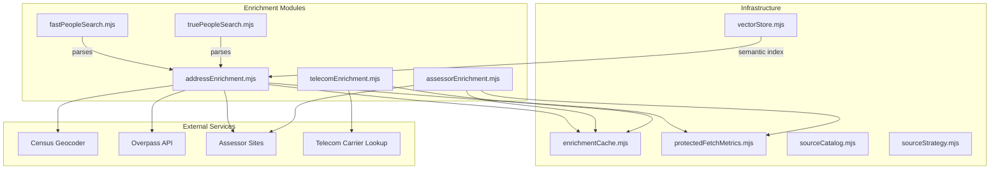
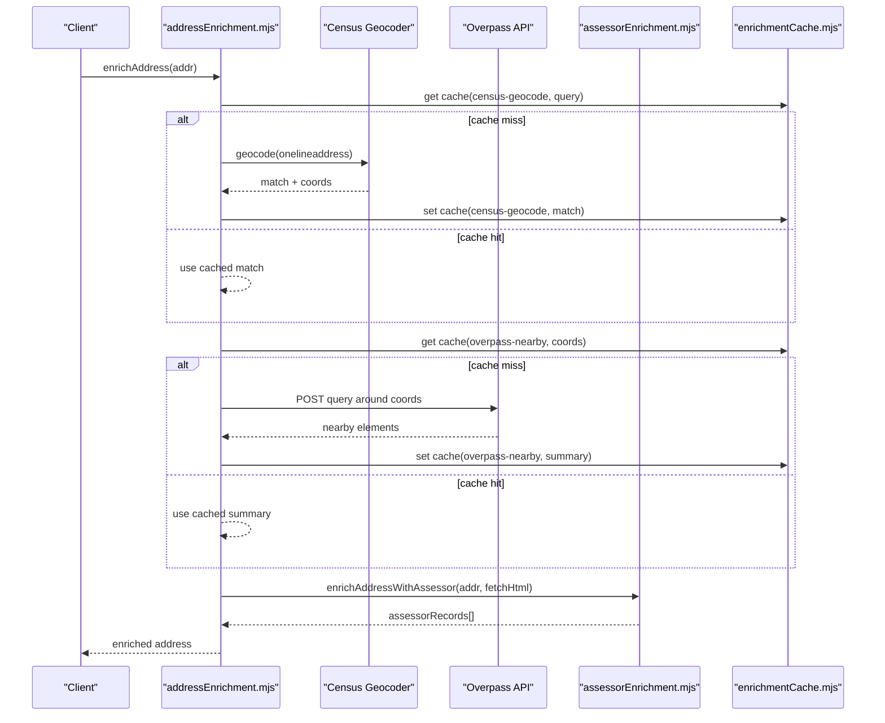
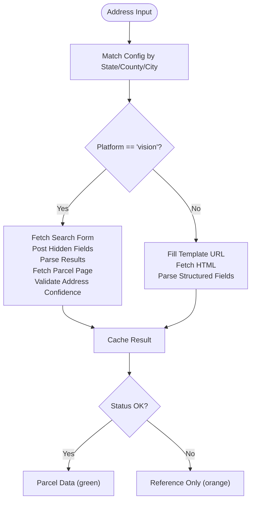
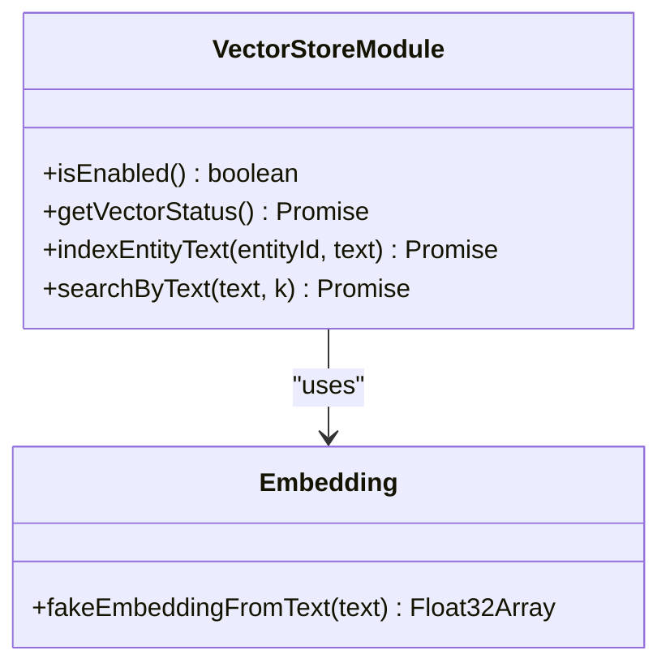
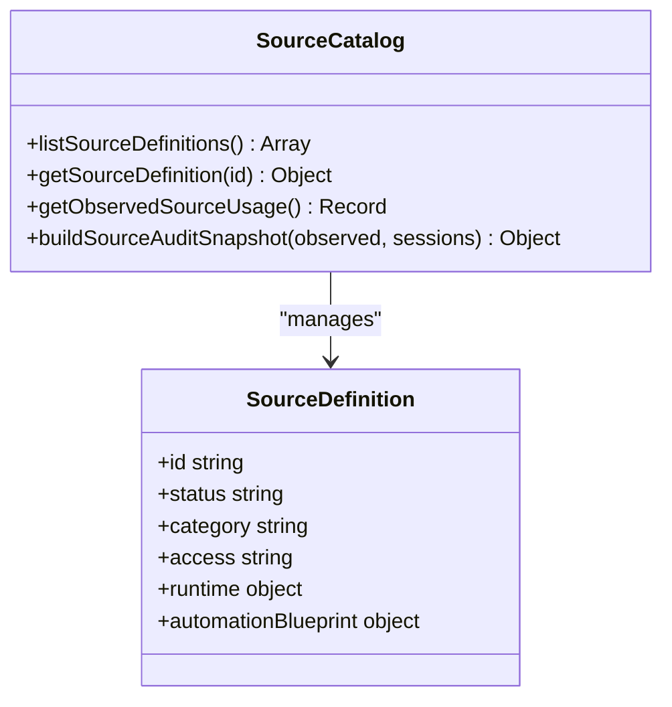
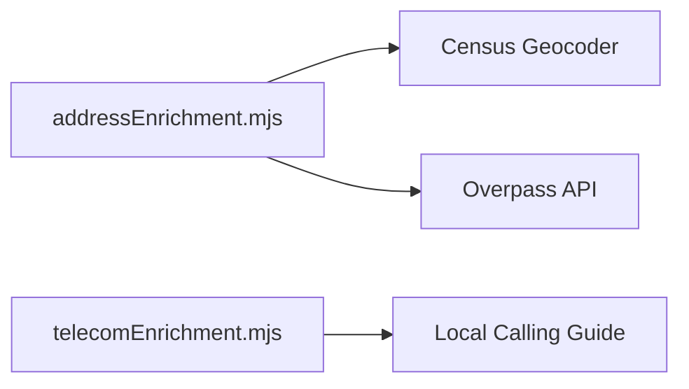
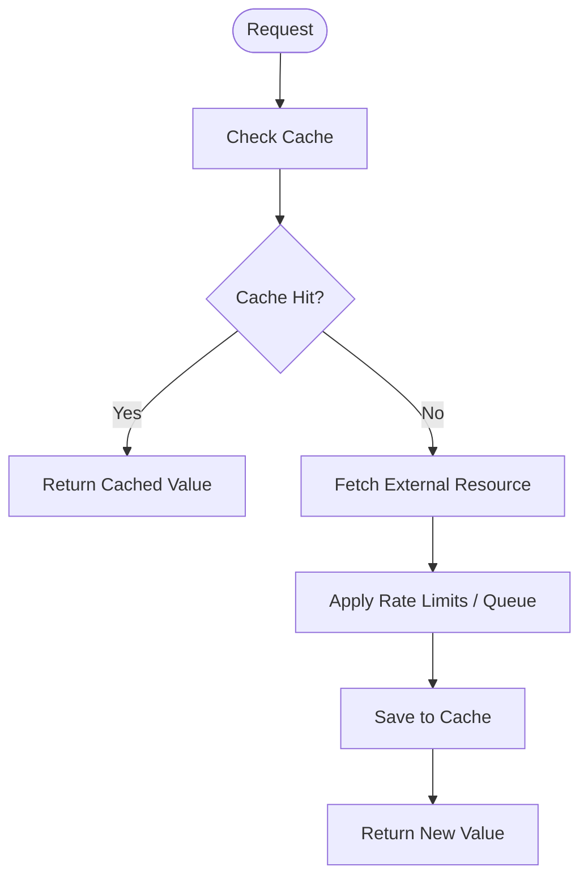
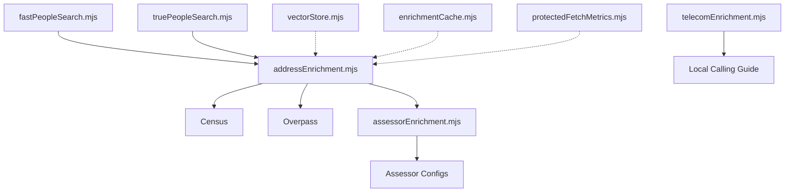
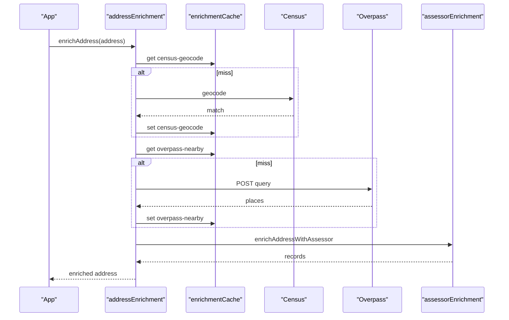
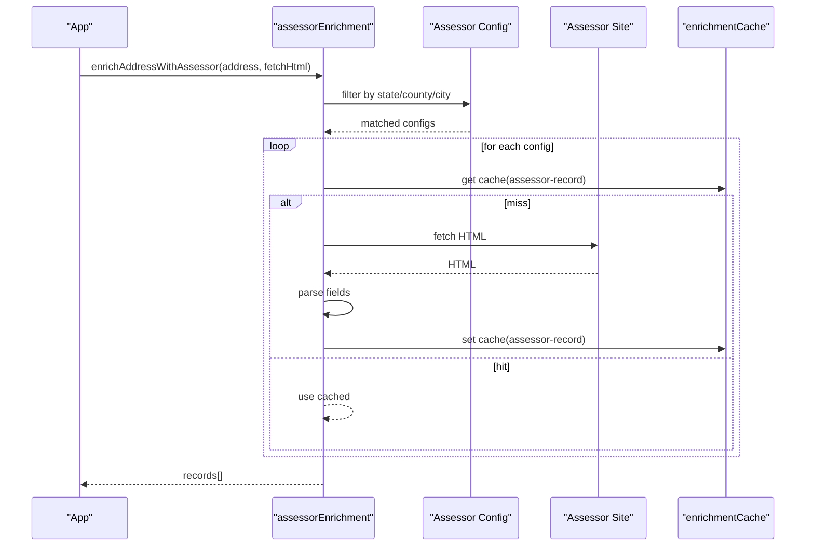

# Ecosystem Overview

<cite>
**Referenced Files in This Document**
- [osint-enrichment-roadmap.md](file://docs/osint-enrichment-roadmap.md)
- [maine-assessor-integration.md](file://docs/maine-assessor-integration.md)
- [assessor-sources.example.json](file://docs/assessor-sources.example.json)
- [assessor-sources.maine.vision.json](file://docs/assessor-sources.maine.vision.json)
- [vectorStore.mjs](file://src/vectorStore.mjs)
- [sourceCatalog.mjs](file://src/sourceCatalog.mjs)
- [sourceStrategy.mjs](file://src/sourceStrategy.mjs)
- [addressEnrichment.mjs](file://src/addressEnrichment.mjs)
- [assessorEnrichment.mjs](file://src/assessorEnrichment.mjs)
- [enrichmentCache.mjs](file://src/enrichmentCache.mjs)
- [protectedFetchMetrics.mjs](file://src/protectedFetchMetrics.mjs)
- [telecomEnrichment.mjs](file://src/telecomEnrichment.mjs)
- [fastPeopleSearch.mjs](file://src/fastPeopleSearch.mjs)
- [truePeopleSearch.mjs](file://src/truePeopleSearch.mjs)
</cite>

## Table of Contents
1. [Introduction](#introduction)
2. [Project Structure](#project-structure)
3. [Core Components](#core-components)
4. [Architecture Overview](#architecture-overview)
5. [Detailed Component Analysis](#detailed-component-analysis)
6. [Dependency Analysis](#dependency-analysis)
7. [Performance Considerations](#performance-considerations)
8. [Troubleshooting Guide](#troubleshooting-guide)
9. [Conclusion](#conclusion)
10. [Appendices](#appendices)

## Introduction
This document presents the ecosystem overview for OSINT enhancement and integration capabilities. It explains the enrichment roadmap, data sources, and integration opportunities; documents the Maine assessor integration as a county-aware property record system; describes vector store integration for semantic search; outlines the extensible source adapter framework; and covers the public-source enrichment ecosystem including Census geocoder, Overpass API, and telecom analysis. It also addresses configurability, caching strategies, rate limiting, respectful public API usage, and extension points for custom data sources.

## Project Structure
The OSINT ecosystem is organized around modular enrichment modules, a source catalog, and shared infrastructure for caching, rate limiting, and observability. Key areas:
- Address and location enrichment with Census geocoder and Overpass API
- Property/public-records enrichment via configurable assessor drivers
- Telecom enrichment for NANP classification and carrier lookup
- Source adapters for people-finders and profile parsing
- Vector store for semantic search and similarity matching
- Centralized caching and rate-limiting helpers
- Metrics and logging for protected fetch health

**Diagram sources**
- [addressEnrichment.mjs:349-386](file://src/addressEnrichment.mjs#L349-L386)
- [assessorEnrichment.mjs:769-835](file://src/assessorEnrichment.mjs#L769-L835)
- [telecomEnrichment.mjs:1-179](file://src/telecomEnrichment.mjs#L1-L179)
- [fastPeopleSearch.mjs:1-589](file://src/fastPeopleSearch.mjs#L1-L589)
- [truePeopleSearch.mjs:1-546](file://src/truePeopleSearch.mjs#L1-L546)
- [enrichmentCache.mjs:1-117](file://src/enrichmentCache.mjs#L1-L117)
- [protectedFetchMetrics.mjs:1-71](file://src/protectedFetchMetrics.mjs#L1-L71)
- [vectorStore.mjs:1-134](file://src/vectorStore.mjs#L1-L134)
- [sourceCatalog.mjs:1-722](file://src/sourceCatalog.mjs#L1-L722)
- [sourceStrategy.mjs:1-208](file://src/sourceStrategy.mjs#L1-L208)

**Section sources**
- [osint-enrichment-roadmap.md:1-202](file://docs/osint-enrichment-roadmap.md#L1-L202)
- [sourceCatalog.mjs:1-722](file://src/sourceCatalog.mjs#L1-L722)

## Core Components
- Address enrichment pipeline: normalizes addresses, geocodes with Census, finds nearby places with Overpass, and enriches with assessor records.
- Assessor enrichment: integrates configurable assessor sources and a Vision platform driver for Maine municipalities.
- Telecom enrichment: NANP classification and optional carrier lookup via Local Calling Guide.
- Source adapters: parsers for people-finders and profile pages with blocking detection and trust scoring.
- Vector store: optional semantic indexing and similarity search.
- Infrastructure: centralized caching, rate limiting, and protected fetch metrics.

**Section sources**
- [addressEnrichment.mjs:349-386](file://src/addressEnrichment.mjs#L349-L386)
- [assessorEnrichment.mjs:769-835](file://src/assessorEnrichment.mjs#L769-L835)
- [telecomEnrichment.mjs:1-179](file://src/telecomEnrichment.mjs#L1-L179)
- [fastPeopleSearch.mjs:368-430](file://src/fastPeopleSearch.mjs#L368-L430)
- [truePeopleSearch.mjs:341-400](file://src/truePeopleSearch.mjs#L341-L400)
- [vectorStore.mjs:1-134](file://src/vectorStore.mjs#L1-L134)
- [enrichmentCache.mjs:1-117](file://src/enrichmentCache.mjs#L1-L117)
- [protectedFetchMetrics.mjs:1-71](file://src/protectedFetchMetrics.mjs#L1-L71)

## Architecture Overview
The ecosystem is a layered pipeline:
- Input: normalized addresses and phone numbers
- Enrichment: geocoding, nearby places, assessor records, telecom metadata
- Parsing: people-finder result/profile parsing with blocking detection
- Storage: enrichment cache, vector store, and entity graph
- Observability: protected fetch metrics and logging

**Diagram sources**
- [addressEnrichment.mjs:308-370](file://src/addressEnrichment.mjs#L308-L370)
- [assessorEnrichment.mjs:769-835](file://src/assessorEnrichment.mjs#L769-L835)
- [enrichmentCache.mjs:48-89](file://src/enrichmentCache.mjs#L48-L89)

## Detailed Component Analysis

### OSINT Enrichment Roadmap
The roadmap outlines high-impact improvements:
- Server-side authoritative ingestion and deterministic graph derivation
- Real semantics for the ingest flag
- Auto-follow person profiles and address-page crawling
- Nearby-place context from open map data (Nominatim/Overpass)
- Employer/company enrichment via public registries
- Additional USPhoneBook entry modes (name/address)
- Field-level provenance and improved fetch observability

These priorities guide the evolution toward a robust, multi-source, and explainable OSINT workbench.

**Section sources**
- [osint-enrichment-roadmap.md:1-202](file://docs/osint-enrichment-roadmap.md#L1-L202)

### Maine Assessor Integration
The app transforms “Assessor ref” into green parcel data when a municipality supports deterministic property-search URLs. The integration supports:
- Generic config-driven fetch and HTML extraction
- Vision platform driver for Maine municipalities
- Config file workflow with placeholders and matching filters
- Logging and tracing for diagnostic feedback
- Staged rollout strategy by municipality complexity

**Diagram sources**
- [assessorEnrichment.mjs:588-685](file://src/assessorEnrichment.mjs#L588-L685)
- [assessorEnrichment.mjs:723-762](file://src/assessorEnrichment.mjs#L723-L762)
- [assessorEnrichment.mjs:769-835](file://src/assessorEnrichment.mjs#L769-L835)

**Section sources**
- [maine-assessor-integration.md:1-155](file://docs/maine-assessor-integration.md#L1-L155)
- [assessor-sources.example.json:1-12](file://docs/assessor-sources.example.json#L1-L12)
- [assessor-sources.maine.vision.json:1-290](file://docs/assessor-sources.maine.vision.json#L1-L290)
- [assessorEnrichment.mjs:1-835](file://src/assessorEnrichment.mjs#L1-L835)

### Vector Store Integration
The vector store provides semantic search and similarity matching:
- Optional engine (ruvector) with cosine distance
- Deterministic 128-d embedding generation
- Indexing of entity text with metadata
- Similarity search returning entity IDs and scores
- Controlled initialization and error handling

**Diagram sources**
- [vectorStore.mjs:27-134](file://src/vectorStore.mjs#L27-L134)

**Section sources**
- [vectorStore.mjs:1-134](file://src/vectorStore.mjs#L1-L134)

### Extensible Source Adapter Framework
The source catalog defines standardized metadata and automation blueprints for each adapter, enabling:
- Unified status, access mode, and runtime descriptors
- Automation blueprints for browser workers and navigation strategies
- Overlap groups and silo findings for cross-source governance
- Observed usage tracking and audit snapshots

**Diagram sources**
- [sourceCatalog.mjs:524-722](file://src/sourceCatalog.mjs#L524-L722)

**Section sources**
- [sourceCatalog.mjs:1-722](file://src/sourceCatalog.mjs#L1-L722)

### Public-Source Enrichment Ecosystem
- Census geocoder: direct HTTP JSON fetch with caching and explicit user-agent/contact metadata
- Overpass API: rate-limited direct POST with central queueing and caching
- Telecom analysis: NANP classification and optional Local Calling Guide carrier lookup

**Diagram sources**
- [addressEnrichment.mjs:59-78](file://src/addressEnrichment.mjs#L59-L78)
- [addressEnrichment.mjs:255-293](file://src/addressEnrichment.mjs#L255-L293)
- [telecomEnrichment.mjs:13-86](file://src/telecomEnrichment.mjs#L13-L86)

**Section sources**
- [addressEnrichment.mjs:1-386](file://src/addressEnrichment.mjs#L1-L386)
- [telecomEnrichment.mjs:1-179](file://src/telecomEnrichment.mjs#L1-L179)

### Configurable Integrations, Caching, and Rate Limiting
- Configurable assessor sources via JSON arrays with matching filters and URL templates
- Centralized caching with TTL, dedupe-in-flight, and pruning
- Rate limiting for Overpass with queued requests and minimum intervals
- Protected fetch metrics for health monitoring and trust state

**Diagram sources**
- [enrichmentCache.mjs:48-117](file://src/enrichmentCache.mjs#L48-L117)
- [addressEnrichment.mjs:255-293](file://src/addressEnrichment.mjs#L255-L293)
- [protectedFetchMetrics.mjs:35-71](file://src/protectedFetchMetrics.mjs#L35-L71)

**Section sources**
- [assessor-sources.example.json:1-12](file://docs/assessor-sources.example.json#L1-L12)
- [assessor-sources.maine.vision.json:1-290](file://docs/assessor-sources.maine.vision.json#L1-L290)
- [enrichmentCache.mjs:1-117](file://src/enrichmentCache.mjs#L1-L117)
- [addressEnrichment.mjs:1-386](file://src/addressEnrichment.mjs#L1-L386)
- [protectedFetchMetrics.mjs:1-71](file://src/protectedFetchMetrics.mjs#L1-L71)

### Contact and User-Agent Configuration
Respectful public API usage is supported by:
- Explicit user-agent and accept headers for Census and Overpass
- Optional contact email appended to user-agent
- Environment-controlled timeouts and endpoints

**Section sources**
- [addressEnrichment.mjs:17-18](file://src/addressEnrichment.mjs#L17-L18)
- [addressEnrichment.mjs:59-78](file://src/addressEnrichment.mjs#L59-L78)
- [telecomEnrichment.mjs:18-24](file://src/telecomEnrichment.mjs#L18-L24)

## Dependency Analysis
The ecosystem exhibits clear separation of concerns:
- Address enrichment depends on Census and Overpass, and optionally assessor records
- Assessor enrichment depends on configuration and either generic HTML extraction or Vision platform flows
- Telecom enrichment is independent and optional
- Source adapters depend on parsers and blocking detection
- Vector store is optional and decoupled from core enrichment
- Caching and metrics are shared utilities

**Diagram sources**
- [addressEnrichment.mjs:349-386](file://src/addressEnrichment.mjs#L349-L386)
- [assessorEnrichment.mjs:769-835](file://src/assessorEnrichment.mjs#L769-L835)
- [telecomEnrichment.mjs:1-179](file://src/telecomEnrichment.mjs#L1-L179)
- [fastPeopleSearch.mjs:368-430](file://src/fastPeopleSearch.mjs#L368-L430)
- [truePeopleSearch.mjs:341-400](file://src/truePeopleSearch.mjs#L341-L400)
- [vectorStore.mjs:1-134](file://src/vectorStore.mjs#L1-L134)
- [enrichmentCache.mjs:1-117](file://src/enrichmentCache.mjs#L1-L117)
- [protectedFetchMetrics.mjs:1-71](file://src/protectedFetchMetrics.mjs#L1-L71)

**Section sources**
- [sourceCatalog.mjs:1-722](file://src/sourceCatalog.mjs#L1-L722)

## Performance Considerations
- Prefer direct HTTP for public APIs with strict caching and rate limiting
- Use centralized queues and minimum intervals for Overpass to avoid throttling
- Cache aggressively for Census and Overpass; tune TTLs based on data volatility
- Dedupe in-flight requests to reduce redundant work
- Keep vector store optional and dimensionality small for performance
- Monitor protected fetch health to adjust retry/backoff strategies

[No sources needed since this section provides general guidance]

## Troubleshooting Guide
Common issues and diagnostics:
- Blocked pages: Detect Cloudflare or anti-bot challenges; maintain trust-state metrics
- No-match results: Validate address confidence and template filling
- Timeout and rate-limit errors: Increase timeouts or reduce request frequency
- Parser drift: Persist raw HTML snapshots and structured outputs for replay
- Assessor mismatches: Capture municipality specifics and decide between config or custom driver

**Section sources**
- [fastPeopleSearch.mjs:166-193](file://src/fastPeopleSearch.mjs#L166-L193)
- [truePeopleSearch.mjs:114-141](file://src/truePeopleSearch.mjs#L114-L141)
- [protectedFetchMetrics.mjs:35-71](file://src/protectedFetchMetrics.mjs#L35-L71)
- [assessorEnrichment.mjs:325-346](file://src/assessorEnrichment.mjs#L325-L346)

## Conclusion
The OSINT ecosystem balances breadth and depth: it leverages public sources for geocoding and nearby context, integrates configurable assessor systems for property records, enriches telecom metadata, and parses people-finder results. The modular architecture, centralized caching, and metrics enable scalable and respectful public API usage. The roadmap and source catalog provide a clear path to expand coverage, improve determinism, and add explainability.

[No sources needed since this section summarizes without analyzing specific files]

## Appendices

### Example Workflows

#### Address Enrichment Workflow

**Diagram sources**
- [addressEnrichment.mjs:349-386](file://src/addressEnrichment.mjs#L349-L386)
- [enrichmentCache.mjs:48-89](file://src/enrichmentCache.mjs#L48-L89)
- [assessorEnrichment.mjs:769-835](file://src/assessorEnrichment.mjs#L769-L835)

#### Assessor Enrichment Workflow

**Diagram sources**
- [assessorEnrichment.mjs:769-835](file://src/assessorEnrichment.mjs#L769-L835)
- [enrichmentCache.mjs:48-89](file://src/enrichmentCache.mjs#L48-L89)

### Extension Points
- Add new external data providers by implementing a source adapter with:
  - URL templating and fetching
  - HTML parsing and structured output
  - Blocking detection and trust scoring
  - Caching and TTL configuration
- Extend the source catalog with metadata and automation blueprint
- Integrate vector indexing for semantic similarity of newly enriched fields

**Section sources**
- [sourceCatalog.mjs:1-722](file://src/sourceCatalog.mjs#L1-L722)
- [vectorStore.mjs:1-134](file://src/vectorStore.mjs#L1-L134)