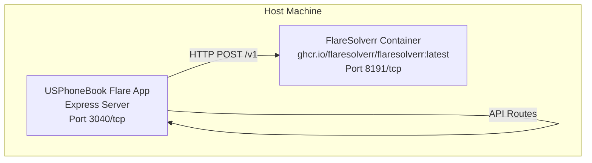
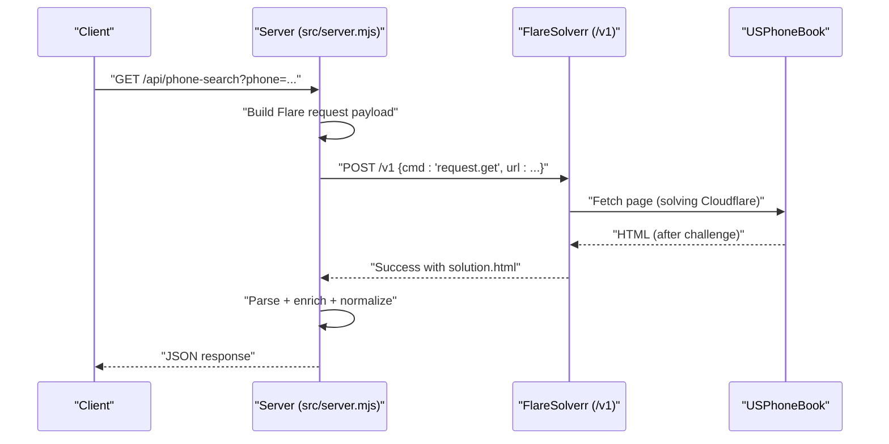
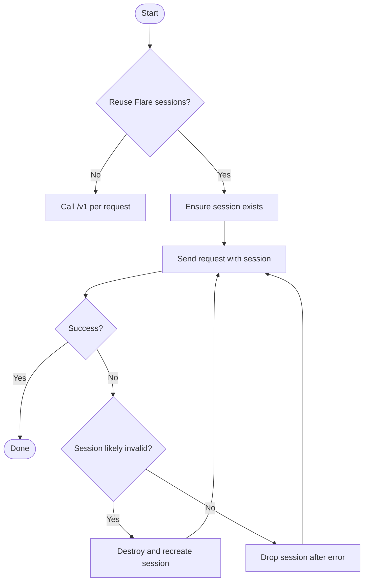
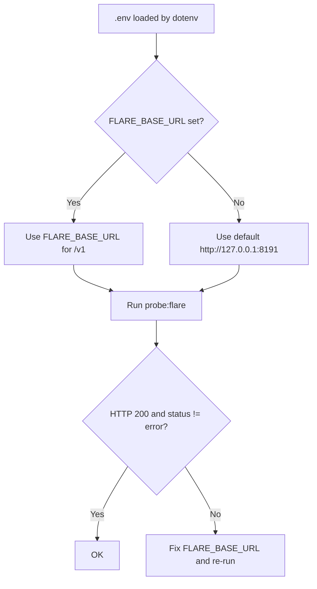
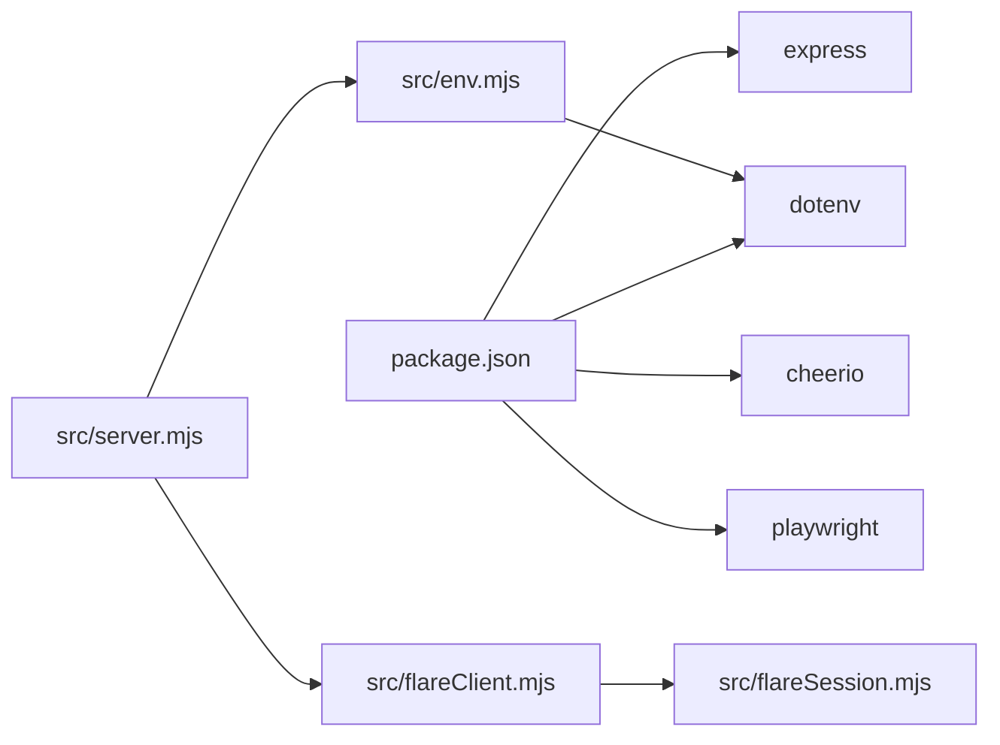

# Getting Started

<cite>
**Referenced Files in This Document**
- [README.md](file://README.md)
- [env.example](file://env.example)
- [package.json](file://package.json)
- [docker-compose.yml](file://docker-compose.yml)
- [src/env.mjs](file://src/env.mjs)
- [src/flareClient.mjs](file://src/flareClient.mjs)
- [src/flareSession.mjs](file://src/flareSession.mjs)
- [src/server.mjs](file://src/server.mjs)
- [scripts/probe-flare.mjs](file://scripts/probe-flare.mjs)
- [scripts/parse-selftest.mjs](file://scripts/parse-selftest.mjs)
</cite>

## Table of Contents
1. [Introduction](#introduction)
2. [Project Structure](#project-structure)
3. [Core Components](#core-components)
4. [Architecture Overview](#architecture-overview)
5. [Detailed Component Analysis](#detailed-component-analysis)
6. [Dependency Analysis](#dependency-analysis)
7. [Performance Considerations](#performance-considerations)
8. [Troubleshooting Guide](#troubleshooting-guide)
9. [Security and Production Best Practices](#security-and-production-best-practices)
10. [Verification and Diagnostics](#verification-and-diagnostics)
11. [Conclusion](#conclusion)

## Introduction
This guide helps you deploy and operate the USPhoneBook Flare App quickly. The app proxies protected pages through a remote FlareSolverr instance to bypass Cloudflare, then parses results and exposes a simple API for phone and name searches, plus health and diagnostics endpoints. It also includes optional Playwright-based engines and extensive configuration for timeouts, caching, proxies, and enrichment.

## Project Structure
At a high level, the app consists of:
- A Node/Express server that serves the UI and API
- A FlareSolverr client and session manager
- Environment loading and configuration
- Scripts for probing Flare connectivity and running parser tests
- Docker Compose to run FlareSolverr standalone

**Diagram sources**
- [docker-compose.yml:1-7](file://docker-compose.yml#L1-L7)
- [src/flareClient.mjs:1-35](file://src/flareClient.mjs#L1-L35)
- [src/server.mjs:98-104](file://src/server.mjs#L98-L104)

**Section sources**
- [README.md:1-252](file://README.md#L1-L252)
- [docker-compose.yml:1-7](file://docker-compose.yml#L1-L7)
- [src/server.mjs:98-104](file://src/server.mjs#L98-L104)

## Core Components
- FlareSolverr client: Sends requests to the FlareSolverr /v1 endpoint and validates responses.
- Session management: Optional reuse of Flare sessions to speed up subsequent requests.
- Environment loader: Loads .env variables using dotenv.
- Server: Exposes API endpoints for health checks, protected fetches, and diagnostics.
- Probe script: Validates FlareSolverr connectivity and configuration.
- Parser self-test: Runs parsing logic offline against a fixture.

**Section sources**
- [src/flareClient.mjs:1-35](file://src/flareClient.mjs#L1-L35)
- [src/flareSession.mjs:1-141](file://src/flareSession.mjs#L1-L141)
- [src/env.mjs:1-8](file://src/env.mjs#L1-L8)
- [src/server.mjs:2425-2474](file://src/server.mjs#L2425-L2474)
- [scripts/probe-flare.mjs:1-38](file://scripts/probe-flare.mjs#L1-L38)
- [scripts/parse-selftest.mjs:1-18](file://scripts/parse-selftest.mjs#L1-L18)

## Architecture Overview
The app depends on a remote FlareSolverr server. Requests flow as follows:
- The server constructs a FlareSolverr request payload and posts to /v1
- FlareSolverr solves Cloudflare challenges and returns HTML
- The app parses the HTML and returns normalized results

**Diagram sources**
- [src/flareClient.mjs:9-34](file://src/flareClient.mjs#L9-L34)
- [src/server.mjs:640-672](file://src/server.mjs#L640-L672)
- [src/server.mjs:1537-1609](file://src/server.mjs#L1537-L1609)

## Detailed Component Analysis

### FlareSolverr Connectivity and Session Management
- The app expects a remote FlareSolverr server and reads FLARE_BASE_URL from environment.
- It can reuse a single Flare session across requests to reduce overhead.
- Session creation, replacement on failure, and destruction on exit are handled.

**Diagram sources**
- [src/flareSession.mjs:25-72](file://src/flareSession.mjs#L25-L72)
- [src/flareSession.mjs:101-140](file://src/flareSession.mjs#L101-L140)
- [src/server.mjs:640-672](file://src/server.mjs#L640-L672)

**Section sources**
- [src/flareClient.mjs:9-34](file://src/flareClient.mjs#L9-L34)
- [src/flareSession.mjs:1-141](file://src/flareSession.mjs#L1-L141)
- [src/server.mjs:640-672](file://src/server.mjs#L640-L672)

### Environment Configuration and Validation
- Copy env.example to .env and set FLARE_BASE_URL to your FlareSolverr base URL (no trailing slash).
- The app loads .env via dotenv; you can override with DOTENV_PATH if needed.
- Use npm run probe:flare to validate connectivity to FlareSolverr.

**Diagram sources**
- [src/env.mjs:1-8](file://src/env.mjs#L1-L8)
- [env.example:1-106](file://env.example#L1-L106)
- [scripts/probe-flare.mjs:8-37](file://scripts/probe-flare.mjs#L8-L37)

**Section sources**
- [README.md:20-31](file://README.md#L20-L31)
- [env.example:1-106](file://env.example#L1-L106)
- [src/env.mjs:1-8](file://src/env.mjs#L1-L8)
- [scripts/probe-flare.mjs:1-38](file://scripts/probe-flare.mjs#L1-L38)

### API Usage Examples
- Health check: GET /api/health
- Phone search: GET /api/phone-search?phone=...
- Name search: GET /api/name-search?name=...&city=...&state=...
- Trust diagnostics: GET /api/trust-health

Notes:
- Responses include normalized payloads and optional enrichment metadata.
- Engine selection and timeouts can be controlled per request.

**Section sources**
- [README.md:66-104](file://README.md#L66-L104)
- [src/server.mjs:2425-2474](file://src/server.mjs#L2425-L2474)
- [src/server.mjs:1537-1609](file://src/server.mjs#L1537-L1609)
- [src/server.mjs:1633-1711](file://src/server.mjs#L1633-L1711)

## Dependency Analysis
- Node runtime and modules are declared in package.json.
- The app uses dotenv to load environment variables.
- Docker Compose defines a FlareSolverr service with port mapping.

**Diagram sources**
- [package.json:1-28](file://package.json#L1-L28)
- [src/env.mjs:1-8](file://src/env.mjs#L1-L8)
- [src/server.mjs:5-16](file://src/server.mjs#L5-L16)
- [src/flareClient.mjs:1-35](file://src/flareClient.mjs#L1-L35)
- [src/flareSession.mjs:1-2](file://src/flareSession.mjs#L1-L2)

**Section sources**
- [package.json:1-28](file://package.json#L1-L28)
- [docker-compose.yml:1-7](file://docker-compose.yml#L1-L7)

## Performance Considerations
- Session reuse: Enable FLARE_REUSE_SESSION to reuse a single Flare session across requests; consider FLARE_SESSION_TTL_MINUTES to rotate sessions periodically.
- Media disabling: Set FLARE_DISABLE_MEDIA=1 to skip heavy assets during page loads.
- Wait-after: Use FLARE_WAIT_AFTER_SECONDS=1 to allow pages to finish rendering when needed.
- Proxy: Configure FLARE_PROXY_URL for consistent outbound routing.
- Cooldown: PROTECTED_FETCH_COOLDOWN_MS reduces burstiness between protected fetches.

**Section sources**
- [README.md:132-136](file://README.md#L132-L136)
- [env.example:24-76](file://env.example#L24-L76)
- [src/server.mjs:105-126](file://src/server.mjs#L105-L126)

## Troubleshooting Guide
Common issues and remedies:
- FlareSolverr unreachable or returns error:
  - Verify FLARE_BASE_URL points to a reachable host/port.
  - Use npm run probe:flare to confirm HTTP 200 and absence of status error.
- Docker internal IP confusion:
  - If Flare is in a container, use the host LAN IP and published port, not 172.19.x.x.
- Firewall and port publishing:
  - Ensure port 8191 is published and accessible from the app host.
- Challenge failures:
  - Increase FLARE_MAX_TIMEOUT_MS.
  - Disable media and/or use a residential proxy via FLARE_PROXY_URL.
  - Consider PROTECTED_FETCH_FALLBACK_ON_FLARE_ERROR and PROTECTED_FETCH_FALLBACK_ENGINE.

**Section sources**
- [README.md:5-18](file://README.md#L5-L18)
- [README.md:105-118](file://README.md#L105-L118)
- [scripts/probe-flare.mjs:19-25](file://scripts/probe-flare.mjs#L19-L25)

## Security and Production Best Practices
- Network isolation:
  - Run FlareSolverr in a restricted container network; publish only port 8191 to trusted hosts.
- Least privilege:
  - Limit FlareSolverr permissions; avoid unnecessary capabilities.
- Proxy and headers:
  - Use FLARE_PROXY_URL for consistent exit IPs; configure EXTERNAL_SOURCE_* headers thoughtfully.
- Monitoring and logging:
  - Enable SCRAPE_LOGGING and adjust SCRAPE_PROGRESS_INTERVAL_MS for visibility.
- Rate limiting and timeouts:
  - Tune PROTECTED_FETCH_COOLDOWN_MS, FLARE_MAX_TIMEOUT_MS, and external source timeouts to balance responsiveness and reliability.

**Section sources**
- [README.md:119-131](file://README.md#L119-L131)
- [env.example:36-106](file://env.example#L36-L106)

## Verification and Diagnostics
- Connectivity:
  - npm run probe:flare
- Parser self-test (offline):
  - npm run test:parse
- Enrichment tests:
  - npm run test:enrich
- Health and trust:
  - GET /api/health
  - GET /api/trust-health

**Section sources**
- [README.md:246-252](file://README.md#L246-L252)
- [scripts/probe-flare.mjs:1-38](file://scripts/probe-flare.mjs#L1-L38)
- [scripts/parse-selftest.mjs:1-18](file://scripts/parse-selftest.mjs#L1-L18)
- [src/server.mjs:2425-2474](file://src/server.mjs#L2425-L2474)

## Conclusion
You now have the essentials to deploy the USPhoneBook Flare App:
- Install dependencies, configure .env with FLARE_BASE_URL, and start the server.
- Validate connectivity with the provided probe script.
- Use the documented API endpoints for phone and name searches.
- Apply the troubleshooting and security guidance for reliable operation.