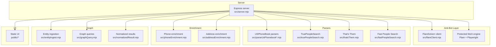
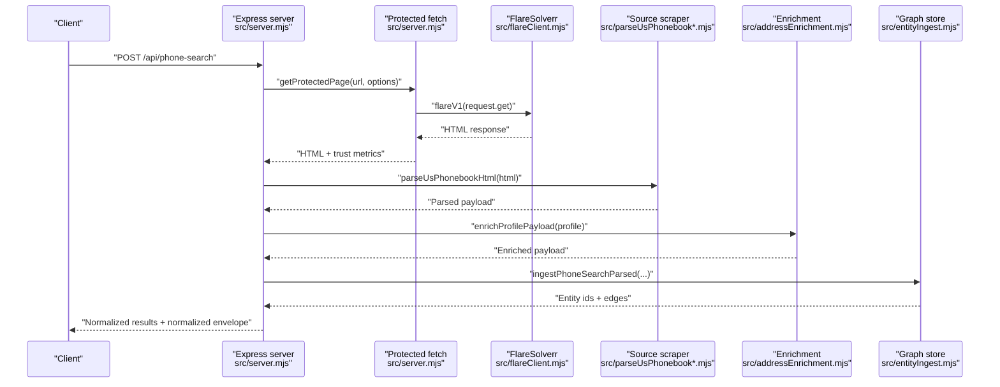
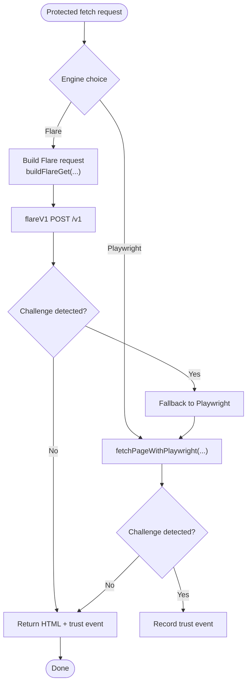
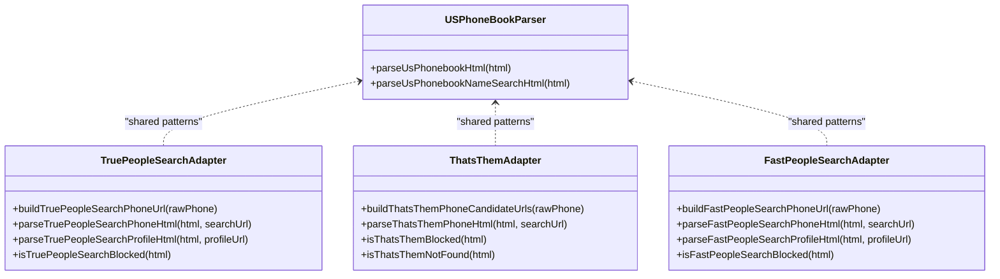
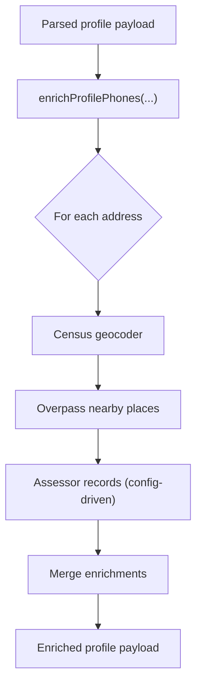
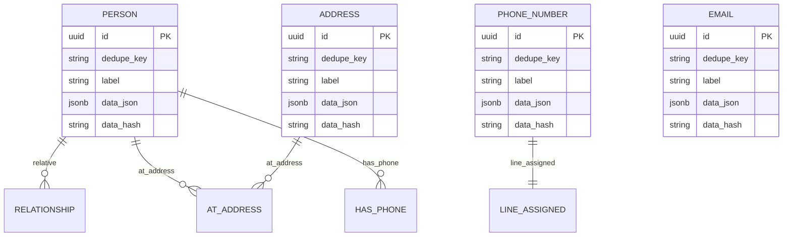
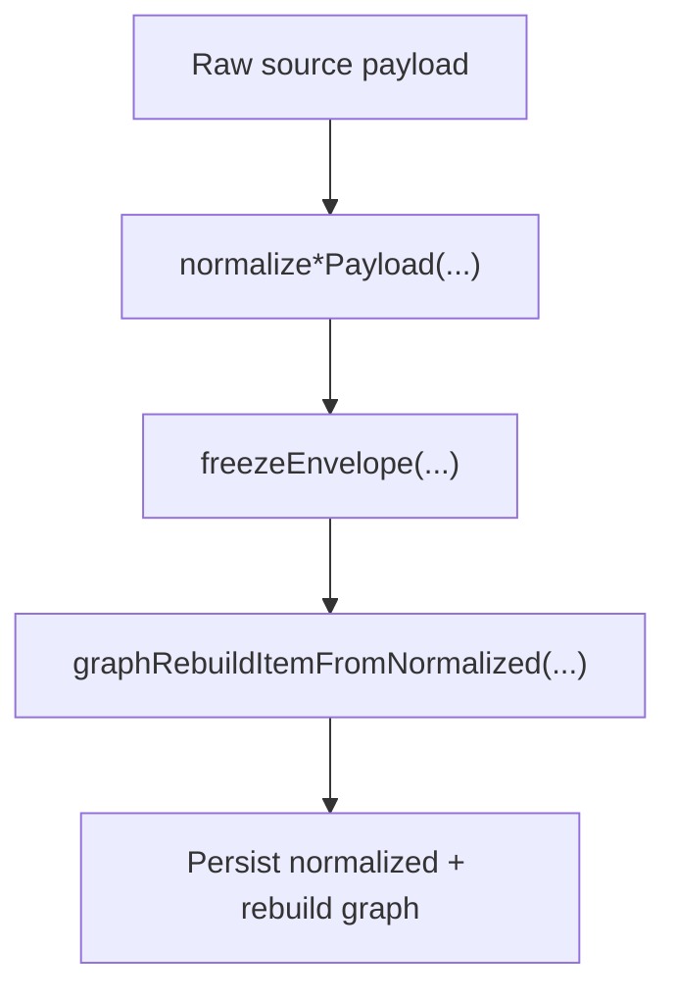
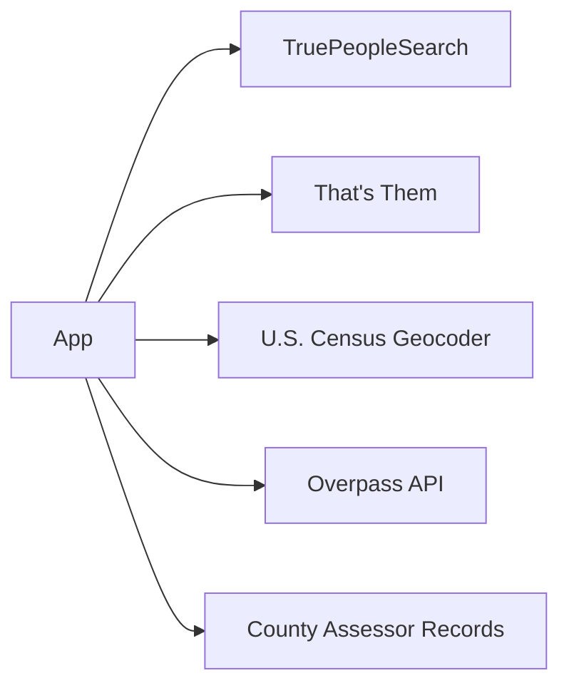
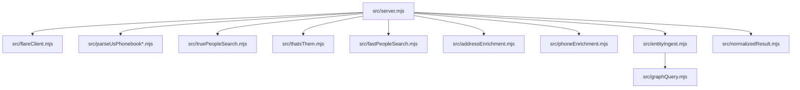

# Project Overview

<cite>
**Referenced Files in This Document**
- [README.md](file://README.md)
- [package.json](file://package.json)
- [src/server.mjs](file://src/server.mjs)
- [src/flareClient.mjs](file://src/flareClient.mjs)
- [src/sourceCatalog.mjs](file://src/sourceCatalog.mjs)
- [src/graphQuery.mjs](file://src/graphQuery.mjs)
- [src/entityIngest.mjs](file://src/entityIngest.mjs)
- [src/normalizedResult.mjs](file://src/normalizedResult.mjs)
- [src/addressEnrichment.mjs](file://src/addressEnrichment.mjs)
- [src/phoneEnrichment.mjs](file://src/phoneEnrichment.mjs)
- [src/truePeopleSearch.mjs](file://src/truePeopleSearch.mjs)
- [src/thatsThem.mjs](file://src/thatsThem.mjs)
- [src/fastPeopleSearch.mjs](file://src/fastPeopleSearch.mjs)
- [src/parseUsPhonebook.mjs](file://src/parseUsPhonebook.mjs)
- [src/parseUsPhonebookNameSearch.mjs](file://src/parseUsPhonebookNameSearch.mjs)
</cite>

## Table of Contents
1. [Introduction](#introduction)
2. [Project Structure](#project-structure)
3. [Core Components](#core-components)
4. [Architecture Overview](#architecture-overview)
5. [Detailed Component Analysis](#detailed-component-analysis)
6. [Dependency Analysis](#dependency-analysis)
7. [Performance Considerations](#performance-considerations)
8. [Troubleshooting Guide](#troubleshooting-guide)
9. [Conclusion](#conclusion)
10. [Appendices](#appendices)

## Introduction
The USPhoneBook Flare App is an OSINT (Open-Source Intelligence) tool designed for reverse phone number lookups and person enrichment. It combines an Express.js backend with a robust anti-bot bypass layer powered by FlareSolverr, complemented by a hybrid protected-fetch engine that can fall back to a local Playwright worker. The system ingests public directories and profiles, normalizes results into a unified schema, enriches data with public registries and geospatial context, and constructs a graph of interconnected entities for investigative analysis.

At its core, the app:
- Fetches protected pages (Cloudflare/anti-bot guarded) via FlareSolverr or a local Playwright worker
- Parses HTML using cheerio into normalized, structured records
- Enriches records with phone metadata, census geocoding, nearby places, and assessor references
- Builds and queries an entity-graph for relationship discovery and cross-source corroboration
- Exposes a simple API for phone/name/profile lookups and graph inspection

This overview balances beginner-friendly OSINT principles with technical depth for developers implementing or extending the system.

## Project Structure
The repository is organized into cohesive modules:
- Backend server and routing: Express server orchestrating protected fetch, parsing, enrichment, and graph operations
- Anti-bot bypass: FlareSolverr client and session management, plus a local Playwright fallback
- Scrapers: Dedicated parsers for USPhoneBook, TruePeopleSearch, That’s Them, and Fast People Search
- Enrichment: Phone metadata, address geocoding, nearby places, and assessor records
- Graph: Entity storage, ingestion, and graph queries
- UI: Static assets and a graph visualization page
- Utilities: Environment loading, caches, metrics, and source catalogs

**Diagram sources**
- [src/server.mjs:1-120](file://src/server.mjs#L1-L120)
- [src/flareClient.mjs:1-35](file://src/flareClient.mjs#L1-L35)
- [src/parseUsPhonebook.mjs:1-103](file://src/parseUsPhonebook.mjs#L1-L103)
- [src/parseUsPhonebookNameSearch.mjs:1-109](file://src/parseUsPhonebookNameSearch.mjs#L1-L109)
- [src/truePeopleSearch.mjs:1-546](file://src/truePeopleSearch.mjs#L1-L546)
- [src/thatsThem.mjs:1-243](file://src/thatsThem.mjs#L1-L243)
- [src/fastPeopleSearch.mjs:1-589](file://src/fastPeopleSearch.mjs#L1-L589)
- [src/phoneEnrichment.mjs:1-126](file://src/phoneEnrichment.mjs#L1-L126)
- [src/addressEnrichment.mjs:1-386](file://src/addressEnrichment.mjs#L1-L386)
- [src/entityIngest.mjs:1-665](file://src/entityIngest.mjs#L1-L665)
- [src/graphQuery.mjs:1-225](file://src/graphQuery.mjs#L1-L225)
- [src/normalizedResult.mjs:1-506](file://src/normalizedResult.mjs#L1-L506)
- [public/index.html](file://public/index.html)

**Section sources**
- [README.md:1-252](file://README.md#L1-L252)
- [package.json:1-28](file://package.json#L1-L28)

## Core Components
- Express server: Central orchestration for protected fetch, parsing, enrichment, and graph operations; exposes health, search, and graph endpoints
- Protected fetch: Unified engine abstraction for FlareSolverr and Playwright; includes fallback logic, trust metrics, and scrape logging
- Scrapers: Source-specific parsers for USPhoneBook, TruePeopleSearch, That’s Them, and Fast People Search; each detects and reports anti-bot challenges
- Normalized results: Contract for internal downstream integrations; standardized record shapes for phone/name/profile contexts
- Enrichment: Phone metadata, U.S. Census geocoding, Overpass nearby places, and assessor records; integrated into profile payloads
- Graph: Entity storage and edges; ingestion merges and deduplicates; queries support neighborhood exploration and relative discovery
- Source catalog: Describes active/planned sources, their access modes, and automation blueprints

Practical examples:
- Reverse phone lookup: POST /api/phone-search with a phone number; returns normalized results and a normalized envelope
- Name search: GET /api/name-search with name/city/state; returns candidate rows suitable for further profile enrichment
- Profile enrichment: Follow-up profile fetches enrich addresses, phones, and relatives; integrates telecom and external sources
- Graph analysis: Use GET /api/graph/full or neighborhood queries to explore relationships and connected entities

**Section sources**
- [README.md:66-104](file://README.md#L66-L104)
- [src/server.mjs:1-800](file://src/server.mjs#L1-L800)
- [src/normalizedResult.mjs:167-381](file://src/normalizedResult.mjs#L167-L381)
- [src/addressEnrichment.mjs:376-386](file://src/addressEnrichment.mjs#L376-L386)
- [src/entityIngest.mjs:470-665](file://src/entityIngest.mjs#L470-L665)
- [src/graphQuery.mjs:18-135](file://src/graphQuery.mjs#L18-L135)

## Architecture Overview
The system architecture couples a protected-fetch engine with multiple web scrapers and a data enrichment pipeline, culminating in a graph-based entity model.

**Diagram sources**
- [src/server.mjs:791-800](file://src/server.mjs#L791-L800)
- [src/flareClient.mjs:9-35](file://src/flareClient.mjs#L9-L35)
- [src/parseUsPhonebook.mjs:14-103](file://src/parseUsPhonebook.mjs#L14-L103)
- [src/addressEnrichment.mjs:376-386](file://src/addressEnrichment.mjs#L376-L386)
- [src/entityIngest.mjs:470-552](file://src/entityIngest.mjs#L470-L552)

## Detailed Component Analysis

### Protected Fetch Engine
The protected fetch engine abstracts fetching behind Cloudflare and other anti-bot systems. It supports:
- FlareSolverr-backed fetch with session reuse and TTL rotation
- Local Playwright worker fallback for challenge scenarios
- Request throttling/cooldown, scrape logging, and trust metrics
- Automatic fallback from Flare to Playwright on timeouts or challenge detection

**Diagram sources**
- [src/server.mjs:593-789](file://src/server.mjs#L593-L789)
- [src/flareClient.mjs:9-35](file://src/flareClient.mjs#L9-L35)

**Section sources**
- [src/server.mjs:561-789](file://src/server.mjs#L561-L789)
- [README.md:32-154](file://README.md#L32-L154)

### Web Scrapers and Anti-Bot Detection
Multiple scrapers parse source-specific HTML and report outcomes, including anti-bot challenges:
- USPhoneBook: Parses owner, phone, teaser address, and relatives
- TruePeopleSearch: Detects Cloudflare/CAPTCHA challenges and extracts person cards
- That’s Them: Detects humanity checks and CAPTCHA challenges
- Fast People Search: Detects Cloudflare/CAPTCHA challenges and extracts detailed profiles

**Diagram sources**
- [src/parseUsPhonebook.mjs:14-103](file://src/parseUsPhonebook.mjs#L14-L103)
- [src/parseUsPhonebookNameSearch.mjs:49-109](file://src/parseUsPhonebookNameSearch.mjs#L49-L109)
- [src/truePeopleSearch.mjs:96-400](file://src/truePeopleSearch.mjs#L96-L400)
- [src/thatsThem.mjs:10-242](file://src/thatsThem.mjs#L10-L242)
- [src/fastPeopleSearch.mjs:148-430](file://src/fastPeopleSearch.mjs#L148-L430)

**Section sources**
- [src/truePeopleSearch.mjs:106-141](file://src/truePeopleSearch.mjs#L106-L141)
- [src/thatsThem.mjs:26-61](file://src/thatsThem.mjs#L26-L61)
- [src/fastPeopleSearch.mjs:158-193](file://src/fastPeopleSearch.mjs#L158-L193)

### Data Enrichment Pipeline
Enrichment augments parsed records with:
- Phone metadata: libphonenumber-js for E.164, type, validity, and line classification
- Address geocoding: U.S. Census Geocoder for coordinates and census geography
- Nearby places: Overpass API with rate-limiting and caching
- Assessor records: Configurable county assessor references with generic HTML extraction

**Diagram sources**
- [src/phoneEnrichment.mjs:114-126](file://src/phoneEnrichment.mjs#L114-L126)
- [src/addressEnrichment.mjs:376-386](file://src/addressEnrichment.mjs#L376-L386)

**Section sources**
- [README.md:161-179](file://README.md#L161-L179)
- [src/addressEnrichment.mjs:299-386](file://src/addressEnrichment.mjs#L299-L386)
- [src/phoneEnrichment.mjs:29-96](file://src/phoneEnrichment.mjs#L29-L96)

### Graph-Based Entity Relationships
The graph model stores entities (person, phone_number, address, email) and edges (relationships). Ingestion merges overlapping identities and creates edges linking phones to owners and people to addresses/phones.

**Diagram sources**
- [src/entityIngest.mjs:233-296](file://src/entityIngest.mjs#L233-L296)
- [src/graphQuery.mjs:18-63](file://src/graphQuery.mjs#L18-L63)

**Section sources**
- [src/entityIngest.mjs:470-665](file://src/entityIngest.mjs#L470-L665)
- [src/graphQuery.mjs:18-135](file://src/graphQuery.mjs#L18-L135)

### Normalized Results Contract
The normalized results envelope standardizes payloads for internal use, including schema version, source, kind, query context, meta, summary, and records. This contract enables consistent graph rebuilds and UI rendering.

**Diagram sources**
- [src/normalizedResult.mjs:167-381](file://src/normalizedResult.mjs#L167-L381)
- [src/normalizedResult.mjs:388-505](file://src/normalizedResult.mjs#L388-L505)

**Section sources**
- [README.md:77-104](file://README.md#L77-L104)
- [src/normalizedResult.mjs:1-160](file://src/normalizedResult.mjs#L1-L160)

### External Data Sources and Integration Patterns
The app integrates with external public sources and registries:
- TruePeopleSearch and That’s Them: Reverse-phone corroboration with anti-bot detection
- U.S. Census Geocoder: Address geocoding for coordinates and census geography
- Overpass: Nearby POIs with rate-limiting and caching
- County assessor records: Config-driven extraction for property records

**Diagram sources**
- [src/truePeopleSearch.mjs:96-400](file://src/truePeopleSearch.mjs#L96-L400)
- [src/thatsThem.mjs:10-242](file://src/thatsThem.mjs#L10-L242)
- [src/addressEnrichment.mjs:308-343](file://src/addressEnrichment.mjs#L308-L343)
- [src/addressEnrichment.mjs:255-293](file://src/addressEnrichment.mjs#L255-L293)

**Section sources**
- [README.md:171-221](file://README.md#L171-L221)
- [src/sourceCatalog.mjs:3-437](file://src/sourceCatalog.mjs#L3-L437)

## Dependency Analysis
High-level dependencies:
- Express server depends on protected fetch, parsers, enrichment, and graph modules
- Scrapers depend on cheerio and source-specific URL builders
- Enrichment depends on external HTTP endpoints and caching utilities
- Graph ingestion depends on entity storage and indexing

**Diagram sources**
- [src/server.mjs:1-120](file://src/server.mjs#L1-L120)
- [src/flareClient.mjs:1-35](file://src/flareClient.mjs#L1-L35)
- [src/parseUsPhonebook.mjs:1-103](file://src/parseUsPhonebook.mjs#L1-L103)
- [src/truePeopleSearch.mjs:1-546](file://src/truePeopleSearch.mjs#L1-L546)
- [src/thatsThem.mjs:1-243](file://src/thatsThem.mjs#L1-L243)
- [src/fastPeopleSearch.mjs:1-589](file://src/fastPeopleSearch.mjs#L1-L589)
- [src/addressEnrichment.mjs:1-386](file://src/addressEnrichment.mjs#L1-L386)
- [src/phoneEnrichment.mjs:1-126](file://src/phoneEnrichment.mjs#L1-L126)
- [src/entityIngest.mjs:1-665](file://src/entityIngest.mjs#L1-L665)
- [src/normalizedResult.mjs:1-506](file://src/normalizedResult.mjs#L1-L506)
- [src/graphQuery.mjs:1-225](file://src/graphQuery.mjs#L1-L225)

**Section sources**
- [package.json:17-26](file://package.json#L17-L26)

## Performance Considerations
- Session reuse: Reusing a single Flare session can speed up repeated lookups, but monitor long-session performance and consider TTL rotation
- Media disabling: Disabling media reduces page load overhead for protected fetches
- Proxying: Using a stable, residential or reputable proxy can improve reliability against IP-based blocks
- Rate limiting: Overpass and public geocoders are rate-limited; the app enforces intervals and caching
- Request pacing: Cooldowns and heartbeat logs help avoid bursty patterns that trigger anti-bot systems

[No sources needed since this section provides general guidance]

## Troubleshooting Guide
Common issues and remedies:
- FlareSolverr connectivity: Use the probe script to validate base URL and session listing
- Challenge failures: Increase timeouts, disable media, or switch to Playwright fallback
- IP blocking: Configure a proxy or adjust exit IP characteristics
- Logging: Enable scrape logs to track protected fetch stages and outcomes

**Section sources**
- [README.md:24-137](file://README.md#L24-L137)

## Conclusion
The USPhoneBook Flare App provides a robust, extensible OSINT platform for reverse phone lookups and person enrichment. By combining a flexible protected-fetch engine, multiple source parsers, a comprehensive enrichment pipeline, and a graph-based entity model, it supports both quick investigations and deeper relationship discovery. The normalized results contract and source catalog facilitate maintainability and future enhancements.

[No sources needed since this section summarizes without analyzing specific files]

## Appendices

### API Highlights
- Health checks and trust diagnostics
- Phone and name search endpoints with caching and normalized results
- Profile enrichment with telecom and external-source corroboration
- Graph endpoints for full and neighborhood exploration

**Section sources**
- [README.md:66-104](file://README.md#L66-L104)