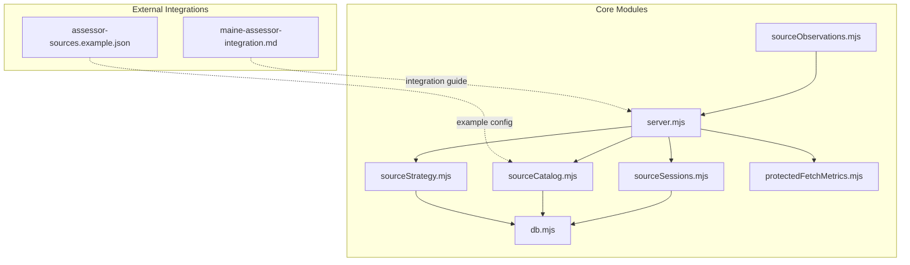
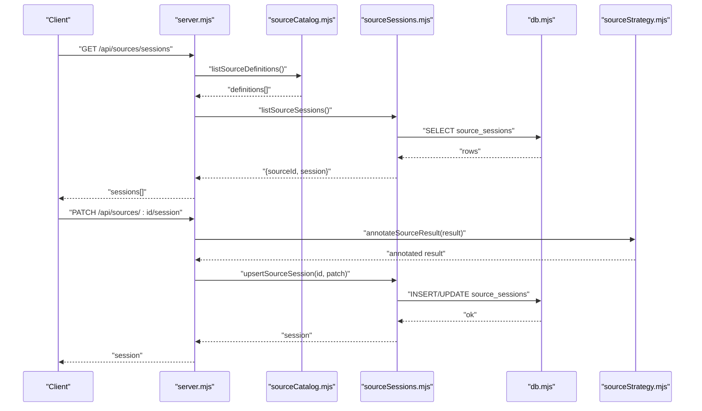
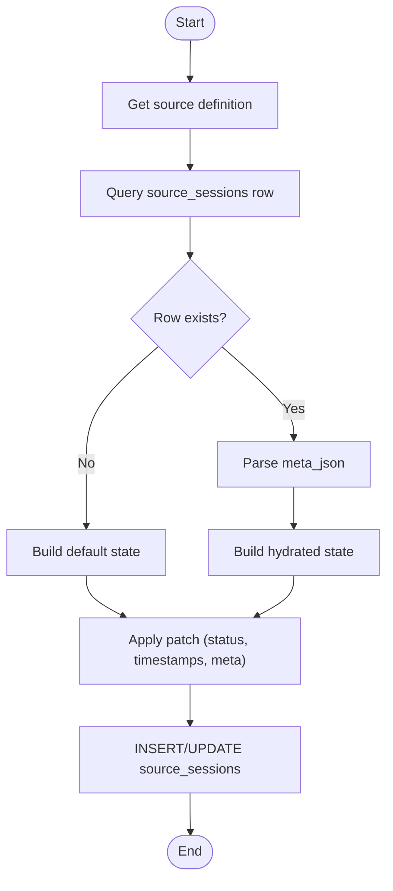
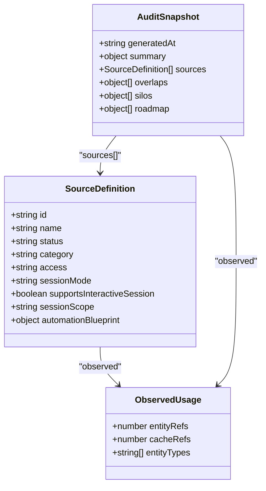
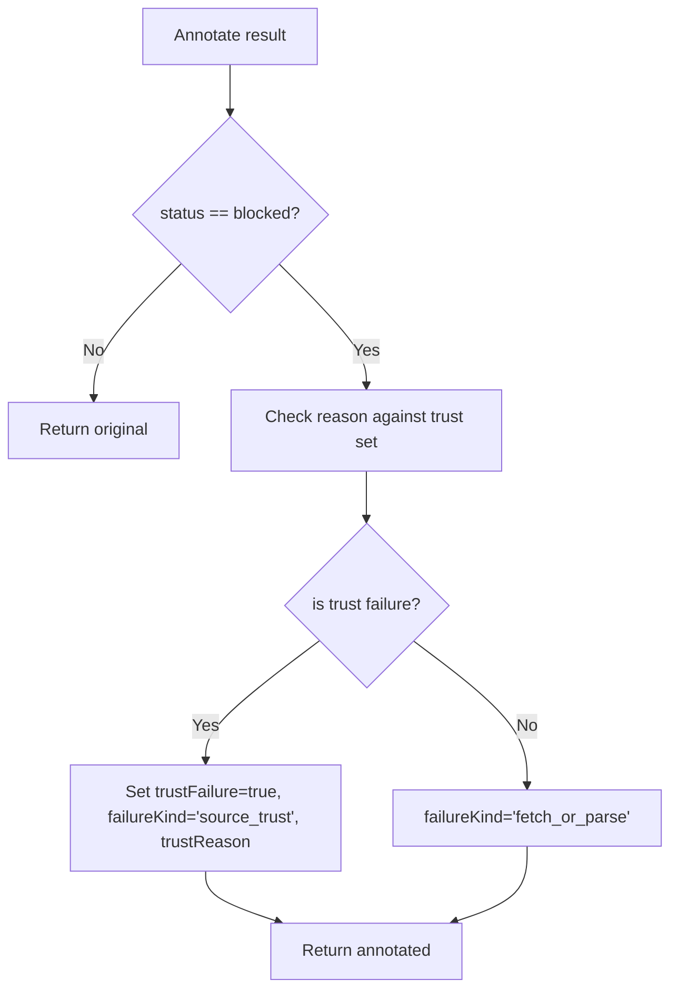
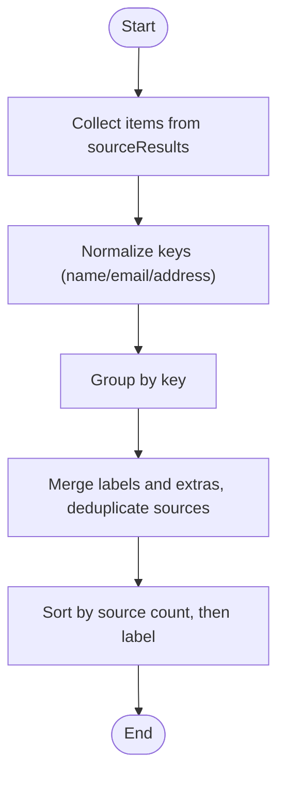
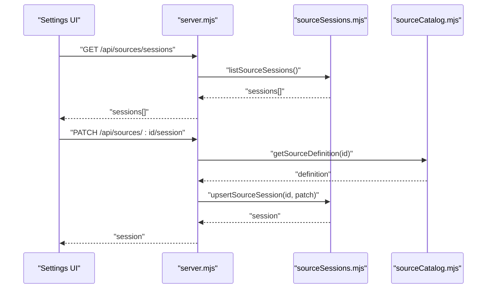
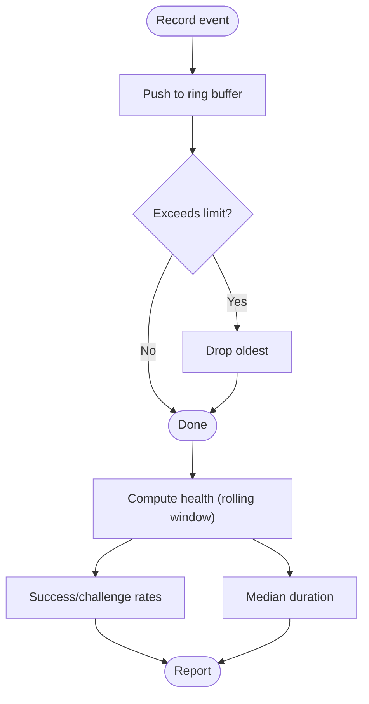
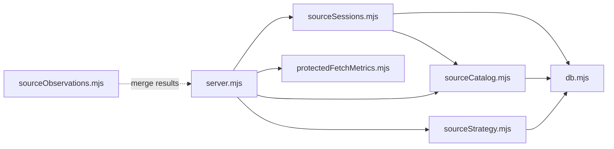

# Source Sessions Management

<cite>
**Referenced Files in This Document**
- [sourceSessions.mjs](file://src/sourceSessions.mjs)
- [sourceCatalog.mjs](file://src/sourceCatalog.mjs)
- [sourceObservations.mjs](file://src/sourceObservations.mjs)
- [sourceStrategy.mjs](file://src/sourceStrategy.mjs)
- [db.mjs](file://src/db/db.mjs)
- [server.mjs](file://src/server.mjs)
- [protectedFetchMetrics.mjs](file://src/protectedFetchMetrics.mjs)
- [source-sessions.test.mjs](file://test/source-sessions.test.mjs)
- [source-catalog.test.mjs](file://test/source-catalog.test.mjs)
- [assessor-sources.example.json](file://docs/assessor-sources.example.json)
- [maine-assessor-integration.md](file://docs/maine-assessor-integration.md)
</cite>

## Table of Contents
1. [Introduction](#introduction)
2. [Project Structure](#project-structure)
3. [Core Components](#core-components)
4. [Architecture Overview](#architecture-overview)
5. [Detailed Component Analysis](#detailed-component-analysis)
6. [Dependency Analysis](#dependency-analysis)
7. [Performance Considerations](#performance-considerations)
8. [Troubleshooting Guide](#troubleshooting-guide)
9. [Conclusion](#conclusion)
10. [Appendices](#appendices)

## Introduction
This document explains the source sessions management system that coordinates external data sources, tracks session state, manages the source catalog, selects appropriate strategies, and maintains observation logging. It covers both beginner-friendly concepts and advanced implementation details for developers, including session lifecycle management, performance monitoring, and troubleshooting connectivity issues. The system centers around the “source catalog” (a registry of supported sources and their operational characteristics) and “observation logging” (structured telemetry for fetch health and outcome analytics).

## Project Structure
The source sessions management spans several modules:
- Session persistence and lifecycle: sourceSessions.mjs
- Source catalog and audit snapshots: sourceCatalog.mjs
- Observation merging and normalization: sourceObservations.mjs
- Strategy selection and trust scoring: sourceStrategy.mjs
- Database schema and helpers: db.mjs
- Server orchestration and session propagation: server.mjs
- Protected fetch metrics and health: protectedFetchMetrics.mjs
- Tests validating session behavior: source-sessions.test.mjs, source-catalog.test.mjs
- Example configurations and integration guidance: docs/assessor-sources.example.json, docs/maine-assessor-integration.md

**Diagram sources**
- [sourceSessions.mjs:1-172](file://src/sourceSessions.mjs#L1-L172)
- [sourceCatalog.mjs:1-722](file://src/sourceCatalog.mjs#L1-L722)
- [sourceObservations.mjs:1-137](file://src/sourceObservations.mjs#L1-L137)
- [sourceStrategy.mjs:1-208](file://src/sourceStrategy.mjs#L1-L208)
- [db.mjs:1-185](file://src/db/db.mjs#L1-L185)
- [server.mjs:1-200](file://src/server.mjs#L1-L200)
- [protectedFetchMetrics.mjs:1-71](file://src/protectedFetchMetrics.mjs#L1-L71)
- [assessor-sources.example.json:1-12](file://docs/assessor-sources.example.json#L1-L12)
- [maine-assessor-integration.md:1-155](file://docs/maine-assessor-integration.md#L1-L155)

**Section sources**
- [sourceSessions.mjs:1-172](file://src/sourceSessions.mjs#L1-L172)
- [sourceCatalog.mjs:1-722](file://src/sourceCatalog.mjs#L1-L722)
- [db.mjs:79-120](file://src/db/db.mjs#L79-L120)

## Core Components
- Source sessions: persistent state for each source, including status, pause state, timestamps, warnings, and metadata. Exposed via CRUD helpers and hydrated from the database.
- Source catalog: a registry of sources with operational attributes (session mode, interactive support, session scope, access model, and automation blueprint). Provides audit snapshots and usage aggregation.
- Strategy selection: logic for annotating results, detecting trust failures, ranking candidate URLs, and maintaining per-pattern statistics.
- Observation logging: merging and normalization of cross-source facts, plus protected fetch health metrics for runtime observability.
- Database schema: defines the source_sessions table and auxiliary tables for pattern stats and caches.

**Section sources**
- [sourceSessions.mjs:73-171](file://src/sourceSessions.mjs#L73-L171)
- [sourceCatalog.mjs:524-721](file://src/sourceCatalog.mjs#L524-L721)
- [sourceStrategy.mjs:27-208](file://src/sourceStrategy.mjs#L27-L208)
- [sourceObservations.mjs:75-137](file://src/sourceObservations.mjs#L75-L137)
- [db.mjs:79-120](file://src/db/db.mjs#L79-L120)

## Architecture Overview
The system orchestrates external data sources through a coordinated lifecycle:
- Source catalog defines capabilities and session expectations.
- Server exposes endpoints to inspect and update source sessions.
- Strategy module computes trust and ranking heuristics.
- Observation logging aggregates and normalizes results.
- Database persists session state and pattern statistics.

**Diagram sources**
- [server.mjs:174-191](file://src/server.mjs#L174-L191)
- [sourceCatalog.mjs:524-538](file://src/sourceCatalog.mjs#L524-L538)
- [sourceSessions.mjs:79-130](file://src/sourceSessions.mjs#L79-L130)
- [db.mjs:79-90](file://src/db/db.mjs#L79-L90)
- [sourceStrategy.mjs:39-51](file://src/sourceStrategy.mjs#L39-L51)

## Detailed Component Analysis

### Source Sessions Lifecycle
- Default state derivation: status depends on session mode and interactive support.
- Hydration: converts database rows to session objects, parsing JSON metadata and mapping paused flags.
- Upsert: merges incoming patches with current state, updating timestamps and metadata.
- Pausing/resuming: preserves prior status in metadata to restore context after resume.
- Reset: deletes persisted state and rehydrates defaults.

**Diagram sources**
- [sourceSessions.mjs:16-130](file://src/sourceSessions.mjs#L16-L130)
- [db.mjs:79-90](file://src/db/db.mjs#L79-L90)

**Section sources**
- [sourceSessions.mjs:16-171](file://src/sourceSessions.mjs#L16-L171)
- [source-sessions.test.mjs:29-80](file://test/source-sessions.test.mjs#L29-L80)

### Source Catalog and Audit Snapshots
- Source definitions include sessionMode, supportsInteractiveSession, sessionScope, and automation blueprints.
- Observed usage: counts entity and cache references per source, derived from persisted entities and enrichment cache keys.
- Audit snapshot: merges definitions, observed usage, and live session states; includes roadmap, silos, and browser-automation recommendations.

**Diagram sources**
- [sourceCatalog.mjs:3-437](file://src/sourceCatalog.mjs#L3-L437)
- [sourceCatalog.mjs:637-721](file://src/sourceCatalog.mjs#L637-L721)

**Section sources**
- [sourceCatalog.mjs:524-721](file://src/sourceCatalog.mjs#L524-L721)
- [source-catalog.test.mjs:5-46](file://test/source-catalog.test.mjs#L5-L46)

### Strategy Selection and Trust Scoring
- Trust failure detection: flags results as source_trust failures based on reason categories.
- Candidate URL ranking: assigns scores to That’s Them candidate patterns using per-pattern statistics.
- Persistence: loads and persists pattern stats to SQLite for adaptive strategy tuning.

**Diagram sources**
- [sourceStrategy.mjs:27-51](file://src/sourceStrategy.mjs#L27-L51)
- [sourceStrategy.mjs:158-208](file://src/sourceStrategy.mjs#L158-L208)

**Section sources**
- [sourceStrategy.mjs:27-208](file://src/sourceStrategy.mjs#L27-L208)

### Observation Logging and Merging
- Normalization: name, email, address keys are normalized for deduplication.
- Merging: aggregates items across sources, tracking labels and extras, and ordering by source count.

**Diagram sources**
- [sourceObservations.mjs:75-137](file://src/sourceObservations.mjs#L75-L137)

**Section sources**
- [sourceObservations.mjs:75-137](file://src/sourceObservations.mjs#L75-L137)

### Server Orchestration and Session Propagation
- Session state map: builds a map of current sessions for rendering and auditing.
- Scope-aware propagation: updates all members of a session scope together.
- Interactive session URL resolution: validates and resolves browser entry/check URLs from the catalog.

**Diagram sources**
- [server.mjs:174-200](file://src/server.mjs#L174-L200)
- [sourceSessions.mjs:79-130](file://src/sourceSessions.mjs#L79-L130)
- [sourceCatalog.mjs:532-538](file://src/sourceCatalog.mjs#L532-L538)

**Section sources**
- [server.mjs:174-200](file://src/server.mjs#L174-L200)

### Protected Fetch Metrics and Health
- Event recording: captures fetch attempts with status, duration, and challenge flags.
- Health computation: rolling window metrics for success rate, challenge rate, and median duration.

**Diagram sources**
- [protectedFetchMetrics.mjs:9-71](file://src/protectedFetchMetrics.mjs#L9-L71)

**Section sources**
- [protectedFetchMetrics.mjs:1-71](file://src/protectedFetchMetrics.mjs#L1-L71)

## Dependency Analysis
- sourceSessions.mjs depends on db.mjs for persistence and sourceCatalog.mjs for source definitions.
- server.mjs composes sourceSessions, sourceCatalog, sourceStrategy, and protectedFetchMetrics.
- sourceCatalog.mjs depends on db.mjs for observed usage aggregation and defines the audit snapshot schema.
- sourceStrategy.mjs depends on db.mjs for pattern stats persistence.
- sourceObservations.mjs is standalone but integrates with server-side merging.

**Diagram sources**
- [sourceSessions.mjs:1-2](file://src/sourceSessions.mjs#L1-L2)
- [sourceCatalog.mjs](file://src/sourceCatalog.mjs#L1)
- [server.mjs:54-90](file://src/server.mjs#L54-L90)
- [sourceStrategy.mjs](file://src/sourceStrategy.mjs#L1)
- [protectedFetchMetrics.mjs](file://src/protectedFetchMetrics.mjs#L1)
- [sourceObservations.mjs:1-3](file://src/sourceObservations.mjs#L1-L3)

**Section sources**
- [sourceSessions.mjs:1-2](file://src/sourceSessions.mjs#L1-L2)
- [server.mjs:54-90](file://src/server.mjs#L54-L90)

## Performance Considerations
- Session scope awareness: batch updates across related sources to maintain coherent state and reduce redundant checks.
- Metadata minimization: store only necessary JSON in meta_json; avoid large transient objects.
- Pattern stats persistence: periodically persist strategy stats to minimize recomputation and enable adaptive ranking.
- Protected fetch health: monitor rolling success and challenge rates to detect degradation and adjust retry/backoff strategies.
- Caching: leverage enrichment cache TTLs and protected fetch metrics to tune timeouts and reduce unnecessary retries.

[No sources needed since this section provides general guidance]

## Troubleshooting Guide
Common issues and resolutions:
- Session stuck in session_required: verify interactive session readiness and clear last warning details; use resetSourceSession to restore defaults.
- Paused sources show inactive effective status: confirm priorStatus preservation and resume to restore previous status.
- Browser challenge spikes: check protected fetch health metrics; consider fallback engines or cooldown adjustments.
- Source-specific connectivity: use source audit snapshots to correlate observed usage with session states; inspect automation blueprints for session requirements.

Practical steps:
- Inspect session state: GET /api/sources/sessions and filter by sourceId.
- Update status and warnings: PATCH /api/sources/:id/session with status and lastWarning fields.
- Reset problematic sources: DELETE or resetSourceSession to defaults.
- Review protected fetch events: listProtectedFetchEvents and getProtectedFetchHealth for recent trends.

**Section sources**
- [source-sessions.test.mjs:29-80](file://test/source-sessions.test.mjs#L29-L80)
- [protectedFetchMetrics.mjs:21-71](file://src/protectedFetchMetrics.mjs#L21-L71)

## Conclusion
The source sessions management system provides a robust foundation for coordinating external data sources. It combines a rich source catalog, lifecycle-aware session tracking, adaptive strategy selection, and observation logging to deliver visibility and control over source operations. By leveraging session scopes, trust scoring, and health metrics, teams can optimize performance, troubleshoot connectivity issues, and evolve toward more sophisticated browser worker pools.

[No sources needed since this section summarizes without analyzing specific files]

## Appendices

### Source Catalog Configuration Examples
- Example assessor source configuration: see [assessor-sources.example.json:1-12](file://docs/assessor-sources.example.json#L1-L12).
- Integration guidance for Maine assessors: see [maine-assessor-integration.md:55-155](file://docs/maine-assessor-integration.md#L55-L155).

**Section sources**
- [assessor-sources.example.json:1-12](file://docs/assessor-sources.example.json#L1-L12)
- [maine-assessor-integration.md:55-155](file://docs/maine-assessor-integration.md#L55-L155)