# Testing Framework

<cite>
**Referenced Files in This Document**
- [package.json](file://package.json)
- [README.md](file://README.md)
- [scripts/parse-selftest.mjs](file://scripts/parse-selftest.mjs)
- [scripts/probe-flare.mjs](file://scripts/probe-flare.mjs)
- [test/enrichment.test.mjs](file://test/enrichment.test.mjs)
- [test/source-adapters.test.mjs](file://test/source-adapters.test.mjs)
- [test/name-search-parser.test.mjs](file://test/name-search-parser.test.mjs)
- [test/profile-parser.test.mjs](file://test/profile-parser.test.mjs)
- [test/normalized-result.test.mjs](file://test/normalized-result.test.mjs)
- [test/source-catalog.test.mjs](file://test/source-catalog.test.mjs)
- [test/source-sessions.test.mjs](file://test/source-sessions.test.mjs)
- [test/candidate-leads.test.mjs](file://test/candidate-leads.test.mjs)
- [test/playwright-worker.test.mjs](file://test/playwright-worker.test.mjs)
- [test/fixture-phone-page.html](file://test/fixture-phone-page.html)
</cite>

## Table of Contents
1. [Introduction](#introduction)
2. [Project Structure](#project-structure)
3. [Core Components](#core-components)
4. [Architecture Overview](#architecture-overview)
5. [Detailed Component Analysis](#detailed-component-analysis)
6. [Dependency Analysis](#dependency-analysis)
7. [Performance Considerations](#performance-considerations)
8. [Troubleshooting Guide](#troubleshooting-guide)
9. [Conclusion](#conclusion)
10. [Appendices](#appendices)

## Introduction
This document describes the testing framework for unit testing and quality assurance across the application. It explains how test suites cover enrichment modules, parser functionality, source adapters, and system components. It documents testing strategies, mock configurations, and test data management, including the concept of “parser self-test” and “test fixtures.” Practical examples show how to execute tests, debug failures, and extend coverage. Guidance is provided for integrating tests into development workflows and continuous integration.

## Project Structure
The testing system is organized around Node.js built-in test runner with strict assertions and targeted test suites. Scripts support offline parser verification (“parser self-test”) and environment probing. Tests are grouped by functional domain and validated against both in-process mocks and controlled external conditions.

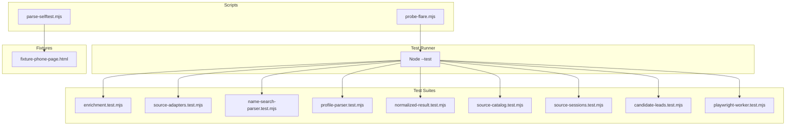

**Diagram sources**
- [package.json:9](file://package.json#L9)
- [scripts/parse-selftest.mjs:1-18](file://scripts/parse-selftest.mjs#L1-L18)
- [scripts/probe-flare.mjs:1-38](file://scripts/probe-flare.mjs#L1-L38)
- [test/enrichment.test.mjs:1-323](file://test/enrichment.test.mjs#L1-L323)
- [test/source-adapters.test.mjs:1-538](file://test/source-adapters.test.mjs#L1-L538)
- [test/name-search-parser.test.mjs:1-71](file://test/name-search-parser.test.mjs#L1-L71)
- [test/profile-parser.test.mjs:1-78](file://test/profile-parser.test.mjs#L1-L78)
- [test/normalized-result.test.mjs:1-184](file://test/normalized-result.test.mjs#L1-L184)
- [test/source-catalog.test.mjs:1-46](file://test/source-catalog.test.mjs#L1-L46)
- [test/source-sessions.test.mjs:1-80](file://test/source-sessions.test.mjs#L1-L80)
- [test/candidate-leads.test.mjs:1-90](file://test/candidate-leads.test.mjs#L1-L90)
- [test/playwright-worker.test.mjs:1-79](file://test/playwright-worker.test.mjs#L1-L79)
- [test/fixture-phone-page.html:1-29](file://test/fixture-phone-page.html#L1-L29)

**Section sources**
- [package.json:7-13](file://package.json#L7-L13)
- [README.md:155-160](file://README.md#L155-L160)

## Core Components
- Node test runner with strict assertions for deterministic, readable tests.
- Domain-focused test suites:
  - Enrichment: phone normalization, telecom classification, census and assessor enrichment.
  - Source adapters: parsers for TruePeopleSearch, That’s Them, FastPeopleSearch, and assessor HTML.
  - Parsers: name search and profile HTML parsing.
  - Normalized result: shared result envelope construction and graph rebuild conversion.
  - Source catalog and sessions: runtime audit snapshots and session lifecycle.
  - Candidate leads: database-backed candidate ingestion and review.
  - Playwright worker: popup page handling and challenge-aware page snapshot capture.
- Scripts:
  - Parser self-test: offline verification using a test fixture.
  - Flare probe: environment readiness check for protected fetch engines.

**Section sources**
- [test/enrichment.test.mjs:1-323](file://test/enrichment.test.mjs#L1-L323)
- [test/source-adapters.test.mjs:1-538](file://test/source-adapters.test.mjs#L1-L538)
- [test/name-search-parser.test.mjs:1-71](file://test/name-search-parser.test.mjs#L1-L71)
- [test/profile-parser.test.mjs:1-78](file://test/profile-parser.test.mjs#L1-L78)
- [test/normalized-result.test.mjs:1-184](file://test/normalized-result.test.mjs#L1-L184)
- [test/source-catalog.test.mjs:1-46](file://test/source-catalog.test.mjs#L1-L46)
- [test/source-sessions.test.mjs:1-80](file://test/source-sessions.test.mjs#L1-L80)
- [test/candidate-leads.test.mjs:1-90](file://test/candidate-leads.test.mjs#L1-L90)
- [test/playwright-worker.test.mjs:1-79](file://test/playwright-worker.test.mjs#L1-L79)
- [scripts/parse-selftest.mjs:1-18](file://scripts/parse-selftest.mjs#L1-L18)
- [scripts/probe-flare.mjs:1-38](file://scripts/probe-flare.mjs#L1-L38)

## Architecture Overview
The testing architecture separates concerns into:
- Unit tests for pure functions and small modules.
- Integration tests for parsers and adapters using controlled HTML fixtures.
- Environment tests for protected-fetch readiness and session state.
- Offline verification via parser self-test.

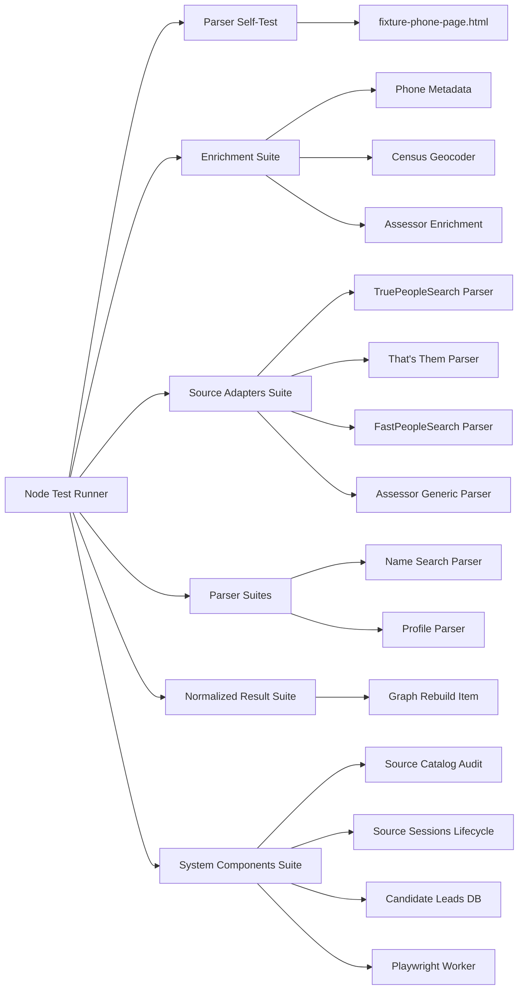

**Diagram sources**
- [package.json:9](file://package.json#L9)
- [test/fixture-phone-page.html:1-29](file://test/fixture-phone-page.html#L1-L29)
- [test/enrichment.test.mjs:1-323](file://test/enrichment.test.mjs#L1-L323)
- [test/source-adapters.test.mjs:1-538](file://test/source-adapters.test.mjs#L1-L538)
- [test/name-search-parser.test.mjs:1-71](file://test/name-search-parser.test.mjs#L1-L71)
- [test/profile-parser.test.mjs:1-78](file://test/profile-parser.test.mjs#L1-L78)
- [test/normalized-result.test.mjs:1-184](file://test/normalized-result.test.mjs#L1-L184)
- [test/source-catalog.test.mjs:1-46](file://test/source-catalog.test.mjs#L1-L46)
- [test/source-sessions.test.mjs:1-80](file://test/source-sessions.test.mjs#L1-L80)
- [test/candidate-leads.test.mjs:1-90](file://test/candidate-leads.test.mjs#L1-L90)
- [test/playwright-worker.test.mjs:1-79](file://test/playwright-worker.test.mjs#L1-L79)

## Detailed Component Analysis

### Parser Self-Test and Fixtures
- Purpose: Verify parser correctness without network or Flare.
- Mechanism: Read a small HTML fixture and assert parsed fields.
- Execution: npm script invokes the parser with the fixture and validates outputs.

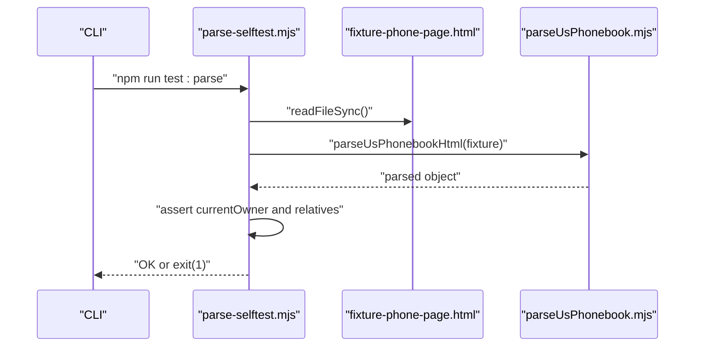

**Diagram sources**
- [scripts/parse-selftest.mjs:1-18](file://scripts/parse-selftest.mjs#L1-L18)
- [test/fixture-phone-page.html:1-29](file://test/fixture-phone-page.html#L1-L29)

**Section sources**
- [scripts/parse-selftest.mjs:1-18](file://scripts/parse-selftest.mjs#L1-L18)
- [README.md:155-160](file://README.md#L155-L160)

### Enrichment Module Tests
Coverage includes:
- Phone normalization and libphonenumber metadata.
- Telecom NANP classification.
- Census geocoder payload reduction to stable fields.
- Overpass nearby-place summarization.
- Assessor enrichment with configurable templates and platform drivers (including Vision).

Mock strategies:
- Environment variables to inject configuration (e.g., assessor templates).
- Global fetch replacement for platform-specific flows.
- Controlled timeouts and response bodies for deterministic outcomes.

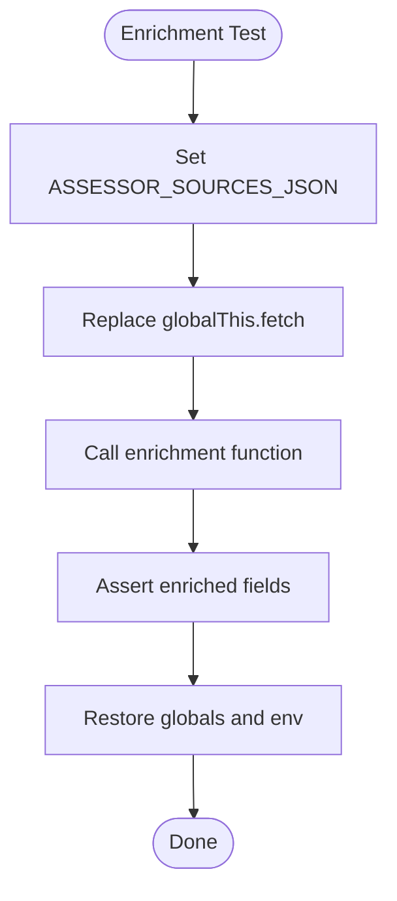

**Diagram sources**
- [test/enrichment.test.mjs:78-133](file://test/enrichment.test.mjs#L78-L133)
- [test/enrichment.test.mjs:135-236](file://test/enrichment.test.mjs#L135-L236)
- [test/enrichment.test.mjs:238-322](file://test/enrichment.test.mjs#L238-L322)

**Section sources**
- [test/enrichment.test.mjs:1-323](file://test/enrichment.test.mjs#L1-L323)

### Source Adapter Tests
Coverage includes:
- Parsing phone/name results from TruePeopleSearch, That’s Them, and FastPeopleSearch.
- Handling anti-bot signals (Cloudflare, humanity checks).
- Deduplication of repeated containers and robustness against stale challenge text.
- Merging cross-source facts and annotating trust failures.
- Telecom enrichment and assessor generic parsing.

Mock strategies:
- Inline HTML fixtures for each adapter.
- Pattern-based candidate ranking and outcome statistics for That’s Them.
- Platform-specific fetch orchestration for Vision-based assessors.

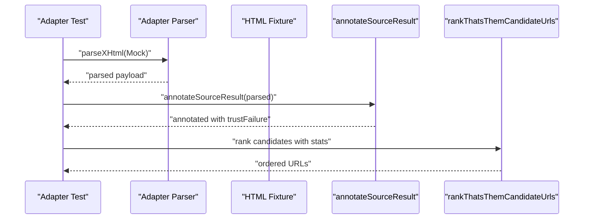

**Diagram sources**
- [test/source-adapters.test.mjs:29-48](file://test/source-adapters.test.mjs#L29-L48)
- [test/source-adapters.test.mjs:89-119](file://test/source-adapters.test.mjs#L89-L119)
- [test/source-adapters.test.mjs:361-390](file://test/source-adapters.test.mjs#L361-L390)

**Section sources**
- [test/source-adapters.test.mjs:1-538](file://test/source-adapters.test.mjs#L1-L538)

### Parser Tests (Name Search and Profile)
- Name search parser: extracts query metadata and candidate records from a result page.
- Profile parser: deduplicates canonical addresses, merges overlapping periods, and cleans empty fields.

Mock strategies:
- Inline HTML strings simulating real DOM structures.
- Assertions on normalized and deduplicated outputs.

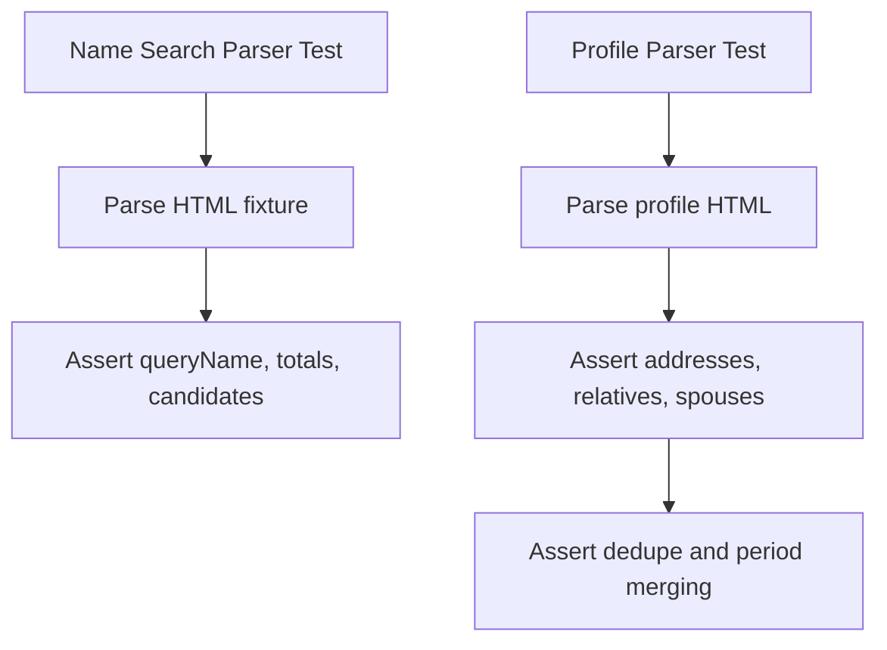

**Diagram sources**
- [test/name-search-parser.test.mjs:5-70](file://test/name-search-parser.test.mjs#L5-L70)
- [test/profile-parser.test.mjs:5-54](file://test/profile-parser.test.mjs#L5-L54)
- [test/profile-parser.test.mjs:57-77](file://test/profile-parser.test.mjs#L57-L77)

**Section sources**
- [test/name-search-parser.test.mjs:1-71](file://test/name-search-parser.test.mjs#L1-L71)
- [test/profile-parser.test.mjs:1-78](file://test/profile-parser.test.mjs#L1-L78)

### Normalized Result and Graph Rebuild
- Normalization: constructs a shared envelope for phone/name/profile payloads with consistent fields and graph eligibility.
- Graph rebuild: converts normalized envelopes into ingest items for downstream systems.

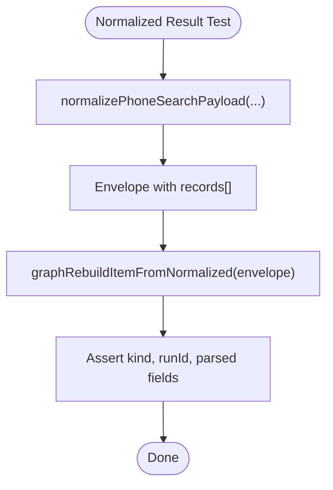

**Diagram sources**
- [test/normalized-result.test.mjs:10-46](file://test/normalized-result.test.mjs#L10-L46)
- [test/normalized-result.test.mjs:140-162](file://test/normalized-result.test.mjs#L140-L162)
- [test/normalized-result.test.mjs:164-183](file://test/normalized-result.test.mjs#L164-L183)

**Section sources**
- [test/normalized-result.test.mjs:1-184](file://test/normalized-result.test.mjs#L1-L184)

### Source Catalog and Sessions
- Source catalog audit: aggregates observed usage and overlays live session state.
- Source sessions: lifecycle tests for session status transitions, pausing/resuming, and resets.

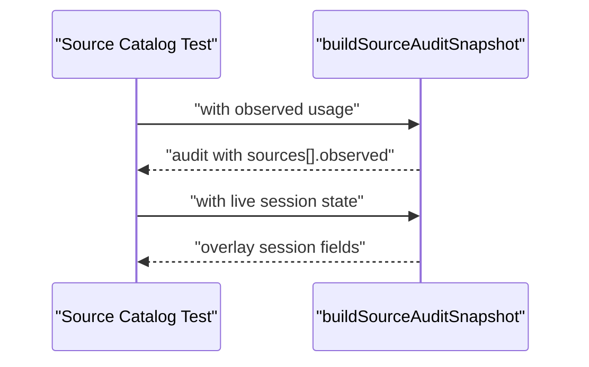

**Diagram sources**
- [test/source-catalog.test.mjs:5-18](file://test/source-catalog.test.mjs#L5-L18)
- [test/source-catalog.test.mjs:30-45](file://test/source-catalog.test.mjs#L30-L45)

**Section sources**
- [test/source-catalog.test.mjs:1-46](file://test/source-catalog.test.mjs#L1-L46)
- [test/source-sessions.test.mjs:1-80](file://test/source-sessions.test.mjs#L1-L80)

### Candidate Leads
- Upsert, list, and review candidate leads with merging of evidence and context by source+URL.
- Database lifecycle managed via beforeEach/after hooks.

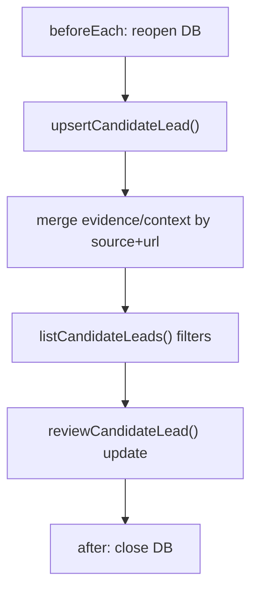

**Diagram sources**
- [test/candidate-leads.test.mjs:14-20](file://test/candidate-leads.test.mjs#L14-L20)
- [test/candidate-leads.test.mjs:22-52](file://test/candidate-leads.test.mjs#L22-L52)
- [test/candidate-leads.test.mjs:54-79](file://test/candidate-leads.test.mjs#L54-L79)
- [test/candidate-leads.test.mjs:81-89](file://test/candidate-leads.test.mjs#L81-L89)

**Section sources**
- [test/candidate-leads.test.mjs:1-90](file://test/candidate-leads.test.mjs#L1-L90)

### Playwright Worker
- Popup page cleanup: distinguishes real popups from normal pages.
- Challenge-aware snapshot capture: waits for anti-bot pages to settle before reporting results.

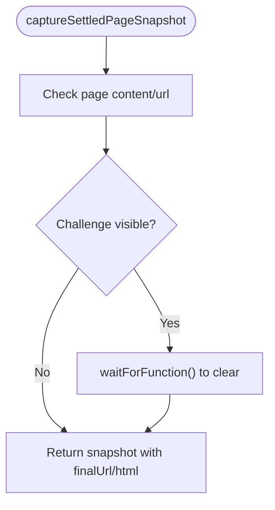

**Diagram sources**
- [test/playwright-worker.test.mjs:36-57](file://test/playwright-worker.test.mjs#L36-L57)
- [test/playwright-worker.test.mjs:59-78](file://test/playwright-worker.test.mjs#L59-L78)

**Section sources**
- [test/playwright-worker.test.mjs:1-79](file://test/playwright-worker.test.mjs#L1-L79)

## Dependency Analysis
- Test runner invocation and grouping are defined in package scripts.
- Parser self-test depends on a dedicated fixture file.
- Enrichment and source adapter tests rely on environment variables and global fetch mocking.
- Source sessions and candidate leads tests depend on an in-memory SQLite database initialized per test.

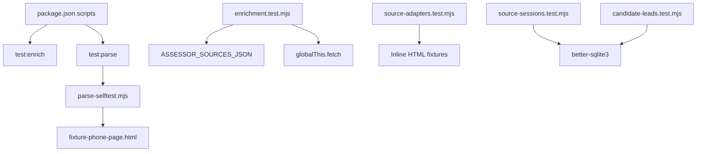

**Diagram sources**
- [package.json:9](file://package.json#L9)
- [scripts/parse-selftest.mjs:7](file://scripts/parse-selftest.mjs#L7)
- [test/fixture-phone-page.html:1](file://test/fixture-phone-page.html#L1)
- [test/enrichment.test.mjs:78-133](file://test/enrichment.test.mjs#L78-L133)
- [test/source-adapters.test.mjs:29-48](file://test/source-adapters.test.mjs#L29-L48)
- [test/source-sessions.test.mjs:6](file://test/source-sessions.test.mjs#L6)
- [test/candidate-leads.test.mjs:6](file://test/candidate-leads.test.mjs#L6)

**Section sources**
- [package.json:7-13](file://package.json#L7-L13)
- [scripts/parse-selftest.mjs:1-18](file://scripts/parse-selftest.mjs#L1-L18)
- [test/enrichment.test.mjs:1-323](file://test/enrichment.test.mjs#L1-L323)
- [test/source-adapters.test.mjs:1-538](file://test/source-adapters.test.mjs#L1-L538)
- [test/source-sessions.test.mjs:1-80](file://test/source-sessions.test.mjs#L1-L80)
- [test/candidate-leads.test.mjs:1-90](file://test/candidate-leads.test.mjs#L1-L90)

## Performance Considerations
- Prefer inline fixtures and deterministic mocks to avoid flaky network-dependent tests.
- Use environment variables to control timeouts and caching for enrichment tests.
- Keep assertion scopes narrow to surface precise failure causes quickly.
- Group related tests to minimize cold-start overhead during local runs.

## Troubleshooting Guide
Common issues and resolutions:
- Parser self-test fails:
  - Validate fixture path and content.
  - Confirm parser expectations align with fixture structure.
  - See [scripts/parse-selftest.mjs:7](file://scripts/parse-selftest.mjs#L7) and [test/fixture-phone-page.html:1](file://test/fixture-phone-page.html#L1).
- Assessor enrichment tests fail:
  - Ensure ASSESSOR_SOURCES_JSON is set before calling enrichment functions.
  - Restore globalThis.fetch after tests.
  - See [test/enrichment.test.mjs:78-133](file://test/enrichment.test.mjs#L78-L133) and [test/enrichment.test.mjs:135-236](file://test/enrichment.test.mjs#L135-L236).
- Anti-bot detection false positives:
  - Confirm parsers handle challenge pages and ignore stale footers.
  - See [test/source-adapters.test.mjs:89-119](file://test/source-adapters.test.mjs#L89-L119) and [test/playwright-worker.test.mjs:36-57](file://test/playwright-worker.test.mjs#L36-L57).
- Session state inconsistencies:
  - Initialize DB per test and close after suite.
  - See [test/source-sessions.test.mjs:21-27](file://test/source-sessions.test.mjs#L21-L27) and [test/candidate-leads.test.mjs:14-20](file://test/candidate-leads.test.mjs#L14-L20).
- Flare connectivity issues:
  - Use the probe script to validate environment readiness.
  - See [scripts/probe-flare.mjs:1-38](file://scripts/probe-flare.mjs#L1-L38) and [README.md:24-30](file://README.md#L24-L30).

**Section sources**
- [scripts/parse-selftest.mjs:1-18](file://scripts/parse-selftest.mjs#L1-L18)
- [test/enrichment.test.mjs:78-133](file://test/enrichment.test.mjs#L78-L133)
- [test/enrichment.test.mjs:135-236](file://test/enrichment.test.mjs#L135-L236)
- [test/source-adapters.test.mjs:89-119](file://test/source-adapters.test.mjs#L89-L119)
- [test/playwright-worker.test.mjs:36-57](file://test/playwright-worker.test.mjs#L36-L57)
- [test/source-sessions.test.mjs:21-27](file://test/source-sessions.test.mjs#L21-L27)
- [test/candidate-leads.test.mjs:14-20](file://test/candidate-leads.test.mjs#L14-L20)
- [scripts/probe-flare.mjs:1-38](file://scripts/probe-flare.mjs#L1-L38)
- [README.md:24-30](file://README.md#L24-L30)

## Conclusion
The testing framework combines offline parser verification, targeted enrichment and adapter tests, normalized result validation, and system lifecycle tests. It leverages environment variables, global mocks, and fixtures to ensure reliable, deterministic outcomes. The scripts and suites integrate cleanly with development workflows and can be extended to cover new parsers, adapters, and enrichment layers.

## Appendices

### Practical Examples

- Execute enrichment and parser tests:
  - Use the dedicated script to run a curated set of tests.
  - See [package.json:9](file://package.json#L9).

- Run parser self-test:
  - Validates parser logic without network or Flare.
  - See [scripts/parse-selftest.mjs:1-18](file://scripts/parse-selftest.mjs#L1-L18).

- Probe Flare readiness:
  - Ensures protected-fetch environment is reachable.
  - See [scripts/probe-flare.mjs:1-38](file://scripts/probe-flare.mjs#L1-L38) and [README.md:24-30](file://README.md#L24-L30).

- Debugging test failures:
  - For enrichment tests, confirm ASSESSOR_SOURCES_JSON and fetch mocks.
  - For parsers, compare fixture content with assertion expectations.
  - For sessions/leads, verify DB initialization and teardown hooks.
  - See [test/enrichment.test.mjs:78-133](file://test/enrichment.test.mjs#L78-L133), [test/source-adapters.test.mjs:29-48](file://test/source-adapters.test.mjs#L29-L48), [test/source-sessions.test.mjs:21-27](file://test/source-sessions.test.mjs#L21-L27), [test/candidate-leads.test.mjs:14-20](file://test/candidate-leads.test.mjs#L14-L20).

- Extending test coverage:
  - Add new parser tests with inline HTML fixtures.
  - Add enrichment tests using environment variables and fetch mocks.
  - Add normalized result tests for new payload kinds.
  - Add system tests for new session states or DB-backed entities.
  - Reference patterns in [test/name-search-parser.test.mjs:1-71](file://test/name-search-parser.test.mjs#L1-L71), [test/profile-parser.test.mjs:1-78](file://test/profile-parser.test.mjs#L1-L78), [test/enrichment.test.mjs:1-323](file://test/enrichment.test.mjs#L1-L323), [test/normalized-result.test.mjs:1-184](file://test/normalized-result.test.mjs#L1-L184), [test/source-catalog.test.mjs:1-46](file://test/source-catalog.test.mjs#L1-L46), [test/source-sessions.test.mjs:1-80](file://test/source-sessions.test.mjs#L1-L80), [test/candidate-leads.test.mjs:1-90](file://test/candidate-leads.test.mjs#L1-L90), [test/playwright-worker.test.mjs:1-79](file://test/playwright-worker.test.mjs#L1-L79).

### Best Practices
- Keep fixtures minimal and representative.
- Use beforeEach/after hooks for database and global replacements.
- Prefer environment variables for configuration over hard-coded values.
- Assert domain-relevant fields and edge cases (e.g., deduplication, anti-bot handling).
- Group related tests to streamline CI runs and local debugging.